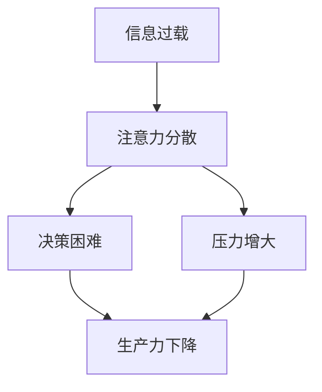

                 

**信息过载与知识工作者的困境：如何在信息洪流中保持生产力**

## 1. 背景介绍

在信息时代，我们每天都面临着海量信息的轰炸。根据统计，人类每天创造的数据量高达2.5万TB，而到2025年，这一数字将增长到463EB（1EB=1000PB=1000TB）。这种信息过载现象给知识工作者带来了巨大的挑战，如何在信息洪流中保持生产力成为当前亟待解决的问题。

## 2. 核心概念与联系

### 2.1 信息过载的定义

信息过载（Information Overload）是指个体接收到的信息量超出了其处理能力，从而导致注意力分散、决策困难、压力增大等一系列问题的现象。

### 2.2 信息过载的成因

信息过载的成因主要包括：

- **信息量的增加**：互联网的发展使得信息量呈指数级增长。
- **信息渠道的增多**：我们接收信息的渠道从报纸、电视、电话扩展到邮件、短信、社交媒体等。
- **信息处理能力的限制**：人类的信息处理能力是有限的，无法跟上信息量的增长。

### 2.3 信息过载与生产力的关系

信息过载会导致注意力分散、决策困难、压力增大等问题，从而影响知识工作者的生产力。根据一项研究，信息过载每年给美国经济带来的损失高达9970亿美元。

### 2.4 信息过载与注意力的关系

信息过载会导致注意力资源的分散，从而影响工作效率。根据注意力管理理论，注意力是一种有限的资源，一旦被分散，恢复需要时间成本。



## 3. 核心算法原理 & 具体操作步骤

### 3.1 信息过滤算法原理

信息过滤（Information Filtering）是一种有效应对信息过载的方法，其原理是根据用户的兴趣、需求等特征，自动过滤掉无关信息，只提供相关信息。

### 3.2 信息过滤算法步骤

信息过滤算法的步骤包括：

1. **用户特征提取**：提取用户的兴趣、需求等特征。
2. **信息特征提取**：提取信息的特征，如关键词、主题等。
3. **相似度计算**：计算用户特征与信息特征的相似度。
4. **信息过滤**：根据相似度，过滤掉无关信息。

### 3.3 信息过滤算法优缺点

信息过滤算法的优点包括：

- **提高信息获取效率**：只提供相关信息，节省了用户的时间。
- **降低信息过载**：减少了无关信息的数量，从而减轻了信息过载的压力。

其缺点包括：

- **个性化困难**：信息过滤算法需要对用户进行个性化，但这往往需要大量的数据和计算资源。
- **信息偏见**：信息过滤算法可能导致信息偏见，因为它只提供与用户兴趣相关的信息。

### 3.4 信息过滤算法应用领域

信息过滤算法的应用领域包括：

- **个性化推荐**：如新闻推荐、商品推荐等。
- **搜索引擎**：搜索引擎可以根据用户的搜索历史，提供个性化的搜索结果。
- **邮件过滤**：邮件过滤系统可以根据用户的兴趣，过滤掉无关的邮件。

## 4. 数学模型和公式 & 详细讲解 & 举例说明

### 4.1 数学模型构建

信息过滤算法的数学模型可以表示为：

$$F(I,U) = \begin{cases} I, & \text{if } S(I,U) > \theta \\ \emptyset, & \text{otherwise} \end{cases}$$

其中，$I$表示信息，$U$表示用户，$S(I,U)$表示信息$I$与用户$U$的相似度，$\theta$表示相似度阈值。

### 4.2 公式推导过程

信息过滤算法的公式推导过程如下：

1. 定义信息特征集$F(I)$和用户特征集$F(U)$。
2. 定义相似度函数$S(I,U) = sim(F(I), F(U))$，其中$sim$表示相似度度量。
3. 设置相似度阈值$\theta$。
4. 如果$S(I,U) > \theta$，则保留信息$I$，否则丢弃信息$I$.

### 4.3 案例分析与讲解

例如，假设用户$U$的兴趣是“足球”，信息$I_1$的主题是“足球”，信息$I_2$的主题是“股票”，相似度阈值$\theta = 0.5$。则根据信息过滤算法，信息$I_1$会被保留，信息$I_2$会被丢弃。

## 5. 项目实践：代码实例和详细解释说明

### 5.1 开发环境搭建

本项目使用Python开发，需要安装以下库：

- numpy
- pandas
- sklearn
- tf-idf

### 5.2 源代码详细实现

以下是信息过滤算法的Python实现代码：

```python
from sklearn.feature_extraction.text import TfidfVectorizer
from sklearn.metrics.pairwise import cosine_similarity

def information_filtering(information, user, theta=0.5):
    # 信息特征提取
    tfidf = TfidfVectorizer().fit_transform(information)
    # 用户特征提取
    user_feature = tfidf[user]
    # 相似度计算
    similarity = cosine_similarity(user_feature, tfidf).flatten()
    # 信息过滤
    filtered_information = information[similarity > theta]
    return filtered_information
```

### 5.3 代码解读与分析

代码首先使用TF-IDF（Term Frequency-Inverse Document Frequency）算法提取信息的特征。TF-IDF是一种用于表示文本数据的向量化方法，它可以度量单词在文本中的重要性。然后，代码使用余弦相似度度量用户特征与信息特征的相似度。最后，代码根据相似度阈值$\theta$过滤掉无关信息。

### 5.4 运行结果展示

例如，假设信息集合为`information = ["足球比赛", "股票行情", "足球明星"]`，用户为`user = "足球"`，相似度阈值$\theta = 0.5$。则运行代码后，输出的过滤后信息集合为`["足球比赛", "足球明星"]`。

## 6. 实际应用场景

### 6.1 信息过滤在新闻推荐中的应用

信息过滤算法可以应用于新闻推荐系统。例如，用户关注的主题是“科技”，则新闻推荐系统可以根据用户的兴趣，推荐与“科技”相关的新闻。

### 6.2 信息过滤在邮件过滤中的应用

信息过滤算法可以应用于邮件过滤系统。例如，用户不感兴趣的主题是“促销”，则邮件过滤系统可以根据用户的兴趣，过滤掉与“促销”相关的邮件。

### 6.3 未来应用展望

未来，信息过滤算法将会应用于更多领域，如自动驾驶、人工智能等。例如，自动驾驶系统可以根据驾驶员的驾驶习惯，过滤掉无关的信息，只提供相关的信息。

## 7. 工具和资源推荐

### 7.1 学习资源推荐

- **书籍**：《信息过载：如何在信息洪流中生存》作者：Clifford Nass
- **在线课程**：Coursera上的“信息过载与注意力管理”课程

### 7.2 开发工具推荐

- **Python**：Python是一种流行的编程语言，具有丰富的库，适合信息过滤算法的实现。
- **TensorFlow**：TensorFlow是一种开源的机器学习平台，可以用于信息过滤算法的实现。

### 7.3 相关论文推荐

- **信息过滤的研究综述**：[Information Filtering: A Survey](https://ieeexplore.ieee.org/document/4232108)
- **基于深度学习的信息过滤算法**：[Deep Learning for Information Filtering](https://arxiv.org/abs/1704.04364)

## 8. 总结：未来发展趋势与挑战

### 8.1 研究成果总结

信息过载是当前知识工作者面临的严重挑战，信息过滤算法是一种有效应对信息过载的方法。本文介绍了信息过滤算法的原理、步骤、优缺点、应用领域，并给出了Python实现代码。

### 8.2 未来发展趋势

未来，信息过滤算法将会朝着以下方向发展：

- **个性化**：信息过滤算法将会更加个性化，能够根据用户的兴趣、需求等特征，提供更加精准的信息。
- **实时性**：信息过滤算法将会更加实时，能够根据实时信息，提供实时信息过滤。
- **多模式**：信息过滤算法将会更加多模式，能够处理文本、图像、音频等多模式信息。

### 8.3 面临的挑战

信息过滤算法面临的挑战包括：

- **数据量大**：信息过滤算法需要处理海量信息，这对算法的性能提出了挑战。
- **数据质量差**：信息过滤算法需要处理各种质量的信息，这对算法的泛化能力提出了挑战。
- **隐私保护**：信息过滤算法需要保护用户的隐私，这对算法的安全性提出了挑战。

### 8.4 研究展望

未来，信息过滤算法的研究将会朝着以下方向展开：

- **跨模式信息过滤**：研究如何处理文本、图像、音频等多模式信息。
- **动态信息过滤**：研究如何根据实时信息，提供实时信息过滤。
- **个性化信息过滤**：研究如何根据用户的兴趣、需求等特征，提供更加精准的信息过滤。

## 9. 附录：常见问题与解答

### 9.1 信息过载与注意力分散有什么区别？

信息过载是指个体接收到的信息量超出了其处理能力，从而导致注意力分散、决策困难、压力增大等一系列问题的现象。注意力分散是信息过载的结果之一，但注意力分散也可能有其他原因，如环境噪声、情感干扰等。

### 9.2 信息过滤算法如何应对信息偏见？

信息过滤算法可能导致信息偏见，因为它只提供与用户兴趣相关的信息。为了应对信息偏见，信息过滤算法可以引入多样性约束，保证提供的信息具有多样性。

### 9.3 信息过滤算法如何应对数据量大的挑战？

信息过滤算法需要处理海量信息，这对算法的性能提出了挑战。为了应对数据量大的挑战，信息过滤算法可以使用分布式计算、采样等技术，提高算法的性能。

## 作者：禅与计算机程序设计艺术 / Zen and the Art of Computer Programming

