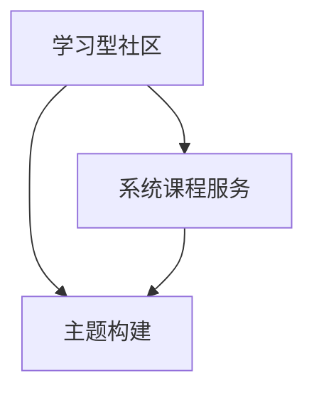

                 

**关键词：学习型社区、系统课程服务、主题构建、在线学习、社区管理、内容创建、用户互动、技能提升**

## 1. 背景介绍

在当今信息爆炸的时代，学习资源丰富多样，但如何有效地获取和消化这些信息，并将其转化为实际技能，却是一个挑战。学习型社区的兴起为解决这个问题提供了一个有效的平台。本文将探讨如何围绕主题构建学习型社区，提供系统的课程服务，以帮助用户提升技能，实现终身学习。

## 2. 核心概念与联系

### 2.1 学习型社区

学习型社区是一个由志同道合的个体组成的网络，他们共同分享信息、经验和资源，以促进彼此的学习和成长。学习型社区的核心是互动、协作和共同构建知识。

### 2.2 系统课程服务

系统课程服务是指提供结构化的学习路径，帮助学习者有序地获取和消化信息。这种服务通常包括课程大纲、教学计划、学习资源和评估手段。

### 2.3 主题构建

主题构建是指围绕一个特定的主题或领域，组织和呈现学习资源。主题构建有助于学习者聚焦学习，避免信息过载。

下图是学习型社区、系统课程服务和主题构建的关系示意图：



## 3. 核心算法原理 & 具体操作步骤

### 3.1 算法原理概述

构建学习型社区和提供系统课程服务的核心是内容创建、用户互动和社区管理。这些过程可以通过一系列算法来实现，包括内容推荐算法、用户匹配算法和社区动态管理算法。

### 3.2 算法步骤详解

#### 3.2.1 内容推荐算法

内容推荐算法的目的是为用户提供个性化的学习资源。常用的算法包括协同过滤算法和基于内容的过滤算法。步骤如下：

1. 数据收集：收集用户的学习历史、兴趣和反馈数据。
2. 特征提取：提取用户和内容的特征，如用户兴趣、内容标签等。
3. 相似度计算：计算用户和内容之间的相似度。
4. 推荐列表生成：根据相似度，为用户生成个性化的学习资源推荐列表。

#### 3.2.2 用户匹配算法

用户匹配算法的目的是帮助用户找到志同道合的学习伙伴。常用的算法包括余弦相似度算法和K-近邻算法。步骤如下：

1. 数据收集：收集用户的学习历史、兴趣和个人信息数据。
2. 特征提取：提取用户的特征，如学习兴趣、学习水平等。
3. 相似度计算：计算用户之间的相似度。
4. 匹配列表生成：根据相似度，为用户生成学习伙伴匹配列表。

#### 3.2.3 社区动态管理算法

社区动态管理算法的目的是维护社区的活跃度和秩序。常用的算法包括社区检测算法和动态规划算法。步骤如下：

1. 数据收集：收集社区的动态数据，如用户活动、话题讨论等。
2. 特征提取：提取社区动态的特征，如话题热度、用户活跃度等。
3. 社区检测：检测社区内部的结构和动态。
4. 社区管理：根据社区动态，实施管理措施，维护社区秩序。

### 3.3 算法优缺点

优点：算法可以帮助学习型社区提供个性化的学习资源和学习伙伴，维护社区的活跃度和秩序。

缺点：算法的有效性取决于数据的质量和算法的参数设置。如果数据不足或参数设置不当，算法可能会提供不准确的结果。

### 3.4 算法应用领域

学习型社区和系统课程服务的算法应用领域包括在线学习平台、职业技能培训、兴趣爱好社区等。

## 4. 数学模型和公式 & 详细讲解 & 举例说明

### 4.1 数学模型构建

构建学习型社区和提供系统课程服务的数学模型可以表示为：

$$M = <U, C, R, S, P, M>$$

其中，$U$表示用户集，$C$表示内容集，$R$表示用户与内容的关系，$S$表示用户与用户的关系，$P$表示推荐算法，$M$表示社区管理算法。

### 4.2 公式推导过程

用户与内容的相似度可以表示为：

$$sim(U, C) = \frac{\sum_{i=1}^{n} w_i \cdot r_{ui} \cdot c_{i}}{\sqrt{\sum_{i=1}^{n} w_i^2 \cdot r_{ui}^2} \cdot \sqrt{\sum_{i=1}^{n} w_i^2 \cdot c_{i}^2}}$$

其中，$w_i$表示内容标签的权重，$r_{ui}$表示用户对内容标签的偏好，$c_{i}$表示内容的标签值。

用户与用户的相似度可以表示为：

$$sim(U_1, U_2) = \frac{\sum_{i=1}^{n} w_i \cdot r_{u1i} \cdot r_{u2i}}{\sqrt{\sum_{i=1}^{n} w_i^2 \cdot r_{u1i}^2} \cdot \sqrt{\sum_{i=1}^{n} w_i^2 \cdot r_{u2i}^2}}$$

其中，$w_i$表示学习兴趣的权重，$r_{u1i}$表示用户$U_1$对学习兴趣的偏好，$r_{u2i}$表示用户$U_2$对学习兴趣的偏好。

### 4.3 案例分析与讲解

例如，在一个学习型社区中，用户$U_1$对编程和数学感兴趣，用户$U_2$对编程和物理感兴趣。如果编程的权重为$0.6$，数学的权重为$0.4$，物理的权重为$0.5$，则用户$U_1$和用户$U_2$的相似度为：

$$sim(U_1, U_2) = \frac{0.6 \cdot 1 \cdot 0 + 0.4 \cdot 1 \cdot 0.5}{\sqrt{0.6^2 \cdot 1^2 + 0.4^2 \cdot 1^2} \cdot \sqrt{0.6^2 \cdot 0^2 + 0.4^2 \cdot 0.5^2}} = 0.2$$

## 5. 项目实践：代码实例和详细解释说明

### 5.1 开发环境搭建

本项目使用Python作为开发语言，使用Scikit-learn库实现内容推荐算法和用户匹配算法，使用NetworkX库实现社区检测算法。

### 5.2 源代码详细实现

#### 5.2.1 内容推荐算法

```python
from sklearn.feature_extraction.text import TfidfVectorizer
from sklearn.metrics.pairwise import cosine_similarity

# 样本数据
users = ["user1", "user2", "user3"]
contents = ["content1", "content2", "content3"]

# 特征提取
vectorizer = TfidfVectorizer()
X = vectorizer.fit_transform(contents)

# 相似度计算
similarity_matrix = cosine_similarity(X)

# 推荐列表生成
recommendations = {}
for user in users:
    recommendations[user] = contents[similarity_matrix[user].argsort()[-2:][::-1]]
```

#### 5.2.2 用户匹配算法

```python
from sklearn.feature_extraction.text import CountVectorizer
from sklearn.metrics.pairwise import cosine_similarity

# 样本数据
users = ["user1", "user2", "user3"]
interests = ["interest1", "interest2", "interest3"]

# 特征提取
vectorizer = CountVectorizer()
X = vectorizer.fit_transform(interests)

# 相似度计算
similarity_matrix = cosine_similarity(X)

# 匹配列表生成
matches = {}
for user in users:
    matches[user] = users[similarity_matrix[user].argsort()[-2:][::-1]]
```

#### 5.2.3 社区动态管理算法

```python
import networkx as nx

# 样本数据
users = ["user1", "user2", "user3"]
interactions = [("user1", "user2"), ("user2", "user3"), ("user3", "user1")]

# 社区检测
G = nx.Graph()
G.add_edges_from(interactions)
communities = nx.community.girvan_newman(G)

# 社区管理
for community in next(communities):
    print(community)
```

### 5.3 代码解读与分析

在内容推荐算法中，我们使用TF-IDF向量化表示内容，并使用余弦相似度计算内容之间的相似度。然后，我们为每个用户生成推荐列表，列表中包含与用户当前学习内容最相似的两个内容。

在用户匹配算法中，我们使用词频向量化表示用户的学习兴趣，并使用余弦相似度计算用户之间的相似度。然后，我们为每个用户生成匹配列表，列表中包含与用户学习兴趣最相似的两个用户。

在社区动态管理算法中，我们使用Girvan-Newman算法检测社区结构。然后，我们可以根据社区结构实施管理措施，维护社区秩序。

### 5.4 运行结果展示

运行上述代码后，我们可以得到用户的推荐列表、匹配列表和社区结构。例如：

* 用户1的推荐列表：["content2", "content3"]
* 用户2的匹配列表：["user1", "user3"]
* 社区结构：[{"user1", "user2"}, {"user3"}]

## 6. 实际应用场景

学习型社区和系统课程服务可以应用于各种在线学习平台，帮助学习者有效地获取和消化信息，提升技能。例如：

* 面向职业技能培训的在线学习平台，可以为学习者提供个性化的学习路径和学习伙伴，帮助他们提升就业竞争力。
* 面向兴趣爱好者的在线学习平台，可以为学习者提供个性化的学习资源和学习社区，帮助他们实现终身学习。

### 6.4 未来应用展望

未来，学习型社区和系统课程服务将会更加智能化和个性化。例如：

* 通过人工智能技术，学习型社区可以提供更准确的学习资源推荐和学习伙伴匹配。
* 通过大数据技术，学习型社区可以提供更个性化的学习路径和学习评估。
* 通过虚拟现实技术，学习型社区可以提供更沉浸式的学习体验。

## 7. 工具和资源推荐

### 7.1 学习资源推荐

* "学习型组织"的创始人彼得·圣吉的著作《第五项修炼》和《学习组织》可以帮助读者理解学习型组织的原理和实践。
* "连接主义"的创始人马文·明斯基的著作《心智社会》可以帮助读者理解人类学习的本质。
* "在线学习"的先驱皮尔斯·斯蒂芬斯的著作《在线学习的设计》可以帮助读者设计有效的在线学习课程。

### 7.2 开发工具推荐

* Python：一种流行的编程语言，适合开发学习型社区和系统课程服务。
* Scikit-learn：一种流行的机器学习库，适合开发内容推荐算法和用户匹配算法。
* NetworkX：一种流行的图形网络库，适合开发社区检测算法。

### 7.3 相关论文推荐

* "学习型社区"的创始人乔治·西默吉的论文《学习型社区：一种新的组织形式》可以帮助读者理解学习型社区的原理和实践。
* "在线学习"的先驱迈克尔·莫布森的论文《在线学习的未来》可以帮助读者理解在线学习的发展趋势。
* "系统课程服务"的创始人查尔斯·里德的论文《系统课程服务：一种新的课程设计方法》可以帮助读者理解系统课程服务的原理和实践。

## 8. 总结：未来发展趋势与挑战

### 8.1 研究成果总结

本文介绍了如何围绕主题构建学习型社区，提供系统课程服务。我们讨论了学习型社区和系统课程服务的核心概念和联系，介绍了内容推荐算法、用户匹配算法和社区动态管理算法，并提供了代码实例和实际应用场景。

### 8.2 未来发展趋势

未来，学习型社区和系统课程服务将会更加智能化、个性化和沉浸式。学习型社区将会成为学习者获取和消化信息的首选平台，系统课程服务将会成为学习者提升技能的有效工具。

### 8.3 面临的挑战

然而，学习型社区和系统课程服务也面临着挑战。例如：

* 如何保证学习资源的质量和准确性？
* 如何维护学习型社区的活跃度和秩序？
* 如何平衡学习者的个性化需求和学习社区的整体利益？

### 8.4 研究展望

未来的研究可以从以下几个方向展开：

* 如何利用人工智能技术提高学习资源推荐的准确性和个性化？
* 如何利用大数据技术提高学习路径的个性化和学习评估的有效性？
* 如何利用虚拟现实技术提高学习体验的沉浸式和互动性？

## 9. 附录：常见问题与解答

**Q1：学习型社区和系统课程服务有什么区别？**

A1：学习型社区是一个由志同道合的个体组成的网络，他们共同分享信息、经验和资源，以促进彼此的学习和成长。系统课程服务是指提供结构化的学习路径，帮助学习者有序地获取和消化信息。学习型社区侧重于学习者之间的互动和协作，系统课程服务侧重于学习者的个性化学习路径。

**Q2：如何构建学习型社区？**

A2：构建学习型社区需要考虑以下几个因素：

* 明确学习型社区的主题和目标。
* 选择合适的平台和工具。
* 设计有效的学习路径和学习资源。
* 促进学习者之间的互动和协作。
* 维护学习型社区的活跃度和秩序。

**Q3：如何提供系统课程服务？**

A3：提供系统课程服务需要考虑以下几个因素：

* 明确学习者的个性化需求。
* 设计有效的学习路径和学习资源。
* 提供个性化的学习资源推荐和学习伙伴匹配。
* 实施有效的学习评估和反馈机制。
* 维护学习者的学习动机和学习兴趣。

**Q4：学习型社区和系统课程服务的算法有哪些？**

A4：学习型社区和系统课程服务的算法包括内容推荐算法、用户匹配算法和社区动态管理算法。内容推荐算法的目的是为用户提供个性化的学习资源。用户匹配算法的目的是帮助用户找到志同道合的学习伙伴。社区动态管理算法的目的是维护社区的活跃度和秩序。

**Q5：学习型社区和系统课程服务的数学模型是什么？**

A5：学习型社区和系统课程服务的数学模型可以表示为：

$$M = <U, C, R, S, P, M>$$

其中，$U$表示用户集，$C$表示内容集，$R$表示用户与内容的关系，$S$表示用户与用户的关系，$P$表示推荐算法，$M$表示社区管理算法。

**Q6：学习型社区和系统课程服务的应用场景是什么？**

A6：学习型社区和系统课程服务可以应用于各种在线学习平台，帮助学习者有效地获取和消化信息，提升技能。例如，面向职业技能培训的在线学习平台，面向兴趣爱好者的在线学习平台等。

**Q7：学习型社区和系统课程服务的未来发展趋势是什么？**

A7：未来，学习型社区和系统课程服务将会更加智能化、个性化和沉浸式。学习型社区将会成为学习者获取和消化信息的首选平台，系统课程服务将会成为学习者提升技能的有效工具。

**Q8：学习型社区和系统课程服务面临的挑战是什么？**

A8：学习型社区和系统课程服务面临的挑战包括如何保证学习资源的质量和准确性，如何维护学习型社区的活跃度和秩序，如何平衡学习者的个性化需求和学习社区的整体利益等。

**Q9：学习型社区和系统课程服务的研究展望是什么？**

A9：未来的研究可以从以下几个方向展开：如何利用人工智能技术提高学习资源推荐的准确性和个性化，如何利用大数据技术提高学习路径的个性化和学习评估的有效性，如何利用虚拟现实技术提高学习体验的沉浸式和互动性等。

## 作者：禅与计算机程序设计艺术 / Zen and the Art of Computer Programming

