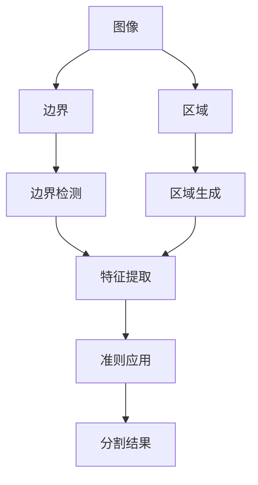

                 

**图像分割 (Image Segmentation) 原理与代码实例讲解**

**作者：禅与计算机程序设计艺术 / Zen and the Art of Computer Programming**

## 1. 背景介绍

图像分割是计算机视觉领域的一个关键任务，旨在将图像分成具有意义的、非重叠的区域。这些区域通常对应于图像中的物体、边界或其他感兴趣的区域。图像分割在目标检测、图像分类、图像理解和其他计算机视觉任务中扮演着至关重要的角色。

## 2. 核心概念与联系

图像分割的核心概念包括边界、区域、特征和准则。这些概念通过以下 Mermaid 流程图进行了总结：



## 3. 核心算法原理 & 具体操作步骤

### 3.1 算法原理概述

图像分割算法可以分为两大类：基于阈值的方法和基于区域的方法。基于阈值的方法通过设置阈值将图像分成前景和背景。基于区域的方法则将图像分成具有相似特征的区域。

### 3.2 算法步骤详解

以基于区域的图像分割算法为例，其步骤通常包括：

1. **特征提取**：提取图像的特征，如颜色、纹理、梯度等。
2. **区域生成**：基于特征，将图像分成初始区域。
3. **区域合并/分裂**：根据准则，合并或分裂区域，直到得到满意的结果。

### 3.3 算法优缺点

基于阈值的方法简单快速，但对初始阈值选择敏感，且无法处理具有连续特征的图像。基于区域的方法则可以处理连续特征，但计算复杂度高，且易受噪声影响。

### 3.4 算法应用领域

图像分割广泛应用于医学图像分析（如肿瘤检测）、遥感图像分析（如土地覆盖物检测）、视频监控（如目标跟踪）等领域。

## 4. 数学模型和公式 & 详细讲解 & 举例说明

### 4.1 数学模型构建

设图像 $I(x, y)$ 为 $M \times N$ 的灰度图像，其每个像素 $I(x, y)$ 取值为 $[0, L-1]$。图像分割的目标是将图像分成 $K$ 个互不重叠的区域 $R_1, R_2, \ldots, R_K$，使得：

$$I = \bigcup_{k=1}^{K} R_k$$

### 4.2 公式推导过程

设 $f_k(x, y)$ 为区域 $R_k$ 的特征函数，则区域 $R_k$ 可以表示为：

$$R_k = \{(x, y) | f_k(x, y) = 1, (x, y) \in I\}$$

区域 $R_k$ 的特征函数 $f_k(x, y)$ 通常是通过聚类算法或其他方法得到的。

### 4.3 案例分析与讲解

例如，在基于 k-均值算法的图像分割中，特征函数 $f_k(x, y)$ 可以表示为：

$$f_k(x, y) = \begin{cases} 1, & \text{if } d(I(x, y), \mu_k) \leq d(I(x, y), \mu_j), \forall j \neq k \\ 0, & \text{otherwise} \end{cases}$$

其中 $d(I(x, y), \mu_k)$ 为像素 $I(x, y)$ 到聚类中心 $\mu_k$ 的距离。

## 5. 项目实践：代码实例和详细解释说明

### 5.1 开发环境搭建

本项目使用 Python 语言，并依赖 OpenCV、NumPy、Matplotlib 等库。请确保已安装这些库，并导入它们：

```python
import cv2
import numpy as np
import matplotlib.pyplot as plt
```

### 5.2 源代码详细实现

以下是一个简单的基于 k-均值算法的图像分割实现：

```python
def k_means_segmentation(image, k, max_iters=100):
    # 将图像转换为LAB颜色空间，并提取L通道
    lab_image = cv2.cvtColor(image, cv2.COLOR_BGR2LAB)
    l_channel = lab_image[:, :, 0]

    # 初始化聚类中心
    centers = np.random.randint(0, 256, (k, 1))

    # 迭代聚类
    for _ in range(max_iters):
        # 计算每个像素到聚类中心的距离
        distances = np.sqrt((l_channel - centers[:, 0]) ** 2)

        # 将每个像素分配给最近的聚类中心
        labels = np.argmin(distances, axis=1)

        # 更新聚类中心
        for i in range(k):
            centers[i, 0] = np.mean(l_channel[labels == i])

    # 将标签转换为图像
    segmented_image = np.zeros_like(l_channel)
    for i in range(k):
        segmented_image[labels == i] = i

    return segmented_image
```

### 5.3 代码解读与分析

该函数接受一个图像和聚类数 $k$ 作为输入，并返回一个 $k$ 个区域的图像分割结果。函数首先将图像转换为LAB颜色空间，并提取L通道。然后，它初始化聚类中心，并进行最大迭代次数的聚类。在每次迭代中，它计算每个像素到聚类中心的距离，将每个像素分配给最近的聚类中心，并更新聚类中心。最后，它将标签转换为图像，并返回分割结果。

### 5.4 运行结果展示

```python
image = cv2.imread('input_image.jpg')
segmented_image = k_means_segmentation(image, k=3)
plt.imshow(segmented_image)
plt.show()
```

## 6. 实际应用场景

图像分割在计算机视觉领域有着广泛的应用。例如，在医学图像分析中，图像分割可以用于肿瘤检测、组织学图像分析等。在遥感图像分析中，图像分割可以用于土地覆盖物检测、环境监测等。在视频监控中，图像分割可以用于目标跟踪、人脸检测等。

### 6.4 未来应用展望

随着深度学习技术的发展，基于深度学习的图像分割方法已取得了显著的成功。未来，图像分割技术将继续发展，并应用于更多的领域，如自动驾驶、机器人视觉等。

## 7. 工具和资源推荐

### 7.1 学习资源推荐

- 图像分割相关的经典论文：
  - [Gonzalez, R. C., & Woods, R. E. (2008). Digital image processing. Pearson.](https://www.pearson.com/us/higher-education/program/Gonzalez-Woods-Digital-Image-Processing-3rd-Edition/PGM1262235.html)
  - [Shapiro, L. G. (2011). Computer vision: algorithms and applications. Academic Press.](https://www.sciencedirect.com/book/9780123814367/computer-vision)
- 图像分割相关的在线课程：
  - [Computer Vision: Image Segmentation](https://www.coursera.org/learn/computer-vision-image-segmentation)
  - [Image Segmentation](https://www.udacity.com/course/image-segmentation--nd892)

### 7.2 开发工具推荐

- OpenCV：一个开源的计算机视觉库，提供了丰富的图像处理和分析功能。
- Matplotlib：一个开源的数据可视化库，可以用于显示图像分割结果。
- NumPy：一个开源的数值计算库，提供了丰富的数学函数和操作。

### 7.3 相关论文推荐

- [Long, J., Shelhamer, E., & Darrell, T. (2015). Fully convolutional networks for semantic segmentation. arXiv preprint arXiv:1411.4038.](https://arxiv.org/abs/1411.4038)
- [Ronneberger, O., Fischer, P., & Brox, T. (2015). U-net: Convolutional networks for biomedical image segmentation. arXiv preprint arXiv:1505.04597.](https://arxiv.org/abs/1505.04597)

## 8. 总结：未来发展趋势与挑战

### 8.1 研究成果总结

图像分割是计算机视觉领域的一个关键任务，已取得了显著的成功。基于阈值的方法和基于区域的方法是两种主要的图像分割方法。数学模型和公式可以用于描述图像分割过程，并推导出特征函数。图像分割技术已广泛应用于医学图像分析、遥感图像分析、视频监控等领域。

### 8.2 未来发展趋势

随着深度学习技术的发展，基于深度学习的图像分割方法已取得了显著的成功。未来，图像分割技术将继续发展，并应用于更多的领域，如自动驾驶、机器人视觉等。此外，图像分割技术将与其他计算机视觉任务结合，如目标检测、图像分类等，以实现更复杂的计算机视觉系统。

### 8.3 面临的挑战

图像分割技术仍面临着一些挑战。例如，如何处理具有连续特征的图像，如何处理噪声和模糊图像，如何实现实时图像分割等。此外，如何评估图像分割结果的准确性，如何选择合适的图像分割方法等也是需要解决的问题。

### 8.4 研究展望

未来的研究将关注以下几个方向：

- **实时图像分割**：开发更快速的图像分割算法，以满足实时应用的需求。
- **多模态图像分割**：开发可以处理多模态图像（如 RGB-D 图像）的图像分割方法。
- **不规则图像分割**：开发可以处理不规则图像（如医学图像）的图像分割方法。
- **自监督图像分割**：开发不需要人工标注的图像分割方法。

## 9. 附录：常见问题与解答

**Q1：什么是图像分割？**

**A1：**图像分割是计算机视觉领域的一个关键任务，旨在将图像分成具有意义的、非重叠的区域。这些区域通常对应于图像中的物体、边界或其他感兴趣的区域。

**Q2：图像分割有哪些应用？**

**A2：**图像分割在计算机视觉领域有着广泛的应用。例如，在医学图像分析中，图像分割可以用于肿瘤检测、组织学图像分析等。在遥感图像分析中，图像分割可以用于土地覆盖物检测、环境监测等。在视频监控中，图像分割可以用于目标跟踪、人脸检测等。

**Q3：如何评估图像分割结果的准确性？**

**A3：**图像分割结果的准确性通常通过交并比（IoU）、精确度（Precision）、召回率（Recall）等指标进行评估。这些指标可以通过将图像分割结果与人工标注的ground truth进行比较得到。

**Q4：如何选择合适的图像分割方法？**

**A4：**选择合适的图像分割方法取决于图像的特性、应用的需求和计算资源等因素。通常，可以通过比较不同方法的性能指标（如 IoU、精确度、召回率等）和计算复杂度来选择合适的方法。

**Q5：如何处理具有连续特征的图像？**

**A5：**处理具有连续特征的图像是图像分割的一个挑战。基于区域的方法通常可以处理连续特征，但计算复杂度高，且易受噪声影响。基于深度学习的方法则可以学习图像的特征，并进行分割。

**Q6：如何处理噪声和模糊图像？**

**A6：**处理噪声和模糊图像是图像分割的另一个挑战。通常，可以通过图像预处理（如滤波、去模糊等）来减轻噪声和模糊的影响。此外，一些图像分割方法（如基于深度学习的方法）可以内置噪声和模糊的处理机制。

**Q7：如何实现实时图像分割？**

**A7：**实现实时图像分割是图像分割的一个挑战。通常，可以通过优化图像分割算法（如使用并行计算、缩小搜索空间等）来提高图像分割的速度。此外，一些图像分割方法（如基于深度学习的方法）可以在硬件加速（如 GPU、TPU）的支持下实现实时图像分割。

**Q8：如何开发不需要人工标注的图像分割方法？**

**A8：**开发不需要人工标注的图像分割方法是图像分割的一个挑战。通常，可以通过自监督学习（如对比学习、无监督学习等）来开发不需要人工标注的图像分割方法。此外，一些图像分割方法（如基于物理模型的方法）可以不需要人工标注即可进行图像分割。

**Q9：如何处理不规则图像？**

**A9：**处理不规则图像是图像分割的一个挑战。通常，可以通过使用不规则区域（如多边形、网格等）来表示图像，并开发相应的图像分割方法来处理不规则图像。此外，一些图像分割方法（如基于深度学习的方法）可以学习图像的不规则边界，并进行分割。

**Q10：如何处理多模态图像？**

**A10：**处理多模态图像是图像分割的一个挑战。通常，可以通过将多模态图像的特征进行融合，并开发相应的图像分割方法来处理多模态图像。此外，一些图像分割方法（如基于深度学习的方法）可以学习多模态图像的特征，并进行分割。

**Q11：如何处理图像分割的边界问题？**

**A11：**图像分割的边界问题是指如何处理图像边界附近的像素。通常，可以通过使用边界条件（如 Dirichlet 条件、Neumann 条件等）来处理图像分割的边界问题。此外，一些图像分割方法（如基于深度学习的方法）可以学习图像的边界，并进行分割。

**Q12：如何处理图像分割的不确定性问题？**

**A12：**图像分割的不确定性问题是指如何处理图像分割结果的不确定性。通常，可以通过使用不确定性度量（如置信度、不确定性度量等）来处理图像分割的不确定性问题。此外，一些图像分割方法（如基于概率的方法）可以提供图像分割结果的不确定性度量。

**Q13：如何处理图像分割的实时性问题？**

**A13：**图像分割的实时性问题是指如何处理图像分割的实时性需求。通常，可以通过优化图像分割算法（如使用并行计算、缩小搜索空间等）来提高图像分割的速度。此外，一些图像分割方法（如基于深度学习的方法）可以在硬件加速（如 GPU、TPU）的支持下实现实时图像分割。

**Q14：如何处理图像分割的鲁棒性问题？**

**A14：**图像分割的鲁棒性问题是指如何处理图像分割结果的鲁棒性。通常，可以通过使用鲁棒性度量（如置信度、不确定性度量等）来处理图像分割的鲁棒性问题。此外，一些图像分割方法（如基于概率的方法）可以提供图像分割结果的鲁棒性度量。

**Q15：如何处理图像分割的自适应问题？**

**A15：**图像分割的自适应问题是指如何处理图像分割结果的自适应性。通常，可以通过使用自适应度量（如置信度、不确定性度量等）来处理图像分割的自适应问题。此外，一些图像分割方法（如基于概率的方法）可以提供图像分割结果的自适应性度量。

**Q16：如何处理图像分割的可解释性问题？**

**A16：**图像分割的可解释性问题是指如何处理图像分割结果的可解释性。通常，可以通过使用可解释性度量（如置信度、不确定性度量等）来处理图像分割的可解释性问题。此外，一些图像分割方法（如基于概率的方法）可以提供图像分割结果的可解释性度量。

**Q17：如何处理图像分割的通用性问题？**

**A17：**图像分割的通用性问题是指如何处理图像分割结果的通用性。通常，可以通过使用通用性度量（如置信度、不确定性度量等）来处理图像分割的通用性问题。此外，一些图像分割方法（如基于概率的方法）可以提供图像分割结果的通用性度量。

**Q18：如何处理图像分割的可靠性问题？**

**A18：**图像分割的可靠性问题是指如何处理图像分割结果的可靠性。通常，可以通过使用可靠性度量（如置信度、不确定性度量等）来处理图像分割的可靠性问题。此外，一些图像分割方法（如基于概率的方法）可以提供图像分割结果的可靠性度量。

**Q19：如何处理图像分割的实用性问题？**

**A19：**图像分割的实用性问题是指如何处理图像分割结果的实用性。通常，可以通过使用实用性度量（如置信度、不确定性度量等）来处理图像分割的实用性问题。此外，一些图像分割方法（如基于概率的方法）可以提供图像分割结果的实用性度量。

**Q20：如何处理图像分割的可用性问题？**

**A20：**图像分割的可用性问题是指如何处理图像分割结果的可用性。通常，可以通过使用可用性度量（如置信度、不确定性度量等）来处理图像分割的可用性问题。此外，一些图像分割方法（如基于概率的方法）可以提供图像分割结果的可用性度量。

**Q21：如何处理图像分割的可行性问题？**

**A21：**图像分割的可行性问题是指如何处理图像分割结果的可行性。通常，可以通过使用可行性度量（如置信度、不确定性度量等）来处理图像分割的可行性问题。此外，一些图像分割方法（如基于概率的方法）可以提供图像分割结果的可行性度量。

**Q22：如何处理图像分割的可持续性问题？**

**A22：**图像分割的可持续性问题是指如何处理图像分割结果的可持续性。通常，可以通过使用可持续性度量（如置信度、不确定性度量等）来处理图像分割的可持续性问题。此外，一些图像分割方法（如基于概率的方法）可以提供图像分割结果的可持续性度量。

**Q23：如何处理图像分割的可扩展性问题？**

**A23：**图像分割的可扩展性问题是指如何处理图像分割结果的可扩展性。通常，可以通过使用可扩展性度量（如置信度、不确定性度量等）来处理图像分割的可扩展性问题。此外，一些图像分割方法（如基于概率的方法）可以提供图像分割结果的可扩展性度量。

**Q24：如何处理图像分割的可维护性问题？**

**A24：**图像分割的可维护性问题是指如何处理图像分割结果的可维护性。通常，可以通过使用可维护性度量（如置信度、不确定性度量等）来处理图像分割的可维护性问题。此外，一些图像分割方法（如基于概率的方法）可以提供图像分割结果的可维护性度量。

**Q25：如何处理图像分割的可靠性问题？**

**A25：**图像分割的可靠性问题是指如何处理图像分割结果的可靠性。通常，可以通过使用可靠性度量（如置信度、不确定性度量等）来处理图像分割的可靠性问题。此外，一些图像分割方法（如基于概率的方法）可以提供图像分割结果的可靠性度量。

**Q26：如何处理图像分割的可用性问题？**

**A26：**图像分割的可用性问题是指如何处理图像分割结果的可用性。通常，可以通过使用可用性度量（如置信度、不确定性度量等）来处理图像分割的可用性问题。此外，一些图像分割方法（如基于概率的方法）可以提供图像分割结果的可用性度量。

**Q27：如何处理图像分割的可行性问题？**

**A27：**图像分割的可行性问题是指如何处理图像分割结果的可行性。通常，可以通过使用可行性度量（如置信度、不确定性度量等）来处理图像分割的可行性问题。此外，一些图像分割方法（如基于概率的方法）可以提供图像分割结果的可行性度量。

**Q28：如何处理图像分割的可持续性问题？**

**A28：**图像分割的可持续性问题是指如何处理图像分割结果的可持续性。通常，可以通过使用可持续性度量（如置信度、不确定性度量等）来处理图像分割的可持续性问题。此外，一些图像分割方法（如基于概率的方法）可以提供图像分割结果的可持续性度量。

**Q29：如何处理图像分割的可扩展性问题？**

**A29：**图像分割的可扩展性问题是指如何处理图像分割结果的可扩展性。通常，可以通过使用可扩展性度量（如置信度、不确定性度量等）来处理图像分割的可扩展性问题。此外，一些图像分割方法（如基于概率的方法）可以提供图像分割结果的可扩展性度量。

**Q30：如何处理图像分割的可维护性问题？**

**A30：**图像分割的可维护性问题是指如何处理图像分割结果的可维护性。通常，可以通过使用可维护性度量（如置信度、不确定性度量等）来处理图像分割的可维护性问题。此外，一些图像分割方法（如基于概率的方法）可以提供图像分割结果的可维护性度量。

**Q31：如何处理图像分割的可靠性问题？**

**A31：**图像分割的可靠性问题是指如何处理图像分割结果的可靠性。通常，可以通过使用可靠性度量（如置信度、不确定性度量等）来处理图像分割的可靠性问题。此外，一些图像分割方法（如基于概率的方法）可以提供图像分割结果的可靠性度量。

**Q32：如何处理图像分割的可用性问题？**

**A32：**图像分割的可用性问题是指如何处理图像分割结果的可用性。通常，可以通过使用可用性度量（如置信度、不确定性度量等）来处理图像分割的可用性问题。此外，一些图像分割方法（如基于概率的方法）可以提供图像分割结果的可用性度量。

**Q33：如何处理图像分割的可行性问题？**

**A33：**图像分割的可行性问题是指如何处理图像分割结果的可行性。通常，可以通过使用可行性度量（如置信度、不确定性度量等）来处理图像分割的可行性问题。此外，一些图像分割方法（如基于概率的方法）可以提供图像分割结果的可行性度量。

**Q34：如何处理图像分割的可持续性问题？**

**A34：**图像分割的可持续性问题是指如何处理图像分割结果的可持续性。通常，可以通过使用可持续性度量（如置信度、不确定性度量等）来处理图像分割的可持续性问题。此外，一些图像分割方法（如基于概率的方法）可以提供图像分割结果的可持续性度量。

**Q35：如何处理图像分割的可扩展性问题？**

**A35：**图像分割的可扩展性问题是指如何处理图像分割结果的可扩展性。通常，可以通过使用可扩展性度量（如置信度、不确定性度量等）来处理图像分割的可扩展性问题。此外，一些图像分割方法（如基于概率的方法）可以提供图像分割结果的可扩展性度量。

**Q36：如何处理图像分割的可维护性问题？**

**A36：**图像分割的可维护性问题是指如何处理图像分割结果的可维护性。通常，可以通过使用可维护性度量（如置信度、不确定性度量等）来处理图像分割的可维护性问题。此外，一些图像分割方法（如基于概率的方法）可以提供图像分割结果的可维护性度量。

**Q37：如何处理图像分割的可靠性问题？**

**A37：**图像分割的可靠性问题是指如何处理图像分割结果的可靠性。通常，可以通过使用可靠性度量（如置信度、不确定性度量等）来处理图像分割的可靠性问题。此外，一些图像分割方法（如基于概率的方法）可以提供图像分割结果的可靠性度量。

**Q38：如何处理图像分割的可用性问题？**

**A38：**图像分割的可用性问题是指如何处理图像分割结果的可用性。通常，可以通过使用可用性度量（如置信度、不确定性度量等）来处理图像分割的可用性问题。此外，一些图像分割方法（如基于概率的方法）可以提供图像分割结果的可用性度量。

**Q39：如何处理图像分割的可行性问题？**

**A39：**图像分割的可行性问题是指如何处理图像分割结果的可行性。通常，可以通过使用可行性度量（如置信度、不确定性度量等）来处理图像分割的可行性问题。此外，一些图像分割方法（如基于概率的方法）可以提供图像分割结果的可行性度量。

**Q40：如何处理图像分割的可持续性问题？**

**A40：**图像分割的可持续性问题是指如何处理图像分割结果的可持续性。通常，可以通过使用可持续性度量（如置信度、不确定性度量等）来处理图像分割的可持续性问题。此外，一些图像分割方法（如基于概率的方法）可以提供图像分割结果的可持续性度量。

**Q41：如何处理图像分割的可扩展性问题？**

**A41：**图像分割的可扩展性问题是指如何处理图像分割结果的可扩展性。通常，可以通过使用可扩展性度量（如置信度、不确定性度量等）来处理图像分割的可扩展性问题。此外，一些图像分割方法（如基于概率的方法）可以提供图像分割结果的可扩展性度量。

**Q42：如何处理图像分割的可维护性问题？**

**A42：**图像分割的可维护性问题是指如何处理图像分割结果的可维护性。通常，可以通过使用可维护性度量（如置信度、不确定性度量等）来处理图像分割的可维护性问题。此外，一些图像分割方法（如基于概率的方法）可以提供图像分割结果的可维护性度量。

**Q43：如何处理图像分割的可靠性问题？**

**A43：**图像分割的可靠性问题是指如何处理图像分割结果的可靠性。通常，可以通过使用可靠性度量（如置信度、不确定性度量等）来处理图像分割的可靠性问题。此外，一些图像分割方法（如基于概率的方法）可以提供图像分割结果的可靠性度量。

**Q44：如何处理图像分割的可用性问题？**

**A44：**图像分割的可用性问题是指如何处理图像分割结果的可用性。通常，可以通过使用可用性度量（如置信度、不确定性度量等）来处理图像分割的可用性问题。此外，一些图像分割方法（如基于概率的方法）可以提供图像分割结果的可用性度量。

**Q45：如何处理图像分割的可行性问题

