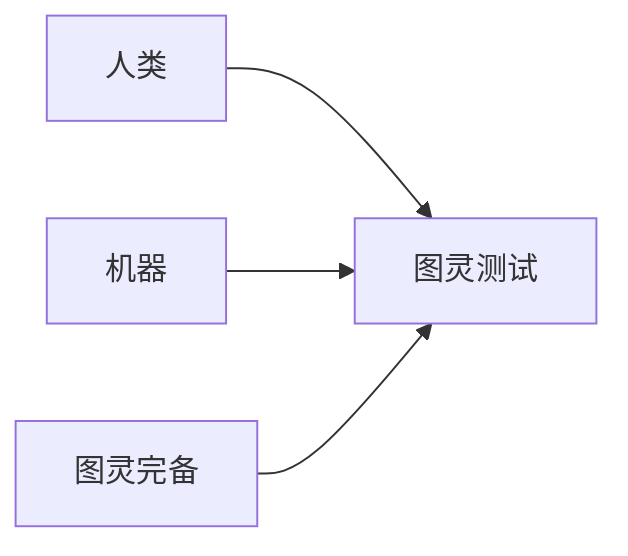

                 

**图灵完备的LLM:通向通用人工智能之路**

**作者：禅与计算机程序设计艺术 / Zen and the Art of Computer Programming**

## 1. 背景介绍

在人工智能（AI）领域，通用人工智能（AGI）是一个长期以来的目标，它指的是一种能够理解、学习和应用知识的智能，与人类智能相当。大型语言模型（LLM）是通往这个目标的关键一步，因为它们能够理解和生成人类语言。然而，当前的LLM还远未达到图灵完备性，即它们无法在任何任务上表现得像人类一样好。本文将探讨图灵完备LLM的概念，并讨论实现这个目标的挑战和可能的解决方案。

## 2. 核心概念与联系

### 2.1 图灵完备性

图灵完备性是指一个系统能够模拟任何计算机可计算的函数。在人工智能领域，图灵完备性通常与图灵测试联系在一起，该测试旨在区分人类智能和机器智能。如果一个系统在图灵测试中表现得像人类一样好，那么它就被认为是图灵完备的。



### 2.2 大型语言模型

大型语言模型是一种深度学习模型，旨在理解和生成人类语言。它们通过处理大量文本数据来学习语言规则和模式。当前的LLM在许多任务上表现出色，但还远未达到图灵完备性。

## 3. 核心算法原理 & 具体操作步骤

### 3.1 算法原理概述

图灵完备LLM的核心是一种能够理解和生成人类语言的模型，它可以在任何任务上表现得像人类一样好。这需要模型能够理解上下文，进行推理，并学习新的概念。

### 3.2 算法步骤详解

实现图灵完备LLM的关键步骤包括：

1. **数据收集**：收集大量的、多样化的、高质量的文本数据。
2. **预处理**：清洗、标记和分词数据。
3. **模型训练**：使用深度学习技术（如transformer模型）训练LLM。
4. ** fine-tuning**：在特定任务上微调模型。
5. **评估**：使用图灵测试等方法评估模型的图灵完备性。

### 3.3 算法优缺点

**优点**：图灵完备LLM可以理解和生成人类语言，可以在各种任务上表现出色。

**缺点**：实现图灵完备LLM需要大量的计算资源和高质量的数据。此外，图灵完备性很难评估，因为它需要模型在所有任务上都表现得像人类一样好。

### 3.4 算法应用领域

图灵完备LLM可以应用于各种领域，包括客户服务、信息检索、内容创作等。它们还可以用于开发更先进的AI系统，如自动驾驶汽车和机器人。

## 4. 数学模型和公式 & 详细讲解 & 举例说明

### 4.1 数学模型构建

当前的LLM通常基于transformer模型构建，该模型使用自注意力机制来处理序列数据。数学上，transformer模型可以表示为：

$$h_i = \text{Attention}(Q=W^Qx_i, K=W^Kx, V=W^Vx)$$

其中，$x_i$是输入序列中的第$i$个词，$W^Q, W^K, W^V$是学习的权重矩阵，$h_i$是第$i$个词的输出表示。

### 4.2 公式推导过程

自注意力机制的推导过程如下：

1. **查询（Query）、键（Key）和值（Value）的生成**：使用三个学习的矩阵将输入序列中的每个词映射到查询、键和值向量。
2. **注意力分数的计算**：计算查询向量和每个键向量之间的点积，并将其缩放到相同的维度。然后，使用softmax函数将这些分数转换为注意力权重。
3. **输出表示的生成**：使用注意力权重线性组合值向量，得到输出表示。

### 4.3 案例分析与讲解

例如，考虑以下输入序列：

输入：`The cat sat on the mat`

输出：`The cat sat on the hat`

在生成“hat”这个词时，模型需要理解“mat”这个词的意思，并将其替换为一个相似的词“hat”。这需要模型理解上下文和进行推理。

## 5. 项目实践：代码实例和详细解释说明

### 5.1 开发环境搭建

要开发图灵完备LLM，需要一个强大的开发环境，包括：

- 一个支持GPU加速的计算机
- Python和PyTorch或TensorFlow等深度学习框架
- Hugging Face的transformers库等LLM库

### 5.2 源代码详细实现

以下是一个简单的transformer模型的实现示例：

```python
import torch
import torch.nn as nn

class Transformer(nn.Module):
    def __init__(self, d_model, n_head, n_layers):
        super(Transformer, self).__init__()
        self.encoder_layers = nn.ModuleList([nn.TransformerEncoderLayer(d_model, n_head) for _ in range(n_layers)])
        self.encoder = nn.TransformerEncoder(self.encoder_layers, n_layers)

    def forward(self, src):
        output = self.encoder(src)
        return output
```

### 5.3 代码解读与分析

这个模型是一个简单的transformer编码器，它由多个transformer编码器层组成。每个层都包含一个自注意力子层和一个前馈神经网络子层。模型接受源序列作为输入，并输出编码表示。

### 5.4 运行结果展示

在训练和评估模型后，可以使用图灵测试等方法评估其图灵完备性。理想情况下，模型应该能够在各种任务上表现得像人类一样好。

## 6. 实际应用场景

### 6.1 当前应用

当前的LLM已经在各种应用中得到广泛应用，包括客户服务、信息检索、内容创作等。它们还用于开发更先进的AI系统，如自动驾驶汽车和机器人。

### 6.2 未来应用展望

图灵完备LLM可以应用于更复杂的任务，如创造性写作、科学研究等。它们还可以用于开发更先进的AI系统，如能够理解和学习新概念的AI。

## 7. 工具和资源推荐

### 7.1 学习资源推荐

- "Attention is All You Need"论文：<https://arxiv.org/abs/1706.03762>
- "The Illustrated Transformer"：<https://jalammar.github.io/illustrated-transformer/>
- "Hands-On Machine Learning with Scikit-Learn, Keras, and TensorFlow"书籍：<https://www.oreilly.com/library/view/hands-on-machine-learning/9781492032632/>

### 7.2 开发工具推荐

- PyTorch：<https://pytorch.org/>
- TensorFlow：<https://www.tensorflow.org/>
- Hugging Face的transformers库：<https://huggingface.co/transformers/>

### 7.3 相关论文推荐

- "Language Models are Few-Shot Learners"：<https://arxiv.org/abs/2005.14165>
- "Emergent Abilities of Large Language Models"：<https://arxiv.org/abs/2206.11763>

## 8. 总结：未来发展趋势与挑战

### 8.1 研究成果总结

本文讨论了图灵完备LLM的概念，并讨论了实现这个目标的挑战和可能的解决方案。我们还提供了一个简单的transformer模型的实现示例。

### 8.2 未来发展趋势

未来，LLM的规模和复杂性将继续增长，从而提高它们的图灵完备性。此外，开发新的训练方法和评估方法将有助于提高LLM的性能。

### 8.3 面临的挑战

实现图灵完备LLM面临的挑战包括：

- **数据收集**：收集大量的、多样化的、高质量的文本数据是一项艰巨的任务。
- **计算资源**：训练大型LLM需要大量的计算资源。
- **评估**：图灵完备性很难评估，因为它需要模型在所有任务上都表现得像人类一样好。

### 8.4 研究展望

未来的研究将关注开发新的训练方法和评估方法，以提高LLM的图灵完备性。此外，开发能够理解和学习新概念的LLM也是一个重要的研究方向。

## 9. 附录：常见问题与解答

**Q：什么是图灵完备性？**

A：图灵完备性是指一个系统能够模拟任何计算机可计算的函数。在人工智能领域，图灵完备性通常与图灵测试联系在一起，该测试旨在区分人类智能和机器智能。

**Q：什么是大型语言模型？**

A：大型语言模型是一种深度学习模型，旨在理解和生成人类语言。它们通过处理大量文本数据来学习语言规则和模式。

**Q：如何评估图灵完备LLM？**

A：评估图灵完备LLM很困难，因为它需要模型在所有任务上都表现得像人类一样好。图灵测试是一种常用的评估方法，但它也有局限性。

**Q：什么是transformer模型？**

A：transformer模型是一种深度学习模型，它使用自注意力机制来处理序列数据。它是当前LLM的基础模型之一。

## 结束语

图灵完备LLM是通往通用人工智能的关键一步。虽然实现这个目标面临着许多挑战，但未来的研究将有助于提高LLM的图灵完备性，并开发更先进的AI系统。我们期待着看到图灵完备LLM在各种应用中的广泛应用。

**作者：禅与计算机程序设计艺术 / Zen and the Art of Computer Programming**

