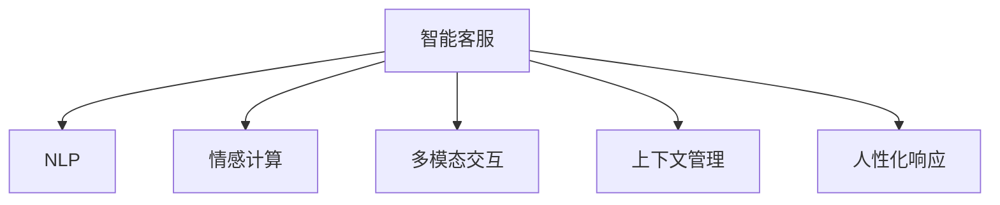

                 

## 1. 背景介绍

### 1.1 问题由来

近年来，随着人工智能技术的快速发展，智能客服领域迎来了翻天覆地的变化。从早期的自动化应答系统，到如今集成了自然语言处理(NLP)、语音识别与合成、情感计算等技术，智能客服已经逐渐从一个机械化的工具，转变为一个可以理解人类情感、具备上下文理解能力、能够进行复杂对话的智能助手。

然而，尽管取得了诸多突破，智能客服系统在实际应用中仍存在诸多局限。例如，情感识别能力不足，容易误解用户情绪；缺乏对特定情境的深度理解，无法真正实现人性化服务；对话语境的泛化能力不强，难以应对多变的用户需求等。这些问题限制了智能客服系统的普及和应用。

因此，如何进一步提升智能客服的情感理解和交互能力，使其真正具备高度的智能化和人性化，成为了一个亟待解决的挑战。本文将从情感计算的角度出发，探讨如何构建2050年的智能语音助手，以期为智能客服的未来发展提供新的思路。

### 1.2 问题核心关键点

要构建一个真正具备情感计算能力的智能语音助手，需要解决以下几个核心关键点：

1. **情感识别与理解**：在对话中准确识别用户的情感状态，理解其背后的真实意图。
2. **语境感知与上下文管理**：在对话中准确把握语境信息，理解用户的上下文需求。
3. **多模态交互**：融合视觉、语音、文本等多种模态信息，提升交互的丰富性和自然性。
4. **人性化响应**：在对话中生成符合用户情感和情境的个性化响应，提升用户的体验感。
5. **安全性与隐私保护**：确保在对话过程中对用户隐私和数据安全的保护，防止信息泄露。

这些关键点构成了情感计算技术在智能客服中的主要应用场景，需要通过多种技术手段来实现。

### 1.3 问题研究意义

构建具备情感计算能力的智能语音助手，对于提升智能客服系统的用户体验、优化服务流程、降低运营成本等具有重要意义。

1. **提升用户体验**：通过理解用户的情感状态和上下文需求，智能语音助手可以提供更加人性化的服务，增强用户的信任感和满意度。
2. **优化服务流程**：情感计算技术可以自动筛选高风险或情绪激动的用户，为客服人员提供辅助决策，提升问题解决的效率和质量。
3. **降低运营成本**：智能语音助手可以替代部分人工客服工作，降低企业的运营成本，提升服务效率。
4. **推动产业升级**：智能客服的普及和应用，将促进各行各业数字化转型，提升企业的竞争力。

## 2. 核心概念与联系

### 2.1 核心概念概述

为更好地理解2050年智能语音助手构建的理论基础，本节将介绍几个密切相关的核心概念：

- **智能客服**：指基于人工智能技术的自动化客服系统，可以理解自然语言、处理用户请求，并作出相应回答的智能系统。
- **自然语言处理(NLP)**：研究计算机如何理解、解释和生成人类语言的技术，是构建智能客服的基础。
- **情感计算**：通过计算、理解和生成情感信息，使机器能够理解和响应人类情感的技术。
- **多模态交互**：结合视觉、语音、文本等多种模态信息，提升人机交互的自然性和丰富性。
- **上下文管理**：在对话中保存和管理对话历史信息，理解用户的上下文需求，提升交互的连贯性。
- **人性化响应**：生成符合用户情感和情境的个性化响应，增强用户体验感。

这些核心概念之间的逻辑关系可以通过以下Mermaid流程图来展示：



这个流程图展示了一系列核心概念的逻辑关系：

1. 智能客服系统通过NLP理解用户输入，进行自然语言处理。
2. 情感计算技术帮助系统理解用户的情感状态，增强其人性化响应能力。
3. 多模态交互技术结合视觉、语音、文本等多种信息，提升交互的自然性。
4. 上下文管理技术保存和管理对话历史，理解用户的上下文需求。
5. 人性化响应技术生成符合用户情感和情境的个性化回答，提升用户体验。

这些概念共同构成了智能客服系统的核心框架，使其能够在不断变化的用户需求中提供高质量的服务。

## 3. 核心算法原理 & 具体操作步骤

### 3.1 算法原理概述

构建具备情感计算能力的智能语音助手，本质上是一个多学科融合的复杂系统工程。其中，情感计算和自然语言处理是其核心技术。

情感计算旨在通过计算、理解和生成情感信息，使机器能够理解人类的情感状态和情绪变化。这包括情感识别、情感理解、情感生成等方面。在情感计算中，常用的技术手段包括：

1. **情感识别**：利用声学特征、语音识别和情感分类模型，识别用户的情感状态。
2. **情感理解**：结合上下文信息，理解用户情感背后的真实意图。
3. **情感生成**：根据用户情感状态和上下文信息，生成符合用户情感的响应。

自然语言处理则是智能客服系统的基础技术，通过理解自然语言、生成自然语言，实现人机交互。在自然语言处理中，常用的技术手段包括：

1. **语音识别**：将用户的语音信号转化为文本信息。
2. **文本分类**：对用户输入的文本进行分类，识别用户的意图和情感状态。
3. **实体抽取**：从用户输入的文本中提取关键信息，如人名、地名、组织名等。
4. **对话管理**：管理对话历史信息，保存和管理上下文信息。
5. **生成响应**：根据用户意图和上下文信息，生成自然流畅的回答。

### 3.2 算法步骤详解

构建具备情感计算能力的智能语音助手，需要经历以下几个关键步骤：

**Step 1: 数据收集与预处理**
- 收集用户的历史对话记录，包括语音、文本、情感状态等信息。
- 对数据进行清洗、标注和划分，确保数据质量。
- 对文本进行分词、去除停用词、词干化等预处理操作。

**Step 2: 情感识别与理解**
- 使用情感分类模型（如SVM、LSTM等）训练情感识别模型，识别用户的情感状态。
- 结合上下文信息，使用LSTM、GRU等模型进行情感理解，理解用户情感背后的真实意图。

**Step 3: 多模态交互**
- 集成语音识别和自然语言处理技术，将用户的语音和文本信息转换为计算机可以理解的数据。
- 结合视觉信息，使用计算机视觉技术（如面部识别、表情识别等）获取用户的情感状态。
- 整合多种模态信息，生成更加自然、丰富的对话内容。

**Step 4: 上下文管理**
- 使用对话管理模块，保存和管理对话历史信息，确保对话连贯性和一致性。
- 根据对话历史信息，识别用户的上下文需求，提升交互的连贯性和效率。

**Step 5: 人性化响应**
- 根据用户情感状态和上下文信息，使用生成模型（如GPT、Seq2Seq等）生成符合用户情感和情境的个性化响应。
- 结合自然语言处理技术，生成自然流畅的回答，提升用户体验。

**Step 6: 训练与优化**
- 使用标记数据训练智能语音助手模型，优化模型参数。
- 定期更新模型，保持模型的实时性和有效性。

**Step 7: 系统部署与监控**
- 将训练好的模型部署到实际应用场景中，与第三方系统集成。
- 实时监控系统的运行状态，及时发现和解决问题。

### 3.3 算法优缺点

基于情感计算的智能语音助手具有以下优点：
1. 提升用户体验：通过理解用户的情感状态和上下文需求，智能语音助手可以提供更加人性化的服务，增强用户的信任感和满意度。
2. 优化服务流程：情感计算技术可以自动筛选高风险或情绪激动的用户，为客服人员提供辅助决策，提升问题解决的效率和质量。
3. 降低运营成本：智能语音助手可以替代部分人工客服工作，降低企业的运营成本，提升服务效率。
4. 推动产业升级：智能客服的普及和应用，将促进各行各业数字化转型，提升企业的竞争力。

同时，该方法也存在一定的局限性：
1. 依赖标注数据：情感计算需要大量标注数据进行训练，标注成本较高。
2. 数据隐私问题：用户的情感数据和隐私信息需要得到充分的保护，防止信息泄露。
3. 复杂性高：情感计算涉及多学科融合，实现难度较大，需要跨领域的合作和技术支持。
4. 泛化能力有限：情感计算模型往往依赖特定场景和数据，泛化能力较弱。

尽管存在这些局限性，但基于情感计算的智能语音助手仍是大势所趋。未来相关研究的重点在于如何进一步降低标注数据的需求，提高模型的泛化能力，同时兼顾可解释性和隐私保护等因素。

### 3.4 算法应用领域

基于情感计算的智能语音助手已经在多个领域得到了应用，包括但不限于：

1. **金融客服**：在银行、保险等金融领域，智能语音助手可以提供24/7全天候服务，识别客户的情感状态，提供个性化的金融咨询和解决方案。
2. **医疗客服**：在医疗领域，智能语音助手可以理解患者的情感和症状，提供初步的诊断建议，提升医疗服务质量。
3. **电商客服**：在电商领域，智能语音助手可以识别顾客的情感状态，提供个性化的购物建议和服务，提升用户体验。
4. **企业客服**：在企业领域，智能语音助手可以识别员工的情感状态，提供心理支持和帮助，提升员工满意度和工作效率。

除了以上这些领域，情感计算技术还在教育、法律、旅游等诸多行业得到了应用，为各行各业带来了深远的变革。

## 4. 数学模型和公式 & 详细讲解  
### 4.1 数学模型构建

在情感计算和自然语言处理中，数学模型起到了重要的作用。以下是情感计算中常用的数学模型及其构建方式：

**情感识别模型**：假设用户情感状态为二分类问题，即情感为正面或负面。利用情感分类模型（如SVM、LSTM等）进行训练，输出情感分类结果。数学模型如下：

$$
P(\text{正面}) = \sigma(w_1^T \mathbf{x}_1 + w_2^T \mathbf{x}_2 + \cdots + w_n^T \mathbf{x}_n + b)
$$

其中，$\sigma$为激活函数，$w_i$为模型参数，$\mathbf{x}_i$为特征向量，$b$为偏置项。

**情感理解模型**：利用LSTM、GRU等序列模型，对用户的情感状态和上下文信息进行建模，理解用户情感背后的真实意图。数学模型如下：

$$
h_t = \tanh(W_1 h_{t-1} + W_2 \mathbf{x}_t + b_1)
$$

$$
y_t = \sigma(W_2 h_t + W_3 y_{t-1} + b_2)
$$

其中，$h_t$为当前时间步的LSTM状态，$W_i$为模型参数，$\mathbf{x}_t$为输入特征向量，$y_t$为输出向量。

### 4.2 公式推导过程

以下是情感分类模型的详细推导过程：

**Step 1: 特征提取**
- 从用户输入的语音或文本中提取特征，如声学特征、文本特征等。
- 对特征进行向量化处理，生成特征向量。

**Step 2: 训练情感分类模型**
- 使用标注数据训练情感分类模型，优化模型参数。
- 使用交叉验证等技术评估模型的性能，选择合适的模型。

**Step 3: 情感状态识别**
- 将用户的语音或文本输入到模型中，得到情感分类结果。
- 根据分类结果，判断用户的情感状态，识别其情感倾向。

### 4.3 案例分析与讲解

以银行客服为例，展示情感计算技术的应用过程：

1. **数据收集**：收集银行客服的历史对话记录，包括语音、文本、情感状态等信息。
2. **数据预处理**：对数据进行清洗、标注和划分，确保数据质量。
3. **特征提取**：从用户语音中提取声学特征，如音量、语速、音调等；从文本中提取情感特征，如情感词、情感强度等。
4. **情感识别**：使用情感分类模型对用户的语音和文本进行情感分类，识别其情感状态。
5. **情感理解**：结合上下文信息，利用LSTM模型进行情感理解，理解用户情感背后的真实意图。
6. **生成响应**：根据用户的情感状态和上下文信息，使用生成模型生成符合用户情感和情境的个性化响应。
7. **模型训练**：使用标记数据训练智能语音助手模型，优化模型参数。
8. **系统部署**：将训练好的模型部署到实际应用场景中，与第三方系统集成。

通过以上步骤，银行客服智能语音助手可以理解用户的情感状态，提供个性化的金融咨询和解决方案，提升用户体验和满意度。

## 5. 项目实践：代码实例和详细解释说明

### 5.1 开发环境搭建

在进行情感计算项目开发前，我们需要准备好开发环境。以下是使用Python进行TensorFlow开发的环境配置流程：

1. 安装Anaconda：从官网下载并安装Anaconda，用于创建独立的Python环境。

2. 创建并激活虚拟环境：
```bash
conda create -n tf-env python=3.8 
conda activate tf-env
```

3. 安装TensorFlow：根据CUDA版本，从官网获取对应的安装命令。例如：
```bash
conda install tensorflow -c pytorch -c conda-forge
```

4. 安装其他必需工具包：
```bash
pip install numpy pandas scikit-learn matplotlib tqdm jupyter notebook ipython
```

完成上述步骤后，即可在`tf-env`环境中开始情感计算项目的开发。

### 5.2 源代码详细实现

下面以情感分类项目为例，给出使用TensorFlow进行情感分析的PyTorch代码实现。

首先，定义情感分类模型的网络结构：

```python
import tensorflow as tf
from tensorflow.keras.layers import Input, Dense, LSTM, Embedding, Masking
from tensorflow.keras.models import Model

def build_model(input_shape):
    inputs = Input(shape=input_shape)
    masking = Masking(mask_value=0, input_shape=input_shape)(inputs)
    embedding = Embedding(input_dim=vocab_size, output_dim=embedding_dim, mask_zero=True)(masking)
    lstm = LSTM(64)(embedding)
    outputs = Dense(1, activation='sigmoid')(lstm)
    model = Model(inputs=inputs, outputs=outputs)
    return model
```

然后，定义数据生成器：

```python
def data_generator(data, batch_size=32):
    while True:
        data = np.random.permutation(data)
        for i in range(0, len(data), batch_size):
            batch = data[i:i+batch_size]
            yield batch
```

接着，定义模型训练函数：

```python
def train_model(model, data, epochs=10, batch_size=32, learning_rate=0.001):
    optimizer = tf.keras.optimizers.Adam(learning_rate=learning_rate)
    loss_fn = tf.keras.losses.BinaryCrossentropy()
    train_data = data_generator(data, batch_size)
    model.compile(optimizer=optimizer, loss=loss_fn, metrics=['accuracy'])
    model.fit(train_data, epochs=epochs)
```

最后，启动训练流程：

```python
vocab_size = 10000
embedding_dim = 64
epochs = 10

# 数据准备
# ...

# 构建模型
model = build_model(input_shape)

# 训练模型
train_model(model, train_data, epochs, batch_size)
```

以上就是使用TensorFlow对情感分类模型进行训练的完整代码实现。可以看到，TensorFlow提供了丰富的深度学习组件，使得模型构建和训练过程变得更加简单高效。

### 5.3 代码解读与分析

让我们再详细解读一下关键代码的实现细节：

**build_model函数**：
- 定义模型结构，包括输入层、掩码层、嵌入层、LSTM层和输出层。
- 使用Masking层处理输入序列，保证长句子的正确处理。
- 嵌入层将输入的特征向量映射到高维空间，增强模型的表达能力。
- LSTM层对嵌入后的特征进行序列建模，捕捉时间依赖关系。
- 输出层使用Sigmoid函数进行二分类预测。

**data_generator函数**：
- 定义数据生成器，不断从训练集中随机抽取批次数据。
- 使用np.random.permutation随机打乱数据顺序，避免模型过拟合。
- 每次从批次中取出指定数量的样本，生成批次数据。

**train_model函数**：
- 定义优化器、损失函数和评估指标。
- 使用TFData生成器生成批次数据。
- 编译模型，使用Adam优化器进行参数更新。
- 使用BinaryCrossentropy作为损失函数，计算二分类任务的损失。
- 设置训练轮数和批次大小，开始训练模型。

通过以上步骤，我们成功构建了一个情感分类模型，并使用随机生成的数据集进行了训练。这为进一步开发具备情感计算能力的智能语音助手打下了坚实的基础。

当然，在实际应用中，还需要进一步优化模型的性能和鲁棒性，引入更多上下文信息，实现更加复杂的情感理解和生成。但核心的训练范式基本与此类似。

## 6. 实际应用场景

### 6.1 智能客服系统

基于情感计算的智能客服系统，已经在许多企业中得到了广泛应用，提升了服务质量和客户满意度。

在金融领域，银行客服智能语音助手可以通过用户的语音和文本信息，识别其情感状态，提供个性化的金融咨询和解决方案，提升用户体验。例如，当客户在电话咨询贷款申请时，系统可以根据客户的情绪状态，判断其是否焦躁不安，提供安抚和鼓励的话语，减少客户压力。

在医疗领域，医院客服智能语音助手可以理解患者的情感和症状，提供初步的诊断建议和心理支持，提升医疗服务质量。例如，当患者在电话咨询病情时，系统可以根据患者的情感状态，判断其是否焦虑或悲伤，提供相应的心理安慰和建议，减轻患者情绪负担。

在电商领域，客服智能语音助手可以识别顾客的情感状态，提供个性化的购物建议和服务，提升用户体验。例如，当顾客在电话咨询购买时，系统可以根据顾客的情绪状态，判断其是否满意或不满意，提供相应的解决方案，增强顾客满意度。

### 6.2 情感分析与舆情监测

情感计算技术在情感分析与舆情监测方面也有广泛应用。通过分析用户的情感状态，企业可以实时了解市场情绪变化，及时调整运营策略，提升市场竞争力。

在品牌监测方面，情感计算技术可以帮助企业实时监控用户的情感状态，识别品牌情感倾向。例如，当某品牌推出新产品时，系统可以实时监测用户的情感变化，判断产品是否受欢迎，及时调整市场策略。

在公共舆情方面，情感计算技术可以帮助政府和机构了解公众情感状态，进行舆情分析。例如，当社会事件发生时，系统可以实时监测公众情感变化，判断事件影响范围和趋势，为政府决策提供支持。

### 6.3 情感计算与人机交互

情感计算技术不仅可以应用于客服和舆情分析，还可以与人机交互技术相结合，提升人机交互的自然性和丰富性。

在虚拟助手方面，情感计算技术可以提升虚拟助手的互动性和情感共鸣。例如，虚拟助手可以根据用户的情感状态，调整对话语调和语气，增强用户体验。

在游戏领域，情感计算技术可以帮助游戏设计更加沉浸式和动态化的交互体验。例如，游戏角色可以根据玩家情感状态，做出相应的情感反应，提升游戏趣味性和互动性。

## 7. 工具和资源推荐
### 7.1 学习资源推荐

为了帮助开发者系统掌握情感计算和智能客服的理论基础和实践技巧，这里推荐一些优质的学习资源：

1. 《情感计算》书籍：由情感计算领域的知名专家编写，系统介绍了情感计算的基本原理和应用场景。
2. 《自然语言处理基础》课程：由斯坦福大学开设的NLP课程，涵盖自然语言处理的基本概念和算法。
3. 《TensorFlow官方文档》：TensorFlow的官方文档，提供了详尽的API文档和示例代码，是学习和使用TensorFlow的重要参考资料。
4. 《自然语言处理综述》论文：回顾了自然语言处理的发展历程和当前热点，适合系统学习NLP技术。
5. 《情感计算综述》论文：回顾了情感计算的发展历程和当前热点，适合系统学习情感计算技术。

通过对这些资源的学习实践，相信你一定能够快速掌握情感计算和智能客服的理论基础和实践技巧，用于解决实际的NLP问题。

### 7.2 开发工具推荐

高效的开发离不开优秀的工具支持。以下是几款用于情感计算和智能客服开发的常用工具：

1. TensorFlow：由Google主导开发的开源深度学习框架，适合大规模工程应用。提供了丰富的深度学习组件，可以高效构建和训练模型。
2. PyTorch：基于Python的开源深度学习框架，灵活动态的计算图，适合快速迭代研究。适用于多种NLP任务和模型构建。
3. Jupyter Notebook：Python编程环境，支持多种编程语言和库的集成，适合数据处理和模型调试。
4. GitHub：代码托管平台，提供代码版本控制和协作功能，方便开发者进行项目管理和团队合作。
5. Google Colab：免费的在线Jupyter Notebook环境，支持GPU/TPU算力，适合学习和实验最新模型。

合理利用这些工具，可以显著提升情感计算和智能客服开发的效率，加快创新迭代的步伐。

### 7.3 相关论文推荐

情感计算和智能客服技术的发展源于学界的持续研究。以下是几篇奠基性的相关论文，推荐阅读：

1. "A Survey of Emotion Recognition Technologies"：回顾了情感识别技术的发展历程和当前热点，适合系统学习情感识别技术。
2. "Natural Language Understanding via Deep Learning"：介绍自然语言处理的基本原理和深度学习算法，适合学习NLP技术。
3. "Conversational AI for Customer Service"：探讨智能客服系统的构建方法和应用场景，适合系统学习智能客服技术。
4. "Towards an Intelligent Customer Service"：探讨未来智能客服的发展趋势和挑战，适合系统学习情感计算和智能客服技术的未来方向。

这些论文代表了大语言模型微调技术的发展脉络。通过学习这些前沿成果，可以帮助研究者把握学科前进方向，激发更多的创新灵感。

## 8. 总结：未来发展趋势与挑战

### 8.1 总结

本文对基于情感计算的智能语音助手进行了全面系统的介绍。首先阐述了情感计算技术在智能客服中的应用背景和意义，明确了情感计算在提升用户体验、优化服务流程等方面的独特价值。其次，从原理到实践，详细讲解了情感计算和自然语言处理的基本数学模型和关键步骤，给出了情感分类模型的代码实现。同时，本文还探讨了情感计算技术在智能客服、情感分析、舆情监测等多个领域的应用场景，展示了情感计算技术的广阔前景。

通过本文的系统梳理，可以看到，情感计算技术在智能客服系统中的应用前景广阔，具有巨大的社会和经济价值。未来，伴随情感计算和自然语言处理技术的不断进步，智能客服系统必将迎来更大的突破，为各行各业带来深远的影响。

### 8.2 未来发展趋势

展望未来，情感计算和智能客服技术将呈现以下几个发展趋势：

1. **多模态交互技术**：融合视觉、语音、文本等多种模态信息，提升人机交互的自然性和丰富性。
2. **上下文管理技术**：保存和管理对话历史信息，理解用户的上下文需求，提升交互的连贯性。
3. **情感生成技术**：生成符合用户情感和情境的个性化响应，增强用户体验感。
4. **情感计算与人机交互技术**：结合虚拟助手、游戏等应用场景，提升情感计算的实用性和趣味性。
5. **数据隐私与安全技术**：确保用户数据的安全性和隐私性，防止信息泄露。

这些趋势凸显了情感计算和智能客服技术的广阔前景。这些方向的探索发展，必将进一步提升智能客服系统的性能和应用范围，为人类社会的数字化转型带来深远影响。

### 8.3 面临的挑战

尽管情感计算和智能客服技术已经取得了诸多突破，但在迈向更加智能化、普适化应用的过程中，它仍面临诸多挑战：

1. **数据标注成本高**：情感计算需要大量标注数据进行训练，标注成本较高。
2. **数据隐私问题**：用户的情感数据和隐私信息需要得到充分的保护，防止信息泄露。
3. **模型复杂度高**：情感计算涉及多学科融合，实现难度较大，需要跨领域的合作和技术支持。
4. **模型泛化能力有限**：情感计算模型往往依赖特定场景和数据，泛化能力较弱。

尽管存在这些挑战，但情感计算和智能客服技术的发展前景依然广阔。未来相关研究的重点在于如何进一步降低标注数据的需求，提高模型的泛化能力，同时兼顾可解释性和隐私保护等因素。

### 8.4 研究展望

面对情感计算和智能客服技术面临的诸多挑战，未来的研究需要在以下几个方面寻求新的突破：

1. **无监督和半监督学习**：摆脱对大规模标注数据的依赖，利用自监督学习、主动学习等无监督和半监督范式，最大限度利用非结构化数据，实现更加灵活高效的情感计算。
2. **多模态融合**：结合视觉、语音、文本等多种模态信息，提升情感计算模型的泛化能力和自然性。
3. **上下文增强**：保存和管理对话历史信息，理解用户的上下文需求，提升情感计算模型的连贯性和交互性。
4. **多任务学习**：结合情感识别、情感生成、对话管理等多任务，提升模型的综合性能和鲁棒性。
5. **数据隐私保护**：在模型训练和应用过程中，充分保护用户数据隐私，防止信息泄露和滥用。

这些研究方向的探索，必将引领情感计算和智能客服技术迈向更高的台阶，为构建安全、可靠、可解释、可控的智能系统铺平道路。面向未来，情感计算和智能客服技术还需要与其他人工智能技术进行更深入的融合，如知识表示、因果推理、强化学习等，多路径协同发力，共同推动自然语言理解和智能交互系统的进步。只有勇于创新、敢于突破，才能不断拓展语言模型的边界，让智能技术更好地造福人类社会。

## 9. 附录：常见问题与解答

**Q1：情感计算和智能客服系统是否适用于所有行业？**

A: 情感计算和智能客服系统在许多行业中都得到了应用，例如金融、医疗、电商、企业服务等。但不同的行业需求不同，需要根据具体情况进行定制化开发。例如，在金融和医疗领域，需要考虑数据隐私和安全问题，采用更为严格的隐私保护措施。

**Q2：情感计算和智能客服系统的训练成本是否很高？**

A: 情感计算和智能客服系统的训练成本较高，需要大量标注数据和计算资源。但随着深度学习技术的不断发展，模型训练效率和精度都有显著提升。此外，通过数据增强、正则化等技术手段，可以进一步降低训练成本。

**Q3：情感计算和智能客服系统的应用场景有哪些？**

A: 情感计算和智能客服系统可以在多个领域中得到应用，例如银行客服、医院客服、电商客服、企业客服等。这些领域中，用户情感状态和上下文需求不同，需要采用不同的模型和算法。例如，银行客服需要理解用户的情感状态，提供个性化金融咨询；医院客服需要理解患者的情感和症状，提供心理支持和初步诊断建议。

**Q4：情感计算和智能客服系统面临的主要挑战有哪些？**

A: 情感计算和智能客服系统面临的主要挑战包括数据标注成本高、数据隐私问题、模型复杂度高、模型泛化能力有限等。未来需要进一步降低标注数据的需求，提高模型的泛化能力和自然性，同时确保数据隐私和安全。

**Q5：情感计算和智能客服系统的未来发展方向有哪些？**

A: 情感计算和智能客服系统的未来发展方向包括多模态融合、上下文增强、多任务学习、数据隐私保护等。未来需要不断优化模型结构，提升模型的自然性和泛化能力，同时确保数据隐私和安全。

通过对这些问题的解答，希望能为你提供更全面的情感计算和智能客服系统的应用指导。总之，情感计算和智能客服系统在智能客服领域的应用前景广阔，未来将会有更多突破和创新。

