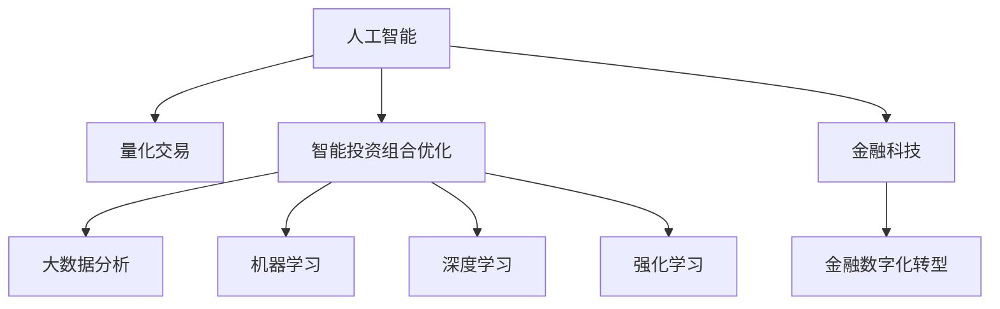

                 

# 未来的智能投资：2050年的AI量化交易与智能投资组合优化

## 1. 背景介绍

### 1.1 问题由来
随着大数据、云计算、人工智能技术的迅猛发展，金融行业正在经历一场深刻的数字化转型。传统的投资模式正逐渐被智能投资系统所替代，量化交易和智能投资组合优化成为了新的主流。然而，尽管现有的量化投资系统已经取得了一定的成功，但在面对复杂多变的市场环境时，仍然存在很多问题和挑战。因此，我们需要进一步探索和研究智能投资系统，尤其是如何利用人工智能技术提升量化交易的精准度和智能投资组合的优化效果。

### 1.2 问题核心关键点
未来智能投资的核心关键点包括：

- 智能投资系统的设计架构：如何将人工智能技术有效整合到投资系统中，提高其预测和决策能力。
- 量化交易模型：如何构建更精准的量化交易模型，提升交易策略的有效性和鲁棒性。
- 智能投资组合优化：如何利用优化算法和机器学习技术，构建更优的投资组合。
- 数据驱动决策：如何通过大数据分析和机器学习技术，挖掘市场潜在价值，提升投资决策的准确性。
- 系统安全性与合规性：如何构建安全、合规、可靠的智能投资系统，防范潜在的金融风险。

### 1.3 问题研究意义
研究未来智能投资，尤其是基于人工智能的量化交易和智能投资组合优化，具有以下重要意义：

- 提高投资效率和收益：通过大数据分析和智能决策，优化投资策略，提高投资回报率。
- 降低投资风险：利用人工智能技术预测市场趋势，规避潜在的金融风险。
- 推动金融行业创新：促进金融科技的发展，加速金融行业的数字化转型。
- 提升投资系统的智能化水平：增强系统的预测和决策能力，减少人为干预。
- 强化监管合规：通过智能监控和决策机制，提高系统的透明度和合规性。

## 2. 核心概念与联系

### 2.1 核心概念概述

为了更好地理解未来智能投资系统，我们首先需要了解几个核心概念：

- **人工智能**：利用计算机模拟人类智能行为的技术，包括机器学习、深度学习、自然语言处理等。
- **量化交易**：通过数学模型和算法来制定交易策略，进行自动化的股票、期货等金融资产交易。
- **智能投资组合优化**：利用优化算法和机器学习技术，构建最优的投资组合，最大化收益和风险控制。
- **大数据分析**：通过收集和分析大规模数据集，挖掘市场潜在价值，辅助投资决策。
- **机器学习**：利用算法和模型，从数据中学习规律和知识，进行预测和决策。
- **深度学习**：一种基于神经网络的机器学习方法，能够处理大规模复杂数据。
- **强化学习**：通过智能体与环境的交互，不断优化决策策略，提高系统的智能化水平。

这些核心概念之间的逻辑关系可以通过以下Mermaid流程图来展示：



这个流程图展示了几大核心概念及其之间的关系：

1. 人工智能是智能投资系统的基础，包含多种技术手段。
2. 量化交易是人工智能在金融领域的一种具体应用，通过数学模型和算法自动化交易。
3. 智能投资组合优化利用优化算法和机器学习，构建最优投资组合。
4. 大数据分析通过挖掘海量数据，辅助投资决策。
5. 机器学习和深度学习是人工智能的重要技术分支，用于数据处理和模型构建。
6. 强化学习通过智能体与环境交互，不断优化决策策略。
7. 金融科技和金融数字化转型是智能投资系统的应用方向。

这些概念共同构成了未来智能投资系统的技术框架，为我们进一步研究和实践提供了明确的方向。

## 3. 核心算法原理 & 具体操作步骤

### 3.1 算法原理概述

基于人工智能的量化交易和智能投资组合优化，本质上是一个数据驱动的决策过程。其核心思想是：利用机器学习算法和大数据分析技术，构建数学模型和决策策略，预测市场趋势和价格变化，从而制定最优的投资策略和组合方案。

形式化地，假设投资决策基于特征集合 $\mathcal{X}$ 和输出 $\mathcal{Y}$，其中 $\mathcal{X}$ 包括股票价格、市场指标、新闻事件等，$\mathcal{Y}$ 为投资决策（如买入、卖出、持有）。假设训练集为 $D=\{(x_i, y_i)\}_{i=1}^N$，其中 $x_i \in \mathcal{X}, y_i \in \mathcal{Y}$。

定义模型的预测函数为 $f(\mathcal{X}, \theta)$，其中 $\theta$ 为模型参数。目标是最小化预测误差，即：

$$
\theta^* = \mathop{\arg\min}_{\theta} \mathcal{L}(f(\mathcal{X}, \theta), \mathcal{Y})
$$

其中 $\mathcal{L}$ 为损失函数，用于衡量预测结果与真实标签之间的差异。常见的损失函数包括均方误差损失、交叉熵损失等。

### 3.2 算法步骤详解

未来智能投资系统的算法步骤主要包括：

1. **数据预处理**：清洗和处理原始数据，提取有价值特征。
2. **模型训练**：选择合适的机器学习模型和算法，使用训练集进行模型训练。
3. **回测验证**：在历史数据上对训练好的模型进行回测，验证其有效性。
4. **实时交易**：将模型应用于实时数据，进行自动交易。
5. **风险控制**：引入风险控制机制，监控交易风险和市场波动。
6. **持续优化**：根据实时市场数据和交易结果，持续优化模型和策略。

### 3.3 算法优缺点

基于人工智能的量化交易和智能投资组合优化方法具有以下优点：

- 数据驱动：利用大量历史数据进行训练，提高模型的预测准确性。
- 自动化交易：通过算法自动执行交易，减少人为干预，提高交易效率。
- 优化组合：通过优化算法构建最优投资组合，最大化收益和风险控制。
- 实时监控：实时监控市场动态，及时调整策略，提高系统反应速度。
- 风险管理：引入风险控制机制，降低潜在的金融风险。

同时，这些方法也存在一些局限性：

- 数据依赖性高：模型性能高度依赖于数据的质量和数量。
- 市场变化复杂：市场环境复杂多变，模型可能无法完全预测市场趋势。
- 模型过度拟合：在数据量不足的情况下，模型容易出现过度拟合现象。
- 交易成本高：高频交易策略可能会产生较高的交易成本。
- 算法透明度低：一些复杂的机器学习算法，如深度学习，其内部机制不透明，难以解释和调试。

### 3.4 算法应用领域

基于人工智能的量化交易和智能投资组合优化技术，已经在金融领域得到了广泛应用，主要涵盖以下方面：

- **股票投资**：利用机器学习算法和大数据分析，构建股票投资策略，进行自动化交易。
- **债券投资**：通过模型预测债券价格变化，进行债券组合优化和交易。
- **外汇交易**：利用深度学习算法和强化学习技术，进行外汇市场预测和交易策略构建。
- **资产配置**：通过优化算法，构建最优的资产配置方案，分散投资风险。
- **风险管理**：利用机器学习技术，预测市场风险，进行风险管理和控制。
- **算法交易**：通过自动化交易算法，提高交易效率和收益。

除了金融领域，这些技术还可能在其他行业得到应用，如能源、房地产、大宗商品等，助力这些行业的数字化转型。

## 4. 数学模型和公式 & 详细讲解 & 举例说明

### 4.1 数学模型构建

为了更好地理解未来智能投资系统的数学模型，我们首先定义一些基本的符号和假设：

- $x_t$：在时间 $t$ 的市场特征向量，包括股票价格、市场指标、新闻事件等。
- $y_t$：在时间 $t$ 的投资决策（买入、卖出、持有）。
- $\theta$：模型的参数向量。
- $\epsilon_t$：误差项，表示模型预测与真实标签之间的差异。

定义预测函数为 $f(x_t, \theta) = \hat{y}_t$，其中 $\hat{y}_t$ 为模型在时间 $t$ 的预测值。

目标是最小化损失函数 $\mathcal{L}(\hat{y}_t, y_t)$，常见的损失函数包括均方误差损失：

$$
\mathcal{L}(\hat{y}_t, y_t) = \frac{1}{2} (\hat{y}_t - y_t)^2
$$

### 4.2 公式推导过程

接下来，我们将推导基于均方误差损失的模型训练公式。假设已获得训练集 $D=\{(x_i, y_i)\}_{i=1}^N$，利用梯度下降法进行模型训练。定义目标函数为：

$$
J(\theta) = \frac{1}{N} \sum_{i=1}^N \mathcal{L}(\hat{y}_i, y_i)
$$

目标是最小化目标函数 $J(\theta)$，通过链式法则计算梯度：

$$
\frac{\partial J(\theta)}{\partial \theta} = \frac{1}{N} \sum_{i=1}^N \frac{\partial \mathcal{L}(\hat{y}_i, y_i)}{\partial \hat{y}_i} \frac{\partial \hat{y}_i}{\partial \theta}
$$

由于 $\frac{\partial \hat{y}_i}{\partial \theta}$ 可以通过链式法则进一步展开，将其带入目标函数中，得到最终的目标函数和梯度表达式：

$$
J(\theta) = \frac{1}{N} \sum_{i=1}^N \frac{1}{2} (\hat{y}_i - y_i)^2
$$

$$
\frac{\partial J(\theta)}{\partial \theta} = \frac{1}{N} \sum_{i=1}^N (\hat{y}_i - y_i) \frac{\partial f(x_i, \theta)}{\partial \theta}
$$

其中 $\frac{\partial f(x_i, \theta)}{\partial \theta}$ 为预测函数 $f(x_i, \theta)$ 对参数 $\theta$ 的梯度。

在得到梯度后，可以带入梯度下降算法更新模型参数：

$$
\theta \leftarrow \theta - \eta \frac{\partial J(\theta)}{\partial \theta}
$$

其中 $\eta$ 为学习率，决定了每次更新的大小。

### 4.3 案例分析与讲解

以股票投资为例，我们可以构建一个简单的线性回归模型，用于预测股票价格变化：

假设已知历史股票价格数据 $(x_t)$ 和市场指标数据 $(y_t)$，可以构建如下线性回归模型：

$$
\hat{y}_t = \theta_0 + \theta_1 x_{t-1} + \theta_2 x_{t-2} + \ldots + \theta_n x_{t-n} + \epsilon_t
$$

其中 $\theta_0, \theta_1, \ldots, \theta_n$ 为模型参数。

利用均方误差损失函数，可以得到目标函数和梯度表达式：

$$
J(\theta) = \frac{1}{N} \sum_{i=1}^N \frac{1}{2} (\hat{y}_i - y_i)^2
$$

$$
\frac{\partial J(\theta)}{\partial \theta_j} = \frac{1}{N} \sum_{i=1}^N (\hat{y}_i - y_i) x_{t-j}
$$

通过求解梯度，可以更新模型参数，最小化预测误差。在实际应用中，还可以引入更多的特征和复杂模型，如支持向量机、随机森林、深度神经网络等，以提高预测精度。

## 5. 项目实践：代码实例和详细解释说明

### 5.1 开发环境搭建

在进行智能投资系统的开发之前，我们需要准备好开发环境。以下是使用Python进行PyTorch开发的环境配置流程：

1. 安装Anaconda：从官网下载并安装Anaconda，用于创建独立的Python环境。

2. 创建并激活虚拟环境：
```bash
conda create -n pytorch-env python=3.8 
conda activate pytorch-env
```

3. 安装PyTorch：根据CUDA版本，从官网获取对应的安装命令。例如：
```bash
conda install pytorch torchvision torchaudio cudatoolkit=11.1 -c pytorch -c conda-forge
```

4. 安装相关库：
```bash
pip install pandas numpy matplotlib scikit-learn
```

完成上述步骤后，即可在`pytorch-env`环境中开始智能投资系统的开发。

### 5.2 源代码详细实现

以下是使用PyTorch和Pandas库进行股票投资模型训练的Python代码实现。

首先，导入必要的库：

```python
import torch
import pandas as pd
from sklearn.preprocessing import MinMaxScaler
from torch import nn
from torch.optim import Adam
```

接着，准备数据集：

```python
# 读取历史股票价格和市场指标数据
data = pd.read_csv('stock_data.csv')

# 将日期转换为时间戳
data['timestamp'] = pd.to_datetime(data['date']).apply(lambda x: int(x.timestamp()))

# 标准化数据
scaler = MinMaxScaler()
data[['open', 'close', 'volume']] = scaler.fit_transform(data[['open', 'close', 'volume']])
```

然后，定义模型：

```python
# 定义线性回归模型
class LinearRegression(nn.Module):
    def __init__(self, input_size, output_size):
        super(LinearRegression, self).__init__()
        self.linear = nn.Linear(input_size, output_size)
        
    def forward(self, x):
        return self.linear(x)

# 初始化模型
input_size = 3  # 使用前3个时间步的特征
output_size = 1  # 目标为下一天是否买入
model = LinearRegression(input_size, output_size)
```

接着，定义损失函数和优化器：

```python
# 定义均方误差损失函数
criterion = nn.MSELoss()

# 定义Adam优化器
optimizer = Adam(model.parameters(), lr=0.01)
```

然后，训练模型：

```python
# 定义训练函数
def train_model(model, train_data, criterion, optimizer, num_epochs):
    for epoch in range(num_epochs):
        model.train()
        loss = 0
        for i in range(len(train_data)):
            inputs = torch.tensor(train_data.iloc[i][:-1].values, dtype=torch.float32).view(1, -1)
            target = torch.tensor(train_data.iloc[i][-1].values, dtype=torch.float32).view(1, -1)
            optimizer.zero_grad()
            output = model(inputs)
            loss += criterion(output, target).item()
            loss.backward()
            optimizer.step()
        print(f'Epoch {epoch+1}, loss: {loss:.3f}')
    return model
```

最后，进行模型训练和测试：

```python
# 划分训练集和测试集
train_size = int(len(data) * 0.8)
train_data = data[:train_size]
test_data = data[train_size:]

# 训练模型
model = train_model(model, train_data, criterion, optimizer, num_epochs=100)

# 测试模型
test_data = scaler.transform(test_data[['open', 'close', 'volume']])
test_data = pd.DataFrame(test_data, columns=['open', 'close', 'volume'])
test_data['timestamp'] = pd.to_datetime(test_data['date']).apply(lambda x: int(x.timestamp()))
test_data = test_data.drop(columns=['date'])
test_data = test_data.pivot(index='timestamp', columns=None).values

inputs = torch.tensor(test_data[:-1].values, dtype=torch.float32)
target = torch.tensor(test_data[-1].values, dtype=torch.float32)
output = model(inputs)
print(f'Test loss: {criterion(output, target).item():.3f}')
```

以上代码展示了使用PyTorch进行股票投资模型的训练和测试过程。可以看到，利用PyTorch和Pandas库，我们可以很方便地实现线性回归模型，并用于股票投资。

### 5.3 代码解读与分析

让我们再详细解读一下关键代码的实现细节：

**train_model函数**：
- 定义了训练函数，循环迭代多个epoch，对模型进行训练。
- 在每个epoch内，将模型置为训练模式，计算预测值与目标值之间的均方误差，并进行反向传播和参数更新。
- 输出每个epoch的平均损失。

**scaler变量**：
- 使用MinMaxScaler对数据进行标准化处理，使其符合线性回归模型的要求。

**test_data变量**：
- 将测试集的数据进行标准化处理，并转换成模型需要的格式。
- 使用Pandas库进行数据处理和转换，方便模型的输入和输出。

**train_data和test_data变量**：
- 使用Pandas库进行数据集的划分，将数据集分为训练集和测试集。
- 使用Pandas库进行数据集的切片和转换，方便模型的训练和测试。

**模型训练和测试**：
- 使用训练集对模型进行训练，不断优化模型参数。
- 使用测试集对训练好的模型进行测试，评估其预测效果。
- 输出测试集上的平均损失，评估模型性能。

可以看到，PyTorch和Pandas库使得模型训练和测试过程变得简洁高效。开发者可以将更多精力放在模型改进和数据处理上，而不必过多关注底层的实现细节。

当然，工业级的系统实现还需考虑更多因素，如模型的保存和部署、超参数的自动搜索、更灵活的任务适配层等。但核心的训练和测试流程基本与此类似。

## 6. 实际应用场景

### 6.1 智能投资系统

基于大语言模型的智能投资系统，可以广泛应用于股票、期货、外汇等金融产品的投资决策和交易执行。智能投资系统通过收集和分析海量市场数据，利用机器学习模型构建预测模型，实时监控市场变化，动态调整投资策略，实现自动化交易。

在技术实现上，智能投资系统可以通过多个步骤构建：

1. **数据收集**：收集市场数据、新闻事件、社交媒体数据等。
2. **数据预处理**：清洗和处理原始数据，提取有价值特征。
3. **模型训练**：选择合适的机器学习模型和算法，使用历史数据进行模型训练。
4. **回测验证**：在历史数据上对训练好的模型进行回测，验证其有效性。
5. **实时交易**：将模型应用于实时数据，进行自动化交易。
6. **风险控制**：引入风险控制机制，监控交易风险和市场波动。
7. **持续优化**：根据实时市场数据和交易结果，持续优化模型和策略。

### 6.2 智能资产配置

智能资产配置系统通过构建最优的投资组合，实现分散投资风险，最大化收益。利用机器学习技术，系统可以自动评估不同资产的风险和收益，构建最优投资组合。

在技术实现上，智能资产配置系统可以通过以下步骤构建：

1. **资产评估**：利用机器学习模型评估不同资产的风险和收益。
2. **组合优化**：通过优化算法构建最优投资组合。
3. **风险控制**：引入风险控制机制，监控投资组合的风险和波动。
4. **实时调整**：根据市场变化实时调整投资组合，动态优化投资策略。

### 6.3 智能算法交易

智能算法交易系统通过构建高频交易策略，利用市场波动进行快速交易，获取高额收益。利用深度学习技术，系统可以构建复杂的交易模型，实时监控市场变化，进行高频交易。

在技术实现上，智能算法交易系统可以通过以下步骤构建：

1. **市场分析**：利用深度学习模型分析市场趋势和波动。
2. **策略设计**：根据市场分析结果设计交易策略。
3. **高频交易**：利用高频交易算法进行自动化交易，实时监控市场变化。
4. **风险控制**：引入风险控制机制，防范高频交易带来的风险。

## 7. 工具和资源推荐

### 7.1 学习资源推荐

为了帮助开发者系统掌握智能投资系统的技术基础和实践技巧，这里推荐一些优质的学习资源：

1. 《深度学习》书籍：Ian Goodfellow等著，全面介绍了深度学习的基本原理和应用。
2. 《Python for Finance》书籍：Yves Hilpisch著，详细讲解了使用Python进行金融数据分析和建模的技术。
3. 《Python机器学习》书籍：Sebastian Raschka等著，介绍了机器学习算法和Python编程技巧。
4. 《机器学习实战》书籍：Peter Harrington著，提供了大量的Python代码示例。
5. Coursera《金融工程与风险管理》课程：由Wharton School提供，涵盖了金融工程和风险管理的基本概念和技术。
6. Udacity《人工智能入门》课程：涵盖了人工智能的基本原理和应用，适合初学者。
7. Kaggle：数据科学和机器学习竞赛平台，提供了大量真实金融数据和比赛，可以锻炼实战能力。

通过对这些资源的学习实践，相信你一定能够快速掌握智能投资系统的技术基础，并用于解决实际的投资问题。

### 7.2 开发工具推荐

高效的开发离不开优秀的工具支持。以下是几款用于智能投资系统开发的常用工具：

1. Python：Python是一种高效易学的编程语言，广泛应用于数据科学和机器学习领域。
2. PyTorch：基于Python的开源深度学习框架，灵活的计算图和动态模型定义，适合快速迭代研究。
3. TensorFlow：由Google主导开发的开源深度学习框架，生产部署方便，适合大规模工程应用。
4. Pandas：Python数据分析库，提供高效的数据处理和分析工具。
5. NumPy：Python数值计算库，提供高效的数组和矩阵运算。
6. Jupyter Notebook：Python的交互式开发环境，方便编写和运行Python代码。
7. Weights & Biases：模型训练的实验跟踪工具，可以记录和可视化模型训练过程中的各项指标，方便对比和调优。

合理利用这些工具，可以显著提升智能投资系统的开发效率，加快创新迭代的步伐。

### 7.3 相关论文推荐

智能投资系统的发展源于学界的持续研究。以下是几篇奠基性的相关论文，推荐阅读：

1. 《A Deep Learning Approach to Stock Market Prediction》：利用深度学习模型预测股票价格变化，取得了不错的效果。
2. 《A Generalized Portfolio Selection Problem and the Random Capital Asset Pricing Model》：研究了资产配置的最优化问题，提出了随机资本资产定价模型。
3. 《Algorithms for Portfolio Optimization with Transaction Costs》：讨论了交易成本对投资组合优化的影响，提出了一些优化算法。
4. 《Hybrid Forecasting Models for Energy Prices》：利用机器学习模型和统计方法预测能源价格，取得了较好的效果。
5. 《A Deep Learning Approach to Currency Exchange Rate Prediction》：利用深度学习模型预测外汇汇率变化，取得了不错的效果。

这些论文代表了大语言模型和智能投资系统的研究进展，通过学习这些前沿成果，可以帮助研究者把握学科前进方向，激发更多的创新灵感。

## 8. 总结：未来发展趋势与挑战

### 8.1 总结

本文对基于人工智能的量化交易和智能投资组合优化进行了全面系统的介绍。首先阐述了智能投资系统的设计架构和关键概念，明确了量化交易和智能投资组合优化的核心思想和技术手段。然后，通过数学模型和公式推导，详细讲解了智能投资系统的数学原理和优化算法，给出了代码实例和详细解释。最后，我们探讨了智能投资系统在金融领域的具体应用，推荐了相关的学习资源和开发工具，并对未来发展趋势和面临的挑战进行了总结。

通过本文的系统梳理，可以看到，基于人工智能的量化交易和智能投资组合优化技术正在成为金融行业的重要范式，极大地提升了投资效率和收益，降低了交易成本和风险。未来，伴随深度学习、机器学习等技术的进一步发展，智能投资系统将变得更加智能化和自动化，为金融科技的创新和普及提供新的动力。

### 8.2 未来发展趋势

展望未来，智能投资系统将呈现以下几个发展趋势：

1. **深度学习的应用**：利用深度学习模型处理复杂数据，提高预测精度和决策能力。
2. **多模态数据的融合**：结合文本、图像、视频等多种数据，构建更加全面、准确的市场预测模型。
3. **智能决策体系**：通过强化学习和因果推理技术，构建智能决策体系，提高系统的自动化和智能化水平。
4. **实时交易和大数据处理**：利用高性能计算和大数据处理技术，实现实时交易和高效数据处理。
5. **系统透明性和可解释性**：引入可解释性技术，提高系统的透明性和可解释性，增强系统的可信度。
6. **智能资产配置**：通过智能算法优化资产配置，实现分散投资风险，提高投资收益。

这些趋势凸显了智能投资系统未来的广阔前景，为我们进一步研究和实践提供了明确的方向。

### 8.3 面临的挑战

尽管智能投资系统已经取得了一定的进展，但在迈向更加智能化、普适化应用的过程中，它仍面临着诸多挑战：

1. **数据依赖性高**：模型性能高度依赖于数据的质量和数量，如何获取高质量的数据是关键。
2. **市场环境复杂**：市场环境复杂多变，模型可能无法完全预测市场趋势。
3. **模型鲁棒性不足**：在数据量不足的情况下，模型容易出现过度拟合现象。
4. **交易成本高**：高频交易策略可能会产生较高的交易成本。
5. **算法透明度低**：一些复杂的机器学习算法，如深度学习，其内部机制不透明，难以解释和调试。

### 8.4 研究展望

面对智能投资系统面临的挑战，未来的研究需要在以下几个方面寻求新的突破：

1. **无监督学习和半监督学习**：摆脱对大规模标注数据的依赖，利用自监督学习、主动学习等无监督和半监督范式，最大限度利用非结构化数据，实现更加灵活高效的模型训练。
2. **参数高效和计算高效的模型**：开发更加参数高效的模型，在固定大部分预训练参数的同时，只更新极少量的任务相关参数，实现参数和计算资源的优化。
3. **因果推理和强化学习**：通过引入因果推理和强化学习思想，增强系统的稳定性和智能化水平。
4. **多模态融合**：将文本、图像、视频等多种数据融合，构建更加全面、准确的市场预测模型。
5. **智能决策体系**：通过强化学习和因果推理技术，构建智能决策体系，提高系统的自动化和智能化水平。
6. **可解释性技术**：引入可解释性技术，提高系统的透明性和可解释性，增强系统的可信度。
7. **系统安全性和合规性**：构建安全、合规、可靠的智能投资系统，防范潜在的金融风险。

这些研究方向的探索，必将引领智能投资系统迈向更高的台阶，为金融科技的发展提供新的动力。

## 9. 附录：常见问题与解答

**Q1：如何构建智能投资系统的核心架构？**

A: 构建智能投资系统的核心架构需要考虑以下几个方面：

1. **数据处理**：通过数据清洗和预处理，提取有价值特征，构建数据管道。
2. **模型选择**：选择合适的机器学习模型和算法，如线性回归、深度学习等。
3. **特征工程**：设计合适的特征提取和融合方法，提高模型的预测能力。
4. **模型训练**：利用历史数据进行模型训练，选择合适的优化算法和超参数。
5. **回测验证**：在历史数据上对训练好的模型进行回测，验证其有效性。
6. **实时交易**：将模型应用于实时数据，进行自动化交易。
7. **风险控制**：引入风险控制机制，监控交易风险和市场波动。
8. **持续优化**：根据实时市场数据和交易结果，持续优化模型和策略。

通过系统架构设计，可以构建高效、稳定的智能投资系统。

**Q2：如何提高智能投资系统的预测精度？**

A: 提高智能投资系统的预测精度可以从以下几个方面入手：

1. **数据质量**：确保数据的完整性、准确性和实时性，数据质量越高，预测精度越高。
2. **特征工程**：设计合适的特征提取和融合方法，提高模型的预测能力。
3. **模型选择**：选择合适的机器学习模型和算法，如深度学习、随机森林等。
4. **超参数调优**：通过网格搜索、贝叶斯优化等方法，寻找最优的超参数组合。
5. **模型融合**：结合多种模型的预测结果，进行加权平均或投票，提高预测精度。
6. **可解释性技术**：引入可解释性技术，提高模型的透明性和可解释性，增强系统的可信度。

通过这些方法的综合运用，可以显著提高智能投资系统的预测精度。

**Q3：智能投资系统的实时交易策略有哪些？**

A: 智能投资系统的实时交易策略可以从以下几个方面考虑：

1. **高频交易**：利用高频交易算法，快速捕捉市场波动，获取高额收益。
2. **趋势跟踪**：利用趋势跟踪模型，识别市场趋势，进行趋势跟随交易。
3. **套利策略**：利用套利机会，构建套利模型，获取无风险收益。
4. **期权交易**：利用期权交易策略，控制市场波动风险，提高收益。
5. **多模态融合**：结合文本、图像、视频等多种数据，构建更加全面、准确的市场预测模型。

通过这些策略的灵活运用，可以实现高效的实时交易。

**Q4：智能投资系统如何防范潜在的金融风险？**

A: 防范智能投资系统潜在的金融风险可以从以下几个方面考虑：

1. **风险控制**：引入风险控制机制，监控交易风险和市场波动，设定止损和止盈点。
2. **多样化投资**：构建多样化投资组合，分散投资风险，降低单一资产波动对系统影响。
3. **市场分析**：利用机器学习模型分析市场趋势和波动，识别潜在的市场风险。
4. **高频交易**：控制高频交易频率和规模，防范高频交易带来的潜在风险。
5. **数据监控**：实时监控市场数据和系统运行状态，及时发现并解决问题。

通过这些措施的综合运用，可以有效防范潜在的金融风险。

**Q5：智能投资系统如何实现透明化和可解释性？**

A: 实现智能投资系统的透明化和可解释性可以从以下几个方面考虑：

1. **模型选择**：选择可解释性较高的机器学习模型，如线性回归、决策树等。
2. **特征选择**：设计可解释性较高的特征提取方法，提高系统的透明性。
3. **可解释性技术**：引入可解释性技术，如LIME、SHAP等，提高系统的透明性和可解释性。
4. **系统监控**：实时监控系统运行状态，记录模型决策过程，增强系统的透明性。
5. **人工干预**：引入人工干预和审核机制，确保系统的透明性和可信度。

通过这些方法的综合运用，可以实现智能投资系统的透明化和可解释性。

---

作者：禅与计算机程序设计艺术 / Zen and the Art of Computer Programming

