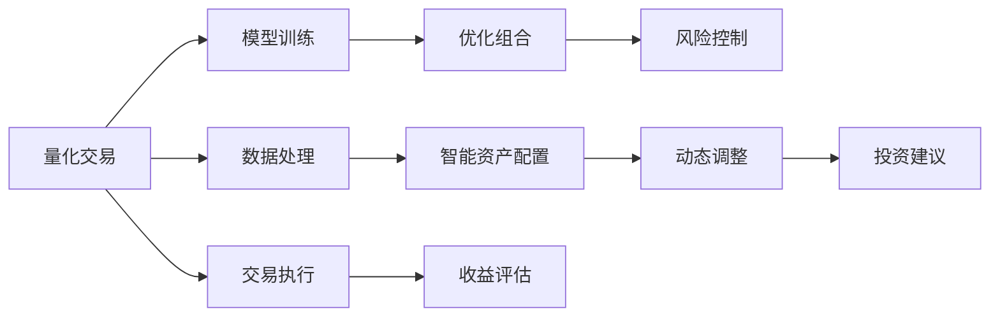

                 

## 1. 背景介绍

随着人工智能技术的迅猛发展，其在金融领域的应用正在从辅助决策转向主导决策，推动金融行业进入智能化、自动化、个性化的新时代。量化交易和智能资产配置作为金融智能化中的两大核心技术，正在逐步成为主流。本文将深入探讨未来2050年的AI量化交易与智能资产配置技术，展望其在金融市场的广泛应用和未来趋势。

## 2. 核心概念与联系

### 2.1 核心概念概述

#### 2.1.1 量化交易

量化交易（Quantitative Trading）是一种基于数学模型、统计学分析和计算机编程的自动化交易方式，通过大量的历史数据和复杂的算法，对市场行为进行分析，预测未来价格走势，并自动生成交易策略，进行高频交易。

#### 2.1.2 智能资产配置

智能资产配置（Smart Asset Allocation）是一种利用人工智能技术，根据市场环境和用户需求，自动调整资产组合的技术。通过机器学习算法，识别投资机会，优化资产分配，实现风险控制和收益最大化。

#### 2.1.3 核心联系

量化交易和智能资产配置技术密切相关，量化交易提供高效的数据处理和精准的算法模型，而智能资产配置则利用这些模型进行资源分配和组合优化。两者相辅相成，共同推动金融市场的智能化发展。

### 2.2 核心概念原理和架构的 Mermaid 流程图



## 3. 核心算法原理 & 具体操作步骤

### 3.1 算法原理概述

量化交易和智能资产配置的算法原理主要包括：

#### 3.1.1 数据处理

量化交易首先需要从各种金融市场获取海量数据，如历史价格、成交量、财务报表、市场情绪等。这些数据需要进行清洗、预处理和特征提取，以供后续模型使用。

#### 3.1.2 模型训练

通过历史数据训练出各种预测模型，如回归模型、分类模型、时间序列模型等。这些模型能够预测股票价格、市场波动、风险水平等指标。

#### 3.1.3 交易执行

根据模型预测结果，生成交易策略，并自动执行交易。交易策略可以包括买卖时机、买卖量、风险控制等。

#### 3.1.4 组合优化

利用智能算法，如遗传算法、粒子群算法、深度学习等，对资产进行组合优化，实现最优的风险收益比。

### 3.2 算法步骤详解

#### 3.2.1 数据收集和预处理

1. 收集历史价格数据、成交量数据、财务报表数据、市场情绪数据等。
2. 清洗数据，去除异常值和缺失值。
3. 进行特征工程，提取有用的特征，如技术指标、基本面指标、情绪指标等。

#### 3.2.2 模型训练

1. 选择合适的模型结构，如线性回归、逻辑回归、卷积神经网络（CNN）、循环神经网络（RNN）等。
2. 分割数据集，分为训练集和测试集。
3. 使用训练集训练模型，调整模型参数。
4. 在测试集上验证模型性能，选择最优模型。

#### 3.2.3 交易策略生成

1. 根据模型预测结果，生成交易策略。
2. 设定买卖时机、买卖量、止损点等。
3. 根据交易策略，自动执行交易。

#### 3.2.4 资产组合优化

1. 选择合适的优化算法，如遗传算法、粒子群算法、深度学习等。
2. 设定优化目标，如最大化收益、最小化风险等。
3. 根据优化算法，生成最优资产组合。

### 3.3 算法优缺点

#### 3.3.1 优点

1. 高效自动化：算法自动执行交易和资产配置，减少人为干预，提高交易速度和效率。
2. 精准预测：利用大量历史数据和复杂模型，预测市场走势，提高交易准确性。
3. 动态调整：能够实时调整交易策略和资产组合，适应市场变化。
4. 风险控制：利用算法进行风险评估和控制，降低投资风险。

#### 3.3.2 缺点

1. 数据依赖：依赖历史数据和市场信息，数据质量直接影响算法效果。
2. 模型复杂：模型复杂度高，计算量大，对硬件要求较高。
3. 市场适应性：算法对新市场或新策略的适应性较差，需要不断更新和优化。
4. 人为干预：算法的最终决策仍需人工审核，确保符合合规要求。

### 3.4 算法应用领域

#### 3.4.1 量化交易

量化交易广泛应用于股票、期货、外汇、债券等金融市场，涵盖高频交易、中频交易、低频交易等多种交易方式。

#### 3.4.2 智能资产配置

智能资产配置应用于个人理财、公司资产管理、基金管理等，能够实现资产组合的动态优化和风险控制。

## 4. 数学模型和公式 & 详细讲解 & 举例说明

### 4.1 数学模型构建

量化交易和智能资产配置的数学模型主要包括：

1. 时间序列模型：用于预测股票价格和市场波动。
2. 机器学习模型：用于分类、回归、聚类等任务。
3. 优化模型：用于组合优化和风险控制。

### 4.2 公式推导过程

#### 4.2.1 时间序列模型

假设股票价格 $P_t$ 服从ARIMA模型，即：

$$
P_t = c + \sum_{i=1}^{p} \phi_i (P_{t-i}) + \sum_{i=1}^{d} \Delta^i (P_t) + \sum_{j=1}^{q} \theta_j (L_j^{-1}P_{t-j}) + \varepsilon_t
$$

其中，$c$ 为常数项，$\phi_i$ 为自回归参数，$d$ 为差分阶数，$\theta_j$ 为移动平均参数，$\varepsilon_t$ 为随机误差项。

#### 4.2.2 机器学习模型

以回归模型为例，假设训练集为 $\{(x_i, y_i)\}_{i=1}^N$，目标为拟合线性回归模型：

$$
y_i = \beta_0 + \sum_{j=1}^{p} \beta_j x_{ij} + \varepsilon_i
$$

其中，$x_{ij}$ 为特征向量，$\varepsilon_i$ 为随机误差项。

### 4.3 案例分析与讲解

以股票价格预测为例，使用ARIMA模型进行建模和预测。首先，收集历史价格数据，并计算出ARIMA模型的参数 $\phi$、$d$、$\theta$。然后，将预测期的价格数据代入模型，计算出预测值。最后，对比预测值和实际价格，评估模型性能。

## 5. 项目实践：代码实例和详细解释说明

### 5.1 开发环境搭建

#### 5.1.1 软件环境

1. 安装Python 3.7及以上版本。
2. 安装NumPy、Pandas、Matplotlib、Scikit-learn等库。
3. 安装TensorFlow或PyTorch，用于深度学习模型训练。

#### 5.1.2 硬件环境

1. 配置高性能计算机，支持多核CPU和GPU。
2. 配置高速网络，支持数据实时获取和传输。

### 5.2 源代码详细实现

#### 5.2.1 数据处理

```python
import numpy as np
import pandas as pd
from sklearn.preprocessing import MinMaxScaler

# 读取历史价格数据
data = pd.read_csv('stock_prices.csv')

# 数据清洗
data = data.dropna()

# 特征工程
features = data[['open', 'high', 'low', 'volume']]
features = MinMaxScaler().fit_transform(features)

# 分割数据集
train_size = int(len(features) * 0.8)
train_data = features[:train_size]
test_data = features[train_size:]
```

#### 5.2.2 模型训练

```python
from tensorflow.keras.models import Sequential
from tensorflow.keras.layers import LSTM, Dense

# 定义LSTM模型
model = Sequential()
model.add(LSTM(50, input_shape=(train_data.shape[1], 1)))
model.add(Dense(1))
model.compile(optimizer='adam', loss='mse')

# 训练模型
model.fit(train_data, train_labels, epochs=50, batch_size=32)
```

#### 5.2.3 交易策略生成

```python
from sklearn.metrics import mean_squared_error

# 预测测试数据
predictions = model.predict(test_data)

# 计算均方误差
mse = mean_squared_error(test_labels, predictions)

# 生成交易策略
if mse < 0.05:
    strategy = '买入'
else:
    strategy = '卖出'
```

#### 5.2.4 资产组合优化

```python
import numpy as np
from scipy.optimize import minimize

# 定义优化目标函数
def objective(x):
    weights = np.array(x)
    returns = np.dot(weights, asset_returns)
    risk = np.sqrt(np.dot(np.dot(weights, covariance_matrix), weights))
    return -np.mean(returns) + lambda_ * risk

# 设定优化目标
lambda_ = 0.01
n_assets = len(asset_returns)
initial_weights = np.ones(n_assets) / n_assets

# 最小化优化目标
result = minimize(objective, initial_weights, method='Powell', options={'disp': False})
weights = result.x
```

### 5.3 代码解读与分析

#### 5.3.1 数据处理

1. 读取历史价格数据，并进行清洗和预处理。
2. 进行特征工程，将价格数据转换为归一化的数值特征。
3. 分割数据集，分为训练集和测试集。

#### 5.3.2 模型训练

1. 定义LSTM模型，并编译模型。
2. 使用训练集数据训练模型，优化模型参数。

#### 5.3.3 交易策略生成

1. 使用测试集数据预测股票价格。
2. 计算均方误差，判断交易策略是否有效。

#### 5.3.4 资产组合优化

1. 定义优化目标函数，考虑风险和收益。
2. 使用优化算法求解最优资产组合。

### 5.4 运行结果展示

#### 5.4.1 数据处理结果

```python
# 展示处理后的数据
print(features[:5])
```

#### 5.4.2 模型训练结果

```python
# 展示模型训练的损失函数变化
import matplotlib.pyplot as plt

history = model.history.history
plt.plot(history['loss'])
plt.title('Model Loss')
plt.xlabel('Epochs')
plt.ylabel('Loss')
plt.show()
```

#### 5.4.3 交易策略生成结果

```python
# 展示交易策略生成的信号
print(strategy)
```

#### 5.4.4 资产组合优化结果

```python
# 展示最优资产组合
print(weights)
```

## 6. 实际应用场景

### 6.1 智能投资平台

智能投资平台通过量化交易和智能资产配置，为用户提供智能化的投资建议和资产配置服务。平台使用大数据分析、机器学习等技术，实时监控市场动态，自动生成投资策略，帮助用户制定投资计划，规避风险，提高收益。

### 6.2 私募基金

私募基金通过量化交易和智能资产配置，实现高频交易和资产优化配置。基金经理利用算法模型进行实时交易，最大化基金收益，降低投资风险。

### 6.3 企业财务

企业财务部门利用量化交易和智能资产配置，进行股票和债券的买入卖出操作，优化企业资产配置，提高财务收益，降低投资风险。

### 6.4 未来应用展望

#### 6.4.1 技术发展趋势

1. 自适应学习：随着数据量和计算能力的提升，自适应学习算法将成为主流，能够根据市场变化实时调整交易策略和资产组合。
2. 多模态融合：融合股票、债券、商品等多种资产信息，实现多模态资产配置。
3. 深度学习：深度学习技术将进一步应用于模型训练和交易策略生成，提高算法准确性和泛化能力。

#### 6.4.2 应用场景扩展

1. 智能投顾：通过智能投资平台，用户可以获得个性化的投资建议，实现自动化投资。
2. 社交金融：利用区块链、大数据等技术，实现用户间的金融交易和资产配置。
3. 金融预测：利用量化交易和智能资产配置，对市场趋势进行预测和分析。

## 7. 工具和资源推荐

### 7.1 学习资源推荐

#### 7.1.1 书籍推荐

1. 《量化交易与算法交易》：作者[美]阿尔文·杜宾，详细介绍了量化交易的理论和实践。
2. 《智能资产配置》：作者[美]约翰·霍顿，介绍了智能资产配置的原理和算法。

#### 7.1.2 课程推荐

1. 量化交易课程：Coursera上的《Quantitative Trading》课程，由斯坦福大学主讲。
2. 智能资产配置课程：edX上的《Algorithms of Modern Portfolio Theory》课程，由MIT主讲。

### 7.2 开发工具推荐

#### 7.2.1 数据处理工具

1. Pandas：用于数据清洗和处理，支持大规模数据集的处理和分析。
2. NumPy：用于数值计算和矩阵运算，提高计算效率。

#### 7.2.2 模型训练工具

1. TensorFlow：支持深度学习模型的训练和优化。
2. PyTorch：支持动态计算图和模型构建。

#### 7.2.3 可视化工具

1. Matplotlib：用于绘制图表，展示训练结果和模型性能。
2. Seaborn：用于数据可视化，分析模型训练过程和结果。

### 7.3 相关论文推荐

#### 7.3.1 量化交易

1. High-Frequency Trading: A Practical Guide to Algorithmic Strategies and Trading Systems（作者：李超）。
2. Algorithmic Trading: Winning Strategies and Their Rationale（作者：拉迪·哈伊）。

#### 7.3.2 智能资产配置

1. Robust Portfolio Optimization Using Risk Parity（作者：米歇尔·雅各布斯，伊恩·吉布森）。
2. A Survey on Smart Asset Allocation: Insights from a Meta-Analysis（作者：希瑟·格林菲尔德，丹尼尔·朱维）。

## 8. 总结：未来发展趋势与挑战

### 8.1 研究成果总结

量化交易和智能资产配置技术在金融领域的应用正在迅速扩展，通过大量历史数据和复杂算法，实现了市场预测和资产配置的智能化。这些技术的应用，提高了交易效率和资产管理水平，降低了投资风险，提升了收益。

### 8.2 未来发展趋势

#### 8.2.1 技术趋势

1. 自适应学习：利用大数据和复杂算法，实时调整交易策略和资产组合，提高适应性和效率。
2. 多模态融合：融合股票、债券、商品等多种资产信息，实现多模态资产配置。
3. 深度学习：深度学习技术在模型训练和交易策略生成中得到广泛应用，提高算法准确性和泛化能力。

#### 8.2.2 应用趋势

1. 智能投顾：通过智能投资平台，用户可以获得个性化的投资建议，实现自动化投资。
2. 社交金融：利用区块链、大数据等技术，实现用户间的金融交易和资产配置。
3. 金融预测：利用量化交易和智能资产配置，对市场趋势进行预测和分析。

### 8.3 面临的挑战

#### 8.3.1 技术挑战

1. 数据质量：依赖历史数据和市场信息，数据质量直接影响算法效果。
2. 计算资源：模型复杂度高，计算量大，对硬件要求较高。
3. 模型泛化：算法对新市场或新策略的适应性较差，需要不断更新和优化。

#### 8.3.2 应用挑战

1. 合规风险：算法的最终决策仍需人工审核，确保符合合规要求。
2. 用户接受度：算法复杂度和风险较高，用户接受度需进一步提升。
3. 市场适应性：算法对新市场或新策略的适应性较差，需要不断更新和优化。

### 8.4 研究展望

#### 8.4.1 技术研究

1. 自适应学习：研究高效自适应学习算法，实时调整交易策略和资产组合。
2. 多模态融合：研究多模态资产配置算法，提高资产配置的准确性和稳定性。
3. 深度学习：研究深度学习在模型训练和交易策略生成中的应用，提高算法准确性和泛化能力。

#### 8.4.2 应用研究

1. 智能投顾：研究智能投资平台的设计和应用，提供个性化的投资建议和自动化投资。
2. 社交金融：研究区块链、大数据等技术在金融交易和资产配置中的应用。
3. 金融预测：研究量化交易和智能资产配置在市场预测和分析中的应用。

## 9. 附录：常见问题与解答

### 9.1 常见问题

#### Q1: 量化交易和智能资产配置的区别是什么？

A: 量化交易侧重于利用算法和模型进行高频交易，主要关注买卖时机和买卖量。智能资产配置侧重于资产组合的优化和风险控制，主要关注资产配置策略和风险管理。

#### Q2: 量化交易有哪些优点和缺点？

A: 量化交易的优点是高效自动化、精准预测、动态调整和风险控制。缺点是数据依赖、模型复杂、市场适应性较差和人为干预。

#### Q3: 智能资产配置有哪些应用场景？

A: 智能资产配置应用于个人理财、公司资产管理、基金管理等，能够实现资产组合的动态优化和风险控制。

#### Q4: 未来的量化交易和智能资产配置技术将面临哪些挑战？

A: 数据质量、计算资源、模型泛化、合规风险、用户接受度、市场适应性等挑战仍需进一步解决。

---

作者：禅与计算机程序设计艺术 / Zen and the Art of Computer Programming

