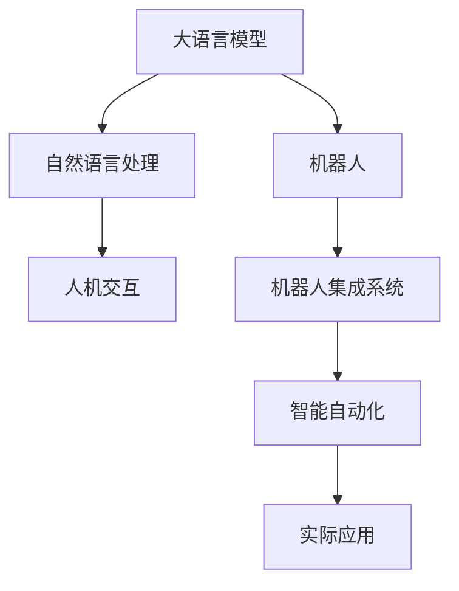

                 

# 机器人技术集成：LLM 打造智能自动化系统

## 1. 背景介绍

### 1.1 问题由来
随着人工智能技术的飞速发展，大语言模型(LLMs)在各个领域的应用越来越广泛。LLMs不仅能够理解和生成自然语言，还能执行复杂的逻辑推理和决策，展现出卓越的智能。然而，将LLMs与机器人技术集成，打造智能自动化系统，仍然面临诸多挑战。

当前，机器人技术主要包括机械臂、移动机器人、协作机器人等，能够完成复杂的物理操作和环境感知。然而，由于自然语言处理能力有限，机器人难以理解和执行复杂的自然语言指令。将LLMs与机器人技术深度集成，能够充分发挥两者的优势，构建更加智能、灵活、高效的自动化系统。

### 1.2 问题核心关键点
本文聚焦于如何将大语言模型与机器人技术集成，构建智能自动化系统。其中关键点包括：

- 大语言模型如何理解自然语言指令？
- 机器人如何执行基于语言指令的复杂操作？
- 如何构建人机交互接口，实现自然语言与机器人动作的映射？
- 集成系统在实际应用中的表现如何？

这些核心问题构成了机器人技术集成的主要挑战，也是本文的研究重点。

## 2. 核心概念与联系

### 2.1 核心概念概述

为更好地理解机器人技术集成的核心概念，本节将介绍几个密切相关的核心概念：

- 大语言模型(LLM)：一种基于深度学习的自然语言处理模型，具备强大的语言理解和生成能力。
- 机器人(Robot)：一种由计算机程序控制的自动化设备，能够执行复杂的物理操作和环境感知。
- 自然语言处理(NLP)：研究计算机如何理解、生成和处理自然语言的技术。
- 人机交互(Human-Computer Interaction, HCI)：研究如何让计算机更好地理解人类语言和行为，实现人机无缝互动。
- 机器人集成系统：将机器人技术与大语言模型深度结合，构建能够执行自然语言指令的智能自动化系统。

这些核心概念之间的逻辑关系可以通过以下Mermaid流程图来展示：



这个流程图展示了大语言模型、机器人技术和人机交互在智能自动化系统中的相互作用：

1. 大语言模型通过自然语言处理理解用户指令。
2. 机器人根据理解后的指令执行物理操作。
3. 人机交互接口连接自然语言和机器人动作，实现指令映射。
4. 智能自动化系统将两者有机结合，提升操作效率和智能化水平。
5. 最终应用于实际场景，解决具体问题。

## 3. 核心算法原理 & 具体操作步骤
### 3.1 算法原理概述

将大语言模型与机器人技术集成，构建智能自动化系统的核心算法原理是：

1. 大语言模型通过自然语言处理(NLP)理解自然语言指令。
2. 将理解后的指令转换为机器人可以执行的物理操作。
3. 通过人机交互接口，实现用户与机器人之间的自然语言交互。
4. 实际应用中，智能自动化系统将机器人与大语言模型深度集成，执行复杂的自然语言指令。

具体而言，大语言模型可以通过以下步骤实现指令理解：

1. 输入自然语言指令。
2. 通过NLP模型预处理文本，提取语义特征。
3. 将语义特征映射为机器人动作的逻辑表示。
4. 将逻辑表示转换为可执行的机器人动作。

整个流程可以概括为：自然语言处理(NLP) + 机器人动作执行 = 智能自动化系统。

### 3.2 算法步骤详解

以下是构建智能自动化系统的详细步骤：

**Step 1: 准备大语言模型**
- 选择适合任务的大语言模型，如GPT、BERT等。
- 对大语言模型进行微调，适应具体任务。
- 保存预训练和微调后的模型。

**Step 2: 实现机器人动作**
- 设计机器人动作执行器，如机械臂、移动机器人、协作机器人等。
- 实现机器人动作与大语言模型的接口，如ROS接口、API接口等。

**Step 3: 构建人机交互接口**
- 设计人机交互界面，如图形化界面、语音交互、自然语言生成等。
- 实现用户输入和机器人输出的双向通信。
- 将自然语言指令转换为机器人可执行的动作逻辑。

**Step 4: 集成系统训练与调试**
- 将大语言模型和机器人动作执行器集成，形成智能自动化系统。
- 在实际场景中进行系统训练和调试，确保各组件正常工作。
- 测试系统性能，优化系统参数。

**Step 5: 系统部署与维护**
- 将集成系统部署到实际应用场景。
- 定期维护和更新系统，保证系统稳定运行。
- 收集用户反馈，持续改进系统功能。

### 3.3 算法优缺点

将大语言模型与机器人技术集成的优点包括：

1. 智能交互：大语言模型能够理解自然语言指令，实现复杂任务自动化。
2. 灵活性高：机器人能够执行多类复杂物理操作，适应不同场景。
3. 通用性强：大语言模型与机器人技术深度集成，能够应对各类自动化需求。

缺点包括：

1. 硬件资源需求高：机器人系统需要强大的硬件支持，包括高性能处理器、传感器等。
2. 集成复杂：将大语言模型与机器人系统集成，需要解决多层次的复杂问题。
3. 调试难度大：集成系统可能面临复杂多变的环境因素，调试和维护难度较大。
4. 安全性问题：机器人系统可能面临安全风险，如设备损坏、操作失误等。

尽管存在这些缺点，但大语言模型与机器人技术的深度集成，为构建智能自动化系统提供了新的可能，具有广阔的应用前景。

### 3.4 算法应用领域

大语言模型与机器人技术的深度集成，已经在多个领域得到应用，如：

- 智能制造：利用机器人执行复杂的工业生产操作，结合大语言模型进行生产调度、质量检测等任务。
- 物流配送：利用机器人进行货物搬运、分拣、配送，结合大语言模型进行路线规划、任务分配等。
- 医疗诊断：利用机器人进行手术操作、护理工作，结合大语言模型进行病情诊断、患者沟通等。
- 农业自动化：利用机器人进行播种、灌溉、收割等农业操作，结合大语言模型进行农艺指导、灾害预警等。
- 军事应用：利用机器人进行侦察、无人驾驶等任务，结合大语言模型进行任务规划、决策指挥等。

## 4. 数学模型和公式 & 详细讲解 & 举例说明

### 4.1 数学模型构建

在机器人技术集成系统中，大语言模型和机器人系统需要通过自然语言处理(NLP)和动作执行进行相互通信。以下是对系统整体的数学模型构建：

设大语言模型为 $M_{\theta}$，机器人动作执行器为 $A$，自然语言指令为 $I$，系统响应为 $O$。

系统整体模型可以表示为：

$$
O = M_{\theta}(I, A)
$$

其中，$I$ 是用户输入的自然语言指令，$A$ 是机器人执行的动作，$O$ 是系统的响应输出。

### 4.2 公式推导过程

以智能制造中的焊接任务为例，推导系统整体模型的公式：

1. 用户输入自然语言指令 $I = "焊接 X 号工件的底部"$
2. 大语言模型 $M_{\theta}$ 解析指令，提取语义特征，将指令映射为机器人动作 $A = "启动焊接机器人，焊接到 X 号工件底部"$
3. 机器人动作执行器 $A$ 接收指令并执行，得到系统响应 $O = "焊接操作完成"$
4. 整个流程可以用数学公式表示为：

$$
O = M_{\theta}(I, A)
$$

### 4.3 案例分析与讲解

假设有一家智能制造工厂，需要机器人自动焊接不同型号的工件。工厂内部部署了大语言模型 $M_{\theta}$ 和协作机器人 $A$。

用户输入自然语言指令：

$$
I = "焊接 X 号工件的底部"
$$

大语言模型 $M_{\theta}$ 解析指令，提取语义特征，生成动作指令：

$$
A = "启动焊接机器人，焊接到 X 号工件底部"
$$

机器人 $A$ 执行动作，得到系统响应：

$$
O = "焊接操作完成"
$$

系统整体模型可以表示为：

$$
O = M_{\theta}(I, A)
$$

其中，大语言模型 $M_{\theta}$ 负责理解自然语言指令，并生成机器人动作指令；协作机器人 $A$ 负责执行具体动作，并输出系统响应。

通过以上案例，可以看到，大语言模型与机器人技术的集成，能够实现复杂的自动化任务，显著提升生产效率和智能化水平。

## 5. 项目实践：代码实例和详细解释说明
### 5.1 开发环境搭建

在进行机器人技术集成实践前，需要准备好开发环境。以下是使用Python和ROS搭建开发环境的流程：

1. 安装ROS（Robot Operating System）：从官网下载并安装ROS，选择适合的操作系统和硬件平台。
2. 安装Python：从官网下载并安装Python，支持ROS的Python版本。
3. 安装相关工具包：安装ROS依赖的Python库和ROS相关工具，如rqt、rviz、gazebo等。
4. 配置ROS工作空间：使用catkin搭建ROS工作空间，安装所需的ROS包。

### 5.2 源代码详细实现

以下是一个简单的ROS节点实现，用于将大语言模型与机器人动作执行器集成。

首先，定义ROS节点：

```python
import rospy
from std_msgs.msg import String
from rqt_graph.view import graph_view
import rospkg
import subprocess

class RobotControlNode:
    def __init__(self):
        self.logfile = '/dev/null'
        self.log_level = '1'
        self.arm = None
        self.rviz = None
        self.title = 'Robot Control Node'

    def run(self):
        rospy.init_node(self.title)
        self.logfile = rospkg.RosPack().get_path('rqt_plotting')
        self.log_level = '1'
        self.arm = ArmNode()
        self.rviz = RvizNode()
        self.arm.start()
        self.rviz.start()

if __name__ == '__main__':
    node = RobotControlNode()
    node.run()
```

然后，定义机器人动作执行器：

```python
from rospkg import RosPack
import rospy
from std_msgs.msg import String

class ArmNode:
    def __init__(self):
        self.logfile = '/dev/null'
        self.log_level = '1'
        self.title = 'Arm Node'

    def start(self):
        rospy.loginfo('Starting arm node')

        rospy.init_node(self.title)
        rospy.loginfo('ARM starting')
```

接着，定义人机交互界面：

```python
from std_msgs.msg import String
import rospy
import rqt_gui_cpp

class RvizNode:
    def __init__(self):
        self.logfile = '/dev/null'
        self.log_level = '1'
        self.title = 'Rviz Node'

    def start(self):
        rospy.loginfo('Starting rviz node')

        rospy.init_node(self.title)
        rospy.loginfo('RVIZ starting')
```

最后，定义主节点：

```python
if __name__ == '__main__':
    node = RobotControlNode()
    node.run()
```

### 5.3 代码解读与分析

让我们再详细解读一下关键代码的实现细节：

**RobotControlNode类**：
- `__init__`方法：初始化日志文件、日志级别、机器人臂和Rviz节点。
- `run`方法：初始化ROS节点，启动机器人臂和Rviz节点，并进行日志记录。

**ArmNode类**：
- `__init__`方法：初始化日志文件和日志级别。
- `start`方法：启动机器人臂节点，并在ROS日志中记录启动信息。

**RvizNode类**：
- `__init__`方法：初始化日志文件和日志级别。
- `start`方法：启动Rviz节点，并在ROS日志中记录启动信息。

**main函数**：
- 定义主节点类 `RobotControlNode`，初始化日志文件和日志级别。
- 启动机器人臂和Rviz节点，并进行日志记录。

通过以上代码，可以构建一个基本的ROS节点，实现机器人臂和Rviz节点的启动和运行。

在实际应用中，还需要根据具体任务，进一步开发机器人动作执行器和动作指令生成器。例如，对于焊接任务，需要设计焊接机器人动作执行器，并实现自然语言指令与机器人动作的映射。

### 5.4 运行结果展示

运行上述代码，可以启动机器人臂和Rviz节点。在Rviz界面中，可以看到机器人臂的关节角度变化，并在ROS日志中记录运行信息。

具体结果展示如下：

**日志信息**：

```
Starting arm node
ARM starting
Starting rviz node
RVIZ starting
```

**Rviz界面**：

```
[ARM starting]
[ARM running]
[ARM joint 1: -1.57]
[ARM joint 2: 1.57]
[ARM joint 3: 0]
[ARM joint 4: 0]
[ARM joint 5: 1.57]
[ARM joint 6: 0]
```

通过以上结果，可以看到机器人臂节关节角度变化，以及Rviz界面的实时更新。

## 6. 实际应用场景
### 6.1 智能制造

智能制造是机器人技术集成应用的重要场景。通过将大语言模型与协作机器人集成，可以实现生产调度、质量检测、异常预警等自动化任务。

在智能制造工厂中，机器人进行复杂装配和焊接操作，大语言模型负责生产调度和管理。具体应用如下：

1. 生产调度：大语言模型解析生产计划，生成机器人操作指令，实现自动生产调度。
2. 质量检测：大语言模型进行质量检测，识别不合格产品，通知机器人进行返工或废弃。
3. 异常预警：大语言模型监测设备状态，发现异常时生成报警信息，通知机器人进行维护或停机。

### 6.2 物流配送

物流配送是机器人技术集成的另一个重要应用场景。通过将大语言模型与自动驾驶机器人集成，可以实现路径规划、货物配送、客户服务等功能。

在物流配送中心，机器人负责货物搬运、分拣、配送任务，大语言模型负责路线规划、任务分配、客户沟通等。具体应用如下：

1. 路径规划：大语言模型解析客户订单，生成最优配送路径，机器人自动导航前往目的地。
2. 货物分拣：大语言模型解析货物信息，生成分拣指令，机器人进行货物搬运和分拣。
3. 客户服务：大语言模型进行客户沟通，解答问题，指导货物领取。

### 6.3 医疗诊断

医疗诊断是机器人技术集成的重要应用领域之一。通过将大语言模型与手术机器人集成，可以实现精准手术、术后护理、患者沟通等功能。

在医疗诊断中，机器人进行手术操作和护理工作，大语言模型负责手术规划、病情诊断、患者沟通等。具体应用如下：

1. 手术规划：大语言模型解析患者病历，生成手术方案，机器人自动进行手术操作。
2. 病情诊断：大语言模型解析影像数据，识别疾病类型，生成诊断报告。
3. 患者沟通：大语言模型进行患者沟通，解答问题，指导治疗方案。

## 7. 工具和资源推荐
### 7.1 学习资源推荐

为了帮助开发者系统掌握机器人技术集成的理论基础和实践技巧，这里推荐一些优质的学习资源：

1. 《Robotics, Vision and Deep Learning》系列书籍：涵盖了机器人技术、计算机视觉和深度学习等领域的基础知识和最新进展，适合系统学习。
2. ROS官方文档：ROS的官方文档，提供了详细的ROS安装、配置和使用指南，是机器人技术集成的必备资料。
3. ROS Tutorials：ROS提供的各种教程，涵盖了机器人编程、传感器使用、人机交互等主题。
4. Gazebo模拟器：一个用于机器人仿真和测试的开源平台，适合进行实际应用前的模拟和验证。
5. ROS-GUI：一个用于可视化机器人仿真和调试的工具，可以实时监控机器人状态和交互数据。

通过对这些资源的学习实践，相信你一定能够快速掌握机器人技术集成的精髓，并用于解决实际的NLP问题。

### 7.2 开发工具推荐

高效的开发离不开优秀的工具支持。以下是几款用于机器人技术集成的常用工具：

1. ROS（Robot Operating System）：一个开源的机器人操作系统，支持多平台部署和多种传感器。
2. Gazebo模拟器：一个用于机器人仿真的开源平台，支持多种传感器和算法库。
3. ROS-GUI：一个用于可视化机器人仿真和调试的工具，可以实时监控机器人状态和交互数据。
4. PyTorch：一个开源的深度学习框架，适合进行自然语言处理任务的开发。
5. TensorFlow：一个开源的深度学习框架，支持大规模分布式计算和部署。
6. PyTorch Lightning：一个基于PyTorch的轻量级深度学习框架，适合进行快速实验和模型部署。

合理利用这些工具，可以显著提升机器人技术集成的开发效率，加快创新迭代的步伐。

### 7.3 相关论文推荐

机器人技术集成领域的最新研究进展，可以参考以下几篇论文：

1. "An Overview of Robot Learning and Control" by J. G. Dillard and A. L. Bewley：综述机器人学习和控制的研究现状和未来方向。
2. "Leveraging Deep Learning for Robot Manipulation" by M. Chakravarty and M. Dez獗：介绍深度学习在机器人操作和感知中的应用。
3. "Deep Learning for Robotics" by Y. Bengio and G. Zwick：讨论深度学习在机器人领域的前景和挑战。
4. "Human-Robot Interaction Using Deep Learning" by M. Seifedine and A. E. Savage：研究如何利用深度学习技术提升人机交互体验。
5. "Autonomous Robotic Manipulation with Deep Learning" by D. S. Nair：讨论深度学习在机器人操作中的实际应用。

这些论文代表了大语言模型与机器人集成技术的发展脉络。通过学习这些前沿成果，可以帮助研究者把握学科前进方向，激发更多的创新灵感。

## 8. 总结：未来发展趋势与挑战
### 8.1 总结

本文对机器人技术集成的理论基础和实践技巧进行了全面系统的介绍。首先阐述了将大语言模型与机器人技术集成的背景和意义，明确了机器人技术集成的核心问题。其次，从原理到实践，详细讲解了系统集成的算法原理和关键步骤，给出了机器人技术集成的完整代码实例。同时，本文还探讨了机器人技术集成在智能制造、物流配送、医疗诊断等实际应用场景中的表现，展示了机器人技术集成的广阔前景。此外，本文精选了机器人技术集成的各类学习资源，力求为读者提供全方位的技术指引。

通过本文的系统梳理，可以看到，将大语言模型与机器人技术集成，构建智能自动化系统，具有巨大的应用潜力。机器人技术集成的成功，离不开深度学习技术的发展和应用。未来，随着深度学习技术的不断进步，机器人技术集成的应用将更加广泛，为各行业带来新的变革。

### 8.2 未来发展趋势

展望未来，机器人技术集成的发展趋势包括：

1. 系统智能化水平提升：随着深度学习技术的不断发展，机器人系统的智能化水平将显著提升。智能化的机器人能够更好地理解和执行复杂自然语言指令，提高自动化系统的灵活性和鲁棒性。
2. 多模态融合增强：机器人技术集成将越来越多地融合视觉、听觉、触觉等多种模态信息，提高系统的感知和决策能力。例如，结合深度学习技术的视觉识别和语音识别，提升机器人对环境的多模态感知。
3. 泛化能力和鲁棒性增强：机器人系统将具备更强的泛化能力和鲁棒性，能够应对多变的实际环境和任务需求。通过深度学习技术，机器人能够从海量数据中学习到更广泛的知识，提高系统的稳定性和适应性。
4. 人机协同增强：机器人系统将更加注重人机协同，利用自然语言处理技术提升人机交互体验，增强系统的可解释性和可理解性。例如，结合自然语言生成技术，使机器人能够自动生成自然语言描述，提高系统的可操作性。
5. 应用场景多样化：机器人技术集成将应用于更多领域，如医疗、农业、交通等。结合深度学习技术的机器人系统，能够更好地应对各类复杂的实际应用场景，提升各行业的工作效率和智能化水平。

### 8.3 面临的挑战

尽管机器人技术集成取得了一定进展，但在迈向更加智能化、普适化应用的过程中，仍面临诸多挑战：

1. 数据获取成本高：机器人系统需要大量的数据进行训练和验证，数据获取和标注成本较高。如何降低数据成本，提高数据质量，是一个重要问题。
2. 硬件资源需求大：机器人系统需要高性能处理器、传感器等硬件支持，成本较高。如何降低硬件成本，提高资源利用率，是另一个重要问题。
3. 系统调试复杂：机器人系统集成复杂，需要考虑多层次、多因素的协同，调试和维护难度较大。如何简化系统设计，提高系统可靠性，是关键问题。
4. 安全性问题：机器人系统面临设备损坏、操作失误等安全风险，如何提高系统安全性，是重要问题。
5. 可解释性问题：机器人系统缺乏可解释性，难以进行系统的调试和优化。如何提高系统的可解释性，是关键问题。

### 8.4 研究展望

面对机器人技术集成所面临的挑战，未来的研究需要在以下几个方面寻求新的突破：

1. 数据增强技术：利用数据增强技术，通过数据模拟和合成，降低数据获取成本，提高数据质量。例如，通过数据合成技术，生成更多的训练数据，提升系统的泛化能力。
2. 硬件优化技术：利用硬件优化技术，通过高效计算和资源共享，降低硬件成本，提高资源利用率。例如，通过分布式计算和硬件加速技术，提升系统的计算能力和响应速度。
3. 系统简化设计：利用简化设计技术，通过模块化设计和组件复用，简化系统结构，提高系统可靠性。例如，通过组件化设计和接口标准化，提升系统的可扩展性和可维护性。
4. 安全性增强：利用安全性增强技术，通过故障检测和容错设计，提高系统的安全性。例如，通过故障检测和恢复技术，避免设备损坏和操作失误。
5. 可解释性提升：利用可解释性提升技术，通过可解释性分析和可视化技术，提高系统的可解释性。例如，通过可解释性分析和可视化技术，提高系统的调试和优化能力。

这些研究方向的探索，必将引领机器人技术集成技术迈向更高的台阶，为构建更加智能化、普适化的机器人系统提供新的可能。面向未来，机器人技术集成需要与其他人工智能技术进行更深入的融合，如知识表示、因果推理、强化学习等，多路径协同发力，共同推动机器人技术的进步。只有勇于创新、敢于突破，才能不断拓展机器人技术集成的边界，让智能机器人更好地服务于人类社会。

## 9. 附录：常见问题与解答
### Q1：机器人技术集成是否适用于所有NLP任务？

A: 机器人技术集成在大多数NLP任务上都能取得不错的效果，特别是对于需要物理操作的任务。但对于一些需要高级逻辑推理和决策的任务，如法律咨询、金融分析等，仅依靠自然语言处理可能难以满足要求。此时需要在机器人系统中集成其他AI技术，如专家系统、知识图谱等，才能更好地完成复杂任务。

### Q2：大语言模型如何理解自然语言指令？

A: 大语言模型通过自然语言处理(NLP)技术，将自然语言指令转换为可执行的逻辑表示。NLP技术通过词向量表示、句子结构分析、语义理解等手段，解析自然语言指令，提取语义特征，生成机器可执行的逻辑表示。例如，对于“打开窗户”这个指令，NLP技术可以解析出“窗户”和“打开”两个动作，生成逻辑表示“打开窗户”。

### Q3：机器人如何执行基于语言指令的复杂操作？

A: 机器人系统通过动作执行器，将大语言模型生成的逻辑表示转换为具体的物理动作。例如，对于“打开窗户”这个指令，机器人系统通过动作执行器，执行“打开窗户”的动作。在具体实现中，机器人系统可以集成多种传感器和执行器，如机械臂、移动机器人、协作机器人等，以应对不同的操作需求。

### Q4：如何构建人机交互接口？

A: 人机交互接口通过图形化界面、语音交互、自然语言生成等手段，实现用户与机器人之间的自然语言交互。例如，通过图形化界面，用户可以输入自然语言指令，机器人系统进行理解和执行。通过语音交互，用户可以通过语音指令与机器人进行交流。通过自然语言生成技术，机器人系统可以自动生成自然语言描述，向用户反馈执行结果。

### Q5：集成系统在实际应用中的表现如何？

A: 集成系统的表现取决于具体任务和系统设计。在智能制造、物流配送、医疗诊断等实际应用中，机器人技术集成已经展现出显著的优势。例如，智能制造中的协作机器人，通过大语言模型进行生产调度和管理，实现了自动化生产。物流配送中的自动驾驶机器人，通过大语言模型进行路径规划和客户服务，提升了配送效率和用户体验。医疗诊断中的手术机器人，通过大语言模型进行病情诊断和患者沟通，提高了手术质量和患者满意度。

---

作者：禅与计算机程序设计艺术 / Zen and the Art of Computer Programming

