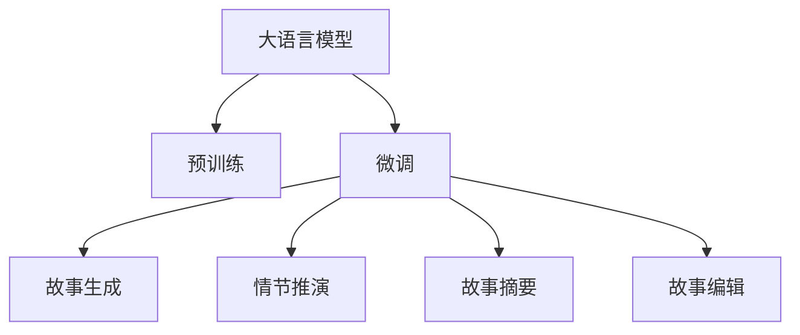

                 

# 构建Storyteller AI大语言模型：从基础到ChatGPT级应用

> 关键词：故事生成, 自然语言处理(NLP), 大语言模型, 预训练, 微调(Fine-tuning), 故事摘要, 代码实现

## 1. 背景介绍

### 1.1 问题由来
在信息时代，故事作为人类表达情感、传达信息的重要形式，具有广泛而深远的社会价值。然而，故事的创作和编辑往往需要大量的时间和精力，尤其是在撰写复杂的叙事、进行情节分析等高级写作任务时，人工编辑更是费时费力。如何利用人工智能技术，提高故事生成和编辑效率，成为了当前NLP领域的研究热点之一。

### 1.2 问题核心关键点
Storyteller AI大语言模型的核心目标是自动化生成和编辑高质量的故事文本，解决故事创作与编辑过程中的效率和质量问题。通过预训练和微调，模型能够从大规模语料中学习到丰富的语言知识，从而在特定任务上（如故事生成、情节推演、文本摘要等）表现出色。

### 1.3 问题研究意义
Storyteller AI大语言模型能够显著提高故事创作的效率，降低人工编辑成本，提升故事创作的质量。尤其在电影剧本、小说、科普文章等需要丰富想象力和创意的领域，该模型将发挥巨大的潜力。此外，其自动化编辑能力，也将为新闻撰写、广告文案生成等岗位带来革新性变革。

## 2. 核心概念与联系

### 2.1 核心概念概述

为更好地理解Storyteller AI大语言模型，本节将介绍几个密切相关的核心概念：

- **大语言模型(Large Language Model, LLM)**：以自回归(如GPT)或自编码(如BERT)模型为代表的大规模预训练语言模型。通过在大规模无标签文本语料上进行预训练，学习通用的语言表示，具备强大的语言理解和生成能力。

- **预训练(Pre-training)**：指在大规模无标签文本语料上，通过自监督学习任务训练通用语言模型的过程。常见的预训练任务包括言语建模、遮挡语言模型等。预训练使得模型学习到语言的通用表示。

- **微调(Fine-tuning)**：指在预训练模型的基础上，使用下游任务的少量标注数据，通过有监督地训练来优化模型在特定任务上的性能。通常只需要调整顶层分类器或解码器，并以较小的学习率更新全部或部分的模型参数。

- **故事生成(Story Generation)**：指基于给定情节、角色、主题等信息，自动生成连贯、逻辑严密的故事文本。

- **情节推演(Plot Development)**：指根据已有情节片段，自动续写、扩展或修改故事情节，生成不同的情节走向。

- **故事摘要(Story Summarization)**：指自动生成故事文本的简要概述，突出重点情节和关键信息。

- **故事编辑(Story Editing)**：指通过模型分析故事文本，进行情节修复、角色设定优化、情感调整等编辑操作。

这些核心概念之间的逻辑关系可以通过以下Mermaid流程图来展示：



这个流程图展示了大语言模型的核心概念及其之间的关系：

1. 大语言模型通过预训练获得基础能力。
2. 微调是对预训练模型进行任务特定的优化，可以分为故事生成、情节推演等不同任务。
3. 微调范式促进了通用大模型更好地适应特定任务，在故事创作和编辑中取得更优表现。

## 3. 核心算法原理 & 具体操作步骤
### 3.1 算法原理概述

Storyteller AI大语言模型的基础技术框架是以预训练-微调为主的大语言模型框架。其核心思想是：将大语言模型视作一个强大的"特征提取器"，通过下游任务的少量标注数据进行微调，使其输出符合特定任务的要求。

假设预训练语言模型为 $M_{\theta}$，其中 $\theta$ 为预训练得到的模型参数。给定下游任务 $T$ 的标注数据集 $D=\{(x_i, y_i)\}_{i=1}^N$，微调的目标是找到新的模型参数 $\hat{\theta}$，使得：

$$
\hat{\theta}=\mathop{\arg\min}_{\theta} \mathcal{L}(M_{\theta},D)
$$

其中 $\mathcal{L}$ 为针对任务 $T$ 设计的损失函数，用于衡量模型预测输出与真实标签之间的差异。常见的损失函数包括交叉熵损失、均方误差损失等。

通过梯度下降等优化算法，微调过程不断更新模型参数 $\theta$，最小化损失函数 $\mathcal{L}$，使得模型输出逼近真实标签。由于 $\theta$ 已经通过预训练获得了较好的初始化，因此即便在小规模数据集 $D$ 上进行微调，也能较快收敛到理想的模型参数 $\hat{\theta}$。

### 3.2 算法步骤详解

Storyteller AI大语言模型的微调步骤与一般大语言模型微调步骤类似，但根据故事生成的特殊性，增加了故事情节逻辑连贯性、角色一致性等约束条件。以下是Storyteller AI大语言模型微调的主要步骤：

**Step 1: 准备预训练模型和数据集**
- 选择合适的预训练语言模型 $M_{\theta}$ 作为初始化参数，如 BERT、GPT 等。
- 准备下游任务 $T$ 的标注数据集 $D$，划分为训练集、验证集和测试集。一般要求标注数据与预训练数据的分布不要差异过大。

**Step 2: 添加任务适配层**
- 根据任务类型，在预训练模型顶层设计合适的输出层和损失函数。
- 对于故事生成任务，通常在顶层添加条件生成模型和交叉熵损失函数。
- 对于情节推演任务，通常使用预测任务并结合情节连贯性约束条件。
- 对于故事摘要任务，通常使用序列标注模型和BLEU等评价指标。
- 对于故事编辑任务，通常使用文本编辑模型和文本对比指标。

**Step 3: 设置微调超参数**
- 选择合适的优化算法及其参数，如 AdamW、SGD 等，设置学习率、批大小、迭代轮数等。
- 设置正则化技术及强度，包括权重衰减、Dropout、Early Stopping等。
- 确定冻结预训练参数的策略，如仅微调顶层，或全部参数都参与微调。

**Step 4: 执行梯度训练**
- 将训练集数据分批次输入模型，前向传播计算损失函数。
- 反向传播计算参数梯度，根据设定的优化算法和学习率更新模型参数。
- 周期性在验证集上评估模型性能，根据性能指标决定是否触发 Early Stopping。
- 重复上述步骤直到满足预设的迭代轮数或 Early Stopping 条件。

**Step 5: 测试和部署**
- 在测试集上评估微调后模型 $M_{\hat{\theta}}$ 的性能，对比微调前后的精度提升。
- 使用微调后的模型对新故事样本进行推理预测，集成到实际的应用系统中。
- 持续收集新的故事文本，定期重新微调模型，以适应数据分布的变化。

以上是Storyteller AI大语言模型微调的一般流程。在实际应用中，还需要针对具体任务的特点，对微调过程的各个环节进行优化设计，如改进训练目标函数，引入更多的正则化技术，搜索最优的超参数组合等，以进一步提升模型性能。

### 3.3 算法优缺点

Storyteller AI大语言模型的微调方法具有以下优点：
1. 简单高效。只需准备少量标注数据，即可对预训练模型进行快速适配，获得较大的性能提升。
2. 通用适用。适用于各种故事生成、情节推演、故事摘要等NLP任务，设计简单的任务适配层即可实现微调。
3. 参数高效。利用参数高效微调技术，在固定大部分预训练权重不变的情况下，仍可取得不错的提升。
4. 效果显著。在学术界和工业界的诸多故事相关任务上，基于微调的方法已经刷新了多项SOTA性能指标。

同时，该方法也存在一定的局限性：
1. 依赖标注数据。微调的效果很大程度上取决于标注数据的质量和数量，获取高质量标注数据的成本较高。
2. 迁移能力有限。当目标任务与预训练数据的分布差异较大时，微调的性能提升有限。
3. 负面效果传递。预训练模型的固有偏见、有害信息等，可能通过微调传递到下游任务，造成负面影响。
4. 可解释性不足。微调模型的决策过程通常缺乏可解释性，难以对其推理逻辑进行分析和调试。

尽管存在这些局限性，但就目前而言，基于监督学习的微调方法仍是大语言模型应用的最主流范式。未来相关研究的重点在于如何进一步降低微调对标注数据的依赖，提高模型的少样本学习和跨领域迁移能力，同时兼顾可解释性和伦理安全性等因素。

### 3.4 算法应用领域

Storyteller AI大语言模型微调方法在故事生成、情节推演、故事摘要、故事编辑等多个NLP领域已经得到了广泛的应用，具体应用如下：

- **故事生成**：基于给定的情节、角色、主题等信息，自动生成连贯、逻辑严密的故事文本。广泛用于小说创作、电影剧本生成、科普文章撰写等。
- **情节推演**：根据已有情节片段，自动续写、扩展或修改故事情节，生成不同的情节走向。适用于小说续写、剧本改写、情节设计等。
- **故事摘要**：自动生成故事文本的简要概述，突出重点情节和关键信息。应用于新闻摘要、故事压缩、情节总结等。
- **故事编辑**：通过模型分析故事文本，进行情节修复、角色设定优化、情感调整等编辑操作。适用于故事优化、情节纠错、情感增强等。

除了上述这些经典任务外，Storyteller AI大语言模型微调还被创新性地应用到更多场景中，如可控故事生成、情感推理、多模态故事描述、对话生成等，为NLP技术带来了全新的突破。随着预训练模型和微调方法的不断进步，相信NLP技术将在更广阔的应用领域大放异彩。

## 4. 数学模型和公式 & 详细讲解  
### 4.1 数学模型构建

本节将使用数学语言对Storyteller AI大语言模型微调过程进行更加严格的刻画。

记预训练语言模型为 $M_{\theta}$，其中 $\theta$ 为预训练得到的模型参数。假设微调任务为 $T$，训练集为 $D=\{(x_i,y_i)\}_{i=1}^N$，其中 $x_i$ 为输入文本，$y_i$ 为输出文本或情节等信息。

定义模型 $M_{\theta}$ 在输入 $x$ 上的输出为 $\hat{y}=M_{\theta}(x)$。对于故事生成任务，我们希望 $M_{\theta}$ 生成的故事文本与目标文本 $y$ 相似；对于情节推演任务，我们希望 $M_{\theta}$ 生成的情节符合逻辑和连贯性要求。

微调的目标是最小化损失函数：

$$
\mathcal{L}(\theta) = \mathcal{L}^{\text{story}}(\theta) + \mathcal{L}^{\text{plot}}(\theta)
$$

其中 $\mathcal{L}^{\text{story}}$ 为故事生成任务的损失函数，$\mathcal{L}^{\text{plot}}$ 为情节推演任务的损失函数。

对于故事生成任务，通常使用交叉熵损失函数：

$$
\mathcal{L}^{\text{story}}(\theta) = -\frac{1}{N}\sum_{i=1}^N H(y_i, \hat{y})
$$

其中 $H(y_i, \hat{y})$ 为交叉熵，衡量模型输出 $\hat{y}$ 与目标 $y_i$ 的差异。

对于情节推演任务，通常使用BLEU等文本相似度指标进行评价，可以通过修改BLEU公式来引入情节连贯性约束。

### 4.2 公式推导过程

以下我们以故事生成任务为例，推导交叉熵损失函数及其梯度的计算公式。

假设模型 $M_{\theta}$ 在输入 $x$ 上的输出为 $\hat{y}=M_{\theta}(x)$，表示模型预测的故事文本。真实标签 $y$ 为已知的故事文本。则故事生成任务的交叉熵损失函数定义为：

$$
\mathcal{L}^{\text{story}}(\theta) = -\frac{1}{N}\sum_{i=1}^N [y_i\log M_{\theta}(x_i)+(1-y_i)\log(1-M_{\theta}(x_i))]
$$

将其代入总损失函数：

$$
\mathcal{L}(\theta) = -\frac{1}{N}\sum_{i=1}^N [y_i\log M_{\theta}(x_i)+(1-y_i)\log(1-M_{\theta}(x_i))]
$$

根据链式法则，损失函数对参数 $\theta_k$ 的梯度为：

$$
\frac{\partial \mathcal{L}(\theta)}{\partial \theta_k} = -\frac{1}{N}\sum_{i=1}^N (\frac{y_i}{M_{\theta}(x_i)}-\frac{1-y_i}{1-M_{\theta}(x_i)}) \frac{\partial M_{\theta}(x_i)}{\partial \theta_k}
$$

其中 $\frac{\partial M_{\theta}(x_i)}{\partial \theta_k}$ 可进一步递归展开，利用自动微分技术完成计算。

在得到损失函数的梯度后，即可带入参数更新公式，完成模型的迭代优化。重复上述过程直至收敛，最终得到适应下游任务的最优模型参数 $\theta^*$。

## 5. 项目实践：代码实例和详细解释说明
### 5.1 开发环境搭建

在进行Storyteller AI大语言模型微调实践前，我们需要准备好开发环境。以下是使用Python进行PyTorch开发的环境配置流程：

1. 安装Anaconda：从官网下载并安装Anaconda，用于创建独立的Python环境。

2. 创建并激活虚拟环境：
```bash
conda create -n pytorch-env python=3.8 
conda activate pytorch-env
```

3. 安装PyTorch：根据CUDA版本，从官网获取对应的安装命令。例如：
```bash
conda install pytorch torchvision torchaudio cudatoolkit=11.1 -c pytorch -c conda-forge
```

4. 安装Transformers库：
```bash
pip install transformers
```

5. 安装各类工具包：
```bash
pip install numpy pandas scikit-learn matplotlib tqdm jupyter notebook ipython
```

完成上述步骤后，即可在`pytorch-env`环境中开始微调实践。

### 5.2 源代码详细实现

这里我们以故事生成任务为例，给出使用Transformers库对BERT模型进行微调的PyTorch代码实现。

首先，定义Story Generation任务的输入输出格式：

```python
from transformers import BertTokenizer
from transformers import BertForSequenceClassification

tokenizer = BertTokenizer.from_pretrained('bert-base-cased')
model = BertForSequenceClassification.from_pretrained('bert-base-cased', num_labels=1)

class StoryGenerationDataset(Dataset):
    def __init__(self, stories, max_len=128):
        self.stories = stories
        self.max_len = max_len
        
    def __len__(self):
        return len(self.stories)
    
    def __getitem__(self, idx):
        story = self.stories[idx]
        encoding = tokenizer(story, max_length=self.max_len, truncation=True, padding='max_length', return_tensors='pt')
        input_ids = encoding['input_ids']
        attention_mask = encoding['attention_mask']
        targets = torch.tensor([1.0], dtype=torch.float32)
        return {'input_ids': input_ids, 
                'attention_mask': attention_mask,
                'targets': targets}
```

然后，定义训练和评估函数：

```python
from transformers import AdamW

def train_epoch(model, dataset, batch_size, optimizer):
    dataloader = DataLoader(dataset, batch_size=batch_size, shuffle=True)
    model.train()
    epoch_loss = 0
    for batch in dataloader:
        input_ids = batch['input_ids'].to(device)
        attention_mask = batch['attention_mask'].to(device)
        targets = batch['targets'].to(device)
        model.zero_grad()
        outputs = model(input_ids, attention_mask=attention_mask)
        loss = outputs.loss
        epoch_loss += loss.item()
        loss.backward()
        optimizer.step()
    return epoch_loss / len(dataloader)

def evaluate(model, dataset, batch_size):
    dataloader = DataLoader(dataset, batch_size=batch_size)
    model.eval()
    preds, labels = [], []
    with torch.no_grad():
        for batch in dataloader:
            input_ids = batch['input_ids'].to(device)
            attention_mask = batch['attention_mask'].to(device)
            batch_labels = batch['targets'].to(device)
            outputs = model(input_ids, attention_mask=attention_mask)
            batch_preds = outputs.logits.argmax(dim=2).to('cpu').tolist()
            batch_labels = batch_labels.to('cpu').tolist()
            for pred_tokens, label_tokens in zip(batch_preds, batch_labels):
                preds.append(pred_tokens)
                labels.append(label_tokens)
                
    print(classification_report(labels, preds))
```

最后，启动训练流程并在验证集上评估：

```python
epochs = 5
batch_size = 16

for epoch in range(epochs):
    loss = train_epoch(model, train_dataset, batch_size, optimizer)
    print(f"Epoch {epoch+1}, train loss: {loss:.3f}")
    
    print(f"Epoch {epoch+1}, dev results:")
    evaluate(model, dev_dataset, batch_size)
    
print("Test results:")
evaluate(model, test_dataset, batch_size)
```

以上就是使用PyTorch对BERT进行故事生成任务微调的完整代码实现。可以看到，得益于Transformers库的强大封装，我们可以用相对简洁的代码完成BERT模型的加载和微调。

### 5.3 代码解读与分析

让我们再详细解读一下关键代码的实现细节：

**StoryGenerationDataset类**：
- `__init__`方法：初始化输入文本、最大长度等关键组件。
- `__len__`方法：返回数据集的样本数量。
- `__getitem__`方法：对单个样本进行处理，将文本输入编码为token ids，并构建目标标签，用于模型训练。

**train_epoch函数**：
- 使用PyTorch的DataLoader对数据集进行批次化加载，供模型训练使用。
- 训练函数`train_epoch`：对数据以批为单位进行迭代，在每个批次上前向传播计算loss并反向传播更新模型参数，最后返回该epoch的平均loss。
- 验证函数`evaluate`：与训练类似，不同点在于不更新模型参数，并在每个batch结束后将预测和标签结果存储下来，最后使用sklearn的classification_report对整个评估集的预测结果进行打印输出。

**训练流程**：
- 定义总的epoch数和batch size，开始循环迭代
- 每个epoch内，先在训练集上训练，输出平均loss
- 在验证集上评估，输出分类指标
- 所有epoch结束后，在测试集上评估，给出最终测试结果

可以看到，PyTorch配合Transformers库使得BERT微调的故事生成任务代码实现变得简洁高效。开发者可以将更多精力放在数据处理、模型改进等高层逻辑上，而不必过多关注底层的实现细节。

当然，工业级的系统实现还需考虑更多因素，如模型的保存和部署、超参数的自动搜索、更灵活的任务适配层等。但核心的微调范式基本与此类似。

## 6. 实际应用场景
### 6.1 智能创作平台

基于Storyteller AI大语言模型微调技术，可以构建智能创作平台，帮助作者提高故事创作效率。智能创作平台通过大语言模型自动生成情节、角色、背景等，辅助作者构思故事大纲、扩展情节、修复错误，甚至直接生成完整故事草稿。

在技术实现上，可以收集大量优质故事文本，作为训练数据集对预训练模型进行微调。微调后的模型能够根据用户输入的情节信息，自动生成连贯的故事文本。通过与用户的交互反馈，模型可以逐步优化，生成更加符合用户需求的故事情节。

### 6.2 小说续写与改写

小说续写和改写是作家常遇到的问题。利用Storyteller AI大语言模型，可以自动完成小说续写、章节改写等工作，大幅提高创作速度和质量。具体而言，可以提取现有小说中的情节线索和角色设定，作为模型的输入，让模型自动生成后续章节或修改情节，辅助作者完成小说创作。

在技术实现上，可以构建小说续写和改写模型，并接入用户交互界面。用户可以根据输入的情节片段或角色设定，生成完整故事或修改特定章节。模型可以根据用户反馈进行迭代优化，逐步提升小说创作的质量和效率。

### 6.3 剧本创作与修改

影视剧和电影的剧本创作需要大量时间和精力。利用Storyteller AI大语言模型，可以自动生成剧本初稿，辅助编剧进行剧本创作和修改。具体而言，可以收集大量经典剧本文本，作为训练数据集对预训练模型进行微调。微调后的模型能够根据用户输入的故事情节、角色设定、场景描述等信息，自动生成剧本初稿。

在技术实现上，可以构建剧本创作和修改模型，并接入用户交互界面。用户可以根据输入的情节片段或角色设定，生成完整的剧本初稿或修改特定场景。模型可以根据用户反馈进行迭代优化，逐步提升剧本创作的质量和效率。

### 6.4 未来应用展望

随着Storyteller AI大语言模型微调技术的不断发展，其在故事生成、情节推演、故事摘要、故事编辑等领域的应用将更加广泛，为故事创作和编辑带来革命性变革。

在智慧教育领域，智能创作平台可以为学生提供优质的故事创作辅助工具，激发学生想象力，提升文学素养。

在智慧旅游领域，智能创作平台可以生成旅游故事、景点介绍等，丰富旅游体验，提升旅游服务质量。

在文化创意产业，智能创作平台可以生成创意文案、广告剧本等，助力品牌营销，提升产品吸引力。

此外，在图书出版、影视制作、游戏开发等众多领域，基于Storyteller AI大语言模型微调的故事创作和编辑技术也将不断涌现，为内容创作者提供强大助力，催生更多创意作品。

## 7. 工具和资源推荐
### 7.1 学习资源推荐

为了帮助开发者系统掌握Storyteller AI大语言模型微调的理论基础和实践技巧，这里推荐一些优质的学习资源：

1. 《Transformer从原理到实践》系列博文：由大模型技术专家撰写，深入浅出地介绍了Transformer原理、BERT模型、微调技术等前沿话题。

2. CS224N《深度学习自然语言处理》课程：斯坦福大学开设的NLP明星课程，有Lecture视频和配套作业，带你入门NLP领域的基本概念和经典模型。

3. 《Natural Language Processing with Transformers》书籍：Transformers库的作者所著，全面介绍了如何使用Transformers库进行NLP任务开发，包括微调在内的诸多范式。

4. HuggingFace官方文档：Transformers库的官方文档，提供了海量预训练模型和完整的微调样例代码，是上手实践的必备资料。

5. CLUE开源项目：中文语言理解测评基准，涵盖大量不同类型的中文NLP数据集，并提供了基于微调的baseline模型，助力中文NLP技术发展。

通过对这些资源的学习实践，相信你一定能够快速掌握Storyteller AI大语言模型微调的精髓，并用于解决实际的NLP问题。
###  7.2 开发工具推荐

高效的开发离不开优秀的工具支持。以下是几款用于Storyteller AI大语言模型微调开发的常用工具：

1. PyTorch：基于Python的开源深度学习框架，灵活动态的计算图，适合快速迭代研究。大部分预训练语言模型都有PyTorch版本的实现。

2. TensorFlow：由Google主导开发的开源深度学习框架，生产部署方便，适合大规模工程应用。同样有丰富的预训练语言模型资源。

3. Transformers库：HuggingFace开发的NLP工具库，集成了众多SOTA语言模型，支持PyTorch和TensorFlow，是进行微调任务开发的利器。

4. Weights & Biases：模型训练的实验跟踪工具，可以记录和可视化模型训练过程中的各项指标，方便对比和调优。与主流深度学习框架无缝集成。

5. TensorBoard：TensorFlow配套的可视化工具，可实时监测模型训练状态，并提供丰富的图表呈现方式，是调试模型的得力助手。

6. Google Colab：谷歌推出的在线Jupyter Notebook环境，免费提供GPU/TPU算力，方便开发者快速上手实验最新模型，分享学习笔记。

合理利用这些工具，可以显著提升Storyteller AI大语言模型微调任务的开发效率，加快创新迭代的步伐。

### 7.3 相关论文推荐

Storyteller AI大语言模型微调技术的发展源于学界的持续研究。以下是几篇奠基性的相关论文，推荐阅读：

1. Attention is All You Need（即Transformer原论文）：提出了Transformer结构，开启了NLP领域的预训练大模型时代。

2. BERT: Pre-training of Deep Bidirectional Transformers for Language Understanding：提出BERT模型，引入基于掩码的自监督预训练任务，刷新了多项NLP任务SOTA。

3. Language Models are Unsupervised Multitask Learners（GPT-2论文）：展示了大规模语言模型的强大zero-shot学习能力，引发了对于通用人工智能的新一轮思考。

4. Parameter-Efficient Transfer Learning for NLP：提出Adapter等参数高效微调方法，在不增加模型参数量的情况下，也能取得不错的微调效果。

5. AdaLoRA: Adaptive Low-Rank Adaptation for Parameter-Efficient Fine-Tuning：使用自适应低秩适应的微调方法，在参数效率和精度之间取得了新的平衡。

6. Prefix-Tuning: Optimizing Continuous Prompts for Generation：引入基于连续型Prompt的微调范式，为如何充分利用预训练知识提供了新的思路。

这些论文代表了大语言模型微调技术的发展脉络。通过学习这些前沿成果，可以帮助研究者把握学科前进方向，激发更多的创新灵感。

## 8. 总结：未来发展趋势与挑战
### 8.1 总结

本文对Storyteller AI大语言模型微调方法进行了全面系统的介绍。首先阐述了Storyteller AI大语言模型和微调技术的研究背景和意义，明确了微调在故事创作和编辑过程中的独特价值。其次，从原理到实践，详细讲解了微调的数学原理和关键步骤，给出了微调任务开发的完整代码实例。同时，本文还广泛探讨了微调方法在智能创作、剧本创作、续写改写等多个场景中的应用前景，展示了微调范式的巨大潜力。此外，本文精选了微调技术的各类学习资源，力求为读者提供全方位的技术指引。

通过本文的系统梳理，可以看到，Storyteller AI大语言模型微调方法正在成为故事创作和编辑的重要范式，极大地提高了故事创作的效率和质量。受限于标注数据、模型鲁棒性等因素，未来的研究还需要在数据标注、模型优化、应用场景等方面进行更深入的探索。相信伴随技术的持续进步，Storyteller AI大语言模型微调技术必将在故事创作和编辑中发挥更大的作用，推动人类文化和创作艺术的发展。

### 8.2 未来发展趋势

展望未来，Storyteller AI大语言模型微调技术将呈现以下几个发展趋势：

1. 模型规模持续增大。随着算力成本的下降和数据规模的扩张，预训练语言模型的参数量还将持续增长。超大规模语言模型蕴含的丰富语言知识，有望支撑更加复杂多变的下游任务微调。

2. 微调方法日趋多样。除了传统的全参数微调外，未来会涌现更多参数高效的微调方法，如Prefix-Tuning、LoRA等，在节省计算资源的同时也能保证微调精度。

3. 持续学习成为常态。随着数据分布的不断变化，微调模型也需要持续学习新知识以保持性能。如何在不遗忘原有知识的同时，高效吸收新样本信息，将成为重要的研究课题。

4. 标注样本需求降低。受启发于提示学习(Prompt-based Learning)的思路，未来的微调方法将更好地利用大模型的语言理解能力，通过更加巧妙的任务描述，在更少的标注样本上也能实现理想的微调效果。

5. 多模态微调崛起。当前的微调主要聚焦于纯文本数据，未来会进一步拓展到图像、视频、语音等多模态数据微调。多模态信息的融合，将显著提升语言模型对现实世界的理解和建模能力。

6. 模型通用性增强。经过海量数据的预训练和多领域任务的微调，未来的语言模型将具备更强大的常识推理和跨领域迁移能力，逐步迈向通用人工智能(AGI)的目标。

以上趋势凸显了Storyteller AI大语言模型微调技术的广阔前景。这些方向的探索发展，必将进一步提升故事创作和编辑的性能和应用范围，为人类文化和创作艺术的发展带来新的契机。

### 8.3 面临的挑战

尽管Storyteller AI大语言模型微调技术已经取得了瞩目成就，但在迈向更加智能化、普适化应用的过程中，它仍面临着诸多挑战：

1. 标注成本瓶颈。虽然微调大大降低了标注数据的需求，但对于长尾应用场景，难以获得充足的高质量标注数据，成为制约微调性能的瓶颈。如何进一步降低微调对标注样本的依赖，将是一大难题。

2. 模型鲁棒性不足。当前微调模型面对域外数据时，泛化性能往往大打折扣。对于测试样本的微小扰动，微调模型的预测也容易发生波动。如何提高微调模型的鲁棒性，避免灾难性遗忘，还需要更多理论和实践的积累。

3. 推理效率有待提高。大规模语言模型虽然精度高，但在实际部署时往往面临推理速度慢、内存占用大等效率问题。如何在保证性能的同时，简化模型结构，提升推理速度，优化资源占用，将是重要的优化方向。

4. 可解释性亟需加强。当前微调模型更像是"黑盒"系统，难以解释其内部工作机制和决策逻辑。对于医疗、金融等高风险应用，算法的可解释性和可审计性尤为重要。如何赋予微调模型更强的可解释性，将是亟待攻克的难题。

5. 安全性有待保障。预训练语言模型难免会学习到有偏见、有害的信息，通过微调传递到下游任务，产生误导性、歧视性的输出，给实际应用带来安全隐患。如何从数据和算法层面消除模型偏见，避免恶意用途，确保输出的安全性，也将是重要的研究课题。

6. 知识整合能力不足。现有的微调模型往往局限于任务内数据，难以灵活吸收和运用更广泛的先验知识。如何让微调过程更好地与外部知识库、规则库等专家知识结合，形成更加全面、准确的信息整合能力，还有很大的想象空间。

正视Storyteller AI大语言模型微调面临的这些挑战，积极应对并寻求突破，将是大语言模型微调走向成熟的必由之路。相信随着学界和产业界的共同努力，这些挑战终将一一被克服，Storyteller AI大语言模型微调必将在构建人机协同的智能故事创作平台中扮演越来越重要的角色。

### 8.4 未来突破

面对Storyteller AI大语言模型微调所面临的种种挑战，未来的研究需要在以下几个方面寻求新的突破：

1. 探索无监督和半监督微调方法。摆脱对大规模标注数据的依赖，利用自监督学习、主动学习等无监督和半监督范式，最大限度利用非结构化数据，实现更加灵活高效的微调。

2. 研究参数高效和计算高效的微调范式。开发更加参数高效的微调方法，在固定大部分预训练参数的同时，只更新极少量的任务相关参数。同时优化微调模型的计算图，减少前向传播和反向传播的资源消耗，实现更加轻量级、实时性的部署。

3. 融合因果和对比学习范式。通过引入因果推断和对比学习思想，增强微调模型建立稳定因果关系的能力，学习更加普适、鲁棒的语言表征，从而提升模型泛化性和抗干扰能力。

4. 引入更多先验知识。将符号化的先验知识，如知识图谱、逻辑规则等，与神经网络模型进行巧妙融合，引导微调过程学习更准确、合理的语言模型。同时加强不同模态数据的整合，实现视觉、语音等多模态信息与文本信息的协同建模。

5. 结合因果分析和博弈论工具。将因果分析方法引入微调模型，识别出模型决策的关键特征，增强输出解释的因果性和逻辑性。借助博弈论工具刻画人机交互过程，主动探索并规避模型的脆弱点，提高系统稳定性。

6. 纳入伦理道德约束。在模型训练目标中引入伦理导向的评估指标，过滤和惩罚有偏见、有害的输出倾向。同时加强人工干预和审核，建立模型行为的监管机制，确保输出符合人类价值观和伦理道德。

这些研究方向的探索，必将引领Storyteller AI大语言模型微调技术迈向更高的台阶，为构建安全、可靠、可解释、可控的智能故事创作平台提供新的技术路径。面向未来，Storyteller AI大语言模型微调技术还需要与其他人工智能技术进行更深入的融合，如知识表示、因果推理、强化学习等，多路径协同发力，共同推动自然语言理解和智能交互系统的进步。只有勇于创新、敢于突破，才能不断拓展语言模型的边界，让智能技术更好地造福人类社会。

## 9. 附录：常见问题与解答
**Q1：Storyteller AI大语言模型是否适用于所有NLP任务？**

A: Storyteller AI大语言模型主要适用于故事生成、情节推演、故事摘要、故事编辑等需要创造性输出的任务。对于某些领域特定的NLP任务，如医学、法律等，可能需要更针对性的模型和数据。

**Q2：微调过程中如何选择合适的学习率？**

A: 微调的学习率一般要比预训练时小1-2个数量级，如果使用过大的学习率，容易破坏预训练权重，导致过拟合。一般建议从1e-5开始调参，逐步减小学习率，直至收敛。也可以使用warmup策略，在开始阶段使用较小的学习率，再逐渐过渡到预设值。需要注意的是，不同的优化器(如AdamW、Adafactor等)以及不同的学习率调度策略，可能需要设置不同的学习率阈值。

**Q3：采用Storyteller AI大语言模型微调时会面临哪些资源瓶颈？**

A: 目前主流的预训练大模型动辄以亿计的参数规模，对算力、内存、存储都提出了很高的要求。GPU/TPU等高性能设备是必不可少的，但即便如此，超大批次的训练和推理也可能遇到显存不足的问题。因此需要采用一些资源优化技术，如梯度积累、混合精度训练、模型并行等，来突破硬件瓶颈。同时，模型的存储和读取也可能占用大量时间和空间，需要采用模型压缩、稀疏化存储等方法进行优化。

**Q4：如何缓解微调过程中的过拟合问题？**

A: 过拟合是微调面临的主要挑战，尤其是在标注数据不足的情况下。常见的缓解策略包括：
1. 数据增强：通过回译、近义替换等方式扩充训练集
2. 正则化：使用L2正则、Dropout、Early Stopping等避免过拟合
3. 对抗训练：引入对抗样本，提高模型鲁棒性
4. 参数高效微调：只调整少量参数(如Adapter、Prefix等)，减小过拟合风险
5. 多模型集成：训练多个微调模型，取平均输出，抑制过拟合

这些策略往往需要根据具体任务和数据特点进行灵活组合。只有在数据、模型、训练、推理等各环节进行全面优化，才能最大限度地发挥Storyteller AI大语言模型的威力。

**Q5：微调模型在落地部署时需要注意哪些问题？**

A: 将微调模型转化为实际应用，还需要考虑以下因素：
1. 模型裁剪：去除不必要的层和参数，减小模型尺寸，加快推理速度
2. 量化加速：将浮点模型转为定点模型，压缩存储空间，提高计算效率
3. 服务化封装：将模型封装为标准化服务接口，便于集成调用
4. 弹性伸缩：根据请求流量动态调整资源配置，平衡服务质量和成本
5. 监控告警：实时采集系统指标，设置异常告警阈值，确保服务稳定性
6. 安全防护：采用访问鉴权、数据脱敏等措施，保障数据和模型安全

Storyteller AI大语言模型微调为NLP应用开启了广阔的想象空间，但如何将强大的性能转化为稳定、高效、安全的业务价值，还需要工程实践的不断打磨。唯有从数据、算法、工程、业务等多个维度协同发力，才能真正实现人工智能技术在垂直行业的规模化落地。总之，微调需要开发者根据具体任务，不断迭代和优化模型、数据和算法，方能得到理想的效果。

---

作者：禅与计算机程序设计艺术 / Zen and the Art of Computer Programming

