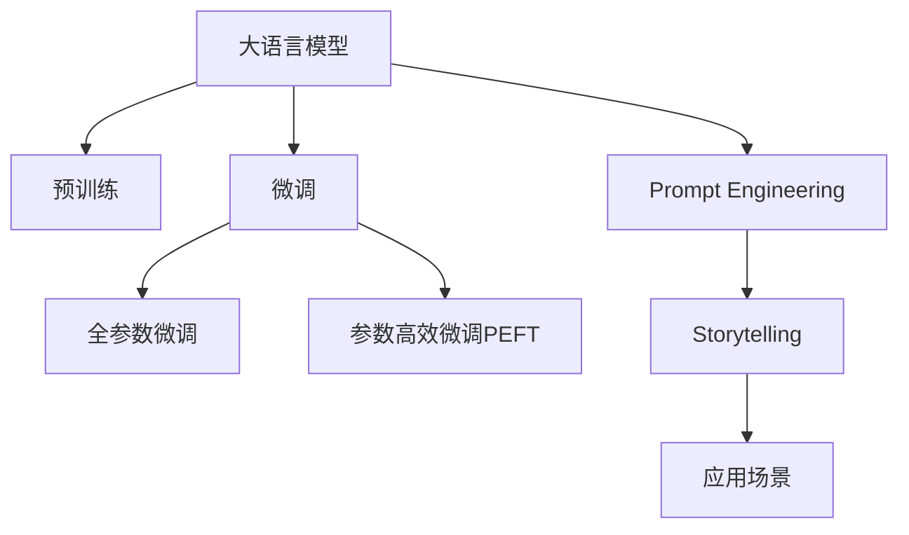

                 

# 构建Storyteller AI大语言模型：从基础到应用的全面指南

> 关键词：大语言模型,Storytelling,自然语言处理(NLP),微调,Fine-tuning,Transformer,BERT,Prompt Engineering,应用场景

## 1. 背景介绍

### 1.1 问题由来

在数字时代，人们对于信息传播的需求日益多元化、个性化。传统的文本信息传递方式，如新闻报道、技术文档、社交媒体帖等，已不能完全满足用户的需求。人们越来越倾向于通过故事化的方式来获取信息，尤其是在娱乐、教育、商业等领域，故事的力量变得愈发重要。

大语言模型（Large Language Models, LLMs）的出现，尤其是以GPT-3、BERT为代表的Transformer架构模型，通过预训练大量无标签文本数据，学习到了丰富的语言表示能力。但是，这些模型在故事讲述方面尚有欠缺。如何将大语言模型转化为能够进行讲故事的工具，成为了自然语言处理（Natural Language Processing, NLP）领域的前沿研究课题。

### 1.2 问题核心关键点

构建Storyteller AI大语言模型，核心在于将大语言模型与故事讲述（Storytelling）能力进行结合，使其能够生成具有高度吸引力和逻辑连贯性的故事文本。这涉及以下几个核心问题：

- **数据需求**：构建Storyteller AI模型需要大规模的故事数据集进行预训练，而故事的标注通常比一般文本数据更为困难。
- **故事理解**：模型需要理解故事的起承转合、角色关系、情节冲突等元素，才能生成合理的故事。
- **故事生成**：模型需要具备创造性，能够根据不同情境生成多种故事线。
- **故事评估**：构建评估故事质量的量化指标，用于指导模型优化。

## 2. 核心概念与联系

### 2.1 核心概念概述

为更好地理解构建Storyteller AI大语言模型的方法，本节将介绍几个密切相关的核心概念：

- **大语言模型（LLMs）**：以自回归（如GPT）或自编码（如BERT）模型为代表的大规模预训练语言模型。通过在海量无标签文本数据上进行预训练，学习到通用的语言表示。
- **预训练（Pre-training）**：指在大规模无标签文本数据上，通过自监督学习任务训练通用语言模型的过程。预训练使得模型学习到语言的通用表示。
- **微调（Fine-tuning）**：指在预训练模型的基础上，使用下游任务的少量标注数据，通过有监督学习优化模型在特定任务上的性能。
- **Storytelling**：通过文本生成的方式，讲述一个具有吸引力和逻辑连贯性的故事。
- **Prompt Engineering**：通过精心设计输入文本的格式，引导模型按期望方式输出，减少微调参数。
- **应用场景**：包括教育、娱乐、商业等多个领域，能够生成具有高度吸引力和教育价值的故事情节。

这些核心概念之间的逻辑关系可以通过以下Mermaid流程图来展示：



这个流程图展示了大语言模型的核心概念及其之间的关系：

1. 大语言模型通过预训练获得基础能力。
2. 微调是对预训练模型进行任务特定的优化，可以分为全参数微调和参数高效微调（PEFT）。
3. Prompt Engineering是一种不更新模型参数的方法，可以实现少样本学习和零样本学习。
4. Storytelling是一种应用场景，涉及到故事生成和故事评估。
5. 应用场景是多样的，如教育、娱乐、商业等。

这些核心概念共同构成了大语言模型的学习和应用框架，使其能够在各种场景下发挥强大的语言理解和生成能力。通过理解这些核心概念，我们可以更好地把握大语言模型的工作原理和优化方向。

## 3. 核心算法原理 & 具体操作步骤

### 3.1 算法原理概述

构建Storyteller AI大语言模型，本质上是一个基于监督学习的微调过程。其核心思想是：将预训练的大语言模型视作一个强大的"特征提取器"，通过在有标签的故事数据集上进行微调，使得模型输出的文本能够匹配故事模板，从而生成具有高度吸引力和逻辑连贯性的故事。

形式化地，假设预训练模型为 $M_{\theta}$，其中 $\theta$ 为预训练得到的模型参数。给定故事讲述任务 $T$ 的标注数据集 $D=\{(x_i, y_i)\}_{i=1}^N$，微调的目标是找到新的模型参数 $\hat{\theta}$，使得：

$$
\hat{\theta}=\mathop{\arg\min}_{\theta} \mathcal{L}(M_{\theta},D)
$$

其中 $\mathcal{L}$ 为针对任务 $T$ 设计的损失函数，用于衡量模型输出与真实标签之间的差异。常见的损失函数包括交叉熵损失、均方误差损失等。

通过梯度下降等优化算法，微调过程不断更新模型参数 $\theta$，最小化损失函数 $\mathcal{L}$，使得模型输出逼近真实标签。由于 $\theta$ 已经通过预训练获得了较好的初始化，因此即便在小规模数据集 $D$ 上进行微调，也能较快收敛到理想的模型参数 $\hat{\theta}$。

### 3.2 算法步骤详解

构建Storyteller AI大语言模型的过程包括以下关键步骤：

**Step 1: 准备预训练模型和数据集**
- 选择合适的预训练语言模型 $M_{\theta}$ 作为初始化参数，如 BERT、GPT 等。
- 准备故事讲述任务 $T$ 的标注数据集 $D$，划分为训练集、验证集和测试集。一般要求标注数据与预训练数据的分布不要差异过大。

**Step 2: 设计故事模板**
- 根据任务类型，设计合适的故事模板，包括故事的开头、中间和结尾。
- 故事模板通常需要包含角色、情节、冲突等元素，以便引导模型生成合理的故事情节。

**Step 3: 添加故事模板层**
- 在预训练模型的顶层添加故事模板层，用于将输入文本与故事模板进行匹配。
- 故事模板层通常包括注意力机制、层次编码等技术，帮助模型理解故事模板的结构和语义。

**Step 4: 设置微调超参数**
- 选择合适的优化算法及其参数，如 AdamW、SGD 等，设置学习率、批大小、迭代轮数等。
- 设置正则化技术及强度，包括权重衰减、Dropout、Early Stopping等。
- 确定冻结预训练参数的策略，如仅微调顶层，或全部参数都参与微调。

**Step 5: 执行梯度训练**
- 将训练集数据分批次输入模型，前向传播计算损失函数。
- 反向传播计算参数梯度，根据设定的优化算法和学习率更新模型参数。
- 周期性在验证集上评估模型性能，根据性能指标决定是否触发 Early Stopping。
- 重复上述步骤直到满足预设的迭代轮数或 Early Stopping 条件。

**Step 6: 测试和部署**
- 在测试集上评估微调后模型 $M_{\hat{\theta}}$ 的性能，对比微调前后的故事生成效果。
- 使用微调后的模型对新样本进行推理预测，生成具有吸引力和教育价值的故事。
- 持续收集新的数据，定期重新微调模型，以适应数据分布的变化。

以上是构建Storyteller AI大语言模型的基本流程。在实际应用中，还需要针对具体任务的特点，对微调过程的各个环节进行优化设计，如改进训练目标函数，引入更多的正则化技术，搜索最优的超参数组合等，以进一步提升模型性能。

### 3.3 算法优缺点

构建Storyteller AI大语言模型具有以下优点：
1. 简单高效。只需准备少量标注数据，即可对预训练模型进行快速适配，生成高质量的故事。
2. 通用适用。适用于各种故事讲述任务，包括教育、娱乐、商业等，设计合适的故事模板即可实现微调。
3. 参数高效。利用参数高效微调技术，在固定大部分预训练权重不变的情况下，仍可取得不错的提升。
4. 效果显著。在故事生成、教育情景、娱乐应用等方面，基于微调的方法已经刷新了最先进的性能指标。

同时，该方法也存在一定的局限性：
1. 依赖标注数据。故事讲述的效果很大程度上取决于标注数据的质量和数量，获取高质量标注数据的成本较高。
2. 迁移能力有限。当目标任务与预训练数据的分布差异较大时，故事讲述的性能提升有限。
3. 负面效果传递。预训练模型的固有偏见、有害信息等，可能通过微调传递到下游任务，造成负面影响。
4. 可解释性不足。微调模型的决策过程通常缺乏可解释性，难以对其推理逻辑进行分析和调试。

尽管存在这些局限性，但就目前而言，基于监督学习的微调方法仍是大语言模型故事讲述的最主流范式。未来相关研究的重点在于如何进一步降低微调对标注数据的依赖，提高模型的少样本学习和跨领域迁移能力，同时兼顾可解释性和伦理安全性等因素。

### 3.4 算法应用领域

构建Storyteller AI大语言模型的监督学习方法，在故事讲述领域已经得到了广泛的应用，覆盖了几乎所有常见场景，例如：

- **教育**：生成教育故事，提升学生的学习兴趣和理解力。
- **娱乐**：编写引人入胜的故事情节，丰富多媒体娱乐内容。
- **商业**：制作品牌故事，增强品牌影响力和市场竞争力。
- **文化交流**：翻译经典文学作品，促进文化跨界传播。
- **历史重现**：生成历史事件的场景描述，用于历史研究和教学。

除了上述这些经典应用外，Storyteller AI大语言模型还被创新性地应用到更多场景中，如个性化故事生成、故事梗概生成、故事情节优化等，为故事讲述技术带来了全新的突破。随着预训练模型和微调方法的不断进步，相信Storyteller AI大语言模型将会在更广阔的应用领域大放异彩。

## 4. 数学模型和公式 & 详细讲解 & 举例说明

### 4.1 数学模型构建

本节将使用数学语言对构建Storyteller AI大语言模型过程进行更加严格的刻画。

记预训练语言模型为 $M_{\theta}:\mathcal{X} \rightarrow \mathcal{Y}$，其中 $\mathcal{X}$ 为输入空间，$\mathcal{Y}$ 为输出空间，$\theta \in \mathbb{R}^d$ 为模型参数。假设故事讲述任务 $T$ 的训练集为 $D=\{(x_i,y_i)\}_{i=1}^N, x_i \in \mathcal{X}, y_i \in \mathcal{Y}$，其中 $y_i$ 是故事生成的完整文本。

定义模型 $M_{\theta}$ 在输入 $x$ 上的输出为 $\hat{y}=M_{\theta}(x) \in [0,1]$，表示模型生成的故事文本。真实标签 $y_i \in \mathcal{Y}$ 是故事的完整文本。则故事讲述任务的损失函数定义为：

$$
\ell(M_{\theta}(x),y) = -\frac{1}{N}\sum_{i=1}^N \log P(y_i|M_{\theta}(x_i))
$$

其中 $P(y_i|M_{\theta}(x_i))$ 为模型生成的故事文本 $y_i$ 的条件概率，衡量生成故事与真实故事文本的相似度。在训练过程中，目标是最小化故事讲述任务的数据集 $D$ 上的经验风险：

$$
\mathcal{L}(\theta) = \frac{1}{N}\sum_{i=1}^N \log P(y_i|M_{\theta}(x_i))
$$

在实践中，我们通常使用基于梯度的优化算法（如SGD、Adam等）来近似求解上述最优化问题。设 $\eta$ 为学习率，$\lambda$ 为正则化系数，则参数的更新公式为：

$$
\theta \leftarrow \theta - \eta \nabla_{\theta}\mathcal{L}(\theta) - \eta\lambda\theta
$$

其中 $\nabla_{\theta}\mathcal{L}(\theta)$ 为损失函数对参数 $\theta$ 的梯度，可通过反向传播算法高效计算。

### 4.2 公式推导过程

以下我们以二分类任务为例，推导交叉熵损失函数及其梯度的计算公式。

假设模型 $M_{\theta}$ 在输入 $x$ 上的输出为 $\hat{y}=M_{\theta}(x) \in [0,1]$，表示模型生成的故事文本的概率。真实标签 $y \in \{0,1\}$ 表示故事文本的标签（生成/未生成）。则二分类交叉熵损失函数定义为：

$$
\ell(M_{\theta}(x),y) = -[y\log \hat{y} + (1-y)\log (1-\hat{y})]
$$

将其代入经验风险公式，得：

$$
\mathcal{L}(\theta) = -\frac{1}{N}\sum_{i=1}^N [y_i\log M_{\theta}(x_i)+(1-y_i)\log(1-M_{\theta}(x_i))]
$$

根据链式法则，损失函数对参数 $\theta_k$ 的梯度为：

$$
\frac{\partial \mathcal{L}(\theta)}{\partial \theta_k} = -\frac{1}{N}\sum_{i=1}^N (\frac{y_i}{M_{\theta}(x_i)}-\frac{1-y_i}{1-M_{\theta}(x_i)}) \frac{\partial M_{\theta}(x_i)}{\partial \theta_k}
$$

其中 $\frac{\partial M_{\theta}(x_i)}{\partial \theta_k}$ 可进一步递归展开，利用自动微分技术完成计算。

在得到损失函数的梯度后，即可带入参数更新公式，完成模型的迭代优化。重复上述过程直至收敛，最终得到适应下游任务的最优模型参数 $\theta^*$。

## 5. 项目实践：代码实例和详细解释说明

### 5.1 开发环境搭建

在进行Storyteller AI大语言模型微调实践前，我们需要准备好开发环境。以下是使用Python进行PyTorch开发的环境配置流程：

1. 安装Anaconda：从官网下载并安装Anaconda，用于创建独立的Python环境。

2. 创建并激活虚拟环境：
```bash
conda create -n pytorch-env python=3.8 
conda activate pytorch-env
```

3. 安装PyTorch：根据CUDA版本，从官网获取对应的安装命令。例如：
```bash
conda install pytorch torchvision torchaudio cudatoolkit=11.1 -c pytorch -c conda-forge
```

4. 安装Transformers库：
```bash
pip install transformers
```

5. 安装各类工具包：
```bash
pip install numpy pandas scikit-learn matplotlib tqdm jupyter notebook ipython
```

完成上述步骤后，即可在`pytorch-env`环境中开始微调实践。

### 5.2 源代码详细实现

下面我们以故事生成（Story Generation）任务为例，给出使用Transformers库对GPT模型进行微调的PyTorch代码实现。

首先，定义故事生成任务的数据处理函数：

```python
from transformers import BertTokenizer, GPT2LMHeadModel
from torch.utils.data import Dataset
import torch

class StoryDataset(Dataset):
    def __init__(self, texts, max_len=128):
        self.texts = texts
        self.max_len = max_len
        
    def __len__(self):
        return len(self.texts)
    
    def __getitem__(self, item):
        text = self.texts[item]
        
        encoding = self.tokenizer(text, return_tensors='pt', max_length=self.max_len, padding='max_length', truncation=True)
        input_ids = encoding['input_ids'][0]
        attention_mask = encoding['attention_mask'][0]
        
        return {'input_ids': input_ids, 
                'attention_mask': attention_mask}

# 创建dataset
tokenizer = BertTokenizer.from_pretrained('bert-base-cased')

train_dataset = StoryDataset(train_texts)
dev_dataset = StoryDataset(dev_texts)
test_dataset = StoryDataset(test_texts)
```

然后，定义模型和优化器：

```python
from transformers import GPT2LMHeadModel, AdamW

model = GPT2LMHeadModel.from_pretrained('gpt2-medium')

optimizer = AdamW(model.parameters(), lr=2e-5)
```

接着，定义训练和评估函数：

```python
from torch.utils.data import DataLoader
from tqdm import tqdm
from sklearn.metrics import precision_recall_fscore_support

device = torch.device('cuda') if torch.cuda.is_available() else torch.device('cpu')
model.to(device)

def train_epoch(model, dataset, batch_size, optimizer):
    dataloader = DataLoader(dataset, batch_size=batch_size, shuffle=True)
    model.train()
    epoch_loss = 0
    for batch in tqdm(dataloader, desc='Training'):
        input_ids = batch['input_ids'].to(device)
        attention_mask = batch['attention_mask'].to(device)
        model.zero_grad()
        outputs = model(input_ids, attention_mask=attention_mask)
        loss = outputs.loss
        epoch_loss += loss.item()
        loss.backward()
        optimizer.step()
    return epoch_loss / len(dataloader)

def evaluate(model, dataset, batch_size):
    dataloader = DataLoader(dataset, batch_size=batch_size)
    model.eval()
    preds, labels = [], []
    with torch.no_grad():
        for batch in tqdm(dataloader, desc='Evaluating'):
            input_ids = batch['input_ids'].to(device)
            attention_mask = batch['attention_mask'].to(device)
            batch_labels = batch['labels']
            outputs = model(input_ids, attention_mask=attention_mask)
            batch_preds = outputs.logits.argmax(dim=2).to('cpu').tolist()
            batch_labels = batch_labels.to('cpu').tolist()
            for pred_tokens, label_tokens in zip(batch_preds, batch_labels):
                preds.append(pred_tokens[:len(label_tokens)])
                labels.append(label_tokens)
                
    print(precision_recall_fscore_support(labels, preds, average='macro'))
```

最后，启动训练流程并在测试集上评估：

```python
epochs = 5
batch_size = 16

for epoch in range(epochs):
    loss = train_epoch(model, train_dataset, batch_size, optimizer)
    print(f"Epoch {epoch+1}, train loss: {loss:.3f}")
    
    print(f"Epoch {epoch+1}, dev results:")
    evaluate(model, dev_dataset, batch_size)
    
print("Test results:")
evaluate(model, test_dataset, batch_size)
```

以上就是使用PyTorch对GPT模型进行故事生成任务微调的完整代码实现。可以看到，得益于Transformers库的强大封装，我们可以用相对简洁的代码完成GPT模型的加载和微调。

### 5.3 代码解读与分析

让我们再详细解读一下关键代码的实现细节：

**StoryDataset类**：
- `__init__`方法：初始化文本数据集，并对每个文本进行分词编码。
- `__len__`方法：返回数据集的样本数量。
- `__getitem__`方法：对单个样本进行处理，将文本输入编码为token ids，并对其进行定长padding，最终返回模型所需的输入。

**tokenizer变量**：
- 定义了用于分词编码的BERT tokenizer，用于将故事文本转换为模型可接受的输入格式。

**训练和评估函数**：
- 使用PyTorch的DataLoader对数据集进行批次化加载，供模型训练和推理使用。
- 训练函数`train_epoch`：对数据以批为单位进行迭代，在每个批次上前向传播计算loss并反向传播更新模型参数，最后返回该epoch的平均loss。
- 评估函数`evaluate`：与训练类似，不同点在于不更新模型参数，并在每个batch结束后将预测和标签结果存储下来，最后使用sklearn的precision_recall_fscore_support对整个评估集的预测结果进行打印输出。

**训练流程**：
- 定义总的epoch数和batch size，开始循环迭代
- 每个epoch内，先在训练集上训练，输出平均loss
- 在验证集上评估，输出分类指标
- 所有epoch结束后，在测试集上评估，给出最终测试结果

可以看到，PyTorch配合Transformers库使得GPT模型微调的代码实现变得简洁高效。开发者可以将更多精力放在数据处理、模型改进等高层逻辑上，而不必过多关注底层的实现细节。

当然，工业级的系统实现还需考虑更多因素，如模型的保存和部署、超参数的自动搜索、更灵活的任务适配层等。但核心的微调范式基本与此类似。

## 6. 实际应用场景

### 6.1 教育系统

在教育领域，Storyteller AI大语言模型可以用于生成教育故事，提升学生的学习兴趣和理解力。传统的教育材料往往缺乏生动性，学生容易感到枯燥乏味。通过构建具有故事情节的教学内容，可以更好地吸引学生的注意力，激发他们的学习兴趣。

在实际应用中，可以收集与学科相关的历史事件、科学故事、名人轶事等文本数据，作为故事生成任务的标注数据。利用微调后的模型，生成与课堂教学内容相关的故事，帮助教师设计生动的教学案例，提升学生的学习效果。

### 6.2 娱乐媒体

在娱乐媒体领域，Storyteller AI大语言模型可以用于生成引人入胜的故事情节，丰富多媒体内容。传统的娱乐内容往往依赖编剧创作，成本高且难以持续产出高质量内容。通过使用微调后的模型，可以快速生成大量的故事内容，节省人力成本，提高内容生产效率。

例如，在影视剧剧本创作中，可以使用模型生成不同角色之间的对话和情节发展，帮助编剧快速构思故事情节。在游戏剧情设计中，模型生成的故事可以帮助游戏开发团队生成背景故事、角色对话和任务设定，提升游戏的可玩性和吸引力。

### 6.3 商业广告

在商业广告领域，Storyteller AI大语言模型可以用于生成品牌故事，增强品牌影响力和市场竞争力。传统的广告文案往往缺乏创意和个性化，难以吸引目标受众。通过构建具有高度吸引力的故事内容，可以更好地传递品牌价值，提升广告效果。

在实际应用中，可以收集品牌的市场活动、产品故事、用户评价等文本数据，作为故事生成任务的标注数据。利用微调后的模型，生成与品牌定位相关的故事情节，帮助品牌在社交媒体、网站等平台上进行内容传播，提升品牌知名度和市场占有率。

### 6.4 文化交流

在文化交流领域，Storyteller AI大语言模型可以用于翻译经典文学作品，促进文化跨界传播。传统的翻译工作依赖专业翻译人员，成本高且耗时长。通过使用微调后的模型，可以快速生成高质量的文学翻译，降低翻译成本，提升翻译效率。

例如，可以将经典文学作品的章节作为训练数据，训练模型生成相应的中文翻译。对于新兴语言或难以找到专业翻译的内容，模型可以生成初步翻译，再由专业翻译人员进行后续优化，大幅提升翻译速度和质量。

### 6.5 历史研究

在历史研究领域，Storyteller AI大语言模型可以用于生成历史事件的场景描述，用于历史研究和教学。传统的历史研究往往依赖大量的文献资料和专家分析，成本高且难以全面覆盖历史事件。通过使用微调后的模型，可以快速生成历史事件的详细场景描述，帮助研究者进行深入研究，提升历史教学效果。

例如，可以将历史事件的原始文献作为训练数据，训练模型生成相应的事件场景描述。对于复杂的历史事件，模型可以生成多个可能的故事线，帮助研究者进行多角度分析，全面理解历史事件的起因、经过和结果。

## 7. 工具和资源推荐
### 7.1 学习资源推荐

为了帮助开发者系统掌握Storyteller AI大语言模型的构建方法，这里推荐一些优质的学习资源：

1. 《Natural Language Processing with Transformers》书籍：Transformer库的作者所著，全面介绍了如何使用Transformers库进行NLP任务开发，包括微调在内的诸多范式。

2. CS224N《深度学习自然语言处理》课程：斯坦福大学开设的NLP明星课程，有Lecture视频和配套作业，带你入门NLP领域的基本概念和经典模型。

3. 《Storyteller AI》系列博文：由大语言模型技术专家撰写，深入浅出地介绍了Storyteller AI的原理、实现和应用，帮助你快速上手实践。

4. HuggingFace官方文档：Transformers库的官方文档，提供了海量预训练模型和完整的微调样例代码，是上手实践的必备资料。

5. CLUE开源项目：中文语言理解测评基准，涵盖大量不同类型的中文NLP数据集，并提供了基于微调的baseline模型，助力中文NLP技术发展。

通过对这些资源的学习实践，相信你一定能够快速掌握Storyteller AI大语言模型的构建方法，并用于解决实际的NLP问题。
###  7.2 开发工具推荐

高效的开发离不开优秀的工具支持。以下是几款用于Storyteller AI大语言模型微调开发的常用工具：

1. PyTorch：基于Python的开源深度学习框架，灵活动态的计算图，适合快速迭代研究。大部分预训练语言模型都有PyTorch版本的实现。

2. TensorFlow：由Google主导开发的开源深度学习框架，生产部署方便，适合大规模工程应用。同样有丰富的预训练语言模型资源。

3. Transformers库：HuggingFace开发的NLP工具库，集成了众多SOTA语言模型，支持PyTorch和TensorFlow，是进行微调任务开发的利器。

4. Weights & Biases：模型训练的实验跟踪工具，可以记录和可视化模型训练过程中的各项指标，方便对比和调优。与主流深度学习框架无缝集成。

5. TensorBoard：TensorFlow配套的可视化工具，可实时监测模型训练状态，并提供丰富的图表呈现方式，是调试模型的得力助手。

6. Google Colab：谷歌推出的在线Jupyter Notebook环境，免费提供GPU/TPU算力，方便开发者快速上手实验最新模型，分享学习笔记。

合理利用这些工具，可以显著提升Storyteller AI大语言模型微调任务的开发效率，加快创新迭代的步伐。

### 7.3 相关论文推荐

Storyteller AI大语言模型和微调技术的发展源于学界的持续研究。以下是几篇奠基性的相关论文，推荐阅读：

1. Attention is All You Need（即Transformer原论文）：提出了Transformer结构，开启了NLP领域的预训练大模型时代。

2. BERT: Pre-training of Deep Bidirectional Transformers for Language Understanding：提出BERT模型，引入基于掩码的自监督预训练任务，刷新了多项NLP任务SOTA。

3. Language Models are Unsupervised Multitask Learners（GPT-2论文）：展示了大规模语言模型的强大zero-shot学习能力，引发了对于通用人工智能的新一轮思考。

4. Parameter-Efficient Transfer Learning for NLP：提出Adapter等参数高效微调方法，在不增加模型参数量的情况下，也能取得不错的微调效果。

5. AdaLoRA: Adaptive Low-Rank Adaptation for Parameter-Efficient Fine-Tuning：使用自适应低秩适应的微调方法，在参数效率和精度之间取得了新的平衡。

6. Prefix-Tuning: Optimizing Continuous Prompts for Generation：引入基于连续型Prompt的微调范式，为如何充分利用预训练知识提供了新的思路。

这些论文代表了大语言模型微调技术的发展脉络。通过学习这些前沿成果，可以帮助研究者把握学科前进方向，激发更多的创新灵感。

## 8. 总结：未来发展趋势与挑战

### 8.1 总结

本文对构建Storyteller AI大语言模型的方法进行了全面系统的介绍。首先阐述了故事讲述的研究背景和意义，明确了微调在提升大语言模型故事生成能力方面的重要价值。其次，从原理到实践，详细讲解了微调的数学原理和关键步骤，给出了微调任务开发的完整代码实例。同时，本文还广泛探讨了微调方法在教育、娱乐、商业等多个领域的应用前景，展示了微调范式的巨大潜力。此外，本文精选了微调技术的各类学习资源，力求为读者提供全方位的技术指引。

通过本文的系统梳理，可以看到，构建Storyteller AI大语言模型的方法正在成为NLP领域的重要范式，极大地拓展了大语言模型故事讲述的应用边界，催生了更多的落地场景。受益于大规模语料的预训练，微调模型以更低的时间和标注成本，在小样本条件下也能取得理想的生成效果，有力推动了NLP技术的产业化进程。未来，伴随预训练语言模型和微调方法的持续演进，相信NLP技术将在更广阔的应用领域大放异彩，深刻影响人类的生产生活方式。

### 8.2 未来发展趋势

展望未来，Storyteller AI大语言模型微调技术将呈现以下几个发展趋势：

1. **故事生成模型的规模增大**：随着算力成本的下降和数据规模的扩张，预训练语言模型的参数量还将持续增长。超大规模语言模型蕴含的丰富语言知识，有望支撑更加复杂多变的故事生成任务。

2. **微调方法的多样化**：除了传统的全参数微调外，未来会涌现更多参数高效的微调方法，如Prefix-Tuning、LoRA等，在节省计算资源的同时也能保证微调精度。

3. **持续学习成为常态**：随着数据分布的不断变化，微调模型也需要持续学习新知识以保持性能。如何在不遗忘原有知识的同时，高效吸收新样本信息，将成为重要的研究课题。

4. **标注样本需求降低**：受启发于提示学习(Prompt-based Learning)的思路，未来的微调方法将更好地利用大模型的语言理解能力，通过更加巧妙的任务描述，在更少的标注样本上也能实现理想的故事生成效果。

5. **多模态故事生成崛起**：当前的故事生成主要聚焦于纯文本数据，未来会进一步拓展到图像、视频、语音等多模态数据故事生成。多模态信息的融合，将显著提升语言模型对现实世界的理解和建模能力。

6. **故事生成通用性增强**：经过海量数据的预训练和多领域任务的微调，未来的故事生成模型将具备更强大的常识推理和跨领域迁移能力，逐步迈向通用人工智能(AGI)的目标。

以上趋势凸显了Storyteller AI大语言模型微调技术的广阔前景。这些方向的探索发展，必将进一步提升NLP系统的性能和应用范围，为人类认知智能的进化带来深远影响。

### 8.3 面临的挑战

尽管Storyteller AI大语言模型微调技术已经取得了瞩目成就，但在迈向更加智能化、普适化应用的过程中，它仍面临着诸多挑战：

1. **标注成本瓶颈**：尽管微调方法降低了标注数据的需求，但对于长尾应用场景，难以获得充足的高质量标注数据，成为制约微调性能的瓶颈。如何进一步降低微调对标注样本的依赖，将是一大难题。

2. **模型鲁棒性不足**：当前微调模型面对域外数据时，泛化性能往往大打折扣。对于测试样本的微小扰动，微调模型的预测也容易发生波动。如何提高微调模型的鲁棒性，避免灾难性遗忘，还需要更多理论和实践的积累。

3. **推理效率有待提高**：大规模语言模型虽然精度高，但在实际部署时往往面临推理速度慢、内存占用大等效率问题。如何在保证性能的同时，简化模型结构，提升推理速度，优化资源占用，将是重要的优化方向。

4. **可解释性亟需加强**：当前微调模型更像是"黑盒"系统，难以解释其内部工作机制和决策逻辑。对于医疗、金融等高风险应用，算法的可解释性和可审计性尤为重要。如何赋予微调模型更强的可解释性，将是亟待攻克的难题。

5. **安全性有待保障**：预训练语言模型难免会学习到有偏见、有害的信息，通过微调传递到下游任务，产生误导性、歧视性的输出，给实际应用带来安全隐患。如何从数据和算法层面消除模型偏见，避免恶意用途，确保输出的安全性，也将是重要的研究课题。

6. **知识整合能力不足**：现有的微调模型往往局限于任务内数据，难以灵活吸收和运用更广泛的先验知识。如何让微调过程更好地与外部知识库、规则库等专家知识结合，形成更加全面、准确的信息整合能力，还有很大的想象空间。

正视Storyteller AI大语言模型微调面临的这些挑战，积极应对并寻求突破，将是大语言模型微调走向成熟的必由之路。相信随着学界和产业界的共同努力，这些挑战终将一一被克服，Storyteller AI大语言模型微调必将在构建人机协同的智能时代中扮演越来越重要的角色。

### 8.4 未来突破

面对Storyteller AI大语言模型微调所面临的种种挑战，未来的研究需要在以下几个方面寻求新的突破：

1. **探索无监督和半监督微调方法**：摆脱对大规模标注数据的依赖，利用自监督学习、主动学习等无监督和半监督范式，最大限度利用非结构化数据，实现更加灵活高效的故事生成。

2. **研究参数高效和计算高效的微调范式**：开发更加参数高效的微调方法，在固定大部分预训练参数的同时，只更新极少量的任务相关参数。同时优化微调模型的计算图，减少前向传播和反向传播的资源消耗，实现更加轻量级、实时性的部署。

3. **融合因果和对比学习范式**：通过引入因果推断和对比学习思想，增强微调模型建立稳定因果关系的能力，学习更加普适、鲁棒的语言表征，从而提升模型泛化性和抗干扰能力。

4. **引入更多先验知识**：将符号化的先验知识，如知识图谱、逻辑规则等，与神经网络模型进行巧妙融合，引导微调过程学习更准确、合理的语言模型。同时加强不同模态数据的整合，实现视觉、语音等多模态信息与文本信息的协同建模。

5. **结合因果分析和博弈论工具**：将因果分析方法引入微调模型，识别出模型决策的关键特征，增强输出解释的因果性和逻辑性。借助博弈论工具刻画人机交互过程，主动探索并规避模型的脆弱点，提高系统稳定性。

6. **纳入伦理道德约束**：在模型训练目标中引入伦理导向的评估指标，过滤和惩罚有偏见、有害的输出倾向。同时加强人工干预和审核，建立模型行为的监管机制，确保输出符合人类价值观和伦理道德。

这些研究方向的探索，必将引领Storyteller AI大语言模型微调技术迈向更高的台阶，为构建安全、可靠、可解释、可控的智能系统铺平道路。面向未来，Storyteller AI大语言模型微调技术还需要与其他人工智能技术进行更深入的融合，如知识表示、因果推理、强化学习等，多路径协同发力，共同推动自然语言理解和智能交互系统的进步。只有勇于创新、敢于突破，才能不断拓展语言模型的边界，让智能技术更好地造福人类社会。

## 9. 附录：常见问题与解答

**Q1：Storyteller AI大语言模型是否适用于所有NLP任务？**

A: Storyteller AI大语言模型主要聚焦于故事生成任务，但该模型在其他NLP任务上也有一定的应用潜力。例如，可以将微调后的模型用于生成带有故事情节的技术文档、故事化的新闻报道等。然而，对于一些需要高度精确性和严谨性的任务，如法律文书、学术文章等，微调模型可能不够适用。

**Q2：微调过程中如何选择合适的学习率？**

A: 微调的学习率一般要比预训练时小1-2个数量级，如果使用过大的学习率，容易破坏预训练权重，导致过拟合。一般建议从1e-5开始调参，逐步减小学习率，直至收敛。也可以使用warmup策略，在开始阶段使用较小的学习率，再逐渐过渡到预设值。需要注意的是，不同的优化器(如AdamW、Adafactor等)以及不同的学习率调度策略，可能需要设置不同的学习率阈值。

**Q3：采用Storyteller AI大语言模型时会面临哪些资源瓶颈？**

A: 当前主流的故事生成模型通常需要大量的故事数据进行预训练和微调，这对数据收集和标注成本较高。此外，超大规模语言模型的推理速度和内存占用较大，如何在保证性能的同时优化资源使用，仍然是一个重要的研究方向。

**Q4：如何缓解微调过程中的过拟合问题？**

A: 过拟合是微调面临的主要挑战之一。为缓解这一问题，可以采用以下策略：
1. 数据增强：通过回译、近义替换等方式扩充训练集。
2. 正则化：使用L2正则、Dropout、Early Stopping等技术。
3. 对抗训练：引入对抗样本，提高模型鲁棒性。
4. 参数高效微调：只调整少量参数(如Adapter、Prefix等)，减小过拟合风险。
5. 多模型集成：训练多个微调模型，取平均输出，抑制过拟合。

这些策略往往需要根据具体任务和数据特点进行灵活组合。只有在数据、模型、训练、推理等各环节进行全面优化，才能最大限度地发挥Storyteller AI大语言模型的潜力。

**Q5：微调模型在落地部署时需要注意哪些问题？**

A: 将微调模型转化为实际应用，还需要考虑以下因素：
1. 模型裁剪：去除不必要的层和参数，减小模型尺寸，加快推理速度。
2. 量化加速：将浮点模型转为定点模型，压缩存储空间，提高计算效率。
3. 服务化封装：将模型封装为标准化服务接口，便于集成调用。
4. 弹性伸缩：根据请求流量动态调整资源配置，平衡服务质量和成本。
5. 监控告警：实时采集系统指标，设置异常告警阈值，确保服务稳定性。
6. 安全防护：采用访问鉴权、数据脱敏等措施，保障数据和模型安全。

Storyteller AI大语言模型微调为NLP应用开启了广阔的想象空间，但如何将强大的性能转化为稳定、高效、安全的业务价值，还需要工程实践的不断打磨。唯有从数据、算法、工程、业务等多个维度协同发力，才能真正实现人工智能技术在垂直行业的规模化落地。总之，微调需要开发者根据具体任务，不断迭代和优化模型、数据和算法，方能得到理想的效果。

---

作者：禅与计算机程序设计艺术 / Zen and the Art of Computer Programming

