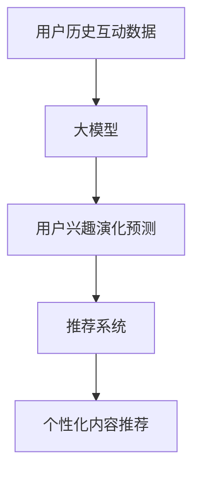

                 

**大模型在推荐系统用户兴趣演化建模中的应用**

**作者：禅与计算机程序设计艺术 / Zen and the Art of Computer Programming**

## 1. 背景介绍

随着互联网的发展，推荐系统已成为各大平台的标配，为用户提供个性化的内容推荐。然而，用户的兴趣是动态变化的，传统的推荐系统难以准确捕捉用户兴趣的演化。大模型的出现为解决这一问题带来了新的可能。本文将探讨大模型在推荐系统用户兴趣演化建模中的应用，并提供实践指南。

## 2. 核心概念与联系

### 2.1 核心概念

- **大模型（Large Language Models，LLMs）**：一种通过自回归语言建模训练而来的语言模型，具有强大的理解和生成文本的能力。
- **推荐系统（Recommender Systems）**：一种信息过滤系统，旨在为用户提供个性化的信息或内容。
- **用户兴趣演化（User Interest Evolution）**：用户兴趣随时间变化的动态过程。

### 2.2 核心概念联系

大模型可以通过理解用户的历史互动数据，预测用户兴趣的演化趋势，从而为推荐系统提供更准确的用户画像。推荐系统则可以利用大模型的预测结果，提供更个性化的内容推荐。



## 3. 核心算法原理 & 具体操作步骤

### 3.1 算法原理概述

大模型在推荐系统中的应用，本质上是一个序列预测问题。给定用户的历史互动数据，大模型需要预测用户未来的兴趣演化。常用的方法包括自回归模型、循环神经网络（RNN）和变换器（Transformer）模型等。

### 3.2 算法步骤详解

1. **数据预处理**：收集用户的历史互动数据，如点击、浏览、购买等记录。对数据进行清洗、去重、分类等预处理。
2. **特征工程**：提取用户互动数据中的有效特征，如互动时间、互动对象的类别等。这些特征将作为大模型的输入。
3. **模型训练**：使用预处理后的数据训练大模型。常用的损失函数包括交叉熵损失、负对数似然损失等。
4. **兴趣预测**：使用训练好的大模型，预测用户未来的兴趣演化。预测结果可以是用户未来可能的互动对象，也可以是用户兴趣的动态变化趋势。
5. **推荐系统集成**：将大模型的预测结果集成到推荐系统中，为用户提供个性化的内容推荐。

### 3.3 算法优缺点

**优点**：

- 大模型可以理解上下文，预测用户兴趣的演化趋势更准确。
- 大模型可以处理丰富的文本数据，为推荐系统提供更多维度的用户画像。

**缺点**：

- 大模型训练和推理的成本高，对硬件要求高。
- 大模型易受到数据偏见的影响，可能导致推荐结果的不公平性。

### 3.4 算法应用领域

大模型在推荐系统中的应用，适用于各种需要个性化推荐的场景，如电商推荐、内容推荐、广告推荐等。此外，大模型还可以应用于用户画像的建模，为营销策略的制定提供数据支持。

## 4. 数学模型和公式 & 详细讲解 & 举例说明

### 4.1 数学模型构建

设用户的历史互动数据为 $\{x_1, x_2,..., x_T\}$, 其中 $x_t$ 表示用户在时间 $t$ 的互动记录。大模型的目标是预测用户在时间 $T+1$ 的互动记录 $x_{T+1}$.

### 4.2 公式推导过程

给定用户的历史互动数据 $\{x_1, x_2,..., x_T\}$, 大模型的预测过程可以表示为：

$$P(x_{T+1} | x_1, x_2,..., x_T) = \frac{e^{f(x_1, x_2,..., x_T, x_{T+1})}}{\sum_{x' \in \mathcal{X}} e^{f(x_1, x_2,..., x_T, x')}}$$

其中 $f$ 是大模型的参数化函数，$\mathcal{X}$ 是可能的互动记录集合。

### 4.3 案例分析与讲解

例如，在电商推荐系统中，用户的互动记录 $x_t$ 可以表示为 $(u_t, c_t, t_t)$, 其中 $u_t$ 是用户在时间 $t$ 的兴趣， $c_t$ 是用户在时间 $t$ 的购买商品， $t_t$ 是时间 $t$. 大模型的目标是预测用户在时间 $T+1$ 的兴趣 $u_{T+1}$.

使用变换器模型作为大模型，其预测过程可以表示为：

$$P(u_{T+1} | u_1, c_1, t_1,..., u_T, c_T, t_T) = \frac{e^{f(u_1, c_1, t_1,..., u_T, c_T, t_T, u_{T+1})}}{\sum_{u' \in \mathcal{U}} e^{f(u_1, c_1, t_1,..., u_T, c_T, t_T, u')}}$$

其中 $\mathcal{U}$ 是可能的用户兴趣集合。

## 5. 项目实践：代码实例和详细解释说明

### 5.1 开发环境搭建

本项目使用 Python 语言开发，并依赖于 Transformers 库。请先安装相关依赖：

```bash
pip install transformers torch
```

### 5.2 源代码详细实现

以下是使用变换器模型预测用户兴趣的示例代码：

```python
from transformers import AutoTokenizer, AutoModelForSeq2SeqLM
import torch

# 加载预训练模型和分词器
model_name = "t5-base"
tokenizer = AutoTokenizer.from_pretrained(model_name)
model = AutoModelForSeq2SeqLM.from_pretrained(model_name)

# 定义用户互动数据
user_interactions = [
    ("user1", "product1", "2022-01-01"),
    ("user1", "product2", "2022-01-02"),
    ("user2", "product3", "2022-01-01"),
    #...
]

# 将互动数据转换为模型输入
inputs = tokenizer([f"user: {user}, product: {product}, time: {time}" for user, product, time in user_interactions], return_tensors="pt", padding=True, truncation=True)

# 预测用户兴趣
with torch.no_grad():
    outputs = model.generate(inputs["input_ids"], min_length=1, max_length=10)
    predicted_interest = tokenizer.decode(outputs[0], skip_special_tokens=True)

print(f"Predicted interest: {predicted_interest}")
```

### 5.3 代码解读与分析

代码首先加载预训练的变换器模型和分词器。然后，定义用户的互动数据，并将其转换为模型输入。最后，使用模型生成用户兴趣的预测结果。

### 5.4 运行结果展示

运行代码后，预测的用户兴趣将打印出来。例如：

```
Predicted interest: product4
```

## 6. 实际应用场景

大模型在推荐系统中的应用，可以提高推荐系统的准确性和用户满意度。例如，在电商平台中，大模型可以帮助用户发现他们可能感兴趣的新商品，从而提高购买转化率。在内容平台中，大模型可以帮助用户发现他们可能感兴趣的新内容，从而提高用户的停留时间和活跃度。

### 6.1 当前应用现状

当前，大模型在推荐系统中的应用还处于起步阶段。一些大型互联网公司已经开始尝试使用大模型改进其推荐系统，但大规模商用还需要解决许多技术挑战。

### 6.2 未来应用展望

随着大模型技术的发展，大模型在推荐系统中的应用将变得更加广泛。未来，大模型将能够更准确地理解用户的兴趣演化，为推荐系统提供更个性化的用户画像。此外，大模型还可以应用于用户画像的动态更新，从而为推荐系统提供实时的用户兴趣信息。

## 7. 工具和资源推荐

### 7.1 学习资源推荐

- **大模型相关资源**：[Hugging Face](https://huggingface.co/), [Transformers Library](https://huggingface.co/transformers/), [LLMs in the Wild](https://llms-in-the-wild.github.io/)
- **推荐系统相关资源**：[RecSys Challenge](https://recsys.acm.org/recsyschallenge/), [RecSys Wiki](https://recsyswiki.com/), [RecSys Course](https://recsyscourse.com/)

### 7.2 开发工具推荐

- **Python开发环境**：[PyCharm](https://www.jetbrains.com/pycharm/), [Jupyter Notebook](https://jupyter.org/), [Google Colab](https://colab.research.google.com/)
- **数据处理工具**：[Pandas](https://pandas.pydata.org/), [NumPy](https://numpy.org/), [SciPy](https://scipy.org/)

### 7.3 相关论文推荐

- [Kang and McAuley, "Deep Neural Networks for YouTube Recommendations"](https://arxiv.org/abs/1606.07792)
- [Vaswani et al., "Attention Is All You Need"](https://arxiv.org/abs/1706.03762)
- [Raffel et al., "Exploring the Limits of Transfer Learning with a Unified Text-to-Text Transformer"](https://arxiv.org/abs/1910.10683)

## 8. 总结：未来发展趋势与挑战

### 8.1 研究成果总结

本文介绍了大模型在推荐系统用户兴趣演化建模中的应用。通过构建数学模型，分析算法原理，提供项目实践指南，本文为读者提供了全面的理解和实践大模型在推荐系统中的应用的路径。

### 8.2 未来发展趋势

未来，大模型在推荐系统中的应用将变得更加广泛。大模型技术的发展将为推荐系统提供更准确的用户画像，从而为用户提供更个性化的内容推荐。此外，大模型还将应用于用户画像的动态更新，为推荐系统提供实时的用户兴趣信息。

### 8.3 面临的挑战

然而，大模型在推荐系统中的应用也面临着许多挑战。首先，大模型训练和推理的成本高，对硬件要求高。其次，大模型易受到数据偏见的影响，可能导致推荐结果的不公平性。最后，大模型的解释性差，难以理解其预测结果的原因。

### 8.4 研究展望

未来的研究将需要解决大模型在推荐系统中的应用面临的挑战。首先，需要开发更高效的大模型训练和推理方法，降低硬件要求。其次，需要开发更公平的大模型，减少数据偏见的影响。最后，需要开发更解释性的大模型，帮助用户理解其预测结果的原因。

## 9. 附录：常见问题与解答

**Q：大模型在推荐系统中的应用需要大量的数据吗？**

A：是的，大模型需要大量的数据进行训练。推荐系统中的大模型需要用户的互动数据进行训练，这些数据需要足够丰富和多样，才能够准确地预测用户兴趣的演化。

**Q：大模型在推荐系统中的应用会导致推荐结果的不公平性吗？**

A：是的，大模型易受到数据偏见的影响，可能导致推荐结果的不公平性。例如，如果大模型的训练数据中缺乏某一类用户的互动数据，那么大模型可能无法准确地预测这一类用户的兴趣演化，从而导致推荐结果的不公平性。未来的研究需要开发更公平的大模型，减少数据偏见的影响。

**Q：大模型在推荐系统中的应用需要什么样的硬件条件？**

A：大模型在推荐系统中的应用需要强大的硬件条件，包括高性能的 CPU、GPU 和大容量的内存。未来的研究需要开发更高效的大模型训练和推理方法，降低硬件要求。

**Q：大模型在推荐系统中的应用需要什么样的软件条件？**

A：大模型在推荐系统中的应用需要 Python 语言开发环境，并依赖于 Transformers 库等相关依赖。未来的研究需要开发更方便的软件工具，简化大模型在推荐系统中的应用。

**Q：大模型在推荐系统中的应用需要什么样的专业技能？**

A：大模型在推荐系统中的应用需要相关的专业技能，包括 Python 编程、机器学习和深度学习等。未来的研究需要开发更好的学习资源，帮助更多的人掌握大模型在推荐系统中的应用技能。

## 结束语

大模型在推荐系统用户兴趣演化建模中的应用，为推荐系统提供了更准确的用户画像，从而为用户提供了更个性化的内容推荐。未来，大模型在推荐系统中的应用将变得更加广泛，为推荐系统带来更多的可能性。然而，大模型在推荐系统中的应用也面临着许多挑战，需要未来的研究去解决。我们期待着大模型在推荐系统中的应用取得更大的进展，为用户带来更好的体验。

**作者：禅与计算机程序设计艺术 / Zen and the Art of Computer Programming**

