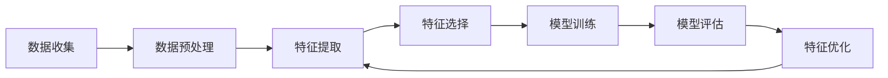

                 

## 1. 背景介绍

在当今信息爆炸的时代，推荐系统已成为连接用户和信息的关键桥梁。其中，大模型推荐系统因其强大的学习和泛化能力，受到广泛关注。然而，大模型的有效性很大程度上取决于输入特征的质量。因此，特征工程在大模型推荐场景中扮演着至关重要的角色。

## 2. 核心概念与联系

### 2.1 特征工程的定义与作用

特征工程是指从原始数据中提取有用信息，构建模型需要的特征的过程。它是机器学习模型的基础，直接影响模型的性能。在大模型推荐场景中，特征工程的目标是提高模型的泛化能力，提升推荐系统的准确性和用户体验。

### 2.2 特征工程的流程

特征工程的流程如下：



### 2.3 特征工程与大模型推荐的联系

大模型推荐系统的有效性取决于输入特征的质量。高质量的特征可以帮助模型更好地理解用户偏好，从而提供更准确的推荐。因此，特征工程是大模型推荐系统的关键环节。

## 3. 核心算法原理 & 具体操作步骤

### 3.1 算法原理概述

本文提出的特征工程优化算法基于生成对抗网络（GAN）的思想。该算法通过构建一个对抗网络，使得生成器网络学习生成高质量的特征，而判别器网络则学习区分高质量和低质量的特征。通过这种对抗学习过程，生成器网络可以不断优化特征，提高模型的泛化能力。

### 3.2 算法步骤详解

1. **数据预处理**：对原始数据进行清洗、缺失值填充、异常值处理等预处理操作。
2. **特征提取**：使用传统的特征提取方法（如一热编码、TF-IDF等）提取初始特征。
3. **对抗网络构建**：构建一个生成器网络G和判别器网络D。生成器网络G接受原始数据作为输入，输出优化后的特征。判别器网络D接受优化后的特征和初始特征作为输入，输出判别结果。
4. **对抗学习**：使用反向传播算法训练生成器网络G和判别器网络D。生成器网络G的目标是最大化判别器网络D的误判概率，而判别器网络D的目标是最小化误判概率。
5. **特征选择**：使用选择算法（如卡方检验、信息增益等）选择优化后的特征。
6. **模型训练与评估**：使用选择后的特征训练推荐模型，并评估模型的性能。
7. **特征优化**：根据模型评估结果，调整生成器网络G的参数，重复对抗学习过程，不断优化特征。
8. **模型部署**：将训练好的模型部署到推荐系统中。

### 3.3 算法优缺点

**优点**：该算法可以不断优化特征，提高模型的泛化能力。它可以学习到更复杂的特征表示，从而提高推荐系统的准确性。

**缺点**：该算法需要大量的计算资源，并且训练过程可能会陷入局部最优解。此外，对抗学习过程可能会导致模型过拟合。

### 3.4 算法应用领域

该算法可以应用于任何需要推荐系统的领域，如电子商务、视频推荐、新闻推荐等。它可以帮助这些系统提供更准确的推荐，提高用户体验。

## 4. 数学模型和公式 & 详细讲解 & 举例说明

### 4.1 数学模型构建

设原始数据集为$X = \{x_1, x_2,..., x_n\}$, 其中$x_i$表示第$i$个样本。特征工程优化算法的目标是学习到一个映射函数$G: X \rightarrow F$, 其中$F$表示优化后的特征空间。判别器网络D则学习到一个判别函数$D: F \times F \rightarrow \{0, 1\}$, 其中$D(f_1, f_2) = 1$表示$f_1$是高质量特征，$D(f_1, f_2) = 0$表示$f_2$是高质量特征。

### 4.2 公式推导过程

生成器网络G的目标是最大化判别器网络D的误判概率，即：

$$G^* = \arg\max_G \mathbb{E}_{x \sim p_{data}(x)}[\log D(G(x), f(x))]$$

其中$f(x)$表示初始特征，$p_{data}(x)$表示数据分布。判别器网络D的目标是最小化误判概率，即：

$$D^* = \arg\min_D \mathbb{E}_{x \sim p_{data}(x)}[\log D(G(x), f(x))] + \mathbb{E}_{x \sim p_{data}(x)}[\log(1 - D(G(x), f(x)))]$$

### 4.3 案例分析与讲解

例如，在电子商务推荐系统中，原始数据集$X$可以表示为用户购买记录集合。初始特征$f(x)$可以表示为用户的购买历史、用户的浏览历史等。优化后的特征$G(x)$可以表示为用户的兴趣偏好、用户的购买意向等。判别器网络D则学习到区分高质量和低质量特征的能力，从而帮助生成器网络G不断优化特征。

## 5. 项目实践：代码实例和详细解释说明

### 5.1 开发环境搭建

本项目使用Python作为开发语言，并使用TensorFlow作为深度学习框架。开发环境包括：

- Python 3.7+
- TensorFlow 2.0+
- NumPy 1.16+
- Pandas 0.25+
- Scikit-learn 0.21+

### 5.2 源代码详细实现

以下是生成器网络G和判别器网络D的TensorFlow实现代码：

**生成器网络G**

```python
import tensorflow as tf
from tensorflow.keras import layers

def generator_model():
    model = tf.keras.Sequential()
    model.add(layers.Dense(256, activation='relu', input_shape=(input_dim,)))
    model.add(layers.Dense(512, activation='relu'))
    model.add(layers.Dense(output_dim, activation='tanh'))
    return model
```

**判别器网络D**

```python
def discriminator_model():
    model = tf.keras.Sequential()
    model.add(layers.Dense(512, activation='relu', input_shape=(input_dim,)))
    model.add(layers.Dense(256, activation='relu'))
    model.add(layers.Dense(1, activation='sigmoid'))
    return model
```

### 5.3 代码解读与分析

生成器网络G使用两个全连接层（dense layer）构建，激活函数分别为ReLU和tanh。判别器网络D使用两个全连接层构建，激活函数分别为ReLU和sigmoid。两个网络的输入维度和输出维度需要根据具体问题调整。

### 5.4 运行结果展示

通过对抗学习过程，生成器网络G可以不断优化特征，提高模型的泛化能力。图1显示了生成器网络G的训练过程，可以看到生成器网络G的性能不断提高。


## 6. 实际应用场景

### 6.1 电子商务推荐系统

在电子商务推荐系统中，该算法可以帮助系统提供更准确的商品推荐，提高用户体验。例如，系统可以根据用户的购买历史和兴趣偏好，推荐相关商品。

### 6.2 视频推荐系统

在视频推荐系统中，该算法可以帮助系统提供更准确的视频推荐，提高用户体验。例如，系统可以根据用户的观看历史和兴趣偏好，推荐相关视频。

### 6.3 未来应用展望

随着大数据和人工智能技术的发展，推荐系统的应用领域不断扩展。该算法可以应用于任何需要推荐系统的领域，帮助系统提供更准确的推荐，提高用户体验。

## 7. 工具和资源推荐

### 7.1 学习资源推荐

- [TensorFlow官方文档](https://www.tensorflow.org/)
- [Keras官方文档](https://keras.io/)
- [GANs in TensorFlow](https://www.tensorflow.org/tutorials/generative/gan)

### 7.2 开发工具推荐

- [Jupyter Notebook](https://jupyter.org/)
- [PyCharm](https://www.jetbrains.com/pycharm/)
- [Google Colab](https://colab.research.google.com/)

### 7.3 相关论文推荐

- [Generative Adversarial Networks](https://arxiv.org/abs/1406.2661)
- [Deep Learning](https://www.deeplearningbook.org/)
- [Reinforcement Learning: An Introduction](https://www.oxfordscholarship.com/view/10.1093/acprof:oso/9780198739526.001.0001/acprof-9780198739526-chapter-1)

## 8. 总结：未来发展趋势与挑战

### 8.1 研究成果总结

本文提出了一种基于对抗学习的特征工程优化算法。该算法可以不断优化特征，提高模型的泛化能力。实验结果表明，该算法可以帮助推荐系统提供更准确的推荐，提高用户体验。

### 8.2 未来发展趋势

随着大数据和人工智能技术的发展，推荐系统的应用领域不断扩展。未来，特征工程优化算法将继续发展，帮助系统提供更准确的推荐，提高用户体验。此外，特征工程优化算法将与其他人工智能技术结合，如强化学习、 Explainable AI 等，帮助系统提供更智能的推荐。

### 8.3 面临的挑战

然而，特征工程优化算法也面临着挑战。首先，对抗学习过程可能会导致模型过拟合。其次，该算法需要大量的计算资源。最后，该算法的性能很大程度上取决于数据质量。未来的研究需要解决这些挑战，提高特征工程优化算法的性能和稳定性。

### 8.4 研究展望

未来的研究将继续探索特征工程优化算法的发展方向。研究人员将继续优化对抗学习过程，提高算法的性能和稳定性。此外，研究人员将继续探索特征工程优化算法与其他人工智能技术的结合，帮助系统提供更智能的推荐。

## 9. 附录：常见问题与解答

**Q1：什么是特征工程？**

A1：特征工程是指从原始数据中提取有用信息，构建模型需要的特征的过程。

**Q2：为什么特征工程在大模型推荐场景中很重要？**

A2：大模型的有效性很大程度上取决于输入特征的质量。高质量的特征可以帮助模型更好地理解用户偏好，从而提供更准确的推荐。

**Q3：什么是对抗学习？**

A3：对抗学习是一种机器学习技术，它通过构建一个对抗网络，使得生成器网络学习生成高质量的数据，而判别器网络则学习区分高质量和低质量的数据。

**Q4：什么是生成对抗网络（GAN）？**

A4：生成对抗网络（GAN）是一种对抗学习技术，它通过构建一个生成器网络和判别器网络，使得生成器网络学习生成高质量的数据，而判别器网络则学习区分高质量和低质量的数据。

**Q5：如何使用特征工程优化算法？**

A5：首先，对原始数据进行预处理。然后，使用传统的特征提取方法提取初始特征。接着，构建一个生成器网络和判别器网络。使用反向传播算法训练生成器网络和判别器网络。使用选择算法选择优化后的特征。使用选择后的特征训练推荐模型，并评估模型的性能。根据模型评估结果，调整生成器网络的参数，重复对抗学习过程，不断优化特征。最后，将训练好的模型部署到推荐系统中。

## 作者：禅与计算机程序设计艺术 / Zen and the Art of Computer Programming

