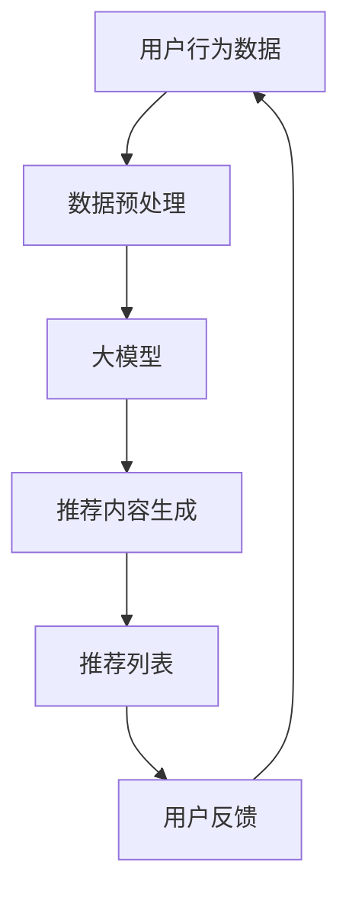

                 

## 1. 背景介绍

个性化推荐系统（Recommender Systems）是当今互联网时代的核心组成部分，它通过分析用户的行为数据和偏好，为用户提供个性化的内容推荐。随着大数据和人工智能技术的发展，大模型（Large Language Models）凭借其强大的理解和生成能力，正在成为个性化推荐的新方向。

## 2. 核心概念与联系

### 2.1 大模型简介

大模型是指通过大规模数据训练而成的模型，具有强大的理解和生成能力。它们可以理解上下文，生成人类可读的文本，并展示出一定的推理和理解能力。

### 2.2 大模型与个性化推荐的联系

大模型可以帮助个性化推荐系统更好地理解用户意图，生成更相关的推荐内容。它们可以分析用户的搜索历史、点击行为、评论等数据，并结合上下文理解用户的兴趣和需求，从而提供更个性化的推荐。

### 2.3 核心架构

大模型在个性化推荐系统中的核心架构如下：



## 3. 核心算法原理 & 具体操作步骤

### 3.1 算法原理概述

大模型在个性化推荐中的核心算法是基于 transformer 架构的语言模型，如 BERT、RoBERTa、T5 等。这些模型可以理解上下文，生成人类可读的文本，并展示出一定的推理和理解能力。

### 3.2 算法步骤详解

1. **数据预处理**：收集用户的搜索历史、点击行为、评论等数据，并进行清洗、预处理。
2. **大模型训练**：使用预处理后的数据训练大模型，使其理解用户的兴趣和需求。
3. **推荐内容生成**：输入用户的搜索关键词或当前上下文，大模型生成相关的推荐内容。
4. **推荐列表生成**：根据推荐内容的相关性，生成推荐列表。
5. **用户反馈收集**：收集用户对推荐内容的反馈，如点击、评分等，并反馈到数据预处理步骤。

### 3.3 算法优缺点

**优点**：

* 理解上下文，生成更相关的推荐内容。
* 可以学习和适应用户的兴趣和需求变化。
* 可以处理多模态数据，如文本、图像等。

**缺点**：

* 训练大模型需要大量的计算资源和数据。
* 大模型可能会生成不相关或不准确的推荐内容。
* 大模型可能会受到数据偏见的影响。

### 3.4 算法应用领域

大模型在个性化推荐中的应用领域包括但不限于：

* 电子商务：为用户推荐商品。
* 视频推荐：为用户推荐视频内容。
* 新闻推荐：为用户推荐新闻文章。
* 音乐推荐：为用户推荐音乐内容。

## 4. 数学模型和公式 & 详细讲解 & 举例说明

### 4.1 数学模型构建

大模型在个性化推荐中的数学模型可以表示为：

$$P(R|U) = \prod_{i=1}^{n}P(r_i|U)$$

其中，$R$ 是推荐内容，$U$ 是用户的行为数据，$r_i$ 是推荐内容的第$i$个特征，$n$ 是特征的总数。

### 4.2 公式推导过程

大模型通过最大化$P(R|U)$来学习用户的兴趣和需求。具体地，大模型可以使用梯度下降算法来优化模型参数，使得模型能够预测用户的兴趣和需求。

### 4.3 案例分析与讲解

例如，在视频推荐系统中，大模型可以根据用户的搜索历史、点击行为等数据，预测用户对哪些视频感兴趣。大模型可以学习到用户喜欢的视频类型、演员、导演等特征，并根据这些特征生成相关的推荐内容。

## 5. 项目实践：代码实例和详细解释说明

### 5.1 开发环境搭建

大模型在个性化推荐中的开发环境包括：

* Python 3.7 以上版本
* PyTorch 1.7 以上版本
* Transformers library（Hugging Face）
* Pandas
* NumPy

### 5.2 源代码详细实现

以下是大模型在个性化推荐中的源代码实现示例：

```python
from transformers import AutoTokenizer, AutoModelForSequenceClassification
import torch
import pandas as pd
import numpy as np

# 加载大模型
model_name = "bert-base-uncased"
tokenizer = AutoTokenizer.from_pretrained(model_name)
model = AutoModelForSequenceClassification.from_pretrained(model_name)

# 加载用户行为数据
data = pd.read_csv("user_data.csv")

# 预处理数据
inputs = tokenizer(data["search_history"], padding=True, truncation=True, return_tensors="pt")

# 生成推荐内容
with torch.no_grad():
    outputs = model(**inputs)
    logits = outputs.logits

# 生成推荐列表
recommendations = np.argsort(logits, axis=1)[:, -5:]

# 打印推荐列表
print(recommendations)
```

### 5.3 代码解读与分析

* 使用 Hugging Face 的 Transformers library 加载大模型。
* 加载用户的搜索历史数据，并进行预处理。
* 使用大模型生成推荐内容的相关性分数。
* 根据相关性分数生成推荐列表。
* 打印推荐列表。

### 5.4 运行结果展示

运行结果展示的是推荐列表，列表中包含了用户可能感兴趣的推荐内容。

## 6. 实际应用场景

### 6.1 当前应用

大模型在个性化推荐中的当前应用包括：

* Netflix 使用 BERT 为用户推荐视频内容。
* Spotify 使用 transformer 架构的模型为用户推荐音乐内容。
* Amazon 使用 deep learning 技术为用户推荐商品。

### 6.2 未来应用展望

未来，大模型在个性化推荐中的应用将会更加广泛，并会出现以下趋势：

* **多模态推荐**：大模型可以处理多模态数据，如文本、图像、音频等，从而提供更个性化的推荐内容。
* **实时推荐**：大模型可以实时学习用户的兴趣和需求变化，并提供实时的推荐内容。
* **跨平台推荐**：大模型可以在不同平台上提供一致的推荐内容，如在移动设备和桌面设备上。

## 7. 工具和资源推荐

### 7.1 学习资源推荐

* "Natural Language Processing with Python" 书籍
* Stanford CS224n 课程（Natural Language Processing with Deep Learning）
* Hugging Face 的 Transformers 文档

### 7.2 开发工具推荐

* Jupyter Notebook
* Google Colab
* Hugging Face's Transformers library

### 7.3 相关论文推荐

* "BERT: Pre-training of Deep Bidirectional Transformers for Language Understanding"（Devlin et al., 2018）
* "RoBERTa: A Robustly Optimized BERT Pretraining Approach"（Liu et al., 2019）
* "T5: Text-to-Text Transfer Transformer"（Raffel et al., 2019）

## 8. 总结：未来发展趋势与挑战

### 8.1 研究成果总结

大模型在个性化推荐中的研究成果包括：

* 大模型可以理解上下文，生成更相关的推荐内容。
* 大模型可以学习和适应用户的兴趣和需求变化。
* 大模型可以处理多模态数据，如文本、图像等。

### 8.2 未来发展趋势

未来，大模型在个性化推荐中的发展趋势包括：

* **模型规模扩大**：大模型的规模将会进一步扩大，从而提高推荐的准确性和相关性。
* **多模态推荐**：大模型将会处理多模态数据，从而提供更个性化的推荐内容。
* **实时推荐**：大模型将会实时学习用户的兴趣和需求变化，并提供实时的推荐内容。

### 8.3 面临的挑战

未来，大模型在个性化推荐中的挑战包括：

* **计算资源**：大模型需要大量的计算资源和数据，这将是一个持续的挑战。
* **数据偏见**：大模型可能会受到数据偏见的影响，从而提供不公平的推荐内容。
* **隐私保护**：大模型需要处理用户的行为数据，这将是一个隐私保护的挑战。

### 8.4 研究展望

未来，大模型在个性化推荐中的研究展望包括：

* **模型解释性**：研究如何使大模型更易于理解和解释，从而提高用户的信任度。
* **模型可控性**：研究如何使大模型更可控，从而避免不良的推荐内容。
* **模型泛化能力**：研究如何使大模型更具泛化能力，从而适应新的推荐场景。

## 9. 附录：常见问题与解答

**Q1：大模型在个性化推荐中的优势是什么？**

A1：大模型在个性化推荐中的优势包括理解上下文，生成更相关的推荐内容，学习和适应用户的兴趣和需求变化，处理多模态数据等。

**Q2：大模型在个性化推荐中的缺点是什么？**

A2：大模型在个性化推荐中的缺点包括需要大量的计算资源和数据，可能会生成不相关或不准确的推荐内容，可能会受到数据偏见的影响等。

**Q3：大模型在个性化推荐中的未来发展趋势是什么？**

A3：大模型在个性化推荐中的未来发展趋势包括模型规模扩大，多模态推荐，实时推荐等。

**Q4：大模型在个性化推荐中的挑战是什么？**

A4：大模型在个性化推荐中的挑战包括计算资源，数据偏见，隐私保护等。

**Q5：大模型在个性化推荐中的研究展望是什么？**

A5：大模型在个性化推荐中的研究展望包括模型解释性，模型可控性，模型泛化能力等。

## 作者：禅与计算机程序设计艺术 / Zen and the Art of Computer Programming

