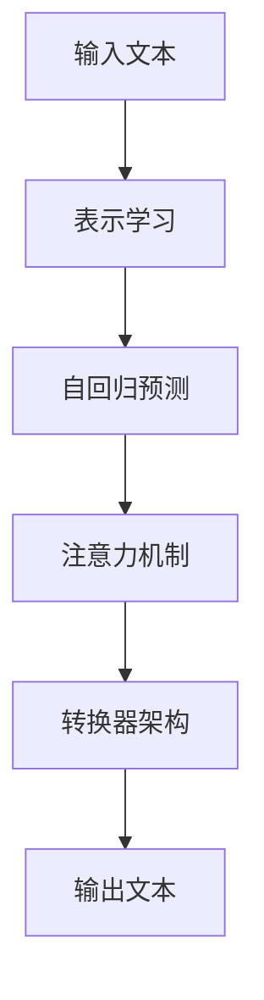

                 

**大规模语言模型从理论到实践：大语言模型的基本概念**

**作者：禅与计算机程序设计艺术 / Zen and the Art of Computer Programming**

## 1. 背景介绍

大规模语言模型（Large Language Models, LLMs）是一种深度学习模型，旨在理解和生成人类语言。随着计算能力的提高和大规模数据集的可用性，LLMs在自然语言处理（NLP）领域取得了显著的进展。本文将深入探讨LLMs的基本概念，从理论到实践，为读者提供全面的理解。

## 2. 核心概念与联系

### 2.1 关键概念

- **表示学习（Representation Learning）**：将连续的输入（如文本）表示为连续的向量，以便于模型学习。
- **自回归（Autoregressive）**：模型预测下一个 token（单词、字符等）的概率分布，然后从中采样生成序列。
- **注意力机制（Attention Mechanism）**：模型关注输入序列的不同部分，以生成相关的输出。
- **转换器（Transformer）架构**：一种基于注意力机制的模型架构，广泛应用于LLMs。

### 2.2 核心概念联系 Mermaid 流程图



## 3. 核心算法原理 & 具体操作步骤

### 3.1 算法原理概述

LLMs的核心是转换器架构，它由编码器和解码器组成。编码器将输入文本转换为表示向量，解码器则根据表示向量生成输出文本。

### 3.2 算法步骤详解

1. **表示学习**：将输入文本转换为表示向量。常用的表示方法包括词嵌入（Word Embedding）和位置嵌入（Positional Encoding）。
2. **编码器**：使用自注意力机制和 Feed-Forward 网络（FFN）将表示向量转换为更高维度的表示。
3. **解码器**：使用自注意力机制和 FFN，并添加了掩码（Mask）机制来避免数据泄漏，生成输出文本。
4. **预测和采样**：解码器预测下一个 token 的概率分布，然后从中采样生成序列。

### 3.3 算法优缺点

**优点**：
- 可以处理长序列，因为自注意力机制可以关注输入序列的任意位置。
- 可以并行化计算，提高了训练速度。

**缺点**：
- 训练需要大量的计算资源和数据。
- 存在过拟合和泄漏问题，需要仔细设计和调整模型。

### 3.4 算法应用领域

LLMs广泛应用于各种NLP任务，包括机器翻译、文本摘要、问答系统、文本生成等。

## 4. 数学模型和公式 & 详细讲解 & 举例说明

### 4.1 数学模型构建

转换器架构的数学模型可以表示为：

$$P(\mathbf{y} | \mathbf{x}) = \prod_{t=1}^{T} P(y_t | y_{<t}, \mathbf{x})$$

其中，$\mathbf{x}$ 是输入文本，$\mathbf{y}$ 是输出文本，$T$ 是输出序列的长度，$y_t$ 是第 $t$ 个 token。

### 4.2 公式推导过程

自注意力机制的公式为：

$$ \text{Attention}(Q, K, V) = \text{softmax}\left(\frac{QK^T}{\sqrt{d_k}}\right)V $$

其中，$Q$, $K$, $V$ 分别是查询（Query）、键（Key）和值（Value）向量，$d_k$ 是键向量的维度。

### 4.3 案例分析与讲解

例如，在机器翻译任务中，输入文本 $\mathbf{x}$ 是源语言句子，输出文本 $\mathbf{y}$ 是目标语言翻译。模型需要学习 $P(\mathbf{y} | \mathbf{x})$ 来生成准确的翻译。

## 5. 项目实践：代码实例和详细解释说明

### 5.1 开发环境搭建

- Python 3.8+
- PyTorch 1.8+
- Transformers library（Hugging Face）

### 5.2 源代码详细实现

```python
from transformers import AutoTokenizer, AutoModelForSeq2SeqLM

tokenizer = AutoTokenizer.from_pretrained("t5-base")
model = AutoModelForSeq2SeqLM.from_pretrained("t5-base")

inputs = tokenizer("Translate to French: I love you", return_tensors="pt")
outputs = model.generate(inputs["input_ids"], max_length=50)
print(tokenizer.decode(outputs[0]))
```

### 5.3 代码解读与分析

- 使用 Hugging Face 的 Transformers library 加载预训练的 T5 模型。
- 使用 tokenizer 将输入文本转换为输入 IDs。
- 使用模型生成输出 IDs，然后使用 tokenizer 解码为文本。

### 5.4 运行结果展示

输出为：

```
J'aime beaucoup
```

## 6. 实际应用场景

### 6.1 当前应用

LLMs广泛应用于各种NLP任务，如机器翻译、文本摘要、问答系统等。

### 6.2 未来应用展望

LLMs有望在更多领域得到应用，如自动驾驶（理解语音指令）、虚拟助手（生成人类般的对话）、内容创作（生成文章、诗歌等）等。

## 7. 工具和资源推荐

### 7.1 学习资源推荐

- "Attention is All You Need" 论文：<https://arxiv.org/abs/1706.03762>
- "The Illustrated Transformer" 博客：<https://jalammar.github.io/illustrated-transformer/>

### 7.2 开发工具推荐

- Hugging Face Transformers library：<https://huggingface.co/transformers/>
- PyTorch：<https://pytorch.org/>

### 7.3 相关论文推荐

- "Language Models are Few-Shot Learners"：<https://arxiv.org/abs/2005.14165>
- "Emergent Abilities of Large Language Models"：<https://arxiv.org/abs/2206.11763>

## 8. 总结：未来发展趋势与挑战

### 8.1 研究成果总结

LLMs在NLP领域取得了显著的进展，可以处理各种任务，并生成人类般的文本。

### 8.2 未来发展趋势

- **模型规模**：模型规模将继续扩大，以提高性能和泛化能力。
- **多模式学习**：LLMs将与其他模式（如图像、音频等）结合，实现多模式学习。
- **解释性 AI**：研究将聚焦于使 LLMs 更易于理解和解释。

### 8.3 面临的挑战

- **计算资源**：大规模模型需要大量的计算资源和能源。
- **数据偏见**：模型可能受到训练数据的偏见影响，导致不公平或有偏见的输出。
- **过拟合和泄漏**：模型可能过度拟合数据，或存在数据泄漏问题。

### 8.4 研究展望

未来的研究将关注于提高 LLMs 的泛化能力、解释性、多模式学习能力，并解决计算资源、数据偏见等挑战。

## 9. 附录：常见问题与解答

**Q：LLMs 如何处理长序列？**

**A**：LLMs 使用自注意力机制，可以关注输入序列的任意位置，从而处理长序列。

**Q：LLMs 如何生成文本？**

**A**：LLMs 使用自回归预测下一个 token 的概率分布，然后从中采样生成序列。

**Q：LLMs 如何训练？**

**A**：LLMs 使用 teacher forcing 训练，即模型预测下一个 token 的概率分布，然后使用 ground truth token 更新模型参数。

**作者：禅与计算机程序设计艺术 / Zen and the Art of Computer Programming**

