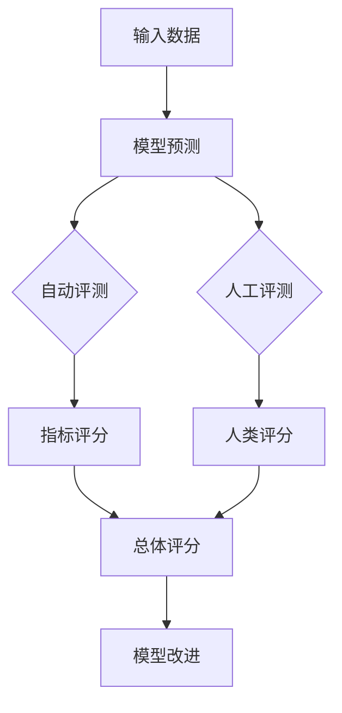

                 

**大语言模型原理与工程实践：评测方式**

**作者：禅与计算机程序设计艺术 / Zen and the Art of Computer Programming**

## 1. 背景介绍

大语言模型（Large Language Models, LLMs）是一种自然语言处理（Natural Language Processing, NLP）模型，旨在理解、生成或翻译人类语言。随着计算能力的提高和数据量的增加，LLMs在各种NLP任务中取得了显著的成功，从文本分类到机器翻译，再到对话系统。然而，评测LLMs的性能和质量是一项挑战，因为它需要考虑多个维度，包括准确性、流畅性、相关性和安全性等。本文将深入探讨LLMs的评测方式，从核心概念到具体算法，再到实践项目和工具推荐。

## 2. 核心概念与联系

### 2.1 评测维度

评测LLMs的关键维度包括：

- **准确性（Accuracy）**：模型生成的输出是否与-ground truth（真实值）匹配。
- **流畅性（Fluency）**：模型生成的文本是否连贯、通顺，没有语法错误或不连贯的片段。
- **相关性（Relevance）**：模型生成的输出是否与输入相关，没有无关或不相关的信息。
- **安全性（Safety）**：模型生成的输出是否包含有害、偏见或不当的内容。

### 2.2 评测方法

评测LLMs的方法包括自动评测（Automatic Evaluation）和人工评测（Human Evaluation）。自动评测使用预定义的指标和算法评测模型，而人工评测则由人类评测员根据特定指南评分。

### 2.3 评测流程图



## 3. 核心算法原理 & 具体操作步骤

### 3.1 算法原理概述

评测LLMs的算法可以分为两大类：基于参考的评测（Reference-based Evaluation）和基于无参考的评测（Reference-free Evaluation）。基于参考的评测需要人类标注的-ground truth，而基于无参考的评测则不需要。

### 3.2 算法步骤详解

#### 3.2.1 基于参考的评测

1. 收集-ground truth：收集人类标注的正确输出。
2. 生成模型输出：使用LLM生成输出。
3. 计算指标：使用指标（如BLEU、ROUGE、METEOR）评测模型输出和-ground truth的相似度。

#### 3.2.2 基于无参考的评测

1. 生成模型输出：使用LLM生成输出。
2. 计算指标：使用指标（如Perplexity、Distinct-n、Average Sentence Length）评测模型输出的内在质量。

### 3.3 算法优缺点

| 评测方法 | 优点 | 缺点 |
| --- | --- | --- |
| 基于参考的评测 | 可以评测模型输出与-ground truth的匹配度 | 需要人工标注，可能有主观性 |
| 基于无参考的评测 | 不需要-ground truth，可以评测模型内在质量 | 可能无法评测模型输出的相关性和安全性 |

### 3.4 算法应用领域

评测LLMs的算法在各种NLP任务中都有应用，包括机器翻译、文本摘要、对话系统和问答系统等。

## 4. 数学模型和公式 & 详细讲解 & 举例说明

### 4.1 数学模型构建

评测LLMs的数学模型通常基于信息论和统计学。例如，Perplexity是一种常用的无参考评测指标，它基于模型对文本的预测概率。

### 4.2 公式推导过程

Perplexity的公式如下：

$$PPL = exp\left(-\frac{\sum_{i=1}^{N}logP(w_i|w_{<i})}{\sum_{i=1}^{N}n_i}\right)$$

其中，$P(w_i|w_{<i})$是模型预测单词$w_i$的概率，$n_i$是句子$i$的长度，$N$是句子总数。

### 4.3 案例分析与讲解

假设我们有两个LLM模型，模型A和模型B，它们分别预测句子"the cat sat on the mat"的概率为0.5和0.8。如果我们使用Perplexity评测这两个模型，则模型B的Perplexity更低，表示它的预测更准确。

## 5. 项目实践：代码实例和详细解释说明

### 5.1 开发环境搭建

我们将使用Python和Transformers库评测LLMs。首先，安装必要的库：

```bash
pip install transformers datasets
```

### 5.2 源代码详细实现

以下是使用BLEU指标评测LLM的示例代码：

```python
from transformers import AutoTokenizer, AutoModelForSeq2SeqLM
from datasets import load_dataset
from nltk.translate.bleu_score import sentence_bleu

# 加载模型和标记器
model_name = "t5-base"
tokenizer = AutoTokenizer.from_pretrained(model_name)
model = AutoModelForSeq2SeqLM.from_pretrained(model_name)

# 加载数据集
dataset = load_dataset("wmt14", "de-en", split="test")

# 评测模型
bleu_scores = []
for example in dataset:
    input_text = example["de"]
    target_text = example["en"]

    # 生成模型输出
    inputs = tokenizer(input_text, return_tensors="pt", max_length=512, truncation=True)
    outputs = model.generate(inputs["input_ids"], min_length=5, max_length=128)
    output_text = tokenizer.decode(outputs[0], skip_special_tokens=True)

    # 计算BLEU分数
    bleu_score = sentence_bleu([target_text], output_text, weights=(0.25, 0.25, 0.25, 0.25))
    bleu_scores.append(bleu_score)

# 计算平均BLEU分数
avg_bleu_score = sum(bleu_scores) / len(bleu_scores)
print(f"Average BLEU score: {avg_bleu_score}")
```

### 5.3 代码解读与分析

这段代码使用T5模型评测德语到英语的机器翻译任务。它首先加载模型和标记器，然后加载WMT14数据集的测试集。对于每个示例，它生成模型输出，并使用BLEU指标评测输出和目标文本的相似度。最后，它计算所有示例的平均BLEU分数。

### 5.4 运行结果展示

运行这段代码将输出平均BLEU分数，表示模型在机器翻译任务中的性能。

## 6. 实际应用场景

LLMs的评测在各种实际应用场景中都很重要，包括：

- **机器翻译**：评测模型翻译的准确性和流畅性。
- **文本摘要**：评测模型生成的摘要是否简洁、连贯且包含关键信息。
- **对话系统**：评测模型生成的回复是否相关、流畅且有用。
- **问答系统**：评测模型生成的答案是否准确、完整且相关。

### 6.4 未来应用展望

未来，LLMs的评测将越来越关注模型的安全性、公平性和可解释性。此外，跨语言和多模式评测（如文本和图像）也将变得越来越重要。

## 7. 工具和资源推荐

### 7.1 学习资源推荐

- "Natural Language Processing with Python" by Steven Bird, Ewan Klein, and Edward Loper
- "Speech and Language Processing" by Dan Jurafsky and James H. Martin
- Stanford CS224n course on Natural Language Processing

### 7.2 开发工具推荐

- Transformers library by Hugging Face
- NLTK library by Bird, Klein, and Loper
- SpaCy library by Ines Montani and Explosion AI

### 7.3 相关论文推荐

- "Attention Is All You Need" by Vaswani et al.
- "BERT: Pre-training of Deep Bidirectional Transformers for Language Understanding" by Jacob Devlin, Ming-Wei Chang, and Kenton Lee
- "The BERT Model for Language Understanding" by Jacob Devlin, Ming-Wei Chang, and Kenton Lee

## 8. 总结：未来发展趋势与挑战

### 8.1 研究成果总结

本文介绍了LLMs的评测方式，从核心概念到具体算法，再到实践项目和工具推荐。我们讨论了评测维度、评测方法、评测算法和数学模型，并提供了代码示例。

### 8.2 未来发展趋势

未来，LLMs的评测将越来越关注模型的安全性、公平性和可解释性。此外，跨语言和多模式评测也将变得越来越重要。

### 8.3 面临的挑战

LLMs的评测面临的挑战包括评测指标的选择、评测数据的收集和标注、评测结果的解释等。

### 8.4 研究展望

未来的研究将关注开发新的评测指标和方法，改进评测数据的收集和标注，提高评测结果的解释能力，并将评测与模型改进结合起来。

## 9. 附录：常见问题与解答

**Q：什么是大语言模型？**

A：大语言模型是一种自然语言处理模型，旨在理解、生成或翻译人类语言。

**Q：为什么评测大语言模型很重要？**

A：评测大语言模型有助于衡量其性能和质量，指导模型改进，并帮助用户选择合适的模型。

**Q：有哪些评测大语言模型的方法？**

A：评测大语言模型的方法包括自动评测和人工评测，基于参考的评测和基于无参考的评测。

**Q：什么是Perplexity？**

A：Perplexity是一种常用的无参考评测指标，它基于模型对文本的预测概率。

**Q：什么是BLEU？**

A：BLEU是一种常用的基于参考的评测指标，它评测模型输出和-ground truth的相似度。

**Q：如何改进大语言模型的评测？**

A：未来的研究将关注开发新的评测指标和方法，改进评测数据的收集和标注，提高评测结果的解释能力，并将评测与模型改进结合起来。

**作者：禅与计算机程序设计艺术 / Zen and the Art of Computer Programming**

