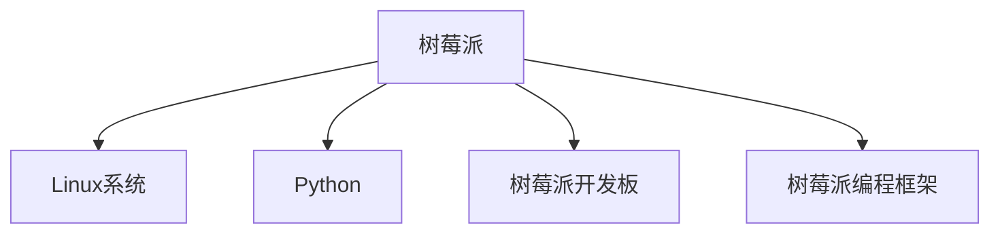

                 

# 树莓派项目开发：从入门到精通

## 1. 背景介绍

### 1.1 问题由来

在当今的物联网和嵌入式系统领域，树莓派（Raspberry Pi）因其小巧、便宜且功能强大的特性，成为了一个广受欢迎的嵌入式开发平台。树莓派项目开发的应用范围广泛，涉及教育、娱乐、工业控制等领域。然而，对于初学者而言，树莓派的编程环境、软件安装和项目管理等步骤常常让人望而却步。

### 1.2 问题核心关键点

树莓派项目开发的核心在于选择合适的开发工具和框架，有效利用树莓派的硬件资源，实现跨平台、高性能的应用程序开发。常见问题包括：

- 如何选择树莓派开发工具和框架？
- 如何高效利用树莓派的硬件资源？
- 如何跨平台开发和部署应用程序？

### 1.3 问题研究意义

掌握树莓派项目开发技能，可以大幅降低物联网应用开发门槛，推动教育、娱乐、工业控制等领域的技术进步。同时，树莓派项目开发也是物联网、嵌入式系统研究的重要内容，对技术研发和应用创新具有重要意义。

## 2. 核心概念与联系

### 2.1 核心概念概述

为更好地理解树莓派项目开发，本节将介绍几个密切相关的核心概念：

- **树莓派（Raspberry Pi）**：树莓派是一款小巧、廉价且功能强大的嵌入式计算平台，提供CPU、GPU、Wi-Fi、蓝牙、摄像头等多种接口，支持多种操作系统和编程语言。
- **Linux系统**：树莓派默认运行Linux操作系统，是一种稳定、安全的操作系统，适合嵌入式系统开发。
- **Python编程语言**：Python是一种易于学习和使用的编程语言，在树莓派上被广泛应用，支持跨平台开发。
- **树莓派开发板**：包括树莓派主板（如树莓派4、树莓派3等）、摄像头模块、Wi-Fi模块等，提供硬件接口支持。
- **树莓派编程框架**：如PyPy、picoPython等，提供轻量级的Python解释器，适应树莓派硬件资源限制。

这些核心概念之间的逻辑关系可以通过以下Mermaid流程图来展示：



这个流程图展示了一些核心概念及其之间的关系：

- 树莓派运行在Linux操作系统上。
- Python在树莓派上被广泛应用。
- 树莓派开发板提供了硬件接口支持。
- 树莓派编程框架适用于硬件资源限制。

## 3. 核心算法原理 & 具体操作步骤

### 3.1 算法原理概述

树莓派项目开发的核心算法原理包括选择开发工具、设计硬件接口、编写和测试代码等。具体步骤如下：

1. 选择适合树莓派的开发工具。
2. 根据项目需求设计硬件接口，实现数据采集和输出。
3. 使用Python编写应用程序，实现数据处理和逻辑控制。
4. 测试和优化程序性能，确保可靠性和稳定性。

### 3.2 算法步骤详解

#### 3.2.1 选择开发工具

树莓派支持多种编程语言和开发环境，包括Python、C/C++、Node.js等。开发工具的选择应基于项目需求、个人技能和硬件资源考虑：

- **Python**：易于学习，生态丰富，适用于数据处理、控制和机器学习等任务。
- **C/C++**：系统编程能力强，适用于需要高性能计算的实时系统开发。
- **Node.js**：适合构建高效、实时的Web应用程序和I/O服务。

例如，对于树莓派上的Web服务，可以使用Node.js和Express框架：

```javascript
const express = require('express');
const app = express();

app.get('/', (req, res) => {
    res.send('Hello, World!');
});

app.listen(3000, () => {
    console.log('Server started on port 3000');
});
```

#### 3.2.2 设计硬件接口

树莓派的硬件接口设计需考虑数据采集、输出和连接。常见接口包括I/O端口、摄像头、传感器、Wi-Fi等。例如，连接一个数字传感器到树莓派：

1. 选择适合树莓派的传感器，如DHT11温湿度传感器。
2. 连接传感器到树莓派的GPIO接口，使用树莓派的Python GPIO库读取数据。
3. 编写代码处理传感器数据，实现控制功能。

```python
import RPi.GPIO as GPIO
import time

GPIO.setmode(GPIO.BOARD)
GPIO.setup(4, GPIO.IN, pull_up_down=GPIO.PUD_UP)

while True:
    if GPIO.input(4) == 0:
        print('Sensor detected')
    time.sleep(1)
```

#### 3.2.3 编写应用程序

应用程序的编写需结合硬件接口设计，实现数据处理和逻辑控制。例如，使用树莓派摄像头进行图像处理：

1. 连接摄像头到树莓派。
2. 使用OpenCV库读取摄像头图像。
3. 编写代码进行图像处理和特征提取。

```python
import cv2

cap = cv2.VideoCapture(0)

while True:
    ret, frame = cap.read()
    gray = cv2.cvtColor(frame, cv2.COLOR_BGR2GRAY)
    edges = cv2.Canny(gray, threshold1=50, threshold2=150)
    cv2.imshow('Edges', edges)
    if cv2.waitKey(1) == ord('q'):
        break

cap.release()
cv2.destroyAllWindows()
```

#### 3.2.4 测试和优化程序性能

程序编写完成后，需要进行测试和优化，确保程序可靠性和稳定性。常见测试包括单元测试、集成测试和性能测试：

- **单元测试**：针对单个函数或模块进行测试，确保功能正确。
- **集成测试**：测试多个模块之间的集成，确保整体功能正常。
- **性能测试**：测试程序的运行效率，确保在硬件资源限制下能够稳定运行。

## 4. 数学模型和公式 & 详细讲解 & 举例说明

### 4.1 数学模型构建

树莓派项目开发涉及的数学模型主要集中在数据处理和算法优化上。例如，图像处理中的边缘检测算法，可以使用Canny边缘检测算法：

$$
\text{edges} = \text{Canny}(\text{gray}, \text{threshold1}, \text{threshold2})
$$

其中，$\text{gray}$ 为灰度图像，$\text{threshold1}$ 和 $\text{threshold2}$ 为边缘检测的阈值。

### 4.2 公式推导过程

以树莓派上的I/O接口设计为例，公式推导过程如下：

1. 确定I/O接口类型。
2. 根据接口类型选择合适的GPIO引脚。
3. 编写代码实现数据读写。

例如，连接LED灯到树莓派的GPIO接口：

```python
import RPi.GPIO as GPIO
GPIO.setmode(GPIO.BOARD)
GPIO.setup(18, GPIO.OUT)

while True:
    GPIO.output(18, GPIO.HIGH)
    time.sleep(1)
    GPIO.output(18, GPIO.LOW)
    time.sleep(1)
```

### 4.3 案例分析与讲解

假设我们要使用树莓派控制LED灯，可以使用以下步骤：

1. 连接LED灯到树莓派的GPIO接口。
2. 使用树莓派的Python GPIO库读取数据。
3. 编写代码实现LED灯的开关控制。

```python
import RPi.GPIO as GPIO
GPIO.setmode(GPIO.BOARD)
GPIO.setup(18, GPIO.OUT)

while True:
    GPIO.output(18, GPIO.HIGH)
    time.sleep(1)
    GPIO.output(18, GPIO.LOW)
    time.sleep(1)
```

## 5. 项目实践：代码实例和详细解释说明

### 5.1 开发环境搭建

开发树莓派项目前，需要搭建合适的开发环境。以下是树莓派开发环境的搭建步骤：

1. 安装树莓派操作系统。
2. 安装Python、pip和必要的开发库。
3. 安装开发板和传感器等硬件设备。

例如，在树莓派上安装Python和pip：

```bash
sudo apt-get update
sudo apt-get install python3 python3-pip
```

### 5.2 源代码详细实现

以下是一个树莓派上运行的Web服务示例代码：

```python
from flask import Flask

app = Flask(__name__)

@app.route('/')
def index():
    return 'Hello, World!'

if __name__ == '__main__':
    app.run(host='0.0.0.0', port=3000)
```

### 5.3 代码解读与分析

**Flask框架**：使用Flask框架快速搭建Web服务，支持RESTful API设计。

**路由**：使用@app.route定义路由，处理HTTP请求。

**服务器启动**：使用app.run启动服务器，监听指定端口。

### 5.4 运行结果展示

运行上述代码后，可以在树莓派上访问http://0.0.0.0:3000，即可看到"Hello, World!"的输出。

## 6. 实际应用场景

### 6.1 智能家居控制系统

树莓派可以用于智能家居控制系统的开发。例如，使用树莓派控制家中的LED灯、空调、窗帘等设备，通过手机App或语音助手进行远程控制。

### 6.2 环境监测系统

树莓派可以用于环境监测系统的开发，如监测家中的温湿度、空气质量等参数，通过Web界面实时显示。

### 6.3 远程监控系统

树莓派可以用于远程监控系统的开发，如远程监控摄像头，实时上传视频到云端，用于安防监控。

### 6.4 未来应用展望

树莓派项目开发的应用前景广阔，未来可进一步拓展到更多领域：

- **自动驾驶**：使用树莓派控制车辆传感器，实现自动驾驶功能。
- **医疗设备**：使用树莓派控制医疗设备，进行远程医疗监测。
- **农业智能**：使用树莓派控制农业传感器，实现智能灌溉和施肥。

## 7. 工具和资源推荐

### 7.1 学习资源推荐

为了帮助开发者系统掌握树莓派项目开发的技术，以下是一些优质的学习资源：

1. **Raspberry Pi官方文档**：树莓派官方文档，涵盖硬件、软件和开发环境配置等内容。
2. **树莓派编程入门**：一本适合初学者的树莓派编程入门书籍，涵盖树莓派硬件、Linux系统和Python编程等内容。
3. **树莓派项目开发实战**：一本针对树莓派项目开发的实战指南，涵盖树莓派硬件接口设计、应用程序开发和项目管理等内容。

### 7.2 开发工具推荐

树莓派项目开发常用的开发工具包括：

1. **树莓派操作系统**：选择适合树莓派的Linux发行版，如Raspbian、Ubuntu等。
2. **树莓派开发板**：选择适合树莓派的项目开发板，如树莓派4、树莓派3等。
3. **Python解释器**：选择适合树莓派的Python解释器，如PyPy、picoPython等。

### 7.3 相关论文推荐

树莓派项目开发的相关论文涉及硬件接口设计、编程语言优化、操作系统适配等内容，以下是一些推荐阅读的论文：

1. **树莓派硬件接口设计**：探讨树莓派硬件接口设计的最佳实践，涵盖传感器、摄像头、Wi-Fi等接口的设计和应用。
2. **树莓派编程语言优化**：研究如何优化树莓派上的Python解释器和编程语言，提高程序性能和稳定性。
3. **树莓派操作系统适配**：探讨如何适配树莓派操作系统，实现跨平台、高性能的应用程序开发。

## 8. 总结：未来发展趋势与挑战

### 8.1 总结

本文对树莓派项目开发进行了全面系统的介绍，涵盖了开发环境搭建、硬件接口设计、应用程序编写和测试等关键环节。通过本文的系统梳理，可以看到，树莓派项目开发在物联网、嵌入式系统等领域具有重要应用价值，能够大幅降低应用开发门槛，推动技术进步。

### 8.2 未来发展趋势

树莓派项目开发未来将呈现以下几个发展趋势：

1. **跨平台开发**：树莓派支持多种操作系统和编程语言，未来将进一步提升跨平台开发能力。
2. **硬件资源优化**：树莓派硬件资源有限，未来将进一步优化硬件接口设计和算法优化。
3. **应用场景拓展**：树莓派项目开发将拓展到更多应用场景，如自动驾驶、医疗设备、农业智能等。

### 8.3 面临的挑战

尽管树莓派项目开发已经取得了一定进展，但在应用推广和普及过程中，仍面临以下挑战：

1. **硬件适配复杂**：树莓派硬件种类繁多，适配复杂。
2. **操作系统稳定性**：树莓派操作系统稳定性需要进一步提升。
3. **开发工具匮乏**：树莓派开发工具和框架尚未完全成熟，需要进一步丰富。

### 8.4 研究展望

树莓派项目开发未来的研究重点包括：

1. **硬件接口标准化**：制定树莓派硬件接口标准，提高设备兼容性和稳定性。
2. **操作系统优化**：优化树莓派操作系统，提升系统性能和稳定性。
3. **开发工具完善**：丰富树莓派开发工具和框架，支持更多应用场景开发。

## 9. 附录：常见问题与解答

**Q1: 如何选择树莓派开发工具？**

A: 选择树莓派开发工具应基于项目需求、个人技能和硬件资源考虑。Python生态丰富，适合数据处理、控制和机器学习等任务；C/C++系统编程能力强，适合高性能计算的实时系统开发；Node.js适合构建高效、实时的Web应用程序和I/O服务。

**Q2: 如何高效利用树莓派的硬件资源？**

A: 高效利用树莓派硬件资源需考虑数据采集、输出和连接。选择适合树莓派的传感器、摄像头和接口，设计合理的数据读写和处理逻辑。

**Q3: 如何跨平台开发和部署应用程序？**

A: 树莓派支持多种操作系统和编程语言，可利用树莓派开发板和编程框架，实现跨平台开发和部署。优化程序性能，确保在硬件资源限制下能够稳定运行。

---

作者：禅与计算机程序设计艺术 / Zen and the Art of Computer Programming

