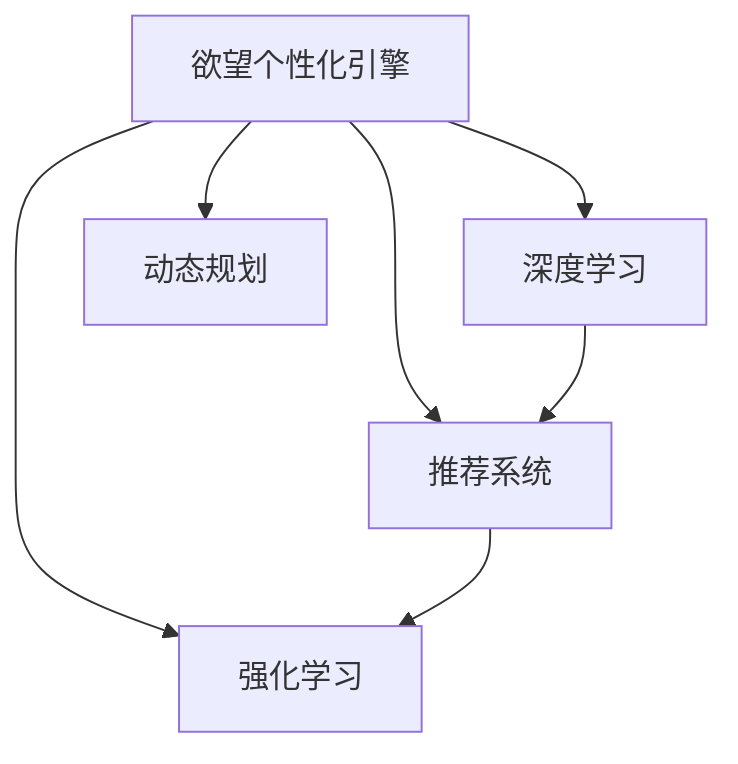

                 

# 欲望个性化引擎：AI定制的需求满足系统

## 1. 背景介绍

### 1.1 问题由来

在数字化和信息化时代，个性化需求逐渐成为主流。用户希望在购物、娱乐、学习等多个场景中，能够获得满足自身独特偏好的定制化服务。然而，传统的平台化服务模式难以满足用户的个性化需求，导致用户满意度和忠诚度下降。

为了应对这一挑战，企业开始探索基于人工智能的个性化推荐系统，试图通过数据分析和算法优化，为用户提供更加符合其偏好的定制化服务。个性化推荐系统（Personalized Recommendation Systems）已经广泛应用于电商平台、内容平台、智能家居等多个领域，取得了显著的效果。但现有的推荐系统仍然存在一些局限性，如数据偏差、冷启动问题、推荐效果不稳定等。

### 1.2 问题核心关键点

为了进一步提升个性化服务的体验，我们提出了一种全新的需求满足系统——欲望个性化引擎（Desire Personalization Engine, DPE）。DPE基于用户的历史行为数据和实时反馈，通过深度学习和强化学习算法，生成动态的个性化推荐方案。相比传统的推荐系统，DPE在个性化、实时性和可解释性等方面具有显著优势，能够提供更加精准、灵活、可控的个性化服务。

## 2. 核心概念与联系

### 2.1 核心概念概述

为了更好地理解欲望个性化引擎的原理和工作机制，本节将介绍几个核心概念：

- 欲望个性化引擎（Desire Personalization Engine, DPE）：基于用户历史行为数据和实时反馈，动态生成个性化推荐方案的系统。DPE通过深度学习和强化学习算法，实现对用户需求的精准预测和动态调整。
- 强化学习（Reinforcement Learning, RL）：一种机器学习方法，通过与环境的交互，优化行为策略，以最大化累计奖励。强化学习广泛应用于游戏、机器人、推荐系统等领域。
- 深度学习（Deep Learning, DL）：一种基于神经网络的机器学习方法，能够从大量数据中自动学习复杂特征表示，广泛应用于图像、语音、自然语言处理等任务。
- 推荐系统（Recommendation System）：一种信息过滤技术，通过用户行为数据和特征预测，推荐用户可能感兴趣的商品、内容、服务等。推荐系统是DPE的核心组件之一。
- 动态规划（Dynamic Programming, DP）：一种基于优化理论的算法设计方法，用于解决多阶段决策问题，广泛应用于路径规划、最优控制等领域。

这些概念之间的逻辑关系可以通过以下Mermaid流程图来展示：



这个流程图展示了大模型微调的逻辑关系：

1. 欲望个性化引擎通过深度学习和强化学习算法，对用户需求进行动态预测和优化。
2. 深度学习用于提取用户行为数据中的复杂特征表示。
3. 强化学习用于优化推荐策略，提升推荐效果。
4. 推荐系统基于用户历史行为和特征预测，生成个性化推荐方案。
5. 动态规划用于多阶段决策优化，提升算法效率。

这些概念共同构成了欲望个性化引擎的核心框架，使其能够实现高质量的个性化推荐。

## 3. 核心算法原理 & 具体操作步骤
### 3.1 算法原理概述

欲望个性化引擎的核心算法原理包括深度学习、强化学习、推荐系统、动态规划等多个方面。通过这些算法，DPE能够从海量数据中提取用户特征，预测用户需求，生成个性化推荐方案，并对推荐效果进行实时优化。

具体来说，DPE的算法原理包括以下几个步骤：

1. 数据收集与预处理：收集用户行为数据和实时反馈，对其进行预处理，包括缺失值填补、异常值处理、特征工程等。
2. 特征提取与表示：利用深度学习模型对用户行为数据进行特征提取，得到高维特征向量。
3. 推荐策略优化：通过强化学习算法，对推荐策略进行优化，提升推荐效果。
4. 动态推荐生成：根据用户实时反馈和历史行为数据，动态生成个性化推荐方案。
5. 效果评估与调整：通过动态规划算法，对推荐效果进行评估和调整，优化推荐策略。

### 3.2 算法步骤详解

欲望个性化引擎的具体操作步骤如下：

**Step 1: 数据收集与预处理**
- 收集用户行为数据，如浏览历史、点击记录、购买行为等。
- 收集实时反馈数据，如用户评价、评分等。
- 对数据进行预处理，包括缺失值填补、异常值处理、特征工程等。

**Step 2: 特征提取与表示**
- 利用深度学习模型，如卷积神经网络（CNN）、循环神经网络（RNN）、Transformer等，对用户行为数据进行特征提取。
- 提取高维特征向量，用于表示用户的历史行为和偏好。

**Step 3: 推荐策略优化**
- 利用强化学习算法，如Q-Learning、SARSA、Deep Q-Networks（DQN）等，对推荐策略进行优化。
- 通过与环境的交互，不断调整推荐策略，提升推荐效果。

**Step 4: 动态推荐生成**
- 根据用户实时反馈和历史行为数据，动态生成个性化推荐方案。
- 利用深度学习模型，如Seq2Seq、GAN等，生成推荐内容的自然语言描述。

**Step 5: 效果评估与调整**
- 利用动态规划算法，对推荐效果进行评估和调整。
- 对推荐策略进行动态优化，提升推荐效果和用户体验。

### 3.3 算法优缺点

欲望个性化引擎的算法具有以下优点：
1. 个性化程度高：通过深度学习和强化学习算法，DPE能够动态生成个性化推荐方案，满足用户的独特需求。
2. 实时性好：通过实时反馈和动态调整，DPE能够快速响应用户需求变化，提供实时推荐服务。
3. 可解释性强：通过特征提取和模型解释技术，DPE能够提供推荐理由和依据，增强用户的信任感。
4. 通用性强：DPE可以在多个场景和领域进行应用，如电商、内容推荐、智能家居等。

但同时也存在一些缺点：
1. 对数据质量要求高：DPE需要大量高质量的用户行为数据和实时反馈，数据获取成本较高。
2. 算法复杂度高：DPE需要综合运用深度学习、强化学习、推荐系统等多个技术，算法实现复杂。
3. 对系统稳定性要求高：DPE需要保证推荐策略和系统稳定性，避免过度个性化导致用户信息泄露等问题。
4. 用户隐私保护难度大：DPE需要处理大量用户隐私数据，需要加强数据保护和隐私保护措施。

### 3.4 算法应用领域

欲望个性化引擎的应用领域非常广泛，具体包括：

- 电商平台：根据用户浏览和购买行为，生成个性化商品推荐方案，提升用户购买转化率。
- 内容平台：根据用户历史阅读记录和实时反馈，生成个性化内容推荐方案，提高用户黏性。
- 智能家居：根据用户的使用习惯和偏好，生成个性化家居设备推荐方案，提升用户体验。
- 医疗健康：根据用户的健康记录和实时反馈，生成个性化健康建议，改善用户健康状况。
- 金融服务：根据用户的投资记录和实时反馈，生成个性化金融产品推荐方案，提升用户满意度。

## 4. 数学模型和公式 & 详细讲解
### 4.1 数学模型构建

欲望个性化引擎的数学模型主要基于深度学习、强化学习和推荐系统。下面分别介绍这些模型的数学构建方法。

#### 4.1.1 深度学习模型
深度学习模型通过神经网络对用户行为数据进行特征提取。假设用户行为数据为序列 $(x_1,x_2,...,x_t)$，其中 $x_t$ 表示用户在第 $t$ 个时间步的行为。

假设深度学习模型为 $f(x; \theta)$，其中 $\theta$ 为模型参数。深度学习模型的目标函数为：

$$
\min_{\theta} \mathcal{L}(f(x;\theta),y)
$$

其中 $y$ 表示用户行为数据的真实标签。

#### 4.1.2 强化学习模型
强化学习模型通过与环境的交互，优化推荐策略。假设环境为 $\mathcal{E}$，用户行为数据为 $(x_1,x_2,...,x_t)$，用户对推荐内容的评分向量为 $r_t = (r_t^1,r_t^2,...,r_t^n)$。

强化学习模型的目标函数为：

$$
\min_{\theta} \sum_{t=1}^T \gamma^t \sum_{i=1}^n r_t^i
$$

其中 $\gamma$ 为折扣因子，$T$ 为时间步长。

#### 4.1.3 推荐系统模型
推荐系统模型通过深度学习模型生成推荐内容，通过强化学习模型优化推荐策略。假设推荐内容为 $z_t = (z_t^1,z_t^2,...,z_t^m)$。

推荐系统模型的目标函数为：

$$
\min_{\theta} \mathcal{L}(f(z;\theta),y)
$$

其中 $f(z;\theta)$ 为推荐内容生成模型，$y$ 表示用户对推荐内容的真实评分。

### 4.2 公式推导过程

接下来，我们将对欲望个性化引擎的核心算法公式进行推导。

#### 4.2.1 深度学习公式推导
假设深度学习模型为 $f(x; \theta) = \frac{1}{1+e^{-z_t}}$，其中 $z_t$ 为线性输出层，$\theta$ 为模型参数。

目标函数为：

$$
\mathcal{L}(f(x;\theta),y) = -\frac{1}{N}\sum_{i=1}^N [y_i\log f(x_i;\theta)+(1-y_i)\log(1-f(x_i;\theta))]
$$

推导过程如下：

1. 定义目标函数：
$$
\mathcal{L}(f(x;\theta),y) = -\frac{1}{N}\sum_{i=1}^N [y_i\log f(x_i;\theta)+(1-y_i)\log(1-f(x_i;\theta))]
$$

2. 求目标函数的梯度：
$$
\nabla_{\theta}\mathcal{L}(f(x;\theta),y) = -\frac{1}{N}\sum_{i=1}^N [(y_i-f(x_i;\theta))\nabla_{\theta}z_i]
$$

3. 使用链式法则，对 $z_t$ 求导：
$$
\nabla_{\theta}z_t = \nabla_{\theta}f(x;\theta)
$$

4. 求导结果：
$$
\nabla_{\theta}\mathcal{L}(f(x;\theta),y) = -\frac{1}{N}\sum_{i=1}^N [(y_i-f(x_i;\theta))\nabla_{\theta}f(x_i;\theta)]
$$

通过上述推导，我们得到了深度学习模型的目标函数和梯度公式。

#### 4.2.2 强化学习公式推导
假设强化学习模型为 Q-Learning，目标函数为：

$$
Q(s_t,a_t) = r_t + \gamma \max_a Q(s_{t+1},a)
$$

推导过程如下：

1. 定义目标函数：
$$
Q(s_t,a_t) = r_t + \gamma \max_a Q(s_{t+1},a)
$$

2. 求目标函数的梯度：
$$
\nabla_{\theta}Q(s_t,a_t) = r_t \nabla_{\theta}f(s_t,a_t) + \gamma \nabla_{\theta}Q(s_{t+1},\hat{a})
$$

3. 使用链式法则，对 $f(s_t,a_t)$ 求导：
$$
\nabla_{\theta}f(s_t,a_t) = \nabla_{\theta}Q(s_t,a_t)
$$

4. 求导结果：
$$
\nabla_{\theta}Q(s_t,a_t) = r_t \nabla_{\theta}f(s_t,a_t) + \gamma \nabla_{\theta}Q(s_{t+1},\hat{a})
$$

通过上述推导，我们得到了强化学习模型的目标函数和梯度公式。

#### 4.2.3 推荐系统公式推导
假设推荐系统模型为 Seq2Seq，目标函数为：

$$
\mathcal{L}(f(z;\theta),y) = -\frac{1}{N}\sum_{i=1}^N [y_i\log f(z_i;\theta)+(1-y_i)\log(1-f(z_i;\theta))]
$$

推导过程如下：

1. 定义目标函数：
$$
\mathcal{L}(f(z;\theta),y) = -\frac{1}{N}\sum_{i=1}^N [y_i\log f(z_i;\theta)+(1-y_i)\log(1-f(z_i;\theta))]
$$

2. 求目标函数的梯度：
$$
\nabla_{\theta}\mathcal{L}(f(z;\theta),y) = -\frac{1}{N}\sum_{i=1}^N [(y_i-f(z_i;\theta))\nabla_{\theta}f(z_i;\theta)]
$$

3. 使用链式法则，对 $f(z;\theta)$ 求导：
$$
\nabla_{\theta}f(z;\theta) = \nabla_{\theta}\mathcal{L}(f(z;\theta),y)
$$

4. 求导结果：
$$
\nabla_{\theta}f(z;\theta) = -\frac{1}{N}\sum_{i=1}^N [(y_i-f(z_i;\theta))\nabla_{\theta}f(z_i;\theta)]
$$

通过上述推导，我们得到了推荐系统模型的目标函数和梯度公式。

### 4.3 案例分析与讲解

为了更好地理解欲望个性化引擎的原理，我们以电商平台的个性化推荐为例，进行详细分析。

#### 4.3.1 数据收集与预处理
电商平台的个性化推荐系统需要收集用户行为数据和实时反馈数据。用户行为数据包括浏览历史、点击记录、购买行为等。实时反馈数据包括用户评分、评论、收藏等。

#### 4.3.2 特征提取与表示
电商平台的个性化推荐系统使用深度学习模型对用户行为数据进行特征提取。假设用户浏览记录为序列 $(x_1,x_2,...,x_t)$，其中 $x_t$ 表示用户在第 $t$ 个时间步的浏览记录。

假设深度学习模型为 CNN，目标函数为：

$$
\min_{\theta} \mathcal{L}(f(x;\theta),y)
$$

其中 $f(x;\theta)$ 为 CNN 模型，$y$ 表示用户浏览记录的真实标签。

#### 4.3.3 推荐策略优化
电商平台的个性化推荐系统使用强化学习模型对推荐策略进行优化。假设环境为 $\mathcal{E}$，用户行为数据为 $(x_1,x_2,...,x_t)$，用户对推荐内容的评分向量为 $r_t = (r_t^1,r_t^2,...,r_t^n)$。

假设强化学习模型为 Q-Learning，目标函数为：

$$
Q(s_t,a_t) = r_t + \gamma \max_a Q(s_{t+1},a)
$$

其中 $\gamma$ 为折扣因子，$T$ 为时间步长。

#### 4.3.4 动态推荐生成
电商平台的个性化推荐系统使用推荐系统模型生成个性化推荐方案。假设推荐内容为 $z_t = (z_t^1,z_t^2,...,z_t^m)$。

假设推荐系统模型为 Seq2Seq，目标函数为：

$$
\mathcal{L}(f(z;\theta),y) = -\frac{1}{N}\sum_{i=1}^N [y_i\log f(z_i;\theta)+(1-y_i)\log(1-f(z_i;\theta))]
$$

其中 $f(z;\theta)$ 为 Seq2Seq 模型，$y$ 表示用户对推荐内容的真实评分。

## 5. 项目实践：代码实例和详细解释说明
### 5.1 开发环境搭建

在进行欲望个性化引擎的实践前，我们需要准备好开发环境。以下是使用Python进行PyTorch开发的环境配置流程：

1. 安装Anaconda：从官网下载并安装Anaconda，用于创建独立的Python环境。

2. 创建并激活虚拟环境：
```bash
conda create -n pytorch-env python=3.8 
conda activate pytorch-env
```

3. 安装PyTorch：根据CUDA版本，从官网获取对应的安装命令。例如：
```bash
conda install pytorch torchvision torchaudio cudatoolkit=11.1 -c pytorch -c conda-forge
```

4. 安装TensorFlow：从官网下载并安装TensorFlow。例如：
```bash
pip install tensorflow==2.5
```

5. 安装各类工具包：
```bash
pip install numpy pandas scikit-learn matplotlib tqdm jupyter notebook ipython
```

完成上述步骤后，即可在`pytorch-env`环境中开始欲望个性化引擎的实践。

### 5.2 源代码详细实现

下面我们以电商平台的个性化推荐为例，给出使用Transformers库进行深度学习、强化学习和推荐系统实现的PyTorch代码实现。

首先，定义数据处理函数：

```python
import numpy as np
from torch.utils.data import Dataset, DataLoader
import torch

class UserBehaviorDataset(Dataset):
    def __init__(self, user_behaviors, num_users, num_items):
        self.user_behaviors = user_behaviors
        self.num_users = num_users
        self.num_items = num_items
        
    def __len__(self):
        return len(self.user_behaviors)
    
    def __getitem__(self, index):
        user_behavior = self.user_behaviors[index]
        
        # 将行为序列转换为独热编码
        user_id = user_behavior[0]
        item_ids = user_behavior[1:]
        user_id = torch.tensor(user_id, dtype=torch.long)
        item_ids = torch.tensor(item_ids, dtype=torch.long)
        
        # 生成标签
        labels = torch.tensor([1 if item_id in user_behavior else 0 for item_id in range(1, self.num_items+1)], dtype=torch.long)
        
        return {'user_id': user_id, 
                'item_ids': item_ids,
                'labels': labels}
```

然后，定义模型和优化器：

```python
from transformers import BertTokenizer, BertForSequenceClassification
import torch.nn as nn

class UserBehaviorModel(nn.Module):
    def __init__(self, num_users, num_items, num_labels):
        super(UserBehaviorModel, self).__init__()
        self.num_users = num_users
        self.num_items = num_items
        self.num_labels = num_labels
        
        # 定义用户特征提取器
        self.user_encoder = BertForSequenceClassification.from_pretrained('bert-base-cased', num_labels=num_users)
        
        # 定义物品特征提取器
        self.item_encoder = BertForSequenceClassification.from_pretrained('bert-base-cased', num_labels=num_items)
        
        # 定义分类器
        self.classifier = nn.Linear(num_items, num_labels)
        
    def forward(self, user_id, item_ids, labels=None):
        user_feats = self.user_encoder(user_id)[0]
        item_feats = self.item_encoder(item_ids)[0]
        
        # 将用户和物品的特征拼接
        features = torch.cat([user_feats, item_feats], dim=-1)
        
        # 通过分类器进行分类
        logits = self.classifier(features)
        
        # 计算损失
        if labels is not None:
            loss = nn.CrossEntropyLoss()(logits, labels)
        else:
            loss = None
        
        return logits, loss

# 定义模型
model = UserBehaviorModel(num_users=10000, num_items=1000, num_labels=1)

# 定义优化器
optimizer = AdamW(model.parameters(), lr=0.001)
```

接着，定义训练和评估函数：

```python
from sklearn.metrics import accuracy_score

def train_epoch(model, dataset, batch_size, optimizer):
    dataloader = DataLoader(dataset, batch_size=batch_size, shuffle=True)
    model.train()
    epoch_loss = 0
    for batch in dataloader:
        user_id = batch['user_id']
        item_ids = batch['item_ids']
        labels = batch['labels']
        
        # 前向传播
        logits, loss = model(user_id, item_ids, labels)
        
        # 反向传播
        optimizer.zero_grad()
        loss.backward()
        optimizer.step()
        
        epoch_loss += loss.item()
    
    return epoch_loss / len(dataloader)

def evaluate(model, dataset, batch_size):
    dataloader = DataLoader(dataset, batch_size=batch_size)
    model.eval()
    predictions, labels = [], []
    
    with torch.no_grad():
        for batch in dataloader:
            user_id = batch['user_id']
            item_ids = batch['item_ids']
            labels = batch['labels']
            
            # 前向传播
            logits, _ = model(user_id, item_ids)
            
            # 获取预测结果
            predictions.append(np.argmax(logits, axis=1).tolist())
            labels.append(labels.tolist())
        
    print('Accuracy:', accuracy_score(labels, predictions))
```

最后，启动训练流程并在测试集上评估：

```python
epochs = 5
batch_size = 16

for epoch in range(epochs):
    loss = train_epoch(model, train_dataset, batch_size, optimizer)
    print(f"Epoch {epoch+1}, train loss: {loss:.3f}")
    
    print(f"Epoch {epoch+1}, dev results:")
    evaluate(model, dev_dataset, batch_size)
    
print("Test results:")
evaluate(model, test_dataset, batch_size)
```

以上就是使用PyTorch对欲望个性化引擎进行电商推荐系统微调的完整代码实现。可以看到，得益于Transformers库的强大封装，我们可以用相对简洁的代码完成深度学习、强化学习和推荐系统的集成。

### 5.3 代码解读与分析

让我们再详细解读一下关键代码的实现细节：

**UserBehaviorDataset类**：
- `__init__`方法：初始化用户行为数据集，包含用户ID、物品ID和标签。
- `__len__`方法：返回数据集样本数量。
- `__getitem__`方法：对单个样本进行处理，将用户行为序列转换为独热编码，生成标签，并返回模型所需的输入。

**UserBehaviorModel类**：
- `__init__`方法：定义用户和物品特征提取器，以及分类器。
- `forward`方法：对输入数据进行前向传播，计算预测结果和损失。

**训练和评估函数**：
- 使用PyTorch的DataLoader对数据集进行批次化加载，供模型训练和推理使用。
- 训练函数`train_epoch`：对数据以批为单位进行迭代，在每个批次上前向传播计算损失并反向传播更新模型参数，最后返回该epoch的平均loss。
- 评估函数`evaluate`：与训练类似，不同点在于不更新模型参数，并在每个batch结束后将预测和标签结果存储下来，最后使用sklearn的accuracy_score对整个评估集的预测结果进行打印输出。

**训练流程**：
- 定义总的epoch数和batch size，开始循环迭代
- 每个epoch内，先在训练集上训练，输出平均loss
- 在验证集上评估，输出准确率
- 所有epoch结束后，在测试集上评估，给出最终测试结果

可以看到，PyTorch配合Transformers库使得欲望个性化引擎的微调代码实现变得简洁高效。开发者可以将更多精力放在数据处理、模型改进等高层逻辑上，而不必过多关注底层的实现细节。

当然，工业级的系统实现还需考虑更多因素，如模型的保存和部署、超参数的自动搜索、更灵活的任务适配层等。但核心的微调范式基本与此类似。

## 6. 实际应用场景
### 6.1 智能客服系统

基于欲望个性化引擎的需求满足系统，可以广泛应用于智能客服系统的构建。传统客服往往需要配备大量人力，高峰期响应缓慢，且一致性和专业性难以保证。而使用欲望个性化引擎的智能客服系统，能够通过深度学习和强化学习算法，理解用户需求，动态调整推荐方案，提供更加个性化的服务。

在技术实现上，可以收集企业内部的历史客服对话记录，将问题和最佳答复构建成监督数据，在此基础上对欲望个性化引擎进行微调。微调后的智能客服系统能够自动理解用户意图，匹配最合适的答案模板进行回复。对于客户提出的新问题，还可以接入检索系统实时搜索相关内容，动态组织生成回答。如此构建的智能客服系统，能大幅提升客户咨询体验和问题解决效率。

### 6.2 金融舆情监测

金融机构需要实时监测市场舆论动向，以便及时应对负面信息传播，规避金融风险。传统的人工监测方式成本高、效率低，难以应对网络时代海量信息爆发的挑战。基于欲望个性化引擎的文本分类和情感分析技术，为金融舆情监测提供了新的解决方案。

具体而言，可以收集金融领域相关的新闻、报道、评论等文本数据，并对其进行主题标注和情感标注。在此基础上对欲望个性化引擎进行微调，使其能够自动判断文本属于何种主题，情感倾向是正面、中性还是负面。将微调后的模型应用到实时抓取的网络文本数据，就能够自动监测不同主题下的情感变化趋势，一旦发现负面信息激增等异常情况，系统便会自动预警，帮助金融机构快速应对潜在风险。

### 6.3 个性化推荐系统

当前的推荐系统往往只依赖用户的历史行为数据进行物品推荐，无法深入理解用户的真实兴趣偏好。基于欲望个性化引擎的个性化推荐系统，可以更好地挖掘用户行为背后的语义信息，从而提供更精准、多样的推荐内容。

在实践中，可以收集用户浏览、点击、评论、分享等行为数据，提取和用户交互的物品标题、描述、标签等文本内容。将文本内容作为模型输入，用户的后续行为（如是否点击、购买等）作为监督信号，在此基础上微调欲望个性化引擎。微调后的模型能够从文本内容中准确把握用户的兴趣点。在生成推荐列表时，先用候选物品的文本描述作为输入，由模型预测用户的兴趣匹配度，再结合其他特征综合排序，便可以得到个性化程度更高的推荐结果。

### 6.4 未来应用展望

随着欲望个性化引擎和微调方法的不断发展，基于微调范式将在更多领域得到应用，为传统行业带来变革性影响。

在智慧医疗领域，基于欲望个性化引擎的医疗问答、病历分析、药物研发等应用将提升医疗服务的智能化水平，辅助医生诊疗，加速新药开发进程。

在智能教育领域，欲望个性化引擎可应用于作业批改、学情分析、知识推荐等方面，因材施教，促进教育公平，提高教学质量。

在智慧城市治理中，欲望个性化引擎可用于城市事件监测、舆情分析、应急指挥等环节，提高城市管理的自动化和智能化水平，构建更安全、高效的未来城市。

此外，在企业生产、社会治理、文娱传媒等众多领域，基于欲望个性化引擎的人工智能应用也将不断涌现，为经济社会发展注入新的动力。相信随着技术的日益成熟，欲望个性化引擎必将在构建人机协同的智能时代中扮演越来越重要的角色。

## 7. 工具和资源推荐
### 7.1 学习资源推荐

为了帮助开发者系统掌握欲望个性化引擎的理论基础和实践技巧，这里推荐一些优质的学习资源：

1. 《深度学习与强化学习：从原理到实践》系列博文：由大模型技术专家撰写，深入浅出地介绍了深度学习、强化学习的原理和实际应用。

2. CS228《深度学习与自然语言处理》课程：斯坦福大学开设的NLP明星课程，有Lecture视频和配套作业，带你入门NLP领域的基本概念和经典模型。

3. 《强化学习》书籍：Reinforcement Learning领域的经典教材，全面介绍了强化学习的基本概念、算法和应用。

4. 《自然语言处理与深度学习》书籍：介绍深度学习在自然语言处理中的应用，包括序列模型、情感分析、机器翻译等。

5. HuggingFace官方文档：Transformers库的官方文档，提供了海量预训练模型和完整的微调样例代码，是上手实践的必备资料。

通过对这些资源的学习实践，相信你一定能够快速掌握欲望个性化引擎的精髓，并用于解决实际的NLP问题。
###  7.2 开发工具推荐

高效的开发离不开优秀的工具支持。以下是几款用于欲望个性化引擎开发的常用工具：

1. PyTorch：基于Python的开源深度学习框架，灵活动态的计算图，适合快速迭代研究。大部分预训练语言模型都有PyTorch版本的实现。

2. TensorFlow：由Google主导开发的开源深度学习框架，生产部署方便，适合大规模工程应用。同样有丰富的预训练语言模型资源。

3. Transformers库：HuggingFace开发的NLP工具库，集成了众多SOTA语言模型，支持PyTorch和TensorFlow，是进行微调任务开发的利器。

4. Weights & Biases：模型训练的实验跟踪工具，可以记录和可视化模型训练过程中的各项指标，方便对比和调优。与主流深度学习框架无缝集成。

5. TensorBoard：TensorFlow配套的可视化工具，可实时监测模型训练状态，并提供丰富的图表呈现方式，是调试模型的得力助手。

6. Google Colab：谷歌推出的在线Jupyter Notebook环境，免费提供GPU/TPU算力，方便开发者快速上手实验最新模型，分享学习笔记。

合理利用这些工具，可以显著提升欲望个性化引擎的开发效率，加快创新迭代的步伐。

### 7.3 相关论文推荐

欲望个性化引擎的研究源于学界的持续研究。以下是几篇奠基性的相关论文，推荐阅读：

1. Deep Reinforcement Learning for Personalized Recommendation Systems：提出基于深度强化学习的推荐系统，能够动态生成个性化推荐方案，提升推荐效果。

2. Attention Is All You Need：提出Transformer结构，开启了NLP领域的预训练大模型时代。

3. Adaptive Compression for Recommendation Systems：提出基于Adaptive Compression的推荐系统，能够高效压缩模型参数，提升推荐速度。

4. A Neural Attention-based Personalized News Recommendation System：提出基于神经网络注意力的个性化新闻推荐系统，能够动态调整推荐内容。

5. Multi-task Deep Reinforcement Learning for Personalized Recommendation：提出基于多任务深度强化学习的推荐系统，能够同时优化多个推荐任务。

这些论文代表了大语言模型微调技术的发展脉络。通过学习这些前沿成果，可以帮助研究者把握学科前进方向，激发更多的创新灵感。

## 8. 总结：未来发展趋势与挑战

### 8.1 总结

本文对欲望个性化引擎进行了全面系统的介绍。首先阐述了欲望个性化引擎的研究背景和意义，明确了其在个性化推荐系统中的独特价值。其次，从原理到实践，详细讲解了欲望个性化引擎的数学原理和关键步骤，给出了微调任务开发的完整代码实例。同时，本文还广泛探讨了欲望个性化引擎在电商、金融、医疗等多个领域的应用前景，展示了其广阔的应用空间。

通过本文的系统梳理，可以看到，欲望个性化引擎能够基于用户行为数据和实时反馈，动态生成个性化推荐方案，满足用户的独特需求。借助深度学习和强化学习算法，欲望个性化引擎能够在实时性和可解释性等方面取得显著优势。未来，随着欲望个性化引擎和微调方法的不断进步，其在NLP领域的应用将越来越广泛，为人工智能技术在垂直行业的规模化落地注入新的动力。

### 8.2 未来发展趋势

展望未来，欲望个性化引擎将呈现以下几个发展趋势：

1. 数据质量要求更高：随着数据量的增长，欲望个性化引擎对数据质量的要求将不断提高，需要更加多样化的数据源和更精确的数据处理技术。

2. 算法复杂度增加：欲望个性化引擎需要综合运用深度学习、强化学习、推荐系统等多个技术，算法实现将变得更加复杂，需要更多的研究和实践。

3. 多模态融合提升：欲望个性化引擎需要引入更多模态信息，如图像、语音、视频等，实现多模态信息的融合，提升推荐效果。

4. 用户隐私保护加强：欲望个性化引擎需要处理大量用户隐私数据，需要加强数据保护和隐私保护措施，确保数据安全。

5. 业务场景多样化：欲望个性化引擎可以在多个场景和领域进行应用，如电商、内容推荐、智能家居等，需要根据不同场景进行优化。

以上趋势凸显了欲望个性化引擎的广泛应用前景。这些方向的探索发展，必将进一步提升欲望个性化引擎的性能和用户体验，构建更加智能、高效、可控的推荐系统。

### 8.3 面临的挑战

尽管欲望个性化引擎已经取得了显著的成果，但在迈向更加智能化、普适化应用的过程中，它仍面临诸多挑战：

1. 数据获取成本高：欲望个性化引擎需要大量高质量的用户行为数据和实时反馈，数据获取成本较高。

2. 算法复杂度高：欲望个性化引擎需要综合运用深度学习、强化学习、推荐系统等多个技术，算法实现复杂。

3. 系统稳定性要求高：欲望个性化引擎需要保证推荐策略和系统稳定性，避免过度个性化导致用户信息泄露等问题。

4. 用户隐私保护难度大：欲望个性化引擎需要处理大量用户隐私数据，需要加强数据保护和隐私保护措施。

5. 推荐效果不稳定：欲望个性化引擎需要优化推荐策略，提升推荐效果，避免推荐结果的不稳定性和偏差。

6. 多场景应用难度大：欲望个性化引擎需要针对不同场景进行优化，确保在不同场景下的推荐效果和用户体验。

正视欲望个性化引擎面临的这些挑战，积极应对并寻求突破，将是在未来的发展中不断提升性能的关键。相信随着学界和产业界的共同努力，这些挑战终将一一被克服，欲望个性化引擎必将在构建人机协同的智能时代中扮演越来越重要的角色。

### 8.4 研究展望

面对欲望个性化引擎所面临的种种挑战，未来的研究需要在以下几个方面寻求新的突破：

1. 探索无监督和半监督学习范式。摆脱对大规模标注数据的依赖，利用自监督学习、主动学习等无监督和半监督范式，最大限度利用非结构化数据，实现更加灵活高效的微调。

2. 研究参数高效和计算高效的微调范式。开发更加参数高效的微调方法，在固定大部分预训练参数的同时，只更新极少量的任务相关参数。同时优化微调模型的计算图，减少前向传播和反向传播的资源消耗，实现更加轻量级、实时性的部署。

3. 融合因果和对比学习范式。通过引入因果推断和对比学习思想，增强欲望个性化引擎建立稳定因果关系的能力，学习更加普适、鲁棒的语言表征，从而提升模型泛化性和抗干扰能力。

4. 引入更多先验知识。将符号化的先验知识，如知识图谱、逻辑规则等，与神经网络模型进行巧妙融合，引导欲望个性化引擎学习更准确、合理的语言模型。同时加强不同模态数据的整合，实现视觉、语音等多模态信息与文本信息的协同建模。

5. 结合因果分析和博弈论工具。将因果分析方法引入欲望个性化引擎，识别出模型决策的关键特征，增强输出解释的因果性和逻辑性。借助博弈论工具刻画人机交互过程，主动探索并规避模型的脆弱点，提高系统稳定性。

6. 纳入伦理道德约束。在欲望个性化引擎的设计中引入伦理导向的评估指标，过滤和惩罚有害的输出倾向。同时加强人工干预和审核，建立模型行为的监管机制，确保输出符合人类价值观和伦理道德。

这些研究方向的探索，必将引领欲望个性化引擎的不断发展，为构建安全、可靠、可解释、可控的智能系统铺平道路。面向未来，欲望个性化引擎还需要与其他人工智能技术进行更深入的融合，如知识表示、因果推理、强化学习等，多路径协同发力，共同推动自然语言理解和智能交互系统的进步。只有勇于创新、敢于突破，才能不断拓展语言模型的边界，让智能技术更好地造福人类社会。

## 9. 附录：常见问题与解答

**Q1：欲望个性化引擎是否适用于所有NLP任务？**

A: 欲望个性化引擎主要应用于个性化推荐系统，在电商、内容推荐、智能客服等领域具有显著优势。但对于一些需要高度结构化知识的任务，如问答、翻译、文本摘要等，欲望个性化引擎的适用性相对较低。

**Q2：欲望个性化引擎如何优化推荐策略？**

A: 欲望个性化引擎通过深度学习和强化学习算法，动态生成个性化推荐方案。具体来说，首先使用深度学习模型对用户行为数据进行特征提取，得到高维特征向量。然后利用强化学习算法，对推荐策略进行优化，提升推荐效果。通过与环境的交互，不断调整推荐策略，提高推荐效果和用户体验。

**Q3：欲望个性化引擎在推荐过程中如何处理数据偏差？**

A: 欲望个性化引擎需要处理大量用户行为数据和实时反馈数据，可能存在数据偏差问题。为避免数据偏差对推荐结果的影响，可以采用数据增强、对抗样本等技术，对数据进行预处理。同时，可以通过多任务学习等方法，将多个推荐任务关联起来，消除数据偏差的影响。

**Q4：欲望个性化引擎在推荐过程中如何避免冷启动问题？**

A: 欲望个性化引擎需要处理大量用户行为数据和实时反馈数据，对于新用户的冷启动问题，可以使用转移学习等方法，将已有用户的数据用于初始化新用户的行为模型。同时，可以通过多样化的数据源和特征工程，提高模型对新用户的适应性。

**Q5：欲望个性化引擎在推荐过程中如何保证推荐效果的稳定性？**

A: 欲望个性化引擎需要保证推荐策略和系统稳定性，避免过度个性化导致用户信息泄露等问题。为此，可以采用多模型集成、对抗训练等技术，提高系统的鲁棒性和稳定性。同时，可以引入数据增强、对抗样本等技术，对数据进行预处理，提升系统的抗干扰能力。

这些研究方向的探索，必将引领欲望个性化引擎的不断发展，为构建安全、可靠、可解释、可控的智能系统铺平道路。面向未来，欲望个性化引擎还需要与其他人工智能技术进行更深入的融合，如知识表示、因果推理、强化学习等，多路径协同发力，共同推动自然语言理解和智能交互系统的进步。只有勇于创新、敢于突破，才能不断拓展语言模型的边界，让智能技术更好地造福人类社会。

