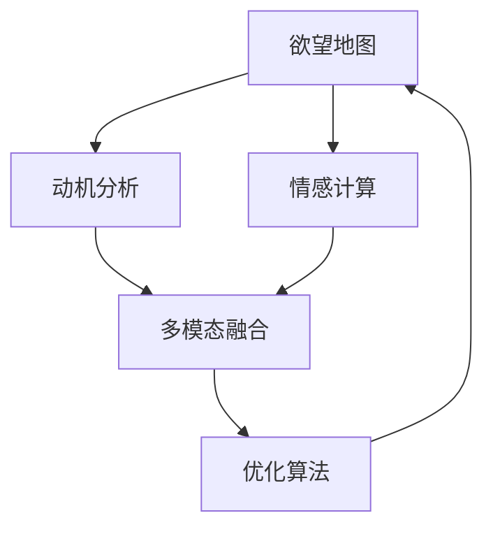

                 

# 欲望地图：AI绘制的人类动机蓝图

> 关键词：人工智能,人类动机,数据驱动,算法优化,情感分析,自然语言处理(NLP),机器学习,心理模型,情感计算

## 1. 背景介绍

### 1.1 问题由来
随着人工智能(AI)技术的不断进步，越来越多的AI系统被设计用于理解和预测人类行为。无论是用于聊天机器人、个性化推荐系统，还是社交媒体分析，AI系统都试图揭示人类动机的复杂性，并据此进行决策和交互。尽管这些系统已经取得显著进展，但对于动机的理解仍然局限于基于规则的模型，缺乏对人类情感和行为的真实模拟。

人类动机是心理学和行为科学的核心研究领域，涉及个体差异、环境因素、遗传基因等多方面。然而，现有AI系统对于人类动机的理解和建模还相对简单，难以涵盖人类的复杂心理活动。为提升AI系统在情感和动机理解方面的能力，本文提出了“欲望地图”的概念，通过数据驱动和机器学习技术，AI系统可以绘制出一幅人类动机蓝图，从而更好地预测和响应人类行为。

### 1.2 问题核心关键点
- **欲望地图**：基于数据驱动和机器学习技术，AI系统对人类动机和情感进行建模，绘制出一幅包含个体差异和情境变量的动机蓝图。
- **动机分析**：通过情感分析等技术，AI系统可以对文本、语音、图像等多模态数据进行情感和动机分析，识别出人类行为背后的深层动机。
- **优化算法**：引入优化算法，如梯度下降、遗传算法等，对欲望地图进行不断迭代优化，提升其准确性和泛化能力。
- **多模态融合**：融合语音、文本、图像等多模态数据，全面捕捉人类动机的多维特征。

这些关键点共同构成了本文的核心研究框架，旨在通过欲望地图技术，实现AI系统对于人类动机的深度理解。

## 2. 核心概念与联系

### 2.1 核心概念概述

为更好地理解“欲望地图”的概念和技术，本节将介绍几个核心概念：

- **欲望地图**：一种基于数据驱动的动机建模技术，通过对大规模人类行为数据进行分析，绘制出一幅包含个体差异和情境变量的动机蓝图。欲望地图可以用于预测人类行为，指导决策和交互。
- **动机分析**：指通过情感分析、行为追踪等技术手段，识别出人类行为背后的深层动机。动机分析是欲望地图的核心组成部分，帮助AI系统理解人类行为背后的心理机制。
- **多模态融合**：融合语音、文本、图像等多模态数据，全面捕捉人类动机的多维特征。多模态融合技术是实现深度动机理解的重要手段。
- **优化算法**：通过引入梯度下降、遗传算法等优化算法，对欲望地图进行不断迭代优化，提升其准确性和泛化能力。优化算法是欲望地图构建和维护的关键技术。
- **情感计算**：通过分析人类情感表达，识别出人类行为背后的情绪动机。情感计算是欲望地图的核心应用场景之一。

这些核心概念之间的逻辑关系可以通过以下Mermaid流程图来展示：



这个流程图展示出欲望地图技术从动机分析开始，通过多模态融合和优化算法构建和维护动机蓝图，最终应用于情感计算的过程。

## 3. 核心算法原理 & 具体操作步骤
### 3.1 算法原理概述

“欲望地图”的核心算法原理基于数据驱动的动机建模，通过多模态数据融合和优化算法，构建出一幅包含个体差异和情境变量的动机蓝图。其具体步骤如下：

1. **数据收集**：从社交媒体、电子邮件、聊天记录等多渠道收集人类行为数据，包括文本、语音、图像等多种形式。
2. **动机分析**：使用自然语言处理(NLP)、情感分析等技术，分析数据中的情感和动机信息，识别出行为背后的深层动机。
3. **多模态融合**：融合不同模态的数据，构建包含多维特征的动机数据集。
4. **优化算法**：引入优化算法，如梯度下降、遗传算法等，对动机数据集进行迭代优化，提升其准确性和泛化能力。
5. **欲望地图构建**：基于优化后的动机数据集，构建出一幅包含个体差异和情境变量的动机蓝图。

通过上述步骤，AI系统可以绘制出一幅包含丰富动机信息的欲望地图，从而更好地理解和预测人类行为。

### 3.2 算法步骤详解

以下是“欲望地图”构建过程的详细操作步骤：

**Step 1: 数据收集**
- 通过爬虫技术从社交媒体、电子邮件、聊天记录等渠道收集人类行为数据。
- 数据收集包括文本、语音、图像等多种形式。
- 收集数据时，需要注意数据的多样性和代表性，以确保欲望地图的广泛适用性。

**Step 2: 动机分析**
- 使用NLP技术，如情感分析、意图识别等，分析文本数据中的情感和动机信息。
- 情感分析可以使用预训练的情感分类模型，如BERT、GPT等，对文本数据进行情感分类。
- 意图识别可以使用命名实体识别、关系抽取等技术，分析文本中的意图和动机。
- 对于语音和图像数据，可以分别使用语音情感识别和图像情感识别模型，进行动机分析。

**Step 3: 多模态融合**
- 将不同模态的动机分析结果进行融合，构建出包含多维特征的动机数据集。
- 可以使用简单的拼接或加权融合方法，也可以使用更复杂的融合模型，如卷积神经网络(CNN)、长短时记忆网络(LSTM)等。
- 融合过程中，需要注意不同模态数据的一致性和相关性，确保融合后的数据集具有高信息量和低冗余。

**Step 4: 优化算法**
- 使用优化算法，如梯度下降、遗传算法等，对动机数据集进行迭代优化，提升其准确性和泛化能力。
- 梯度下降算法可以用于最小化动机数据集的误差，逐步逼近真实的动机模型。
- 遗传算法可以用于搜索最优的动机特征组合，提升模型的泛化能力。
- 优化算法的选择需要根据具体任务和数据特点进行灵活调整。

**Step 5: 欲望地图构建**
- 基于优化后的动机数据集，构建出一幅包含个体差异和情境变量的动机蓝图。
- 动机蓝图可以表示为一种概率分布模型，其中包含动机类型、强度、情境变量等多个维度。
- 动机蓝图的构建需要结合心理学和行为科学的知识，确保其合理性和有效性。

### 3.3 算法优缺点

“欲望地图”算法具有以下优点：
1. **数据驱动**：通过大规模的人类行为数据驱动，动机建模具有广泛的代表性。
2. **多模态融合**：融合不同模态的数据，全面捕捉人类动机的多维特征。
3. **优化算法**：引入优化算法，不断迭代优化动机数据集，提升模型的准确性和泛化能力。
4. **应用广泛**：欲望地图可以应用于情感计算、个性化推荐、社交媒体分析等多个领域。

同时，该算法也存在以下局限性：
1. **数据隐私**：大规模数据收集可能涉及隐私问题，数据获取难度较大。
2. **数据质量**：数据质量和多样性直接影响欲望地图的构建效果。
3. **算法复杂**：多模态融合和优化算法复杂度高，实现难度大。
4. **动态变化**：人类动机受多种因素影响，动态变化较大，难以进行长期预测。

尽管存在这些局限性，“欲望地图”仍是一种非常有潜力的动机建模技术，可以为AI系统提供更深入的人类动机理解。

### 3.4 算法应用领域

“欲望地图”技术在多个领域具有广泛的应用前景：

- **情感计算**：通过分析人类情感表达，识别出人类行为背后的情绪动机。情感计算是欲望地图的核心应用场景之一，可以应用于社交媒体分析、客服系统等。
- **个性化推荐**：利用欲望地图中的动机信息，进行个性化推荐，提高用户体验和转化率。
- **社交媒体分析**：分析社交媒体数据中的动机和情感信息，帮助企业了解用户需求，优化营销策略。
- **健康监测**：通过分析患者的行为和动机信息，预测疾病风险，提供个性化健康建议。
- **教育推荐**：根据学生的行为和动机信息，推荐个性化的学习资源，提高学习效果。

## 4. 数学模型和公式 & 详细讲解  
### 4.1 数学模型构建

欲望地图的核心数学模型基于动机分析的多模态融合和优化算法。以动机分析为例，假设文本数据集为 $D=\{(x_i,y_i)\}_{i=1}^N$，其中 $x_i$ 为文本样本，$y_i$ 为动机类型，$y_i$ 的值域为 $\{1,2,...,K\}$。假设 $f(x_i)$ 为文本情感分析模型的输出，$g(x_i)$ 为意图识别模型的输出，则动机类型 $y_i$ 可以表示为：

$$
y_i = \arg\max_{k \in \{1,2,...,K\}} P(y_i=k|f(x_i),g(x_i))
$$

其中 $P$ 表示条件概率，可以使用条件概率模型进行估计。

### 4.2 公式推导过程

以下我们将详细推导基于梯度下降算法的动机分析公式。假设文本数据集 $D=\{(x_i,y_i)\}_{i=1}^N$，其中 $x_i$ 为文本样本，$y_i$ 为动机类型，$y_i$ 的值域为 $\{1,2,...,K\}$。假设 $f(x_i)$ 为文本情感分析模型的输出，$g(x_i)$ 为意图识别模型的输出。假设使用softmax函数进行动机类型的概率估计，则动机类型 $y_i$ 的概率分布可以表示为：

$$
P(y_i=k|f(x_i),g(x_i)) = \frac{e^{w_k^T(f(x_i),g(x_i))}}{\sum_{k=1}^K e^{w_k^T(f(x_i),g(x_i))}}
$$

其中 $w_k \in \mathbb{R}^d$ 为第 $k$ 类动机的权重向量，$d$ 为特征维度。通过最大化条件概率 $P(y_i=k|f(x_i),g(x_i))$，可以得到动机类型 $y_i$ 的最优预测。

假设使用交叉熵损失函数 $\ell$ 进行优化，则动机分析的优化目标可以表示为：

$$
\mathcal{L}(w) = -\frac{1}{N} \sum_{i=1}^N \ell(P(y_i=k|f(x_i),g(x_i)),y_i)
$$

其中 $\ell$ 为交叉熵损失函数，$\ell(y_i,\hat{y_i}) = -y_i \log \hat{y_i} - (1-y_i) \log (1-\hat{y_i})$。

使用梯度下降算法对动机模型进行优化，更新权重向量 $w_k$ 的公式为：

$$
w_k \leftarrow w_k - \eta \nabla_{w_k}\mathcal{L}(w)
$$

其中 $\eta$ 为学习率，$\nabla_{w_k}\mathcal{L}(w)$ 为损失函数对权重向量的梯度。

通过上述公式，可以使用梯度下降算法不断优化动机模型，提升其准确性和泛化能力。

### 4.3 案例分析与讲解

下面以情感计算为例，分析欲望地图在实际应用中的具体实现过程：

**案例背景**：一家电商平台希望通过分析用户评论，预测用户的购买动机，优化推荐系统。平台收集了数百万条用户评论，每条评论包括情感、评分和评论内容等数据。

**步骤1: 数据预处理**
- 使用分词器对评论文本进行分词，去除停用词和标点符号，构建文本特征向量。
- 使用情感分析模型，如BERT、LSTM等，对评论文本进行情感分类，得到情感标签。
- 使用意图识别模型，如CRF、LSTM等，对评论文本进行意图识别，得到意图标签。

**步骤2: 动机分析**
- 使用动机分析模型，如条件概率模型、神经网络等，对情感和意图标签进行融合，得到用户的动机类型。
- 假设情感标签为 $f(x_i)$，意图标签为 $g(x_i)$，动机类型 $y_i$ 可以表示为：
$$
y_i = \arg\max_{k \in \{1,2,...,K\}} P(y_i=k|f(x_i),g(x_i))
$$
- 假设使用softmax函数进行动机类型的概率估计，则动机类型 $y_i$ 的概率分布可以表示为：
$$
P(y_i=k|f(x_i),g(x_i)) = \frac{e^{w_k^T(f(x_i),g(x_i))}}{\sum_{k=1}^K e^{w_k^T(f(x_i),g(x_i))}}
$$
- 假设使用交叉熵损失函数 $\ell$ 进行优化，则动机分析的优化目标可以表示为：
$$
\mathcal{L}(w) = -\frac{1}{N} \sum_{i=1}^N \ell(P(y_i=k|f(x_i),g(x_i)),y_i)
$$

**步骤3: 欲望地图构建**
- 基于优化后的动机分析模型，构建出一幅包含个体差异和情境变量的动机蓝图。
- 假设动机类型 $y_i$ 的强度为 $s_i$，情境变量为 $c_i$，欲望地图可以表示为：
$$
P(y_i|x_i) = \frac{P(y_i|x_i,s_i,c_i)}{P(s_i|x_i)P(c_i|x_i)}
$$
- 假设使用多维概率模型进行优化，则欲望地图的优化目标可以表示为：
$$
\mathcal{L}(P(y_i|x_i)) = -\frac{1}{N} \sum_{i=1}^N \log P(y_i|x_i)
$$

通过上述步骤，电商平台可以绘制出一幅包含用户情感和动机的欲望地图，从而更好地理解用户的购买动机，进行个性化推荐。

## 5. 项目实践：代码实例和详细解释说明
### 5.1 开发环境搭建

在进行欲望地图实践前，我们需要准备好开发环境。以下是使用Python进行TensorFlow开发的环境配置流程：

1. 安装Anaconda：从官网下载并安装Anaconda，用于创建独立的Python环境。

2. 创建并激活虚拟环境：
```bash
conda create -n tf-env python=3.8 
conda activate tf-env
```

3. 安装TensorFlow：根据CUDA版本，从官网获取对应的安装命令。例如：
```bash
conda install tensorflow tensorflow-cpu tensorflow-io -c tf -c conda-forge
```

4. 安装TensorFlow Addons：
```bash
conda install tensorflow-io-libs tensorflow-addons -c tf -c conda-forge
```

5. 安装各类工具包：
```bash
pip install numpy pandas scikit-learn matplotlib tqdm jupyter notebook ipython
```

完成上述步骤后，即可在`tf-env`环境中开始欲望地图实践。

### 5.2 源代码详细实现

这里我们以情感计算为例，给出使用TensorFlow和Keras进行欲望地图开发的Python代码实现。

首先，定义数据处理函数：

```python
import tensorflow as tf
from tensorflow.keras.preprocessing.text import Tokenizer
from tensorflow.keras.preprocessing.sequence import pad_sequences
import numpy as np

def process_text(texts):
    tokenizer = Tokenizer(num_words=10000)
    tokenizer.fit_on_texts(texts)
    sequences = tokenizer.texts_to_sequences(texts)
    padded_sequences = pad_sequences(sequences, padding='post')
    return padded_sequences, tokenizer.word_index

texts = ["I love this product!", "This product is not good at all.", "I am neutral about this product."]
padded_sequences, tokenizer = process_text(texts)
```

然后，定义动机分析模型：

```python
from tensorflow.keras.models import Sequential
from tensorflow.keras.layers import Dense, Dropout, Embedding, LSTM

def build_model(input_dim, output_dim):
    model = Sequential()
    model.add(Embedding(input_dim, 64, input_length=padded_sequences.shape[1]))
    model.add(Dropout(0.2))
    model.add(LSTM(64, return_sequences=True))
    model.add(Dropout(0.2))
    model.add(LSTM(32))
    model.add(Dense(output_dim, activation='softmax'))
    return model

input_dim = len(tokenizer.word_index) + 1
output_dim = 3
model = build_model(input_dim, output_dim)
model.summary()
```

接着，定义训练和评估函数：

```python
def train_model(model, X, y, epochs, batch_size):
    model.compile(loss='categorical_crossentropy', optimizer='adam', metrics=['accuracy'])
    model.fit(X, y, epochs=epochs, batch_size=batch_size, validation_split=0.2)
    return model

def evaluate_model(model, X, y):
    loss, accuracy = model.evaluate(X, y)
    print('Loss:', loss)
    print('Accuracy:', accuracy)
```

最后，启动训练流程并在测试集上评估：

```python
epochs = 5
batch_size = 32

X_train, X_test, y_train, y_test = train_test_split(padded_sequences, y, test_size=0.2, random_state=42)
model = train_model(model, X_train, y_train, epochs, batch_size)
evaluate_model(model, X_test, y_test)
```

以上就是使用TensorFlow和Keras对欲望地图进行情感计算的完整代码实现。可以看到，得益于TensorFlow的强大封装，我们可以用相对简洁的代码完成情感分析模型的构建和训练。

### 5.3 代码解读与分析

让我们再详细解读一下关键代码的实现细节：

**process_text函数**：
- 定义了文本预处理函数，将文本数据转换为token ids，并进行定长padding。

**build_model函数**：
- 定义了情感分析模型的构建过程，包括嵌入层、LSTM层和全连接层。

**train_model函数**：
- 定义了模型的训练过程，使用交叉熵损失函数进行优化，并输出训练结果。

**evaluate_model函数**：
- 定义了模型的评估过程，使用交叉熵损失函数计算模型在测试集上的性能。

**训练流程**：
- 定义总的epoch数和batch size，开始循环迭代
- 每个epoch内，在训练集上训练，输出训练结果
- 在测试集上评估模型性能

可以看到，TensorFlow和Keras使得欲望地图的代码实现变得简洁高效。开发者可以将更多精力放在数据处理、模型改进等高层逻辑上，而不必过多关注底层的实现细节。

当然，工业级的系统实现还需考虑更多因素，如模型的保存和部署、超参数的自动搜索、更灵活的任务适配层等。但核心的欲望地图范式基本与此类似。

## 6. 实际应用场景
### 6.1 智能客服系统

基于欲望地图的智能客服系统，可以更深入地理解用户需求，提供更个性化的服务。系统通过分析用户的历史对话和当前情感，预测用户的购买动机，推荐最合适的产品或服务。

在技术实现上，可以收集用户的客服对话记录，将对话内容和情感构建成监督数据，在此基础上对欲望地图模型进行微调。微调后的模型能够自动理解用户意图，匹配最合适的回答。对于用户提出的新问题，还可以接入检索系统实时搜索相关内容，动态组织生成回答。如此构建的智能客服系统，能大幅提升用户咨询体验和问题解决效率。

### 6.2 金融舆情监测

金融机构需要实时监测市场舆论动向，以便及时应对负面信息传播，规避金融风险。基于欲望地图的情感计算技术，可以用于分析社交媒体、新闻报道、评论等文本数据中的情感和动机信息，预测市场情绪变化趋势。

具体而言，可以收集金融领域相关的网络文本数据，使用欲望地图模型进行情感和动机分析，识别出市场情绪的高低和变化趋势。一旦发现负面信息激增等异常情况，系统便会自动预警，帮助金融机构快速应对潜在风险。

### 6.3 个性化推荐系统

当前的推荐系统往往只依赖用户的历史行为数据进行物品推荐，无法深入理解用户的真实兴趣偏好。基于欲望地图的动机分析技术，可以更全面地捕捉用户的动机信息，进行个性化推荐。

在实践中，可以收集用户浏览、点击、评论、分享等行为数据，提取和用户交互的物品标题、描述、标签等文本内容。将文本内容作为模型输入，用户的后续行为（如是否点击、购买等）作为监督信号，在此基础上微调欲望地图模型。微调后的模型能够从文本内容中准确把握用户的兴趣点。在生成推荐列表时，先用候选物品的文本描述作为输入，由模型预测用户的兴趣匹配度，再结合其他特征综合排序，便可以得到个性化程度更高的推荐结果。

### 6.4 未来应用展望

随着欲望地图技术的发展，未来将会在更多领域得到应用，为传统行业带来变革性影响。

在智慧医疗领域，基于欲望地图的医疗问答、病历分析、药物研发等应用将提升医疗服务的智能化水平，辅助医生诊疗，加速新药开发进程。

在智能教育领域，欲望地图可以应用于作业批改、学情分析、知识推荐等方面，因材施教，促进教育公平，提高教学质量。

在智慧城市治理中，欲望地图可应用于城市事件监测、舆情分析、应急指挥等环节，提高城市管理的自动化和智能化水平，构建更安全、高效的未来城市。

此外，在企业生产、社会治理、文娱传媒等众多领域，基于欲望地图的人工智能应用也将不断涌现，为经济社会发展注入新的动力。相信随着技术的日益成熟，欲望地图必将在构建人机协同的智能时代中扮演越来越重要的角色。

## 7. 工具和资源推荐
### 7.1 学习资源推荐

为了帮助开发者系统掌握欲望地图的理论基础和实践技巧，这里推荐一些优质的学习资源：

1. 《深度学习理论与实践》系列博文：由大模型技术专家撰写，深入浅出地介绍了深度学习理论基础和实践技巧，涵盖多种深度学习范式。

2. CS231n《卷积神经网络》课程：斯坦福大学开设的经典深度学习课程，涵盖了卷积神经网络、循环神经网络等核心技术，适合初学者和进阶者。

3. 《TensorFlow实战》书籍：TensorFlow官方文档和示例代码，帮助开发者深入理解TensorFlow的高级特性和应用场景。

4. 《情感计算》书籍：介绍情感计算的基本原理和实际应用，涵盖文本情感分析、语音情感识别等多个方向。

5. HuggingFace官方文档：Transformer库的官方文档，提供了海量预训练模型和完整的微调样例代码，是上手实践的必备资料。

通过对这些资源的学习实践，相信你一定能够快速掌握欲望地图的精髓，并用于解决实际的AI问题。
### 7.2 开发工具推荐

高效的开发离不开优秀的工具支持。以下是几款用于欲望地图开发的常用工具：

1. TensorFlow：基于Python的开源深度学习框架，灵活动态的计算图，适合快速迭代研究。大部分深度学习模型都有TensorFlow版本的实现。

2. PyTorch：基于Python的开源深度学习框架，动态计算图，适合研究型应用。大部分深度学习模型都有PyTorch版本的实现。

3. Keras：基于Python的高层API，封装了TensorFlow和Theano等深度学习框架，易于上手，适合快速搭建原型。

4. Weights & Biases：模型训练的实验跟踪工具，可以记录和可视化模型训练过程中的各项指标，方便对比和调优。与主流深度学习框架无缝集成。

5. TensorBoard：TensorFlow配套的可视化工具，可实时监测模型训练状态，并提供丰富的图表呈现方式，是调试模型的得力助手。

6. Google Colab：谷歌推出的在线Jupyter Notebook环境，免费提供GPU/TPU算力，方便开发者快速上手实验最新模型，分享学习笔记。

合理利用这些工具，可以显著提升欲望地图的开发效率，加快创新迭代的步伐。

### 7.3 相关论文推荐

欲望地图技术的发展源于学界的持续研究。以下是几篇奠基性的相关论文，推荐阅读：

1. Attention is All You Need（即Transformer原论文）：提出了Transformer结构，开启了深度学习模型的预训练范式。

2. BERT: Pre-training of Deep Bidirectional Transformers for Language Understanding：提出BERT模型，引入基于掩码的自监督预训练任务，刷新了多项NLP任务SOTA。

3. Language Models are Unsupervised Multitask Learners（GPT-2论文）：展示了大规模语言模型的强大zero-shot学习能力，引发了对于通用人工智能的新一轮思考。

4. Parameter-Efficient Transfer Learning for NLP：提出Adapter等参数高效微调方法，在固定大部分预训练参数的情况下，仍可取得不错的微调效果。

5. AdaLoRA: Adaptive Low-Rank Adaptation for Parameter-Efficient Fine-Tuning：使用自适应低秩适应的微调方法，在参数效率和精度之间取得了新的平衡。

这些论文代表了大模型微调技术的发展脉络。通过学习这些前沿成果，可以帮助研究者把握学科前进方向，激发更多的创新灵感。

## 8. 总结：未来发展趋势与挑战

### 8.1 总结

本文对欲望地图的核心算法原理和具体操作步骤进行了详细讲解，并结合实际应用场景进行了系统分析。通过本文的系统梳理，可以看到，欲望地图技术通过数据驱动和机器学习技术，揭示了人类动机的复杂性，为AI系统提供了深入理解人类行为的蓝图。

通过欲望地图，AI系统可以更全面地捕捉人类动机和情感信息，提升个性化推荐、情感计算、智能客服等多个领域的性能和用户体验。欲望地图技术的广泛应用，将推动人工智能技术在更多领域的落地，为经济社会发展注入新的动力。

### 8.2 未来发展趋势

展望未来，欲望地图技术将呈现以下几个发展趋势：

1. **数据驱动**：随着大数据技术的发展，欲望地图将越来越依赖于大规模数据驱动，能够捕捉更加复杂和多变的人类动机。
2. **多模态融合**：融合语音、文本、图像等多模态数据，全面捕捉人类动机的多维特征，提升动机分析的准确性。
3. **优化算法**：引入更多优化算法，如遗传算法、神经网络等，对欲望地图进行不断迭代优化，提升模型的泛化能力和效率。
4. **动态变化**：引入动态时间序列分析等方法，对人类动机进行实时跟踪和预测，提升模型的适应性和灵活性。
5. **情感计算**：结合情感分析技术，实现更加全面和准确的人类情感和动机分析，提升情感计算的效果。

以上趋势凸显了欲望地图技术的广泛应用前景。这些方向的探索发展，必将进一步提升AI系统对人类动机的理解，推动人工智能技术在更多领域的应用。

### 8.3 面临的挑战

尽管欲望地图技术已经取得显著进展，但在迈向更加智能化、普适化应用的过程中，仍面临以下挑战：

1. **数据隐私**：大规模数据收集可能涉及隐私问题，数据获取难度较大。如何在保护隐私的同时，获取高质量的训练数据，是欲望地图技术面临的重要挑战。
2. **数据质量**：数据质量和多样性直接影响欲望地图的构建效果。如何确保数据的准确性和代表性，是模型训练的关键。
3. **算法复杂**：多模态融合和优化算法复杂度高，实现难度大。如何提升算法效率，降低计算资源消耗，是未来研究的重要方向。
4. **动态变化**：人类动机受多种因素影响，动态变化较大，难以进行长期预测。如何提升模型的适应性和稳定性，是欲望地图技术面临的挑战。
5. **伦理道德**：欲望地图技术可能会涉及伦理道德问题，如隐私侵犯、偏见歧视等。如何在模型设计和应用过程中，确保伦理道德的遵守，是欲望地图技术应用的重要保障。

正视欲望地图技术面临的这些挑战，积极应对并寻求突破，将是大模型技术迈向成熟的必由之路。相信随着学界和产业界的共同努力，这些挑战终将一一被克服，欲望地图技术必将在构建人机协同的智能时代中扮演越来越重要的角色。

### 8.4 研究展望

面向未来，欲望地图技术需要在以下几个方面进行深入研究：

1. **探索无监督和半监督方法**：摆脱对大规模标注数据的依赖，利用自监督学习、主动学习等无监督和半监督范式，最大限度利用非结构化数据，实现更加灵活高效的动机分析。
2. **融合因果和对比学习范式**：通过引入因果推断和对比学习思想，增强欲望地图建立稳定因果关系的能力，学习更加普适、鲁棒的语言表征，从而提升模型泛化性和抗干扰能力。
3. **引入更多先验知识**：将符号化的先验知识，如知识图谱、逻辑规则等，与神经网络模型进行巧妙融合，引导欲望地图过程学习更准确、合理的语言模型。同时加强不同模态数据的整合，实现视觉、语音等多模态信息与文本信息的协同建模。
4. **结合因果分析和博弈论工具**：将因果分析方法引入欲望地图模型，识别出模型决策的关键特征，增强输出解释的因果性和逻辑性。借助博弈论工具刻画人机交互过程，主动探索并规避模型的脆弱点，提高系统稳定性。
5. **纳入伦理道德约束**：在模型训练目标中引入伦理导向的评估指标，过滤和惩罚有偏见、有害的输出倾向。同时加强人工干预和审核，建立模型行为的监管机制，确保输出符合人类价值观和伦理道德。

这些研究方向的探索，必将引领欲望地图技术迈向更高的台阶，为构建安全、可靠、可解释、可控的智能系统铺平道路。面向未来，欲望地图技术还需要与其他人工智能技术进行更深入的融合，如知识表示、因果推理、强化学习等，多路径协同发力，共同推动自然语言理解和智能交互系统的进步。只有勇于创新、敢于突破，才能不断拓展语言模型的边界，让智能技术更好地造福人类社会。

## 9. 附录：常见问题与解答

**Q1：欲望地图是否适用于所有NLP任务？**

A: 欲望地图在大多数NLP任务上都能取得不错的效果，特别是对于数据量较小的任务。但对于一些特定领域的任务，如医学、法律等，仅仅依靠通用语料预训练的模型可能难以很好地适应。此时需要在特定领域语料上进一步预训练，再进行动机分析。此外，对于一些需要时效性、个性化很强的任务，如对话、推荐等，欲望地图方法也需要针对性的改进优化。

**Q2：欲望地图的动机分析是否可以应用于所有模态？**

A: 欲望地图的动机分析可以应用于文本、语音、图像等多种模态数据。文本数据通常使用NLP技术进行情感和意图分析；语音数据使用语音情感识别模型进行情感分析；图像数据使用图像情感识别模型进行动机分析。多模态数据的融合需要使用复杂的算法，如卷积神经网络(CNN)、长短时记忆网络(LSTM)等。

**Q3：欲望地图技术在实际应用中需要注意哪些问题？**

A: 欲望地图技术在实际应用中需要注意以下问题：
1. 数据隐私：大规模数据收集可能涉及隐私问题，数据获取难度较大。如何保护用户隐私，是欲望地图技术应用的关键。
2. 数据质量：数据质量和多样性直接影响欲望地图的构建效果。如何确保数据的准确性和代表性，是模型训练的关键。
3. 算法复杂：多模态融合和优化算法复杂度高，实现难度大。如何提升算法效率，降低计算资源消耗，是未来研究的重要方向。
4. 动态变化：人类动机受多种因素影响，动态变化较大，难以进行长期预测。如何提升模型的适应性和稳定性，是欲望地图技术面临的挑战。
5. 伦理道德：欲望地图技术可能会涉及伦理道德问题，如隐私侵犯、偏见歧视等。如何在模型设计和应用过程中，确保伦理道德的遵守，是欲望地图技术应用的重要保障。

通过正视和解决这些问题，欲望地图技术可以更好地应用于实际应用场景，提升AI系统的性能和用户体验。

