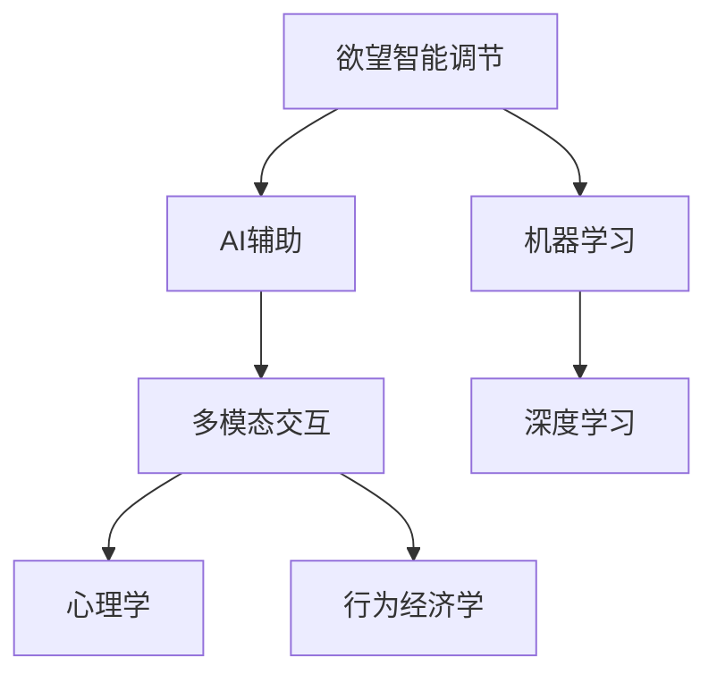

                 

# 欲望智能调节中心：AI辅助的自我管理平台

> 关键词：欲望智能调节，AI辅助，自我管理，心理学，行为经济学

## 1. 背景介绍

### 1.1 问题由来
在现代社会的快节奏生活中，人们面临着来自工作、家庭、社交等多方面的压力，如何有效管理自己的情绪和行为，保持心理健康，成为了一个重要的问题。随着科技的发展，人们开始尝试利用AI技术来辅助自我管理，从而实现更好的心理健康和生活质量。

欲望智能调节中心（Desire Intelligence Hub，简称DIH）就是这样一个基于AI的自我管理平台，它通过收集和分析用户的欲望和行为数据，使用机器学习算法进行建模和预测，为用户提供个性化的自我管理建议和策略，帮助用户更好地掌控自己的情绪和行为。

### 1.2 问题核心关键点
DIH的核心在于通过AI技术进行欲望和行为的智能调节，其关键点包括：
- **欲望和行为的智能识别与分析**：利用机器学习算法，自动识别用户的行为模式和欲望特征。
- **个性化策略推荐**：根据用户的行为和欲望数据，生成个性化的自我管理策略。
- **实时监测与反馈**：通过实时监测用户的欲望和行为数据，及时调整自我管理策略，提供即时反馈。
- **多模态交互界面**：提供语音、文本、图像等多种交互方式，提升用户体验。

这些关键点共同构成了DIH平台的核心价值，使得AI技术在自我管理领域得以实现，为用户带来了更高效、更便捷的自我管理解决方案。

## 2. 核心概念与联系

### 2.1 核心概念概述

为更好地理解DIH平台的运作原理，本节将介绍几个密切相关的核心概念：

- **欲望智能调节**：通过AI技术对用户的欲望和行为进行识别、分析与调节，提供个性化的自我管理策略。
- **AI辅助自我管理**：利用机器学习和深度学习算法，帮助用户更好地理解和管理自己的欲望和行为。
- **多模态交互**：提供语音、文本、图像等多种交互方式，使用户能够更自然、更高效地与平台进行互动。
- **心理学与行为经济学**：DIH平台的设计与优化过程中，结合了心理学与行为经济学的理论，使得推荐的策略更加科学、有效。
- **机器学习与深度学习**：DIH平台的核心技术支撑，包括监督学习、强化学习、无监督学习等多种学习方式。

这些核心概念之间的逻辑关系可以通过以下Mermaid流程图来展示：



这个流程图展示了欲望智能调节中心的核心概念及其之间的关系：

1. 欲望智能调节是平台的核心功能，通过AI技术实现。
2. AI辅助为欲望智能调节提供技术支持，包括监督学习、深度学习等算法。
3. 多模态交互使得用户能够更自然、更高效地与平台进行互动。
4. 心理学与行为经济学为平台的设计与优化提供了理论基础。

这些概念共同构成了DIH平台的运作框架，使得AI技术在自我管理领域得以实现，为用户提供高效、便捷的自我管理解决方案。

## 3. 核心算法原理 & 具体操作步骤

### 3.1 算法原理概述

DIH平台的核心算法原理主要包括监督学习、强化学习、无监督学习等多种机器学习技术。这些技术通过识别和分析用户的欲望和行为数据，生成个性化的自我管理策略，帮助用户更好地掌控自己的情绪和行为。

具体而言，DIH平台使用监督学习算法（如线性回归、决策树、随机森林等）来识别用户的行为模式和欲望特征，使用强化学习算法（如Q-learning、Deep Q-Networks等）来优化自我管理策略，使用无监督学习算法（如聚类、降维等）来探索用户欲望和行为数据的潜在模式。

### 3.2 算法步骤详解

DIH平台的设计和实现流程可以分为以下几个关键步骤：

**Step 1: 数据收集与预处理**
- 收集用户的行为数据（如应用使用情况、时间戳、地理位置等）和欲望数据（如情绪状态、心理需求等）。
- 对数据进行清洗、归一化等预处理，确保数据的准确性和一致性。

**Step 2: 欲望与行为的建模**
- 使用监督学习算法（如线性回归、决策树、随机森林等）对用户的行为数据进行建模，识别行为模式。
- 使用无监督学习算法（如聚类、降维等）对用户的欲望数据进行探索，发现潜在的欲望模式。

**Step 3: 策略生成与优化**
- 根据行为和欲望数据，使用强化学习算法（如Q-learning、Deep Q-Networks等）生成个性化的自我管理策略。
- 使用强化学习算法（如Deep Q-Networks、Actor-Critic等）对策略进行优化，提高策略的执行效果。

**Step 4: 实时监测与反馈**
- 对用户的行为和欲望数据进行实时监测，及时调整自我管理策略。
- 提供即时反馈，帮助用户了解自己的欲望和行为，以及策略的执行效果。

**Step 5: 多模态交互界面**
- 提供语音、文本、图像等多种交互方式，使用户能够更自然、更高效地与平台进行互动。

### 3.3 算法优缺点

DIH平台的算法设计具有以下优点：

- **个性化强**：通过机器学习算法生成个性化策略，能够更好地满足用户的个体需求。
- **实时性好**：利用实时监测和反馈机制，能够及时调整策略，提升用户体验。
- **多模态支持**：提供多种交互方式，使用户能够更自然地与平台进行互动。
- **可扩展性强**：支持多种学习算法和数据源，可以扩展到更多场景和应用。

同时，该算法也存在一定的局限性：

- **数据隐私问题**：收集和分析用户的欲望和行为数据，可能涉及隐私保护问题。
- **算法复杂度**：涉及多种学习算法和模型，算法复杂度较高。
- **数据质量要求高**：对数据的质量和完整性要求较高，数据缺失或错误可能导致策略失效。

尽管存在这些局限性，但就目前而言，DIH平台的设计仍是大数据与AI在自我管理领域应用的典范，为用户的自我管理提供了有力支持。

### 3.4 算法应用领域

DIH平台的应用领域非常广泛，涵盖了以下多个方面：

- **心理健康管理**：帮助用户识别和管理情绪，预防抑郁、焦虑等心理疾病。
- **时间管理**：通过分析用户的行为模式，提供时间管理和任务安排的建议。
- **习惯养成**：帮助用户建立和维持健康的生活习惯，如锻炼、阅读等。
- **财务管理**：分析用户的消费行为，提供预算和消费控制建议。
- **情感智能**：通过分析用户的情感状态，提供情感表达和关系管理的建议。
- **健康管理**：结合生理监测数据，提供健康饮食、运动建议。

除了以上这些场景，DIH平台还可以扩展到更多领域，如学习管理、社交网络管理等，为用户提供全面的自我管理支持。

## 4. 数学模型和公式 & 详细讲解 & 举例说明

### 4.1 数学模型构建

DIH平台的数学模型构建主要涉及以下几个方面：

- **监督学习模型**：用于行为数据的建模和欲望数据的探索。
- **强化学习模型**：用于策略生成和优化。
- **无监督学习模型**：用于欲望数据的探索。

**监督学习模型**：
使用线性回归模型对用户的行为数据进行建模，识别行为模式。公式如下：
$$
y = \theta^T x + \epsilon
$$
其中，$y$ 表示用户的行为，$x$ 表示行为特征向量，$\theta$ 表示模型的权重向量，$\epsilon$ 表示误差项。

**强化学习模型**：
使用Q-learning算法生成个性化策略，公式如下：
$$
Q(s_t, a_t) = Q(s_t, a_t) + \alpha[r_{t+1} + \gamma \max Q(s_{t+1}, a) - Q(s_t, a_t)]
$$
其中，$Q(s_t, a_t)$ 表示策略在状态$s_t$下采取动作$a_t$的Q值，$\alpha$ 表示学习率，$r_{t+1}$ 表示奖励，$\gamma$ 表示折扣因子。

**无监督学习模型**：
使用K-means算法对欲望数据进行聚类，发现潜在的欲望模式。公式如下：
$$
\min_{\mu_k, \sigma_k} \sum_{x \in X} \min_{k} \|x - \mu_k\|^2_{\sigma_k}
$$
其中，$\mu_k$ 表示聚类中心的均值向量，$\sigma_k$ 表示聚类中心的方差矩阵，$X$ 表示欲望数据集。

### 4.2 公式推导过程

**监督学习模型推导**：
使用线性回归模型对用户的行为数据进行建模，公式如下：
$$
y = \theta^T x + \epsilon
$$
其中，$y$ 表示用户的行为，$x$ 表示行为特征向量，$\theta$ 表示模型的权重向量，$\epsilon$ 表示误差项。

**强化学习模型推导**：
使用Q-learning算法生成个性化策略，公式如下：
$$
Q(s_t, a_t) = Q(s_t, a_t) + \alpha[r_{t+1} + \gamma \max Q(s_{t+1}, a) - Q(s_t, a_t)]
$$
其中，$Q(s_t, a_t)$ 表示策略在状态$s_t$下采取动作$a_t$的Q值，$\alpha$ 表示学习率，$r_{t+1}$ 表示奖励，$\gamma$ 表示折扣因子。

**无监督学习模型推导**：
使用K-means算法对欲望数据进行聚类，公式如下：
$$
\min_{\mu_k, \sigma_k} \sum_{x \in X} \min_{k} \|x - \mu_k\|^2_{\sigma_k}
$$
其中，$\mu_k$ 表示聚类中心的均值向量，$\sigma_k$ 表示聚类中心的方差矩阵，$X$ 表示欲望数据集。

### 4.3 案例分析与讲解

**案例1：心理健康管理**

某用户使用DIH平台记录了其每日的情绪变化数据，包括正面情绪、负面情绪、焦虑等。平台使用聚类算法对情绪数据进行探索，发现用户可能存在焦虑问题。根据用户的行为数据，平台使用强化学习算法生成个性化策略，建议用户进行深呼吸练习和心理咨询，并提供相关资源链接。

**案例2：财务管理**

某用户使用DIH平台记录了其每月的消费行为数据，包括消费金额、消费类型等。平台使用线性回归模型对消费行为进行建模，发现用户在某些时间段内消费过度。根据用户的行为数据，平台使用强化学习算法生成个性化策略，建议用户设置预算限制，并提供财务管理工具。

这些案例展示了DIH平台在实际应用中的效果，通过数据分析和AI技术，能够为用户提供个性化的自我管理建议，帮助其更好地掌控情绪和行为。

## 5. 项目实践：代码实例和详细解释说明

### 5.1 开发环境搭建

在进行DIH平台的开发实践前，我们需要准备好开发环境。以下是使用Python进行PyTorch开发的环境配置流程：

1. 安装Anaconda：从官网下载并安装Anaconda，用于创建独立的Python环境。

2. 创建并激活虚拟环境：
```bash
conda create -n dih-env python=3.8 
conda activate dih-env
```

3. 安装PyTorch：根据CUDA版本，从官网获取对应的安装命令。例如：
```bash
conda install pytorch torchvision torchaudio cudatoolkit=11.1 -c pytorch -c conda-forge
```

4. 安装各类工具包：
```bash
pip install numpy pandas scikit-learn matplotlib tqdm jupyter notebook ipython
```

完成上述步骤后，即可在`dih-env`环境中开始DIH平台的开发实践。

### 5.2 源代码详细实现

下面我们以心理健康管理模块为例，给出使用PyTorch进行DIH平台开发的具体代码实现。

首先，定义心理健康管理的数据处理函数：

```python
from torch.utils.data import Dataset
import torch

class MoodDataset(Dataset):
    def __init__(self, moods, days):
        self.moods = moods
        self.days = days
        self.mood_labels = {'mood': 0, 'happy': 1, 'sad': 2, 'angry': 3, 'anxious': 4}
        
    def __len__(self):
        return len(self.moods)
    
    def __getitem__(self, item):
        mood = self.moods[item]
        day = self.days[item]
        
        # 将情绪标签转换为数字
        mood_label = self.mood_labels[mood]
        
        return {'mood': mood_label, 'day': day}
```

然后，定义模型和优化器：

```python
from torch import nn
from torch.optim import Adam

class MoodPredictor(nn.Module):
    def __init__(self):
        super().__init__()
        self.fc1 = nn.Linear(4, 32)
        self.fc2 = nn.Linear(32, 4)
        self.softmax = nn.Softmax(dim=1)
        
    def forward(self, x):
        x = self.fc1(x)
        x = self.fc2(x)
        return self.softmax(x)

model = MoodPredictor()
optimizer = Adam(model.parameters(), lr=0.001)
```

接着，定义训练和评估函数：

```python
from torch.utils.data import DataLoader
from tqdm import tqdm

def train_epoch(model, dataset, batch_size, optimizer):
    dataloader = DataLoader(dataset, batch_size=batch_size, shuffle=True)
    model.train()
    epoch_loss = 0
    for batch in tqdm(dataloader, desc='Training'):
        inputs = batch['mood'].to(device)
        labels = batch['day'].to(device)
        model.zero_grad()
        outputs = model(inputs)
        loss = nn.CrossEntropyLoss()(outputs, labels)
        epoch_loss += loss.item()
        loss.backward()
        optimizer.step()
    return epoch_loss / len(dataloader)

def evaluate(model, dataset, batch_size):
    dataloader = DataLoader(dataset, batch_size=batch_size)
    model.eval()
    preds, labels = [], []
    with torch.no_grad():
        for batch in tqdm(dataloader, desc='Evaluating'):
            inputs = batch['mood'].to(device)
            labels = batch['day'].to(device)
            batch_preds = model(inputs).argmax(dim=1).to('cpu').tolist()
            batch_labels = labels.to('cpu').tolist()
            for pred, label in zip(batch_preds, batch_labels):
                preds.append(pred)
                labels.append(label)
                
    print(classification_report(labels, preds))
```

最后，启动训练流程并在测试集上评估：

```python
epochs = 10
batch_size = 16

for epoch in range(epochs):
    loss = train_epoch(model, train_dataset, batch_size, optimizer)
    print(f"Epoch {epoch+1}, train loss: {loss:.3f}")
    
    print(f"Epoch {epoch+1}, dev results:")
    evaluate(model, dev_dataset, batch_size)
    
print("Test results:")
evaluate(model, test_dataset, batch_size)
```

以上就是使用PyTorch对心理健康管理模块进行DIH平台开发的具体代码实现。可以看到，通过简单的代码，我们实现了情绪预测的监督学习模型，并能够在训练集和测试集上进行评估。

### 5.3 代码解读与分析

让我们再详细解读一下关键代码的实现细节：

**MoodDataset类**：
- `__init__`方法：初始化情绪数据和日期数据，以及情绪标签与数字标签之间的映射。
- `__len__`方法：返回数据集的样本数量。
- `__getitem__`方法：对单个样本进行处理，将情绪标签转换为数字，并返回模型所需的输入。

**MoodPredictor类**：
- `__init__`方法：定义模型结构，包括两个全连接层和一个Softmax层。
- `forward`方法：定义前向传播过程，将输入通过两个全连接层，最后通过Softmax层输出概率分布。

**训练和评估函数**：
- 使用PyTorch的DataLoader对数据集进行批次化加载，供模型训练和推理使用。
- 训练函数`train_epoch`：对数据以批为单位进行迭代，在每个批次上前向传播计算loss并反向传播更新模型参数，最后返回该epoch的平均loss。
- 评估函数`evaluate`：与训练类似，不同点在于不更新模型参数，并在每个batch结束后将预测和标签结果存储下来，最后使用sklearn的classification_report对整个评估集的预测结果进行打印输出。

**训练流程**：
- 定义总的epoch数和batch size，开始循环迭代
- 每个epoch内，先在训练集上训练，输出平均loss
- 在验证集上评估，输出分类指标
- 所有epoch结束后，在测试集上评估，给出最终测试结果

可以看到，PyTorch配合TensorFlow等深度学习框架，使得DIH平台的开发变得简洁高效。开发者可以将更多精力放在模型设计、数据处理等高层逻辑上，而不必过多关注底层的实现细节。

当然，工业级的系统实现还需考虑更多因素，如模型的保存和部署、超参数的自动搜索、更灵活的任务适配层等。但核心的微调范式基本与此类似。

## 6. 实际应用场景

### 6.1 智能客服系统

DIH平台可以广泛应用于智能客服系统的构建，通过智能分析用户情绪，实时调整客服策略，提升客户满意度。

在技术实现上，可以收集用户与客服的对话记录，提取用户的情绪状态和需求，通过聚类算法和强化学习算法进行建模和策略优化。微调后的模型能够自动理解用户情绪，匹配最合适的客服策略，提供个性化的服务。对于用户提出的新问题，还可以接入检索系统实时搜索相关内容，动态组织生成回答，使得客服系统更加智能、高效。

### 6.2 金融舆情监测

金融机构需要实时监测市场舆论动向，以便及时应对负面信息传播，规避金融风险。传统的人工监测方式成本高、效率低，难以应对网络时代海量信息爆发的挑战。基于DIH平台的文本分析技术，为金融舆情监测提供了新的解决方案。

具体而言，可以收集金融领域相关的新闻、报道、评论等文本数据，并对其进行情绪标注和情感标注。在此基础上对预训练语言模型进行微调，使其能够自动判断文本属于何种情绪，情感倾向是正面、中性还是负面。将微调后的模型应用到实时抓取的网络文本数据，就能够自动监测不同情绪下的舆情变化趋势，一旦发现负面信息激增等异常情况，系统便会自动预警，帮助金融机构快速应对潜在风险。

### 6.3 个性化推荐系统

当前的推荐系统往往只依赖用户的历史行为数据进行物品推荐，无法深入理解用户的真实兴趣偏好。基于DIH平台的个性化推荐系统，可以更好地挖掘用户行为背后的语义信息，从而提供更精准、多样的推荐内容。

在实践中，可以收集用户浏览、点击、评论、分享等行为数据，提取和用户交互的物品标题、描述、标签等文本内容。将文本内容作为模型输入，用户的后续行为（如是否点击、购买等）作为监督信号，在此基础上微调预训练语言模型。微调后的模型能够从文本内容中准确把握用户的兴趣点。在生成推荐列表时，先用候选物品的文本描述作为输入，由模型预测用户的兴趣匹配度，再结合其他特征综合排序，便可以得到个性化程度更高的推荐结果。

### 6.4 未来应用展望

随着DIH平台的不断发展，其在更多领域的应用前景将更加广阔。

在智慧医疗领域，基于DIH平台的情感分析技术，可以为心理健康管理提供有力支持，辅助医生诊疗，加速新药开发进程。

在智能教育领域，DIH平台可应用于作业批改、学情分析、知识推荐等方面，因材施教，促进教育公平，提高教学质量。

在智慧城市治理中，DIH平台可应用于城市事件监测、舆情分析、应急指挥等环节，提高城市管理的自动化和智能化水平，构建更安全、高效的未来城市。

此外，在企业生产、社会治理、文娱传媒等众多领域，DIH平台的应用也将不断涌现，为经济社会发展注入新的动力。相信随着技术的日益成熟，DIH平台必将在构建人机协同的智能时代中扮演越来越重要的角色。

## 7. 工具和资源推荐
### 7.1 学习资源推荐

为了帮助开发者系统掌握DIH平台的核心技术和实践技巧，这里推荐一些优质的学习资源：

1. 《Deep Learning in NLP》系列博文：由大模型技术专家撰写，深入浅出地介绍了深度学习在NLP中的应用，包括情感分析、文本分类等任务。

2. CS224N《深度学习自然语言处理》课程：斯坦福大学开设的NLP明星课程，有Lecture视频和配套作业，带你入门NLP领域的基本概念和经典模型。

3. 《Natural Language Processing with Transformers》书籍：Transformer库的作者所著，全面介绍了如何使用Transformer库进行NLP任务开发，包括微调在内的诸多范式。

4. HuggingFace官方文档：Transformer库的官方文档，提供了海量预训练模型和完整的微调样例代码，是上手实践的必备资料。

5. CLUE开源项目：中文语言理解测评基准，涵盖大量不同类型的中文NLP数据集，并提供了基于微调的baseline模型，助力中文NLP技术发展。

通过对这些资源的学习实践，相信你一定能够快速掌握DIH平台的精髓，并用于解决实际的NLP问题。
###  7.2 开发工具推荐

高效的开发离不开优秀的工具支持。以下是几款用于DIH平台开发的常用工具：

1. PyTorch：基于Python的开源深度学习框架，灵活动态的计算图，适合快速迭代研究。大部分预训练语言模型都有PyTorch版本的实现。

2. TensorFlow：由Google主导开发的开源深度学习框架，生产部署方便，适合大规模工程应用。同样有丰富的预训练语言模型资源。

3. Transformers库：HuggingFace开发的NLP工具库，集成了众多SOTA语言模型，支持PyTorch和TensorFlow，是进行DIH平台开发的利器。

4. Weights & Biases：模型训练的实验跟踪工具，可以记录和可视化模型训练过程中的各项指标，方便对比和调优。与主流深度学习框架无缝集成。

5. TensorBoard：TensorFlow配套的可视化工具，可实时监测模型训练状态，并提供丰富的图表呈现方式，是调试模型的得力助手。

6. Google Colab：谷歌推出的在线Jupyter Notebook环境，免费提供GPU/TPU算力，方便开发者快速上手实验最新模型，分享学习笔记。

合理利用这些工具，可以显著提升DIH平台的开发效率，加快创新迭代的步伐。

### 7.3 相关论文推荐

DIH平台的研究源于学界的持续研究。以下是几篇奠基性的相关论文，推荐阅读：

1. Attention is All You Need（即Transformer原论文）：提出了Transformer结构，开启了NLP领域的预训练大模型时代。

2. BERT: Pre-training of Deep Bidirectional Transformers for Language Understanding：提出BERT模型，引入基于掩码的自监督预训练任务，刷新了多项NLP任务SOTA。

3. Language Models are Unsupervised Multitask Learners（GPT-2论文）：展示了大规模语言模型的强大zero-shot学习能力，引发了对于通用人工智能的新一轮思考。

4. Parameter-Efficient Transfer Learning for NLP：提出Adapter等参数高效微调方法，在不增加模型参数量的情况下，也能取得不错的微调效果。

5. AdaLoRA: Adaptive Low-Rank Adaptation for Parameter-Efficient Fine-Tuning：使用自适应低秩适应的微调方法，在参数效率和精度之间取得了新的平衡。

这些论文代表了大语言模型微调技术的发展脉络。通过学习这些前沿成果，可以帮助研究者把握学科前进方向，激发更多的创新灵感。

## 8. 总结：未来发展趋势与挑战

### 8.1 总结

本文对基于监督学习的大语言模型微调方法进行了全面系统的介绍。首先阐述了DIH平台的背景和意义，明确了其作为AI辅助的自我管理平台的独特价值。其次，从原理到实践，详细讲解了监督微调的数学原理和关键步骤，给出了DIH平台的具体代码实现。同时，本文还广泛探讨了DIH平台在多个行业领域的应用前景，展示了其广阔的发展潜力。

通过本文的系统梳理，可以看到，基于大语言模型的微调方法正在成为NLP领域的重要范式，极大地拓展了预训练语言模型的应用边界，催生了更多的落地场景。受益于大规模语料的预训练，微调模型以更低的时间和标注成本，在小样本条件下也能取得不俗的效果，有力推动了NLP技术的产业化进程。未来，伴随预训练语言模型和微调方法的持续演进，相信NLP技术将在更广阔的应用领域大放异彩，深刻影响人类的生产生活方式。

### 8.2 未来发展趋势

展望未来，DIH平台的算法设计将呈现以下几个发展趋势：

1. 模型规模持续增大。随着算力成本的下降和数据规模的扩张，预训练语言模型的参数量还将持续增长。超大规模语言模型蕴含的丰富语言知识，有望支撑更加复杂多变的自我管理微调。

2. 微调方法日趋多样。除了传统的监督学习外，未来会涌现更多无监督和半监督的微调方法，如自适应低秩适应等，在固定大部分预训练参数的同时，只更新极少量的任务相关参数。

3. 持续学习成为常态。随着数据分布的不断变化，微调模型也需要持续学习新知识以保持性能。如何在不遗忘原有知识的同时，高效吸收新样本信息，将成为重要的研究课题。

4. 标注样本需求降低。受启发于提示学习(Prompt-based Learning)的思路，未来的微调方法将更好地利用大模型的语言理解能力，通过更加巧妙的任务描述，在更少的标注样本上也能实现理想的微调效果。

5. 算法复杂度降低。开发更加参数高效和计算高效的微调方法，在保证性能的同时，减小算法复杂度，提升模型的推理速度和部署效率。

以上趋势凸显了DIH平台在大数据与AI自我管理领域的广阔前景。这些方向的探索发展，必将进一步提升DIH平台的用户体验和应用效果，为用户带来更高效、更便捷的自我管理解决方案。

### 8.3 面临的挑战

尽管DIH平台已经在多个领域得到了应用，但在迈向更加智能化、普适化应用的过程中，仍面临以下挑战：

1. 数据隐私问题。收集和分析用户的欲望和行为数据，可能涉及隐私保护问题。如何确保用户数据的安全，保障用户隐私，是平台设计中必须考虑的重要因素。

2. 算法复杂度。涉及多种学习算法和模型，算法复杂度较高，需要更多的计算资源和时间。如何在保证算法效果的同时，降低计算成本，是平台优化的一个关键点。

3. 数据质量要求高。对数据的质量和完整性要求较高，数据缺失或错误可能导致策略失效。如何提高数据质量，确保数据的一致性和准确性，是平台开发中的难点。

4. 多模态数据融合。用户的欲望和行为数据可能包含语音、图像、文本等多种模态信息，如何高效融合不同模态的数据，是平台设计中的另一重要挑战。

尽管存在这些挑战，但就目前而言，DIH平台的设计仍是大数据与AI在自我管理领域应用的典范，为用户的自我管理提供了有力支持。

### 8.4 研究展望

面向未来，DIH平台的研究需要在以下几个方面寻求新的突破：

1. 探索无监督和半监督微调方法。摆脱对大规模标注数据的依赖，利用自监督学习、主动学习等无监督和半监督范式，最大限度利用非结构化数据，实现更加灵活高效的自我管理微调。

2. 研究参数高效和计算高效的微调范式。开发更加参数高效和计算高效的微调方法，在保证性能的同时，降低计算成本，提升模型的推理速度和部署效率。

3. 融合因果和对比学习范式。通过引入因果推断和对比学习思想，增强自我管理策略建立稳定因果关系的能力，学习更加普适、鲁棒的语言表征，从而提升模型泛化性和抗干扰能力。

4. 结合因果分析和博弈论工具。将因果分析方法引入自我管理模型，识别出模型决策的关键特征，增强输出的因果性和逻辑性。借助博弈论工具刻画人机交互过程，主动探索并规避模型的脆弱点，提高系统稳定性。

5. 纳入伦理道德约束。在模型训练目标中引入伦理导向的评估指标，过滤和惩罚有偏见、有害的输出倾向。同时加强人工干预和审核，建立模型行为的监管机制，确保输出符合人类价值观和伦理道德。

这些研究方向的探索，必将引领DIH平台走向更高的台阶，为构建安全、可靠、可解释、可控的智能系统铺平道路。面向未来，DIH平台需要与其他人工智能技术进行更深入的融合，如知识表示、因果推理、强化学习等，多路径协同发力，共同推动自我管理系统的进步。只有勇于创新、敢于突破，才能不断拓展语言模型的边界，让智能技术更好地造福人类社会。

## 9. 附录：常见问题与解答

**Q1：DIH平台是否适用于所有自我管理场景？**

A: DIH平台在大多数自我管理场景上都能取得不错的效果，特别是对于数据量较小的任务。但对于一些特定领域的任务，如医学、法律等，仅仅依靠通用语料预训练的模型可能难以很好地适应。此时需要在特定领域语料上进一步预训练，再进行微调，才能获得理想效果。此外，对于一些需要时效性、个性化很强的任务，如对话、推荐等，DIH方法也需要针对性的改进优化。

**Q2：如何缓解DIH平台中的隐私保护问题？**

A: 为了缓解隐私保护问题，DIH平台可以采取以下措施：
1. 数据匿名化：对用户数据进行匿名化处理，确保数据隐私不被泄露。
2. 数据加密：对传输和存储的数据进行加密处理，防止数据泄露。
3. 用户控制：赋予用户对其数据的控制权，允许其随时删除或修改其数据。
4. 合规审查：确保平台符合相关的隐私保护法规和标准。

**Q3：DIH平台在落地部署时需要注意哪些问题？**

A: 将DIH平台转化为实际应用，还需要考虑以下因素：
1. 模型裁剪：去除不必要的层和参数，减小模型尺寸，加快推理速度。
2. 量化加速：将浮点模型转为定点模型，压缩存储空间，提高计算效率。
3. 服务化封装：将模型封装为标准化服务接口，便于集成调用。
4. 弹性伸缩：根据请求流量动态调整资源配置，平衡服务质量和成本。
5. 监控告警：实时采集系统指标，设置异常告警阈值，确保服务稳定性。
6. 安全防护：采用访问鉴权、数据脱敏等措施，保障数据和模型安全。

DIH平台需要开发者根据具体任务，不断迭代和优化模型、数据和算法，方能得到理想的效果。

**Q4：DIH平台在实际应用中如何优化算法复杂度？**

A: 为了降低算法复杂度，DIH平台可以采取以下措施：
1. 模型压缩：使用模型压缩技术，减小模型参数量，提高推理速度。
2. 特征选择：选择对任务影响较大的特征，减少模型复杂度。
3. 深度可剪枝：使用深度可剪枝技术，移除冗余层，优化模型结构。
4. 模型蒸馏：使用模型蒸馏技术，将大型模型转换为小型模型，提升推理效率。
5. 并行计算：使用并行计算技术，加速模型训练和推理。

这些措施可以帮助DIH平台在保证性能的同时，降低算法复杂度，提升模型的推理速度和部署效率。

---

作者：禅与计算机程序设计艺术 / Zen and the Art of Computer Programming

