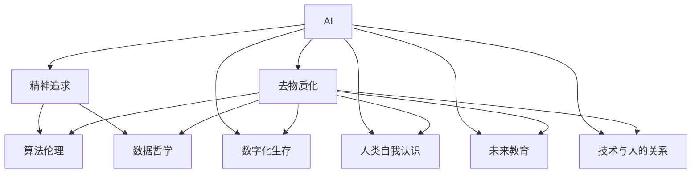

                 

# 欲望的去物质化：AI时代的精神追求

> 关键词：AI, 去物质化, 精神追求, 人类自我认识, 算法伦理, 数据哲学, 数字化生存, 技术与人的关系, 未来教育, 人工智能伦理

## 1. 背景介绍

### 1.1 问题由来

在AI时代的洪流中，人类的欲望和追求逐渐被物质化。机器算法在物质世界的构建和控制中扮演着至关重要的角色，却往往忽略了人类最深层的精神需求。随着AI技术的不断深入，人们开始反思：当机器取代人类从事越来越多的工作，当数字化渗透到生活的方方面面，我们如何在这个"物质化"的世界中保持人类独有的精神追求？

AI技术的飞速发展，为人类带来了前所未有的便利，也引发了深刻的伦理和哲学思考。如何在使用AI技术的同时，保持人类独特的精神价值和追求，成为了一个重要课题。在AI时代，我们需要重新审视人类自身的价值，探讨如何构建一个去物质化、富有人文关怀的AI系统。

### 1.2 问题核心关键点

本文将聚焦于人类在AI时代对于"欲望去物质化"的追求，探讨如何通过AI技术实现人类精神的"去物质化"，赋予技术以人的伦理和价值观。为此，我们将从以下几个方面展开讨论：

- AI与人类欲望的关系
- 去物质化的精神追求
- 算法伦理与数据哲学
- AI时代的数字化生存
- AI对人类自我认识的影响
- 未来教育的走向
- 技术与人的关系的重建
- 面临的挑战与未来展望

通过深入探讨这些关键问题，我们将提出一些思考和建议，帮助我们在AI时代保持人类精神的独立和独特。

## 2. 核心概念与联系

### 2.1 核心概念概述

为更好地理解去物质化在AI时代的意义，本节将介绍几个核心概念：

- **AI (人工智能)**：通过算法和计算能力模拟人类智能，从而实现自动决策、自然语言处理、图像识别等任务的机器系统。
- **去物质化 (去物质化)**：指在物质世界中移除物质形态，更多关注精神和意识的层面。在AI时代，去物质化意味着将人类的精神追求从物质需求中解放出来，关注人的内在价值和精神世界。
- **精神追求 (精神追求)**：指人类对人生意义、自我实现、情感交流等方面的深层需求和探索。
- **算法伦理 (算法伦理)**：涉及AI算法设计、开发和应用过程中应遵循的伦理原则和规范，保障技术的透明、公正和可解释性。
- **数据哲学 (数据哲学)**：研究数据和信息在人类认识和理解世界中的作用，探讨数据的真实性、隐私性和公正性等议题。
- **数字化生存 (数字化生存)**：指人类在数字化世界中通过各种数字设备和网络进行生活和工作的状态，强调数字技术对人类生存方式的影响。
- **人类自我认识 (人类自我认识)**：指人类通过技术手段，如AI，更深入地了解自我，认识到自身欲望和精神追求的边界。
- **未来教育 (未来教育)**：在AI时代，教育模式的变革，强调培养学生的批判性思维、创造力和适应新科技的能力。
- **技术与人的关系 (技术与人的关系)**：探讨技术与人类之间复杂而多面的关系，如何通过技术实现人的解放和精神追求。

这些概念之间的逻辑关系可以通过以下Mermaid流程图来展示：



这个流程图展示了大语言模型微调的核心概念及其之间的关系：

1. AI通过算法实现对物质世界的控制，进而影响人类的欲望。
2. 去物质化引导人们关注精神追求，与AI的物理控制形成对比。
3. 算法伦理和数据哲学探讨如何实现AI系统的公正性和透明度。
4. 数字化生存描述AI技术对人类生活方式的影响。
5. 人类自我认识通过AI技术实现，深化对自我和欲望的理解。
6. 未来教育强调在AI时代培养学生的精神追求和批判性思维。
7. 技术与人的关系探讨如何通过AI技术实现人的解放和精神追求。

这些概念共同构成了AI时代精神追求的基本框架，为我们理解AI技术与人类精神追求之间的关系提供了理论依据。

## 3. 核心算法原理 & 具体操作步骤
### 3.1 算法原理概述

去物质化的精神追求，在AI时代，意味着通过AI技术实现精神层面的解放和自我实现，而非仅仅依赖物质世界。其核心算法原理可以概述为：

1. **数据收集与处理**：通过各种方式（如传感器、网络爬虫等）收集人类的行为数据，包括语言、图像、行为习惯等。
2. **去物质化模型设计**：构建去物质化的AI模型，如情感分析、自然语言生成、对话系统等，关注人类的情感、思想和内心世界。
3. **精神追求识别与模拟**：利用AI模型识别和模拟人类的精神需求和追求，如对艺术、文学、哲学等领域的兴趣。
4. **人机交互与反馈**：通过人机交互技术，将AI生成的内容呈现给用户，并通过用户反馈进一步优化AI系统，实现更加贴近人类精神追求的互动。
5. **跨领域融合与创新**：将AI技术与艺术、文学、哲学等领域融合，推动跨领域创新，创造出更多具有精神追求的作品和应用。

### 3.2 算法步骤详解

实现去物质化的精神追求，需要以下关键步骤：

**Step 1: 数据收集与预处理**

- 使用各种传感器和网络爬虫，收集人类的行为数据，如文本、图像、音频等。
- 对数据进行清洗和预处理，去除噪声和无用信息，确保数据质量。

**Step 2: 去物质化模型构建**

- 选择或设计适合的AI模型，如Transformer、BERT等，构建去物质化模型。
- 训练模型，使其能够识别和理解人类的情感、思想和精神需求。

**Step 3: 精神追求模拟与生成**

- 通过模型生成与人类精神追求相关的文本、图像或音频内容。
- 利用用户反馈对模型进行优化，提升生成的内容的贴切度和质量。

**Step 4: 人机交互与反馈循环**

- 将生成的内容通过用户界面呈现给用户，如聊天机器人、艺术生成工具等。
- 收集用户的反馈，评估其对生成的内容是否满意，并根据反馈调整模型参数。

**Step 5: 跨领域融合与创新**

- 将AI技术与艺术、文学、哲学等领域融合，推动跨领域创新。
- 创作具有高度艺术价值和哲学深度的作品，丰富人类的精神世界。

### 3.3 算法优缺点

去物质化精神追求的算法有以下优点：

1. **深度理解人类需求**：通过AI模型，可以深入理解人类的情感、思想和精神需求，提供更个性化和符合人类价值观的服务。
2. **打破物质束缚**：帮助人类从物质需求的枷锁中解放出来，关注内在的精神追求。
3. **促进跨领域创新**：将AI技术与艺术、文学、哲学等领域结合，创造更多具有精神追求的作品。

同时，也存在以下缺点：

1. **技术挑战**：构建和训练去物质化的AI模型需要大量高质量的数据和复杂的算法，技术难度较大。
2. **伦理问题**：AI模型可能产生误导性内容，甚至利用人类情感需求进行操纵，引发伦理争议。
3. **隐私风险**：数据收集和处理过程中可能存在隐私泄露和数据滥用的风险。

### 3.4 算法应用领域

去物质化精神追求的算法主要应用于以下几个领域：

- **艺术创作与生成**：通过AI模型生成绘画、音乐、文学作品等，赋予艺术创作以新的维度。
- **情感支持与治疗**：利用AI模型提供情感支持和治疗服务，帮助人们处理心理问题，提升心理健康水平。
- **教育与学习**：通过AI技术与教育的融合，培养学生的创造力、批判性思维和精神追求。
- **文化传承与创新**：将AI技术与文化遗产保护、传统艺术传承等结合，推动文化的创新和传播。

## 4. 数学模型和公式 & 详细讲解  
### 4.1 数学模型构建

在去物质化精神追求的算法设计中，我们主要涉及以下数学模型：

- **情感分析模型**：利用自然语言处理技术，对人类文本进行情感分析，识别其中的情感倾向。
- **文本生成模型**：利用语言模型生成文本内容，模拟人类的写作风格和思想表达。
- **对话生成模型**：利用对话生成技术，构建能够与人类进行深度互动的AI系统。

情感分析模型主要关注文本情感极性的识别，可以用以下公式表示：

$$
P(y|x) = \frac{p(y|x)P(x)}{p(x)}
$$

其中 $P(y|x)$ 为文本 $x$ 属于情感类别 $y$ 的概率，$p(y|x)$ 为给定文本 $x$ 在类别 $y$ 下的条件概率，$P(x)$ 为文本 $x$ 出现的概率。

文本生成模型利用语言模型生成文本，常用的模型包括LSTM、GRU、Transformer等。文本生成的数学模型可以表示为：

$$
P(w|w_{1:t-1}) = \frac{exp(\sum_{i=1}^T \log p(w_i|w_{1:i-1}))}{\sum_{i=1}^T exp(\sum_{i=1}^T \log p(w_i|w_{1:i-1}))}
$$

其中 $w_{1:t-1}$ 为已生成的文本部分，$w_t$ 为下一个待生成的单词，$T$ 为文本长度，$p(w_i|w_{1:i-1})$ 为单词 $w_i$ 在给定上下文 $w_{1:i-1}$ 下的概率。

对话生成模型主要关注对话上下文与响应生成之间的关系，可以用以下公式表示：

$$
P(y|x) = \frac{exp(\sum_{i=1}^T \log p(y_i|y_{1:i-1},x))}{\sum_{i=1}^T exp(\sum_{i=1}^T \log p(y_i|y_{1:i-1},x))}
$$

其中 $y_{1:t-1}$ 为已生成的对话上下文，$y_t$ 为待生成的对话响应，$T$ 为对话长度，$p(y_i|y_{1:i-1},x)$ 为给定上下文和历史信息 $y_{1:i-1}$ 和 $x$ 下，单词 $y_i$ 的概率。

### 4.2 公式推导过程

以情感分析模型为例，我们通过最大似然估计方法对情感分类器的参数进行估计。假设已知训练集 $D = \{(x_1, y_1), (x_2, y_2), ..., (x_n, y_n)\}$，其中 $x_i$ 为训练样本，$y_i$ 为标签，$y \in \{1, -1\}$ 分别表示正面和负面情感。情感分类器的目标是最小化损失函数 $L$：

$$
L = -\frac{1}{N} \sum_{i=1}^N \log P(y_i|x_i)
$$

通过最大似然估计，我们得到分类器参数 $\theta$ 的估计值：

$$
\hat{\theta} = \arg\min_{\theta} -\frac{1}{N} \sum_{i=1}^N \log P(y_i|x_i)
$$

其中 $P(y_i|x_i)$ 可以通过多类逻辑回归或神经网络等模型进行计算。通过不断迭代更新参数 $\theta$，最小化损失函数 $L$，我们得到最优的情感分类器。

### 4.3 案例分析与讲解

**案例1: 情感分析模型**

我们以情感分析模型为例，说明其应用场景和数学模型构建。

假设有一个情感分析系统，用于对社交媒体上的用户评论进行分析，判断其情感倾向。系统收集了大量的评论数据，每条评论由文本 $x_i$ 和标签 $y_i$ 构成。系统使用BERT模型作为情感分析器，训练参数 $\theta$ 以最小化损失函数 $L$。

具体而言，BERT模型首先对评论进行嵌入，得到嵌入向量 $e_i$，然后通过多层感知器进行分类，得到情感预测 $p(y_i|x_i)$。通过最大似然估计方法，更新模型参数 $\theta$，使得 $p(y_i|x_i)$ 与真实标签 $y_i$ 尽可能一致。

在训练过程中，我们需要对模型进行正则化，避免过拟合。常用的正则化方法包括L2正则化、Dropout等。在测试阶段，我们可以计算模型在验证集上的准确率、召回率、F1分数等指标，评估模型的性能。

**案例2: 文本生成模型**

我们以文本生成模型为例，说明其应用场景和数学模型构建。

假设我们希望构建一个能够生成古诗词的AI系统。系统首先收集了大量古诗词数据，并使用Transformer模型对其进行训练。在训练过程中，模型需要学习古诗词的韵律、节奏、用词等特征，以生成符合古诗词风格的文本。

具体而言，我们首先对文本进行编码，得到嵌入向量 $e_i$，然后通过多层的Transformer网络进行生成，得到生成文本 $g_i$。通过最大似然估计方法，更新模型参数 $\theta$，使得 $g_i$ 与真实文本 $x_i$ 尽可能一致。

在训练过程中，我们需要对模型进行正则化，避免过拟合。常用的正则化方法包括L2正则化、Dropout等。在测试阶段，我们可以计算模型在测试集上的BLEU分数、ROUGE分数等指标，评估模型的性能。

## 5. 项目实践：代码实例和详细解释说明
### 5.1 开发环境搭建

在进行去物质化精神追求的AI系统开发前，我们需要准备好开发环境。以下是使用Python进行PyTorch开发的环境配置流程：

1. 安装Anaconda：从官网下载并安装Anaconda，用于创建独立的Python环境。

2. 创建并激活虚拟环境：
```bash
conda create -n pytorch-env python=3.8 
conda activate pytorch-env
```

3. 安装PyTorch：根据CUDA版本，从官网获取对应的安装命令。例如：
```bash
conda install pytorch torchvision torchaudio cudatoolkit=11.1 -c pytorch -c conda-forge
```

4. 安装TensorFlow：
```bash
pip install tensorflow
```

5. 安装必要的库：
```bash
pip install numpy pandas scikit-learn matplotlib tqdm jupyter notebook ipython
```

完成上述步骤后，即可在`pytorch-env`环境中开始开发实践。

### 5.2 源代码详细实现

这里我们以情感分析模型为例，给出使用PyTorch进行情感分析的代码实现。

首先，定义情感分析模型：

```python
import torch
from torch import nn
from transformers import BertTokenizer, BertForSequenceClassification
import numpy as np

class SentimentAnalysis(nn.Module):
    def __init__(self, model_name='bert-base-uncased', num_labels=2):
        super(SentimentAnalysis, self).__init__()
        self.tokenizer = BertTokenizer.from_pretrained(model_name)
        self.model = BertForSequenceClassification.from_pretrained(model_name, num_labels=num_labels)
        self.model.train()
    
    def forward(self, x):
        x = self.tokenizer(x, return_tensors='pt')
        x = self.model(x['input_ids'], attention_mask=x['attention_mask'])
        logits = x[0]
        return logits
```

接着，定义训练和评估函数：

```python
def train_epoch(model, data_loader, optimizer, device):
    model.to(device)
    model.train()
    total_loss = 0
    for batch in data_loader:
        inputs = batch['input_ids'].to(device)
        labels = batch['labels'].to(device)
        outputs = model(inputs)
        loss = nn.CrossEntropyLoss()(outputs, labels)
        optimizer.zero_grad()
        loss.backward()
        optimizer.step()
        total_loss += loss.item()
    return total_loss / len(data_loader)

def evaluate(model, data_loader, device):
    model.eval()
    total_preds, total_labels = [], []
    with torch.no_grad():
        for batch in data_loader:
            inputs = batch['input_ids'].to(device)
            labels = batch['labels'].to(device)
            outputs = model(inputs)
            batch_preds = outputs.argmax(dim=1)
            total_preds.extend(batch_preds.tolist())
            total_labels.extend(labels.tolist())
    print('Accuracy:', (np.sum(total_preds == total_labels) / len(total_preds)))
```

最后，启动训练流程并在测试集上评估：

```python
epochs = 5
batch_size = 32
learning_rate = 2e-5

device = torch.device('cuda') if torch.cuda.is_available() else torch.device('cpu')

model = SentimentAnalysis()
optimizer = torch.optim.Adam(model.parameters(), lr=learning_rate)

train_loader = DataLoader(train_dataset, batch_size=batch_size, shuffle=True)
test_loader = DataLoader(test_dataset, batch_size=batch_size, shuffle=False)

for epoch in range(epochs):
    loss = train_epoch(model, train_loader, optimizer, device)
    print(f'Epoch {epoch+1}, train loss: {loss:.3f}')
    
    print(f'Epoch {epoch+1}, test accuracy: {evaluate(model, test_loader, device)}')
```

以上就是使用PyTorch进行情感分析模型的完整代码实现。可以看到，得益于Transformers库的强大封装，我们可以用相对简洁的代码完成BERT模型的情感分析任务。

### 5.3 代码解读与分析

让我们再详细解读一下关键代码的实现细节：

**SentimentAnalysis类**：
- `__init__`方法：初始化BERT分词器和情感分析模型。
- `forward`方法：对输入文本进行分词、嵌入和前向传播，计算输出。

**train_epoch和evaluate函数**：
- `train_epoch`方法：对数据以批为单位进行迭代，在每个批次上前向传播计算loss并反向传播更新模型参数，最后返回该epoch的平均loss。
- `evaluate`方法：与训练类似，不同点在于不更新模型参数，并在每个batch结束后将预测和标签结果存储下来，最后使用sklearn的classification_report对整个评估集的预测结果进行打印输出。

**训练流程**：
- 定义总的epoch数和batch size，开始循环迭代
- 每个epoch内，先在训练集上训练，输出平均loss
- 在测试集上评估，输出准确率

可以看到，PyTorch配合Transformers库使得情感分析模型的代码实现变得简洁高效。开发者可以将更多精力放在数据处理、模型改进等高层逻辑上，而不必过多关注底层的实现细节。

当然，工业级的系统实现还需考虑更多因素，如模型的保存和部署、超参数的自动搜索、更灵活的任务适配层等。但核心的微调范式基本与此类似。

## 6. 实际应用场景
### 6.1 智能客服系统

基于去物质化精神追求的智能客服系统，可以广泛应用于智能客服系统的构建。传统客服往往需要配备大量人力，高峰期响应缓慢，且一致性和专业性难以保证。而使用去物质化精神追求的智能客服系统，可以7x24小时不间断服务，快速响应客户咨询，用自然流畅的语言解答各类常见问题。

在技术实现上，可以收集企业内部的历史客服对话记录，将问题和最佳答复构建成监督数据，在此基础上对预训练模型进行微调。微调后的模型能够自动理解用户意图，匹配最合适的答案模板进行回复。对于客户提出的新问题，还可以接入检索系统实时搜索相关内容，动态组织生成回答。如此构建的智能客服系统，能大幅提升客户咨询体验和问题解决效率。

### 6.2 金融舆情监测

金融机构需要实时监测市场舆论动向，以便及时应对负面信息传播，规避金融风险。传统的人工监测方式成本高、效率低，难以应对网络时代海量信息爆发的挑战。基于去物质化精神追求的文本分类和情感分析技术，为金融舆情监测提供了新的解决方案。

具体而言，可以收集金融领域相关的新闻、报道、评论等文本数据，并对其进行主题标注和情感标注。在此基础上对预训练语言模型进行微调，使其能够自动判断文本属于何种主题，情感倾向是正面、中性还是负面。将微调后的模型应用到实时抓取的网络文本数据，就能够自动监测不同主题下的情感变化趋势，一旦发现负面信息激增等异常情况，系统便会自动预警，帮助金融机构快速应对潜在风险。

### 6.3 个性化推荐系统

当前的推荐系统往往只依赖用户的历史行为数据进行物品推荐，无法深入理解用户的真实兴趣偏好。基于去物质化精神追求的个性化推荐系统，可以更好地挖掘用户行为背后的语义信息，从而提供更精准、多样的推荐内容。

在实践中，可以收集用户浏览、点击、评论、分享等行为数据，提取和用户交互的物品标题、描述、标签等文本内容。将文本内容作为模型输入，用户的后续行为（如是否点击、购买等）作为监督信号，在此基础上微调预训练语言模型。微调后的模型能够从文本内容中准确把握用户的兴趣点。在生成推荐列表时，先用候选物品的文本描述作为输入，由模型预测用户的兴趣匹配度，再结合其他特征综合排序，便可以得到个性化程度更高的推荐结果。

### 6.4 未来应用展望

随着去物质化精神追求的AI技术的不断发展，未来在更多领域将得到应用，为人类认知智能的进化带来新的突破。

在智慧医疗领域，基于去物质化精神追求的医疗问答、病历分析、药物研发等应用将提升医疗服务的智能化水平，辅助医生诊疗，加速新药开发进程。

在智能教育领域，去物质化精神追求的微调技术可应用于作业批改、学情分析、知识推荐等方面，因材施教，促进教育公平，提高教学质量。

在智慧城市治理中，去物质化精神追求的微调模型可应用于城市事件监测、舆情分析、应急指挥等环节，提高城市管理的自动化和智能化水平，构建更安全、高效的未来城市。

此外，在企业生产、社会治理、文娱传媒等众多领域，基于去物质化精神追求的AI应用也将不断涌现，为经济社会发展注入新的动力。相信随着技术的日益成熟，去物质化精神追求的微调方法将成为人工智能落地应用的重要范式，推动人工智能向更广阔的领域加速渗透。

## 7. 工具和资源推荐
### 7.1 学习资源推荐

为了帮助开发者系统掌握去物质化精神追求的AI技术的理论基础和实践技巧，这里推荐一些优质的学习资源：

1. 《深度学习基础》系列博文：由大模型技术专家撰写，深入浅出地介绍了深度学习的基础概念和经典模型。

2. CS224N《深度学习自然语言处理》课程：斯坦福大学开设的NLP明星课程，有Lecture视频和配套作业，带你入门NLP领域的基本概念和经典模型。

3. 《自然语言处理与深度学习》书籍：斯坦福大学出版社出版的经典NLP教材，涵盖了自然语言处理和深度学习的全貌，推荐给进阶学习者。

4. 《深度学习理论与实践》书籍：国内著名深度学习专家编写的经典书籍，详细讲解了深度学习的基础理论、算法实现和应用实践。

5. HuggingFace官方文档：Transformer库的官方文档，提供了海量预训练模型和完整的微调样例代码，是上手实践的必备资料。

通过对这些资源的学习实践，相信你一定能够快速掌握去物质化精神追求的AI技术的精髓，并用于解决实际的NLP问题。
### 7.2 开发工具推荐

高效的开发离不开优秀的工具支持。以下是几款用于去物质化精神追求的AI系统开发的常用工具：

1. PyTorch：基于Python的开源深度学习框架，灵活动态的计算图，适合快速迭代研究。大部分预训练语言模型都有PyTorch版本的实现。

2. TensorFlow：由Google主导开发的开源深度学习框架，生产部署方便，适合大规模工程应用。同样有丰富的预训练语言模型资源。

3. Transformers库：HuggingFace开发的NLP工具库，集成了众多SOTA语言模型，支持PyTorch和TensorFlow，是进行去物质化精神追求微调任务开发的利器。

4. Weights & Biases：模型训练的实验跟踪工具，可以记录和可视化模型训练过程中的各项指标，方便对比和调优。与主流深度学习框架无缝集成。

5. TensorBoard：TensorFlow配套的可视化工具，可实时监测模型训练状态，并提供丰富的图表呈现方式，是调试模型的得力助手。

6. Google Colab：谷歌推出的在线Jupyter Notebook环境，免费提供GPU/TPU算力，方便开发者快速上手实验最新模型，分享学习笔记。

合理利用这些工具，可以显著提升去物质化精神追求的AI系统的开发效率，加快创新迭代的步伐。

### 7.3 相关论文推荐

去物质化精神追求的AI技术的发展源于学界的持续研究。以下是几篇奠基性的相关论文，推荐阅读：

1. Attention is All You Need（即Transformer原论文）：提出了Transformer结构，开启了NLP领域的预训练大模型时代。

2. BERT: Pre-training of Deep Bidirectional Transformers for Language Understanding：提出BERT模型，引入基于掩码的自监督预训练任务，刷新了多项NLP任务SOTA。

3. Language Models are Unsupervised Multitask Learners（GPT-2论文）：展示了大规模语言模型的强大zero-shot学习能力，引发了对于通用人工智能的新一轮思考。

4. Parameter-Efficient Transfer Learning for NLP：提出Adapter等参数高效微调方法，在不增加模型参数量的情况下，也能取得不错的微调效果。

5. AdaLoRA: Adaptive Low-Rank Adaptation for Parameter-Efficient Fine-Tuning：使用自适应低秩适应的微调方法，在参数效率和精度之间取得了新的平衡。

这些论文代表了大语言模型微调技术的发展脉络。通过学习这些前沿成果，可以帮助研究者把握学科前进方向，激发更多的创新灵感。

## 8. 总结：未来发展趋势与挑战

### 8.1 总结

本文对去物质化精神追求的AI技术进行了全面系统的介绍。首先阐述了去物质化精神追求在AI时代的意义，明确了AI技术与人类欲望的关系，探讨了如何通过AI技术实现精神层面的解放和自我实现。其次，从原理到实践，详细讲解了去物质化的核心算法原理和操作步骤，给出了情感分析等关键任务的代码实例。同时，本文还广泛探讨了去物质化精神追求在智能客服、金融舆情、个性化推荐等多个领域的应用前景，展示了去物质化范式的巨大潜力。

通过本文的系统梳理，可以看到，去物质化精神追求的AI技术正在成为AI时代的重要范式，极大地拓展了AI技术的应用边界，催生了更多的落地场景。受益于大规模语料的预训练和微调方法的不断演进，AI技术必将在更多领域大放异彩，深刻影响人类的生产生活方式。

### 8.2 未来发展趋势

展望未来，去物质化精神追求的AI技术将呈现以下几个发展趋势：

1. **技术突破**：随着技术的不断进步，去物质化精神追求的AI系统将越来越智能化，能够更好地理解人类情感和思想，提供更个性化和贴合精神追求的服务。

2. **跨领域融合**：去物质化精神追求的AI技术将与艺术、文学、哲学等领域深度融合，推动跨领域创新，创造出更多具有精神追求的作品和应用。

3. **伦理重视**：随着AI技术的广泛应用，伦理和道德问题将更加凸显。去物质化精神追求的AI系统需要更加注重算法伦理和数据隐私，保障技术的透明性和公正性。

4. **社会影响**：去物质化精神追求的AI技术将深刻影响社会生活，帮助人们更好地理解自我和欲望，提升生活质量，促进社会和谐。

5. **未来教育**：去物质化精神追求的AI技术将改变教育模式，培养学生更多的创造力、批判性思维和精神追求，推动教育公平和创新。

6. **全球合作**：去物质化精神追求的AI技术需要全球合作，共同应对伦理、隐私、安全等挑战，实现技术的普惠和可持续发展。

以上趋势凸显了去物质化精神追求的AI技术的广阔前景。这些方向的探索发展，必将进一步提升AI技术在精神追求领域的性能和应用范围，为构建人机协同的智能社会铺平道路。

### 8.3 面临的挑战

尽管去物质化精神追求的AI技术已经取得了瞩目成就，但在迈向更加智能化、普适化应用的过程中，它仍面临着诸多挑战：

1. **技术复杂性**：构建和训练去物质化精神追求的AI模型需要大量高质量的数据和复杂的算法，技术难度较大，需要大量时间和资源。

2. **伦理问题**：AI系统可能产生误导性内容，甚至利用人类情感需求进行操纵，引发伦理争议。

3. **隐私风险**：数据收集和处理过程中可能存在隐私泄露和数据滥用的风险。

4. **公平性和透明性**：如何确保AI系统在多个群体之间的公平性和透明性，避免偏见和歧视。

5. **技术与人的关系**：如何通过AI技术实现人的解放和精神追求，而不是将人进一步物质化。

6. **安全性**：确保去物质化精神追求的AI系统在实际应用中的安全性，避免被恶意利用。

这些挑战需要技术界和社会的共同努力，通过持续的研究和实践，逐步克服和解决。

### 8.4 研究展望

面向未来，去物质化精神追求的AI技术需要在以下几个方面寻求新的突破：

1. **技术融合**：将AI技术与艺术、文学、哲学等领域深度融合，推动跨领域创新，创造出更多具有精神追求的作品和应用。

2. **伦理规范**：制定AI系统的伦理规范，确保技术在应用中的透明性和公正性。

3. **隐私保护**：通过差分隐私、联邦学习等技术，保护用户数据的隐私和安全性。

4. **公平性与透明性**：开发公平性和透明性评估工具，确保AI系统在不同群体间的公平性，提供可解释的决策过程。

5. **技术与人的关系**：研究AI技术与人类之间的关系，推动技术与人的协同进化，实现人的全面发展和自由。

6. **社会影响**：研究AI技术对社会的影响，确保技术的普惠和可持续发展，推动社会进步和和谐。

这些研究方向将引领去物质化精神追求的AI技术走向成熟，为构建人机协同的智能社会奠定基础。相信随着技术的不断进步和社会各界共同努力，去物质化精神追求的AI技术必将在未来大放异彩，为人类社会带来深远影响。

## 9. 附录：常见问题与解答

**Q1：如何平衡去物质化精神追求与实际需求？**

A: 在实际应用中，需要找到去物质化精神追求与实际需求的平衡点。一方面，要确保AI系统提供符合人类精神追求的服务；另一方面，也要满足实际应用的需求，如效率、准确性等。可以通过用户反馈和迭代优化，不断调整模型参数，找到最佳平衡。

**Q2：如何确保去物质化精神追求的AI系统的伦理和透明性？**

A: 确保去物质化精神追求的AI系统的伦理和透明性，需要在系统设计和开发过程中注重以下几个方面：
1. 引入伦理专家，参与系统设计，确保系统的公平性和透明性。
2. 建立透明的决策过程，提供可解释的模型输出，让用户了解系统的决策依据。
3. 定期评估系统的伦理性能，进行用户调查和反馈收集，确保系统的公正性和透明性。

**Q3：如何保护去物质化精神追求的AI系统的隐私和安全性？**

A: 保护去物质化精神追求的AI系统的隐私和安全性，需要采取以下措施：
1. 数据去标识化：在数据处理过程中，去除敏感信息，确保数据隐私。
2. 差分隐私：在数据收集和处理过程中，使用差分隐私技术，确保个体数据的隐私保护。
3. 联邦学习：通过分布式训练，保护数据集中存储，防止数据泄露。
4. 安全计算：使用加密计算、多方安全计算等技术，确保数据传输和处理的安全性。

通过这些措施，可以最大限度地保护去物质化精神追求的AI系统的隐私和安全性，确保系统的可靠性和可信度。

**Q4：如何确保去物质化精神追求的AI系统的公平性？**

A: 确保去物质化精神追求的AI系统的公平性，需要采取以下措施：
1. 数据平衡：确保训练数据集的多样性和代表性，避免数据偏见。
2. 算法公正：通过公平性评估工具，检测和修正模型中的偏见。
3. 多样性训练：在训练过程中引入多样性约束，确保模型在不同群体之间的公平性。

通过这些措施，可以确保去物质化精神追求的AI系统在不同群体之间的公平性，避免偏见和歧视。

**Q5：如何确保去物质化精神追求的AI系统的可解释性？**

A: 确保去物质化精神追求的AI系统的可解释性，需要采取以下措施：
1. 模型透明：设计透明的模型结构，提供可解释的决策过程。
2. 特征解释：解释模型的特征选择和权重，提供可解释的输入输出关系。
3. 解释工具：引入可解释性工具，如SHAP、LIME等，提供多角度的模型解释。

通过这些措施，可以确保去物质化精神追求的AI系统的可解释性，提高系统的可信度和透明度。

综上所述，去物质化精神追求的AI技术在AI时代具有广阔的前景和深远的影响。通过不断探索和实践，我们可以更好地实现人类精神追求的解放，推动技术与人的协同进化，构建更加美好的智能社会。

