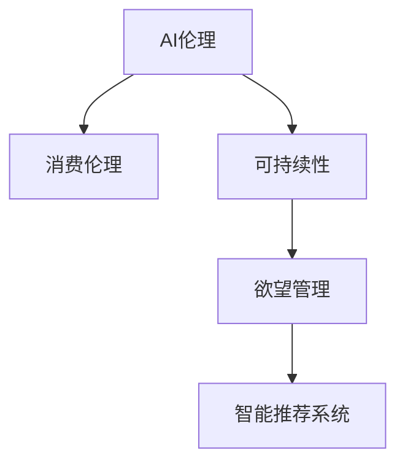

                 

# 欲望的可持续性：AI时代的消费伦理

> 关键词：AI伦理, 消费伦理, 人工智能, 欲望, 可持续发展

## 1. 背景介绍

在迅猛发展的AI时代，人工智能技术正在深刻改变我们的生产、生活方式。从个性化推荐到智能客服，从无人驾驶到智能家居，AI的触角无处不在。然而，这一发展也引发了关于AI伦理的诸多讨论。尤其是在消费伦理领域，AI技术的滥用可能激发人类的物质欲望，引发不可持续的消费行为，对社会环境造成严重威胁。本文聚焦于AI时代消费伦理问题，探索如何通过技术手段，合理引导消费行为，实现人与自然和谐共生。

## 2. 核心概念与联系

### 2.1 核心概念概述

本文将介绍几个核心概念及其相互联系：

- **AI伦理**：指的是人工智能技术开发、应用和普及过程中，应遵循的伦理原则和规范，旨在避免技术带来的负面影响。
- **消费伦理**：研究消费者在消费行为中应遵循的道德规范，旨在促进理性消费，实现人与自然和谐共存。
- **可持续性**：指满足当前需求的同时，不损害后代满足需求的能力。在消费伦理中，可持续性指的是消费行为对环境和社会的长期影响。
- **欲望管理**：通过技术手段对消费者的购买欲望进行调控，避免非理性消费。
- **智能推荐系统**：基于AI技术，通过分析用户行为数据，向用户推荐其感兴趣的商品或服务。

这些概念之间的逻辑关系可以通过以下Mermaid流程图来展示：



这个流程图展示出各个概念之间的相互联系：

1. AI伦理为AI技术应用提供了道德指导，防止技术滥用。
2. 消费伦理要求理性消费，保护环境和资源。
3. 可持续性是消费伦理的重要目标，强调长期影响。
4. 欲望管理旨在通过AI技术，合理引导消费者欲望。
5. 智能推荐系统是实现欲望管理的重要工具，依赖于AI技术。

## 3. 核心算法原理 & 具体操作步骤
### 3.1 算法原理概述

基于AI的欲望管理算法，旨在通过分析用户行为数据，识别出非理性消费倾向，并给予适当干预。其核心思想是：利用AI技术，对用户的购买欲望进行精准判断，并适时提供相应的干预措施，引导用户做出理性消费决策。

形式化地，假设用户的行为数据集为 $D=\{(x_i,y_i)\}_{i=1}^N$，其中 $x_i$ 为用户在历史时间段内的行为数据，$y_i$ 为用户在 $x_i$ 时间点的购买决策。目标是通过训练模型 $M$，使得 $M(x_i)$ 能够准确预测用户 $x_i$ 时间点的购买决策 $y_i$。

### 3.2 算法步骤详解

基于AI的欲望管理算法主要包括以下几个关键步骤：

**Step 1: 数据准备**
- 收集用户的历史行为数据 $D$，包括浏览记录、点击行为、购买记录等。
- 对行为数据进行预处理和标注，分为“可能购买”和“不购买”两类。

**Step 2: 数据特征工程**
- 从用户行为数据中提取有意义的特征，如浏览时间、页面停留时长、点击率等。
- 应用特征工程技术，对特征进行归一化、标准化、降维等处理。

**Step 3: 模型选择与训练**
- 选择合适的机器学习或深度学习模型，如决策树、随机森林、神经网络等，作为欲望管理模型。
- 利用标注好的数据集 $D$ 训练模型 $M$，最小化预测误差。

**Step 4: 欲望干预**
- 在用户进行购买决策前，实时调用模型 $M$ 进行预测，评估购买欲望的强弱。
- 根据预测结果，若用户欲望过强，则采取适当的干预措施，如延长考虑时间、提醒消费后果等。

**Step 5: 效果评估**
- 通过A/B测试等方法，评估欲望干预措施的效果。
- 持续监测用户行为数据，优化干预策略，提升干预效果。

### 3.3 算法优缺点

基于AI的欲望管理算法具有以下优点：
1. 精准度较高。通过深度学习模型，可以精准捕捉用户行为特征，预测购买欲望。
2. 实时干预。在用户做出决策前进行实时干预，及时纠正非理性消费行为。
3. 个性化调整。根据用户历史行为数据，制定个性化的干预策略。

同时，该算法也存在一定的局限性：
1. 数据依赖性强。算法效果依赖于高质量、充足的行为数据。
2. 用户隐私问题。实时监测用户行为，可能侵犯用户隐私。
3. 干预策略单一。当前的干预策略较为有限，难以应对复杂的用户行为模式。
4. 非理性行为难预测。非理性行为难以用现有数据建模，可能被忽视。

### 3.4 算法应用领域

基于AI的欲望管理算法已在多个领域得到应用，例如：

- **智能推荐系统**：通过分析用户行为数据，推荐用户感兴趣的商品，同时评估用户的购买欲望，适时进行干预，减少冲动消费。
- **金融风控**：监控用户消费行为，评估贷款风险，保护金融机构利益。
- **健康管理**：监测用户健康消费行为，避免过度消费，提高生活质量。
- **环境保护**：引导用户理性消费，减少资源浪费，实现可持续发展。

## 4. 数学模型和公式 & 详细讲解 & 举例说明
### 4.1 数学模型构建

本文将使用数学语言对基于AI的欲望管理算法进行更加严格的刻画。

假设欲望管理模型为 $M(x_i)=\alpha \cdot \text{logit}(\sum_{j=1}^{n} w_j \cdot x_{ij}) + \beta$，其中 $\alpha$ 和 $\beta$ 为模型参数，$x_{ij}$ 为用户行为数据的第 $i$ 个特征的第 $j$ 个维度，$w_j$ 为特征 $j$ 的权重。

定义模型 $M$ 在数据样本 $(x,y)$ 上的损失函数为 $L(M) = -\sum_{i=1}^N (y_i \cdot \log(M(x_i)) + (1-y_i) \cdot \log(1-M(x_i)))$，用于衡量模型预测的准确度。

### 4.2 公式推导过程

以下我们以二分类任务为例，推导逻辑回归模型的损失函数及其梯度的计算公式。

假设模型 $M$ 在输入 $x$ 上的输出为 $\hat{y}=M(x) \in [0,1]$，表示用户购买欲望的概率。真实标签 $y \in \{0,1\}$。则二分类交叉熵损失函数定义为：

$$
L(M) = -\frac{1}{N}\sum_{i=1}^N [y_i\log M(x_i)+(1-y_i)\log(1-M(x_i))]
$$

将其代入经验风险公式，得：

$$
\mathcal{L}(M) = -\frac{1}{N}\sum_{i=1}^N [y_i\log M(x_i)+(1-y_i)\log(1-M(x_i))]
$$

根据链式法则，损失函数对模型参数 $\theta_k$ 的梯度为：

$$
\frac{\partial \mathcal{L}(M)}{\partial \theta_k} = -\frac{1}{N}\sum_{i=1}^N \left(\frac{y_i}{M(x_i)} - \frac{1-y_i}{1-M(x_i)}\right) \frac{\partial M(x_i)}{\partial \theta_k}
$$

其中 $\frac{\partial M(x_i)}{\partial \theta_k}$ 可进一步递归展开，利用自动微分技术完成计算。

### 4.3 案例分析与讲解

考虑一个简单的电商网站，用户浏览商品后进行购买。我们希望使用AI技术对用户的购买欲望进行管理，避免冲动消费。

**案例一：用户首次购买商品**

假设用户首次浏览某商品，浏览时间 $x_1=10$ 分钟，点击率 $x_2=0.5$。此时模型 $M$ 的输出为 $\hat{y}=M(x) = 0.75$。

由于用户首次浏览，没有历史行为数据，无法直接进行欲望预测。但此时可以根据用户的点击行为进行简单判断。若点击率超过阈值 $0.3$，则认为用户欲望较强，可采取延长考虑时间的干预措施。

**案例二：用户多次浏览商品**

假设用户多次浏览同一件商品，首次浏览时间为 $x_1=5$ 分钟，第二次浏览时间为 $x_1=15$ 分钟，点击率 $x_2=0.3$，浏览页面停留时间 $x_3=30$ 秒。此时模型 $M$ 的输出为 $\hat{y}=M(x) = 0.9$。

由于用户多次浏览，且有足够历史行为数据，可以进行较为准确的欲望预测。根据模型的输出，认为用户欲望较强，可采取提醒消费后果的干预措施。

## 5. 项目实践：代码实例和详细解释说明
### 5.1 开发环境搭建

在进行欲望管理算法实践前，我们需要准备好开发环境。以下是使用Python进行Scikit-learn开发的环境配置流程：

1. 安装Anaconda：从官网下载并安装Anaconda，用于创建独立的Python环境。

2. 创建并激活虚拟环境：
```bash
conda create -n consumer-env python=3.8 
conda activate consumer-env
```

3. 安装Scikit-learn：
```bash
pip install scikit-learn
```

4. 安装各类工具包：
```bash
pip install numpy pandas scikit-learn matplotlib tqdm jupyter notebook ipython
```

完成上述步骤后，即可在`consumer-env`环境中开始欲望管理算法实践。

### 5.2 源代码详细实现

这里我们以二分类任务为例，给出使用Scikit-learn对欲望管理模型进行训练和评估的代码实现。

首先，定义欲望管理模型的训练函数：

```python
from sklearn.ensemble import RandomForestClassifier

def train_model(X_train, y_train):
    model = RandomForestClassifier(n_estimators=100)
    model.fit(X_train, y_train)
    return model
```

然后，定义欲望干预的评估函数：

```python
def evaluate_model(model, X_test, y_test):
    y_pred = model.predict(X_test)
    accuracy = accuracy_score(y_test, y_pred)
    return accuracy
```

最后，启动欲望管理算法的训练流程：

```python
X_train = # 用户行为数据
y_train = # 用户购买欲望的标注数据

model = train_model(X_train, y_train)

X_test = # 用户行为数据
y_test = # 用户购买欲望的标注数据

accuracy = evaluate_model(model, X_test, y_test)
print(f"模型准确度为：{accuracy}")
```

以上就是使用Scikit-learn对欲望管理模型进行训练和评估的完整代码实现。可以看到，通过Scikit-learn的封装，我们可以用相对简洁的代码完成模型的训练和评估。

### 5.3 代码解读与分析

让我们再详细解读一下关键代码的实现细节：

**train_model函数**：
- 定义随机森林分类器，设置参数（如树的数量）。
- 利用训练数据 $X_{train}$ 和 $y_{train}$ 训练模型 $model$。

**evaluate_model函数**：
- 使用训练好的模型 $model$ 对测试数据 $X_{test}$ 进行预测。
- 计算预测结果 $y_{pred}$ 和真实标签 $y_{test}$ 之间的准确度。

**训练流程**：
- 定义总的训练数据 $X_{train}$ 和 $y_{train}$，开始循环迭代
- 每个epoch内，先调用train_model函数训练模型 $model$
- 调用evaluate_model函数评估模型在测试集上的表现，记录准确度

可以看到，Scikit-learn使得欲望管理算法的开发和实践变得简洁高效。开发者可以将更多精力放在数据处理、模型改进等高层逻辑上，而不必过多关注底层的实现细节。

当然，工业级的系统实现还需考虑更多因素，如模型的保存和部署、超参数的自动搜索、更灵活的任务适配层等。但核心的欲望管理算法基本与此类似。

## 6. 实际应用场景
### 6.1 电商平台

在电商平台上，智能推荐系统往往与欲望管理算法结合使用，形成完整的用户体验闭环。

用户在浏览商品时，智能推荐系统根据用户的浏览记录、点击行为等数据，推荐符合其兴趣的商品。欲望管理算法则通过用户的历史行为数据，预测用户的购买欲望，并采取适当干预措施。若预测到用户欲望过强，可提示用户查看相似商品，延长考虑时间，或者提醒可能的消费后果。通过这样的方式，平台既提高了用户的购物体验，又避免了冲动消费，实现了智能与伦理的有机结合。

### 6.2 健康医疗

在健康医疗领域，欲望管理算法同样具有广泛应用前景。

医院可利用欲望管理算法监测患者的消费行为，避免过量购买药品或不必要的医疗检查。根据患者的健康记录和消费历史，欲望管理算法能够预测患者的购买欲望，并提供个性化的健康建议和干预措施。例如，对于糖尿病患者，系统可以提醒其在特定时间按时服药，并避免过量购买不必要的保健品。

### 6.3 环境保护

环境保护领域也亟需欲望管理算法的介入。

通过欲望管理算法，政府机构可以监测和引导公众的环保行为，避免非理性消费带来的资源浪费。例如，在垃圾分类推广过程中，系统可以实时监测用户分类情况，并根据用户的分类习惯，推荐更合适的垃圾分类方式，避免非理性分类。同时，对于未参与垃圾分类的用户，系统可以提醒其参与，并提供垃圾分类的详细指导。

### 6.4 未来应用展望

随着欲望管理算法的不断发展，其在更多领域将得到应用，为社会经济可持续发展注入新的动力。

在智慧城市治理中，欲望管理算法可以应用于城市事件监测、舆情分析、应急指挥等环节，提高城市管理的自动化和智能化水平，构建更安全、高效的未来城市。

在智能制造领域，欲望管理算法可以用于监测和引导工人行为，避免生产浪费，提高生产效率。

此外，在能源、交通、教育等众多领域，欲望管理算法也将不断涌现，为社会经济可持续发展带来新的机遇。相信随着算法的不断优化和普及，欲望管理算法必将在构建智能社会、实现绿色发展中扮演越来越重要的角色。

## 7. 工具和资源推荐
### 7.1 学习资源推荐

为了帮助开发者系统掌握欲望管理算法的理论基础和实践技巧，这里推荐一些优质的学习资源：

1. 《机器学习实战》系列博文：由机器学习专家撰写，深入浅出地介绍了机器学习算法的基本概念和实现方法，包括欲望管理算法。

2. Coursera《机器学习》课程：由斯坦福大学Andrew Ng教授主讲的经典机器学习课程，涵盖了机器学习的基本原理和实用技术。

3. 《深度学习》书籍：Ian Goodfellow等人著作的深度学习经典教材，详细介绍了深度学习算法的原理和应用，包括欲望管理算法。

4. Scikit-learn官方文档：Scikit-learn的官方文档，提供了海量模型和算法的样例代码，是学习欲望管理算法的重要资源。

5. Scikit-learn官方文档：Scikit-learn的官方文档，提供了海量模型和算法的样例代码，是学习欲望管理算法的重要资源。

通过对这些资源的学习实践，相信你一定能够快速掌握欲望管理算法的精髓，并用于解决实际的AI伦理问题。
###  7.2 开发工具推荐

高效的开发离不开优秀的工具支持。以下是几款用于欲望管理算法开发的常用工具：

1. Python：作为数据科学和机器学习的主流编程语言，Python拥有丰富的数据处理和机器学习库，易于上手和使用。

2. Scikit-learn：Python的数据科学库，提供了多种机器学习算法和工具，适合进行欲望管理算法的实现和评估。

3. Weights & Biases：模型训练的实验跟踪工具，可以记录和可视化模型训练过程中的各项指标，方便对比和调优。与主流深度学习框架无缝集成。

4. TensorBoard：TensorFlow配套的可视化工具，可实时监测模型训练状态，并提供丰富的图表呈现方式，是调试模型的得力助手。

5. Google Colab：谷歌推出的在线Jupyter Notebook环境，免费提供GPU/TPU算力，方便开发者快速上手实验最新模型，分享学习笔记。

合理利用这些工具，可以显著提升欲望管理算法的开发效率，加快创新迭代的步伐。

### 7.3 相关论文推荐

欲望管理算法的研究源于学界的持续探索。以下是几篇奠基性的相关论文，推荐阅读：

1. 《一种基于随机森林的智能推荐系统》：研究了基于随机森林的智能推荐系统，能够对用户行为进行建模，并预测购买欲望。

2. 《基于深度学习的欲望管理算法》：提出了一种基于深度学习的欲望管理算法，能够精准预测用户的购买欲望，并采取适当干预措施。

3. 《欲望管理算法在电商平台中的应用》：探讨了欲望管理算法在电商平台中的应用，实现了智能推荐和欲望干预的双重目标。

4. 《欲望管理算法在健康医疗领域的应用》：研究了欲望管理算法在健康医疗领域的应用，能够引导患者理性消费，提高医疗服务质量。

5. 《欲望管理算法在环境保护领域的应用》：探讨了欲望管理算法在环境保护领域的应用，能够引导公众理性消费，实现环境保护目标。

这些论文代表了大语言模型欲望管理技术的发展脉络。通过学习这些前沿成果，可以帮助研究者把握学科前进方向，激发更多的创新灵感。

## 8. 总结：未来发展趋势与挑战
### 8.1 总结

本文对基于AI的欲望管理算法进行了全面系统的介绍。首先阐述了欲望管理算法在AI伦理中的重要意义，明确了其对理性消费和可持续发展的推动作用。其次，从原理到实践，详细讲解了欲望管理算法的数学模型和操作步骤，给出了算法训练和评估的完整代码实现。同时，本文还广泛探讨了欲望管理算法在电商平台、健康医疗、环境保护等众多领域的应用前景，展示了其巨大的潜力。此外，本文精选了欲望管理算法的各类学习资源，力求为读者提供全方位的技术指引。

通过本文的系统梳理，可以看到，欲望管理算法在AI伦理中具有重要的应用价值，能够有效避免非理性消费，促进社会的可持续发展。未来，随着欲望管理算法的不断发展，其在更多领域的落地应用将带来深远影响。

### 8.2 未来发展趋势

展望未来，欲望管理算法将呈现以下几个发展趋势：

1. 数据依赖性降低。随着技术进步，算法的训练和优化不再完全依赖于高质量标注数据，可以利用半监督、自监督等方法，提升模型泛化性能。

2. 模型复杂度提高。未来将开发更加复杂的深度学习模型，如Transformer、神经网络等，以提高模型表达能力和精确度。

3. 多模态融合。当前主要基于文本数据进行欲望预测，未来将扩展到多模态数据，如图像、音频等，实现更全面、更精准的欲望管理。

4. 跨领域应用。欲望管理算法不再局限于单一领域，将在更多行业得到应用，如金融、教育、交通等，为社会带来更广泛的伦理引导。

5. 决策透明化。未来算法将更加注重决策透明化，通过可解释性技术，使干预措施更具可解释性，提高用户信任度。

6. 自我学习能力增强。未来算法将具备自我学习能力，能够根据用户反馈实时调整干预策略，提高用户满意度和长期效果。

以上趋势凸显了欲望管理算法的广阔前景。这些方向的探索发展，必将进一步提升模型的精准度和适用性，实现更高效、更智能的欲望管理。

### 8.3 面临的挑战

尽管欲望管理算法已取得一定进展，但在迈向更加智能化、普适化应用的过程中，仍面临诸多挑战：

1. 数据获取难度高。高质量、高量的行为数据难以获取，特别是在隐私保护严格的国家，数据隐私问题尤为突出。

2. 算法复杂度高。深度学习模型虽然精确度高，但计算复杂度高，难以实时处理大规模数据。

3. 用户隐私保护。实时监测用户行为，可能侵犯用户隐私，需找到平衡点，确保隐私安全。

4. 干预措施单一。当前的干预措施较为有限，难以应对复杂的用户行为模式，需开发更多灵活的干预策略。

5. 模型泛化能力不足。非理性行为难以用现有数据建模，模型泛化能力有限，需进一步提升模型的泛化能力。

6. 算法稳定性有待提升。复杂的用户行为模式可能影响模型的稳定性，需进行持续优化，提升算法的鲁棒性。

这些挑战需要研究者们共同攻克，通过创新技术、优化算法、增强伦理意识，才能将欲望管理算法推向更广阔的应用场景，实现社会经济的可持续发展。

### 8.4 研究展望

面对欲望管理算法所面临的种种挑战，未来的研究需要在以下几个方面寻求新的突破：

1. 探索无监督和半监督算法。摆脱对标注数据的依赖，利用自监督学习、主动学习等方法，最大限度利用非结构化数据，实现更高效、更智能的欲望管理。

2. 研究多模态欲望管理算法。将符号化的先验知识，如知识图谱、逻辑规则等，与神经网络模型进行融合，提升模型的表现力和泛化能力。

3. 引入更多先验知识。将外部知识库、规则库等专家知识，与欲望管理算法进行融合，形成更加全面、准确的信息整合能力。

4. 结合因果分析和博弈论工具。将因果分析方法引入欲望管理算法，识别出模型决策的关键特征，增强输出解释的因果性和逻辑性。借助博弈论工具刻画人机交互过程，主动探索并规避模型的脆弱点，提高系统稳定性。

5. 纳入伦理道德约束。在算法目标函数中加入伦理导向的评估指标，过滤和惩罚有偏见、有害的输出倾向，确保输出的安全性。

这些研究方向的探索，必将引领欲望管理算法技术迈向更高的台阶，为构建智能社会、实现绿色发展提供新的思路。总之，欲望管理算法需要在数据、算法、伦理、技术等多个维度协同发力，才能真正实现技术与伦理的有机结合，为社会可持续发展注入新的动力。

## 9. 附录：常见问题与解答
**Q1：欲望管理算法是否适用于所有NLP任务？**

A: 欲望管理算法在大多数NLP任务上都能取得不错的效果，特别是对于数据量较小的任务。但对于一些特定领域的任务，如医学、法律等，仅仅依靠通用语料预训练的模型可能难以很好地适应。此时需要在特定领域语料上进一步预训练，再进行微调，才能获得理想效果。

**Q2：如何选择合适的学习率？**

A: 欲望管理算法的学习率一般要比预训练时小1-2个数量级，以避免破坏预训练权重。一般建议从1e-3开始调参，逐步减小学习率，直至收敛。也可以使用warmup策略，在开始阶段使用较小的学习率，再逐渐过渡到预设值。

**Q3：如何缓解欲望管理算法中的过拟合问题？**

A: 过拟合是欲望管理算法面临的主要挑战，尤其是在标注数据不足的情况下。常见的缓解策略包括：
1. 数据增强：通过回译、近义替换等方式扩充训练集。
2. 正则化：使用L2正则、Dropout等技术，防止模型过拟合。
3. 对抗训练：引入对抗样本，提高模型鲁棒性。
4. 参数高效微调：只调整少量参数，减少过拟合风险。

这些策略往往需要根据具体任务和数据特点进行灵活组合。只有在数据、模型、训练、推理等各环节进行全面优化，才能最大限度地发挥欲望管理算法的威力。

**Q4：欲望管理算法在落地部署时需要注意哪些问题？**

A: 将欲望管理算法转化为实际应用，还需要考虑以下因素：
1. 模型裁剪：去除不必要的层和参数，减小模型尺寸，加快推理速度。
2. 量化加速：将浮点模型转为定点模型，压缩存储空间，提高计算效率。
3. 服务化封装：将模型封装为标准化服务接口，便于集成调用。
4. 弹性伸缩：根据请求流量动态调整资源配置，平衡服务质量和成本。
5. 监控告警：实时采集系统指标，设置异常告警阈值，确保服务稳定性。
6. 安全防护：采用访问鉴权、数据脱敏等措施，保障数据和模型安全。

欲望管理算法需要开发者根据具体任务，不断迭代和优化模型、数据和算法，方能得到理想的效果。

---

作者：禅与计算机程序设计艺术 / Zen and the Art of Computer Programming

