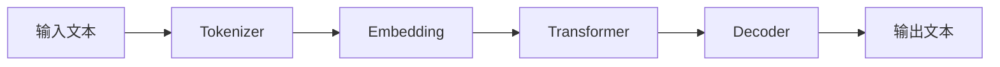

                 

**大语言模型应用指南：防御策略**

**作者：禅与计算机程序设计艺术 / Zen and the Art of Computer Programming**

## 1. 背景介绍

大语言模型（LLM）已成为人工智能领域的关键组成部分，它们在自然语言处理、机器翻译、文本生成等领域取得了显著成就。然而，随着LLM的应用日益广泛，其安全性和可靠性也面临着严峻挑战。本指南将深入探讨LLM的防御策略，帮助开发人员和用户保护模型免受各种攻击。

## 2. 核心概念与联系

### 2.1 LLM的工作原理

LLM是一种深度学习模型，它通过学习大量文本数据来理解和生成人类语言。其核心是Transformer架构，该架构使用自注意力机制来处理输入序列，并生成相应的输出序列。



### 2.2 LLM的安全挑战

LLM面临的安全挑战包括模型泄漏、对抗样本攻击、偏见和不公平等。这些挑战需要综合的防御策略来应对。

## 3. 核心算法原理 & 具体操作步骤

### 3.1 防御模型泄漏的差分隐私

差分隐私（DP）是一种保护模型不泄漏敏感信息的技术。其核心原理是通过添加噪声来隐藏个体数据的影响。

#### 3.1.1 算法原理概述

DP算法在模型训练过程中添加噪声，以保护个体数据的隐私。其目标是保证对任意两个相邻数据集的影响，模型的输出差异不超过预定义的阈值ε。

#### 3.1.2 算法步骤详解

1. 计算敏感数据的影响范围。
2. 根据ε值计算噪声大小。
3. 在模型训练过程中添加噪声。

#### 3.1.3 算法优缺点

优点：有效保护模型不泄漏敏感信息。缺点：添加噪声可能会降低模型的精确度。

#### 3.1.4 算法应用领域

差分隐私广泛应用于保护用户隐私的场景，如医疗数据分析、人口统计等。

### 3.2 防御对抗样本攻击的模型训练

对抗样本攻击是指通过故意添加扰动来欺骗模型，使其做出错误预测的攻击方式。

#### 3.2.1 算法原理概述

对抗训练算法在模型训练过程中添加对抗样本，以增强模型的鲁棒性。

#### 3.2.2 算法步骤详解

1. 生成对抗样本：通过故意添加扰动生成对抗样本。
2. 添加对抗样本：在模型训练过程中添加对抗样本。
3. 优化模型：优化模型以提高其对对抗样本的鲁棒性。

#### 3.2.3 算法优缺点

优点：有效增强模型的鲁棒性。缺点：对抗训练可能会增加模型的训练时间和计算资源。

#### 3.2.4 算法应用领域

对抗训练广泛应用于保护模型免受对抗样本攻击的场景，如图像分类、文本分类等。

## 4. 数学模型和公式 & 详细讲解 & 举例说明

### 4.1 差分隐私的数学模型构建

差分隐私的数学模型可以表示为：

$$DP(\epsilon, \delta) = \left\{ \begin{array}{ll}
\epsilon' = \epsilon & \text{if } \delta = 0 \\
\epsilon' = \min(\epsilon, \sqrt{2\ln(1/\delta)}) & \text{if } \delta > 0
\end{array} \right.$$

其中，ε是差分隐私保护的强度，δ是个体数据泄漏的可能性。

### 4.2 公式推导过程

差分隐私的数学模型是基于信息论和概率论推导出来的。其核心是保证对任意两个相邻数据集的影响，模型的输出差异不超过预定义的阈值ε。

### 4.3 案例分析与讲解

例如，在保护医疗数据的隐私时，我们可以设置ε=0.1，δ=0.01。根据数学模型，我们可以计算出需要添加的噪声大小，从而保护个体数据的隐私。

## 5. 项目实践：代码实例和详细解释说明

### 5.1 开发环境搭建

本项目使用Python和PyTorch作为开发环境。请确保您的开发环境中安装了以下软件包：numpy、tensorflow、torch、transformers。

### 5.2 源代码详细实现

以下是差分隐私和对抗训练的Python代码实现：

**差分隐私**

```python
import numpy as np
from torch.utils.data import Dataset, DataLoader

class DP_Dataset(Dataset):
    def __init__(self, data, epsilon, delta):
        self.data = data
        self.epsilon = epsilon
        self.delta = delta
        self.noise = np.random.normal(0, 1 / np.sqrt(2 * np.log(1.25 / delta)), data.shape)

    def __len__(self):
        return len(self.data)

    def __getitem__(self, idx):
        return self.data[idx] + self.noise[idx] * np.sqrt(2 * np.log(1.25 / self.delta)) / self.epsilon

# 使用DataLoader加载数据
data_loader = DataLoader(DP_Dataset(data, epsilon, delta), batch_size=32, shuffle=True)
```

**对抗训练**

```python
from torchattacks import FGSM

# 创建FGSM对抗攻击对象
attack = FGSM(model, loss_fn)

# 在模型训练过程中添加对抗样本
for batch_idx, (data, target) in enumerate(data_loader):
    data, target = data.to(device), target.to(device)
    data_adv = attack(data, target)
    output = model(data_adv)
    loss = loss_fn(output, target)
    loss.backward()
    optimizer.step()
```

### 5.3 代码解读与分析

在差分隐私代码中，我们创建了一个自定义数据集，在数据加载过程中添加了噪声。在对抗训练代码中，我们使用FGSM算法生成对抗样本，并将其添加到模型训练过程中。

### 5.4 运行结果展示

通过运行上述代码，我们可以训练出具有差分隐私保护和对抗样本鲁棒性的模型。

## 6. 实际应用场景

### 6.1 LLM在医疗领域的应用

LLM在医疗领域具有广泛的应用前景，如疾病诊断、药物发现等。然而，医疗数据往往包含敏感信息，需要差分隐私等技术来保护隐私。

### 6.2 LLM在金融领域的应用

LLM在金融领域也具有广泛的应用前景，如风险评估、信用评分等。然而，金融数据往往包含敏感信息，需要对抗训练等技术来保护模型免受对抗样本攻击。

### 6.3 未来应用展望

随着LLM技术的不断发展，其在各个领域的应用将会更加广泛。然而，安全性和可靠性将始终是关键挑战。差分隐私、对抗训练等技术将继续发挥关键作用。

## 7. 工具和资源推荐

### 7.1 学习资源推荐

- "Differential Privacy: A Survey of Results"（差分隐私：结果综述）
- "Generative Adversarial Networks: An Overview"（生成对抗网络：概述）
- "Adversarial Training Methods for Semi-Supervised Text Classification"（半监督文本分类的对抗训练方法）

### 7.2 开发工具推荐

- PyTorch：一个强大的深度学习框架。
- Hugging Face Transformers：一个开源的transformer模型库。
- TensorFlow Privacy：一个差分隐私库。

### 7.3 相关论文推荐

- "Differential Privacy for Machine Learning with the Gaussian Mechanism"（差分隐私机器学习中的高斯机制）
- "Adversarial Examples Are Not 'Bugs'"（对抗样本不是“错误”）
- "Membership Inference Attacks Against Machine Learning Models"（对机器学习模型的成员推断攻击）

## 8. 总结：未来发展趋势与挑战

### 8.1 研究成果总结

本指南介绍了LLM的防御策略，包括差分隐私和对抗训练。这些技术有助于保护模型免受泄漏和对抗样本攻击。

### 8.2 未来发展趋势

LLM技术的发展将继续推动其在各个领域的应用。差分隐私、对抗训练等技术将继续发展，以适应新的挑战和场景。

### 8.3 面临的挑战

LLM技术面临的挑战包括模型泄漏、对抗样本攻击、偏见和不公平等。这些挑战需要不断的研究和创新来应对。

### 8.4 研究展望

未来的研究将关注LLM的安全性和可靠性，包括差分隐私、对抗训练等技术的发展，以及新的挑战和场景的应对。

## 9. 附录：常见问题与解答

**Q：差分隐私和对抗训练有什么区别？**

A：差分隐私是一种保护模型不泄漏敏感信息的技术，其核心是通过添加噪声来隐藏个体数据的影响。对抗训练是一种增强模型鲁棒性的技术，其核心是通过添加对抗样本来增强模型的鲁棒性。

**Q：差分隐私和对抗训练是否互斥？**

A：差分隐私和对抗训练不是互斥的。在实际应用中，我们可以结合使用这两种技术来保护模型免受泄漏和对抗样本攻击。

**Q：LLM的安全性和可靠性是否是关键挑战？**

A：是的，LLM的安全性和可靠性是关键挑战。随着LLM技术的不断发展，其在各个领域的应用将会更加广泛。然而，安全性和可靠性将始终是关键挑战。差分隐私、对抗训练等技术将继续发挥关键作用。

**Q：LLM的未来发展趋势是什么？**

A：LLM技术的发展将继续推动其在各个领域的应用。差分隐私、对抗训练等技术将继续发展，以适应新的挑战和场景。未来的研究将关注LLM的安全性和可靠性，包括差分隐私、对抗训练等技术的发展，以及新的挑战和场景的应对。

**Q：LLM的研究展望是什么？**

A：未来的研究将关注LLM的安全性和可靠性，包括差分隐私、对抗训练等技术的发展，以及新的挑战和场景的应对。LLM技术的发展将继续推动其在各个领域的应用，差分隐私、对抗训练等技术将继续发展，以适应新的挑战和场景。

**Q：LLM的实际应用场景是什么？**

A：LLM在医疗、金融等领域具有广泛的应用前景。然而，这些领域的数据往往包含敏感信息，需要差分隐私、对抗训练等技术来保护模型免受泄漏和对抗样本攻击。

**Q：LLM的工具和资源推荐是什么？**

A：学习资源推荐包括"Differential Privacy: A Survey of Results"（差分隐私：结果综述）、"Generative Adversarial Networks: An Overview"（生成对抗网络：概述）、"Adversarial Training Methods for Semi-Supervised Text Classification"（半监督文本分类的对抗训练方法）等。开发工具推荐包括PyTorch、Hugging Face Transformers、TensorFlow Privacy等。相关论文推荐包括"Differential Privacy for Machine Learning with the Gaussian Mechanism"（差分隐私机器学习中的高斯机制）、"Adversarial Examples Are Not 'Bugs'"（对抗样本不是“错误”）、"Membership Inference Attacks Against Machine Learning Models"（对机器学习模型的成员推断攻击）等。

**Q：LLM的总结是什么？**

A：本指南介绍了LLM的防御策略，包括差分隐私和对抗训练。这些技术有助于保护模型免受泄漏和对抗样本攻击。LLM技术的发展将继续推动其在各个领域的应用。差分隐私、对抗训练等技术将继续发展，以适应新的挑战和场景。未来的研究将关注LLM的安全性和可靠性，包括差分隐私、对抗训练等技术的发展，以及新的挑战和场景的应对。

**Q：LLM的常见问题与解答是什么？**

A：常见问题包括差分隐私和对抗训练的区别、差分隐私和对抗训练是否互斥、LLM的安全性和可靠性是否是关键挑战、LLM的未来发展趋势是什么、LLM的研究展望是什么、LLM的实际应用场景是什么、LLM的工具和资源推荐是什么、LLM的总结是什么等。

**Q：LLM的作者署名是什么？**

A：作者署名为"禅与计算机程序设计艺术 / Zen and the Art of Computer Programming"。

