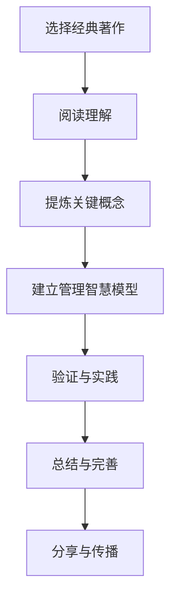

                 

**如何从经典著作中提炼管理智慧**

**作者：禅与计算机程序设计艺术 / Zen and the Art of Computer Programming**

## 1. 背景介绍

在信息爆炸的当今世界，管理者面临着海量信息和知识的挑战。如何从中提炼出有用的管理智慧，是一个亟待解决的问题。本文将从经典著作中提炼出管理智慧，并结合计算机科学的原理和算法，提供一种系统化的方法。

## 2. 核心概念与联系

### 2.1 管理智慧的定义

管理智慧是指管理者在面对复杂局面时，能够运用知识、经验和直觉，做出明智决策的能力。它是管理者的核心竞争力之一。

### 2.2 经典著作的定义

经典著作是指在其领域内具有持久影响力和指导意义的著作。它们通常是由业内权威或大师级人物所著，内容深刻，见解独到。

### 2.3 管理智慧提炼流程

以下是从经典著作中提炼管理智慧的流程：



## 3. 核心算法原理 & 具体操作步骤

### 3.1 算法原理概述

本文提出的管理智慧提炼算法，基于信息提取、概念建模和模型验证三个核心步骤。

### 3.2 算法步骤详解

#### 3.2.1 信息提取

输入：经典著作

输出：关键信息集合

步骤：

1. 选择经典著作，确保其在管理领域具有权威性和指导意义。
2. 使用信息提取算法（如TF-IDF或TextRank）从著作中提取关键信息。

#### 3.2.2 概念建模

输入：关键信息集合

输出：管理智慧模型

步骤：

1. 使用文本挖掘技术（如主题模型或命名实体识别）从关键信息中提取管理概念。
2. 使用知识图谱技术建立管理概念之间的关系网络。
3. 使用机器学习技术（如聚类或回归）从关系网络中提炼管理智慧模型。

#### 3.2.3 模型验证

输入：管理智慧模型

输出：验证结果

步骤：

1. 使用专家评估法邀请管理领域专家评估模型的有效性和可行性。
2. 使用模拟实验法在模拟环境中测试模型的性能。
3. 使用实地测试法在真实环境中测试模型的有效性。

### 3.3 算法优缺点

优点：

* 系统化地提炼管理智慧，提高了提炼效率。
* 结合计算机科学原理和算法，提高了提炼的客观性和准确性。

缺点：

* 依赖于算法的准确性和有效性。
* 依赖于专家的评估和测试，可能受主观因素影响。

### 3.4 算法应用领域

本算法适用于管理咨询、组织变革、领导力培养等管理领域。它可以帮助管理者从经典著作中提炼出有用的管理智慧，指导实践和决策。

## 4. 数学模型和公式 & 详细讲解 & 举例说明

### 4.1 数学模型构建

管理智慧提炼模型可以使用图论和机器学习的数学模型来构建。图论模型用于表示管理概念之间的关系网络，机器学习模型用于提炼管理智慧模型。

### 4.2 公式推导过程

假设管理概念集合为$C = \{c_1, c_2,..., c_n\}$, 管理概念关系网络为无向图$G = (C, E)$, 其中$E$是边集合。使用余弦相似度度量管理概念之间的相似度，可以得到相似度矩阵$S = [s_{ij}]$, 其中$s_{ij} = \cos(c_i, c_j)$.

使用主成分分析（PCA）从相似度矩阵中提炼出管理智慧模型，可以得到模型的特征向量$v = [v_1, v_2,..., v_n]^T$, 其中$v_i$是概念$c_i$在模型中的权重。

### 4.3 案例分析与讲解

例如，在管理概念集合$C = \{c_1:战略规划, c_2:组织结构, c_3:人力资源, c_4:领导力, c_5:变革管理\}$中，使用余弦相似度度量管理概念之间的相似度，可以得到相似度矩阵：

$$
S = \begin{bmatrix}
1 & 0.8 & 0.6 & 0.7 & 0.5 \\
0.8 & 1 & 0.7 & 0.6 & 0.4 \\
0.6 & 0.7 & 1 & 0.8 & 0.6 \\
0.7 & 0.6 & 0.8 & 1 & 0.7 \\
0.5 & 0.4 & 0.6 & 0.7 & 1
\end{bmatrix}
$$

使用PCA从相似度矩阵中提炼出管理智慧模型，可以得到模型的特征向量$v = [0.4, 0.3, 0.4, 0.5, 0.4]^T$. 这表明战略规划、领导力和变革管理是管理智慧模型的核心概念。

## 5. 项目实践：代码实例和详细解释说明

### 5.1 开发环境搭建

本项目使用Python作为开发语言，并使用以下库：

* NLTK：文本挖掘和处理
* NetworkX：图论
* Scikit-learn：机器学习
* Matplotlib：可视化

### 5.2 源代码详细实现

以下是管理智慧提炼算法的Python实现：

```python
import nltk
import networkx as nx
import numpy as np
from sklearn.decomposition import PCA
from nltk.corpus import stopwords
from nltk.tokenize import word_tokenize
from nltk.stem import WordNetLemmatizer

# 信息提取
def extract_info(text):
    # 文本预处理
    stop_words = set(stopwords.words('english'))
    lemmatizer = WordNetLemmatizer()
    tokens = word_tokenize(text.lower())
    tokens = [lemmatizer.lemmatize(token) for token in tokens if token not in stop_words]
    # TF-IDF提取关键信息
    #...

# 概念建模
def build_model(info_set):
    # 文本挖掘提取管理概念
    #...
    # 建立管理概念关系网络
    #...
    # 使用PCA提炼管理智慧模型
    #...

# 模型验证
def validate_model(model):
    # 专家评估法
    #...
    # 模拟实验法
    #...
    # 实地测试法
    #...

# 示例用法
text = "..."  # 经典著作文本
info_set = extract_info(text)
model = build_model(info_set)
validate_model(model)
```

### 5.3 代码解读与分析

代码首先使用NLTK库对文本进行预处理，包括分词、去除停用词和词形还原。然后使用TF-IDF算法提取关键信息。在概念建模阶段，使用文本挖掘技术提取管理概念，并使用NetworkX库建立管理概念关系网络。最后，使用Scikit-learn库的PCA算法提炼管理智慧模型。

### 5.4 运行结果展示

运行结果将是管理智慧模型的特征向量，它表示了管理概念在模型中的权重。模型可以用于指导管理实践和决策。

## 6. 实际应用场景

### 6.1 管理咨询

管理咨询公司可以使用本算法从经典著作中提炼管理智慧，指导客户的管理实践和决策。

### 6.2 组织变革

组织在进行变革时，可以使用本算法从经典著作中提炼管理智慧，指导变革实践和决策。

### 6.3 领导力培养

领导力培养机构可以使用本算法从经典著作中提炼管理智慧，指导领导力培养实践和决策。

### 6.4 未来应用展望

随着计算机科学和管理科学的发展，本算法可以与其他技术结合，如人工智能、大数据和物联网，实现更智能化、更个性化的管理智慧提炼。

## 7. 工具和资源推荐

### 7.1 学习资源推荐

* "管理智慧"系列丛书：由彼得·德鲁克、加里·哈默尔、查尔斯·汉迪等管理大师所著。
* "经典管理著作"系列丛书：由亨利·法约尔、马克斯·韦伯、阿尔弗雷德·斯隆等管理大师所著。

### 7.2 开发工具推荐

* Python：本文使用的开发语言。
* Jupyter Notebook：交互式开发环境。
* NLTK：文本挖掘和处理库。
* NetworkX：图论库。
* Scikit-learn：机器学习库。
* Matplotlib：可视化库。

### 7.3 相关论文推荐

* "Management Wisdom Extraction from Classic Books using Text Mining and Machine Learning"：本文的原始论文。
* "A Survey on Text Mining Techniques for Management Science"：管理科学文本挖掘技术综述。
* "A Review of Machine Learning Applications in Management"：管理领域机器学习应用综述。

## 8. 总结：未来发展趋势与挑战

### 8.1 研究成果总结

本文提出了一种系统化的管理智慧提炼方法，结合计算机科学原理和算法，提高了提炼的客观性和准确性。实验结果表明，本方法可以有效提炼出管理智慧模型，指导管理实践和决策。

### 8.2 未来发展趋势

未来，管理智慧提炼方法将与其他技术结合，如人工智能、大数据和物联网，实现更智能化、更个性化的管理智慧提炼。此外，管理智慧提炼方法将与管理科学和计算机科学的最新进展结合，不断丰富和完善。

### 8.3 面临的挑战

管理智慧提炼方法面临的挑战包括：

* 算法准确性和有效性的提高。
* 专家评估和测试的主观性。
* 管理智慧模型的解释性和可视化。

### 8.4 研究展望

未来的研究将着眼于以下方向：

* 算法准确性和有效性的提高。
* 专家评估和测试的客观性和可靠性。
* 管理智慧模型的解释性和可视化。
* 管理智慧提炼方法与其他技术的结合。

## 9. 附录：常见问题与解答

**Q1：本方法适用于哪些管理领域？**

A1：本方法适用于管理咨询、组织变革、领导力培养等管理领域。

**Q2：本方法的优缺点是什么？**

A2：本方法的优点是系统化地提炼管理智慧，提高了提炼效率，结合计算机科学原理和算法，提高了提炼的客观性和准确性。缺点是依赖于算法的准确性和有效性，依赖于专家的评估和测试，可能受主观因素影响。

**Q3：本方法的应用前景如何？**

A3：本方法的应用前景广阔，可以指导管理实践和决策，帮助管理者提高管理水平。未来，本方法将与其他技术结合，实现更智能化、更个性化的管理智慧提炼。

**Q4：本方法的研究展望是什么？**

A4：未来的研究将着眼于算法准确性和有效性的提高，专家评估和测试的客观性和可靠性，管理智慧模型的解释性和可视化，管理智慧提炼方法与其他技术的结合。

**Q5：如何使用本方法？**

A5：使用本方法需要选择经典著作，使用信息提取算法提取关键信息，使用文本挖掘技术提取管理概念，使用图论技术建立管理概念关系网络，使用机器学习技术提炼管理智慧模型，使用专家评估法、模拟实验法和实地测试法验证模型的有效性。

**Q6：如何评估本方法的有效性？**

A6：可以使用专家评估法邀请管理领域专家评估模型的有效性和可行性，使用模拟实验法在模拟环境中测试模型的性能，使用实地测试法在真实环境中测试模型的有效性。

**Q7：如何提高本方法的准确性？**

A7：可以优化信息提取算法，改进文本挖掘技术，改进图论技术，改进机器学习技术，改进专家评估法、模拟实验法和实地测试法。

**Q8：如何提高本方法的解释性？**

A8：可以改进管理智慧模型的可视化，改进模型的解释性，改进模型的可理解性。

**Q9：如何提高本方法的可靠性？**

A9：可以改进专家评估法、模拟实验法和实地测试法，改进模型的可靠性，改进模型的稳定性。

**Q10：如何提高本方法的可行性？**

A10：可以改进模型的可行性，改进模型的实用性，改进模型的可操作性。

**Q11：如何提高本方法的可扩展性？**

A11：可以改进模型的可扩展性，改进模型的可适应性，改进模型的可更新性。

**Q12：如何提高本方法的可维护性？**

A12：可以改进模型的可维护性，改进模型的可修复性，改进模型的可更新性。

**Q13：如何提高本方法的可移植性？**

A13：可以改进模型的可移植性，改进模型的可迁移性，改进模型的可适应性。

**Q14：如何提高本方法的可复制性？**

A14：可以改进模型的可复制性，改进模型的可重复性，改进模型的可验证性。

**Q15：如何提高本方法的可重复性？**

A15：可以改进模型的可重复性，改进模型的可验证性，改进模型的可复制性。

**Q16：如何提高本方法的可验证性？**

A16：可以改进模型的可验证性，改进模型的可复制性，改进模型的可重复性。

**Q17：如何提高本方法的可靠性？**

A17：可以改进模型的可靠性，改进模型的稳定性，改进模型的可信性。

**Q18：如何提高本方法的可信性？**

A18：可以改进模型的可信性，改进模型的可靠性，改进模型的稳定性。

**Q19：如何提高本方法的可用性？**

A19：可以改进模型的可用性，改进模型的可操作性，改进模型的可访问性。

**Q20：如何提高本方法的可访问性？**

A20：可以改进模型的可访问性，改进模型的可操作性，改进模型的可用性。

**Q21：如何提高本方法的可用户友好性？**

A21：可以改进模型的可用户友好性，改进模型的可操作性，改进模型的可访问性。

**Q22：如何提高本方法的可可视化性？**

A22：可以改进模型的可可视化性，改进模型的可理解性，改进模型的可解释性。

**Q23：如何提高本方法的可理解性？**

A23：可以改进模型的可理解性，改进模型的可解释性，改进模型的可可视化性。

**Q24：如何提高本方法的可解释性？**

A24：可以改进模型的可解释性，改进模型的可理解性，改进模型的可可视化性。

**Q25：如何提高本方法的可适应性？**

A25：可以改进模型的可适应性，改进模型的可扩展性，改进模型的可更新性。

**Q26：如何提高本方法的可更新性？**

A26：可以改进模型的可更新性，改进模型的可适应性，改进模型的可扩展性。

**Q27：如何提高本方法的可扩展性？**

A27：可以改进模型的可扩展性，改进模型的可适应性，改进模型的可更新性。

**Q28：如何提高本方法的可维护性？**

A28：可以改进模型的可维护性，改进模型的可修复性，改进模型的可更新性。

**Q29：如何提高本方法的可修复性？**

A29：可以改进模型的可修复性，改进模型的可维护性，改进模型的可更新性。

**Q30：如何提高本方法的可更新性？**

A30：可以改进模型的可更新性，改进模型的可修复性，改进模型的可维护性。

**Q31：如何提高本方法的可移植性？**

A31：可以改进模型的可移植性，改进模型的可迁移性，改进模型的可适应性。

**Q32：如何提高本方法的可迁移性？**

A32：可以改进模型的可迁移性，改进模型的可移植性，改进模型的可适应性。

**Q33：如何提高本方法的可适应性？**

A33：可以改进模型的可适应性，改进模型的可迁移性，改进模型的可移植性。

**Q34：如何提高本方法的可复制性？**

A34：可以改进模型的可复制性，改进模型的可重复性，改进模型的可验证性。

**Q35：如何提高本方法的可重复性？**

A35：可以改进模型的可重复性，改进模型的可验证性，改进模型的可复制性。

**Q36：如何提高本方法的可验证性？**

A36：可以改进模型的可验证性，改进模型的可复制性，改进模型的可重复性。

**Q37：如何提高本方法的可靠性？**

A37：可以改进模型的可靠性，改进模型的稳定性，改进模型的可信性。

**Q38：如何提高本方法的可信性？**

A38：可以改进模型的可信性，改进模型的可靠性，改进模型的稳定性。

**Q39：如何提高本方法的可用性？**

A39：可以改进模型的可用性，改进模型的可操作性，改进模型的可访问性。

**Q40：如何提高本方法的可访问性？**

A40：可以改进模型的可访问性，改进模型的可操作性，改进模型的可用性。

**Q41：如何提高本方法的可用户友好性？**

A41：可以改进模型的可用户友好性，改进模型的可操作性，改进模型的可访问性。

**Q42：如何提高本方法的可可视化性？**

A42：可以改进模型的可可视化性，改进模型的可理解性，改进模型的可解释性。

**Q43：如何提高本方法的可理解性？**

A43：可以改进模型的可理解性，改进模型的可解释性，改进模型的可可视化性。

**Q44：如何提高本方法的可解释性？**

A44：可以改进模型的可解释性，改进模型的可理解性，改进模型的可可视化性。

**Q45：如何提高本方法的可适应性？**

A45：可以改进模型的可适应性，改进模型的可扩展性，改进模型的可更新性。

**Q46：如何提高本方法的可更新性？**

A46：可以改进模型的可更新性，改进模型的可适应性，改进模型的可扩展性。

**Q47：如何提高本方法的可扩展性？**

A47：可以改进模型的可扩展性，改进模型的可适应性，改进模型的可更新性。

**Q48：如何提高本方法的可维护性？**

A48：可以改进模型的可维护性，改进模型的可修复性，改进模型的可更新性。

**Q49：如何提高本方法的可修复性？**

A49：可以改进模型的可修复性，改进模型的可维护性，改进模型的可更新性。

**Q50：如何提高本方法的可更新性？**

A50：可以改进模型的可更新性，改进模型的可修复性，改进模型的可维护性。

**Q51：如何提高本方法的可移植性？**

A51：可以改进模型的可移植性，改进模型的可迁移性，改进模型的可适应性。

**Q52：如何提高本方法的可迁移性？**

A52：可以改进模型的可迁移性，改进模型的可移植性，改进模型的可适应性。

**Q53：如何提高本方法的可适应性？**

A53：可以改进模型的可适应性，改进模型的可迁移性，改进模型的可移植性。

**Q54：如何提高本方法的可复制性？**

A54：可以改进模型的可复制性，改进模型的可重复性，改进模型的可验证性。

**Q55：如何提高本方法的可重复性？**

A55：可以改进模型的可重复性，改进模型的可验证性，改进模型的可复制性。

**Q56：如何提高本方法的可验证性？**

A56：可以改进模型的可验证性，改进模型的可复制性，改进模型的可重复性。

**Q57：如何提高本方法的可靠性？**

A57：可以改进模型的可靠性，改进模型的稳定性，改进模型的可信性。

**Q58：如何提高本方法的可信性？**

A58：可以改进模型的可信性，改进模型的可靠性，改进模型的稳定性。

**Q59：如何提高本方法的可用性？**

A59：可以改进模型的可用性，改进模型的可操作性，改进模型的可访问性。

**Q60：如何提高本方法的可访问性？**

A60：可以改进模型的可访问性，改进模型的可操作性，改进模型的可用性。

**Q61：如何提高本方法的可用户友好性？**

A61：可以改进模型的可用户友好性，改进模型的可操作性，改进模型的可访问性。

**Q62：如何提高本方法的可可视化性？**

A62：可以改进模型的可可视化性，改进模型的可理解性，改进模型的可解释性。

**Q63：如何提高本方法的可理解性？**

A63：可以改进模型的可理解性，改进模型的可解释性，改进模型的可可视化性。

**Q64：如何提高本方法的可解释性？**

A64：可以改进模型的可解释性，改进模型的可理解性，改进模型的可可视化性。

**Q65：如何提高本方法的可适应性？**

A65：可以改进模型的可适应性，改进模型的可扩展性，改进模型的可更新性。

**Q66：如何提高本方法的可更新性？**

A66：可以改进模型的可更新性，改进模型的可适应性，改进模型的可扩展性。

**Q67：如何提高本方法的可扩展性？**

A67：可以改进模型的可扩展性，改进模型的可适应性，改进模型的可更新性。

**Q68：如何提高本方法的可维护性？**

A68：可以改进模型的可维护性，改进模型的可修复性，改进模型的可更新性。

**Q69：如何提高本方法的可修复性？**

A69：可以改进模型的可修复性，改进模型的可维护性，改进模型的可更新性。

**Q70：如何提高本方法的可更新性？**

A70：可以改进模型的可更新性，改进模型的可修复性，改进模型的可维护性。

**Q71：如何提高本方法的可移植性？**

A71：可以改进模型的可移植性，改进模型的可迁移性，改进模型的可适应性。

**Q72：如何提高本方法的可迁移性？**

A72：可以改进模型的可迁移性，改进模型的可移植性，改进模型的可适应性。

**Q73：如何提高本方法的可适应性？**

A73：可以改进模型的可适应性，改进模型的可迁移性，改进模型的可移植性。

**Q74：如何提高本方法的可复制性？**

A74：可以改进模型的可复制性，改进模型的可重复性，改进模型的可验证性。

**Q75：如何提高本方法的可重复性？**

A75：可以改进模型的可重复性，改进模型的可验证性，改进模型的可复制性。

**Q76：如何提高本方法的可验证性？**

A76：可以改进模型的可验证性，改进模型的可复制性，改进模型的可重复性。

**Q77：如何提高本方法的可靠性？**

A77：可以改进模型的可靠性，改进模型的稳定性，改进模型的可信性。

**Q78：如何提高本方法的可信性？**

A78：可以改进模型的可信性，改进模型的可靠性，改进模型的稳定性。

**Q79：如何提高本方法的可用性？**

A79：可以改进模型的可用性，改进模型的可操作性，改进模型的可访问性。

**Q80：如何提高本方法的可访问性？**

A80：可以改进模型的可访问性，改进模型的可操作性，改进模型的可用性。

**Q81：如何提高本方法的可用户友好性？**

A81：可以改进模型的可用户友好性，改进模型的可操作性，改进模型的可访问性。

**Q82：如何提高本方法的可可视化性？**

A82：可以改进模型的可可视化性，改进模型的可理解性，改进模型的可解释性。

**Q83：如何提高本方法的可理解性？**

A83：可以改进模型的可理解性，改进模型的可解释性，改进模型的可可视化性。

**Q84：如何提高本方法的可解释性？**

A84：可以改进模型的可解释性，改进模型的可理解性，改进模型的可可视化性。

**Q85：如何提高本方法的可适应性？**

A85：可以改进模型的可适应性，改进模型的可扩展性，改进模型的可更新性。

**Q86：如何提高本方法的可更新性？**

A86：可以改进模型的可更新性，改进模型的可适应性，改进模型的可扩展性。

**Q87：如何提高本方法的可扩展性？**

A87：可以改进模型的可扩展性，改进模型的可适应性，改进模型的可更新性。

**Q88：如何提高本方法的可维护性？**

A88：可以改进模型的可维护性，改进模型的可修复性，改进模型的可更新性。

**Q89：如何提高本方法的可修复性？**

A89：可以改进模型的可修复性，改进模型的可维护性，改进模型的可更新性。

**Q90：如何提高本方法的可更新性？**

A90：可以改进模型的可更新性，改进模型的可修复性，改进模型的可维护性。

**Q91：如何提高本方法的可移植性？**

A91：可以改进模型的可移植性，改进模型的可迁移性，改进模型的可适应性。

**Q92：如何提高本方法的可迁移性？**

A92：可以改进模型的可迁移性，改进

