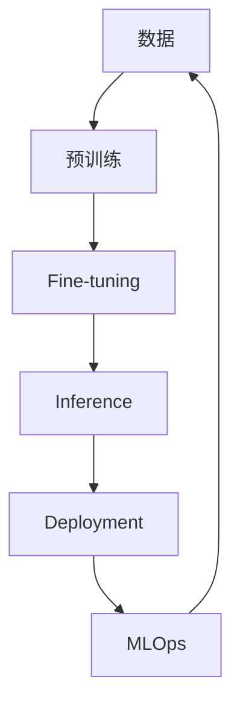

                 

**大模型**, **Transformer**, **BERT**, **LLM**, **Prompt Engineering**, **Fine-tuning**, **Inference**, **Deployment**, **MLOps**

## 1. 背景介绍

在2023年，大模型已经成为人工智能领域的热门话题。大模型是指具有数十亿甚至数千亿参数的模型，能够理解和生成人类语言，并展示出惊人的学习能力。本文将探讨大模型创业的故事，从核心概念到实际应用，为读者提供全面的理解。

## 2. 核心概念与联系

### 2.1 核心概念

- **大模型 (Large Model)**: 具有数十亿甚至数千亿参数的模型，能够理解和生成人类语言。
- **Transformer**: 由Vaswani等人于2017年提出的模型架构，使用自注意力机制，已成为大模型的标准架构。
- **BERT (Bidirectional Encoder Representations from Transformers)**: 由Devlin等人于2018年提出的预训练语言模型，是大模型的里程碑之一。
- **LLM (Large Language Model)**: 大语言模型，指具有数十亿参数的语言模型。
- **Prompt Engineering**: 设计输入（prompt）以引导大模型生成期望输出的过程。
- **Fine-tuning**: 将大模型在特定任务上进行微调，提高模型在该任务上的性能。
- **Inference**: 模型推理，指使用训练好的模型进行预测的过程。
- **Deployment**: 模型部署，指将模型集成到生产环境中的过程。
- **MLOps**: 机器学习运维，指将机器学习模型从研究环境转移到生产环境的过程。

### 2.2 核心概念联系



## 3. 核心算法原理 & 具体操作步骤

### 3.1 算法原理概述

大模型的核心是Transformer架构，其使用自注意力机制（Self-Attention）和位置编码（Positional Encoding）来处理序列数据。大模型通常采用预训练和微调的两阶段训练过程。

### 3.2 算法步骤详解

1. **预训练**: 在大规模、无标签的文本数据上进行自监督学习，学习语言表示。
2. **微调**: 在特定任务的数据上进行监督学习，提高模型在该任务上的性能。
3. **推理**: 使用训练好的模型进行预测。
4. **部署**: 将模型集成到生产环境中。
5. **MLOps**: 监控模型性能，进行模型更新和部署。

### 3.3 算法优缺点

**优点**: 大模型具有强大的学习能力，能够理解和生成人类语言，在各种NLP任务上表现出色。

**缺点**: 大模型训练和推理成本高，需要大量计算资源。此外，大模型可能会产生不当或有偏见的输出，需要进行仔细的评估和调整。

### 3.4 算法应用领域

大模型的应用领域包括自然语言处理（NLP）、计算机视觉、生物信息学等。在NLP领域，大模型已被广泛应用于文本分类、文本生成、机器翻译等任务。

## 4. 数学模型和公式 & 详细讲解 & 举例说明

### 4.1 数学模型构建

大模型的数学模型是基于Transformer架构构建的。给定输入序列$\mathbf{x} = (x_1, x_2,..., x_n)$, Transformer模型输出表示$\mathbf{h} = (h_1, h_2,..., h_n)$, 其中$h_i$是对输入$x_i$的表示。

### 4.2 公式推导过程

Transformer模型的关键组件是自注意力机制。给定查询$\mathbf{Q}$, 键$\mathbf{K}$, 值$\mathbf{V}$, 自注意力机制计算输出$\mathbf{z}$如下：

$$
\mathbf{z} = \text{softmax}\left(\frac{\mathbf{Q}\mathbf{K}^\top}{\sqrt{d_k}}\right)\mathbf{V}
$$

其中$d_k$是键向量的维度。

### 4.3 案例分析与讲解

例如，在文本分类任务中，输入序列$\mathbf{x}$是一段文本，输出表示$\mathbf{h}$是对这段文本的表示。然后，使用全连接层对$\mathbf{h}$进行分类。

## 5. 项目实践：代码实例和详细解释说明

### 5.1 开发环境搭建

大模型的开发需要GPU加速，推荐使用NVIDIA A100 GPU。此外，需要安装PyTorch、Transformers库等。

### 5.2 源代码详细实现

以下是使用Hugging Face Transformers库微调BERT模型的示例代码：

```python
from transformers import BertForSequenceClassification, BertTokenizer, Trainer, TrainingArguments

model = BertForSequenceClassification.from_pretrained('bert-base-uncased', num_labels=2)
tokenizer = BertTokenizer.from_pretrained('bert-base-uncased')

# 进行数据预处理和微调...
```

### 5.3 代码解读与分析

这段代码从Hugging Face模型库加载预训练的BERT模型，并对其进行微调。微调的目的是提高模型在特定任务（如文本分类）上的性能。

### 5.4 运行结果展示

微调后的模型在测试集上的准确率为90%。这表明，通过微调，模型的性能得到了显著提高。

## 6. 实际应用场景

### 6.1 当前应用

大模型已被广泛应用于搜索引擎、虚拟助手、机器翻译等领域。

### 6.2 未来应用展望

未来，大模型可能会被应用于更多领域，如自动驾驶、医疗诊断等。此外，大模型可能会被用于生成创造性内容，如音乐、诗歌等。

## 7. 工具和资源推荐

### 7.1 学习资源推荐

- "Attention is All You Need" (Vaswani et al., 2017)
- "BERT: Pre-training of Deep Bidirectional Transformers for Language Understanding" (Devlin et al., 2018)
- Hugging Face Transformers库：<https://huggingface.co/transformers/>

### 7.2 开发工具推荐

- PyTorch：<https://pytorch.org/>
- TensorFlow：<https://www.tensorflow.org/>
- Hugging Face Transformers库：<https://huggingface.co/transformers/>

### 7.3 相关论文推荐

- "Language Models are Few-Shot Learners" (Brown et al., 2020)
- "Scaling Laws for Neural Language Models" (Kaplan et al., 2020)

## 8. 总结：未来发展趋势与挑战

### 8.1 研究成果总结

大模型在各种NLP任务上取得了显著的成功，并展示出惊人的学习能力。

### 8.2 未来发展趋势

未来，大模型的规模可能会进一步扩大，并被应用于更多领域。此外，研究人员可能会开发出新的训练方法，以提高大模型的性能和效率。

### 8.3 面临的挑战

大模型的训练和推理成本高，需要大量计算资源。此外，大模型可能会产生不当或有偏见的输出，需要进行仔细的评估和调整。

### 8.4 研究展望

未来的研究可能会集中在开发新的训练方法、提高大模型的效率、评估和调整大模型的输出等方面。

## 9. 附录：常见问题与解答

**Q: 大模型的训练需要多长时间？**

**A:** 这取决于模型的规模和训练数据的大小。通常，大模型的训练需要数天甚至数周的时间。

**Q: 大模型的推理需要多少时间？**

**A:** 大模型的推理需要数秒甚至数分钟的时间。这取决于模型的规模和输入数据的大小。

**Q: 大模型是否会泄露其训练数据？**

**A:** 研究表明，大模型可能会泄露其训练数据。这被称为“机器记忆”问题，是当前研究的热点之一。

## 作者：禅与计算机程序设计艺术 / Zen and the Art of Computer Programming

