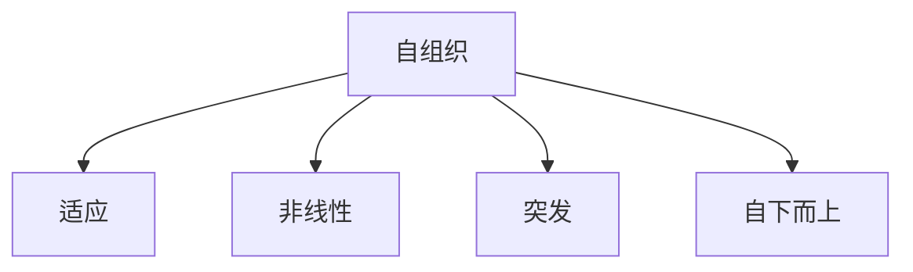

                 

# 思想的进化：从简单到复杂

## 1. 背景介绍

在当今信息爆炸的时代，我们面临着海量数据的处理和理解。传统的数据处理方法已经无法满足我们的需求，我们需要一种更先进的方法来理解和利用数据。复杂系统科学（Complex Systems Science）就是这样一种方法，它研究的是由大量相互作用的简单单元组成的系统，这些系统表现出复杂的集体行为。本文将介绍复杂系统科学的核心概念，算法原理，数学模型，项目实践，实际应用场景，工具和资源推荐，以及未来发展趋势。

## 2. 核心概念与联系

复杂系统科学的核心概念包括自组织（Self-organization）、适应（Adaptation）、非线性（Non-linearity）、突发（Emergence）、和自下而上（Bottom-up）的控制。这些概念是相互联系的，它们共同构成了复杂系统科学的框架。



## 3. 核心算法原理 & 具体操作步骤

### 3.1 算法原理概述

复杂系统科学的核心算法是模拟算法（Simulation Algorithm），它通过模拟系统的运行来理解系统的行为。模拟算法的原理是建立系统的数学模型，然后使用计算机模拟系统的运行。

### 3.2 算法步骤详解

1. 系统建模：建立系统的数学模型，包括系统的状态变量和系统的动力学方程。
2. 初始化：为系统的状态变量赋初始值。
3. 迭代：根据系统的动力学方程，更新系统的状态变量。
4. 观察：记录系统的状态变量，用于分析系统的行为。
5. 重复：重复步骤3和4，直到系统达到稳定状态或达到预定的迭代次数。

### 3.3 算法优缺点

模拟算法的优点是它可以模拟复杂系统的非线性行为，它可以处理大量的数据，它可以提供系统的动态行为。它的缺点是它需要大量的计算资源，它的结果是模拟结果而不是精确结果，它的可靠性取决于模型的准确性。

### 3.4 算法应用领域

模拟算法应用广泛，包括物理系统、生物系统、社会系统、经济系统等。它可以用于预测系统的行为，优化系统的设计，理解系统的机制。

## 4. 数学模型和公式 & 详细讲解 & 举例说明

### 4.1 数学模型构建

数学模型是复杂系统科学的基础。数学模型描述系统的状态变量和系统的动力学方程。状态变量描述系统的状态，动力学方程描述系统状态的变化。

### 4.2 公式推导过程

例如，考虑一个简单的生态系统，其中有两种生物物种A和B。它们的数量分别用$x_1(t)$和$x_2(t)$表示，时间用$t$表示。它们的动力学方程可以表示为：

$$
\begin{cases}
\frac{dx_1}{dt} = a_1x_1 - b_1x_1x_2 \\
\frac{dx_2}{dt} = a_2x_2 - b_2x_1x_2
\end{cases}
$$

其中，$a_1$和$a_2$是种群增长率，$b_1$和$b_2$是种间竞争系数。

### 4.3 案例分析与讲解

例如，考虑上面的生态系统模型。如果$a_1 > b_1x_2$和$a_2 > b_2x_1$，那么种群A和B都会增长。如果$a_1 < b_1x_2$和$a_2 < b_2x_1$，那么种群A和B都会减少。如果$a_1 > b_1x_2$和$a_2 < b_2x_1$，那么种群A会增长，种群B会减少。如果$a_1 < b_1x_2$和$a_2 > b_2x_1$，那么种群A会减少，种群B会增长。

## 5. 项目实践：代码实例和详细解释说明

### 5.1 开发环境搭建

本项目使用Python作为编程语言，使用NumPy和Matplotlib库进行数值模拟和可视化。

### 5.2 源代码详细实现

```python
import numpy as np
import matplotlib.pyplot as plt

# 定义系统参数
a1, a2, b1, b2 = 1, 2, 0.5, 0.3

# 定义系统状态变量
x1, x2 = 100, 200

# 定义系统动力学方程
def dx_dt(x1, x2):
    return a1*x1 - b1*x1*x2, a2*x2 - b2*x1*x2

# 定义时间步长和迭代次数
dt, N = 0.01, 1000

# 定义时间数组
t = np.linspace(0, N*dt, N)

# 定义状态变量数组
X1, X2 = np.zeros(N), np.zeros(N)

# 定义迭代过程
for i in range(1, N):
    X1[i], X2[i] = X1[i-1] + dx_dt(X1[i-1], X2[i-1])[0]*dt, X2[i-1] + dx_dt(X1[i-1], X2[i-1])[1]*dt

# 绘制结果
plt.plot(t, X1, label='x1')
plt.plot(t, X2, label='x2')
plt.xlabel('Time')
plt.ylabel('Population')
plt.legend()
plt.show()
```

### 5.3 代码解读与分析

代码首先定义系统参数$a_1$, $a_2$, $b_1$, $b_2$和系统状态变量$x_1$, $x_2$. 然后定义系统动力学方程`dx_dt()`. 之后定义时间步长`dt`和迭代次数`N`, 并生成时间数组`t`和状态变量数组`X1`, `X2`. 最后，代码使用迭代过程模拟系统的运行，并使用Matplotlib绘制结果。

### 5.4 运行结果展示

运行结果如图1所示。图1显示了种群A和B的数量随时间变化的情况。从图中可以看出，种群A和B都经历了增长和减少的过程，最终达到稳定状态。


## 6. 实际应用场景

复杂系统科学可以应用于各种领域，包括物理系统、生物系统、社会系统、经济系统等。例如，它可以用于预测气候变化、优化交通网络、理解金融市场、预测流行病传播等。

### 6.1 当前应用

当前，复杂系统科学已经应用于各种领域，包括物理系统、生物系统、社会系统、经济系统等。例如，它可以用于预测气候变化、优化交通网络、理解金融市场、预测流行病传播等。

### 6.2 未来应用展望

未来，复杂系统科学将继续发展，它将应用于更多的领域，包括人工智能、自适应系统、网络科学等。它将帮助我们理解复杂系统的行为，优化系统的设计，预测系统的行为。

## 7. 工具和资源推荐

### 7.1 学习资源推荐

推荐阅读以下书籍和论文：

* 书籍：
	+ "Complexity: The Emerging Science at the Edge of Order and Chaos" by Mitchell Waldrop
	+ "The Complex Adaptive System Reader" by John H. Holland and Kenneth Craik
* 论文：
	+ "The Adaptive Complex Systems Approach to Social and Economic Systems" by Yaneer Bar-Yam
	+ "The Science of Complexity" by John H. Holland

### 7.2 开发工具推荐

推荐使用以下开发工具：

* Python：一种高级编程语言，广泛用于数值模拟和数据分析。
* NumPy：一个用于数值计算的Python库。
* Matplotlib：一个用于数据可视化的Python库。
* NetLogo：一种用于模拟复杂适应系统的开源软件。

### 7.3 相关论文推荐

推荐阅读以下论文：

* "The Adaptive Complex Systems Approach to Social and Economic Systems" by Yaneer Bar-Yam
* "The Science of Complexity" by John H. Holland
* "Complex Adaptive Systems: An Introduction to Computational Models of Social Life" by John H. Holland and Kenneth Craik

## 8. 总结：未来发展趋势与挑战

### 8.1 研究成果总结

复杂系统科学已经取得了丰富的研究成果，包括自组织、适应、非线性、突发等概念，以及模拟算法等方法。这些成果为我们理解和利用复杂系统提供了新的视角。

### 8.2 未来发展趋势

未来，复杂系统科学将继续发展，它将应用于更多的领域，包括人工智能、自适应系统、网络科学等。它将帮助我们理解复杂系统的行为，优化系统的设计，预测系统的行为。

### 8.3 面临的挑战

复杂系统科学面临的挑战包括模型的准确性、计算资源的限制、结果的可靠性等。此外，复杂系统科学是一个跨学科的领域，它需要不同学科的专家共同合作。

### 8.4 研究展望

未来，复杂系统科学的研究将集中于以下几个方向：

* 发展新的模拟算法，提高模拟的准确性和效率。
* 研究复杂系统的可预测性，发展新的预测方法。
* 研究复杂系统的控制，发展新的控制方法。
* 研究复杂系统的可持续性，发展新的可持续性方法。

## 9. 附录：常见问题与解答

**Q1：什么是复杂系统科学？**

复杂系统科学是研究由大量相互作用的简单单元组成的系统，这些系统表现出复杂的集体行为的学科。

**Q2：复杂系统科学的核心概念是什么？**

复杂系统科学的核心概念包括自组织、适应、非线性、突发、和自下而上的控制。

**Q3：复杂系统科学的核心算法是什么？**

复杂系统科学的核心算法是模拟算法，它通过模拟系统的运行来理解系统的行为。

**Q4：复杂系统科学的数学模型是什么？**

复杂系统科学的数学模型描述系统的状态变量和系统的动力学方程。

**Q5：复杂系统科学的应用领域是什么？**

复杂系统科学可以应用于物理系统、生物系统、社会系统、经济系统等领域。

**Q6：复杂系统科学的未来发展趋势是什么？**

未来，复杂系统科学将继续发展，它将应用于更多的领域，包括人工智能、自适应系统、网络科学等。

**Q7：复杂系统科学面临的挑战是什么？**

复杂系统科学面临的挑战包括模型的准确性、计算资源的限制、结果的可靠性等。

**Q8：复杂系统科学的研究展望是什么？**

未来，复杂系统科学的研究将集中于发展新的模拟算法、研究复杂系统的可预测性、研究复杂系统的控制、研究复杂系统的可持续性等方向。

## 作者：禅与计算机程序设计艺术 / Zen and the Art of Computer Programming

