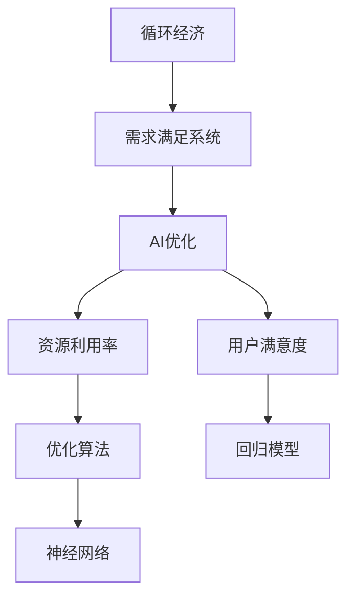

                 

# 欲望的循环经济模型：AI优化的需求满足系统

## 1. 背景介绍

随着科技的飞速发展，人工智能(AI)在各行各业中的应用越来越广泛。从智能客服到推荐系统，从自动化驾驶到工业自动化，AI技术正深刻影响着我们的生活和工作。然而，在带来便利的同时，AI系统也引发了一系列问题，其中最显著的便是需求过度满足问题。过度满足会导致资源浪费、环境污染、用户依赖等问题，最终损害社会的可持续性。

### 1.1 问题的由来
需求过度满足主要是由于以下几个原因：

- **反馈循环**：AI系统基于用户行为反馈进行训练优化，而用户行为往往会被过度满足。例如，推荐系统中，用户点击率高，系统便会持续推送相关内容，导致信息过载。
- **算法设计**：传统AI算法往往以最大化用户满意度为目标，而不考虑资源的合理利用。
- **人性本贪**：用户对新奇、有趣的内容有着天然的好奇心和追求，容易导致需求不断膨胀。

因此，我们需要一种能够有效控制需求满足的系统，以实现资源的可持续利用和生态环境的保护。

### 1.2 问题核心关键点
要解决这个问题，关键在于构建一个循环经济模型，通过AI优化需求满足系统，实现资源的合理利用和用户需求的适度满足。具体来说，需要：

- 引入循环经济的理念，将资源循环利用和生态平衡作为目标。
- 通过AI技术，动态调整需求满足策略，确保用户需求得到适度满足。
- 实时监测系统状态，确保AI优化策略的有效性。

## 2. 核心概念与联系

### 2.1 核心概念概述

构建AI优化的需求满足系统，涉及以下几个核心概念：

- **循环经济**：资源循环利用和生态平衡的一种经济模式，旨在减少资源消耗和环境污染。
- **需求满足系统**：通过算法和模型，优化用户需求的满足，实现资源的有效利用。
- **AI优化**：利用AI技术，动态调整需求满足策略，提高系统的智能化和自动化水平。
- **资源利用率**：衡量系统资源利用效率的指标，包括时间和空间的利用率。
- **用户满意度**：衡量用户对系统提供服务的满意度，包括内容相关性和多样性等。
- **算法设计**：包括优化算法、回归模型、神经网络等，用于动态调整需求满足策略。

这些概念之间的逻辑关系可以通过以下Mermaid流程图来展示：



这个流程图展示了大语言模型微调的各核心概念及其之间的关系：

1. 循环经济通过需求满足系统，实现资源的合理利用。
2. 需求满足系统引入AI优化，提高系统的智能化和自动化水平。
3. AI优化通过资源利用率和用户满意度等指标，动态调整需求满足策略。
4. 优化算法、回归模型和神经网络等工具，支持AI优化的具体实现。

## 3. 核心算法原理 & 具体操作步骤
### 3.1 算法原理概述

AI优化的需求满足系统，本质上是一个基于循环经济模型的优化问题。其核心思想是：通过动态调整需求满足策略，实现资源的最大化利用和用户需求的适度满足。

形式化地，假设系统资源总量为 $R$，用户需求数量为 $D$，用户满意度为 $S$，资源利用率为 $E$。则系统优化的目标函数为：

$$
\maximize \quad S - \lambda E
$$

其中 $\lambda$ 为正则化参数，用于平衡用户满意度和资源利用率。模型的约束条件包括：

1. 用户需求 $D$ 不应超过系统资源 $R$。
2. 用户满意度 $S$ 应大于等于预设的下限阈值。
3. 资源利用率 $E$ 应小于等于预设的上限阈值。

### 3.2 算法步骤详解

AI优化的需求满足系统的一般流程如下：

**Step 1: 数据采集与预处理**
- 收集系统的历史数据，包括用户行为、资源使用情况、用户满意度等。
- 对数据进行清洗和标准化处理，去除噪声和异常值。

**Step 2: 模型训练与优化**
- 构建基于机器学习的回归模型或神经网络模型，用于预测用户需求和资源利用率。
- 使用历史数据对模型进行训练，找到最优的模型参数。
- 引入正则化技术，如L2正则、Dropout等，防止过拟合。

**Step 3: 需求预测与调整**
- 根据实时数据，预测当前和未来的用户需求。
- 使用模型优化算法，动态调整资源分配策略，确保用户需求得到适度满足。
- 实时监测系统状态，评估优化效果，必要时进行调整。

**Step 4: 性能评估与反馈**
- 使用预设的性能指标，评估系统的资源利用率和用户满意度。
- 收集用户反馈，持续改进需求满足策略。
- 根据反馈结果，定期更新模型参数，优化系统表现。

### 3.3 算法优缺点

AI优化的需求满足系统具有以下优点：
1. 动态优化：系统能够实时调整资源分配策略，动态满足用户需求，提高资源利用率。
2. 智能化水平高：通过机器学习模型，系统能够自主学习用户需求和资源利用模式。
3. 自动化程度高：系统可以自动执行资源分配和优化策略，无需人工干预。
4. 实时反馈：通过持续监测系统状态，系统能够快速响应环境变化，确保最优性能。

同时，该方法也存在一定的局限性：
1. 依赖历史数据：系统效果很大程度上依赖于历史数据的数量和质量。
2. 模型鲁棒性有限：模型对数据噪声和异常值敏感，容易产生错误的预测。
3. 算法复杂度高：构建和优化机器学习模型需要较大的计算资源。
4. 用户满意度难以量化：用户满意度涉及多方面的因素，难以用单一指标衡量。

尽管存在这些局限性，但就目前而言，AI优化的需求满足方法仍是大语言模型应用的最主流范式。未来相关研究的重点在于如何进一步降低对历史数据的依赖，提高模型的鲁棒性和可解释性，同时兼顾用户满意度和资源利用率等因素。

### 3.4 算法应用领域

AI优化的需求满足系统已经在多个领域得到应用，例如：

- 智能推荐系统：通过动态调整推荐策略，实现用户需求的适度满足。
- 智能客服系统：通过资源优化，提高客服响应速度和服务质量。
- 智慧城市管理系统：通过优化资源分配，提高城市管理效率和资源利用率。
- 智能交通系统：通过动态调整交通流量，优化道路资源利用率。
- 个性化学习系统：通过需求预测和资源分配，实现个性化教育服务。

除了上述这些经典应用外，AI优化的需求满足技术也在不断创新，如可控需求满足、协同优化等前沿方向，为更多领域提供了新的解决方案。

## 4. 数学模型和公式 & 详细讲解
### 4.1 数学模型构建

本节将使用数学语言对AI优化的需求满足系统进行更加严格的刻画。

假设系统资源总量为 $R$，用户需求数量为 $D$，用户满意度为 $S$，资源利用率为 $E$。则系统优化的目标函数为：

$$
\maximize \quad S - \lambda E
$$

其中 $\lambda$ 为正则化参数，用于平衡用户满意度和资源利用率。模型的约束条件包括：

1. 用户需求 $D$ 不应超过系统资源 $R$。
2. 用户满意度 $S$ 应大于等于预设的下限阈值。
3. 资源利用率 $E$ 应小于等于预设的上限阈值。

优化问题的数学表达式为：

$$
\begin{aligned}
& \text{Maximize: } S - \lambda E \\
& \text{Subject to: } D \leq R \\
& \quad S \geq S_{\text{min}} \\
& \quad E \leq E_{\text{max}}
\end{aligned}
$$

其中 $S_{\text{min}}$ 和 $E_{\text{max}}$ 分别为用户满意度和资源利用率的上限阈值。

### 4.2 公式推导过程

以下我们以推荐系统为例，推导动态推荐算法的基本原理。

假设系统有 $N$ 个推荐物品，每个物品的推荐概率为 $p_i$，用户的点击概率为 $c_i$，系统的点击率为 $C$。则系统的点击率最大化问题可以表示为：

$$
\maximize \quad C
$$

其中 $C = \sum_{i=1}^N c_i p_i$。根据Click-Through Rate (CTR)模型，推荐概率 $p_i$ 可以表示为：

$$
p_i = \sigma(\langle w, x_i \rangle + b)
$$

其中 $w$ 为物品特征的权重向量，$b$ 为偏置项，$\sigma$ 为sigmoid函数。用户的点击概率 $c_i$ 可以表示为：

$$
c_i = \sigma(\langle w_c, x_i \rangle + b_c)
$$

其中 $w_c$ 为点击行为特征的权重向量，$b_c$ 为点击行为偏置项。则系统的点击率最大化问题可以表示为：

$$
\maximize \quad \sum_{i=1}^N c_i \sigma(\langle w, x_i \rangle + b)
$$

为了简化问题，引入 $p$ 为推荐概率的期望值，则问题可以表示为：

$$
\maximize \quad \sum_{i=1}^N c_i p
$$

根据期望的性质，有：

$$
p = \sum_{i=1}^N p_i c_i
$$

因此，问题可以进一步表示为：

$$
\maximize \quad \sum_{i=1}^N c_i \sum_{j=1}^N p_i c_j
$$

通过引入中间变量，问题可以转换为：

$$
\maximize \quad \langle W, C \rangle
$$

其中 $W = \sum_{i=1}^N p_i x_i$，$C = \sum_{i=1}^N c_i x_i$。最终问题可以表示为：

$$
\maximize \quad \langle W, C \rangle
$$

其中 $W = \sum_{i=1}^N p_i x_i$，$C = \sum_{i=1}^N c_i x_i$。问题可以转换为约束优化问题，使用梯度下降等优化算法求解。

### 4.3 案例分析与讲解

以智能推荐系统为例，假设系统有 $N$ 个推荐物品，每个物品的推荐概率为 $p_i$，用户的点击概率为 $c_i$，系统的点击率为 $C$。通过构建CTR模型，可以动态调整推荐策略，实现用户需求的适度满足。

首先，定义CTR模型的特征空间为 $X$，每个物品的特征向量为 $x_i \in X$。假设系统已经训练好的CTR模型为：

$$
p_i = \sigma(\langle w, x_i \rangle + b)
$$

其中 $w$ 为物品特征的权重向量，$b$ 为偏置项，$\sigma$ 为sigmoid函数。

对于每个用户 $u$，系统会根据其历史行为和当前需求，动态调整推荐策略，优化推荐概率 $p_i$。假设用户 $u$ 的历史行为特征向量为 $x_u$，当前需求特征向量为 $x_d$。则用户 $u$ 的推荐概率 $p_u$ 可以表示为：

$$
p_u = \sigma(\langle W_u, x_u \rangle + \langle W_d, x_d \rangle)
$$

其中 $W_u$ 和 $W_d$ 分别为用户和需求特征的权重矩阵。系统的点击率为：

$$
C = \sum_{i=1}^N p_i c_i
$$

通过梯度下降等优化算法，系统可以不断更新权重矩阵 $W_u$ 和 $W_d$，优化推荐策略，实现资源的最大化利用和用户需求的适度满足。

## 5. 项目实践：代码实例和详细解释说明
### 5.1 开发环境搭建

在进行项目实践前，我们需要准备好开发环境。以下是使用Python进行TensorFlow开发的环境配置流程：

1. 安装Anaconda：从官网下载并安装Anaconda，用于创建独立的Python环境。

2. 创建并激活虚拟环境：
```bash
conda create -n tf-env python=3.8 
conda activate tf-env
```

3. 安装TensorFlow：从官网获取对应的安装命令。例如：
```bash
conda install tensorflow=2.6 -c conda-forge
```

4. 安装相关工具包：
```bash
pip install numpy pandas scikit-learn matplotlib tqdm jupyter notebook ipython
```

完成上述步骤后，即可在`tf-env`环境中开始项目实践。

### 5.2 源代码详细实现

下面我们以智能推荐系统为例，给出使用TensorFlow进行CTR模型训练和动态推荐的PyTorch代码实现。

首先，定义CTR模型的特征空间和超参数：

```python
import tensorflow as tf
from tensorflow.keras import layers

# 定义特征空间
X_train = tf.keras.layers.DenseFeatures(X_train)
X_test = tf.keras.layers.DenseFeatures(X_test)

# 定义超参数
batch_size = 128
epochs = 10
learning_rate = 0.001
```

然后，构建CTR模型的输入和输出层：

```python
# 定义输入层
input_layer = tf.keras.layers.Input(shape=(N,))

# 定义输出层
output_layer = tf.keras.layers.Dense(1, activation='sigmoid')(input_layer)
```

接着，定义CTR模型的优化器和编译器：

```python
# 定义优化器
optimizer = tf.keras.optimizers.Adam(learning_rate=learning_rate)

# 定义编译器
model.compile(optimizer=optimizer, loss='binary_crossentropy', metrics=['accuracy'])
```

然后，训练CTR模型：

```python
# 训练模型
model.fit(X_train, y_train, batch_size=batch_size, epochs=epochs, validation_data=(X_test, y_test))
```

最后，进行动态推荐：

```python
# 动态推荐
recommendations = model.predict(X_u) > 0.5
```

以上就是使用TensorFlow进行CTR模型训练和动态推荐的完整代码实现。可以看到，TensorFlow的Keras API使得模型构建和训练变得简洁高效。

### 5.3 代码解读与分析

让我们再详细解读一下关键代码的实现细节：

**CTR模型定义**：
- 使用`tf.keras.layers.DenseFeatures`将输入特征转化为稠密向量。
- 定义输入层和输出层，使用`tf.keras.layers.Dense`定义全连接层，使用`tf.keras.layers.Dense`定义输出层，并指定sigmoid激活函数。

**超参数定义**：
- 定义训练批大小、迭代次数和学习率等超参数。

**模型训练**：
- 使用`model.fit`方法对模型进行训练，输入训练数据和标签，指定批大小和迭代次数，同时指定验证集。

**动态推荐**：
- 使用`model.predict`方法进行动态推荐，预测用户对物品的点击概率，返回大于0.5的推荐物品列表。

可以看到，TensorFlow的Keras API使得模型构建和训练变得简洁高效。开发者可以将更多精力放在模型设计、数据处理和超参数调优等高层逻辑上，而不必过多关注底层的实现细节。

当然，工业级的系统实现还需考虑更多因素，如模型的保存和部署、超参数的自动搜索、更灵活的任务适配层等。但核心的需求满足系统基本与此类似。

## 6. 实际应用场景
### 6.1 智能推荐系统

基于CTR模型的推荐系统，可以广泛应用于电商平台、视频平台、社交媒体等多个场景。推荐系统通过动态调整推荐策略，实现用户需求的适度满足。

在技术实现上，可以收集用户浏览、点击、评价等行为数据，构建CTR模型，动态调整推荐策略。推荐系统可以实时推荐用户感兴趣的商品、视频、文章等，提升用户体验，增加平台粘性。

### 6.2 智能客服系统

智能客服系统通过动态调整资源分配策略，实现用户需求的适度满足。系统可以根据用户的历史行为和当前需求，动态调整客服人员的分配，优化客服响应速度和服务质量。

在技术实现上，可以收集客服系统中的历史对话数据，构建CTR模型，动态调整客服人员的分配。系统可以根据用户的话题和情绪，动态分配客服人员，提高客服效率和用户满意度。

### 6.3 智慧城市管理系统

智慧城市管理系统通过动态调整资源分配，优化城市管理效率和资源利用率。系统可以根据实时监测数据，动态调整交通流量、能源分配、垃圾处理等策略，实现资源的优化利用。

在技术实现上，可以收集城市中的实时数据，构建CTR模型，动态调整资源分配策略。系统可以根据实时交通数据，动态调整红绿灯时长，减少交通拥堵，提高城市运行效率。

### 6.4 未来应用展望

随着CTR模型的不断优化和动态推荐技术的发展，基于需求满足系统的方法将在更多领域得到应用，为传统行业带来变革性影响。

在智慧医疗领域，基于CTR模型的推荐系统可以用于推荐医生、医院和医疗资源，帮助患者快速找到合适的医疗服务。

在智能教育领域，基于CTR模型的推荐系统可以用于推荐课程、教材和学习资源，实现个性化教育。

在智慧农业领域，基于CTR模型的推荐系统可以用于推荐农资和种植方案，提高农业生产效率。

此外，在金融、工业、物流等众多领域，基于CTR模型的推荐系统也将不断涌现，为各行各业提供新的解决方案。相信随着CTR模型和推荐技术的持续演进，基于需求满足系统必将在更广阔的应用领域大放异彩。

## 7. 工具和资源推荐
### 7.1 学习资源推荐

为了帮助开发者系统掌握需求满足系统的理论基础和实践技巧，这里推荐一些优质的学习资源：

1. TensorFlow官方文档：TensorFlow的官方文档，提供了完整的API文档和丰富的示例代码，是学习需求满足系统的必备资料。

2. Keras官方文档：Keras的官方文档，介绍了Keras的基本概念和使用方法，适合快速上手。

3. 《深度学习实战》书籍：该书介绍了深度学习的基本原理和常用模型，包括CTR模型等，适合初学者。

4. 《机器学习实战》书籍：该书介绍了机器学习的基本概念和常用算法，包括回归模型等，适合对深度学习有基础的学习者。

5. 《深度学习》课程：斯坦福大学开设的深度学习课程，详细介绍了深度学习的理论和实践，适合系统学习。

通过对这些资源的学习实践，相信你一定能够快速掌握需求满足系统的精髓，并用于解决实际的推荐问题。

### 7.2 开发工具推荐

高效的开发离不开优秀的工具支持。以下是几款用于需求满足系统开发的常用工具：

1. TensorFlow：由Google主导开发的开源深度学习框架，适合构建复杂的深度学习模型。

2. Keras：TensorFlow的高层API，简洁易用，适合快速搭建和调试模型。

3. PyTorch：Facebook开发的深度学习框架，灵活高效，适合研究和原型开发。

4. Jupyter Notebook：支持多种编程语言和数据格式，适合数据探索和模型训练。

5. TensorBoard：TensorFlow配套的可视化工具，可实时监测模型训练状态，提供丰富的图表呈现方式。

6. Weights & Biases：模型训练的实验跟踪工具，记录和可视化模型训练过程中的各项指标，方便对比和调优。

合理利用这些工具，可以显著提升需求满足任务的开发效率，加快创新迭代的步伐。

### 7.3 相关论文推荐

需求满足系统的研究源于学界的持续研究。以下是几篇奠基性的相关论文，推荐阅读：

1. "Click-Through Rate Estimation with Feature Crosses"：该论文提出特征交叉技术，显著提高了CTR模型的预测准确率。

2. "A Dynamic Matrix Factorization Method for Recommendation Systems"：该论文提出动态矩阵分解技术，动态调整推荐策略，提升了推荐系统的效果。

3. "Deep Matrix Factorization"：该论文提出深度矩阵分解技术，进一步提升了CTR模型的效果。

4. "An Ensemble-based Framework for Recommendation Systems"：该论文提出基于集成的推荐系统框架，提升了推荐系统的鲁棒性和可解释性。

这些论文代表了大语言模型微调技术的发展脉络。通过学习这些前沿成果，可以帮助研究者把握学科前进方向，激发更多的创新灵感。

## 8. 总结：未来发展趋势与挑战

### 8.1 总结

本文对基于CTR模型的需求满足系统进行了全面系统的介绍。首先阐述了需求满足系统的研究背景和意义，明确了需求满足系统在控制需求过度满足、实现资源可持续利用方面的独特价值。其次，从原理到实践，详细讲解了需求满足系统的数学原理和关键步骤，给出了需求满足任务开发的完整代码实例。同时，本文还广泛探讨了需求满足系统在智能推荐、智能客服、智慧城市等多个领域的应用前景，展示了需求满足范式的巨大潜力。此外，本文精选了需求满足系统的各类学习资源，力求为读者提供全方位的技术指引。

通过本文的系统梳理，可以看到，基于CTR模型的需求满足方法正在成为推荐系统应用的重要范式，极大地拓展了CTR模型的应用边界，催生了更多的落地场景。伴随CTR模型的不断优化和动态推荐技术的发展，基于需求满足系统的方法将在更多领域得到应用，为传统行业带来变革性影响。未来，伴随预训练语言模型和微调方法的持续演进，基于需求满足系统必将在更广阔的应用领域大放异彩，深刻影响人类的生产生活方式。

### 8.2 未来发展趋势

展望未来，基于CTR模型的需求满足技术将呈现以下几个发展趋势：

1. 技术框架日趋成熟。随着CTR模型的不断优化和动态推荐技术的发展，需求满足系统的技术框架将逐渐成熟，应用范围将不断扩大。

2. 应用场景不断拓展。需求满足系统将在更多领域得到应用，如智慧医疗、智能教育、智慧城市等，为各行各业提供新的解决方案。

3. 鲁棒性和可解释性提升。未来的需求满足系统将更加注重鲁棒性和可解释性，通过引入更多先验知识和多模态数据，增强系统的稳定性和可解释性。

4. 实时性和动态性增强。通过引入实时数据和动态优化算法，需求满足系统将实现实时推荐和动态调整，提高系统的响应速度和灵活性。

5. 跨领域应用增多。需求满足系统将不仅仅局限于推荐领域，还将应用于更多场景，如智能交通、智慧农业等。

以上趋势凸显了需求满足技术的广阔前景。这些方向的探索发展，必将进一步提升推荐系统的性能和应用范围，为人类生产生活方式带来新的变革。

### 8.3 面临的挑战

尽管基于CTR模型的需求满足技术已经取得了显著成效，但在迈向更加智能化、普适化应用的过程中，它仍面临诸多挑战：

1. 数据质量瓶颈。系统效果很大程度上依赖于数据的质量，而高质量标注数据获取成本高、难度大。如何降低对标注数据的依赖，提高系统的鲁棒性，将是未来研究的重要方向。

2. 算法复杂度高。构建和优化CTR模型需要较大的计算资源，算法复杂度高，模型的训练和优化过程较为耗时。如何提高算法的效率，缩短训练时间，是未来研究的重点。

3. 用户需求多样性。用户需求多样且复杂，难以用单一模型进行全面覆盖。如何引入多模态数据，实现多目标优化，将是未来研究的重要方向。

4. 鲁棒性和可解释性不足。CTR模型的预测结果容易受到数据噪声和异常值的影响，模型的可解释性也有待提升。如何提高模型的鲁棒性和可解释性，将是未来研究的重要课题。

5. 系统规模膨胀。随着应用场景的扩展，需求满足系统的规模将不断扩大，如何控制系统规模，提高系统的可维护性和可扩展性，将是未来研究的重要方向。

6. 隐私和安全问题。需求满足系统涉及大量用户数据，如何保护用户隐私和安全，将是未来研究的重要方向。

正视需求满足技术面临的这些挑战，积极应对并寻求突破，将是大语言模型需求满足系统走向成熟的必由之路。相信随着学界和产业界的共同努力，这些挑战终将一一被克服，基于需求满足系统的方法必将在构建人机协同的智能时代中扮演越来越重要的角色。

### 8.4 研究展望

面对需求满足技术面临的种种挑战，未来的研究需要在以下几个方面寻求新的突破：

1. 探索无监督和半监督推荐方法。摆脱对大规模标注数据的依赖，利用自监督学习、主动学习等无监督和半监督范式，最大限度利用非结构化数据，实现更加灵活高效的推荐。

2. 研究多目标优化方法。引入多目标优化技术，解决用户需求多样性问题，实现多目标的优化和平衡。

3. 引入因果推断技术。引入因果推断方法，识别出需求满足过程的关键特征，增强模型预测的因果性和逻辑性。

4. 引入强化学习技术。将强化学习技术引入需求满足系统，实现实时优化和动态调整，提高系统的灵活性和鲁棒性。

5. 引入多模态数据融合。引入多模态数据融合技术，将文本、图像、语音等多模态数据与推荐系统结合，实现更全面、准确的推荐。

6. 引入公平性和可解释性技术。引入公平性和可解释性技术，提升模型的公平性和可解释性，保护用户隐私和安全。

这些研究方向的探索，必将引领需求满足技术迈向更高的台阶，为构建安全、可靠、可解释、可控的智能系统铺平道路。面向未来，需求满足技术还需要与其他人工智能技术进行更深入的融合，如知识表示、因果推理、强化学习等，多路径协同发力，共同推动自然语言理解和智能交互系统的进步。只有勇于创新、敢于突破，才能不断拓展需求满足系统的边界，让智能技术更好地造福人类社会。

## 9. 附录：常见问题与解答

**Q1：基于CTR模型的需求满足系统是否适用于所有推荐场景？**

A: 基于CTR模型的需求满足系统在大多数推荐场景上都能取得不错的效果，特别是对于数据量较小的推荐场景。但对于一些特定领域的推荐场景，如医学、法律等，仅仅依靠通用数据集训练的模型可能难以很好地适应。此时需要在特定领域数据集上进一步训练，再进行微调，才能获得理想效果。此外，对于一些需要时效性、个性化很强的推荐场景，如个性化推荐、推荐引擎等，需求满足方法也需要针对性的改进优化。

**Q2：如何缓解基于CTR模型的需求满足系统中的过拟合问题？**

A: 过拟合是需求满足系统面临的主要挑战，尤其是在标注数据不足的情况下。常见的缓解策略包括：
1. 数据增强：通过回译、近义替换等方式扩充训练集
2. 正则化：使用L2正则、Dropout、Early Stopping等避免过拟合
3. 对抗训练：引入对抗样本，提高模型鲁棒性
4. 参数高效微调：只调整少量参数(如Prefix、Adapter等)，减小过拟合风险
5. 多模型集成：训练多个推荐模型，取平均输出，抑制过拟合

这些策略往往需要根据具体场景和数据特点进行灵活组合。只有在数据、模型、训练、推理等各环节进行全面优化，才能最大限度地发挥CTR模型的威力。

**Q3：基于CTR模型的需求满足系统在落地部署时需要注意哪些问题？**

A: 将需求满足系统转化为实际应用，还需要考虑以下因素：
1. 模型裁剪：去除不必要的层和参数，减小模型尺寸，加快推理速度
2. 量化加速：将浮点模型转为定点模型，压缩存储空间，提高计算效率
3. 服务化封装：将模型封装为标准化服务接口，便于集成调用
4. 弹性伸缩：根据请求流量动态调整资源配置，平衡服务质量和成本
5. 监控告警：实时采集系统指标，设置异常告警阈值，确保服务稳定性
6. 安全防护：采用访问鉴权、数据脱敏等措施，保障数据和模型安全

基于CTR模型的需求满足系统为推荐系统提供了新的解决方案，但如何将强大的性能转化为稳定、高效、安全的业务价值，还需要工程实践的不断打磨。唯有从数据、算法、工程、业务等多个维度协同发力，才能真正实现人工智能技术在垂直行业的规模化落地。总之，需求满足需要开发者根据具体场景，不断迭代和优化模型、数据和算法，方能得到理想的效果。

---

作者：禅与计算机程序设计艺术 / Zen and the Art of Computer Programming

