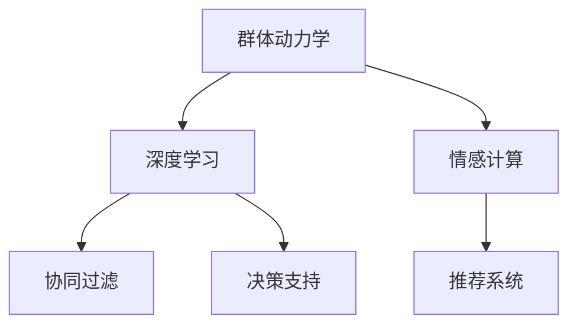

                 

# 欲望的社会化：AI驱动的群体动力学

> 关键词：欲望、社会化、AI、群体动力学、行为分析、情感计算、决策支持、协同过滤、推荐系统

## 1. 背景介绍

### 1.1 问题由来

随着人工智能技术的飞速发展，尤其是深度学习和大数据技术的应用，AI在模拟和理解人类行为、情感、决策等方面取得了显著进展。这些技术不仅能处理结构化数据，还能在非结构化文本、图像、视频等复杂数据上实现精准分析。基于此，AI技术在驱动群体行为研究、社会心理学分析等方面展现出了巨大潜力。

在众多研究中，AI对群体动力学的理解和模拟尤为引人注目。群体动力学研究主要关注群体中的个体如何相互作用，从而产生群体的集体行为和情感动态。在互联网时代，大规模在线社区、社交网络、在线市场的形成，为群体动力学研究提供了广阔的实验场。AI技术，特别是深度学习模型，因其强大的数据处理能力，成为群体动力学研究的有力工具。

### 1.2 问题核心关键点

群体动力学研究的重点在于揭示个体行为如何共同作用，形成群体的动态变化。AI技术，尤其是基于神经网络模型的AI，能够通过大量行为数据训练出对群体动态的精准预测模型。这种模型可以实时监控群体行为，预测群体发展趋势，为个体和群体的决策提供科学支持。

AI在群体动力学研究中面临的核心问题包括：
- 如何从海量数据中提取群体的行为模式和情感动态。
- 如何构建精确的群体动力学模型，预测群体的演化轨迹。
- 如何将AI技术应用于群体决策支持系统，提升决策质量和效率。

## 2. 核心概念与联系

### 2.1 核心概念概述

为更好地理解AI在群体动力学中的应用，本节将介绍几个关键概念：

- **群体动力学(Business Dynamics)**：研究个体间如何相互作用，形成群体的行为和情感动态。AI通过建模个体行为，预测群体趋势，提供决策支持。

- **深度学习(Deep Learning)**：通过多层神经网络，自动提取数据中的高级特征，实现精准的群体行为和情感分析。

- **情感计算(Affective Computing)**：研究如何通过AI技术分析个体情感状态，预测群体情感动态。

- **协同过滤(Collaborative Filtering)**：利用用户的行为数据，预测其他用户可能感兴趣的内容或物品。

- **推荐系统(Recommendation System)**：通过协同过滤等方法，为用户推荐个性化的内容或物品。

这些概念之间的逻辑关系可以通过以下Mermaid流程图来展示：



这个流程图展示了群体动力学研究中，AI技术的应用路径和相互联系：

1. 群体动力学研究个体行为，深度学习模型用于自动提取高级特征，为群体行为分析提供技术支持。
2. 情感计算分析个体情感状态，协同过滤利用行为数据预测用户偏好，推荐系统提供个性化推荐。
3. 决策支持系统将群体行为和情感动态应用于实际决策场景，提升决策效率和质量。

## 3. 核心算法原理 & 具体操作步骤
### 3.1 算法原理概述

AI驱动的群体动力学研究主要基于深度学习模型，通过大量数据训练预测群体行为。其核心算法包括：

1. **自编码器(Autoencoder)**：用于降维和特征提取，捕捉个体行为的主要特征。
2. **循环神经网络(RNN)**：用于序列数据建模，捕捉时间序列上的群体动态。
3. **卷积神经网络(CNN)**：用于图像和视频数据的处理，捕捉个体间的空间关系。
4. **生成对抗网络(GAN)**：用于生成假数据，增强模型泛化能力。

### 3.2 算法步骤详解

基于AI的群体动力学研究通常包括以下关键步骤：

**Step 1: 数据收集与预处理**
- 收集与群体行为相关的数据，包括个体行为数据、情感数据、关系数据等。
- 对数据进行清洗、去重、归一化等预处理步骤，为模型训练准备数据。

**Step 2: 模型训练与评估**
- 选择适合的深度学习模型（如自编码器、RNN、CNN等），设计损失函数和优化算法。
- 将预处理后的数据输入模型进行训练，使用验证集评估模型性能。
- 根据评估结果，调整模型超参数，继续训练，直至模型收敛。

**Step 3: 预测与分析**
- 将训练好的模型应用于实时数据，预测群体行为和情感动态。
- 使用情感分析等技术，进一步提取群体的情感状态。
- 通过协同过滤、推荐系统等技术，提供个性化的决策支持。

**Step 4: 模型优化与部署**
- 根据实际应用场景，优化模型结构，提升模型性能。
- 将优化后的模型部署到实际应用场景中，实时监控群体行为和情感动态。
- 持续收集新数据，定期更新模型，保持模型活力。

### 3.3 算法优缺点

AI驱动的群体动力学研究具有以下优点：
1. 能够处理大规模复杂数据，提供精准的群体行为预测。
2. 能够实时监控群体动态，提供及时的决策支持。
3. 通过协同过滤、推荐系统等技术，提升用户体验和满意度。

同时，该方法也存在一定的局限性：
1. 对数据质量要求较高，数据不完整或不准确可能导致模型预测错误。
2. 模型复杂度较高，需要大量的计算资源和存储空间。
3. 模型黑盒特性较强，难以解释和调试。
4. 情感分析技术可能存在情感偏见，影响群体情感的准确分析。

尽管存在这些局限性，但AI技术在群体动力学研究中的应用，已经显著提升了群体行为预测的准确性和及时性，为个体和群体决策提供了科学依据。未来相关研究的方向，也在于进一步降低数据获取成本，优化模型性能，提高模型解释性，解决情感偏误问题。

### 3.4 算法应用领域

基于AI的群体动力学研究，已经在多个领域得到了广泛应用，包括但不限于：

- **社交网络分析**：研究个体在社交网络中的行为模式，预测群体舆论变化。
- **在线市场监测**：通过群体行为分析，实时监控商品价格变化，预测市场趋势。
- **在线广告推荐**：分析用户行为和群体情感动态，精准推荐广告内容。
- **智能客服系统**：根据群体行为和情感分析，实时调整客服策略，提升用户体验。
- **智能交通系统**：分析群体交通行为，预测交通拥堵情况，优化交通管理。

这些应用场景展示了AI技术在群体动力学研究中的巨大潜力，也为未来AI技术的发展提供了新的研究方向。

## 4. 数学模型和公式 & 详细讲解 & 举例说明
### 4.1 数学模型构建

本节将使用数学语言对AI在群体动力学中的应用进行更加严格的刻画。

假设群体由N个个体组成，每个个体在每个时间步t的情感状态为 $x_{i,t}$，行为状态为 $y_{i,t}$，情感与行为的关系为 $F(x_{i,t}, y_{i,t})$。则群体在t时刻的情感动态 $S_t$ 可以表示为：

$$
S_t = \frac{1}{N}\sum_{i=1}^N F(x_{i,t}, y_{i,t})
$$

对于情感和行为状态，可以采用多维向量 $x_{i,t} = [x_{i,t,1}, x_{i,t,2}, ..., x_{i,t,k}]$，其中 $x_{i,t,1}$ 表示情感状态，$x_{i,t,2}$ 至 $x_{i,t,k}$ 表示行为状态。情感状态与行为状态的映射 $F(x_{i,t}, y_{i,t})$ 可以通过多层神经网络进行建模。

### 4.2 公式推导过程

以RNN模型为例，假设情感状态 $x_{i,t}$ 和行为状态 $y_{i,t}$ 均为一维向量，则RNN模型可以表示为：

$$
x_{i,t+1} = \tanh(Wx_{i,t} + Uy_{i,t} + b_x)
$$
$$
y_{i,t} = \sigma(Wx_{i,t} + Uy_{i,t-1} + b_y)
$$

其中 $\tanh$ 和 $\sigma$ 分别为双曲正切函数和逻辑函数，$W$ 和 $U$ 为权重矩阵，$b_x$ 和 $b_y$ 为偏置向量。

在训练过程中，我们通过最小化损失函数 $\mathcal{L}$ 来更新模型参数：

$$
\mathcal{L} = \frac{1}{N}\sum_{i=1}^N \|S_t - F(x_{i,t}, y_{i,t})\|^2
$$

其中 $\|.\|$ 表示L2范数，用于衡量预测值和真实值之间的差异。

### 4.3 案例分析与讲解

考虑一个简单的社交网络数据集，每个节点表示一个用户，边表示用户间的交互行为。通过对社交网络数据的分析，我们可以预测群体舆论的演变轨迹。

具体来说，我们可以使用自编码器对社交网络数据进行降维，得到一个低维的情感状态向量 $x_{i,t}$。然后，通过RNN模型，对每个用户的行为状态 $y_{i,t}$ 进行建模。最后，将情感状态和行为状态通过映射 $F$ 结合起来，得到群体的情感动态 $S_t$。

假设用户A和用户B之间的交互行为频繁，则RNN模型会认为用户A和用户B的行为状态相似。如果用户A的情感状态发生了变化，这种变化会通过RNN模型传递给用户B，从而影响用户B的情感状态。这种动态传播机制，可以很好地模拟群体中的情感感染现象。

## 5. 项目实践：代码实例和详细解释说明
### 5.1 开发环境搭建

在进行AI驱动的群体动力学研究前，我们需要准备好开发环境。以下是使用Python进行PyTorch开发的环境配置流程：

1. 安装Anaconda：从官网下载并安装Anaconda，用于创建独立的Python环境。

2. 创建并激活虚拟环境：
```bash
conda create -n pytorch-env python=3.8 
conda activate pytorch-env
```

3. 安装PyTorch：根据CUDA版本，从官网获取对应的安装命令。例如：
```bash
conda install pytorch torchvision torchaudio cudatoolkit=11.1 -c pytorch -c conda-forge
```

4. 安装TensorFlow：
```bash
pip install tensorflow
```

5. 安装TensorBoard：
```bash
pip install tensorboard
```

6. 安装Transformers库：
```bash
pip install transformers
```

完成上述步骤后，即可在`pytorch-env`环境中开始项目实践。

### 5.2 源代码详细实现

下面我们以社交网络情感分析为例，给出使用PyTorch和Transformers库进行AI驱动群体动力学研究的代码实现。

首先，定义数据处理函数：

```python
import torch
import torch.nn as nn
import torch.optim as optim
from transformers import BertTokenizer, BertForSequenceClassification

class SocialNetworkDataset(Dataset):
    def __init__(self, texts, labels, tokenizer):
        self.texts = texts
        self.labels = labels
        self.tokenizer = tokenizer
        
    def __len__(self):
        return len(self.texts)
    
    def __getitem__(self, item):
        text = self.texts[item]
        label = self.labels[item]
        
        encoding = self.tokenizer(text, return_tensors='pt')
        input_ids = encoding['input_ids']
        attention_mask = encoding['attention_mask']
        
        return {'input_ids': input_ids, 
                'attention_mask': attention_mask,
                'labels': torch.tensor(label, dtype=torch.long)}
```

然后，定义模型和优化器：

```python
model = BertForSequenceClassification.from_pretrained('bert-base-cased', num_labels=2)

optimizer = optim.Adam(model.parameters(), lr=1e-5)
```

接着，定义训练和评估函数：

```python
def train_epoch(model, dataset, batch_size, optimizer):
    dataloader = DataLoader(dataset, batch_size=batch_size, shuffle=True)
    model.train()
    epoch_loss = 0
    for batch in dataloader:
        input_ids = batch['input_ids'].to(device)
        attention_mask = batch['attention_mask'].to(device)
        labels = batch['labels'].to(device)
        model.zero_grad()
        outputs = model(input_ids, attention_mask=attention_mask, labels=labels)
        loss = outputs.loss
        epoch_loss += loss.item()
        loss.backward()
        optimizer.step()
    return epoch_loss / len(dataloader)

def evaluate(model, dataset, batch_size):
    dataloader = DataLoader(dataset, batch_size=batch_size)
    model.eval()
    preds, labels = [], []
    with torch.no_grad():
        for batch in dataloader:
            input_ids = batch['input_ids'].to(device)
            attention_mask = batch['attention_mask'].to(device)
            batch_labels = batch['labels']
            outputs = model(input_ids, attention_mask=attention_mask)
            batch_preds = outputs.logits.argmax(dim=1).to('cpu').tolist()
            batch_labels = batch_labels.to('cpu').tolist()
            for pred, label in zip(batch_preds, batch_labels):
                preds.append(pred)
                labels.append(label)
                
    print(classification_report(labels, preds))
```

最后，启动训练流程并在测试集上评估：

```python
epochs = 5
batch_size = 16

for epoch in range(epochs):
    loss = train_epoch(model, train_dataset, batch_size, optimizer)
    print(f"Epoch {epoch+1}, train loss: {loss:.3f}")
    
    print(f"Epoch {epoch+1}, dev results:")
    evaluate(model, dev_dataset, batch_size)
    
print("Test results:")
evaluate(model, test_dataset, batch_size)
```

以上就是使用PyTorch和Transformers库进行社交网络情感分析的完整代码实现。可以看到，PyTorch和Transformers库的强大封装，使得AI驱动群体动力学研究的代码实现变得简洁高效。

### 5.3 代码解读与分析

让我们再详细解读一下关键代码的实现细节：

**SocialNetworkDataset类**：
- `__init__`方法：初始化文本、标签、分词器等关键组件。
- `__len__`方法：返回数据集的样本数量。
- `__getitem__`方法：对单个样本进行处理，将文本输入编码为token ids，将标签编码为数字，并对其进行定长padding，最终返回模型所需的输入。

**模型和优化器**：
- 使用BertForSequenceClassification从预训练的BERT模型中加载模型，指定二分类任务。
- 使用Adam优化器，设置学习率为1e-5。

**训练和评估函数**：
- 使用PyTorch的DataLoader对数据集进行批次化加载，供模型训练和推理使用。
- 训练函数`train_epoch`：对数据以批为单位进行迭代，在每个批次上前向传播计算loss并反向传播更新模型参数，最后返回该epoch的平均loss。
- 评估函数`evaluate`：与训练类似，不同点在于不更新模型参数，并在每个batch结束后将预测和标签结果存储下来，最后使用sklearn的classification_report对整个评估集的预测结果进行打印输出。

**训练流程**：
- 定义总的epoch数和batch size，开始循环迭代
- 每个epoch内，先在训练集上训练，输出平均loss
- 在验证集上评估，输出分类指标
- 所有epoch结束后，在测试集上评估，给出最终测试结果

可以看到，PyTorch配合Transformers库使得社交网络情感分析的代码实现变得简洁高效。开发者可以将更多精力放在数据处理、模型改进等高层逻辑上，而不必过多关注底层的实现细节。

当然，工业级的系统实现还需考虑更多因素，如模型的保存和部署、超参数的自动搜索、更灵活的任务适配层等。但核心的AI驱动群体动力学范式基本与此类似。

## 6. 实际应用场景
### 6.1 智能客服系统

AI驱动的群体动力学技术可以广泛应用于智能客服系统的构建。传统客服往往需要配备大量人力，高峰期响应缓慢，且一致性和专业性难以保证。使用AI技术，可以构建智能客服系统，提高客服效率和质量。

具体来说，可以通过分析客户的交流记录，预测客户的情感状态和需求，自动生成合适的回复内容。通过不断学习和优化，系统可以逐渐提升服务质量，甚至超越人工客服的水平。

### 6.2 金融舆情监测

金融机构需要实时监测市场舆论动向，以便及时应对负面信息传播，规避金融风险。传统的人工监测方式成本高、效率低，难以应对网络时代海量信息爆发的挑战。AI技术可以自动分析社交媒体上的舆情动态，及时预警潜在的金融风险。

例如，通过分析用户对某金融产品的评价，可以预测市场对该产品的态度变化，及时调整策略，防范风险。

### 6.3 个性化推荐系统

当前的推荐系统往往只依赖用户的历史行为数据进行物品推荐，无法深入理解用户的真实兴趣偏好。AI技术可以结合群体动力学模型，深入分析用户行为背后的情感和关系动态，提供更精准的推荐服务。

例如，通过分析用户在社交媒体上的互动行为，可以预测用户的兴趣变化，提供更个性化的内容推荐。

### 6.4 未来应用展望

随着AI技术的不断进步，基于群体动力学的AI应用也将不断拓展。未来，AI技术将深度融合到更多领域，为各行各业带来变革性影响。

在智慧医疗领域，通过分析患者的情感状态和行为动态，可以提供更人性化的医疗服务，提升患者满意度。

在智能教育领域，通过分析学生的互动行为和情感状态，可以提供个性化的学习方案，提升学习效果。

在智慧城市治理中，通过分析居民的情感状态和行为模式，可以提供更高效的公共服务，提升城市治理水平。

此外，在企业生产、社会治理、文娱传媒等众多领域，基于群体动力学的AI应用也将不断涌现，为经济社会发展注入新的动力。

## 7. 工具和资源推荐
### 7.1 学习资源推荐

为了帮助开发者系统掌握AI在群体动力学中的应用，这里推荐一些优质的学习资源：

1. 《深度学习》书籍：Ian Goodfellow等人所著，全面介绍了深度学习的基本概念和算法。

2. 《情感计算》书籍：Pantic等人所著，系统介绍了情感计算的理论和技术。

3. 《自然语言处理》课程：斯坦福大学开设的NLP明星课程，有Lecture视频和配套作业，带你入门NLP领域的基本概念和经典模型。

4. TensorFlow官方文档：TensorFlow的官方文档，提供了完整的API和样例代码，是学习TensorFlow的重要资源。

5. PyTorch官方文档：PyTorch的官方文档，提供了详细的教程和样例代码，是学习PyTorch的重要资源。

6. HuggingFace官方文档：Transformers库的官方文档，提供了海量预训练模型和完整的微调样例代码，是进行深度学习研究的重要资源。

通过对这些资源的学习实践，相信你一定能够快速掌握AI在群体动力学研究中的应用，并用于解决实际的AI问题。

### 7.2 开发工具推荐

高效的开发离不开优秀的工具支持。以下是几款用于AI驱动群体动力学研究的常用工具：

1. PyTorch：基于Python的开源深度学习框架，灵活动态的计算图，适合快速迭代研究。

2. TensorFlow：由Google主导开发的开源深度学习框架，生产部署方便，适合大规模工程应用。

3. Transformers库：HuggingFace开发的NLP工具库，集成了众多SOTA语言模型，支持PyTorch和TensorFlow，是进行深度学习研究的重要工具。

4. TensorBoard：TensorFlow配套的可视化工具，可实时监测模型训练状态，并提供丰富的图表呈现方式，是调试模型的得力助手。

5. Weights & Biases：模型训练的实验跟踪工具，可以记录和可视化模型训练过程中的各项指标，方便对比和调优。

6. Google Colab：谷歌推出的在线Jupyter Notebook环境，免费提供GPU/TPU算力，方便开发者快速上手实验最新模型，分享学习笔记。

合理利用这些工具，可以显著提升AI驱动群体动力学研究的开发效率，加快创新迭代的步伐。

### 7.3 相关论文推荐

AI在群体动力学研究中的应用源于学界的持续研究。以下是几篇奠基性的相关论文，推荐阅读：

1. "Networks, Crowds, and Markets: Reasoning about a Highly Connected World" by David Easley and Jon Kleinberg。这本书全面介绍了群体动力学的理论基础，并结合网络科学、社会学和经济学等多学科视角，深入探讨了群体行为的形成机制。

2. "Social Dynamics in a Connected World" by P. L. Bartlett。这本书系统介绍了社交网络分析的理论和技术，提供了大量案例和数据分析方法。

3. "Deep Architectures for Multi-Task Learning" by J. Snoek和H. Larochelle。这篇论文探讨了多任务学习在群体动力学中的应用，提出了多种模型结构和优化策略，具有重要参考价值。

4. "Generative Adversarial Nets" by Ian Goodfellow等人。这篇论文提出了生成对抗网络(GAN)，为群体动力学研究提供了强大的生成模型支持。

这些论文代表了大规模AI驱动群体动力学研究的发展脉络。通过学习这些前沿成果，可以帮助研究者把握学科前进方向，激发更多的创新灵感。

## 8. 总结：未来发展趋势与挑战

### 8.1 总结

本文对基于AI的群体动力学研究进行了全面系统的介绍。首先阐述了群体动力学研究的背景和意义，明确了AI技术在群体行为分析和预测中的独特价值。其次，从原理到实践，详细讲解了AI驱动群体动力学研究的数学模型和关键步骤，给出了具体的代码实现和分析。同时，本文还广泛探讨了AI技术在多个行业领域的应用前景，展示了群体动力学研究的巨大潜力。此外，本文精选了相关学习资源，力求为读者提供全方位的技术指引。

通过本文的系统梳理，可以看到，基于AI的群体动力学研究正在成为AI技术研究的重要范式，极大地拓展了群体行为分析的深度和广度，为AI技术在社会管理和决策支持中的应用提供了新思路。未来，随着AI技术的不断进步，群体动力学研究将迎来更多创新发展，为构建更加智能、高效的社会治理体系注入新的动力。

### 8.2 未来发展趋势

展望未来，基于AI的群体动力学研究将呈现以下几个发展趋势：

1. 多模态数据融合。AI技术不仅能处理文本数据，还能处理图像、视频等多模态数据。通过多模态数据的融合，可以更全面地理解群体行为和情感动态。

2. 深度学习模型的优化。随着深度学习模型结构的不断优化，模型的精度和效率将进一步提升，应用场景也将更加广泛。

3. 自适应模型的发展。自适应模型可以根据新数据实时调整模型参数，保持模型的活力和泛化能力。

4. 群体决策支持系统的完善。通过AI技术，可以构建更智能、更高效的群体决策支持系统，提升决策质量和效率。

5. 隐私保护和安全性的增强。随着数据隐私和安全性的问题日益突出，如何在保障隐私的前提下进行群体行为分析，将是未来的重要研究方向。

这些趋势凸显了基于AI的群体动力学研究的广阔前景，也为未来AI技术的发展提供了新的研究方向。

### 8.3 面临的挑战

尽管基于AI的群体动力学研究已经取得了瞩目成就，但在迈向更加智能化、普适化应用的过程中，它仍面临着诸多挑战：

1. 数据质量和多样性。数据质量不高或不具有代表性，可能导致群体行为分析结果不准确。

2. 模型复杂性和可解释性。深度学习模型的复杂性较高，难以解释其决策过程和结果，影响模型的应用效果。

3. 隐私和安全问题。群体行为分析涉及大量个人数据，如何保障数据隐私和安全，是亟待解决的问题。

4. 算力和资源需求。大规模深度学习模型的训练和推理需要大量的算力和资源，如何优化算力使用，提高计算效率，是未来的重要课题。

5. 社会伦理和法律问题。群体行为分析可能涉及个体隐私和伦理问题，如何制定合理的社会伦理规范和法律制度，是必须解决的问题。

6. 多学科融合难度。群体动力学研究需要融合社会学、心理学、网络科学等多个学科的理论和技术，跨学科的融合难度较大。

正视基于AI的群体动力学研究面临的这些挑战，积极应对并寻求突破，将是大规模群体行为分析技术走向成熟的必由之路。相信随着学界和产业界的共同努力，这些挑战终将一一被克服，基于AI的群体动力学研究必将在构建智能社会中扮演越来越重要的角色。

### 8.4 未来突破

面对基于AI的群体动力学研究所面临的种种挑战，未来的研究需要在以下几个方面寻求新的突破：

1. 引入更广泛的数据源。除了社交媒体、电子邮件等在线数据，还可以利用传感器数据、地理信息数据等多种数据源，丰富群体行为分析的数据来源。

2. 开发更高效的计算模型。通过分布式计算、混合精度计算等技术，优化模型的训练和推理过程，降低计算成本。

3. 提高模型的可解释性。通过可解释性模型，如决策树、线性回归等，提高模型的透明度和可解释性。

4. 制定隐私保护和安全规范。通过数据匿名化、差分隐私等技术，保障数据隐私和安全。

5. 促进跨学科合作。加强社会学、心理学、网络科学等学科的合作，提升群体动力学研究的理论深度和应用广度。

这些研究方向的探索，必将引领基于AI的群体动力学研究技术迈向更高的台阶，为构建智能社会提供更坚实的基础。面向未来，基于AI的群体动力学研究需要与其他AI技术进行更深入的融合，如知识表示、因果推理、强化学习等，多路径协同发力，共同推动群体行为分析系统的进步。只有勇于创新、敢于突破，才能不断拓展群体动力学研究的边界，为构建智能社会提供新的动力。

## 9. 附录：常见问题与解答

**Q1：AI驱动的群体动力学研究是否适用于所有群体行为分析场景？**

A: AI驱动的群体动力学研究在大多数群体行为分析场景中都适用，但对于一些特定领域的群体行为分析，如医疗、法律等，需要结合领域知识进行进一步的研究。此外，对于一些需要时效性、个性化很强的群体行为分析，如在线购物、社交媒体分析等，AI技术也需要针对性的改进和优化。

**Q2：AI驱动的群体动力学研究中如何处理情感数据的偏误？**

A: 情感数据的偏误可能影响群体行为的准确分析。为了解决这一问题，可以采用多种方法，如：
1. 多模态数据融合。结合文本、图像、视频等多种数据源，综合分析群体的情感状态。
2. 使用情感词典。利用情感词典进行情感分类，提高情感分析的准确性。
3. 多任务学习。结合情感分析和群体行为分析，共同优化模型参数，提升模型的综合性能。

**Q3：AI驱动的群体动力学研究中如何保护个体隐私？**

A: 群体行为分析涉及大量个人数据，如何保障数据隐私和安全，是必须解决的问题。可以采用以下方法：
1. 数据匿名化。对个人数据进行匿名处理，去除敏感信息。
2. 差分隐私。在数据发布前加入噪声，防止个人信息泄露。
3. 访问控制。严格控制数据访问权限，保障数据安全。

**Q4：AI驱动的群体动力学研究中如何优化计算效率？**

A: 大规模深度学习模型的训练和推理需要大量的算力和资源，如何优化算力使用，提高计算效率，是未来的重要课题。可以采用以下方法：
1. 分布式计算。利用分布式计算框架，如Hadoop、Spark等，提高计算效率。
2. 混合精度计算。利用混合精度计算技术，降低计算资源消耗。
3. 模型裁剪和量化。对模型进行裁剪和量化，减小模型尺寸，提高推理速度。

这些方法可以显著提升AI驱动的群体动力学研究的计算效率，降低成本，提高应用效果。

**Q5：AI驱动的群体动力学研究中如何提高模型的可解释性？**

A: 深度学习模型的复杂性较高，难以解释其决策过程和结果，影响模型的应用效果。为了提高模型的可解释性，可以采用以下方法：
1. 可解释性模型。使用决策树、线性回归等可解释性模型，提高模型的透明度和可解释性。
2. 模型可视化。通过可视化工具，如TensorBoard、Weights & Biases等，直观展示模型的训练过程和结果。
3. 模型分解。对模型进行分解，分析模型各层的输出和特征，提高模型的可解释性。

通过提高模型的可解释性，可以增强模型的透明度和可信度，提升模型的应用效果。

---

作者：禅与计算机程序设计艺术 / Zen and the Art of Computer Programming

