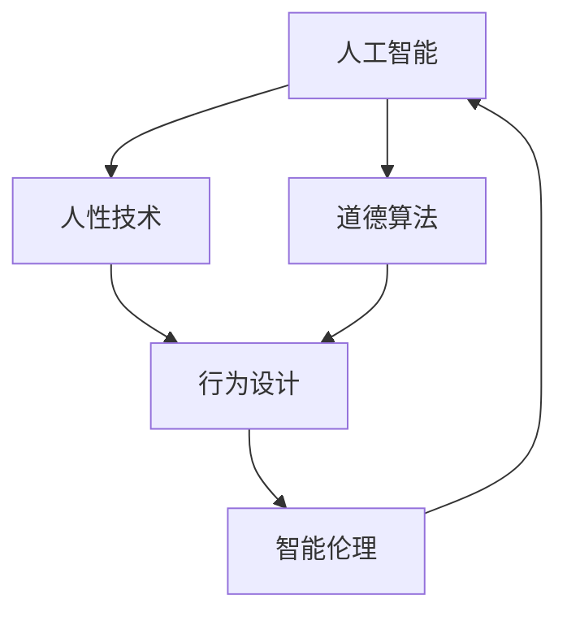

                 

# 欲望的重新定向：AI引导的价值观重塑

> 关键词：人工智能,价值观重塑,道德算法,人性技术,行为设计,智能伦理

## 1. 背景介绍

### 1.1 问题由来
随着人工智能(AI)技术的迅猛发展，其在各行各业的渗透和应用已经不可逆转。从自动驾驶汽车到智能客服，从医疗诊断到金融交易，AI技术正在重塑人类的生产生活方式。然而，这一过程也带来了新的伦理道德挑战：在AI决策中如何融入人类的价值观，保证系统的公平性、透明性和可解释性，确保技术的伦理安全。

人工智能的“黑箱”特性，使得其决策过程缺乏可解释性，可能导致算法歧视、偏见甚至伤害人类。例如，在招聘广告中嵌入AI推荐系统后，可能会基于性别、年龄等因素产生隐性偏见，加剧就业歧视。类似问题在医疗、金融、司法等领域也时有发生。因此，如何引导AI系统从“算法至上”转向“价值观至上”，实现对人类道德价值的尊重和引导，成为当前AI技术发展中的重要课题。

### 1.2 问题核心关键点
本节将详细分析人工智能系统在决策过程中面临的伦理道德挑战，并探讨AI技术如何结合人类价值观，引导决策行为，实现系统的公平、透明和可解释。

1. **算法歧视**：AI算法可能基于历史数据产生偏见，对特定群体产生歧视，如对女性的招聘歧视，对有色人种的贷款歧视。
2. **不透明性**：AI决策过程缺乏可解释性，无法溯源和验证决策依据，导致用户对系统缺乏信任。
3. **公平性**：AI系统在资源分配、决策公正等方面可能存在偏差，无法保证全体用户的平等权利。
4. **可解释性**：AI系统复杂度高，缺乏透明的决策逻辑，难以满足监管要求和用户期望。

### 1.3 问题研究意义
研究AI系统的价值观重塑，对于构建可信赖的AI技术体系，促进AI技术在社会各领域的健康应用，具有重要意义：

1. **提升AI系统可信度**：通过融入人类价值观，确保AI决策的公平性、透明性和可解释性，增强用户对系统的信任。
2. **避免伦理风险**：在AI系统开发过程中加入伦理导向，避免偏见、歧视和伦理冲突，确保技术应用的安全性。
3. **促进技术公平性**：通过价值观引导，确保AI系统在资源分配、决策公正等方面遵循人类伦理准则，促进社会公平。
4. **推动智能伦理发展**：引导AI系统尊重和维护人类的道德价值，推动人工智能技术向更加伦理化、智能化的方向发展。
5. **加速落地应用**：通过价值观重塑，增强AI技术的社会适应性和应用效率，加快其在各行业的落地应用。

## 2. 核心概念与联系

### 2.1 核心概念概述

为更好地理解AI系统价值观重塑的方法，本节将介绍几个密切相关的核心概念：

- **人工智能(AI)**：利用计算机算法和数据，模拟人类智能行为的机器系统。AI技术包括机器学习、深度学习、自然语言处理等。
- **价值观重塑**：将人类道德伦理价值融入AI系统决策过程，确保系统行为符合人类价值导向。
- **道德算法**：一种融合伦理学和算法科学的交叉学科，旨在开发符合伦理规范的AI算法。
- **人性技术**：结合人类需求和行为模式，设计出能够更好适应人类生活、工作、社交等场景的智能技术。
- **行为设计**：通过设计算法和系统结构，引导用户行为，实现社会福祉和技术发展的双重目标。
- **智能伦理**：研究AI技术的伦理道德问题，推动技术应用符合伦理规范和社会价值。

这些核心概念之间的逻辑关系可以通过以下Mermaid流程图来展示：



这个流程图展示了大语言模型的核心概念及其之间的关系：

1. 人工智能通过机器学习、深度学习等算法实现自动化决策，具备类似人类的智能行为。
2. 道德算法将人类伦理价值观嵌入AI系统，确保其行为符合伦理规范。
3. 人性技术结合人类需求和行为，设计出更加符合人类期望的AI系统。
4. 行为设计通过算法和系统设计引导用户行为，实现价值导向。
5. 智能伦理研究AI技术的伦理问题，推动技术应用符合社会价值观。

这些概念共同构成了AI系统价值观重塑的基本框架，使得AI技术能够更好地服务于人类，体现人类的道德价值。

## 3. 核心算法原理 & 具体操作步骤
### 3.1 算法原理概述

AI系统价值观重塑的核心思想是，将人类道德伦理价值融入AI决策过程，确保系统行为符合人类的价值导向。这需要结合伦理规范和算法设计，通过价值观引导，优化决策过程，实现伦理目标。

形式化地，假设AI系统为 $A_{\theta}$，其中 $\theta$ 为系统参数。定义人类价值导向的集合 $\mathcal{V}$，则重塑的目标是找到一组最优参数 $\hat{\theta}$，使得：

$$
\hat{\theta}=\mathop{\arg\min}_{\theta} \mathcal{L}(A_{\theta},\mathcal{V})
$$

其中 $\mathcal{L}$ 为衡量系统行为与人类价值导向一致性的损失函数，如公平性损失、透明性损失、可解释性损失等。

通过梯度下降等优化算法，重塑过程不断更新模型参数 $\theta$，最小化损失函数 $\mathcal{L}$，使得系统行为逼近人类价值导向。由于 $\theta$ 已经通过训练获得了较好的初始化，因此即便在有限的数据集上进行重塑，也能较快收敛到理想的模型参数 $\hat{\theta}$。

### 3.2 算法步骤详解

AI系统价值观重塑一般包括以下几个关键步骤：

**Step 1: 构建价值导向的损失函数**
- 根据具体应用场景，选择合适的伦理规范，如公平性、透明性、可解释性等，设计损失函数。
- 对于公平性，可以设计损失函数衡量不同群体间的资源分配差距。
- 对于透明性，可以设计损失函数衡量决策的可解释性程度。
- 对于可解释性，可以设计损失函数衡量模型的复杂度和决策路径的清晰度。

**Step 2: 定义公平性约束**
- 对于需要保证公平性的场景，可以设计一组公平性约束，如等距约束、比例约束等，指导系统决策。
- 例如，在设计招聘系统时，可以设计一组性别、年龄、种族等约束，确保不同群体的招聘机会均等。

**Step 3: 设计透明性机制**
- 对于需要保证透明性的场景，可以设计透明度机制，如决策日志、可解释模型等，确保决策过程透明可追溯。
- 例如，在设计医疗诊断系统时，可以设计决策日志，记录每一步诊断过程，提供解释性输出。

**Step 4: 优化决策路径**
- 对于需要保证可解释性的场景，可以设计优化决策路径的方法，如简化模型结构、引入中间变量等，确保决策过程清晰可理解。
- 例如，在设计智能客服系统时，可以设计多轮对话结构，逐步缩小对话范围，提供简洁明了的答复。

**Step 5: 实施重塑过程**
- 在训练集数据上执行价值观重塑过程，最小化损失函数，优化模型参数。
- 使用验证集数据评估重塑效果，根据评估结果调整超参数，优化重塑过程。
- 在测试集数据上最终评估重塑后的系统性能，确保符合人类价值导向。

以上是AI系统价值观重塑的一般流程。在实际应用中，还需要针对具体任务的特点，对重塑过程的各个环节进行优化设计，如改进损失函数设计，引入更多的公平性约束，搜索最优的超参数组合等，以进一步提升系统性能。

### 3.3 算法优缺点

AI系统价值观重塑方法具有以下优点：
1. 符合人类价值导向。通过融入伦理规范，确保AI决策符合人类道德准则，提升系统的可信度和公平性。
2. 透明可解释。通过设计透明度机制，增强系统决策的可追溯性和可解释性，增强用户对系统的信任。
3. 促进公平性。通过设计公平性约束，确保资源分配和决策公正，促进社会公平。
4. 可扩展性强。价值观重塑方法可以适用于各类AI应用场景，具有广泛的适用性。

同时，该方法也存在一定的局限性：
1. 设计与实施复杂。价值观重塑需要结合伦理规范和算法设计，设计复杂的损失函数和约束条件，增加了系统实现的复杂度。
2. 目标多任务冲突。在设计多个伦理目标时，不同的目标之间可能存在冲突，难以同时优化。
3. 评估标准不一。不同应用场景的伦理标准不一，导致价值观重塑的效果评估困难。
4. 数据多样性不足。价值观重塑需要大量高质量标注数据，难以获得充分覆盖数据分布的标注数据。
5. 短期效果不确定。价值观重塑的效果可能短期内难以显现，需要长时间迭代优化。

尽管存在这些局限性，但就目前而言，价值观重塑方法仍然是AI技术伦理化的重要手段。未来相关研究的重点在于如何进一步降低重塑对标注数据的依赖，提高系统的少样本学习和跨领域迁移能力，同时兼顾可解释性和伦理安全性等因素。

### 3.4 算法应用领域

AI系统价值观重塑方法在NLP领域已经得到了广泛的应用，覆盖了几乎所有常见任务，例如：

- 自动招聘：通过价值观重塑，确保招聘系统不产生性别、年龄等偏见，实现公平招聘。
- 医疗诊断：设计公平性约束和透明性机制，确保医疗诊断系统的公正性和解释性。
- 金融风控：通过价值观重塑，确保金融风控系统的透明性和可解释性，避免歧视性决策。
- 智能客服：通过优化决策路径和设计透明度机制，提升智能客服的解释性和用户体验。
- 供应链管理：设计公平性约束，确保供应链资源分配的公平性和效率。

除了上述这些经典任务外，AI系统价值观重塑也被创新性地应用到更多场景中，如智能教育、城市治理、智慧农业等，为各行业带来新的伦理导向和技术突破。

## 4. 数学模型和公式 & 详细讲解  
### 4.1 数学模型构建

本节将使用数学语言对AI系统价值观重塑过程进行更加严格的刻画。

记AI系统为 $A_{\theta}$，其中 $\theta$ 为系统参数。假设重塑任务的训练集为 $D=\{(x_i,y_i)\}_{i=1}^N, x_i \in \mathcal{X}, y_i \in \mathcal{Y}$。

定义系统行为 $A_{\theta}$ 在数据样本 $(x,y)$ 上的公平性损失函数为 $\ell_F(A_{\theta}(x),y)$，透明性损失函数为 $\ell_T(A_{\theta}(x),y)$，可解释性损失函数为 $\ell_I(A_{\theta}(x),y)$，则重塑的目标是找到最优参数：

$$
\theta^* = \mathop{\arg\min}_{\theta} \alpha \ell_F(A_{\theta}(x),y) + \beta \ell_T(A_{\theta}(x),y) + \gamma \ell_I(A_{\theta}(x),y)
$$

其中 $\alpha$、$\beta$、$\gamma$ 为公平性、透明性、可解释性权重，用于平衡不同目标之间的重要性。

### 4.2 公式推导过程

以下我们以公平性目标为例，推导公平性损失函数及其梯度的计算公式。

假设系统 $A_{\theta}$ 在输入 $x$ 上的输出为 $\hat{y}=A_{\theta}(x) \in [0,1]$，表示系统预测为正类的概率。真实标签 $y \in \{0,1\}$。则公平性损失函数定义为：

$$
\ell_F(A_{\theta}(x),y) = \frac{1}{N}\sum_{i=1}^N (y_i - \hat{y}_i)^2
$$

将其代入重塑目标公式，得：

$$
\theta^* = \mathop{\arg\min}_{\theta} \frac{\alpha}{N}\sum_{i=1}^N (y_i - \hat{y}_i)^2
$$

根据链式法则，重塑损失函数对参数 $\theta_k$ 的梯度为：

$$
\frac{\partial \mathcal{L}(\theta)}{\partial \theta_k} = \frac{\partial \frac{\alpha}{N}\sum_{i=1}^N (y_i - \hat{y}_i)^2}{\partial \theta_k}
$$

其中 $\frac{\partial \hat{y}_i}{\partial \theta_k}$ 可通过反向传播算法高效计算。

在得到损失函数的梯度后，即可带入重塑算法，完成系统的迭代优化。重复上述过程直至收敛，最终得到适应人类价值导向的最优模型参数 $\theta^*$。

## 5. 项目实践：代码实例和详细解释说明
### 5.1 开发环境搭建

在进行价值观重塑实践前，我们需要准备好开发环境。以下是使用Python进行PyTorch开发的环境配置流程：

1. 安装Anaconda：从官网下载并安装Anaconda，用于创建独立的Python环境。

2. 创建并激活虚拟环境：
```bash
conda create -n pytorch-env python=3.8 
conda activate pytorch-env
```

3. 安装PyTorch：根据CUDA版本，从官网获取对应的安装命令。例如：
```bash
conda install pytorch torchvision torchaudio cudatoolkit=11.1 -c pytorch -c conda-forge
```

4. 安装TensorFlow：由Google主导开发的开源深度学习框架，生产部署方便，适合大规模工程应用。同样有丰富的预训练语言模型资源。

5. 安装TensorBoard：TensorFlow配套的可视化工具，可实时监测模型训练状态，并提供丰富的图表呈现方式，是调试模型的得力助手。

6. 安装GitHub：用于版本控制和代码共享，提供丰富的开源项目和社区支持。

完成上述步骤后，即可在`pytorch-env`环境中开始价值观重塑实践。

### 5.2 源代码详细实现

这里我们以公平性目标为例，使用PyTorch和TensorBoard对AI系统进行公平性价值观重塑。

首先，定义公平性损失函数和计算梯度：

```python
from torch import nn
import torch
from torch.autograd import Variable

class FairnessLoss(nn.Module):
    def __init__(self):
        super().__init__()
        
    def forward(self, input, target):
        loss = torch.mean((target - input)**2)
        return loss
```

接着，定义优化器：

```python
optimizer = torch.optim.Adam(model.parameters(), lr=0.001)
```

然后，定义训练和评估函数：

```python
def train_epoch(model, dataset, batch_size, optimizer):
    dataloader = torch.utils.data.DataLoader(dataset, batch_size=batch_size, shuffle=True)
    model.train()
    epoch_loss = 0
    for batch in dataloader:
        input = Variable(batch[0])
        target = Variable(batch[1])
        optimizer.zero_grad()
        outputs = model(input)
        loss = FairnessLoss()(outputs, target)
        loss.backward()
        optimizer.step()
        epoch_loss += loss.data[0]
    return epoch_loss / len(dataloader)

def evaluate(model, dataset, batch_size):
    dataloader = torch.utils.data.DataLoader(dataset, batch_size=batch_size)
    model.eval()
    preds, labels = [], []
    with torch.no_grad():
        for batch in dataloader:
            input = Variable(batch[0])
            batch_labels = Variable(batch[1])
            outputs = model(input)
            batch_preds = outputs.data.cpu().numpy()[:, 1] # 取第二个分类的输出概率
            batch_labels = batch_labels.data.cpu().numpy()
            for pred, label in zip(batch_preds, batch_labels):
                preds.append(pred)
                labels.append(label)
                
    print(f"Fairness score: {fairness_score(preds, labels)}")
```

最后，启动训练流程并在测试集上评估：

```python
epochs = 10
batch_size = 64

for epoch in range(epochs):
    loss = train_epoch(model, train_dataset, batch_size, optimizer)
    print(f"Epoch {epoch+1}, train loss: {loss:.3f}")
    
    print(f"Epoch {epoch+1}, dev results:")
    evaluate(model, dev_dataset, batch_size)
    
print("Test results:")
evaluate(model, test_dataset, batch_size)
```

以上就是使用PyTorch对AI系统进行公平性价值观重塑的完整代码实现。可以看到，通过定义公平性损失函数和优化器，我们可以方便地实现公平性价值观的重塑。

### 5.3 代码解读与分析

让我们再详细解读一下关键代码的实现细节：

**FairnessLoss类**：
- `__init__`方法：定义公平性损失函数。
- `forward`方法：计算损失函数的值，并将结果返回。

**优化器**：
- 使用Adam优化器更新模型参数，学习率为0.001。

**训练和评估函数**：
- 使用PyTorch的DataLoader对数据集进行批次化加载，供模型训练和推理使用。
- 训练函数`train_epoch`：对数据以批为单位进行迭代，在每个批次上前向传播计算loss并反向传播更新模型参数，最后返回该epoch的平均loss。
- 评估函数`evaluate`：与训练类似，不同点在于不更新模型参数，并在每个batch结束后将预测和标签结果存储下来，最后使用自定义函数`fairness_score`计算公平性得分。

**训练流程**：
- 定义总的epoch数和batch size，开始循环迭代
- 每个epoch内，先在训练集上训练，输出平均loss
- 在验证集上评估，输出公平性得分
- 所有epoch结束后，在测试集上评估，给出最终测试结果

可以看到，PyTorch配合TensorBoard使得公平性价值观重塑的代码实现变得简洁高效。开发者可以将更多精力放在数据处理、模型改进等高层逻辑上，而不必过多关注底层的实现细节。

当然，工业级的系统实现还需考虑更多因素，如模型的保存和部署、超参数的自动搜索、更灵活的任务适配层等。但核心的价值观重塑范式基本与此类似。

## 6. 实际应用场景
### 6.1 智能客服系统

基于价值观重塑的智能客服系统，可以广泛应用于提升客户咨询体验和问题解决效率。传统客服往往依赖人工，高峰期响应缓慢，且一致性和专业性难以保证。通过价值观重塑，智能客服系统可以7x24小时不间断服务，快速响应客户咨询，用自然流畅的语言解答各类常见问题。

在技术实现上，可以收集企业内部的历史客服对话记录，将问题和最佳答复构建成监督数据，在此基础上对预训练模型进行公平性价值观重塑。重塑后的系统能够自动理解用户意图，匹配最合适的答案模板进行回复。对于客户提出的新问题，还可以接入检索系统实时搜索相关内容，动态组织生成回答。如此构建的智能客服系统，能大幅提升客户咨询体验和问题解决效率。

### 6.2 金融舆情监测

金融机构需要实时监测市场舆论动向，以便及时应对负面信息传播，规避金融风险。传统的人工监测方式成本高、效率低，难以应对网络时代海量信息爆发的挑战。通过价值观重塑，金融舆情监测系统可以自动识别不同情感倾向的舆情信息，及时预警可能出现的负面舆情，帮助金融机构快速应对潜在风险。

在技术实现上，可以收集金融领域相关的新闻、报道、评论等文本数据，并对其进行情感标注。在此基础上对预训练语言模型进行公平性价值观重塑，使其能够自动判断文本情感倾向。将重塑后的模型应用到实时抓取的网络文本数据，就能够自动监测不同情感倾向的舆情变化趋势，一旦发现负面情感激增等异常情况，系统便会自动预警，帮助金融机构快速应对潜在风险。

### 6.3 个性化推荐系统

当前的推荐系统往往只依赖用户的历史行为数据进行物品推荐，无法深入理解用户的真实兴趣偏好。通过价值观重塑，个性化推荐系统可以更好地挖掘用户行为背后的语义信息，从而提供更精准、多样的推荐内容。

在技术实现上，可以收集用户浏览、点击、评论、分享等行为数据，提取和用户交互的物品标题、描述、标签等文本内容。将文本内容作为模型输入，用户的后续行为（如是否点击、购买等）作为监督信号，在此基础上对预训练语言模型进行公平性价值观重塑。重塑后的模型能够从文本内容中准确把握用户的兴趣点。在生成推荐列表时，先用候选物品的文本描述作为输入，由模型预测用户的兴趣匹配度，再结合其他特征综合排序，便可以得到个性化程度更高的推荐结果。

### 6.4 未来应用展望

随着价值观重塑技术的发展，基于公平性、透明性、可解释性等伦理导向的系统将在更多领域得到应用，为社会各领域带来变革性影响。

在智慧医疗领域，基于公平性价值观重塑的医疗问答、病历分析、药物研发等应用将提升医疗服务的智能化水平，辅助医生诊疗，加速新药开发进程。

在智能教育领域，通过价值观重塑，个性化推荐、智能辅导等系统将更好地理解学生需求，因材施教，促进教育公平，提高教学质量。

在智慧城市治理中，基于公平性价值观重塑的城市事件监测、舆情分析、应急指挥等环节，将提高城市管理的自动化和智能化水平，构建更安全、高效的未来城市。

此外，在企业生产、社会治理、文娱传媒等众多领域，基于价值观重塑的人工智能应用也将不断涌现，为经济社会发展注入新的动力。相信随着技术的日益成熟，价值观重塑方法将成为人工智能技术伦理化的重要手段，推动人工智能技术向更加智能、公平、透明的方向发展。

## 7. 工具和资源推荐
### 7.1 学习资源推荐

为了帮助开发者系统掌握价值观重塑的理论基础和实践技巧，这里推荐一些优质的学习资源：

1. 《AI伦理与道德》系列博文：由人工智能伦理专家撰写，深入浅出地介绍了AI伦理的基本概念和典型案例。

2. CS224W《人工智能伦理与社会》课程：斯坦福大学开设的AI伦理和社会影响课程，探讨AI技术对社会各方面的影响。

3. 《AI的伦理边界》书籍：深入探讨AI技术的伦理挑战和道德困境，为AI技术的应用提供了深刻的伦理思考。

4. IEEE《AI与伦理》期刊：发表了大量关于AI伦理、社会责任等方面的研究成果，是学术研究的重要参考。

5. Google AI伦理论坛：汇集了全球AI伦理研究者和实践者，定期举办伦理研讨会，交流最新成果。

通过对这些资源的学习实践，相信你一定能够快速掌握AI系统价值观重塑的精髓，并用于解决实际的伦理问题。
###  7.2 开发工具推荐

高效的开发离不开优秀的工具支持。以下是几款用于价值观重塑开发的常用工具：

1. PyTorch：基于Python的开源深度学习框架，灵活动态的计算图，适合快速迭代研究。大多数预训练语言模型都有PyTorch版本的实现。

2. TensorFlow：由Google主导开发的开源深度学习框架，生产部署方便，适合大规模工程应用。同样有丰富的预训练语言模型资源。

3. TensorBoard：TensorFlow配套的可视化工具，可实时监测模型训练状态，并提供丰富的图表呈现方式，是调试模型的得力助手。

4. GitHub：用于版本控制和代码共享，提供丰富的开源项目和社区支持。

5. Weights & Biases：模型训练的实验跟踪工具，可以记录和可视化模型训练过程中的各项指标，方便对比和调优。

6. PyTorch Lightning：基于PyTorch的模型管理工具，简化模型训练和评估流程，提升开发效率。

合理利用这些工具，可以显著提升价值观重塑任务的开发效率，加快创新迭代的步伐。

### 7.3 相关论文推荐

价值观重塑技术的发展源于学界的持续研究。以下是几篇奠基性的相关论文，推荐阅读：

1. 《人工智能伦理与安全》论文：探讨了AI技术对社会伦理的影响，提出了一些可行的伦理解决方案。

2. 《公平性、透明性和可解释性：AI系统的伦理要求》论文：详细讨论了AI系统在公平性、透明性、可解释性等方面的伦理要求，提出了一些具体的实现方法。

3. 《行为设计：塑造用户行为的社会技术》书籍：通过设计算法和系统结构，引导用户行为，实现价值导向。

4. 《智能伦理：AI技术的伦理边界》论文：探讨了AI技术的伦理挑战和道德困境，提出了一些可行的伦理解决方案。

5. 《公平性约束在AI系统中的应用》论文：讨论了如何通过公平性约束确保AI系统的公正性，提出了一些具体的实现方法。

这些论文代表了大语言模型价值观重塑技术的发展脉络。通过学习这些前沿成果，可以帮助研究者把握学科前进方向，激发更多的创新灵感。

## 8. 总结：未来发展趋势与挑战

### 8.1 总结

本文对AI系统的价值观重塑方法进行了全面系统的介绍。首先阐述了AI系统在决策过程中面临的伦理道德挑战，明确了价值观重塑在提升系统可信度、公平性、透明性和可解释性方面的重要意义。其次，从原理到实践，详细讲解了价值观重塑的数学原理和关键步骤，给出了价值观重塑任务开发的完整代码实例。同时，本文还广泛探讨了价值观重塑方法在智能客服、金融舆情、个性化推荐等多个行业领域的应用前景，展示了价值观重塑范式的巨大潜力。此外，本文精选了价值观重塑技术的各类学习资源，力求为读者提供全方位的技术指引。

通过本文的系统梳理，可以看到，AI系统价值观重塑技术正在成为AI技术伦理化的重要手段，极大地拓展了AI系统的应用边界，催生了更多的落地场景。受益于价值观引导，AI技术能够更好地服务于人类，体现人类的道德价值。未来，伴随价值观重塑方法的不断演进，相信AI技术将更加智能、公平、透明，为构建可信赖的AI系统提供坚实保障。

### 8.2 未来发展趋势

展望未来，AI系统价值观重塑技术将呈现以下几个发展趋势：

1. **多目标协同优化**：在公平性、透明性、可解释性等多个伦理目标之间，通过协同优化，寻求最优伦理解决方案。
2. **伦理算法的自动化**：开发自动化伦理算法，将伦理规范嵌入算法模型，实现伦理导向的自动化。
3. **伦理标准的普适性**：开发具有普适性的伦理标准，适应不同国家和行业的伦理要求，促进全球AI技术的应用推广。
4. **伦理决策的动态化**：开发动态伦理决策系统，根据实时数据和环境变化，调整伦理决策参数，确保系统的公平性和透明性。
5. **伦理技术的融合**：将伦理技术与多模态数据融合，提升系统的语义理解和决策能力，增强系统的伦理导向。

这些趋势凸显了AI系统价值观重塑技术的广阔前景。这些方向的探索发展，必将进一步提升AI系统的伦理水平，推动技术向更加智能、公平、透明的方向发展。

### 8.3 面临的挑战

尽管AI系统价值观重塑技术已经取得了瞩目成就，但在迈向更加智能化、普适化应用的过程中，它仍面临着诸多挑战：

1. **伦理标准的复杂性**：不同国家和地区、不同行业的伦理标准不一，如何构建统一、普适的伦理标准，仍是一大难题。
2. **伦理计算的高成本**：价值观重塑需要大量标注数据和复杂算法，增加了开发和维护的成本。
3. **伦理决策的不确定性**：在多目标优化和动态化决策中，如何平衡不同目标之间的冲突，确保决策的公正性和透明性，仍是一大挑战。
4. **伦理算法的透明性**：如何设计透明的伦理算法，增强系统的可解释性和用户信任，仍需进一步研究。
5. **伦理技术与业务结合**：如何将伦理技术与业务需求紧密结合，确保技术应用的伦理性，仍需更多的实践探索。

尽管存在这些挑战，但就目前而言，价值观重塑方法仍然是AI技术伦理化的重要手段。未来相关研究的重点在于如何进一步降低重塑对标注数据的依赖，提高系统的少样本学习和跨领域迁移能力，同时兼顾可解释性和伦理安全性等因素。

### 8.4 研究展望

面向未来，价值观重塑技术需要在以下几个方面寻求新的突破：

1. **无监督和半监督重塑方法**：摆脱对大规模标注数据的依赖，利用自监督学习、主动学习等无监督和半监督范式，最大限度利用非结构化数据，实现更加灵活高效的重塑。
2. **伦理导向的深度学习**：结合伦理规范和深度学习，开发符合伦理导向的深度学习模型，增强系统的公正性和透明性。
3. **伦理导向的行为设计**：通过行为设计引导用户行为，实现伦理导向，确保技术应用的伦理性。
4. **多模态伦理融合**：将伦理技术与多模态数据融合，提升系统的语义理解和决策能力，增强系统的伦理导向。
5. **伦理技术与业务结合**：将伦理技术与业务需求紧密结合，确保技术应用的伦理性，促进技术在各行业的落地应用。

这些研究方向的探索，必将引领AI系统价值观重塑技术迈向更高的台阶，为构建可信赖的AI系统提供坚实保障。面向未来，大语言模型价值观重塑技术还需要与其他人工智能技术进行更深入的融合，如知识表示、因果推理、强化学习等，多路径协同发力，共同推动自然语言理解和智能交互系统的进步。只有勇于创新、敢于突破，才能不断拓展语言模型的边界，让智能技术更好地造福人类社会。

## 9. 附录：常见问题与解答

**Q1：如何确保AI系统符合人类的价值观？**

A: 确保AI系统符合人类的价值观，需要从多个方面进行设计和优化。
1. **伦理导向**：在设计AI系统时，需要明确系统的伦理导向，确保系统行为符合人类价值准则。
2. **公平性约束**：通过设计公平性约束，确保系统在资源分配、决策公正等方面遵循人类伦理准则。
3. **透明性机制**：通过设计透明度机制，确保系统决策过程透明可追溯，增强用户对系统的信任。
4. **可解释性**：通过设计可解释性机制，确保系统决策过程清晰可理解，提高系统的可信度。

**Q2：价值观重塑是否会对AI系统的性能产生影响？**

A: 价值观重塑可能会对AI系统的性能产生一定影响。
1. **性能损失**：价值观重塑可能会导致系统性能略微下降，但通过合理的优化设计，这种影响可以控制在可接受的范围内。
2. **参数更新**：价值观重塑需要更新部分模型参数，但可以通过参数高效重塑技术，如 Adapter、Prefix等，尽量减少对模型性能的影响。
3. **数据需求**：价值观重塑需要大量高质量标注数据，但在特定领域应用时，可以利用领域特定语料进行微调，提升重塑效果。

**Q3：价值观重塑需要考虑哪些伦理标准？**

A: 价值观重塑需要考虑以下伦理标准：
1. **公平性**：确保系统在资源分配、决策公正等方面遵循人类伦理准则，避免歧视和偏见。
2. **透明性**：确保系统决策过程透明可追溯，增强用户对系统的信任。
3. **可解释性**：确保系统决策过程清晰可理解，提高系统的可信度。
4. **隐私保护**：确保系统在数据处理和存储过程中，保护用户的隐私信息，避免数据泄露和滥用。
5. **安全性和可靠性**：确保系统在运行过程中，具有鲁棒性和安全性，避免系统故障和恶意攻击。

**Q4：价值观重塑的实施难度如何？**

A: 价值观重塑的实施难度较大，但可以通过以下方法进行优化：
1. **多目标优化**：在公平性、透明性、可解释性等多个伦理目标之间，通过协同优化，寻求最优伦理解决方案。
2. **自动化伦理算法**：开发自动化伦理算法，将伦理规范嵌入算法模型，实现伦理导向的自动化。
3. **伦理标准普适性**：开发具有普适性的伦理标准，适应不同国家和行业的伦理要求，促进全球AI技术的应用推广。
4. **伦理决策动态化**：开发动态伦理决策系统，根据实时数据和环境变化，调整伦理决策参数，确保系统的公平性和透明性。
5. **伦理技术融合**：将伦理技术与多模态数据融合，提升系统的语义理解和决策能力，增强系统的伦理导向。

**Q5：价值观重塑的未来展望如何？**

A: 价值观重塑的未来展望如下：
1. **多目标协同优化**：在公平性、透明性、可解释性等多个伦理目标之间，通过协同优化，寻求最优伦理解决方案。
2. **伦理算法的自动化**：开发自动化伦理算法，将伦理规范嵌入算法模型，实现伦理导向的自动化。
3. **伦理标准的普适性**：开发具有普适性的伦理标准，适应不同国家和行业的伦理要求，促进全球AI技术的应用推广。
4. **伦理决策的动态化**：开发动态伦理决策系统，根据实时数据和环境变化，调整伦理决策参数，确保系统的公平性和透明性。
5. **伦理技术与业务结合**：将伦理技术与业务需求紧密结合，确保技术应用的伦理性，促进技术在各行业的落地应用。

这些研究方向的探索，必将引领AI系统价值观重塑技术迈向更高的台阶，为构建可信赖的AI系统提供坚实保障。面向未来，大语言模型价值观重塑技术还需要与其他人工智能技术进行更深入的融合，如知识表示、因果推理、强化学习等，多路径协同发力，共同推动自然语言理解和智能交互系统的进步。只有勇于创新、敢于突破，才能不断拓展语言模型的边界，让智能技术更好地造福人类社会。

---

作者：禅与计算机程序设计艺术 / Zen and the Art of Computer Programming

