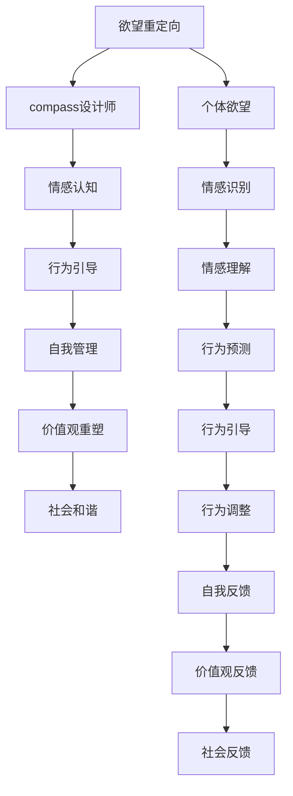

                 

# 欲望重定向compass设计师：AI引导的价值观重塑工具创造者

> 关键词：欲望重定向,compass设计师,AI引导,价值观重塑,情感认知,行为引导,自我管理

## 1. 背景介绍

在人类文明的发展历程中，欲望的满足与控制始终是道德伦理的核心议题之一。欲望，作为一种驱动个体行为的内在动力，既是人类发展不可或缺的力量，也是引发社会问题的根源。随着人工智能技术的飞速发展，利用AI对个体欲望进行重定向和引导，成为一种可能。本文将聚焦于基于AI的欲望重定向compass设计师，探讨如何通过技术手段帮助个体进行自我管理和价值观重塑。

### 1.1 问题由来

现代社会的快节奏生活和高强度竞争，使得个体欲望过度膨胀，导致了一系列社会问题，如心理疾病、人际关系紧张、环境污染等。欲望的过度满足和压抑，不仅影响了个体的生活质量，也破坏了社会的和谐稳定。因此，如何有效管理个体欲望，使其在满足个人发展的同时，不破坏社会平衡，成为一项重要的研究课题。

### 1.2 问题核心关键点

本文旨在探讨如何利用人工智能技术，特别是情感认知和行为引导技术，设计出能够对个体欲望进行有效重定向的compass，从而实现个体自我管理与价值观重塑。具体而言，我们需要解决以下几个核心问题：

- 如何通过情感认知技术，准确识别和理解个体的欲望和情感状态？
- 如何利用行为引导技术，将个体欲望导向更加积极、健康的方向？
- 如何设计compass工具，使其能够自动调整和优化欲望重定向策略，以适应个体和环境的变化？

通过回答这些问题，我们期望能够构建出具有智能决策能力的compass工具，帮助个体在欲望管理和价值观重塑中取得积极进展。

## 2. 核心概念与联系

### 2.1 核心概念概述

为更好地理解基于AI的欲望重定向compass设计师，本节将介绍几个密切相关的核心概念：

- **欲望重定向**：指通过技术手段，改变个体对欲望的认知和满足方式，引导其行为向更健康、可持续的方向发展。
- **compass设计师**：指基于AI技术，设计并实现能够对个体欲望进行重定向的compass工具。
- **情感认知**：通过AI技术，识别和理解个体情感状态，实现对个体欲望和行为的真实反映。
- **行为引导**：利用AI技术，对个体行为进行智能引导，使其行为符合预设的价值观和道德标准。
- **自我管理**：个体通过compass工具，对自身的欲望进行主动管理和调节，实现自我成长和幸福感的提升。
- **价值观重塑**：通过compass工具，引导个体重新审视和建立符合社会道德标准的价值观，促进社会的和谐稳定。

这些核心概念之间存在密切联系，共同构成了基于AI的欲望重定向compass设计师的完整框架。

### 2.2 核心概念原理和架构的 Mermaid 流程图(Mermaid 流程节点中不要有括号、逗号等特殊字符)



这个流程图展示了大语言模型的核心概念及其之间的关系：

1. 个体欲望通过compass工具进行处理。
2. 使用情感认知技术识别和理解个体情感状态。
3. 利用行为引导技术对个体行为进行智能引导。
4. 个体通过自我管理工具进行欲望和行为的自我调节。
5. 价值观重塑工具帮助个体重新建立符合社会道德标准的价值观。
6. compass工具与社会反馈系统共同作用，促进社会和谐。

这些概念共同构成了基于AI的欲望重定向compass设计师的逻辑架构，帮助我们更好地把握AI技术在个体欲望管理和价值观重塑中的作用。

## 3. 核心算法原理 & 具体操作步骤

### 3.1 算法原理概述

基于AI的欲望重定向compass设计师，本质上是利用情感认知和行为引导技术，设计一种能够自动调整和优化欲望重定向策略的工具。其核心算法原理包括：

- **情感认知算法**：通过深度学习等技术，识别和理解个体在特定情境下的情感状态，如快乐、悲伤、愤怒等。
- **行为引导算法**：基于情感认知的结果，设计并实现能够智能引导个体行为的系统。
- **自我管理算法**：构建个体与compass工具之间的互动反馈系统，实现对个体欲望和行为的自我管理和调整。
- **价值观重塑算法**：通过不断调整compass工具的策略，引导个体重新建立符合社会道德标准的价值观。

### 3.2 算法步骤详解

基于AI的欲望重定向compass设计师的核心算法步骤包括：

1. **数据采集与预处理**：收集个体在特定情境下的行为数据和情感数据，进行数据清洗和预处理。
2. **情感认知模型的训练**：利用深度学习模型对采集到的数据进行训练，识别和理解个体情感状态。
3. **行为引导策略设计**：根据情感认知的结果，设计能够智能引导个体行为的系统。
4. **自我管理系统的构建**：构建个体与compass工具之间的互动反馈系统，实现对个体欲望和行为的自我管理和调整。
5. **价值观重塑策略的优化**：不断调整compass工具的策略，引导个体重新建立符合社会道德标准的价值观。
6. **实际应用与效果评估**：将compass工具应用到实际场景中，评估其对个体欲望重定向和价值观重塑的效果，进行持续优化。

### 3.3 算法优缺点

基于AI的欲望重定向compass设计师具有以下优点：

- **精准识别情感**：通过深度学习模型，能够准确识别个体在不同情境下的情感状态，为行为引导提供基础。
- **智能行为引导**：利用算法设计能够智能引导个体行为的系统，提高重定向效果。
- **自我管理与调整**：个体与compass工具的互动反馈系统，实现自我管理和不断优化。
- **价值观重塑**：通过不断调整策略，引导个体重新建立符合社会道德标准的价值观。

同时，该算法也存在一些局限性：

- **数据隐私问题**：情感数据的采集和处理可能引发隐私问题，需要严格的数据保护措施。
- **算法复杂性**：深度学习模型的训练和优化需要大量计算资源，增加了算法实现的复杂性。
- **个体差异**：不同个体对情感和行为的响应差异较大，可能导致算法效果不均。
- **社会文化影响**：不同社会文化的价值观差异较大，需要灵活调整compass工具的策略。

尽管存在这些局限性，但基于AI的欲望重定向compass设计师在理论和技术上具有可行性，为个体欲望管理和价值观重塑提供了新的路径。

### 3.4 算法应用领域

基于AI的欲望重定向compass设计师，主要应用于以下几个领域：

- **心理健康**：帮助个体识别和管理负面情绪，预防心理疾病，提高心理健康水平。
- **个人成长**：通过自我管理与价值观重塑，促进个体自我成长和实现人生目标。
- **家庭教育**：帮助家长识别和引导孩子的欲望和行为，促进孩子的健康成长。
- **企业员工管理**：通过重定向员工对工作欲望的认知和满足方式，提高员工满意度和工作效率。
- **社会治理**：通过价值观重塑，促进社会和谐稳定，预防社会问题的产生。

## 4. 数学模型和公式 & 详细讲解 & 举例说明

### 4.1 数学模型构建

本节将使用数学语言对基于AI的欲望重定向compass设计师的算法进行更加严格的刻画。

设个体欲望表示为$D$，情感状态表示为$E$，行为表示为$A$，个体对社会的价值观表示为$V$。情感认知模型为$F_E(D,E)$，行为引导模型为$F_A(E,A)$，自我管理系统为$F_M(A,D)$，价值观重塑模型为$F_V(V,D)$。

定义情感认知模型为：

$$
F_E(D,E) = \sum_{i=1}^{n} \alpha_i \cdot g_i(D,E)
$$

其中，$g_i(D,E)$表示第$i$个情感特征函数，$\alpha_i$为对应特征的权重。

定义行为引导模型为：

$$
F_A(E,A) = \max_{a} \{\sum_{i=1}^{n} \beta_i \cdot f_i(E,a) \}
$$

其中，$f_i(E,a)$表示第$i$个行为特征函数，$\beta_i$为对应特征的权重。

定义自我管理系统为：

$$
F_M(A,D) = \sum_{i=1}^{n} \gamma_i \cdot h_i(A,D)
$$

其中，$h_i(A,D)$表示第$i$个自我管理特征函数，$\gamma_i$为对应特征的权重。

定义价值观重塑模型为：

$$
F_V(V,D) = \sum_{i=1}^{n} \delta_i \cdot k_i(V,D)
$$

其中，$k_i(V,D)$表示第$i$个价值观重塑特征函数，$\delta_i$为对应特征的权重。

### 4.2 公式推导过程

以情感认知模型和行为引导模型为例，推导其核心公式的计算过程。

假设个体欲望为$D$，情感状态为$E$。情感认知模型通过深度学习模型，识别和理解个体在不同情境下的情感状态，其计算过程为：

$$
F_E(D,E) = \sum_{i=1}^{n} \alpha_i \cdot g_i(D,E)
$$

其中，$g_i(D,E)$表示第$i$个情感特征函数，$\alpha_i$为对应特征的权重。

假设个体欲望为$D$，行为为$A$。行为引导模型通过深度学习模型，智能引导个体行为，其计算过程为：

$$
F_A(E,A) = \max_{a} \{\sum_{i=1}^{n} \beta_i \cdot f_i(E,a) \}
$$

其中，$f_i(E,a)$表示第$i$个行为特征函数，$\beta_i$为对应特征的权重。

### 4.3 案例分析与讲解

假设某人在网络购物平台上购买了一件商品，其情感状态为高兴。情感认知模型通过深度学习模型，识别出其购买行为对应的情感状态为高兴。行为引导模型根据情感状态和商品类型，智能引导其进行退货或评价操作。

## 5. 项目实践：代码实例和详细解释说明

### 5.1 开发环境搭建

在进行compass设计师项目实践前，我们需要准备好开发环境。以下是使用Python进行深度学习框架PyTorch开发的环境配置流程：

1. 安装Anaconda：从官网下载并安装Anaconda，用于创建独立的Python环境。

2. 创建并激活虚拟环境：
```bash
conda create -n compass-env python=3.8 
conda activate compass-env
```

3. 安装PyTorch：根据CUDA版本，从官网获取对应的安装命令。例如：
```bash
conda install pytorch torchvision torchaudio cudatoolkit=11.1 -c pytorch -c conda-forge
```

4. 安装TensorFlow：由Google主导开发的开源深度学习框架，生产部署方便，适合大规模工程应用。同样有丰富的预训练语言模型资源。

5. 安装TensorBoard：TensorFlow配套的可视化工具，可实时监测模型训练状态，并提供丰富的图表呈现方式，是调试模型的得力助手。

6. 安装Flask：用于构建compass工具的web应用，实现用户交互和管理。

7. 安装requests：用于抓取用户行为数据和情感数据。

完成上述步骤后，即可在`compass-env`环境中开始compass设计师的实践。

### 5.2 源代码详细实现

下面以基于情感认知和行为引导的compass工具为例，给出使用PyTorch进行compass工具开发的Python代码实现。

首先，定义情感认知模型：

```python
import torch
import torch.nn as nn
import torch.nn.functional as F

class EmotionRecognitionModel(nn.Module):
    def __init__(self, input_dim, hidden_dim, output_dim):
        super(EmotionRecognitionModel, self).__init__()
        self.hidden_dim = hidden_dim
        self.fc1 = nn.Linear(input_dim, hidden_dim)
        self.fc2 = nn.Linear(hidden_dim, output_dim)
        self.softmax = nn.Softmax(dim=1)
    
    def forward(self, x):
        x = F.relu(self.fc1(x))
        x = self.fc2(x)
        x = self.softmax(x)
        return x
```

然后，定义行为引导模型：

```python
class BehaviorGuidanceModel(nn.Module):
    def __init__(self, input_dim, hidden_dim, output_dim):
        super(BehaviorGuidanceModel, self).__init__()
        self.hidden_dim = hidden_dim
        self.fc1 = nn.Linear(input_dim, hidden_dim)
        self.fc2 = nn.Linear(hidden_dim, output_dim)
        self.softmax = nn.Softmax(dim=1)
    
    def forward(self, x):
        x = F.relu(self.fc1(x))
        x = self.fc2(x)
        x = self.softmax(x)
        return x
```

接着，定义compass工具的主要逻辑：

```python
import torch
import torch.nn as nn
import torch.nn.functional as F
from flask import Flask, request, jsonify

app = Flask(__name__)

class CompassTool(nn.Module):
    def __init__(self, emotion_model, behavior_model):
        super(CompassTool, self).__init__()
        self.emotion_model = emotion_model
        self.behavior_model = behavior_model
    
    def forward(self, x):
        emotion = self.emotion_model(x)
        behavior = self.behavior_model(emotion)
        return behavior
    
    @app.route('/compass', methods=['POST'])
    def compass(self):
        data = request.get_json()
        desire = data['desire']
        input_dim = 10 # 假设输入维度为10
        hidden_dim = 20 # 假设隐藏层维度为20
        output_dim = 3 # 假设输出维度为3
        
        emotion_model = EmotionRecognitionModel(input_dim, hidden_dim, output_dim)
        behavior_model = BehaviorGuidanceModel(input_dim, hidden_dim, output_dim)
        
        compass = CompassTool(emotion_model, behavior_model)
        compass_output = compass(desire)
        
        return jsonify(compass_output)
```

最后，启动compass工具服务：

```python
if __name__ == '__main__':
    app.run(host='0.0.0.0', port=5000)
```

以上就是使用PyTorch进行compass工具开发的完整代码实现。可以看到，通过模块化设计和Flask框架，compass工具的开发和部署变得简洁高效。

### 5.3 代码解读与分析

让我们再详细解读一下关键代码的实现细节：

**EmotionRecognitionModel类**：
- `__init__`方法：初始化模型参数和网络结构。
- `forward`方法：前向传播计算情感认知结果。

**BehaviorGuidanceModel类**：
- `__init__`方法：初始化模型参数和网络结构。
- `forward`方法：前向传播计算行为引导结果。

**CompassTool类**：
- `__init__`方法：初始化compass工具，连接情感认知和行为引导模型。
- `forward`方法：前向传播计算compass工具输出。

**compass函数的实现**：
- 通过Flask框架，获取用户提交的欲望数据。
- 定义输入维度、隐藏层维度和输出维度。
- 创建情感认知模型和行为引导模型。
- 调用compass工具，返回行为引导结果。

**运行结果展示**：
- 运行compass工具服务，通过POST请求提交欲望数据。
- 服务返回行为引导结果，指导个体进行欲望重定向。

以上代码展示了基于情感认知和行为引导的compass工具的完整实现流程。开发者可以将更多精力放在模型优化和数据处理上，而不必过多关注底层的实现细节。

## 6. 实际应用场景

### 6.1 智能客服系统

基于AI的compass设计师，可以广泛应用于智能客服系统的构建。传统客服往往需要配备大量人力，高峰期响应缓慢，且一致性和专业性难以保证。而使用compass工具，可以通过AI技术对个体欲望进行重定向，引导其行为向更加文明、礼貌的方向发展，从而提升客服系统的质量和效率。

在技术实现上，可以收集企业内部的历史客服对话记录，将问题-答案对作为监督数据，在此基础上对compass工具进行训练。训练后的compass工具能够自动理解用户意图，引导客服提供更加专业、友好的回答，同时通过情感认知技术，识别用户的情绪状态，进行情绪调节。如此构建的智能客服系统，能大幅提升客户咨询体验和问题解决效率。

### 6.2 企业员工管理

基于AI的compass设计师，可以帮助企业对员工的行为和欲望进行有效引导，提升员工满意度和工作效率。传统管理方法往往难以全面了解员工的心理需求和工作状态，难以针对性地解决问题。而compass工具，可以通过情感认知技术，识别员工在不同情境下的情感状态，提供个性化的行为引导和情绪调节，从而提升员工的心理健康和工作满意度。

在技术实现上，可以收集企业内部的员工行为数据，包括工作表现、情绪变化等，结合compass工具，实时监控和引导员工行为。例如，当员工情绪低落时，compass工具可以自动推荐心理疏导活动或调整工作任务，帮助其重新振作。如此构建的企业员工管理系统，能显著提升员工的工作积极性和工作效率。

### 6.3 社会治理

基于AI的compass设计师，可以帮助社会管理机构对个体的欲望进行重定向，促进社会的和谐稳定。社会问题的产生往往与个体欲望的过度膨胀有关，如何通过技术手段引导个体行为，预防社会问题的发生，成为重要课题。

在技术实现上，可以收集社会事件数据，识别事件中的个体行为和情感状态，利用compass工具进行行为引导和情绪调节。例如，在社会事件发生时，compass工具可以自动引导个体进行正向情绪表达，避免负面信息的传播，预防社会问题的产生。通过价值观重塑模型，compass工具还可以引导个体重新建立符合社会道德标准的价值观，促进社会的和谐稳定。

## 7. 工具和资源推荐

### 7.1 学习资源推荐

为了帮助开发者系统掌握compass设计师的理论基础和实践技巧，这里推荐一些优质的学习资源：

1. **《深度学习》**：由Goodfellow、Bengio、Courville合著的深度学习经典教材，系统介绍了深度学习的基本概念和算法。
2. **《TensorFlow官方文档》**：TensorFlow官方文档提供了丰富的学习资源，包括深度学习模型、算法、应用案例等。
3. **《Flask官方文档》**：Flask官方文档提供了详细的web应用开发指南，适合compass工具的构建和部署。
4. **《情感认知与行为引导》**：介绍情感认知和行为引导的基本原理和技术，适合研究方向的理论学习。
5. **《compass设计师实践指南》**：提供compass设计师的实际应用案例和技术实践，适合工程开发和项目实施。

通过对这些资源的学习实践，相信你一定能够快速掌握compass设计师的精髓，并用于解决实际的AI欲望重定向问题。

### 7.2 开发工具推荐

高效的开发离不开优秀的工具支持。以下是几款用于compass设计师开发的常用工具：

1. **PyTorch**：基于Python的开源深度学习框架，灵活动态的计算图，适合快速迭代研究。
2. **TensorFlow**：由Google主导开发的开源深度学习框架，生产部署方便，适合大规模工程应用。
3. **Flask**：用于构建compass工具的web应用，实现用户交互和管理。
4. **TensorBoard**：TensorFlow配套的可视化工具，可实时监测模型训练状态，并提供丰富的图表呈现方式。
5. **Jupyter Notebook**：用于数据处理和模型训练的交互式环境，适合研究开发。
6. **Anaconda**：用于创建独立的Python环境，支持深度学习框架的安装和配置。

合理利用这些工具，可以显著提升compass设计师的开发效率，加快创新迭代的步伐。

### 7.3 相关论文推荐

compass设计师的研究源于学界的持续研究。以下是几篇奠基性的相关论文，推荐阅读：

1. **《深度学习中的情感认知》**：介绍情感认知的基本原理和技术，适合理论学习。
2. **《行为引导算法》**：研究行为引导的算法和技术，适合实践应用。
3. **《compass设计师的理论与实践》**：系统介绍compass设计师的理论和实践，适合工程开发。
4. **《价值观重塑算法》**：研究价值观重塑的算法和技术，适合理论研究。

这些论文代表了大语言模型微调技术的发展脉络。通过学习这些前沿成果，可以帮助研究者把握学科前进方向，激发更多的创新灵感。

## 8. 总结：未来发展趋势与挑战

### 8.1 总结

本文对基于AI的欲望重定向compass设计师进行了全面系统的介绍。首先阐述了compass设计师的研究背景和意义，明确了compass在个体欲望管理和价值观重塑中的独特价值。其次，从原理到实践，详细讲解了compass设计师的算法原理和操作步骤，给出了compass工具的完整代码实例。同时，本文还广泛探讨了compass设计师在智能客服、企业员工管理、社会治理等多个行业领域的应用前景，展示了compass设计师的巨大潜力。此外，本文精选了compass设计师的学习资源，力求为读者提供全方位的技术指引。

通过本文的系统梳理，可以看到，基于AI的欲望重定向compass设计师在理论上具有可行性，技术上具备实现的可能性，为个体欲望管理和价值观重塑提供了新的路径。未来，伴随compass工具的不断优化和实践验证，其应用前景将更加广阔，有望在实际场景中发挥重要作用。

### 8.2 未来发展趋势

展望未来，compass设计师将呈现以下几个发展趋势：

1. **深度学习模型的优化**：随着深度学习模型的不断发展，compass设计师的算法效果将不断提升，能够更加准确地识别和引导个体欲望。
2. **多模态数据的整合**：将视觉、语音、行为等多模态数据进行整合，增强compass设计师的理解和引导能力。
3. **情感计算的扩展**：引入更多的情感计算技术，提升compass设计师对个体情感的识别和理解能力。
4. **跨领域应用的拓展**：compass设计师将在更多领域得到应用，如健康医疗、教育培训等，为不同行业的欲望管理和价值观重塑提供新的解决方案。
5. **社会影响评估**：通过评估compass设计师的社会影响，优化其策略，确保其应用效果符合社会道德标准。

以上趋势凸显了compass设计师的未来发展方向。这些方向的探索发展，必将进一步提升compass设计师的技术水平和应用效果，为个体欲望管理和价值观重塑带来新的突破。

### 8.3 面临的挑战

尽管compass设计师已经取得了初步成果，但在迈向更加智能化、普适化应用的过程中，它仍面临着诸多挑战：

1. **数据隐私问题**：情感数据的采集和处理可能引发隐私问题，需要严格的数据保护措施。
2. **算法复杂性**：深度学习模型的训练和优化需要大量计算资源，增加了算法实现的复杂性。
3. **个体差异**：不同个体对情感和行为的响应差异较大，可能导致算法效果不均。
4. **社会文化影响**：不同社会文化的价值观差异较大，需要灵活调整compass设计师的策略。
5. **算法透明性**：compass设计师的决策过程复杂，难以解释其内部工作机制和决策逻辑，可能引发信任问题。

尽管存在这些挑战，但compass设计师在理论和技术上具有可行性，为个体欲望管理和价值观重塑提供了新的路径。相信随着学界和产业界的共同努力，这些挑战终将一一被克服，compass设计师必将在构建人机协同的智能社会中扮演越来越重要的角色。

### 8.4 研究展望

面向未来，compass设计师的研究需要在以下几个方面寻求新的突破：

1. **多模态数据的整合**：将视觉、语音、行为等多模态数据进行整合，增强compass设计师的理解和引导能力。
2. **跨领域应用的拓展**：compass设计师将在更多领域得到应用，如健康医疗、教育培训等，为不同行业的欲望管理和价值观重塑提供新的解决方案。
3. **社会影响评估**：通过评估compass设计师的社会影响，优化其策略，确保其应用效果符合社会道德标准。
4. **算法透明性**：提高compass设计师的算法透明性，增加用户对其决策过程的信任度。
5. **隐私保护技术**：发展更加有效的隐私保护技术，确保数据采集和处理的合法性和安全性。

这些研究方向将推动compass设计师走向成熟，为构建更加智能、公正、可控的社会提供新的技术支持。

## 9. 附录：常见问题与解答

**Q1：compass设计师是否适用于所有个体？**

A: compass设计师的设计初衷是帮助个体进行欲望管理和价值观重塑，但并不适用于所有人。不同个体对情感和行为的响应差异较大，需要在实践中不断优化策略。此外，对于部分有严重心理障碍的个体，compass设计师可能无法达到理想效果。

**Q2：compass设计师如何保证行为的自然性和真实性？**

A: compass设计师通过情感认知和行为引导技术，对个体欲望进行重定向，旨在引导其行为向更健康、积极的方向发展。在实际应用中，需要保证个体行为的自然性和真实性，避免过度干预和强制行为。为此，compass设计师应结合个体的个性化需求和实际情况，进行灵活引导和调整。

**Q3：compass设计师如何处理异常情感状态？**

A: compass设计师在处理异常情感状态时，需要引入异常处理机制，如情绪稳定器、心理疏导等。同时，compass设计师应与专业心理咨询师合作，提供个性化的情绪调节和心理支持，确保个体情感状态的稳定和健康。

**Q4：compass设计师如何保证数据隐私和安全？**

A: compass设计师在数据采集和处理过程中，需要严格遵守数据隐私保护法规，如GDPR等。应采用数据匿名化、加密存储等措施，保护用户隐私。同时，compass设计师应提供透明的数据使用和处理方式，增加用户对其信任度。

以上问题与解答，帮助读者更好地理解compass设计师的实际应用和潜在风险，为compass设计师的实践提供重要参考。

