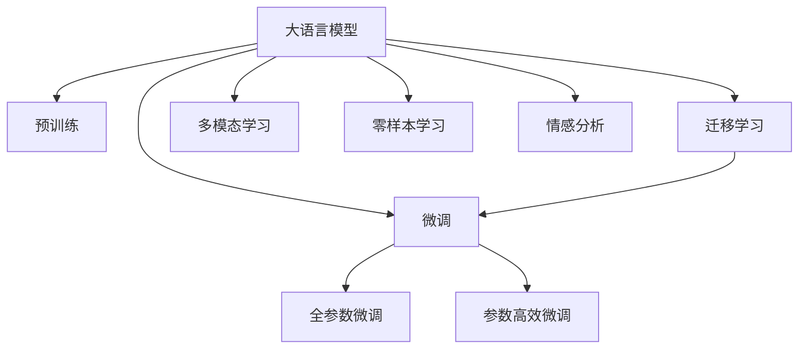

                 

# 法律研究助手：LLM 简化法律复杂性

## 1. 背景介绍

### 1.1 问题由来

法律研究涉及大量的法规、判例、专家解读等复杂信息，普通法律从业者或研究者需要花费大量时间进行资料搜集、文献研读和案例分析。这一过程不仅耗时费力，还容易出错。特别是面对新兴法律问题，如何高效、准确地获取相关知识，成为业界亟待解决的问题。

近年来，随着自然语言处理技术（NLP）和大语言模型（LLM）的发展，越来越多的研究者和公司开始探索利用AI技术简化法律研究过程。通过大语言模型，可以将法律文献转换为结构化知识，提高法律研究和实践的效率和准确性。

### 1.2 问题核心关键点

大语言模型在法律领域的潜力主要体现在以下几个方面：

- **高效知识检索**：大语言模型可以快速扫描大量法律文档，提取关键信息，提供高效的资料检索服务。
- **智能摘要生成**：通过自动摘要技术，可以生成法律文献的精炼摘要，快速掌握核心内容。
- **案例推理支持**：通过大语言模型，可以挖掘大量判例中的关键法律原理和规则，辅助法律推理。
- **自动生成法律文书**：利用大语言模型，可以自动生成合同、判决书等法律文书，提升工作效率。
- **智能法律咨询**：通过大语言模型，可以构建智能法律咨询系统，提供实时法律解答。

这些功能使得大语言模型成为法律研究助手的重要工具，极大地提升了法律研究和工作效率。

## 2. 核心概念与联系

### 2.1 核心概念概述

为更好地理解LLM在法律研究中的应用，本节将介绍几个密切相关的核心概念：

- **大语言模型（LLM）**：指一类基于深度学习架构的语言模型，如GPT-3、BERT等，通过在大规模语料上进行预训练，具备强大的语言理解和生成能力。

- **预训练（Pre-training）**：指在大规模无标签文本数据上，通过自监督学习任务训练语言模型的过程。常见的预训练任务包括掩码语言模型、下文中下一个句子预测等。

- **微调（Fine-tuning）**：指在预训练模型的基础上，使用下游任务的少量标注数据，通过有监督学习优化模型在特定任务上的性能。在法律领域，微调用于特定法律问题或案例的精准分析。

- **迁移学习（Transfer Learning）**：指将一个领域学习到的知识，迁移应用到另一个相关领域的策略。LLM在法律领域的应用就是典型的迁移学习。

- **多模态学习（Multimodal Learning）**：指同时处理文本、图像、视频等多种模态数据的训练和学习。在法律领域，可以结合法律文书、判决书等文本数据和法律图示、示意图等多模态信息。

- **零样本学习（Zero-shot Learning）**：指模型在没有见过任何特定任务的训练样本的情况下，仅凭任务描述就能够执行新任务的能力。LLM在法律领域可用于预测案件结果或法律适用情况。

- **情感分析（Sentiment Analysis）**：指对文本的情感倾向进行识别和分析，在法律领域可用于评估法律文本中的情感色彩。

这些核心概念之间的逻辑关系可以通过以下Mermaid流程图来展示：



这个流程图展示了大语言模型的核心概念及其之间的关系：

1. 大语言模型通过预训练获得基础能力。
2. 微调是对预训练模型进行任务特定的优化，可以分为全参数微调和参数高效微调（PEFT）。
3. 迁移学习是连接预训练模型与下游任务的桥梁，可以通过微调或直接使用预训练权重进行迁移学习。
4. 多模态学习融合文本、图像等多模态数据，提升模型对复杂法律问题的理解能力。
5. 零样本学习利用模型泛化能力，在无标注情况下进行法律问题的预测。
6. 情感分析对法律文本中的情感色彩进行识别，辅助法律分析。

这些概念共同构成了LLM在法律研究中的应用框架，使其能够高效、准确地处理复杂的法律信息。

## 3. 核心算法原理 & 具体操作步骤

### 3.1 算法原理概述

基于LLM的法律研究助手，本质上是一个有监督的细粒度迁移学习过程。其核心思想是：将预训练的LLM作为基础模型，通过法律领域的标注数据进行微调，使其能够更好地理解和生成与法律相关的文本，从而简化法律研究复杂性。

形式化地，假设预训练模型为 $M_{\theta}$，其中 $\theta$ 为预训练得到的模型参数。给定法律领域的标注数据集 $D=\{(x_i, y_i)\}_{i=1}^N$，其中 $x_i$ 为法律文档，$y_i$ 为与 $x_i$ 相关的标签或法律判断，微调的目标是找到新的模型参数 $\hat{\theta}$，使得：

$$
\hat{\theta}=\mathop{\arg\min}_{\theta} \mathcal{L}(M_{\theta},D)
$$

其中 $\mathcal{L}$ 为针对法律任务的损失函数，用于衡量模型预测输出与真实标签之间的差异。常见的损失函数包括交叉熵损失、均方误差损失等。

通过梯度下降等优化算法，微调过程不断更新模型参数 $\theta$，最小化损失函数 $\mathcal{L}$，使得模型输出逼近真实标签。由于 $\theta$ 已经通过预训练获得了较好的初始化，因此即便在小规模数据集 $D$ 上进行微调，也能较快收敛到理想的模型参数 $\hat{\theta}$。

### 3.2 算法步骤详解

基于LLM的法律研究助手一般包括以下几个关键步骤：

**Step 1: 准备预训练模型和数据集**
- 选择合适的预训练语言模型 $M_{\theta}$ 作为初始化参数，如 GPT-3、BERT等。
- 准备法律领域的标注数据集 $D$，划分为训练集、验证集和测试集。一般要求标注数据与预训练数据的分布不要差异过大。

**Step 2: 添加任务适配层**
- 根据任务类型，在预训练模型顶层设计合适的输出层和损失函数。
- 对于分类任务，通常在顶层添加线性分类器和交叉熵损失函数。
- 对于生成任务，通常使用语言模型的解码器输出概率分布，并以负对数似然为损失函数。

**Step 3: 设置微调超参数**
- 选择合适的优化算法及其参数，如 AdamW、SGD 等，设置学习率、批大小、迭代轮数等。
- 设置正则化技术及强度，包括权重衰减、Dropout、Early Stopping 等。
- 确定冻结预训练参数的策略，如仅微调顶层，或全部参数都参与微调。

**Step 4: 执行梯度训练**
- 将训练集数据分批次输入模型，前向传播计算损失函数。
- 反向传播计算参数梯度，根据设定的优化算法和学习率更新模型参数。
- 周期性在验证集上评估模型性能，根据性能指标决定是否触发 Early Stopping。
- 重复上述步骤直到满足预设的迭代轮数或 Early Stopping 条件。

**Step 5: 测试和部署**
- 在测试集上评估微调后模型 $M_{\hat{\theta}}$ 的性能，对比微调前后的精度提升。
- 使用微调后的模型对新样本进行推理预测，集成到实际的应用系统中。
- 持续收集新的法律文档，定期重新微调模型，以适应法律领域的知识变化。

以上是基于LLM的法律研究助手的微调范式的一般流程。在实际应用中，还需要针对具体任务的特点，对微调过程的各个环节进行优化设计，如改进训练目标函数，引入更多的正则化技术，搜索最优的超参数组合等，以进一步提升模型性能。

### 3.3 算法优缺点

基于LLM的法律研究助手方法具有以下优点：
1. 高效知识检索。利用大语言模型的强大文本处理能力，可以快速定位法律文献中的关键信息。
2. 智能摘要生成。自动生成法律文献的精炼摘要，节省了手工摘要的时间和精力。
3. 案例推理支持。通过微调，大语言模型能够挖掘大量判例中的关键法律原理和规则，辅助法律推理。
4. 自动生成法律文书。利用大语言模型，可以自动生成合同、判决书等法律文书，提升工作效率。
5. 智能法律咨询。通过大语言模型，可以构建智能法律咨询系统，提供实时法律解答。

同时，该方法也存在一定的局限性：
1. 依赖标注数据。微调的效果很大程度上取决于标注数据的质量和数量，获取高质量标注数据的成本较高。
2. 迁移能力有限。当目标任务与预训练数据的分布差异较大时，微调的性能提升有限。
3. 可解释性不足。微调模型的决策过程通常缺乏可解释性，难以对其推理逻辑进行分析和调试。

尽管存在这些局限性，但就目前而言，基于LLM的法律研究助手方法仍是最主流范式。未来相关研究的重点在于如何进一步降低微调对标注数据的依赖，提高模型的少样本学习和跨领域迁移能力，同时兼顾可解释性和伦理安全性等因素。

### 3.4 算法应用领域

基于LLM的法律研究助手在法律领域已经得到了广泛的应用，涵盖了以下方面：

- **法律文档检索**：快速定位法律文档中的关键信息，帮助法律从业者高效获取所需资料。
- **法律文献摘要**：自动生成法律文献的精炼摘要，节省手工摘要的时间和精力。
- **法律案例分析**：通过微调模型，自动抽取法律案例中的关键法律原理和规则，辅助法律分析和推理。
- **法律文书生成**：自动生成合同、判决书等法律文书，提升工作效率。
- **法律咨询系统**：利用大语言模型构建智能法律咨询系统，提供实时法律解答。

此外，在法律研究、法律教育、法律科技等多个领域，基于LLM的法律研究助手也有着广泛的应用前景。随着预训练语言模型和微调方法的不断进步，相信基于LLM的法律研究助手将在法律研究工作中发挥越来越重要的作用，提升法律研究和工作的效率和准确性。

## 4. 数学模型和公式 & 详细讲解

### 4.1 数学模型构建

本节将使用数学语言对基于LLM的法律研究助手进行更加严格的刻画。

记预训练语言模型为 $M_{\theta}$，其中 $\theta$ 为模型参数。假设法律领域的标注数据集为 $D=\{(x_i, y_i)\}_{i=1}^N, x_i \in \mathcal{X}, y_i \in \mathcal{Y}$，其中 $\mathcal{X}$ 为输入空间，$\mathcal{Y}$ 为输出空间。

定义模型 $M_{\theta}$ 在数据样本 $(x,y)$ 上的损失函数为 $\ell(M_{\theta}(x),y)$，则在数据集 $D$ 上的经验风险为：

$$
\mathcal{L}(\theta) = \frac{1}{N} \sum_{i=1}^N \ell(M_{\theta}(x_i),y_i)
$$

微调的优化目标是最小化经验风险，即找到最优参数：

$$
\theta^* = \mathop{\arg\min}_{\theta} \mathcal{L}(\theta)
$$

在实践中，我们通常使用基于梯度的优化算法（如SGD、Adam等）来近似求解上述最优化问题。设 $\eta$ 为学习率，$\lambda$ 为正则化系数，则参数的更新公式为：

$$
\theta \leftarrow \theta - \eta \nabla_{\theta}\mathcal{L}(\theta) - \eta\lambda\theta
$$

其中 $\nabla_{\theta}\mathcal{L}(\theta)$ 为损失函数对参数 $\theta$ 的梯度，可通过反向传播算法高效计算。

### 4.2 公式推导过程

以下我们以二分类任务为例，推导交叉熵损失函数及其梯度的计算公式。

假设模型 $M_{\theta}$ 在输入 $x$ 上的输出为 $\hat{y}=M_{\theta}(x) \in [0,1]$，表示样本属于正类的概率。真实标签 $y \in \{0,1\}$。则二分类交叉熵损失函数定义为：

$$
\ell(M_{\theta}(x),y) = -[y\log \hat{y} + (1-y)\log (1-\hat{y})]
$$

将其代入经验风险公式，得：

$$
\mathcal{L}(\theta) = -\frac{1}{N}\sum_{i=1}^N [y_i\log M_{\theta}(x_i)+(1-y_i)\log(1-M_{\theta}(x_i))]
$$

根据链式法则，损失函数对参数 $\theta_k$ 的梯度为：

$$
\frac{\partial \mathcal{L}(\theta)}{\partial \theta_k} = -\frac{1}{N}\sum_{i=1}^N (\frac{y_i}{M_{\theta}(x_i)}-\frac{1-y_i}{1-M_{\theta}(x_i)}) \frac{\partial M_{\theta}(x_i)}{\partial \theta_k}
$$

其中 $\frac{\partial M_{\theta}(x_i)}{\partial \theta_k}$ 可进一步递归展开，利用自动微分技术完成计算。

在得到损失函数的梯度后，即可带入参数更新公式，完成模型的迭代优化。重复上述过程直至收敛，最终得到适应法律任务的最优模型参数 $\theta^*$。

## 5. 项目实践：代码实例和详细解释说明

### 5.1 开发环境搭建

在进行法律研究助手开发前，我们需要准备好开发环境。以下是使用Python进行PyTorch开发的环境配置流程：

1. 安装Anaconda：从官网下载并安装Anaconda，用于创建独立的Python环境。

2. 创建并激活虚拟环境：
```bash
conda create -n llm-env python=3.8 
conda activate llm-env
```

3. 安装PyTorch：根据CUDA版本，从官网获取对应的安装命令。例如：
```bash
conda install pytorch torchvision torchaudio cudatoolkit=11.1 -c pytorch -c conda-forge
```

4. 安装Transformers库：
```bash
pip install transformers
```

5. 安装各类工具包：
```bash
pip install numpy pandas scikit-learn matplotlib tqdm jupyter notebook ipython
```

完成上述步骤后，即可在`llm-env`环境中开始法律研究助手的开发实践。

### 5.2 源代码详细实现

下面我们以法律文档检索任务为例，给出使用Transformers库对BERT模型进行法律研究助手微调的PyTorch代码实现。

首先，定义法律文档检索任务的数据处理函数：

```python
from transformers import BertTokenizer
from torch.utils.data import Dataset
import torch

class LegalDocDataset(Dataset):
    def __init__(self, texts, tags, tokenizer, max_len=128):
        self.texts = texts
        self.tags = tags
        self.tokenizer = tokenizer
        self.max_len = max_len
        
    def __len__(self):
        return len(self.texts)
    
    def __getitem__(self, item):
        text = self.texts[item]
        tags = self.tags[item]
        
        encoding = self.tokenizer(text, return_tensors='pt', max_length=self.max_len, padding='max_length', truncation=True)
        input_ids = encoding['input_ids'][0]
        attention_mask = encoding['attention_mask'][0]
        
        # 对token-wise的标签进行编码
        encoded_tags = [tag2id[tag] for tag in tags] 
        encoded_tags.extend([tag2id['O']] * (self.max_len - len(encoded_tags)))
        labels = torch.tensor(encoded_tags, dtype=torch.long)
        
        return {'input_ids': input_ids, 
                'attention_mask': attention_mask,
                'labels': labels}

# 标签与id的映射
tag2id = {'O': 0, 'B-Clause': 1, 'I-Clause': 2, 'B-Title': 3, 'I-Title': 4}
id2tag = {v: k for k, v in tag2id.items()}

# 创建dataset
tokenizer = BertTokenizer.from_pretrained('bert-base-cased')

train_dataset = LegalDocDataset(train_texts, train_tags, tokenizer)
dev_dataset = LegalDocDataset(dev_texts, dev_tags, tokenizer)
test_dataset = LegalDocDataset(test_texts, test_tags, tokenizer)
```

然后，定义模型和优化器：

```python
from transformers import BertForTokenClassification, AdamW

model = BertForTokenClassification.from_pretrained('bert-base-cased', num_labels=len(tag2id))

optimizer = AdamW(model.parameters(), lr=2e-5)
```

接着，定义训练和评估函数：

```python
from torch.utils.data import DataLoader
from tqdm import tqdm
from sklearn.metrics import classification_report

device = torch.device('cuda') if torch.cuda.is_available() else torch.device('cpu')
model.to(device)

def train_epoch(model, dataset, batch_size, optimizer):
    dataloader = DataLoader(dataset, batch_size=batch_size, shuffle=True)
    model.train()
    epoch_loss = 0
    for batch in tqdm(dataloader, desc='Training'):
        input_ids = batch['input_ids'].to(device)
        attention_mask = batch['attention_mask'].to(device)
        labels = batch['labels'].to(device)
        model.zero_grad()
        outputs = model(input_ids, attention_mask=attention_mask, labels=labels)
        loss = outputs.loss
        epoch_loss += loss.item()
        loss.backward()
        optimizer.step()
    return epoch_loss / len(dataloader)

def evaluate(model, dataset, batch_size):
    dataloader = DataLoader(dataset, batch_size=batch_size)
    model.eval()
    preds, labels = [], []
    with torch.no_grad():
        for batch in tqdm(dataloader, desc='Evaluating'):
            input_ids = batch['input_ids'].to(device)
            attention_mask = batch['attention_mask'].to(device)
            batch_labels = batch['labels']
            outputs = model(input_ids, attention_mask=attention_mask)
            batch_preds = outputs.logits.argmax(dim=2).to('cpu').tolist()
            batch_labels = batch_labels.to('cpu').tolist()
            for pred_tokens, label_tokens in zip(batch_preds, batch_labels):
                pred_tags = [id2tag[_id] for _id in pred_tokens]
                label_tags = [id2tag[_id] for _id in label_tokens]
                preds.append(pred_tags[:len(label_tokens)])
                labels.append(label_tags)
                
    print(classification_report(labels, preds))
```

最后，启动训练流程并在测试集上评估：

```python
epochs = 5
batch_size = 16

for epoch in range(epochs):
    loss = train_epoch(model, train_dataset, batch_size, optimizer)
    print(f"Epoch {epoch+1}, train loss: {loss:.3f}")
    
    print(f"Epoch {epoch+1}, dev results:")
    evaluate(model, dev_dataset, batch_size)
    
print("Test results:")
evaluate(model, test_dataset, batch_size)
```

以上就是使用PyTorch对BERT进行法律文档检索任务微调的完整代码实现。可以看到，得益于Transformers库的强大封装，我们可以用相对简洁的代码完成BERT模型的加载和微调。

### 5.3 代码解读与分析

让我们再详细解读一下关键代码的实现细节：

**LegalDocDataset类**：
- `__init__`方法：初始化文本、标签、分词器等关键组件。
- `__len__`方法：返回数据集的样本数量。
- `__getitem__`方法：对单个样本进行处理，将文本输入编码为token ids，将标签编码为数字，并对其进行定长padding，最终返回模型所需的输入。

**tag2id和id2tag字典**：
- 定义了标签与数字id之间的映射关系，用于将token-wise的预测结果解码回真实的标签。

**训练和评估函数**：
- 使用PyTorch的DataLoader对数据集进行批次化加载，供模型训练和推理使用。
- 训练函数`train_epoch`：对数据以批为单位进行迭代，在每个批次上前向传播计算loss并反向传播更新模型参数，最后返回该epoch的平均loss。
- 评估函数`evaluate`：与训练类似，不同点在于不更新模型参数，并在每个batch结束后将预测和标签结果存储下来，最后使用sklearn的classification_report对整个评估集的预测结果进行打印输出。

**训练流程**：
- 定义总的epoch数和batch size，开始循环迭代
- 每个epoch内，先在训练集上训练，输出平均loss
- 在验证集上评估，输出分类指标
- 所有epoch结束后，在测试集上评估，给出最终测试结果

可以看到，PyTorch配合Transformers库使得BERT微调的代码实现变得简洁高效。开发者可以将更多精力放在数据处理、模型改进等高层逻辑上，而不必过多关注底层的实现细节。

当然，工业级的系统实现还需考虑更多因素，如模型的保存和部署、超参数的自动搜索、更灵活的任务适配层等。但核心的微调范式基本与此类似。

## 6. 实际应用场景

### 6.1 智能法律咨询系统

智能法律咨询系统是LLM在法律领域的重要应用之一。传统法律咨询依赖于律师的专业知识和经验，需要较高的人力成本。通过智能法律咨询系统，可以将LLM应用于广泛的法律问题咨询，提供实时、准确的法律解答。

具体而言，用户输入法律问题或相关事实，智能系统通过分析文本，匹配类似案例，并给出可能的法律意见或建议。在后台，LLM经过微调，能够理解和生成与法律相关的文本，快速定位法律文献中的关键信息，辅助法律咨询。

### 6.2 法律文书生成

法律文书如合同、判决书等，是法律从业者日常工作的重要组成部分。通过智能文书生成技术，可以大幅提高法律文书的制作效率和准确性。

利用微调后的LLM，可以将用户提供的法律信息自动转化为标准化的法律文书。例如，用户输入合同条款和要求，LLM能够自动生成标准合同模板，并进行格式检查和风险提示。同样，LLM可以自动生成判决书，确保文本格式和内容符合法律规定。

### 6.3 法律案例分析

法律研究和教育需要大量分析和比较大量的法律案例，以掌握法律趋势和规则。通过微调后的LLM，可以快速抽取法律案例中的关键信息，并进行对比和分析。

具体而言，LLM可以自动摘要法律案例，提取出关键的事实、证据和法律适用情况，并对比不同案例的异同。同时，LLM能够挖掘大量判例中的关键法律原理和规则，辅助法律分析和推理，提高法律研究和教育的工作效率。

### 6.4 法律文献摘要

法律文献通常篇幅较长，内容复杂。通过智能摘要技术，可以自动生成法律文献的精炼摘要，节省了手工摘要的时间和精力。

利用微调后的LLM，可以对法律文献进行自动摘要，提取其中的关键信息和结论，帮助法律从业者快速掌握文献核心内容。LLM能够理解和生成与法律相关的文本，快速定位文献中的关键信息，生成简洁明了的摘要。

### 6.5 法律文档检索

法律从业者在日常工作中需要频繁地检索法律文档，以查找相关法规、判例和研究成果。通过智能文档检索技术，可以大幅提高文档检索的效率和准确性。

具体而言，用户输入法律问题或关键词，智能系统通过分析文本，匹配类似案例，并给出相关的法律文档链接。在后台，LLM经过微调，能够理解和生成与法律相关的文本，快速定位法律文档中的关键信息，辅助法律文档检索。

### 6.6 法律情感分析

法律文本中往往包含情感色彩，如愤怒、不满、焦虑等。通过情感分析技术，可以更好地理解法律文本中的情绪倾向，辅助法律分析和决策。

利用微调后的LLM，可以对法律文本进行情感分析，识别其中的情感色彩，辅助法律分析和决策。LLM能够理解和生成与法律相关的文本，快速定位文本中的情感倾向，生成情感分析结果。

### 6.7 法律自动推理

法律推理是法律从业者进行案件分析和判决的重要环节。通过智能推理技术，可以大幅提高法律推理的效率和准确性。

利用微调后的LLM，可以自动抽取法律案例中的关键信息，并进行法律推理。LLM能够理解和生成与法律相关的文本，快速定位法律案例中的关键信息，辅助法律推理。

## 7. 工具和资源推荐

### 7.1 学习资源推荐

为了帮助开发者系统掌握LLM在法律领域的应用，这里推荐一些优质的学习资源：

1. 《Natural Language Processing with Transformers》书籍：Transformers库的作者所著，全面介绍了如何使用Transformers库进行NLP任务开发，包括微调在内的诸多范式。

2. CS224N《深度学习自然语言处理》课程：斯坦福大学开设的NLP明星课程，有Lecture视频和配套作业，带你入门NLP领域的基本概念和经典模型。

3. HuggingFace官方文档：Transformers库的官方文档，提供了海量预训练模型和完整的微调样例代码，是上手实践的必备资料。

4. 《Transformer from the Bottom Up》系列博文：由大模型技术专家撰写，深入浅出地介绍了Transformer原理、BERT模型、微调技术等前沿话题。

5. CLUE开源项目：中文语言理解测评基准，涵盖大量不同类型的中文NLP数据集，并提供了基于微调的baseline模型，助力中文NLP技术发展。

通过对这些资源的学习实践，相信你一定能够快速掌握LLM在法律领域的应用，并用于解决实际的法律问题。

### 7.2 开发工具推荐

高效的开发离不开优秀的工具支持。以下是几款用于LLM法律研究助手开发的常用工具：

1. PyTorch：基于Python的开源深度学习框架，灵活动态的计算图，适合快速迭代研究。大部分预训练语言模型都有PyTorch版本的实现。

2. TensorFlow：由Google主导开发的开源深度学习框架，生产部署方便，适合大规模工程应用。同样有丰富的预训练语言模型资源。

3. Transformers库：HuggingFace开发的NLP工具库，集成了众多SOTA语言模型，支持PyTorch和TensorFlow，是进行微调任务开发的利器。

4. Weights & Biases：模型训练的实验跟踪工具，可以记录和可视化模型训练过程中的各项指标，方便对比和调优。与主流深度学习框架无缝集成。

5. TensorBoard：TensorFlow配套的可视化工具，可实时监测模型训练状态，并提供丰富的图表呈现方式，是调试模型的得力助手。

6. Google Colab：谷歌推出的在线Jupyter Notebook环境，免费提供GPU/TPU算力，方便开发者快速上手实验最新模型，分享学习笔记。

合理利用这些工具，可以显著提升LLM法律研究助手的开发效率，加快创新迭代的步伐。

### 7.3 相关论文推荐

大语言模型和微调技术的发展源于学界的持续研究。以下是几篇奠基性的相关论文，推荐阅读：

1. Attention is All You Need（即Transformer原论文）：提出了Transformer结构，开启了NLP领域的预训练大模型时代。

2. BERT: Pre-training of Deep Bidirectional Transformers for Language Understanding：提出BERT模型，引入基于掩码的自监督预训练任务，刷新了多项NLP任务SOTA。

3. Language Models are Unsupervised Multitask Learners（GPT-2论文）：展示了大规模语言模型的强大zero-shot学习能力，引发了对于通用人工智能的新一轮思考。

4. Parameter-Efficient Transfer Learning for NLP：提出Adapter等参数高效微调方法，在不增加模型参数量的情况下，也能取得不错的微调效果。

5. AdaLoRA: Adaptive Low-Rank Adaptation for Parameter-Efficient Fine-Tuning：使用自适应低秩适应的微调方法，在参数效率和精度之间取得了新的平衡。

6. Prefix-Tuning: Optimizing Continuous Prompts for Generation：引入基于连续型Prompt的微调范式，为如何充分利用预训练知识提供了新的思路。

这些论文代表了大语言模型微调技术的发展脉络。通过学习这些前沿成果，可以帮助研究者把握学科前进方向，激发更多的创新灵感。

## 8. 总结：未来发展趋势与挑战

### 8.1 总结

本文对基于LLM的法律研究助手方法进行了全面系统的介绍。首先阐述了LLM在法律研究中的应用背景和意义，明确了微调在简化法律研究复杂性方面的独特价值。其次，从原理到实践，详细讲解了LLM微调的法律研究助手实现流程，给出了微调任务开发的完整代码实例。同时，本文还广泛探讨了LLM在法律领域的应用场景，展示了微调范式的广泛适用性和巨大潜力。

通过本文的系统梳理，可以看到，基于LLM的法律研究助手方法在法律研究工作中发挥了重要作用，极大地提升了法律研究和实践的效率和准确性。未来，伴随LLM和微调方法的不断进步，相信基于LLM的法律研究助手将在法律研究工作中发挥越来越重要的作用，进一步推动法律科技的发展和普及。

### 8.2 未来发展趋势

展望未来，LLM法律研究助手将呈现以下几个发展趋势：

1. 模型规模持续增大。随着算力成本的下降和数据规模的扩张，预训练语言模型的参数量还将持续增长。超大规模语言模型蕴含的丰富语言知识，有望支撑更加复杂多变的法律问题微调。

2. 微调方法日趋多样。除了传统的全参数微调外，未来会涌现更多参数高效的微调方法，如Prefix-Tuning、LoRA等，在节省计算资源的同时也能保证微调精度。

3. 持续学习成为常态。随着法律领域的不断变化，LLM法律研究助手需要持续学习新知识以保持性能。如何在不遗忘原有知识的同时，高效吸收新样本信息，将成为重要的研究课题。

4. 标注样本需求降低。受启发于提示学习(Prompt-based Learning)的思路，未来的微调方法将更好地利用LLM的语言理解能力，通过更加巧妙的任务描述，在更少的标注样本上也能实现理想的微调效果。

5. 多模态微调崛起。当前的微调主要聚焦于纯文本数据，未来会进一步拓展到图像、视频、语音等多种模态数据微调。多模态信息的融合，将显著提升LLM对法律问题的理解能力。

6. 模型通用性增强。经过海量数据的预训练和多领域任务的微调，未来的LLM将具备更强大的常识推理和跨领域迁移能力，逐步迈向通用人工智能(AGI)的目标。

以上趋势凸显了LLM法律研究助手技术的广阔前景。这些方向的探索发展，必将进一步提升法律研究工作的效率和准确性，为法律科技带来新的变革。

### 8.3 面临的挑战

尽管LLM法律研究助手技术已经取得了显著成果，但在迈向更加智能化、普适化应用的过程中，它仍面临诸多挑战：

1. 标注成本瓶颈。虽然微调降低了标注数据的需求，但对于特定法律领域，难以获得充足的高质量标注数据，成为制约微调性能的瓶颈。如何进一步降低微调对标注样本的依赖，将是一大难题。

2. 模型鲁棒性不足。当前LLM法律研究助手面对域外数据时，泛化性能往往大打折扣。对于测试样本的微小扰动，模型的预测也容易发生波动。如何提高LLM法律研究助手的鲁棒性，避免灾难性遗忘，还需要更多理论和实践的积累。

3. 推理效率有待提高。大规模LLM虽然精度高，但在实际部署时往往面临推理速度慢、内存占用大等效率问题。如何在保证性能的同时，简化模型结构，提升推理速度，优化资源占用，将是重要的优化方向。

4. 可解释性亟需加强。当前LLM法律研究助手的决策过程通常缺乏可解释性，难以对其推理逻辑进行分析和调试。对于医疗、金融等高风险应用，算法的可解释性和可审计性尤为重要。如何赋予LLM法律研究助手更强的可解释性，将是亟待攻克的难题。

5. 安全性有待保障。预训练语言模型难免会学习到有偏见、有害的信息，通过微调传递到法律问题中，产生误导性、歧视性的输出，给实际应用带来安全隐患。如何从数据和算法层面消除模型偏见，避免恶意用途，确保输出的安全性，也将是重要的研究课题。

6. 知识整合能力不足。现有的LLM法律研究助手往往局限于任务内数据，难以灵活吸收和运用更广泛的先验知识。如何让微调过程更好地与外部知识库、规则库等专家知识结合，形成更加全面、准确的信息整合能力，还有很大的想象空间。

正视LLM法律研究助手面临的这些挑战，积极应对并寻求突破，将是大语言模型微调技术迈向成熟的必由之路。相信随着学界和产业界的共同努力，这些挑战终将一一被克服，LLM法律研究助手必将在法律研究工作中发挥越来越重要的作用，推动法律科技的发展和普及。

### 8.4 未来突破

面对LLM法律研究助手所面临的种种挑战，未来的研究需要在以下几个方面寻求新的突破：

1. 探索无监督和半监督微调方法。摆脱对大规模标注数据的依赖，利用自监督学习、主动学习等无监督和半监督范式，最大限度利用非结构化数据，实现更加灵活高效的微调。

2. 研究参数高效和计算高效的微调范式。开发更加参数高效的微调方法，在固定大部分预训练参数的同时，只更新极少量的任务相关参数。同时优化微调模型的计算图，减少前向传播和反向传播的资源消耗，实现更加轻量级、实时性的部署。

3. 融合因果和对比学习范式。通过引入因果推断和对比学习思想，增强LLM法律研究助手建立稳定因果关系的能力，学习更加普适、鲁棒的语言表征，从而提升模型泛化性和抗干扰能力。

4. 引入更多先验知识。将符号化的先验知识，如知识图谱、逻辑规则等，与神经网络模型进行巧妙融合，引导微调过程学习更准确、合理的语言模型。同时加强不同模态数据的整合，实现视觉、语音等多模态信息与文本信息的协同建模。

5. 结合因果分析和博弈论工具。将因果分析方法引入LLM法律研究助手，识别出模型决策的关键特征，增强输出解释的因果性和逻辑性。借助博弈论工具刻画人机交互过程，主动探索并规避模型的脆弱点，提高系统稳定性。

6. 纳入伦理道德约束。在模型训练目标中引入伦理导向的评估指标，过滤和惩罚有偏见、有害的输出倾向。同时加强人工干预和审核，建立模型行为的监管机制，确保输出符合人类价值观和伦理道德。

这些研究方向的探索，必将引领LLM法律研究助手技术迈向更高的台阶，为构建安全、可靠、可解释、可控的智能系统铺平道路。面向未来，LLM法律研究助手技术还需要与其他人工智能技术进行更深入的融合，如知识表示、因果推理、强化学习等，多路径协同发力，共同推动自然语言理解和智能交互系统的进步。只有勇于创新、敢于突破，才能不断拓展LLM的边界，让智能技术更好地造福法律事业。

## 9. 附录：常见问题与解答

**Q1：大语言模型在法律研究中的应用主要体现在哪些方面？**

A: 大语言模型在法律研究中的应用主要体现在以下几个方面：

1. **法律文档检索**：快速定位法律文档中的关键信息，帮助法律从业者高效获取所需资料。

2. **法律文献摘要**：自动生成法律文献的精炼摘要，节省手工摘要的时间和精力。

3. **法律案例分析**：通过微调模型，自动抽取法律案例中的关键信息，并进行对比和分析。

4. **法律文书生成**：自动生成合同、判决书等法律文书，提升工作效率。

5. **智能法律咨询**：利用大语言模型构建智能法律咨询系统，提供实时法律解答。

6. **法律情感分析**：识别法律文本中的情感色彩，辅助法律分析和决策。

7. **法律自动推理**：自动抽取法律案例中的关键信息，并进行法律推理。

这些应用使得大语言模型成为法律研究助手的重要工具，极大地提升了法律研究和实践的效率和准确性。

**Q2：大语言模型微调时如何选择合适的学习率？**

A: 大语言模型微调时，选择合适的学习率是关键。一般建议从较小的学习率开始调参，逐步减小学习率，直至收敛。具体来说：

1. 如果微调数据集较小，可以选择较小的学习率，以避免过拟合。
2. 如果微调数据集较大，可以选择较大的学习率，以加速收敛。
3. 可以使用warmup策略，在开始阶段使用较小的学习率，再逐渐过渡到预设值。

需要注意的是，不同的优化器(如AdamW、Adafactor等)以及不同的学习率调度策略，可能需要设置不同的学习率阈值。合理选择学习率，可以显著提升微调效果。

**Q3：如何缓解大语言模型微调过程中的过拟合问题？**

A: 缓解大语言模型微调过程中的过拟合问题，可以采取以下策略：

1. **数据增强**：通过回译、近义替换等方式扩充训练集，增加数据多样性。
2. **正则化**：使用L2正则、Dropout、Early Stopping等方法，防止模型过度适应小规模训练集。
3. **对抗训练**：引入对抗样本，提高模型鲁棒性。
4. **参数高效微调**：只调整少量参数(如Adapter、Prefix等)，减小过拟合风险。
5. **多模型集成**：训练多个微调模型，取平均输出，抑制过拟合。

这些策略往往需要根据具体任务和数据特点进行灵活组合。只有在数据、模型、训练、推理等各环节进行全面优化，才能最大限度地发挥大语言模型的潜力。

**Q4：在法律研究中，大语言模型的推理效率如何提升？**

A: 在法律研究中，提升大语言模型的推理效率，可以采取以下策略：

1. **模型裁剪**：去除不必要的层和参数，减小模型尺寸，加快推理速度。
2. **量化加速**：将浮点模型转为定点模型，压缩存储空间，提高计算效率。
3. **混合精度训练**：采用混合精度训练，减少内存占用，提高计算速度。
4. **模型并行**：使用模型并行技术，将模型拆分为多个部分并行计算，提升推理效率。
5. **缓存机制**：利用缓存机制，避免重复计算，提升推理速度。

这些优化措施可以在保证模型性能的前提下，显著提升推理效率，使其在法律研究中得到更广泛的应用。

**Q5：如何提高大语言模型在法律领域的鲁棒性和泛化能力？**

A: 提高大语言模型在法律领域的鲁棒性和泛化能力，可以采取以下策略：

1. **数据增强**：通过回译、近义替换等方式扩充训练集，增加数据多样性。
2. **对抗训练**：引入对抗样本，提高模型鲁棒性。
3. **正则化**：使用L2正则、Dropout等方法，防止模型过度适应小规模训练集。
4. **模型集成**：训练多个微调模型，取平均输出，抑制过拟合。
5. **多任务学习**：利用多任务学习，提高模型的泛化能力。
6. **迁移学习**：将预训练模型的知识迁移到法律领域，提高泛化能力。

这些策略可以在模型训练过程中，显著提高大语言模型的鲁棒性和泛化能力，使其在法律领域取得更好的性能。

**Q6：如何在法律研究中，利用大语言模型进行智能法律咨询？**

A: 在法律研究中，利用大语言模型进行智能法律咨询，可以采取以下步骤：

1. **用户输入**：用户输入法律问题或相关事实。
2. **模型理解**：利用预训练大语言模型，快速理解用户输入的自然语言文本。
3. **检索法律文献**：根据用户输入，自动检索相关法律文献。
4. **法律推理**：利用微调后的法律推理模型，对检索到的法律文献进行推理，生成可能的法律意见或建议。
5. **结果输出**：将生成的法律意见或建议输出给用户，辅助法律咨询。

在后台，大语言模型经过微调，能够理解和生成与法律相关的文本，快速定位法律文献中的关键信息，辅助智能法律咨询。

**Q7：如何在法律研究中，利用大语言模型进行法律文书生成？**

A: 在法律研究中，利用大语言模型进行法律文书生成，可以采取以下步骤：

1. **用户输入**：用户输入合同条款和要求。
2. **模型理解**：利用预训练大语言模型，快速理解用户输入的自然语言文本。
3. **文书生成**：根据用户输入，利用微调后的文书生成模型，自动生成标准化的法律文书。
4. **

