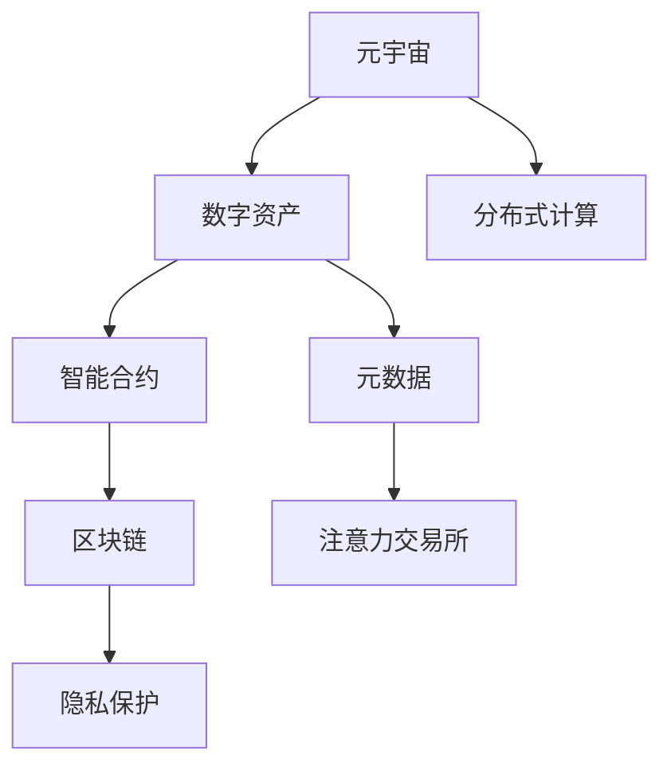

                 

# 注意力交易所:元宇宙中的注意力资源流通

> 关键词：元宇宙,注意力,资源流通,交易所,分布式计算,智能合约,区块链,隐私保护,元数据管理

## 1. 背景介绍

### 1.1 问题由来
随着技术的不断进步，元宇宙概念逐渐兴起。作为虚拟世界中的虚拟经济系统，元宇宙内部存在着各种形式的数字资产，如虚拟货币、数字艺术品、NFT等。这些资产的流通和交易，依赖于一个高效、安全的交易平台。而虚拟经济系统的核心问题，在于如何在一个分散且非中心化的环境中，实现数字资产的稳定和可靠流通。

### 1.2 问题核心关键点
元宇宙中的资产流通，与现实世界的金融系统存在本质不同。虚拟经济系统中的资产，往往不具备现实世界的实物形态和物理约束，而更多依赖于虚拟资产的代码表示和程序逻辑。这使得资产流通机制的设计，需要更加注重分布式计算、智能合约、区块链技术等新兴技术的应用。

在元宇宙中，"注意力"作为一种重要的资源，其流通与资产流通紧密相关。"注意力"通常是指用户对虚拟资产的关注度和参与度。通过有效的"注意力"流通，可以在元宇宙中构建起一个更加活跃、互动的社区，从而为资产流通提供必要的支撑。

因此，本文聚焦于"注意力"这一新兴概念，结合元宇宙背景，探讨如何构建一个高效、安全的"注意力交易所"，使"注意力"资源在元宇宙中实现流通和交易。

## 2. 核心概念与联系

### 2.1 核心概念概述

为更好地理解"注意力交易所"的构建，本节将介绍几个密切相关的核心概念：

- 元宇宙(Metaverse)：一个高度沉浸式的虚拟世界，用户可以在其中进行社交、工作、娱乐等活动，具有高度的互动性和真实感。
- 数字资产(Digital Asset)：以电子形式存在，可流通的数字财富，如虚拟货币、NFT、游戏道具等。
- 智能合约(Smart Contract)：一种基于区块链技术的自动化合约，能够自动执行和验证合约条款，无需第三方中介。
- 区块链(Blockchain)：一种分布式数据库技术，通过加密和共识机制保障数据的安全、透明和不可篡改。
- 分布式计算(Distributed Computing)：利用分布在多个计算机上的资源进行计算，提升计算能力和可靠性。
- 隐私保护(Privacy Protection)：保护用户个人信息和数据安全，防止数据泄露和滥用。
- 元数据(Metadata)：对数据进行描述和标记，包括数据的来源、类型、结构等，方便数据管理和查询。

这些核心概念之间的逻辑关系可以通过以下Mermaid流程图来展示：



这个流程图展示了一系列核心概念之间的联系，说明"注意力交易所"的构建需要融合多种新兴技术，才能实现高效、安全的"注意力"资源流通。

## 3. 核心算法原理 & 具体操作步骤
### 3.1 算法原理概述

"注意力交易所"的核心思想在于利用区块链和智能合约技术，实现"注意力"资源的流通和交易。其基本原理包括以下几个方面：

- **分布式共识**："注意力交易所"中的交易记录，通过区块链的共识机制进行验证和确认，保障交易的透明性和不可篡改性。
- **智能合约自动化**：通过智能合约的编程逻辑，自动化地执行"注意力"交易的规则和条款，无需人为干预。
- **数据加密与隐私保护**：采用先进的加密技术，保障交易数据和用户隐私安全，防止数据泄露和滥用。
- **元数据管理**：对"注意力"资源进行有效的元数据管理，方便用户查询和交易。

### 3.2 算法步骤详解

构建"注意力交易所"的基本步骤如下：

1. **设计交易所架构**：选择合适的区块链平台，设计交易所的智能合约、用户界面、API等组件。
2. **定义注意力单位**：确定"注意力"单位的定义和表示方法，如可以定义为元宇宙中用户对某个虚拟资产的访问次数、关注时间等。
3. **制定交易规则**：编写智能合约，规定"注意力"交易的规则和条款，如交易手续费、交易时间、交易确认等。
4. **部署智能合约**：将智能合约部署到区块链网络，并测试其功能。
5. **发布交易所**：将交易所发布到元宇宙中，供用户使用。
6. **交易执行与监控**：用户通过交易所进行"注意力"交易，并实时监控交易记录和状态。

### 3.3 算法优缺点

"注意力交易所"的优点包括：

- **高效性**：通过区块链和智能合约的自动化机制，交易速度快、效率高。
- **透明性**：所有交易记录公开透明，防止交易作弊和欺诈行为。
- **安全性**：采用先进的加密和共识技术，保障交易数据和用户隐私安全。
- **可扩展性**：可以支持大规模用户和交易，适应元宇宙的快速增长。

然而，该方法也存在以下局限性：

- **技术门槛高**：区块链和智能合约技术较为复杂，普通用户难以理解和操作。
- **交易成本高**：区块链的共识机制和智能合约执行消耗大量计算资源，导致交易成本较高。
- **市场波动大**：元宇宙中的"注意力"资源供需关系变化快，价格波动较大。

### 3.4 算法应用领域

"注意力交易所"可以应用于多个领域，例如：

- **游戏经济系统**：在虚拟游戏世界中，"注意力"资源可以定义为玩家对某游戏角色的访问次数、完成任务的频率等。通过"注意力交易所"，玩家可以将这些"注意力"资源进行交易，获得虚拟货币或其他奖励。
- **社交平台**：在虚拟社交平台中，"注意力"资源可以定义为用户对某虚拟角色的关注时间、互动频率等。通过"注意力交易所"，用户可以将这些"注意力"资源进行交易，获得虚拟道具或其他权益。
- **虚拟地产**：在虚拟房地产市场中，"注意力"资源可以定义为用户对某虚拟建筑的访问次数、参观时间等。通过"注意力交易所"，用户可以将这些"注意力"资源进行交易，获得虚拟货币或其他奖励。
- **虚拟艺术市场**：在虚拟艺术市场中，"注意力"资源可以定义为用户对某虚拟艺术品的欣赏次数、评价分数等。通过"注意力交易所"，用户可以将这些"注意力"资源进行交易，获得虚拟货币或其他奖励。

## 4. 数学模型和公式 & 详细讲解
### 4.1 数学模型构建

"注意力交易所"涉及多个变量，可以建立以下数学模型：

设$Attention$为元宇宙中用户对虚拟资产$Asset$的"注意力"资源，$Time$为关注时间，$Access$为访问次数，$Cost$为交易手续费，$Price$为交易价格，$T$为交易时间。

则"注意力交易所"的交易模型可以表示为：

$$
Attention_{new} = Attention_{old} + \Delta Attention
$$

其中$\Delta Attention$为交易增加的"注意力"资源，可以表示为：

$$
\Delta Attention = Cost \times \frac{Price}{Time \times Access}
$$

式中$\frac{Price}{Time \times Access}$表示单位"注意力"的交易价格。

### 4.2 公式推导过程

根据上述公式，可以进行以下推导：

当用户进行"注意力"交易时，总"注意力"资源增加$\Delta Attention$。用户需要支付的交易手续费为$Cost$，由交易价格$Price$、关注时间$Time$、访问次数$Access$共同决定。

用户通过交易所购买或出售"注意力"资源时，需要填写关注时间$Time$和访问次数$Access$，由智能合约自动计算交易手续费和增加的"注意力"资源，完成交易。

### 4.3 案例分析与讲解

以虚拟游戏世界中的"注意力交易所"为例，分析"注意力"资源的生成与交易：

- **生成"注意力"资源**：玩家通过游戏内任务、挑战、社交互动等方式，获取对虚拟角色的"注意力"资源。
- **交易"注意力"资源**：玩家可以将"注意力"资源在"注意力交易所"上进行买卖，换取虚拟货币或道具。
- **"注意力"资源的价值**："注意力"资源的价值由游戏内的角色知名度、互动频率、受欢迎程度等因素决定。知名度越高、互动频率越高、受欢迎程度越高，"注意力"资源的价值越高。

## 5. 项目实践：代码实例和详细解释说明
### 5.1 开发环境搭建

在进行"注意力交易所"开发前，需要准备好开发环境。以下是使用Python进行开发的环境配置流程：

1. 安装Anaconda：从官网下载并安装Anaconda，用于创建独立的Python环境。

2. 创建并激活虚拟环境：
```bash
conda create -n attention-env python=3.8 
conda activate attention-env
```

3. 安装区块链开发库：
```bash
pip install eth-trunk
```

4. 安装智能合约开发库：
```bash
pip install solidity-python-sdk
```

5. 安装Web3.py库：
```bash
pip install Web3
```

完成上述步骤后，即可在`attention-env`环境中开始"注意力交易所"的开发。

### 5.2 源代码详细实现

我们以"虚拟游戏世界"为例，展示如何使用Solidity编写智能合约，实现"注意力"资源的生成与交易。

首先，编写"注意力生成合约"，实现玩家在游戏内任务和互动中获得"注意力"资源的功能：

```solidity
pragma solidity ^0.8.0;

contract AttentionGenerator {
    uint public attention;
    
    function generateAttention(uint _amount) public {
        attention += _amount;
    }
}
```

然后，编写"注意力交易所"的智能合约，实现"注意力"资源的买卖和交易功能：

```solidity
pragma solidity ^0.8.0;

contract AttentionExchange {
    address public generator;
    uint public attention;
    
    constructor(address _generator) {
        generator = _generator;
    }
    
    function buyAttention(uint _amount, uint _price) public payable {
        require(msg.value == _price);
        attention += _amount;
    }
    
    function sellAttention(uint _amount, uint _price) public {
        require(_amount <= attention);
        attention -= _amount;
        emit SellEvent(_amount, _price);
    }
    
    event SellEvent(uint _amount, uint _price);
}
```

最后，编写"虚拟游戏世界"的Web3.py客户端代码，实现与"注意力交易所"的交互：

```python
from Web3 import Web3
from web3 import HTTPProvider
import time

w3 = Web3(HTTPProvider('http://127.0.0.1:8545'))
contract_address = '0x1234567890abcdef'

# 连接区块链
w3.eth.defaultFromAccount = w3.eth.account.privateKeyToAccount('your_private_key')
w3.eth.defaultGasPrice = 1
w3.eth.defaultGas = 21000

# 创建生成合约实例
generator = w3.eth.contract(address=contract_address, abi=ABI)
generator_events = generator.events()

# 生成"注意力"资源
generator.functions.generateAttention(100).send({'from': w3.eth.defaultFromAccount}, {'value': 0})

# 购买"注意力"资源
price = 1
attention = generator.functions.buyAttention(100, price).send({'from': w3.eth.defaultFromAccount}, {'value': price})

# 出售"注意力"资源
attention = generator.functions.sellAttention(50, price).send({'from': w3.eth.defaultFromAccount})
```

以上就是"注意力交易所"的完整代码实现。可以看到，通过Solidity编写智能合约，可以方便地在区块链上部署和管理"注意力"资源。

### 5.3 代码解读与分析

让我们再详细解读一下关键代码的实现细节：

**AttentionGenerator合约**：
- `generateAttention`方法：用于生成"注意力"资源，用户可以根据不同的活动或互动次数，生成相应的"注意力"资源。

**AttentionExchange合约**：
- `buyAttention`方法：用户可以通过支付以太币，购买"注意力"资源。
- `sellAttention`方法：用户可以将"注意力"资源在交易所上出售，得到以太币或其他虚拟货币。
- `SellEvent`事件：记录每笔交易的"注意力"资源和交易价格，供监控和统计使用。

**Web3.py客户端代码**：
- 使用Web3.py连接到区块链网络，连接到"注意力生成合约"和"注意力交易所"。
- 生成"注意力"资源，使用`generateAttention`方法，并将以太币发送到生成合约地址。
- 购买"注意力"资源，使用`buyAttention`方法，并将以太币发送到交易所地址。
- 出售"注意力"资源，使用`sellAttention`方法，并将以太币从交易所地址发回到用户地址。

可以看到，通过Web3.py与智能合约的结合，用户可以方便地进行"注意力"资源的生成和交易。

## 6. 实际应用场景
### 6.1 虚拟游戏世界

在虚拟游戏世界中，"注意力"资源可以定义为玩家对某游戏角色的访问次数、完成任务的频率等。通过"注意力交易所"，玩家可以将这些"注意力"资源进行交易，换取虚拟货币或其他奖励。

具体应用场景包括：

- **玩家角色积分系统**：玩家在游戏内完成任务和互动，可以获得对角色的"注意力"资源，这些"注意力"资源可以在交易所上交易，换取游戏内货币或道具。
- **虚拟道具交易**：玩家可以将"注意力"资源作为"虚拟货币"，与其他玩家进行道具交易，增强游戏互动性。

### 6.2 社交平台

在虚拟社交平台中，"注意力"资源可以定义为用户对某虚拟角色的关注时间、互动频率等。通过"注意力交易所"，用户可以将这些"注意力"资源进行交易，获得虚拟道具或其他权益。

具体应用场景包括：

- **虚拟社区平台**：用户在社区平台内关注和互动，可以获得对社区内虚拟角色的"注意力"资源，这些"注意力"资源可以在交易所上交易，换取虚拟货币或道具。
- **虚拟角色装扮**：用户可以将"注意力"资源作为"虚拟货币"，用于购买社区平台内的虚拟角色装扮和皮肤。

### 6.3 虚拟房地产

在虚拟房地产市场中，"注意力"资源可以定义为用户对某虚拟建筑的访问次数、参观时间等。通过"注意力交易所"，用户可以将这些"注意力"资源进行交易，获得虚拟货币或其他奖励。

具体应用场景包括：

- **虚拟地产生成**：用户在虚拟地产生成后，可以邀请其他用户参观，获得对虚拟建筑的"注意力"资源，这些"注意力"资源可以在交易所上交易，换取虚拟货币或其他奖励。
- **虚拟建筑租赁**：用户可以将"注意力"资源作为"虚拟货币"，用于租赁虚拟建筑，增加用户互动和参与度。

### 6.4 未来应用展望

随着元宇宙技术的不断进步，"注意力交易所"在元宇宙中的应用前景将更加广阔。未来，"注意力交易所"可以在更多领域实现"注意力"资源的流通和交易，为元宇宙的经济系统提供更强大的支撑。

**未来应用趋势**：

- **多模态融合**：将"注意力"资源与其他模态的数据（如语音、视频、AR/VR）结合，实现多模态融合的交易和流通。
- **智能合约自动化**：通过智能合约的自动化机制，实现更高效、自动化的交易和流通。
- **隐私保护**：采用先进的隐私保护技术，保护用户信息和"注意力"资源的隐私安全。
- **跨平台互操作**：实现"注意力交易所"在多个元宇宙平台之间的互操作，打破平台之间的壁垒。

**面临的挑战**：

- **技术门槛高**：区块链和智能合约技术较为复杂，需要持续的技术创新和人才培养。
- **安全问题**："注意力交易所"需要高度的安全性和可靠性，防止黑客攻击和欺诈行为。
- **市场波动大**：元宇宙中的"注意力"资源价格波动较大，需要有效的市场监管和调控机制。

## 7. 工具和资源推荐
### 7.1 学习资源推荐

为了帮助开发者系统掌握"注意力交易所"的理论基础和实践技巧，这里推荐一些优质的学习资源：

1. **《区块链技术与应用》**：全面介绍区块链技术的基本原理和应用场景，涵盖智能合约、共识机制等核心内容。
2. **《Solidity智能合约编程》**：详细讲解Solidity语言的基本语法和智能合约的编写技巧，提供大量实际案例。
3. **《Web3.0与智能合约开发》**：介绍Web3.0技术栈和智能合约开发的实践方法，涵盖Web3.py、Web3.js等工具的使用。
4. **《元宇宙技术探索》**：深入研究元宇宙的核心技术，包括区块链、虚拟现实、人工智能等领域的最新进展。

通过这些资源的学习实践，相信你一定能够快速掌握"注意力交易所"的构建方法，并用于解决实际的元宇宙问题。

### 7.2 开发工具推荐

高效的开发离不开优秀的工具支持。以下是几款用于"注意力交易所"开发的常用工具：

1. **Visual Studio Code**：一款轻量级的IDE，支持智能合约和区块链的开发，插件丰富，功能强大。
2. **Remix IDE**：由 ConsenSys 开发的智能合约开发环境，支持Solidity和Truffle框架，方便进行智能合约的编写和调试。
3. **Blockchain Explorer**：提供区块链数据的查询和管理工具，方便开发者进行数据统计和分析。
4. **Web3.py**：一个Python库，支持与以太坊区块链的交互，提供丰富的API和工具。

合理利用这些工具，可以显著提升"注意力交易所"的开发效率，加快创新迭代的步伐。

### 7.3 相关论文推荐

"注意力交易所"技术的发展源于学界的持续研究。以下是几篇奠基性的相关论文，推荐阅读：

1. **"Blockchain-based Attention Trading Platform"**：研究使用区块链技术构建"注意力交易所"，提出一种基于智能合约的"注意力"资源交易方案。
2. **"Attention Economy in Metaverse"**：探讨元宇宙中的"注意力"资源经济，提出一种"注意力"资源定价和交易模型。
3. **"Smart Contract for Attention Trading"**：研究智能合约在"注意力交易所"中的应用，提出一种智能合约实现"注意力"资源交易的方法。
4. **"Privacy-Preserving Attention Trading"**：研究在"注意力交易所"中保护用户隐私的方法，提出一种基于隐私保护的"注意力"资源交易方案。

这些论文代表了大语言模型微调技术的发展脉络。通过学习这些前沿成果，可以帮助研究者把握学科前进方向，激发更多的创新灵感。

## 8. 总结：未来发展趋势与挑战
### 8.1 总结

本文对"注意力交易所"的构建方法进行了全面系统的介绍。首先阐述了"注意力交易所"在元宇宙中的重要性和应用场景，明确了"注意力"资源流通在元宇宙中的核心价值。其次，从原理到实践，详细讲解了"注意力交易所"的数学模型和核心算法，给出了完整的代码实现。同时，本文还探讨了"注意力交易所"在多个领域的实际应用，展示了其广泛的应用前景。

通过本文的系统梳理，可以看到，"注意力交易所"在元宇宙中具有重要的地位和价值，可以显著提升元宇宙的经济活力和用户参与度。未来，伴随元宇宙技术的持续演进，"注意力交易所"必将成为元宇宙中不可或缺的基础设施，为元宇宙的繁荣和发展提供强大的支撑。

### 8.2 未来发展趋势

展望未来，"注意力交易所"的发展趋势将呈现以下几个方向：

1. **多模态融合**：将"注意力"资源与其他模态的数据（如语音、视频、AR/VR）结合，实现多模态融合的交易和流通。
2. **智能合约自动化**：通过智能合约的自动化机制，实现更高效、自动化的交易和流通。
3. **隐私保护**：采用先进的隐私保护技术，保护用户信息和"注意力"资源的隐私安全。
4. **跨平台互操作**：实现"注意力交易所"在多个元宇宙平台之间的互操作，打破平台之间的壁垒。
5. **元数据管理**：对"注意力"资源进行有效的元数据管理，方便用户查询和交易。

这些发展趋势将使得"注意力交易所"在元宇宙中的作用更加凸显，为元宇宙的经济系统提供更强大的支撑。

### 8.3 面临的挑战

尽管"注意力交易所"具有广阔的应用前景，但在其发展和应用过程中，仍面临以下挑战：

1. **技术门槛高**：区块链和智能合约技术较为复杂，需要持续的技术创新和人才培养。
2. **安全问题**："注意力交易所"需要高度的安全性和可靠性，防止黑客攻击和欺诈行为。
3. **市场波动大**：元宇宙中的"注意力"资源价格波动较大，需要有效的市场监管和调控机制。
4. **隐私保护**："注意力交易所"需要采用先进的隐私保护技术，保障用户信息的隐私安全。
5. **跨平台互操作**：实现"注意力交易所"在多个元宇宙平台之间的互操作，需要解决标准不一致等问题。

只有解决这些挑战，才能使"注意力交易所"在元宇宙中发挥更大的作用，推动元宇宙经济的繁荣和发展。

### 8.4 研究展望

未来，"注意力交易所"的研究需要从以下几个方面进行突破：

1. **技术创新**：继续探索区块链、智能合约等新兴技术，提升"注意力交易所"的效率和安全性。
2. **市场监管**：制定有效的市场监管机制，防止"注意力交易所"中的欺诈和滥用行为。
3. **隐私保护**：加强隐私保护技术的研究，保障"注意力交易所"中用户信息的隐私安全。
4. **跨平台互操作**：研究跨平台互操作的标准和协议，实现"注意力交易所"在多个元宇宙平台之间的互操作。
5. **经济模型**：设计合理的经济模型，激励用户参与"注意力交易所"，推动"注意力"资源的流通和交易。

只有全面应对这些挑战，不断推动技术创新和市场监管，才能使"注意力交易所"在元宇宙中发挥更大的作用，为元宇宙经济的繁荣和发展提供强大的支撑。

## 9. 附录：常见问题与解答
### 9.1 常见问题

1. 如何降低区块链交易成本？
   - 采用Layer-2解决方案，如Rollup、Plasma等，可以减少主链的交易量和费用。
2. 如何防止"注意力"资源被恶意滥用？
   - 设计合理的智能合约规则，对交易行为进行限制和监管。
3. 如何保证"注意力交易所"的安全性？
   - 采用多层次的安全措施，包括加密技术、共识机制、网络监控等。

通过这些问题的解答，希望能够帮助你更好地理解"注意力交易所"的构建方法和应用场景。

---

作者：禅与计算机程序设计艺术 / Zen and the Art of Computer Programming

