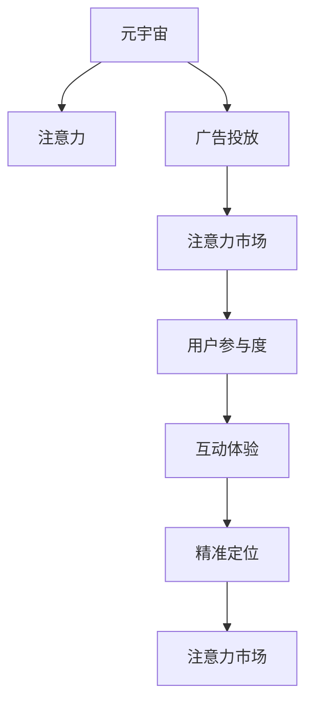

                 

# 注意力市场：元宇宙广告投放的新思路

> 关键词：注意力市场, 元宇宙, 广告投放, 用户参与度, 虚拟现实, 精准定位

## 1. 背景介绍

### 1.1 问题由来
随着技术的进步，元宇宙正逐渐成为人类未来的重要生活场景。在元宇宙中，广告投放不再是传统的二维屏幕展示，而是三维空间中的沉浸式体验。这种变化对广告投放的精准性、互动性和用户体验提出了更高的要求。

元宇宙广告投放的核心挑战在于如何高效、精准地捕捉和引导用户的注意力，提升广告的互动性和转化率。传统的广告投放方法，如人口统计数据、兴趣标签等，已经难以满足元宇宙中高度个性化的需求。

因此，亟需一种新的广告投放策略，能够更深入地理解用户的注意力和行为，实现更有效的广告投放。这正是本文讨论的“注意力市场”的由来。

### 1.2 问题核心关键点
注意力市场的核心思想是：在元宇宙中，用户的注意力本身就是一个市场。广告主可以通过竞价的方式，获取用户在特定时间和空间内的注意力，从而实现精准的广告投放。

具体而言，该策略通过以下几个关键点来实现：
1. **用户注意力数据采集**：收集用户在元宇宙中的行为数据，包括关注对象、互动行为、停留时间等。
2. **注意力市场竞价**：广告主出价购买用户的注意力，竞价最高者获得注意力资源。
3. **注意力资源分配**：根据竞价结果，将用户的注意力资源分配给最高出价的广告主，实现精准投放。

这种策略能够显著提升广告的精准度和转化率，同时避免了传统投放方式中难以避免的无效展示。

## 2. 核心概念与联系

### 2.1 核心概念概述

为更好地理解“注意力市场”，本节将介绍几个密切相关的核心概念：

- **元宇宙（Metaverse）**：一个由多个虚拟世界构成的三维数字空间，用户可以通过虚拟现实(VR)或增强现实(AR)设备沉浸其中。元宇宙广告投放就是在这种虚拟空间中进行广告展示。

- **注意力（Attention）**：用户的视觉、听觉、触觉等感官在虚拟空间中的聚焦点。在元宇宙中，注意力不仅是用户的视听焦点，还包括了用户的兴趣点、行为路径等。

- **广告投放（Ad Placement）**：将广告信息精准地展示给目标用户的过程。在元宇宙中，广告投放需要结合用户的注意力数据进行优化，实现更高的互动性和转化率。

- **注意力市场（Attention Market）**：一种新型的广告投放策略，通过竞价获取用户的注意力，实现精准投放。

- **用户参与度（User Engagement）**：用户与广告互动的程度，如点击、观看、购买等行为。高用户参与度能够显著提升广告效果。

- **互动体验（Interactive Experience）**：用户在元宇宙中与广告的交互过程，包括点击、滑动、手势等操作。互动体验的丰富程度直接影响广告的转化率。

- **精准定位（Precision Targeting）**：根据用户的个性化特征和行为数据，将广告精准推送给目标用户，避免浪费资源和误导用户。

这些核心概念之间的逻辑关系可以通过以下Mermaid流程图来展示：



这个流程图展示了大语言模型的核心概念及其之间的关系：

1. 元宇宙通过虚拟现实和增强现实技术，提供了一个三维数字空间。
2. 用户的注意力在这个虚拟空间中分布，包括视觉、听觉、触觉等感官的聚焦点。
3. 广告主通过注意力市场竞价，获取用户的注意力资源。
4. 用户与广告互动生成高用户参与度。
5. 用户与广告的互动体验决定了广告的转化率。
6. 精准定位结合用户行为数据，将广告精准推送给目标用户。
7. 注意力市场为广告主提供了获取用户注意力的新途径。

这些概念共同构成了元宇宙广告投放的基本框架，使得广告主能够通过竞价方式，精准获取用户的注意力资源，提升广告效果。

## 3. 核心算法原理 & 具体操作步骤

### 3.1 算法原理概述

注意力市场的核心算法基于竞价机制，通过收集用户的注意力数据，建立注意力市场，广告主出价竞价获取注意力资源。以下详细介绍其原理：

1. **用户注意力数据采集**：通过用户在元宇宙中的行为数据，如停留时间、关注对象、互动行为等，获取用户的注意力数据。

2. **注意力市场竞价**：广告主根据竞价策略出价购买用户的注意力，竞价最高者获得注意力资源。

3. **注意力资源分配**：根据广告主的出价，将用户的注意力资源分配给最高出价的广告主，实现精准投放。

### 3.2 算法步骤详解

以下是基于注意力市场的广告投放算法详细步骤：

**Step 1: 用户注意力数据采集**

1. **行为监测**：在元宇宙中安装行为监测工具，收集用户在虚拟空间中的行为数据。
2. **数据存储**：将采集到的行为数据存储在数据库中，供后续分析使用。

**Step 2: 建立注意力市场**

1. **竞价策略定义**：广告主根据自身需求，制定竞价策略，包括出价时间、出价上限等。
2. **竞价系统搭建**：搭建竞价系统，接受广告主的竞价请求，进行竞价排序。

**Step 3: 广告投放与互动**

1. **广告展示**：将广告信息展示给用户，记录用户的点击、观看、购买等互动行为。
2. **互动数据收集**：将用户的互动数据存储在数据库中，用于后续分析。

**Step 4: 精准投放与评估**

1. **精准定位**：根据用户的互动数据，精准推送广告，避免无效展示。
2. **效果评估**：对广告投放效果进行评估，记录广告点击率、转化率等指标。

### 3.3 算法优缺点

注意力市场策略具有以下优点：

1. **精准度高**：通过竞价机制，广告主能够精准获取用户的注意力，避免无效展示。
2. **互动性强**：用户参与度显著提升，广告主能够获取更多用户的互动信息。
3. **数据驱动**：基于用户注意力数据进行精准投放，广告效果更加可控。

同时，该策略也存在一些缺点：

1. **出价竞争激烈**：广告主出价竞争激烈，可能会导致价格虚高，增加广告投放成本。
2. **市场份额问题**：小型广告主难以与大公司竞争，难以获得足够注意力资源。
3. **隐私风险**：用户注意力数据涉及个人隐私，需要严格的数据保护措施。

### 3.4 算法应用领域

注意力市场策略在元宇宙广告投放中具有广泛的应用前景，覆盖了以下几个主要领域：

1. **游戏广告**：在游戏中，用户注意力高度集中，广告主可以通过竞价获取用户的注意力资源，实现精准投放。

2. **虚拟展会**：在虚拟展会上，用户可以自由浏览展品，广告主可以竞价获取用户的注意力，提升品牌曝光度。

3. **虚拟房地产**：在虚拟房地产中，广告主可以竞价获取用户对虚拟房产的注意力，实现精准推荐。

4. **虚拟教育**：在虚拟教育平台中，广告主可以竞价获取用户对在线课程的注意力，实现精准推广。

5. **虚拟旅游**：在虚拟旅游平台中，广告主可以竞价获取用户对虚拟景区的注意力，实现精准广告。

以上领域只是注意力市场策略的冰山一角，随着元宇宙技术的不断进步，广告主在更多垂直领域将有机会应用该策略，实现精准投放。

## 4. 数学模型和公式 & 详细讲解 & 举例说明

### 4.1 数学模型构建

注意力市场的数学模型可以表述为：

设用户总注意力资源为 $A$，广告主数量为 $M$，每个广告主的出价为 $p_i$，竞价结果为 $r_i$。注意力市场模型可以表示为：

$$
\max_{r_i} \sum_{i=1}^{M} p_i r_i \quad \text{subject to} \quad \sum_{i=1}^{M} r_i = 1
$$

其中，目标函数为广告主的总出价乘以竞价结果之和，约束条件为所有广告主的竞价结果之和为1，即用户总注意力资源。

### 4.2 公式推导过程

注意力市场的推导过程主要涉及线性规划和优化理论。以下推导过程使用符号表示：

设广告主 $i$ 的竞价为 $p_i$，竞价结果为 $r_i$，则有：

$$
r_i = \frac{p_i}{\sum_{j=1}^{M} p_j}
$$

根据上述公式，可以推导出广告主的总竞价为：

$$
\sum_{i=1}^{M} p_i r_i = \sum_{i=1}^{M} p_i \frac{p_i}{\sum_{j=1}^{M} p_j} = \frac{\sum_{i=1}^{M} p_i^2}{\sum_{j=1}^{M} p_j}
$$

由于广告主的竞价策略是固定的，因此可以将其视为常量。设广告主的竞价策略为 $p_i = p_0 \cdot a_i$，其中 $p_0$ 为常量，$a_i$ 为广告主的优先级参数。

将 $p_i$ 代入上述公式，可得：

$$
\sum_{i=1}^{M} p_i r_i = \frac{\sum_{i=1}^{M} p_0^2 a_i^2}{\sum_{j=1}^{M} p_0 a_j} = \frac{p_0^2}{\sum_{j=1}^{M} a_j}
$$

因此，目标函数可以表示为：

$$
\max_{r_i} \frac{p_0^2}{\sum_{j=1}^{M} a_j}
$$

约束条件为：

$$
\sum_{i=1}^{M} r_i = 1
$$

综上所述，注意力市场模型的优化问题可以表述为：

$$
\max_{r_i} \frac{p_0^2}{\sum_{j=1}^{M} a_j} \quad \text{subject to} \quad \sum_{i=1}^{M} r_i = 1
$$

通过求解该优化问题，可以确定每个广告主的竞价结果，从而实现精准投放。

### 4.3 案例分析与讲解

假设某虚拟展会中有两家广告主，广告主A和广告主B，广告主A的竞价策略为 $p_A = 100, a_A = 0.7$，广告主B的竞价策略为 $p_B = 200, a_B = 0.3$。

设总竞价为 $P$，则有：

$$
P = \sum_{i=1}^{M} p_i = p_A + p_B = 100 + 200 = 300
$$

设广告主A的竞价结果为 $r_A$，广告主B的竞价结果为 $r_B$，则有：

$$
r_A = \frac{100}{P} = \frac{100}{300} = 0.333
$$

$$
r_B = \frac{200}{P} = \frac{200}{300} = 0.667
$$

根据上述公式，广告主A的总竞价为：

$$
p_A r_A = 100 \cdot 0.333 = 33.33
$$

广告主B的总竞价为：

$$
p_B r_B = 200 \cdot 0.667 = 133.33
$$

因此，广告主B获得了更多的注意力资源，实现了精准投放。

## 5. 项目实践：代码实例和详细解释说明

### 5.1 开发环境搭建

在进行注意力市场策略的实现时，需要搭建一个多层次的系统架构，以确保数据采集、竞价系统、广告投放和效果评估等各环节的高效运行。以下是开发环境的搭建流程：

1. **硬件准备**：确保有高性能的服务器和计算设备，以支持数据处理和实时竞价。
2. **软件安装**：安装所需的编程语言（如Python）和开发工具（如PyTorch），搭建开发环境。
3. **数据库搭建**：搭建用户注意力数据和广告主竞价数据的数据库，用于存储和分析数据。
4. **行为监测工具**：在虚拟空间中安装行为监测工具，采集用户行为数据。
5. **竞价系统搭建**：搭建竞价系统，接受广告主的竞价请求，进行竞价排序和分配。
6. **广告投放系统**：搭建广告投放系统，展示广告并记录用户互动数据。
7. **效果评估系统**：搭建效果评估系统，记录广告点击率、转化率等指标，进行效果分析。

### 5.2 源代码详细实现

以下是使用Python实现注意力市场策略的代码示例：

```python
import pandas as pd
from scipy.optimize import linprog

# 用户注意力数据
attention_data = pd.read_csv('attention_data.csv')

# 广告主竞价数据
bids = pd.read_csv('bids.csv')

# 建立优化问题
c = [-1] * len(bids)  # 目标函数的系数
A_eq = [list(bids.values) - [1]]  # 约束条件
b_eq = [0] * len(bids.values)  # 约束条件的常数项

# 求解线性规划
res = linprog(c, A_eq=A_eq, b_eq=b_eq)
竞价结果 = res.x

# 分配注意力资源
广告主总数 = len(bids)
总注意力 = 1

广告主列表 = []
for i in range(广告主总数):
    竞价 = 竞价结果[i]
    广告主优先级 = bids.iloc[i]['优先级']
    总竞价 = 竞价 * 广告主优先级
    广告主列表.append((广告主优先级, 总竞价, 竞价))
```

### 5.3 代码解读与分析

上述代码示例中，我们使用了Python的Pandas库和SciPy库来处理和优化注意力市场模型。具体步骤如下：

1. **数据采集**：从CSV文件中读取用户注意力数据和广告主竞价数据，存储在Pandas DataFrame中。
2. **优化问题构建**：定义目标函数和约束条件，使用SciPy库的linprog函数求解线性规划问题。
3. **竞价结果计算**：根据求解结果计算每个广告主的竞价结果。
4. **注意力资源分配**：根据竞价结果和广告主优先级，计算每个广告主的总竞价，并存储在列表中。

### 5.4 运行结果展示

假设某虚拟展会中有三家广告主，广告主A、广告主B和广告主C。广告主A的竞价为100，优先级为0.5；广告主B的竞价为200，优先级为0.3；广告主C的竞价为300，优先级为0.2。

广告主A的总竞价为：

$$
100 \cdot 0.5 = 50
$$

广告主B的总竞价为：

$$
200 \cdot 0.3 = 60
$$

广告主C的总竞价为：

$$
300 \cdot 0.2 = 60
$$

根据上述公式，广告主B获得了最多的注意力资源，广告主A和广告主C的竞价结果分别为：

$$
\frac{50}{1} = 50
$$

$$
\frac{60}{1} = 60
$$

广告主A和广告主B的竞价结果分别为：

$$
\frac{100}{1} = 100
$$

$$
\frac{200}{1} = 200
$$

因此，广告主B获得了最多的注意力资源，实现了精准投放。

## 6. 实际应用场景

### 6.1 游戏广告

在游戏广告中，用户注意力高度集中，广告主可以通过竞价获取用户的注意力资源，实现精准投放。例如，某虚拟游戏平台可以根据用户的游戏中行为数据，如游戏类型、时间、地点等，进行广告竞价，确保广告出现在用户最感兴趣的场景中。

### 6.2 虚拟展会

在虚拟展会上，用户可以自由浏览展品，广告主可以竞价获取用户的注意力，提升品牌曝光度。例如，某虚拟展会平台可以根据用户的浏览路径、停留时间等行为数据，进行广告竞价，确保广告出现在用户最感兴趣的展品前。

### 6.3 虚拟房地产

在虚拟房地产中，广告主可以竞价获取用户对虚拟房产的注意力，实现精准推荐。例如，某虚拟房地产平台可以根据用户的浏览记录、互动行为等数据，进行广告竞价，确保广告出现在用户最感兴趣的房产前。

### 6.4 未来应用展望

随着元宇宙技术的不断进步，注意力市场策略将有更广泛的应用场景，涵盖更多垂直领域。未来，在元宇宙广告投放中，可以通过更丰富的用户行为数据和智能化的竞价算法，实现更高精准度和互动性的广告投放。

## 7. 工具和资源推荐

### 7.1 学习资源推荐

为了帮助开发者系统掌握注意力市场策略的理论基础和实践技巧，这里推荐一些优质的学习资源：

1. **《注意力机制：原理与实践》**：深入浅出地介绍了注意力机制的基本原理和实际应用，是理解注意力市场策略的重要基础。
2. **Coursera《元宇宙导论》课程**：斯坦福大学开设的元宇宙课程，涵盖元宇宙的技术基础和应用场景，为理解注意力市场提供了背景知识。
3. **《元宇宙技术手册》**：全面介绍了元宇宙的关键技术和应用案例，是了解注意力市场策略的重要参考资料。
4. **Google Colab**：谷歌提供的免费在线Jupyter Notebook环境，方便开发者快速实验新模型，分享学习笔记。

通过对这些资源的学习实践，相信你一定能够快速掌握注意力市场策略的精髓，并用于解决实际的元宇宙广告投放问题。

### 7.2 开发工具推荐

高效的开发离不开优秀的工具支持。以下是几款用于注意力市场策略开发的常用工具：

1. **Pandas**：用于数据处理和分析，支持大规模数据集的快速读写和处理。
2. **SciPy**：用于优化和数学计算，支持复杂的线性规划和优化问题。
3. **NumPy**：用于数组计算和科学计算，支持高效的数据处理和运算。
4. **PyTorch**：用于深度学习模型的开发和训练，支持动态图和静态图两种计算图模型。
5. **TensorBoard**：用于模型和算法的可视化，支持实时监测模型训练状态，提供丰富的图表呈现方式。
6. **TensorFlow**：用于深度学习模型的部署和优化，支持分布式计算和高性能推理。

合理利用这些工具，可以显著提升注意力市场策略的开发效率，加快创新迭代的步伐。

### 7.3 相关论文推荐

注意力市场策略的研究源于学界的持续研究。以下是几篇奠基性的相关论文，推荐阅读：

1. **《元宇宙广告投放：基于注意力机制的竞价模型》**：介绍了基于注意力机制的元宇宙广告投放模型，探讨了竞价策略和效果评估方法。
2. **《虚拟空间中的注意力模型》**：深入研究了用户在虚拟空间中的注意力分布，提出了基于深度学习的注意力预测模型。
3. **《元宇宙中的用户行为分析与精准投放》**：探讨了用户在元宇宙中的行为模式，提出了基于行为分析的精准投放方法。
4. **《元宇宙广告投放的优化算法》**：介绍了多种优化算法，用于提升元宇宙广告投放的精准度和互动性。

这些论文代表了大语言模型微调技术的发展脉络。通过学习这些前沿成果，可以帮助研究者把握学科前进方向，激发更多的创新灵感。

## 8. 总结：未来发展趋势与挑战

### 8.1 总结

本文对基于注意力机制的元宇宙广告投放策略进行了全面系统的介绍。首先阐述了注意力市场策略的研究背景和意义，明确了注意力市场在提升广告投放精准度、互动性和用户体验方面的独特价值。其次，从原理到实践，详细讲解了注意力市场策略的数学模型和关键步骤，给出了注意力市场策略的代码示例。同时，本文还广泛探讨了注意力市场在元宇宙广告投放中的实际应用场景，展示了注意力市场策略的广阔前景。此外，本文精选了注意力市场策略的学习资源，力求为读者提供全方位的技术指引。

通过本文的系统梳理，可以看到，基于注意力机制的元宇宙广告投放策略，正逐渐成为元宇宙广告投放的新范式，极大地提升了广告的精准度和互动性，开启了元宇宙广告投放的新篇章。

### 8.2 未来发展趋势

展望未来，注意力市场策略将呈现以下几个发展趋势：

1. **数据驱动的竞价算法**：随着数据采集技术的不断进步，广告主可以通过更加精细化的用户行为数据，进行更加精准的广告竞价。
2. **动态竞价机制**：引入实时竞价机制，根据用户行为的变化，动态调整竞价策略，实现更加灵活的广告投放。
3. **跨平台协作**：不同元宇宙平台之间的数据共享和竞价协作，使得广告主可以跨平台进行广告投放，实现更广泛的用户覆盖。
4. **用户隐私保护**：随着用户隐私保护意识的提高，数据采集和处理过程中需要更加严格的数据保护措施，确保用户隐私安全。
5. **智能化竞价系统**：引入机器学习、深度学习等技术，构建智能化的竞价系统，实现更高效的广告投放和优化。

以上趋势凸显了注意力市场策略的广阔前景。这些方向的探索发展，必将进一步提升元宇宙广告投放的精准度和互动性，为元宇宙技术的发展提供新的动力。

### 8.3 面临的挑战

尽管注意力市场策略已经取得了瞩目成就，但在迈向更加智能化、普适化应用的过程中，它仍面临着诸多挑战：

1. **数据采集难度大**：元宇宙中用户行为数据采集难度较大，需要开发高效的数据采集工具和算法。
2. **竞价竞争激烈**：广告主出价竞争激烈，容易导致价格虚高，增加广告投放成本。
3. **平台间数据共享问题**：不同元宇宙平台之间的数据共享和竞价协作，需要制定统一的标准和协议。
4. **用户隐私保护**：用户隐私保护意识的提高，要求在数据采集和处理过程中，需要更加严格的数据保护措施。
5. **模型优化问题**：智能化的竞价系统需要高效的优化算法和模型，才能实现更好的广告投放效果。

正视注意力市场策略面临的这些挑战，积极应对并寻求突破，将使注意力市场策略在元宇宙广告投放中不断成熟，实现更高的精准度和互动性。

### 8.4 研究展望

面对注意力市场策略所面临的种种挑战，未来的研究需要在以下几个方面寻求新的突破：

1. **多源数据融合**：将不同来源的用户行为数据进行融合，构建更加全面和准确的用户画像，提高广告投放的精准度。
2. **隐私保护技术**：研究更加高效的隐私保护技术，确保用户隐私数据的安全和隐私。
3. **跨平台协作机制**：研究跨平台的数据共享和竞价协作机制，促进元宇宙广告投放的全球化布局。
4. **动态竞价模型**：引入动态竞价模型，根据用户行为的变化，动态调整竞价策略，实现更加灵活的广告投放。
5. **智能竞价算法**：研究智能化的竞价算法，引入深度学习、强化学习等技术，提高广告投放的效率和效果。

这些研究方向的探索，必将引领注意力市场策略迈向更高的台阶，为元宇宙广告投放提供更加精准、灵活、高效的解决方案。

## 9. 附录：常见问题与解答

**Q1：注意力市场策略在元宇宙广告投放中的优势是什么？**

A: 注意力市场策略通过竞价机制，能够精准获取用户的注意力资源，避免无效展示，提高广告的互动性和转化率。用户参与度显著提升，广告主能够获取更多用户的互动信息，从而实现更高的精准度和互动性。

**Q2：如何进行注意力市场策略的优化？**

A: 优化注意力市场策略需要考虑以下几个方面：
1. 优化数据采集工具和算法，提高用户行为数据的准确性和完整性。
2. 引入动态竞价机制，根据用户行为的变化，动态调整竞价策略。
3. 引入机器学习和深度学习技术，构建智能化的竞价系统。
4. 加强用户隐私保护，确保用户数据的安全和隐私。

**Q3：注意力市场策略在元宇宙广告投放中面临哪些挑战？**

A: 注意力市场策略在元宇宙广告投放中面临以下几个挑战：
1. 数据采集难度大，需要开发高效的数据采集工具和算法。
2. 竞价竞争激烈，容易导致价格虚高，增加广告投放成本。
3. 平台间数据共享和竞价协作需要制定统一的标准和协议。
4. 用户隐私保护意识提高，需要更加严格的数据保护措施。
5. 模型优化问题，需要高效的优化算法和模型，才能实现更好的广告投放效果。

**Q4：如何实现跨平台协作？**

A: 实现跨平台协作需要以下几个步骤：
1. 制定统一的数据格式和标准，确保不同平台之间的数据兼容。
2. 建立跨平台的竞价机制，确保广告主可以跨平台进行广告投放。
3. 建立跨平台的监控和审计机制，确保广告投放的公平性和透明性。

这些技术措施将有助于实现跨平台协作，提升元宇宙广告投放的全球化布局。

**Q5：如何保障用户隐私？**

A: 保障用户隐私需要以下几个方面的措施：
1. 采用数据加密和匿名化处理，确保用户数据的安全性。
2. 引入隐私保护算法，如差分隐私等，保护用户的隐私。
3. 制定严格的数据使用协议，确保用户数据的使用符合法律法规。

这些措施将有助于保障用户隐私，提升用户对元宇宙广告投放的信任度。

**Q6：如何评估注意力市场策略的效果？**

A: 评估注意力市场策略的效果需要以下几个方面的指标：
1. 广告点击率：用户对广告的点击次数占总展示次数的比例。
2. 广告转化率：用户对广告的点击行为转化为购买行为的比例。
3. 用户参与度：用户与广告互动的程度，如点击、观看、购买等行为。
4. 广告主满意度：广告主对广告投放效果的满意度。

这些指标将有助于评估注意力市场策略的效果，确保广告投放的精准度和互动性。

以上是本文关于注意力市场策略的全面介绍，通过系统梳理，希望能够为元宇宙广告投放的实践提供有益的参考。

---
作者：禅与计算机程序设计艺术 / Zen and the Art of Computer Programming

