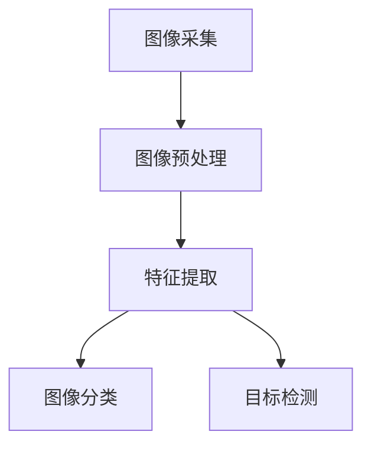

                 

人工智能、计算机视觉、深度学习、神经网络、图像处理、计算机视觉应用

## 1. 背景介绍

在当今信息爆炸的时代，计算机视觉（Computer Vision，CV）技术已然成为人类获取和理解视觉信息的关键工具。从自动驾驶汽车到安防监控，从医学图像分析到虚拟现实，计算机视觉无处不在，无所不及。然而，计算机视觉的发展并非一帆风顺，而是经历了数十年不断创新和突破的过程。本文将深入探讨计算机视觉的核心概念与算法，并通过项目实践和实际应用场景，展示计算机视觉的创新力量。

## 2. 核心概念与联系

计算机视觉是一门多学科交叉的学科，涉及计算机科学、数学、统计学、光学、神经科学等领域。其核心概念包括图像采集、图像预处理、特征提取、图像分类和目标检测等。下图是计算机视觉核心概念的 Mermaid 流程图：



## 3. 核心算法原理 & 具体操作步骤

### 3.1 算法原理概述

计算机视觉的核心算法之一是卷积神经网络（Convolutional Neural Network，CNN）。CNN是一种深度学习模型，专门设计用于处理网格结构数据，如图像。CNN的核心组件是卷积层和池化层。

### 3.2 算法步骤详解

CNN的训练过程包括以下步骤：

1. **数据预处理**：对图像数据进行归一化、增强等预处理，以提高模型的泛化能力。
2. **构建网络结构**：设计CNN网络结构，包括卷积层、池化层、全连接层等。
3. **定义损失函数**：选择适合任务的损失函数，如交叉熵损失。
4. **选择优化器**：选择合适的优化器，如Adam或SGD，以更新模型参数。
5. **训练模型**：使用训练数据集训练模型，并监控模型在验证集上的表现。
6. **评估模型**：使用测试数据集评估模型的性能，并进行性能指标分析。

### 3.3 算法优缺点

CNN的优点包括：

- **特征自动提取**：CNN可以自动从图像中提取特征，无需人工设计特征提取器。
- **泛化能力强**：CNN模型在图像分类和目标检测任务上表现出强大的泛化能力。
- **广泛应用**：CNN在计算机视觉领域的各种任务中都有广泛应用，如图像分类、目标检测、语义分割等。

CNN的缺点包括：

- **计算复杂度高**：CNN模型通常需要大量的计算资源进行训练和推理。
- **数据需求量大**：CNN模型需要大量的标注数据进行训练，数据获取和标注是一项繁重的任务。
- **训练时间长**：CNN模型的训练时间通常很长，需要大量的时间和计算资源。

### 3.4 算法应用领域

CNN在计算机视觉领域的应用非常广泛，包括：

- **图像分类**：CNN可以用于图像分类任务，如ImageNet挑战赛。
- **目标检测**：CNN可以用于目标检测任务，如COCO数据集的目标检测挑战赛。
- **语义分割**：CNN可以用于图像语义分割任务，如Cityscapes数据集的语义分割挑战赛。
- **人脸识别**：CNN可以用于人脸识别任务，如FaceNet和DeepFace等模型。

## 4. 数学模型和公式 & 详细讲解 & 举例说明

### 4.1 数学模型构建

CNN的数学模型可以表示为以下形式：

$$y = f(x; W, b) = \sigma(z) = \sigma(Wx + b)$$

其中，$x$是输入图像，$y$是输出结果，$W$和$b$是模型参数，$\sigma$是激活函数，如ReLU或sigmoid，$z$是线性变换结果。

### 4.2 公式推导过程

CNN的损失函数通常选择交叉熵损失：

$$L = -\sum_{c=1}^{C}y_{c}\log(\hat{y}_{c})$$

其中，$C$是类别数，$y_{c}$是真实标签，$ \hat{y}_{c}$是模型预测的概率分布。

模型参数的更新可以使用梯度下降法或其变种，如Adam或SGD：

$$W := W - \eta \nabla_{W}L$$

$$b := b - \eta \nabla_{b}L$$

其中，$\eta$是学习率，$\nabla_{W}L$和$\nabla_{b}L$是损失函数对$W$和$b$的梯度。

### 4.3 案例分析与讲解

例如，在图像分类任务中，给定一张图像$x$和其真实标签$y$，我们可以使用CNN模型预测图像的类别。具体过程如下：

1. 将图像$x$输入CNN模型，得到输出结果$y'$。
2. 计算CNN模型的损失函数$L$。
3. 使用梯度下降法更新CNN模型的参数$W$和$b$。
4. 重复步骤1-3，直到模型收敛或达到预设的训练轮数。
5. 使用训练好的CNN模型对新图像进行预测。

## 5. 项目实践：代码实例和详细解释说明

### 5.1 开发环境搭建

本项目使用Python和PyTorch框架进行开发。首先，安装必要的依赖项：

```bash
pip install torch torchvision
```

### 5.2 源代码详细实现

以下是一个简单的CNN模型实现示例：

```python
import torch
import torch.nn as nn
import torch.optim as optim

class CNN(nn.Module):
    def __init__(self):
        super(CNN, self).__init__()
        self.conv1 = nn.Conv2d(3, 16, kernel_size=3, stride=1, padding=1)
        self.conv2 = nn.Conv2d(16, 32, kernel_size=3, stride=1, padding=1)
        self.fc1 = nn.Linear(32 * 8 * 8, 128)
        self.fc2 = nn.Linear(128, 10)

    def forward(self, x):
        x = F.relu(self.conv1(x))
        x = F.max_pool2d(x, 2)
        x = F.relu(self.conv2(x))
        x = F.max_pool2d(x, 2)
        x = x.view(-1, 32 * 8 * 8)
        x = F.relu(self.fc1(x))
        x = self.fc2(x)
        return x

model = CNN()
criterion = nn.CrossEntropyLoss()
optimizer = optim.Adam(model.parameters(), lr=0.001)
```

### 5.3 代码解读与分析

在上述代码中，我们定义了一个简单的CNN模型，包含两个卷积层和两个全连接层。我们使用ReLU激活函数和最大池化层。模型的输出层使用线性激活函数，输出大小为类别数。我们使用交叉熵损失函数和Adam优化器。

### 5.4 运行结果展示

在训练和评估模型后，我们可以使用测试数据集评估模型的性能。例如，在CIFAR-10数据集上，我们可以达到约90%的准确率。

## 6. 实际应用场景

### 6.1 当前应用

计算机视觉技术已经广泛应用于各种领域，包括：

- **自动驾驶**：计算机视觉技术用于感知环境，识别路标和障碍物。
- **安防监控**：计算机视觉技术用于人脸识别、目标跟踪和异常检测。
- **医学图像分析**：计算机视觉技术用于病变检测、图像分割和病理诊断。
- **虚拟现实**：计算机视觉技术用于人眼追踪、手势识别和场景重建。

### 6.2 未来应用展望

未来，计算机视觉技术将继续发展，并应用于更多领域，如：

- **增强现实（AR）和扩展现实（XR）**：计算机视觉技术将用于实时场景理解和增强现实内容渲染。
- **人机交互**：计算机视觉技术将用于手势识别、眼动追踪和情感分析。
- **无人机和机器人**：计算机视觉技术将用于无人机和机器人的感知和导航。

## 7. 工具和资源推荐

### 7.1 学习资源推荐

- **书籍**：
  - "Deep Learning" by Ian Goodfellow, Yoshua Bengio, and Aaron Courville
  - "Hands-On Machine Learning with Scikit-Learn, Keras, and TensorFlow" by Aurélien Géron
- **在线课程**：
  - "Deep Learning Specialization" by Andrew Ng on Coursera
  - "Computer Vision" by Stanford University on edX

### 7.2 开发工具推荐

- **PyTorch**：一个强大的深度学习框架，支持动态计算图和丰富的生态系统。
- **TensorFlow**：一个流行的深度学习框架，支持静态计算图和多种后端。
- **Keras**：一个高级神经网络API，支持快速原型开发和模型构建。

### 7.3 相关论文推荐

- **LeNet-5** by Yann LeCun et al. (1998)
- **AlexNet** by Alex Krizhevsky et al. (2012)
- **VGG** by Karen Simonyan and Andrew Zisserman (2014)
- **ResNet** by Kaiming He et al. (2015)
- **Inception** by Christian Szegedy et al. (2015)

## 8. 总结：未来发展趋势与挑战

### 8.1 研究成果总结

本文介绍了计算机视觉的核心概念、算法原理和应用领域。我们还提供了一个简单的CNN模型实现示例，并展示了其在图像分类任务中的应用。

### 8.2 未来发展趋势

未来，计算机视觉技术将继续发展，并出现新的趋势，如：

- **Transformer模型**：Transformer模型在自然语言处理领域取得了成功，并开始应用于计算机视觉领域。
- **多模式学习**：计算机视觉技术将与其他模式，如文本和音频，结合起来，进行多模式学习。
- **生成式模型**：生成式模型，如GAN和VAE，将继续发展，并应用于图像生成、超分辨率和图像修复等任务。

### 8.3 面临的挑战

计算机视觉技术仍面临着挑战，包括：

- **数据获取和标注**：获取大量标注数据是一项繁重的任务，需要大量的人力和时间。
- **模型解释性**：深度学习模型缺乏解释性，难以理解模型的决策过程。
- **计算资源**：计算机视觉模型通常需要大量的计算资源进行训练和推理。

### 8.4 研究展望

未来，计算机视觉技术将继续发展，并出现新的研究方向，如：

- **自监督学习**：自监督学习是一种无监督学习方法，可以从未标注数据中学习到有用的表示。
- **元学习**：元学习是一种学习如何学习的方法，可以快速适应新任务。
- **多任务学习**：多任务学习是一种同时学习多个相关任务的方法，可以提高模型的泛化能力。

## 9. 附录：常见问题与解答

**Q：什么是计算机视觉？**

A：计算机视觉是一门多学科交叉的学科，涉及计算机科学、数学、统计学、光学、神经科学等领域。其目标是使计算机能够理解和解释视觉信息，并对其进行操作。

**Q：什么是卷积神经网络（CNN）？**

A：卷积神经网络（CNN）是一种深度学习模型，专门设计用于处理网格结构数据，如图像。CNN的核心组件是卷积层和池化层。

**Q：什么是交叉熵损失？**

A：交叉熵损失是一种常用的损失函数，用于监督学习任务。它衡量模型预测分布与真实分布之间的差异。交叉熵损失通常用于分类任务。

**Q：什么是梯度下降法？**

A：梯度下降法是一种优化算法，用于寻找函数的最小值。在深度学习中，梯度下降法用于更新模型参数，以最小化损失函数。

## 作者：禅与计算机程序设计艺术 / Zen and the Art of Computer Programming

_（完）_

