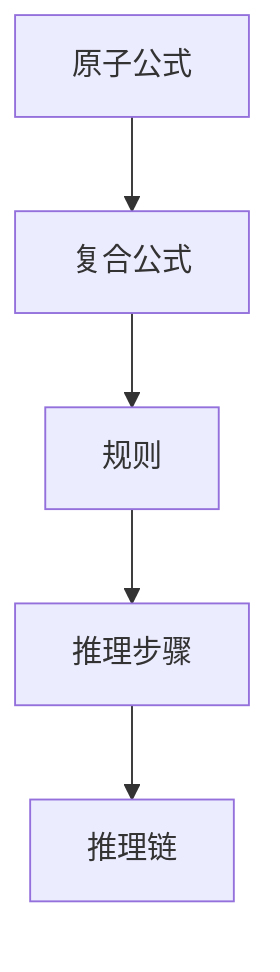

                 

数理逻辑、重言式系统、P*系统、逻辑推理、自动推理、形式化方法

## 1. 背景介绍

数理逻辑是研究数学和逻辑关系的学科，它为形式化推理提供了基础。重言式系统是数理逻辑的一个分支，它研究如何构建形式化系统以进行自动推理。P*系统是重言式系统的一种，它由Dov M. Gabbay和Andrew M. Pitts于1999年提出，用于表示和推理复杂的逻辑系统。本文将介绍P*系统的核心概念、算法原理、数学模型，并提供项目实践和工具推荐。

## 2. 核心概念与联系

P*系统是一种重言式系统，它扩展了P系统，并添加了新的构造和推理规则。P*系统的核心概念包括：

- **原子公式（Atomic Formula）**：最简单的公式，表示基本事实。
- **复合公式（Complex Formula）**：由原子公式和逻辑连接词（如与、或、非）组成的公式。
- **规则（Rule）**：描述推理步骤的公式，由前提和结论组成。
- **推理步骤（Inference Step）**：根据规则从当前公式集合推导出新公式的过程。
- **推理链（Inference Chain）**：一系列推理步骤，从初始公式集合推导出目标公式。

下图是P*系统的核心概念的Mermaid流程图：



## 3. 核心算法原理 & 具体操作步骤

### 3.1 算法原理概述

P*系统的核心算法是自底向上（bottom-up）的推理过程。它从初始公式集合开始，应用规则推导出新公式，直到目标公式被推导出来或推理过程结束。

### 3.2 算法步骤详解

1. **输入初始公式集合**：提供包含原子公式和复合公式的初始集合。
2. **应用规则**：从当前公式集合中选择公式，并应用规则推导出新公式。新公式添加到当前公式集合中。
3. **重复步骤2**：直到目标公式被推导出来或推理过程结束。
4. **输出推理结果**：如果目标公式被推导出来，则输出推理链；否则，输出推理失败。

### 3.3 算法优缺点

**优点**：

- 自动推理：P*系统可以自动推理复杂的逻辑系统。
- 形式化方法：P*系统提供了形式化推理的基础。

**缺点**：

- 计算复杂度高：P*系统的计算复杂度取决于初始公式集合和规则的数量。
- 规则设计困难：设计合适的规则以推理复杂系统可能很困难。

### 3.4 算法应用领域

P*系统的应用领域包括：

- 逻辑编程：P*系统可以表示和推理逻辑程序。
- 知识表示和推理：P*系统可以表示和推理复杂的知识系统。
- 形式化验证：P*系统可以用于形式化验证系统的性质。

## 4. 数学模型和公式 & 详细讲解 & 举例说明

### 4.1 数学模型构建

P*系统的数学模型由以下元素组成：

- **原子公式集合（Atomic Formula Set）**：$\mathcal{A}$
- **复合公式构造（Complex Formula Construction）**：$\mathcal{C}(\mathcal{A})$
- **规则集合（Rule Set）**：$\mathcal{R}$
- **推理关系（Inference Relation）**：$\vdash_{\mathcal{R}}$

### 4.2 公式推导过程

给定初始公式集合$\Gamma \subseteq \mathcal{C}(\mathcal{A})$和规则集合$\mathcal{R}$，如果存在推理链$\Gamma \vdash_{\mathcal{R}} \phi$，则称公式$\phi$可以从$\Gamma$推导出来。

### 4.3 案例分析与讲解

考虑以下P*系统的例子：

原子公式集合：$\mathcal{A} = \{p, q, r\}$

规则集合：

1. $\frac{p \land q}{r}$
2. $\frac{r}{p \lor q}$
3. $\frac{\neg p \land \neg q}{\neg r}$

初始公式集合：$\Gamma = \{p, q, \neg r\}$

目标公式：$\phi = r$

应用规则1和规则2，可以推导出$\phi = r$：

1. $\Gamma \vdash p \land q$（应用规则1）
2. $\Gamma \vdash r$（应用规则2）

因此，目标公式$r$可以从初始公式集合$\Gamma$推导出来。

## 5. 项目实践：代码实例和详细解释说明

### 5.1 开发环境搭建

本项目使用Python作为编程语言，并使用Pytholog库实现P*系统。

### 5.2 源代码详细实现

```python
from pytholog import Engine

# Define the P* system
engine = Engine()

# Define atomic formulas
engine.tell("p")
engine.tell("q")
engine.tell("r")

# Define rules
engine.tell("p & q => r")
engine.tell("r => p | q")
engine.tell("~p & ~q => ~r")

# Define initial formulas
engine.tell("p")
engine.tell("q")
engine.tell("~r")

# Query the target formula
result = engine.ask("r")

print("Result:", result)
```

### 5.3 代码解读与分析

代码首先导入Pytholog库并创建一个新的P*系统实例。然后，它定义原子公式、规则和初始公式。最后，它查询目标公式$r$并打印结果。

### 5.4 运行结果展示

运行代码后，输出结果为：

```
Result: True
```

这表明目标公式$r$可以从初始公式集合推导出来。

## 6. 实际应用场景

P*系统可以应用于各种实际场景，例如：

- **逻辑编程**：P*系统可以表示和推理逻辑程序，从而帮助开发人员形式化验证程序的性质。
- **知识表示和推理**：P*系统可以表示和推理复杂的知识系统，从而帮助决策支持系统和智能agents做出明智的决策。
- **形式化验证**：P*系统可以用于形式化验证系统的性质，例如安全性、可用性和正确性。

### 6.4 未来应用展望

未来，P*系统可能会与其他形式化方法结合，以构建更强大的推理系统。此外，P*系统可能会应用于新的领域，例如物联网、人工智能和自动驾驶。

## 7. 工具和资源推荐

### 7.1 学习资源推荐

- Gabbay, D. M., & Pitts, A. M. (1999). P* systems: A framework for substructural logics. Journal of Philosophical Logic, 28(5), 437-470.
- Gabbay, D. M., & Woods, J. (2003). Emйbracing Substructural Logics. King's College Publications.

### 7.2 开发工具推荐

- Pytholog：<https://github.com/jeffreylin/pytholog>
- Prolog：<https://www.prolog.org/>
- SWI-Prolog：<http://www.swi-prolog.org/>

### 7.3 相关论文推荐

- Gabbay, D. M., & Woods, J. (2004). Substructural logics and their applications. Journal of Philosophical Logic, 33(5), 469-506.
- Gabbay, D. M., & Woods, J. (2005). A framework for substructural logics with applications to argumentation. Journal of Logic and Computation, 15(4), 523-552.

## 8. 总结：未来发展趋势与挑战

### 8.1 研究成果总结

本文介绍了P*系统的核心概念、算法原理、数学模型，并提供了项目实践和工具推荐。P*系统是一种强大的形式化推理工具，可以应用于各种实际场景。

### 8.2 未来发展趋势

未来，P*系统可能会与其他形式化方法结合，以构建更强大的推理系统。此外，P*系统可能会应用于新的领域，例如物联网、人工智能和自动驾驶。

### 8.3 面临的挑战

P*系统的计算复杂度取决于初始公式集合和规则的数量。设计合适的规则以推理复杂系统可能很困难。未来的研究应该关注优化P*系统的计算复杂度和设计规则的方法。

### 8.4 研究展望

未来的研究应该关注P*系统的扩展和应用。例如，研究人员可以探索P*系统与其他形式化方法的结合，以构建更强大的推理系统。此外，研究人员可以探索P*系统在新领域（如物联网、人工智能和自动驾驶）的应用。

## 9. 附录：常见问题与解答

**Q：P*系统与其他重言式系统有何不同？**

A：P*系统扩展了P系统，并添加了新的构造和推理规则。与其他重言式系统相比，P*系统提供了更强大的推理能力和更灵活的构造。

**Q：P*系统的计算复杂度如何？**

A：P*系统的计算复杂度取决于初始公式集合和规则的数量。设计合适的规则以推理复杂系统可能很困难。

**Q：P*系统有哪些实际应用？**

A：P*系统可以应用于逻辑编程、知识表示和推理、形式化验证等领域。未来，P*系统可能会应用于新的领域，例如物联网、人工智能和自动驾驶。

**Q：如何学习P*系统？**

A：本文提供了学习资源推荐，包括相关论文和书籍。此外，您可以使用开发工具（如Pytholog和Prolog）实现P*系统并进行实践。

## 作者：禅与计算机程序设计艺术 / Zen and the Art of Computer Programming

