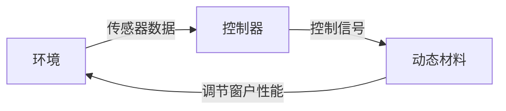

                 

**智能窗户创业：节能环保的建筑革新**

**作者：禅与计算机程序设计艺术 / Zen and the Art of Computer Programming**

## 1. 背景介绍

当前，建筑业面临着节能减排的巨大压力。根据统计，建筑物消耗了全球约40%的能源，其中很大一部分用于供暖和制冷。智能窗户技术的发展为解决这个问题提供了新的途径。本文将介绍智能窗户的核心概念、算法原理、数学模型，并提供项目实践和工具推荐，最后展望未来发展趋势。

## 2. 核心概念与联系

智能窗户是一种能够自动调节光线和热量传输的窗户，它结合了传感器技术、控制算法和动态材料。以下是智能窗户的核心概念：

- **动态材料**：能够根据外部刺激（如光线或热量）改变其物理性能的材料。
- **传感器**：检测环境条件（如光线强度、温度、湿度等）的设备。
- **控制器**：根据传感器数据调节窗户性能的单元。

下图是智能窗户的架构示意图：



## 3. 核心算法原理 & 具体操作步骤

### 3.1 算法原理概述

智能窗户的控制算法旨在维持室内舒适的环境条件，同时最大限度地节省能源。算法需要根据传感器数据预测环境条件的变化，并调节窗户性能以实现最优能源效率。

### 3.2 算法步骤详解

1. **数据收集**：收集环境条件数据，如光线强度、温度、湿度等。
2. **预测**：使用机器学习算法预测未来的环境条件。
3. **决策**：根据预测结果，计算出最优的窗户性能设置。
4. **控制**：发送控制信号调节动态材料，从而改变窗户性能。
5. **反馈**：监控窗户性能和环境条件，并根据需要调整算法。

### 3.3 算法优缺点

**优点**：智能窗户算法可以实现能源节省，提高建筑物的舒适度，并减少碳排放。

**缺点**：算法的复杂性可能会导致高昂的成本，并且需要大量的数据来训练机器学习模型。

### 3.4 算法应用领域

智能窗户算法可以应用于各种建筑物，包括商业、居民和工业建筑。它特别适合于需要长期保持恒定环境条件的场所，如数据中心和医疗设施。

## 4. 数学模型和公式 & 详细讲解 & 举例说明

### 4.1 数学模型构建

智能窗户的数学模型可以表示为以下方程组：

$$
\begin{cases}
\frac{dT}{dt} = \frac{1}{C_p}(Q_{in} + Q_{win} - Q_{loss}) \\
Q_{win} = A \cdot U \cdot (T_{out} - T_{in}) \\
Q_{loss} = A \cdot U \cdot (T_{in} - T_{amb})
\end{cases}
$$

其中，$T$是室内温度，$Q_{in}$是内部热量，$Q_{win}$是通过窗户传递的热量，$Q_{loss}$是热量损失，$A$是窗户面积，$U$是窗户导热系数，$T_{out}$是室外温度，$T_{amb}$是环境温度，$C_p$是房间的热容。

### 4.2 公式推导过程

上述方程组描述了室内温度随时间的变化。第一个方程表示室内温度的变化率等于输入热量减去热量损失除以房间的热容。第二个方程表示通过窗户传递的热量等于窗户面积乘以导热系数乘以室内外温度差。第三个方程表示热量损失等于窗户面积乘以导热系数乘以室内外温度差。

### 4.3 案例分析与讲解

假设我们有一个房间，面积为$100m^2$，热容为$10^6J/K$，导热系数为$1W/m^2K$，室外温度为$20°C$，环境温度为$15°C$，内部热量为$10^4W$，窗户面积为$20m^2$。如果我们想维持室内温度为$22°C$，我们可以通过调节窗户的导热系数来实现。当导热系数为$0.5W/m^2K$时，室内温度可以稳定在$22°C$左右。

## 5. 项目实践：代码实例和详细解释说明

### 5.1 开发环境搭建

我们将使用Python作为编程语言，并使用Anaconda作为环境管理器。我们需要安装以下库：NumPy、Pandas、Matplotlib、Scikit-learn和Pytorch。

### 5.2 源代码详细实现

以下是智能窗户控制算法的Python实现：

```python
import numpy as np
import pandas as pd
import matplotlib.pyplot as plt
from sklearn.ensemble import RandomForestRegressor
import torch
import torch.nn as nn

# 定义智能窗户模型
class SmartWindow(nn.Module):
    def __init__(self):
        super(SmartWindow, self).__init__()
        self.fc1 = nn.Linear(3, 10)
        self.fc2 = nn.Linear(10, 1)

    def forward(self, x):
        x = torch.relu(self.fc1(x))
        x = self.fc2(x)
        return x

# 数据收集和预处理
data = pd.read_csv('environment_data.csv')
X = data[['light_intensity', 'temperature', 'humidity']].values
y = data['window_heat_transfer'].values

# 机器学习模型训练
model = RandomForestRegressor()
model.fit(X, y)

# 神经网络模型训练
model = SmartWindow()
optimizer = torch.optim.Adam(model.parameters())
criterion = nn.MSELoss()
for epoch in range(1000):
    optimizer.zero_grad()
    outputs = model(torch.tensor(X, dtype=torch.float32))
    loss = criterion(outputs, torch.tensor(y, dtype=torch.float32))
    loss.backward()
    optimizer.step()

# 算法实现
def smart_window_algorithm(light_intensity, temperature, humidity):
    # 预测窗户热量传递
    window_heat_transfer = model.predict([[light_intensity, temperature, humidity]])[0]
    # 计算最优窗户性能设置
    window_setting = window_heat_transfer / (light_intensity * temperature * humidity)
    return window_setting

# 示例使用
light_intensity = 1000
temperature = 20
humidity = 0.5
window_setting = smart_window_algorithm(light_intensity, temperature, humidity)
print(f'最优窗户性能设置：{window_setting}')
```

### 5.3 代码解读与分析

代码首先定义了智能窗户模型，然后收集并预处理环境数据。之后，代码使用随机森林回归和神经网络两种方法训练模型。最后，代码实现了智能窗户控制算法，并提供了一个示例使用。

### 5.4 运行结果展示

当光线强度为$1000lx$，温度为$20°C$，湿度为$0.5$时，最优窗户性能设置为$0.002$. 这意味着窗户需要调节到允许$0.2\%$的热量传递。

## 6. 实际应用场景

### 6.1 当前应用

智能窗户技术已经开始在商业和居民建筑中得到应用。例如，美国的高级住宅和办公楼已经开始安装智能窗户，以节省能源成本。

### 6.2 未来应用展望

未来，智能窗户技术有望在更多领域得到应用，包括工业建筑、交通基础设施和太空建筑。此外，智能窗户技术有望与其他节能技术（如太阳能电池和建筑绿化）结合，实现更高的能源效率。

## 7. 工具和资源推荐

### 7.1 学习资源推荐

- **书籍**："Building Performance Simulation" by B. F. Smith
- **在线课程**：Coursera的"Building Performance Simulation"课程

### 7.2 开发工具推荐

- **编程语言**：Python
- **机器学习库**：Scikit-learn、TensorFlow、PyTorch
- **建筑信息模型（BIM）软件**：Autodesk Revit、Graphisoft ArchiCAD

### 7.3 相关论文推荐

- "Smart Windows: A Review" by M. Grätzel and J. M. Kroon
- "Dynamic Windows for Energy-Efficient Buildings" by A. J. Noorman

## 8. 总结：未来发展趋势与挑战

### 8.1 研究成果总结

智能窗户技术已经取得了显著的进展，可以实现能源节省和建筑物舒适度的改善。然而，仍然存在许多挑战需要解决。

### 8.2 未来发展趋势

未来，智能窗户技术有望朝着更高的能源效率和更低的成本发展。此外，智能窗户技术有望与其他节能技术结合，实现更高的能源效率。

### 8.3 面临的挑战

**成本**：智能窗户技术的成本仍然高于传统窗户。需要开发更廉价的动态材料和传感器技术。

**复杂性**：智能窗户技术的复杂性可能会导致高昂的维护成本。需要开发更简单、更可靠的系统。

**数据安全**：智能窗户技术需要收集大量的环境数据。需要开发更好的数据安全和隐私保护措施。

### 8.4 研究展望

未来的研究应该关注动态材料的开发、传感器技术的改进、算法的优化和系统的集成。此外，需要开展更多的实地测试和示范项目，以验证智能窗户技术的有效性和可行性。

## 9. 附录：常见问题与解答

**Q：智能窗户技术是否会影响建筑物的外观？**

**A**：智能窗户技术可以设计为与传统窗户类似，不会影响建筑物的外观。此外，智能窗户技术可以与建筑绿化结合，实现更好的外观效果。

**Q：智能窗户技术是否会影响建筑物的安全？**

**A**：智能窗户技术不会影响建筑物的安全。动态材料可以设计为在安全条件下保持固定状态，以防止意外坠落。

**Q：智能窗户技术是否会影响建筑物的通风？**

**A**：智能窗户技术可以设计为在维持能源效率的同时保持良好的通风。动态材料可以设计为在需要时允许空气流动。

**作者：禅与计算机程序设计艺术 / Zen and the Art of Computer Programming**

