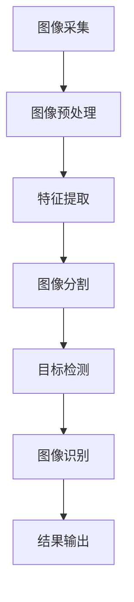

                 

## 1. 背景介绍

机器视觉（Computer Vision）是计算机科学领域的一个重要分支，它研究如何使计算机能够从数字图像或视频中提取有用的信息。机器视觉的目标是使计算机能够理解和解释视觉信息，就像人类一样。机器视觉技术在工业自动化、安防监控、医学成像、自动驾驶等领域有着广泛的应用。

## 2. 核心概念与联系

机器视觉的核心概念包括图像处理、特征提取、图像分割、目标检测、图像识别等。这些概念是机器视觉系统的基础，它们相互关联，共同构成了机器视觉的整体架构。下面是机器视觉核心概念的Mermaid流程图：



## 3. 核心算法原理 & 具体操作步骤

### 3.1 算法原理概述

机器视觉的核心算法包括边缘检测、形态学运算、特征提取、目标检测等。这些算法的原理各不相同，但它们都旨在从图像中提取有用的信息。

### 3.2 算法步骤详解

以边缘检测算法为例，其步骤如下：

1. 图像灰度化：将彩色图像转换为灰度图像。
2. 图像平滑：使用高斯滤波器等方法平滑图像，消除图像中的噪声。
3. 边缘检测：使用 Sobel 算子、Laplacian 算子等方法检测图像中的边缘。
4. 边缘连接：使用非最大值抑制等方法连接图像中的边缘。

### 3.3 算法优缺点

边缘检测算法的优点是简单易行，缺点是对图像质量要求高，易受噪声影响。

### 3.4 算法应用领域

边缘检测算法在图像分割、目标检测等领域有着广泛的应用。例如，在工业自动化领域，边缘检测算法可以用于检测产品的边缘，从而实现自动化生产。

## 4. 数学模型和公式 & 详细讲解 & 举例说明

### 4.1 数学模型构建

图像可以表示为二维函数，其值表示像素的强度。数学模型的构建需要对图像进行建模，常用的数学模型包括灰度级模型、空间模型等。

### 4.2 公式推导过程

以灰度级模型为例，其公式为：

$$g(x, y) = f(x, y) + n(x, y)$$

其中，$g(x, y)$表示图像的灰度级，$f(x, y)$表示图像的理想信号，$n(x, y)$表示图像的噪声。

### 4.3 案例分析与讲解

例如，在图像分割领域，常用的数学模型是图像的灰度级模型。图像的灰度级模型将图像表示为灰度级的函数，其公式为：

$$g(x, y) = f(x, y) + n(x, y)$$

其中，$g(x, y)$表示图像的灰度级，$f(x, y)$表示图像的理想信号，$n(x, y)$表示图像的噪声。图像分割的目标是将图像分成不同的区域，每个区域具有相似的灰度级。

## 5. 项目实践：代码实例和详细解释说明

### 5.1 开发环境搭建

机器视觉项目的开发环境包括计算机、图像采集设备、图像处理软件等。常用的图像处理软件包括OpenCV、Matlab等。

### 5.2 源代码详细实现

以OpenCV为例，边缘检测算法的实现代码如下：

```cpp
#include <opencv2/opencv.hpp>

using namespace cv;

int main(int argc, char** argv)
{
    // 读取图像
    Mat src = imread("image.jpg", 1);

    // 图像灰度化
    Mat gray;
    cvtColor(src, gray, COLOR_BGR2GRAY);

    // 图像平滑
    Mat blur;
    GaussianBlur(gray, blur, Size(5, 5), 1.5, 1.5);

    // 边缘检测
    Mat edges;
    Canny(blur, edges, 0, 30, 3);

    // 边缘连接
    Mat dst;
    dilate(edges, dst, Mat(), Point(-1, -1), 2, 1);

    // 显示结果
    imshow("edges", dst);
    waitKey(0);

    return 0;
}
```

### 5.3 代码解读与分析

上述代码首先读取图像，然后进行图像灰度化、平滑、边缘检测、边缘连接等操作。其中，Canny()函数用于边缘检测，dilate()函数用于边缘连接。

### 5.4 运行结果展示

运行上述代码后，可以得到图像的边缘检测结果。

## 6. 实际应用场景

机器视觉技术在工业自动化、安防监控、医学成像、自动驾驶等领域有着广泛的应用。例如，在工业自动化领域，机器视觉技术可以用于检测产品的缺陷，从而实现自动化生产。

### 6.4 未来应用展望

随着计算机技术的发展，机器视觉技术也在不断发展。未来，机器视觉技术将会有更广泛的应用，例如在人工智能、虚拟现实等领域。

## 7. 工具和资源推荐

### 7.1 学习资源推荐

机器视觉的学习资源包括图书、在线课程、论文等。推荐的图书包括《机器视觉：原理与应用》《计算机视觉：算法与应用》等。推荐的在线课程包括Coursera、Udacity等平台上的机器视觉课程。

### 7.2 开发工具推荐

机器视觉的开发工具包括OpenCV、Matlab、Python等。其中，OpenCV是一款开源的计算机视觉库，支持C++、Python等语言。

### 7.3 相关论文推荐

机器视觉的相关论文包括《Edge Detection Techniques》《Image Segmentation Techniques》等。这些论文可以帮助读者更深入地理解机器视觉的原理和算法。

## 8. 总结：未来发展趋势与挑战

### 8.1 研究成果总结

机器视觉技术已经取得了丰硕的成果，在工业自动化、安防监控、医学成像、自动驾驶等领域有着广泛的应用。

### 8.2 未来发展趋势

未来，机器视觉技术将会有更广泛的应用，例如在人工智能、虚拟现实等领域。此外，机器视觉技术也将朝着更高的精度、更快的速度、更低的成本等方向发展。

### 8.3 面临的挑战

机器视觉技术面临的挑战包括图像质量差、计算复杂度高、算法泛化能力差等。这些挑战需要通过不断的研究和创新来解决。

### 8.4 研究展望

未来，机器视觉技术的研究将会集中在深度学习、图像分割、目标检测等领域。此外，机器视觉技术也将与其他技术相结合，例如与人工智能相结合，从而实现更广泛的应用。

## 9. 附录：常见问题与解答

### 9.1 什么是机器视觉？

机器视觉是计算机科学领域的一个重要分支，它研究如何使计算机能够从数字图像或视频中提取有用的信息。

### 9.2 机器视觉的应用领域有哪些？

机器视觉技术在工业自动化、安防监控、医学成像、自动驾驶等领域有着广泛的应用。

### 9.3 机器视觉的核心概念有哪些？

机器视觉的核心概念包括图像处理、特征提取、图像分割、目标检测、图像识别等。

### 9.4 机器视觉的核心算法有哪些？

机器视觉的核心算法包括边缘检测、形态学运算、特征提取、目标检测等。

### 9.5 机器视觉的未来发展趋势是什么？

未来，机器视觉技术将会有更广泛的应用，例如在人工智能、虚拟现实等领域。此外，机器视觉技术也将朝着更高的精度、更快的速度、更低的成本等方向发展。

## 作者：禅与计算机程序设计艺术 / Zen and the Art of Computer Programming

