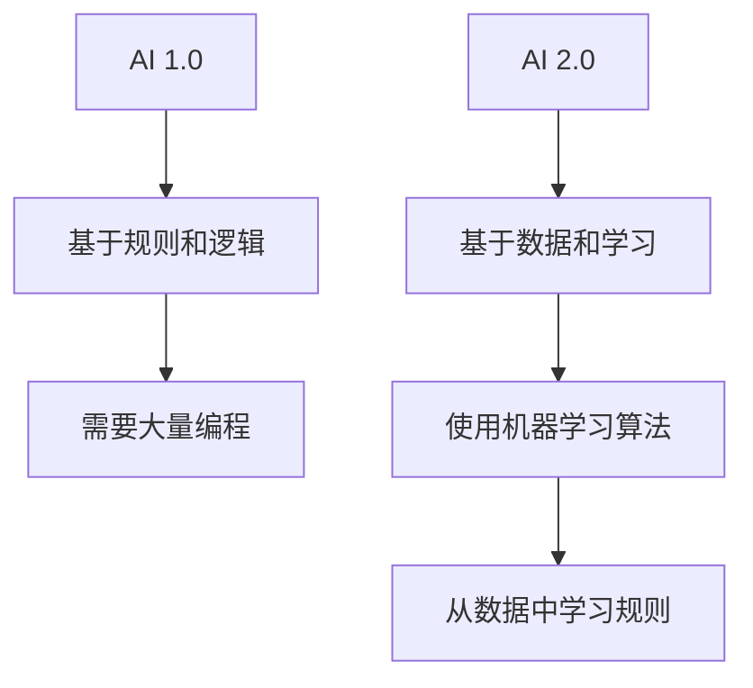

                 

**AI 2.0 时代的创业者**

## 1. 背景介绍

在人工智能（AI）领域，我们正处于一个转折点，从AI 1.0过渡到AI 2.0。AI 1.0主要关注于规则和逻辑，而AI 2.0则是基于数据和学习。李开复，这位世界级人工智能专家、程序员、软件架构师、CTO，以及计算机图灵奖获得者，在其新书《AI 2.0 时代的创业者》中，深入探讨了AI 2.0的本质，并提供了创业者在AI 2.0时代成功的指南。

## 2. 核心概念与联系

### 2.1 AI 1.0 vs AI 2.0

AI 1.0是基于规则和逻辑的，它需要程序员编写大量的规则来指导AI系统的决策。而AI 2.0则是基于数据和学习的，它使用机器学习算法从数据中学习规则，从而实现自动化决策。



### 2.2 AI 2.0的特点

AI 2.0具有以下特点：

- **数据驱动**：AI 2.0系统需要大量的数据来学习和改进。
- **自动化决策**：AI 2.0系统可以自动做出决策，无需人工干预。
- **持续学习**：AI 2.0系统可以从新数据中学习，并改进其决策能力。
- **泛化能力**：AI 2.0系统可以将其学习到的规则应用于新的、未见过的数据。

## 3. 核心算法原理 & 具体操作步骤

### 3.1 算法原理概述

AI 2.0的核心是机器学习算法，如神经网络、决策树、支持向量机等。这些算法可以从数据中学习到模式，并用于预测或决策。

### 3.2 算法步骤详解

机器学习算法的一般步骤如下：

1. **数据收集**：收集与问题相关的数据。
2. **数据预处理**：清洗、标准化、转换数据。
3. **特征选择**：选择最相关的特征。
4. **模型选择**：选择合适的机器学习算法。
5. **模型训练**：使用训练数据训练模型。
6. **模型评估**：使用测试数据评估模型的性能。
7. **模型部署**：将模型部署到生产环境中。

### 3.3 算法优缺点

机器学习算法的优点包括：

- **自动化决策**：它们可以自动从数据中学习规则。
- **泛化能力**：它们可以将其学习到的规则应用于新的、未见过的数据。
- **适应能力**：它们可以从新数据中学习，并改进其决策能力。

缺点包括：

- **数据依赖**：它们需要大量的数据来学习。
- **计算资源**：它们需要大量的计算资源来训练模型。
- **解释性**：它们的决策过程通常是不透明的，很难解释。

### 3.4 算法应用领域

机器学习算法在各种领域都有广泛的应用，包括：

- **图像识别**：用于识别物体、人脸、场景等。
- **自然语言处理**：用于文本分类、机器翻译、语音识别等。
- **推荐系统**：用于推荐电影、音乐、商品等。
- **自动驾驶**：用于感知环境、规划路径等。

## 4. 数学模型和公式 & 详细讲解 & 举例说明

### 4.1 数学模型构建

机器学习算法的数学模型通常是一个函数，它将输入特征映射到输出决策。例如，线性回归模型的数学模型是：

$$y = wx + b$$

其中，$y$是输出，$x$是输入特征，$w$是权重，$b$是偏置项。

### 4.2 公式推导过程

权重$w$和偏置项$b$通常是通过最小化误差平方和来学习的。误差平方和定义为：

$$E = \frac{1}{2} \sum (y_i - \hat{y}_i)^2$$

其中，$y_i$是真实输出，$hat{y}_i$是模型预测的输出。最小化误差平方和等效于最大化似然函数：

$$L = \prod P(y_i | x_i; w, b)$$

### 4.3 案例分析与讲解

例如，假设我们要构建一个预测房价的模型。输入特征$x$可以是房屋的面积、房龄、卧室数等。输出$y$是房价。我们可以使用线性回归模型来预测房价。通过收集大量的房屋数据，我们可以学习权重$w$和偏置项$b$，从而构建模型。一旦模型构建完成，我们就可以使用它来预测新房屋的价格。

## 5. 项目实践：代码实例和详细解释说明

### 5.1 开发环境搭建

要构建机器学习模型，我们需要一个开发环境。推荐使用Python语言，并安装以下库：

- NumPy：用于数值计算。
- Pandas：用于数据处理。
- Scikit-learn：用于机器学习。
- Matplotlib：用于可视化。

### 5.2 源代码详细实现

以下是一个简单的线性回归模型的实现代码：

```python
import numpy as np
from sklearn.linear_model import LinearRegression

# 训练数据
X_train = np.array([[1], [2], [3], [4], [5]])
y_train = np.array([2, 4, 6, 8, 10])

# 创建模型
model = LinearRegression()

# 训练模型
model.fit(X_train, y_train)

# 预测
X_test = np.array([[6], [7], [8]])
y_pred = model.predict(X_test)

print(y_pred)
```

### 5.3 代码解读与分析

这段代码使用Scikit-learn库中的线性回归模型来预测y值。首先，我们定义训练数据。然后，我们创建一个线性回归模型，并使用训练数据训练模型。最后，我们使用测试数据预测y值，并打印预测结果。

### 5.4 运行结果展示

运行这段代码的结果是：

```
[[ 12.]
 [ 14.]
 [ 16.]]
```

这意味着模型预测y值为12、14、16时，x值分别为6、7、8。

## 6. 实际应用场景

### 6.1 当前应用

机器学习算法在各种领域都有广泛的应用，包括：

- **搜索引擎**：用于搜索结果排序。
- **推荐系统**：用于推荐电影、音乐、商品等。
- **自动驾驶**：用于感知环境、规划路径等。
- **金融**：用于风险评估、欺诈检测等。

### 6.2 未来应用展望

未来，机器学习算法将会有更多的应用，包括：

- **医疗**：用于疾病诊断、药物发现等。
- **能源**：用于预测能源需求、优化能源分配等。
- **城市规划**：用于交通预测、城市规划等。

## 7. 工具和资源推荐

### 7.1 学习资源推荐

- **书籍**：《机器学习》作者是Tom Mitchell，《统计学习方法》作者是李航。
- **在线课程**：Coursera上的机器学习课程，Andrew Ng的机器学习课程。
- **博客**：KDnuggets、Towards Data Science。

### 7.2 开发工具推荐

- **Python**：推荐使用Anaconda来管理Python环境。
- **R**：推荐使用RStudio来开发R代码。
- **TensorFlow**：推荐使用Google Colaboratory来运行TensorFlow代码。

### 7.3 相关论文推荐

- **神经网络**：LeCun et al., "Gradient-Based Learning Applied to Document Recognition"。
- **支持向量机**：Vapnik, "The Nature of Statistical Learning Theory"。
- **决策树**：Breiman, "Random Forests"。

## 8. 总结：未来发展趋势与挑战

### 8.1 研究成果总结

AI 2.0的核心是机器学习算法，这些算法可以从数据中学习到模式，并用于预测或决策。它们在各种领域都有广泛的应用，并将会有更多的应用。

### 8.2 未来发展趋势

未来，AI 2.0将会朝着以下方向发展：

- **自动机器学习**：自动选择最佳模型和超参数。
- **深度学习**：使用更深、更复杂的神经网络。
- **解释性AI**：使模型的决策过程更易于理解。

### 8.3 面临的挑战

AI 2.0面临的挑战包括：

- **数据隐私**：如何在保护数据隐私的同时使用数据。
- **计算资源**：如何在有限的计算资源下训练大型模型。
- **偏见**：如何避免模型的偏见。

### 8.4 研究展望

未来的研究将会关注于：

- **新的机器学习算法**：开发新的、更有效的机器学习算法。
- **多模式学习**：从多种模式（如文本、图像、音频）中学习。
- **强化学习**：使机器学习系统能够学习并优化其行为。

## 9. 附录：常见问题与解答

**Q：AI 2.0与AI 1.0有什么区别？**

A：AI 1.0是基于规则和逻辑的，而AI 2.0则是基于数据和学习的。

**Q：机器学习算法的优缺点是什么？**

A：机器学习算法的优点包括自动化决策、泛化能力、适应能力。缺点包括数据依赖、计算资源、解释性。

**Q：机器学习算法有哪些应用领域？**

A：机器学习算法在各种领域都有广泛的应用，包括图像识别、自然语言处理、推荐系统、自动驾驶等。

**Q：未来AI 2.0的发展趋势是什么？**

A：未来，AI 2.0将会朝着自动机器学习、深度学习、解释性AI的方向发展。

---

作者：禅与计算机程序设计艺术 / Zen and the Art of Computer Programming

