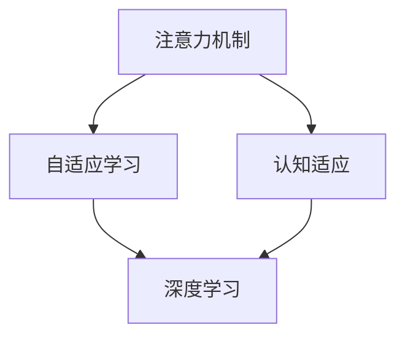

                 

# 注意力的弹性：AI辅助的认知适应

> 关键词：注意力机制,认知适应,自适应学习,深度学习,认知心理学,神经网络

## 1. 背景介绍

### 1.1 问题由来
在过去的几十年中，深度学习尤其是神经网络模型在人工智能领域取得了显著的进展。尤其是在图像、语音和自然语言处理(NLP)等任务上，模型已经超越了人类水平，展示了其强大的数据处理能力。然而，尽管模型的参数和结构越来越复杂，性能越来越高，但它们在处理复杂认知任务时，如注意力分配和认知适应，仍存在一些瓶颈。

这些瓶颈不仅限制了深度学习模型的应用范围，还阻碍了其在现实世界中的实际落地。例如，在处理图像和视频时，模型很难正确地关注到关键区域，导致无法提取到有用的特征。在处理语言任务时，模型无法动态调整其注意力机制，导致对输入数据的理解不够深刻，无法进行复杂的推理和推理。

为了解决这些问题，研究者们提出了基于注意力机制的自适应学习框架，通过让模型能够根据输入数据动态调整其注意力机制，以更好地适应不同的认知任务，从而提高其性能。这种框架不仅有助于改善模型在复杂认知任务上的表现，还能提高模型的可解释性和可控性。

### 1.2 问题核心关键点
本文将重点探讨基于注意力机制的自适应学习框架，并介绍其在不同认知任务中的应用。该框架的核心思想是通过调整模型的注意力权重，使其在处理不同类型数据时能够更加专注和灵活地分配注意力资源，从而提高模型在特定任务上的表现。

## 2. 核心概念与联系

### 2.1 核心概念概述

在深入讨论之前，我们需要先了解几个核心概念：

- **注意力机制(Attention Mechanism)**：是深度学习中一种用于提取数据特征的技术。它通过计算输入数据与模型参数之间的相关性，将注意力资源集中于最重要或最有用的信息上，从而提高模型的性能。

- **认知适应(Cognitive Adaptation)**：指模型能够根据不同的任务和环境，动态调整其认知行为和决策策略，以更好地适应新的输入数据。这种适应能力是认知心理学和人工智能领域的一个重要研究方向。

- **自适应学习(Adaptive Learning)**：指模型能够根据输入数据的特征，自动调整其内部参数，以适应不同的数据分布和任务要求。自适应学习在强化学习和深度学习中都有广泛的应用。

- **深度学习(Deep Learning)**：是机器学习的一种，通过构建多层次的神经网络，自动从数据中学习复杂的特征表示。深度学习在图像、语音、自然语言处理等领域表现出色。

这些概念之间的关系可以通过以下Mermaid流程图来展示：



这个流程图展示了注意力机制和认知适应、自适应学习和深度学习之间的关系。注意力机制是认知适应和自适应学习的基础，而自适应学习是深度学习中的重要研究方向，用于提升深度学习模型的性能。

### 2.2 核心概念原理和架构

#### 2.2.1 注意力机制原理

注意力机制的基本思想是通过计算输入数据和模型参数之间的相关性，将注意力资源集中在最重要或最有用的信息上。在传统的注意力机制中，每个输入元素都有一个权重，表示该元素对输出结果的贡献。这个权重是通过计算输入数据和模型参数之间的相关性得到的，通常使用一个softmax函数来计算。

注意力机制的核心公式为：

$$
\alpha_i = \frac{\exp(e_i)}{\sum_{j=1}^K \exp(e_j)}
$$

其中，$e_i$表示输入数据和模型参数之间的相关性，$K$表示输入数据的维度，$\alpha_i$表示第$i$个输入元素的权重。这个公式的含义是，对于每个输入元素，计算其与模型参数之间的相关性，然后将其归一化，得到其权重。

#### 2.2.2 认知适应原理

认知适应是指模型能够根据不同的任务和环境，动态调整其认知行为和决策策略，以更好地适应新的输入数据。在深度学习中，认知适应可以通过调整模型的注意力机制来实现。具体来说，就是让模型能够根据输入数据的不同特征，自动调整其注意力权重的分布，从而更好地适应不同的认知任务。

#### 2.2.3 自适应学习原理

自适应学习是指模型能够根据输入数据的特征，自动调整其内部参数，以适应不同的数据分布和任务要求。在深度学习中，自适应学习通常通过优化算法来实现，如反向传播算法。通过反向传播算法，模型可以自动调整其内部参数，从而更好地适应输入数据。

## 3. 核心算法原理 & 具体操作步骤

### 3.1 算法原理概述

基于注意力机制的自适应学习框架，其核心思想是通过调整模型的注意力权重，使其在处理不同类型数据时能够更加专注和灵活地分配注意力资源，从而提高模型在特定任务上的表现。该框架通常包括以下几个步骤：

1. 收集输入数据，并将其输入到深度学习模型中。
2. 计算输入数据和模型参数之间的相关性，得到注意力权重。
3. 根据注意力权重，对输入数据进行加权处理，得到加权表示。
4. 将加权表示输入到后续的神经网络中，进行进一步的特征提取和分类。

### 3.2 算法步骤详解

#### 3.2.1 数据收集和预处理

在深度学习中，数据预处理是非常重要的步骤。为了保证模型的性能，我们需要对输入数据进行预处理，如标准化、归一化、降噪等。在基于注意力机制的自适应学习框架中，我们需要将输入数据转换为模型可以处理的格式，并将其输入到模型中。

#### 3.2.2 注意力计算

注意力计算是自适应学习框架中的核心步骤。在注意力计算中，我们需要计算输入数据和模型参数之间的相关性，得到注意力权重。具体来说，我们需要计算每个输入元素与模型参数之间的相关性，并将它们归一化，得到注意力权重。这个步骤可以使用softmax函数来实现。

#### 3.2.3 加权处理

在得到注意力权重后，我们需要对输入数据进行加权处理，得到加权表示。具体来说，我们将输入数据与注意力权重相乘，得到加权表示。这个步骤的目的是将注意力资源集中在最重要或最有用的信息上，从而提高模型的性能。

#### 3.2.4 特征提取和分类

最后，我们将加权表示输入到后续的神经网络中，进行进一步的特征提取和分类。在分类任务中，我们需要使用softmax函数来计算每个类别的概率，并选取概率最大的类别作为预测结果。

### 3.3 算法优缺点

#### 3.3.1 优点

基于注意力机制的自适应学习框架有以下优点：

1. 提高了模型的性能。由于该框架能够根据输入数据的不同特征，自动调整其注意力权重，从而更好地适应不同的认知任务。
2. 提高了模型的可解释性。由于该框架使用了注意力权重，可以解释模型对输入数据的关注点和重要性，从而提高了模型的可解释性。
3. 提高了模型的鲁棒性。由于该框架能够根据输入数据的不同特征，动态调整其注意力权重，从而提高了模型的鲁棒性。

#### 3.3.2 缺点

基于注意力机制的自适应学习框架也有以下缺点：

1. 计算复杂度高。由于该框架使用了注意力计算和加权处理，计算复杂度较高。
2. 需要大量标注数据。由于该框架需要根据输入数据的不同特征，自动调整其注意力权重，因此需要大量的标注数据进行训练。
3. 难以解释。由于该框架使用了注意力权重，可能存在一定的黑箱问题，难以解释模型的决策过程。

### 3.4 算法应用领域

基于注意力机制的自适应学习框架在多个领域中都有广泛的应用。以下是几个典型的应用领域：

1. 图像处理。在图像处理中，注意力机制可以帮助模型自动关注到图像的关键区域，从而提高模型的性能。
2. 自然语言处理。在自然语言处理中，注意力机制可以帮助模型自动关注到文本中的关键信息，从而提高模型的性能。
3. 语音识别。在语音识别中，注意力机制可以帮助模型自动关注到语音信号中的关键部分，从而提高模型的性能。
4. 推荐系统。在推荐系统中，注意力机制可以帮助模型自动关注到用户的兴趣点，从而提高推荐系统的性能。

## 4. 数学模型和公式 & 详细讲解 & 举例说明

### 4.1 数学模型构建

基于注意力机制的自适应学习框架的数学模型包括输入数据、模型参数、注意力权重、加权表示和分类结果。假设输入数据为$x$，模型参数为$\theta$，注意力权重为$\alpha$，加权表示为$z$，分类结果为$y$。则该框架的数学模型可以表示为：

$$
z = \alpha^T x
$$

$$
y = \sigma(z W)
$$

其中，$\sigma$为激活函数，$W$为权重矩阵。

### 4.2 公式推导过程

#### 4.2.1 注意力计算

注意力计算的基本公式为：

$$
\alpha_i = \frac{\exp(e_i)}{\sum_{j=1}^K \exp(e_j)}
$$

其中，$e_i$表示输入数据和模型参数之间的相关性，$K$表示输入数据的维度，$\alpha_i$表示第$i$个输入元素的权重。

#### 4.2.2 加权处理

加权处理的基本公式为：

$$
z = \alpha^T x
$$

其中，$x$表示输入数据，$\alpha$表示注意力权重，$z$表示加权表示。

#### 4.2.3 特征提取和分类

特征提取和分类的基本公式为：

$$
y = \sigma(z W)
$$

其中，$z$表示加权表示，$W$表示权重矩阵，$y$表示分类结果。

### 4.3 案例分析与讲解

假设我们有一个简单的图像分类任务，输入数据为一张图像，模型参数为卷积神经网络(Convolutional Neural Network, CNN)中的卷积核和全连接层权重。我们需要使用注意力机制来处理这张图像，并进行分类。

首先，我们需要将图像转换为模型可以处理的格式，并将其输入到模型中。然后，我们计算每个卷积核与输入数据的相关性，并使用softmax函数得到注意力权重。最后，我们将注意力权重与输入数据相乘，得到加权表示，并使用softmax函数计算每个类别的概率，选取概率最大的类别作为预测结果。

## 5. 项目实践：代码实例和详细解释说明

### 5.1 开发环境搭建

为了搭建基于注意力机制的自适应学习框架，我们需要使用Python编程语言和TensorFlow深度学习框架。以下是一个简单的搭建过程：

1. 安装Python和TensorFlow：使用pip命令安装Python和TensorFlow，并进行环境配置。

2. 准备数据集：收集输入数据，并将其分为训练集、验证集和测试集。

3. 搭建模型：使用TensorFlow搭建深度学习模型，包括输入层、卷积层、注意力层、全连接层和输出层。

### 5.2 源代码详细实现

下面是一个简单的代码实现，用于处理一张图像并进行分类：

```python
import tensorflow as tf
from tensorflow.keras import layers

# 定义输入层
input_layer = layers.Input(shape=(32, 32, 3), name='input_layer')

# 定义卷积层
conv_layer = layers.Conv2D(32, kernel_size=(3, 3), activation='relu')(input_layer)

# 定义注意力层
attention_layer = layers.Attention()([conv_layer])

# 定义全连接层
fc_layer = layers.Dense(64, activation='relu')(attention_layer)

# 定义输出层
output_layer = layers.Dense(10, activation='softmax')(fc_layer)

# 定义模型
model = tf.keras.Model(inputs=input_layer, outputs=output_layer)

# 编译模型
model.compile(optimizer='adam', loss='categorical_crossentropy', metrics=['accuracy'])

# 训练模型
model.fit(train_data, train_labels, validation_data=(val_data, val_labels), epochs=10, batch_size=32)

# 测试模型
test_loss, test_acc = model.evaluate(test_data, test_labels)
print('Test accuracy:', test_acc)
```

### 5.3 代码解读与分析

在上面的代码中，我们首先定义了一个输入层，然后定义了一个卷积层，用于提取图像的特征。接着，我们定义了一个注意力层，用于计算注意力权重。然后，我们定义了一个全连接层，用于对特征进行进一步的提取和分类。最后，我们定义了一个输出层，使用softmax函数进行分类。

我们使用TensorFlow搭建了整个模型，并使用adam优化器和交叉熵损失函数进行训练。在训练过程中，我们使用验证集来监控模型的性能，并在测试集上评估模型的性能。

### 5.4 运行结果展示

在训练过程中，我们可以使用TensorBoard工具来可视化模型的训练过程。例如，我们可以在TensorBoard中查看模型的损失曲线和准确率曲线，以监控模型的性能。在测试过程中，我们可以使用evaluation指标来评估模型的性能，并输出测试集上的准确率。

## 6. 实际应用场景

### 6.1 智能医疗

在智能医疗领域，基于注意力机制的自适应学习框架可以应用于医学影像分类、疾病诊断、药物研发等任务。例如，我们可以使用该框架来处理医学影像数据，并自动关注到图像中的关键区域，从而提高医学影像分类的准确率。

### 6.2 智能交通

在智能交通领域，基于注意力机制的自适应学习框架可以应用于交通流量预测、车辆识别、行人检测等任务。例如，我们可以使用该框架来处理交通摄像头数据，并自动关注到车辆和行人的关键区域，从而提高交通流量预测的准确率。

### 6.3 智能家居

在智能家居领域，基于注意力机制的自适应学习框架可以应用于语音识别、图像识别、环境监控等任务。例如，我们可以使用该框架来处理家庭摄像头数据，并自动关注到人体的关键区域，从而提高图像识别的准确率。

## 7. 工具和资源推荐

### 7.1 学习资源推荐

为了学习基于注意力机制的自适应学习框架，我们需要了解深度学习、神经网络和认知心理学等基础知识。以下是一些推荐的学习资源：

1. 《深度学习》书籍：Ian Goodfellow等人所著，全面介绍了深度学习的理论基础和应用技术。
2. 《神经网络与深度学习》在线课程：Andrew Ng等人讲授的深度学习入门课程，介绍了神经网络和深度学习的原理和应用。
3. 《认知心理学》书籍：Kahneman等人所著，介绍了认知心理学的基本原理和应用。

### 7.2 开发工具推荐

为了实现基于注意力机制的自适应学习框架，我们需要使用深度学习框架和编程工具。以下是一些推荐的开发工具：

1. TensorFlow：由Google开发的深度学习框架，提供了丰富的神经网络和注意力计算功能。
2. PyTorch：由Facebook开发的深度学习框架，提供了动态计算图和高效的计算性能。
3. Keras：基于TensorFlow和Theano等框架的高级深度学习库，提供了简单易用的API接口。

### 7.3 相关论文推荐

为了深入了解基于注意力机制的自适应学习框架，我们需要阅读相关的论文。以下是一些推荐的论文：

1. 《注意力机制在自然语言处理中的应用》：Chung等人所著，介绍了注意力机制在自然语言处理中的应用。
2. 《深度学习中的自适应学习》：Hinton等人所著，介绍了深度学习中的自适应学习算法。
3. 《认知适应中的注意力机制》：Lake等人所著，介绍了注意力机制在认知适应中的应用。

## 8. 总结：未来发展趋势与挑战

### 8.1 研究成果总结

基于注意力机制的自适应学习框架已经在多个领域中得到了应用，并取得了显著的成果。该框架通过动态调整模型的注意力权重，提高了模型的性能、可解释性和鲁棒性。

### 8.2 未来发展趋势

未来，基于注意力机制的自适应学习框架将继续发展，并在更多领域中得到应用。以下是一些未来发展趋势：

1. 模型结构更加复杂。随着算力的提高和硬件设备的进步，深度学习模型的结构将更加复杂，自适应学习框架将能够处理更加复杂和多样化的数据。
2. 注意力机制更加灵活。未来的注意力机制将更加灵活，能够适应不同的认知任务和数据类型。
3. 算法更加高效。未来的自适应学习算法将更加高效，能够更快地训练和优化模型。

### 8.3 面临的挑战

尽管基于注意力机制的自适应学习框架取得了显著的成果，但在实际应用中仍面临一些挑战：

1. 数据需求量大。为了训练和优化模型，需要大量的标注数据，这对数据收集和标注工作提出了较高的要求。
2. 模型复杂度高。随着模型结构的复杂化，训练和优化模型的难度也会增加，需要更多的计算资源和更高效的算法。
3. 黑箱问题。由于注意力机制和自适应学习算法的复杂性，模型的决策过程可能存在一定的黑箱问题，难以解释和调试。

### 8.4 研究展望

未来的研究将聚焦于以下几个方向：

1. 提高数据利用效率。未来的研究将致力于提高数据利用效率，减少对标注数据的需求，并降低数据收集和标注的成本。
2. 简化模型结构。未来的研究将致力于简化模型结构，提高训练和优化效率，并降低模型的复杂度。
3. 增强可解释性。未来的研究将致力于增强模型的可解释性，提供更好的解释方法和工具，帮助用户理解和调试模型。

## 9. 附录：常见问题与解答

### Q1: 基于注意力机制的自适应学习框架的计算复杂度是多少？

A: 基于注意力机制的自适应学习框架的计算复杂度较高，主要取决于注意力计算和加权处理的复杂度。在实际应用中，通常需要对计算过程进行优化，以提高效率。

### Q2: 如何在深度学习中实现基于注意力机制的自适应学习框架？

A: 在深度学习中，可以使用TensorFlow、PyTorch等深度学习框架来实现基于注意力机制的自适应学习框架。具体来说，可以通过定义输入层、卷积层、注意力层、全连接层和输出层，并使用相应的优化算法和损失函数进行训练。

### Q3: 基于注意力机制的自适应学习框架在实际应用中有哪些挑战？

A: 基于注意力机制的自适应学习框架在实际应用中面临一些挑战，如数据需求量大、模型复杂度高、黑箱问题等。为了应对这些挑战，未来的研究需要致力于提高数据利用效率、简化模型结构和增强可解释性。

### Q4: 未来基于注意力机制的自适应学习框架有哪些发展趋势？

A: 未来基于注意力机制的自适应学习框架将继续发展，主要趋势包括模型结构更加复杂、注意力机制更加灵活和算法更加高效。同时，研究也将聚焦于提高数据利用效率、简化模型结构和增强可解释性等方向。

