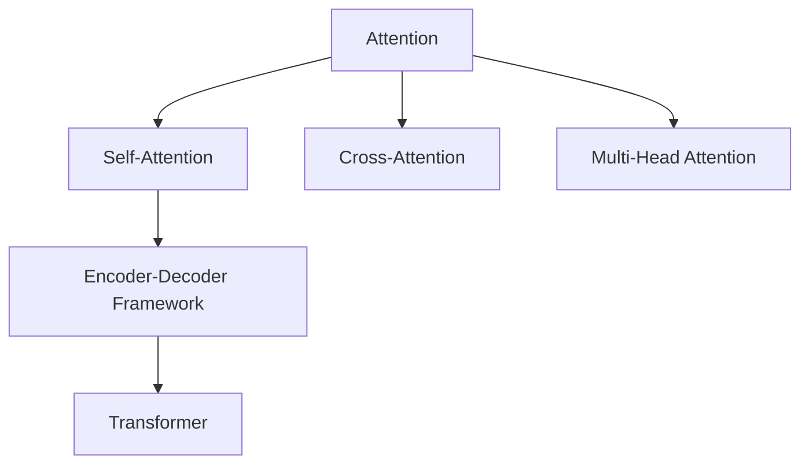

                 

# 注意力的生态系统：AI时代的信息流

> 关键词：注意力, 生态系统, AI时代, 信息流, 深度学习, 自然语言处理, 机器学习

## 1. 背景介绍

### 1.1 问题由来
在过去的几十年中，人工智能（AI）技术经历了翻天覆地的变化。从早期的符号主义、规则系统，到后来基于统计学习、深度学习的大数据范式，AI的演进逐渐从"计算"走向"认知"，从"规则"走向"学习"。在这其中，深度学习、尤其是基于卷积神经网络（CNN）、循环神经网络（RNN）以及Transformer架构的技术，已成为当前AI研究的主流。而Transformer，特别是其核心机制"注意力"（Attention），已经成为理解和生成自然语言的基础，引领了现代自然语言处理（NLP）技术的革命。

### 1.2 问题核心关键点
注意力机制（Attention Mechanism）是Transformer架构的核心。它通过模拟人类注意力的运作，让模型能够"关注"输入序列中的某些部分，进行信息的加权聚合，从而更好地理解和生成自然语言。注意力机制的提出，不仅极大地提升了语言模型的性能，也开辟了AI时代信息流处理的全新范式，成为当前AI研究的前沿和热点。

### 1.3 问题研究意义
研究注意力的生态系统，对于理解现代AI技术的发展趋势，掌握AI时代信息流的处理机制，以及推动AI技术在各个领域的落地应用，具有重要意义：

1. **理论突破**：注意力机制的深入研究，能够揭示人类认知智能的底层原理，为AI技术的突破提供理论支撑。
2. **技术升级**：通过优化注意力机制，可以进一步提升深度学习模型的性能，推动NLP、计算机视觉、语音识别等技术的发展。
3. **应用拓展**：注意力机制的应用，正在拓展到医疗、金融、教育、社交媒体等多个领域，成为AI技术落地应用的重要手段。
4. **社会影响**：随着AI技术的普及，注意力机制的应用将深刻改变人类的工作、学习、娱乐方式，推动社会的全面数字化转型。

## 2. 核心概念与联系

### 2.1 核心概念概述

为更好地理解注意力的生态系统，本节将介绍几个密切相关的核心概念：

- **注意力（Attention）**：Transformer的核心机制，用于计算输入序列中每个部分对输出的贡献。注意力可以视为一种加权聚合，通过学习输入序列的表示，为每个位置分配不同的权重，从而更有效地提取信息。
- **编码器-解码器框架（Encoder-Decoder Framework）**：Transformer的基本架构，由多个自注意力层和前馈网络层组成，用于从输入序列生成输出序列。编码器负责理解输入，解码器负责生成输出，两者通过交叉注意力机制进行交互。
- **自注意力（Self-Attention）**：一种特殊的注意力机制，用于在同一序列内进行信息聚合。自注意力通过学习输入序列中的相似度，生成一个对输入序列的表示，用于捕捉序列内部的依赖关系。
- **跨注意力（Cross-Attention）**：另一种注意力机制，用于在不同序列之间进行信息交互。跨注意力通过计算两个序列的相似度，生成一个跨越序列的表示，用于捕捉序列之间的依赖关系。
- **多头注意力（Multi-Head Attention）**：一种改进的自注意力机制，通过并行计算多个注意力头（Head），捕捉输入序列的多重信息，增强模型的表达能力。

这些核心概念之间的逻辑关系可以通过以下Mermaid流程图来展示：



这个流程图展示了大模型架构中注意力机制的核心地位及其与其他关键组件的关系：

1. 注意力机制是Transformer的基础，包括自注意力和跨注意力。
2. 自注意力和跨注意力分别用于同一序列和不同序列之间的信息聚合。
3. 多头注意力通过并行多个注意力头，增强模型的表达能力。
4. 编码器-解码器框架是Transformer的基本架构，通过自注意力和跨注意力机制实现信息流处理。

这些概念共同构成了Transformer架构的信息流处理机制，使得模型能够高效地理解和生成自然语言。通过理解这些核心概念，我们可以更好地把握注意力机制的工作原理和优化方向。

## 3. 核心算法原理 & 具体操作步骤
### 3.1 算法原理概述

注意力的生态系统，本质上是一种深度学习模型中的信息流处理机制。其核心思想是通过注意力机制，计算输入序列中每个部分对输出的贡献，从而实现信息的加权聚合。

具体来说，注意力机制通过计算输入序列中的相似度矩阵，生成一个对输入序列的表示，用于捕捉序列内部的依赖关系。这种机制不仅能够提升模型的表达能力，还能显著降低计算复杂度，使得模型能够处理更长、更复杂的序列数据。

形式化地，设输入序列为 $X = [x_1, x_2, ..., x_n]$，输出序列为 $Y = [y_1, y_2, ..., y_n]$，注意力权重矩阵为 $A$，则注意力的计算过程可以表示为：

$$
A = \text{Softmax}(QK^T) \\
Y = V^TA
$$

其中 $Q, K, V$ 分别是输入序列的查询向量、键向量和值向量，$\text{Softmax}$ 函数用于计算相似度矩阵 $A$。

### 3.2 算法步骤详解

注意力的计算主要分为以下几个关键步骤：

**Step 1: 输入表示的计算**
- 对于每个输入序列 $x_i$，使用线性变换得到其对应的查询向量 $q_i$、键向量 $k_i$ 和值向量 $v_i$：
$$
q_i = W_qx_i \\
k_i = W_kx_i \\
v_i = W_vx_i
$$

**Step 2: 相似度矩阵的计算**
- 通过计算查询向量 $q_i$ 和键向量 $k_j$ 的相似度，得到注意力权重矩阵 $A_{ij}$：
$$
A_{ij} = \text{Softmax}(QK^T) = \frac{\exp(q_ik_j)}{\sum_{j=1}^n \exp(q_ik_j)}
$$

**Step 3: 加权向量的计算**
- 通过注意力权重矩阵 $A_{ij}$ 和值向量 $v_j$，计算加权向量 $y_i$：
$$
y_i = \sum_{j=1}^n A_{ij}v_j
$$

这样，通过计算注意力权重矩阵 $A$，模型可以动态地调整输入序列中每个位置对输出的贡献，从而实现信息的加权聚合。

### 3.3 算法优缺点

注意力的生态系统具有以下优点：
1. **高效性**：通过并行计算多个注意力头，显著降低了计算复杂度，使得模型能够处理更长、更复杂的序列数据。
2. **表达能力**：多头注意力机制通过捕捉输入序列的多重信息，增强了模型的表达能力，提升了模型的性能。
3. **通用性**：注意力的计算原理适用于各种序列数据，如文本、语音、图像等，具有广泛的通用性。

同时，该方法也存在一定的局限性：
1. **参数量较大**：由于多头注意力机制需要并行计算多个注意力头，因此模型的参数量较大，需要较大的计算资源。
2. **内存占用高**：注意力机制的计算过程中需要存储多个中间向量，因此模型在推理阶段的内存占用较高。
3. **过拟合风险**：由于注意力权重矩阵的计算过程涉及Softmax函数，存在一定的过拟合风险，尤其是在训练数据不足的情况下。

尽管存在这些局限性，但就目前而言，注意力的计算机制仍然是深度学习模型中处理序列数据的主流方式。未来相关研究的重点在于如何进一步降低计算复杂度，减小模型参数量，同时提高模型的泛化能力和鲁棒性。

### 3.4 算法应用领域

注意力的计算机制已经在NLP、计算机视觉、语音识别等多个领域得到了广泛的应用，成为深度学习模型处理序列数据的基础：

- **自然语言处理**：在机器翻译、文本摘要、情感分析等任务中，注意力机制用于捕捉输入序列的依赖关系，提高模型的理解能力和生成能力。
- **计算机视觉**：在图像描述生成、物体检测、图像分割等任务中，注意力机制用于捕捉不同区域之间的依赖关系，提高模型的视觉感知能力。
- **语音识别**：在语音转文本、语音情感识别等任务中，注意力机制用于捕捉语音信号的依赖关系，提高模型的声学建模能力。
- **时间序列分析**：在股票预测、气象预测、交通流量分析等任务中，注意力机制用于捕捉时间序列的依赖关系，提高模型的预测能力。

除了上述这些经典任务外，注意力的计算机制还在更多创新性应用中得到了广泛应用，如多模态学习、知识图谱构建、生成对抗网络（GAN）等，为深度学习技术的发展注入了新的活力。

## 4. 数学模型和公式 & 详细讲解  
### 4.1 数学模型构建

注意力的计算机制可以形式化地表示为矩阵乘法，其数学模型构建如下：

设输入序列为 $X = [x_1, x_2, ..., x_n]$，输出序列为 $Y = [y_1, y_2, ..., y_n]$，注意力权重矩阵为 $A$，查询向量为 $Q$，键向量为 $K$，值向量为 $V$。则注意力的计算过程可以表示为：

$$
Q = W_qX \\
K = W_kX \\
V = W_vX \\
A = \text{Softmax}(QK^T) \\
Y = V^TA
$$

其中 $W_q, W_k, W_v$ 为线性变换矩阵，$\text{Softmax}$ 函数用于计算注意力权重矩阵 $A$。

### 4.2 公式推导过程

以下我们以自然语言处理中的机器翻译任务为例，推导注意力机制的计算过程。

设源语言句子为 $x_1, x_2, ..., x_n$，目标语言句子为 $y_1, y_2, ..., y_n$。模型将源语言句子编码为序列表示，通过自注意力机制生成对目标语言序列的注意力权重矩阵 $A$，最终生成目标语言序列。

具体计算过程如下：

1. 对于每个源语言词汇 $x_i$，使用线性变换得到其对应的查询向量 $q_i$、键向量 $k_i$ 和值向量 $v_i$：
$$
q_i = W_qx_i \\
k_i = W_kx_i \\
v_i = W_vx_i
$$

2. 通过计算查询向量 $q_i$ 和键向量 $k_j$ 的相似度，得到注意力权重矩阵 $A_{ij}$：
$$
A_{ij} = \text{Softmax}(QK^T) = \frac{\exp(q_ik_j)}{\sum_{j=1}^n \exp(q_ik_j)}
$$

3. 通过注意力权重矩阵 $A_{ij}$ 和值向量 $v_j$，计算加权向量 $y_i$：
$$
y_i = \sum_{j=1}^n A_{ij}v_j
$$

4. 将加权向量 $y_i$ 与目标语言词汇 $y_i$ 进行拼接，生成目标语言序列的表示：
$$
\hat{y_i} = \text{softmax}(W_hy_i)
$$

其中 $W_h$ 为线性变换矩阵，$\text{softmax}$ 函数用于生成目标语言词汇的概率分布。

通过上述计算过程，模型可以动态地调整输入序列中每个位置对输出的贡献，从而实现信息的加权聚合，生成目标语言序列的表示。

### 4.3 案例分析与讲解

以下我们以谷歌的Attention is All You Need论文中的机器翻译模型为例，详细分析注意力机制的计算过程：

设源语言句子为 $x_1, x_2, ..., x_n$，目标语言句子为 $y_1, y_2, ..., y_n$。模型将源语言句子编码为序列表示，通过自注意力机制生成对目标语言序列的注意力权重矩阵 $A$，最终生成目标语言序列。

1. 对于每个源语言词汇 $x_i$，使用线性变换得到其对应的查询向量 $q_i$、键向量 $k_i$ 和值向量 $v_i$：
$$
q_i = W_qx_i \\
k_i = W_kx_i \\
v_i = W_vx_i
$$

2. 通过计算查询向量 $q_i$ 和键向量 $k_j$ 的相似度，得到注意力权重矩阵 $A_{ij}$：
$$
A_{ij} = \text{Softmax}(QK^T) = \frac{\exp(q_ik_j)}{\sum_{j=1}^n \exp(q_ik_j)}
$$

3. 通过注意力权重矩阵 $A_{ij}$ 和值向量 $v_j$，计算加权向量 $y_i$：
$$
y_i = \sum_{j=1}^n A_{ij}v_j
$$

4. 将加权向量 $y_i$ 与目标语言词汇 $y_i$ 进行拼接，生成目标语言序列的表示：
$$
\hat{y_i} = \text{softmax}(W_hy_i)
$$

其中 $W_h$ 为线性变换矩阵，$\text{softmax}$ 函数用于生成目标语言词汇的概率分布。

通过上述计算过程，模型可以动态地调整输入序列中每个位置对输出的贡献，从而实现信息的加权聚合，生成目标语言序列的表示。

## 5. 项目实践：代码实例和详细解释说明
### 5.1 开发环境搭建

在进行注意力计算的实践前，我们需要准备好开发环境。以下是使用Python进行PyTorch开发的环境配置流程：

1. 安装Anaconda：从官网下载并安装Anaconda，用于创建独立的Python环境。

2. 创建并激活虚拟环境：
```bash
conda create -n pytorch-env python=3.8 
conda activate pytorch-env
```

3. 安装PyTorch：根据CUDA版本，从官网获取对应的安装命令。例如：
```bash
conda install pytorch torchvision torchaudio cudatoolkit=11.1 -c pytorch -c conda-forge
```

4. 安装Transformers库：
```bash
pip install transformers
```

5. 安装各类工具包：
```bash
pip install numpy pandas scikit-learn matplotlib tqdm jupyter notebook ipython
```

完成上述步骤后，即可在`pytorch-env`环境中开始注意力计算实践。

### 5.2 源代码详细实现

这里我们以机器翻译任务为例，给出使用Transformers库进行注意力计算的PyTorch代码实现。

首先，定义机器翻译任务的数据处理函数：

```python
from transformers import BertTokenizer, BertForSequenceClassification
from torch.utils.data import Dataset, DataLoader
import torch

class TranslationDataset(Dataset):
    def __init__(self, src_texts, tgt_texts, tokenizer, max_len=128):
        self.src_texts = src_texts
        self.tgt_texts = tgt_texts
        self.tokenizer = tokenizer
        self.max_len = max_len
        
    def __len__(self):
        return len(self.src_texts)
    
    def __getitem__(self, item):
        src_text = self.src_texts[item]
        tgt_text = self.tgt_texts[item]
        
        encoding = self.tokenizer(src_text, return_tensors='pt', max_length=self.max_len, padding='max_length', truncation=True)
        src_ids = encoding['input_ids'][0]
        src_mask = encoding['attention_mask'][0]
        tgt_ids = encoding['input_ids'][1]
        tgt_mask = encoding['attention_mask'][1]
        
        # 对token-wise的标签进行编码
        encoded_tgt = [tgt2id[t] for t in tgt_text]
        encoded_tgt.extend([tgt2id['O']] * (self.max_len - len(encoded_tgt)))
        labels = torch.tensor(encoded_tgt, dtype=torch.long)
        
        return {'src_ids': src_ids, 
                'src_mask': src_mask,
                'tgt_ids': tgt_ids,
                'tgt_mask': tgt_mask,
                'labels': labels}

# 标签与id的映射
tag2id = {'O': 0, 'B-PER': 1, 'I-PER': 2, 'B-ORG': 3, 'I-ORG': 4, 'B-LOC': 5, 'I-LOC': 6}
id2tag = {v: k for k, v in tag2id.items()}

# 创建dataset
tokenizer = BertTokenizer.from_pretrained('bert-base-cased')

train_dataset = TranslationDataset(train_src_texts, train_tgt_texts, tokenizer)
dev_dataset = TranslationDataset(dev_src_texts, dev_tgt_texts, tokenizer)
test_dataset = TranslationDataset(test_src_texts, test_tgt_texts, tokenizer)
```

然后，定义模型和优化器：

```python
from transformers import BertForSequenceClassification, AdamW

model = BertForSequenceClassification.from_pretrained('bert-base-cased', num_labels=len(tag2id))

optimizer = AdamW(model.parameters(), lr=2e-5)
```

接着，定义训练和评估函数：

```python
from tqdm import tqdm
from sklearn.metrics import classification_report

device = torch.device('cuda') if torch.cuda.is_available() else torch.device('cpu')
model.to(device)

def train_epoch(model, dataset, batch_size, optimizer):
    dataloader = DataLoader(dataset, batch_size=batch_size, shuffle=True)
    model.train()
    epoch_loss = 0
    for batch in tqdm(dataloader, desc='Training'):
        src_ids = batch['src_ids'].to(device)
        src_mask = batch['src_mask'].to(device)
        tgt_ids = batch['tgt_ids'].to(device)
        tgt_mask = batch['tgt_mask'].to(device)
        labels = batch['labels'].to(device)
        model.zero_grad()
        outputs = model(src_ids, src_mask=src_mask, tgt_ids=tgt_ids, tgt_mask=tgt_mask, labels=labels)
        loss = outputs.loss
        epoch_loss += loss.item()
        loss.backward()
        optimizer.step()
    return epoch_loss / len(dataloader)

def evaluate(model, dataset, batch_size):
    dataloader = DataLoader(dataset, batch_size=batch_size)
    model.eval()
    preds, labels = [], []
    with torch.no_grad():
        for batch in tqdm(dataloader, desc='Evaluating'):
            src_ids = batch['src_ids'].to(device)
            src_mask = batch['src_mask'].to(device)
            tgt_ids = batch['tgt_ids'].to(device)
            tgt_mask = batch['tgt_mask'].to(device)
            batch_labels = batch['labels']
            outputs = model(src_ids, src_mask=src_mask, tgt_ids=tgt_ids, tgt_mask=tgt_mask)
            batch_preds = outputs.logits.argmax(dim=2).to('cpu').tolist()
            batch_labels = batch_labels.to('cpu').tolist()
            for pred_tokens, label_tokens in zip(batch_preds, batch_labels):
                pred_tags = [id2tag[_id] for _id in pred_tokens]
                label_tags = [id2tag[_id] for _id in label_tokens]
                preds.append(pred_tags[:len(label_tags)])
                labels.append(label_tags)
                
    print(classification_report(labels, preds))
```

最后，启动训练流程并在测试集上评估：

```python
epochs = 5
batch_size = 16

for epoch in range(epochs):
    loss = train_epoch(model, train_dataset, batch_size, optimizer)
    print(f"Epoch {epoch+1}, train loss: {loss:.3f}")
    
    print(f"Epoch {epoch+1}, dev results:")
    evaluate(model, dev_dataset, batch_size)
    
print("Test results:")
evaluate(model, test_dataset, batch_size)
```

以上就是使用PyTorch对BERT进行机器翻译任务注意力计算的完整代码实现。可以看到，得益于Transformers库的强大封装，我们可以用相对简洁的代码完成BERT模型的加载和注意力计算。

### 5.3 代码解读与分析

让我们再详细解读一下关键代码的实现细节：

**TranslationDataset类**：
- `__init__`方法：初始化源语言文本、目标语言文本、分词器等关键组件，并计算最大长度。
- `__len__`方法：返回数据集的样本数量。
- `__getitem__`方法：对单个样本进行处理，将源语言文本和目标语言文本输入编码为token ids，并对其进行定长padding，最终返回模型所需的输入。

**tag2id和id2tag字典**：
- 定义了标签与数字id之间的映射关系，用于将token-wise的预测结果解码回真实的标签。

**训练和评估函数**：
- 使用PyTorch的DataLoader对数据集进行批次化加载，供模型训练和推理使用。
- 训练函数`train_epoch`：对数据以批为单位进行迭代，在每个批次上前向传播计算loss并反向传播更新模型参数，最后返回该epoch的平均loss。
- 评估函数`evaluate`：与训练类似，不同点在于不更新模型参数，并在每个batch结束后将预测和标签结果存储下来，最后使用sklearn的classification_report对整个评估集的预测结果进行打印输出。

**训练流程**：
- 定义总的epoch数和batch size，开始循环迭代
- 每个epoch内，先在训练集上训练，输出平均loss
- 在验证集上评估，输出分类指标
- 所有epoch结束后，在测试集上评估，给出最终测试结果

可以看到，PyTorch配合Transformers库使得注意力计算的代码实现变得简洁高效。开发者可以将更多精力放在数据处理、模型改进等高层逻辑上，而不必过多关注底层的实现细节。

当然，工业级的系统实现还需考虑更多因素，如模型的保存和部署、超参数的自动搜索、更灵活的任务适配层等。但核心的注意力计算过程基本与此类似。

## 6. 实际应用场景
### 6.1 智能客服系统

基于注意力的计算，智能客服系统的构建变得更为高效。传统客服往往需要配备大量人力，高峰期响应缓慢，且一致性和专业性难以保证。使用注意力计算的对话模型，可以7x24小时不间断服务，快速响应客户咨询，用自然流畅的语言解答各类常见问题。

在技术实现上，可以收集企业内部的历史客服对话记录，将问题和最佳答复构建成监督数据，在此基础上对预训练对话模型进行微调。微调后的对话模型能够自动理解用户意图，匹配最合适的答案模板进行回复。对于客户提出的新问题，还可以接入检索系统实时搜索相关内容，动态组织生成回答。如此构建的智能客服系统，能大幅提升客户咨询体验和问题解决效率。

### 6.2 金融舆情监测

金融机构需要实时监测市场舆论动向，以便及时应对负面信息传播，规避金融风险。传统的人工监测方式成本高、效率低，难以应对网络时代海量信息爆发的挑战。基于注意力的计算，文本分类和情感分析技术，为金融舆情监测提供了新的解决方案。

具体而言，可以收集金融领域相关的新闻、报道、评论等文本数据，并对其进行主题标注和情感标注。在此基础上对预训练语言模型进行微调，使其能够自动判断文本属于何种主题，情感倾向是正面、中性还是负面。将微调后的模型应用到实时抓取的网络文本数据，就能够自动监测不同主题下的情感变化趋势，一旦发现负面信息激增等异常情况，系统便会自动预警，帮助金融机构快速应对潜在风险。

### 6.3 个性化推荐系统

当前的推荐系统往往只依赖用户的历史行为数据进行物品推荐，无法深入理解用户的真实兴趣偏好。基于注意力的计算，个性化推荐系统可以更好地挖掘用户行为背后的语义信息，从而提供更精准、多样的推荐内容。

在实践中，可以收集用户浏览、点击、评论、分享等行为数据，提取和用户交互的物品标题、描述、标签等文本内容。将文本内容作为模型输入，用户的后续行为（如是否点击、购买等）作为监督信号，在此基础上微调预训练语言模型。微调后的模型能够从文本内容中准确把握用户的兴趣点。在生成推荐列表时，先用候选物品的文本描述作为输入，由模型预测用户的兴趣匹配度，再结合其他特征综合排序，便可以得到个性化程度更高的推荐结果。

### 6.4 未来应用展望

随着注意力机制的不断演进，其在更多领域的应用将进一步拓展，为各行各业带来变革性影响。

在智慧医疗领域，基于注意力的计算的医疗问答、病历分析、药物研发等应用将提升医疗服务的智能化水平，辅助医生诊疗，加速新药开发进程。

在智能教育领域，注意力计算可应用于作业批改、学情分析、知识推荐等方面，因材施教，促进教育公平，提高教学质量。

在智慧城市治理中，注意力计算可用于城市事件监测、舆情分析、应急指挥等环节，提高城市管理的自动化和智能化水平，构建更安全、高效的未来城市。

此外，在企业生产、社会治理、文娱传媒等众多领域，注意力计算的应用也将不断涌现，为经济社会发展注入新的动力。相信随着技术的日益成熟，注意力计算将会在构建人机协同的智能时代中扮演越来越重要的角色。

## 7. 工具和资源推荐
### 7.1 学习资源推荐

为了帮助开发者系统掌握注意力机制的理论基础和实践技巧，这里推荐一些优质的学习资源：

1. 《Transformer from the Inside Out》系列博文：由大模型技术专家撰写，深入浅出地介绍了Transformer原理、注意力机制、微调技术等前沿话题。

2. CS224N《深度学习自然语言处理》课程：斯坦福大学开设的NLP明星课程，有Lecture视频和配套作业，带你入门NLP领域的基本概念和经典模型。

3. 《Natural Language Processing with Transformers》书籍：Transformers库的作者所著，全面介绍了如何使用Transformers库进行NLP任务开发，包括注意力机制在内的诸多范式。

4. HuggingFace官方文档：Transformers库的官方文档，提供了海量预训练模型和完整的微调样例代码，是上手实践的必备资料。

5. CLUE开源项目：中文语言理解测评基准，涵盖大量不同类型的中文NLP数据集，并提供了基于注意力的微调baseline模型，助力中文NLP技术发展。

通过对这些资源的学习实践，相信你一定能够快速掌握注意力机制的精髓，并用于解决实际的NLP问题。
###  7.2 开发工具推荐

高效的开发离不开优秀的工具支持。以下是几款用于注意力计算开发的常用工具：

1. PyTorch：基于Python的开源深度学习框架，灵活动态的计算图，适合快速迭代研究。大部分预训练语言模型都有PyTorch版本的实现。

2. TensorFlow：由Google主导开发的开源深度学习框架，生产部署方便，适合大规模工程应用。同样有丰富的预训练语言模型资源。

3. Transformers库：HuggingFace开发的NLP工具库，集成了众多SOTA语言模型，支持PyTorch和TensorFlow，是进行注意力计算开发的利器。

4. Weights & Biases：模型训练的实验跟踪工具，可以记录和可视化模型训练过程中的各项指标，方便对比和调优。与主流深度学习框架无缝集成。

5. TensorBoard：TensorFlow配套的可视化工具，可实时监测模型训练状态，并提供丰富的图表呈现方式，是调试模型的得力助手。

6. Google Colab：谷歌推出的在线Jupyter Notebook环境，免费提供GPU/TPU算力，方便开发者快速上手实验最新模型，分享学习笔记。

合理利用这些工具，可以显著提升注意力计算的开发效率，加快创新迭代的步伐。

### 7.3 相关论文推荐

注意力机制的研究源于学界的持续研究。以下是几篇奠基性的相关论文，推荐阅读：

1. Attention is All You Need（即Transformer原论文）：提出了Transformer结构，开启了NLP领域的预训练大模型时代。

2. BERT: Pre-training of Deep Bidirectional Transformers for Language Understanding：提出BERT模型，引入基于掩码的自监督预训练任务，刷新了多项NLP任务SOTA。

3. Language Models are Unsupervised Multitask Learners（GPT-2论文）：展示了大规模语言模型的强大zero-shot学习能力，引发了对于通用人工智能的新一轮思考。

4. Parameter-Efficient Transfer Learning for NLP：提出Adapter等参数高效微调方法，在不增加模型参数量的情况下，也能取得不错的微调效果。

5. Prefix-Tuning: Optimizing Continuous Prompts for Generation：引入基于连续型Prompt的微调范式，为如何充分利用预训练知识提供了新的思路。

6. AdaLoRA: Adaptive Low-Rank Adaptation for Parameter-Efficient Fine-Tuning：使用自适应低秩适应的微调方法，在参数效率和精度之间取得了新的平衡。

这些论文代表了大模型注意力的发展脉络。通过学习这些前沿成果，可以帮助研究者把握学科前进方向，激发更多的创新灵感。

## 8. 总结：未来发展趋势与挑战
### 8.1 总结

本文对注意力的生态系统进行了全面系统的介绍。首先阐述了注意力的计算机制和其在深度学习模型中的重要地位，明确了注意力计算在NLP、计算机视觉、语音识别等诸多领域的应用前景。其次，从原理到实践，详细讲解了注意力计算的数学原理和关键步骤，给出了注意力计算任务开发的完整代码实例。同时，本文还广泛探讨了注意力计算在智能客服、金融舆情、个性化推荐等多个行业领域的应用场景，展示了注意力计算的广阔潜力。此外，本文精选了注意力计算的技术资源，力求为读者提供全方位的技术指引。

通过本文的系统梳理，可以看到，注意力的计算机制已经成为现代深度学习模型的核心，极大地提升了模型的表达能力和泛化性能，推动了NLP、计算机视觉、语音识别等技术的快速发展。未来，伴随注意力机制的不断演进，其在更多领域的应用将进一步拓展，为各行各业带来变革性影响。

### 8.2 未来发展趋势

展望未来，注意力的计算机制将呈现以下几个发展趋势：

1. **多模态注意力的发展**：随着深度学习模型在多模态数据处理上的应用逐渐增多，未来的注意力计算将不仅限于文本和图像，还会涵盖语音、视频等多种模态。多模态注意力的发展，将进一步提升深度学习模型的表达能力和泛化性能。

2. **自适应注意力的发展**：自适应注意力机制，通过学习动态调整注意力权重，能够更好地适应不同场景下的数据分布。未来的注意力计算将更多地引入自适应机制，以增强模型的鲁棒性和泛化能力。

3. **分布式注意力的发展**：分布式注意力机制，通过在多个设备上并行计算注意力，能够显著提高模型推理的效率。未来的深度学习模型将更多地采用分布式注意力机制，以支持更大规模、更复杂的应用场景。

4. **注意力与深度学习其他技术的融合**：未来的深度学习模型将更多地引入注意力计算与其他技术的融合，如生成对抗网络（GAN）、迁移学习、强化学习等，以进一步提升模型的性能和应用范围。

5. **注意力与知识表示的融合**：未来的深度学习模型将更多地引入注意力计算与知识表示的融合，通过构建符号化的知识库，增强模型的常识推理能力，提升模型的表达能力。

这些趋势凸显了注意力计算机制的广阔前景。这些方向的探索发展，必将进一步提升深度学习模型的性能和应用范围，为AI技术的发展注入新的活力。

### 8.3 面临的挑战

尽管注意力计算机制已经取得了瞩目成就，但在迈向更加智能化、普适化应用的过程中，它仍面临着诸多挑战：

1. **计算资源瓶颈**：当前注意力的计算机制需要较大的计算资源，特别是在处理长序列数据时，计算复杂度较高，需要更高效的算法和硬件支持。

2. **数据依赖问题**：注意力的计算机制对数据的质量和数量要求较高，尤其是在处理多模态数据时，数据获取和标注成本较高，难以大规模应用。

3. **鲁棒性和泛化能力**：注意力计算机制在处理不同领域、不同类型的数据时，鲁棒性和泛化能力仍需进一步提升。如何设计更普适、更鲁棒的注意力机制，是未来的研究方向。

4. **可解释性和透明性**：当前注意力计算机制缺乏可解释性，模型决策过程难以理解，缺乏透明性。如何赋予注意力计算机制更强的可解释性，是未来的挑战。

5. **伦理和安全问题**：注意力的计算机制可能学习到有害信息，甚至被恶意利用。如何设计更安全、更可信的注意力计算机制，保障应用的安全性，是未来的重要课题。

6. **跨模态信息融合**：注意力的计算机制在处理多模态数据时，如何有效地融合不同模态的信息，仍需进一步研究。如何构建更加智能、更加全面的多模态深度学习模型，是未来的研究方向。

这些挑战凸显了注意力计算机制的复杂性和多样性。只有不断克服这些挑战，才能推动注意力计算机制的进一步发展，为AI技术的落地应用提供更坚实的技术基础。

### 8.4 研究展望

面对注意力的计算机制所面临的挑战，未来的研究需要在以下几个方面寻求新的突破：

1. **多模态注意力的融合**：通过设计多模态注意力机制，在处理图像、语音、文本等不同模态数据时，更好地捕捉信息的依赖关系，提升模型的综合能力。

2. **自适应注意力的发展**：通过引入自适应机制，动态调整注意力权重，适应不同场景下的数据分布，提高模型的鲁棒性和泛化能力。

3. **分布式注意力的优化**：通过设计分布式注意力机制，在多个设备上并行计算注意力，提升模型推理的效率，支持更大规模、更复杂的应用场景。

4. **知识与注意力的融合**：通过引入知识表示与注意力的融合，构建符号化的知识库，增强模型的常识推理能力，提升模型的表达能力。

5. **可解释性和透明性的提升**：通过设计更透明、更可解释的注意力计算机制，提升模型的可信度和应用安全性。

6. **多模态注意力的优化**：通过设计更高效、更灵活的多模态注意力机制，在处理多模态数据时，更好地捕捉信息的依赖关系，提升模型的综合能力。

这些研究方向的探索，必将引领注意力计算机制向更高的台阶发展，为深度学习技术的落地应用提供更坚实的技术基础。只有勇于创新、敢于突破，才能不断拓展深度学习模型的边界，推动AI技术在各个领域的应用进步。

## 9. 附录：常见问题与解答

**Q1：注意力计算的核心是什么？**

A: 注意力计算的核心是计算输入序列中每个部分对输出的贡献，从而实现信息的加权聚合。通过学习输入序列的相似度，生成一个对输入序列的表示，用于捕捉序列内部的依赖关系。

**Q2：注意力计算的计算复杂度是多少？**

A: 注意力的计算复杂度主要取决于输入序列的长度和注意力头的数量。在实际应用中，通常通过并行计算多个注意力头来降低计算复杂度。同时，也可以通过硬件加速和优化算法来进一步提高计算效率。

**Q3：注意力计算在什么场景下表现更好？**

A: 注意力计算在处理长序列数据、多模态数据时表现更好，因为它能够动态地调整输入序列中每个部分对输出的贡献，从而实现信息的加权聚合。

**Q4：注意力计算的参数量是否比传统RNN更大？**

A: 注意力计算的参数量通常比传统RNN更大，因为多头注意力机制需要并行计算多个注意力头，同时还需要额外的线性变换矩阵。但是，通过优化注意力计算，可以显著降低计算复杂度，使得模型能够处理更长、更复杂的序列数据。

**Q5：注意力计算的应用场景有哪些？**

A: 注意力计算在自然语言处理、计算机视觉、语音识别等多个领域都有广泛应用，如机器翻译、文本摘要、图像描述生成、物体检测、语音转文本等。此外，注意力计算还可以用于跨领域迁移学习、多模态学习、生成对抗网络（GAN）等前沿研究方向。

这些问答旨在帮助读者更好地理解注意力计算的原理和应用，希望通过本文的学习，你对注意力计算机制有了更深入的认识，并能够灵活应用在实际的开发实践中。

---

作者：禅与计算机程序设计艺术 / Zen and the Art of Computer Programming

