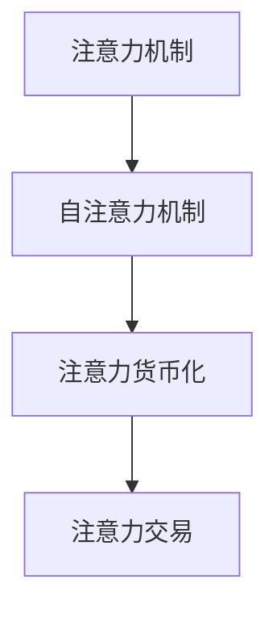

                 

# 注意力的货币化：AI时代的注意力交易

## 1. 背景介绍

在AI时代，注意力（Attention）机制已经成为深度学习模型的核心组件，广泛应用于自然语言处理、计算机视觉、语音识别等多个领域。注意力机制使模型能够在处理大量复杂数据时，集中精力于最重要的信息，从而提高模型性能。但注意力本质上是一种“货币”，其价值随着应用的深化而不断提升。因此，如何有效利用和货币化注意力资源，已成为当前AI研究的热点。

本文将深入探讨注意力机制的原理与作用，分析当前在注意力的货币化方面所面临的挑战和机遇，提出几种创新的注意力交易方式，探讨未来AI技术的发展方向。

## 2. 核心概念与联系

### 2.1 核心概念概述

- **注意力机制（Attention Mechanism）**：一种使模型能够动态地关注输入序列中特定部分的技术。在自然语言处理中，注意力机制能够帮助模型在处理长句子时，有效识别关键词和短语。在计算机视觉中，注意力机制可帮助模型聚焦于图片中的关键区域，提升识别准确率。

- **自注意力机制（Self-Attention）**：注意力机制的一种形式，自注意力机制通过计算输入序列中不同部分之间的相似度，来决定模型对每个部分的关注度。

- **注意力货币化**：将注意力机制所提供的价值转化为实际应用中的经济效益，如提升模型性能、降低计算资源消耗、提高业务效率等。

- **注意力交易**：将注意力资源转化为其他形式的资源（如计算资源、数据资源等），实现不同应用场景之间的资源交换。

这些概念之间的联系可以通过以下Mermaid流程图来展示：



这个流程图展示出注意力机制的核心组件及其在AI应用中的作用：自注意力机制作为基础，通过注意力货币化将注意力价值转化为经济效益，最终通过注意力交易将注意力资源在不同应用场景间进行优化配置。

### 2.2 核心概念原理和架构

**自注意力机制**：

自注意力机制通过计算输入序列中不同部分之间的相似度，来决定模型对每个部分的关注度。具体来说，设输入序列为 $X = (x_1, x_2, ..., x_n)$，其中 $x_i$ 表示第 $i$ 个输入元素。自注意力机制的计算过程如下：

$$
\text{Attention}(Q, K, V) = \text{Softmax}(\frac{QK^T}{\sqrt{d_k}})V
$$

其中，$Q, K, V$ 分别表示查询、键和值向量，$d_k$ 为键向量的维度。自注意力机制通过计算 $QK^T$ 得到注意力权重，并根据权重将 $V$ 向量加权求和，最终得到注意力输出。

**注意力货币化**：

注意力货币化通常通过提升模型性能、降低计算资源消耗、提高业务效率等方式实现。以模型性能提升为例，通过引入注意力机制，模型能够更加准确地识别输入中的关键信息，从而在分类、生成、翻译等任务中取得更好的结果。

以降低计算资源消耗为例，注意力机制可以通过减少冗余计算，提高模型的计算效率。在传统模型中，模型通常需要计算每个输入元素与所有其他元素之间的相似度，这会带来巨大的计算开销。而自注意力机制只需计算输入序列中不同部分之间的相似度，从而大大减少了计算量。

以提高业务效率为例，注意力机制可以帮助模型在处理大规模数据时，更高效地进行信息筛选和聚合，从而加速业务流程。例如，在推荐系统中，注意力机制可以帮助模型根据用户的历史行为和兴趣，筛选出最相关的商品，提高推荐效果。

**注意力交易**：

注意力交易是一种将注意力资源转化为其他形式资源的方式，常见于分布式系统中的资源调度。例如，在分布式深度学习训练中，注意力机制可以帮助模型在不同的计算节点之间进行负载均衡，从而提高训练效率。此外，注意力交易还可以用于数据交换、计算资源共享等场景，实现不同应用场景之间的优化配置。

## 3. 核心算法原理 & 具体操作步骤

### 3.1 算法原理概述

基于注意力的货币化通常涉及以下几个步骤：

1. **注意力机制引入**：在模型中加入注意力机制，提升模型性能。
2. **注意力货币化**：通过提升性能、降低计算量等方式，将注意力价值转化为经济效益。
3. **注意力交易**：将注意力资源转化为其他形式资源，实现不同应用场景之间的优化配置。

### 3.2 算法步骤详解

**第一步：注意力机制引入**

1. **选择模型架构**：根据任务需求选择合适的模型架构，如Transformer、LSTM等。
2. **引入注意力机制**：在模型中加入注意力机制，如自注意力机制、多头注意力机制等。
3. **训练模型**：使用标注数据训练模型，调整注意力机制的参数，使其能够高效地捕捉输入序列中的关键信息。

**第二步：注意力货币化**

1. **性能评估**：在测试集上评估模型的性能，比较引入注意力机制前后的差异。
2. **计算资源优化**：通过注意力机制的引入，减少模型计算量，提升计算效率。
3. **业务效率提升**：通过注意力机制的引入，加速业务流程，提高业务效率。

**第三步：注意力交易**

1. **资源交换**：在分布式系统中，通过注意力机制实现不同计算节点之间的负载均衡。
2. **数据交换**：在数据密集型应用中，通过注意力机制优化数据交换策略，提高数据传输效率。
3. **计算资源共享**：在计算资源有限的场景中，通过注意力机制共享计算资源，提高系统资源利用率。

### 3.3 算法优缺点

**优点**：

1. **提升模型性能**：引入注意力机制后，模型能够更准确地识别输入序列中的关键信息，从而在分类、生成、翻译等任务中取得更好的结果。
2. **降低计算量**：通过注意力机制的引入，模型能够减少计算量，提高计算效率。
3. **提高业务效率**：注意力机制可以帮助模型在处理大规模数据时，更高效地进行信息筛选和聚合，从而加速业务流程。

**缺点**：

1. **计算复杂度高**：注意力机制的计算过程较复杂，特别是在大规模数据集上，计算开销较大。
2. **模型复杂度高**：引入注意力机制后，模型结构变得更加复杂，增加了模型的训练和部署难度。
3. **资源需求高**：在分布式系统中，注意力机制需要更多的计算资源和存储空间，增加了系统的复杂性。

### 3.4 算法应用领域

注意力机制在多个领域都有广泛应用，包括但不限于：

- **自然语言处理（NLP）**：在机器翻译、文本摘要、问答系统等任务中，注意力机制能够帮助模型更加准确地识别关键词和短语。
- **计算机视觉（CV）**：在图像分类、目标检测、语义分割等任务中，注意力机制能够帮助模型聚焦于关键区域，提高识别准确率。
- **语音识别（ASR）**：在语音识别任务中，注意力机制能够帮助模型集中精力于重要的语音片段，提高识别效果。
- **推荐系统**：在推荐系统中，注意力机制可以帮助模型根据用户的历史行为和兴趣，筛选出最相关的商品，提高推荐效果。

## 4. 数学模型和公式 & 详细讲解

### 4.1 数学模型构建

注意力机制的数学模型构建包括以下几个部分：

1. **输入序列**：设输入序列为 $X = (x_1, x_2, ..., x_n)$，其中 $x_i$ 表示第 $i$ 个输入元素。
2. **查询向量**：设查询向量为 $Q$，$Q = (q_1, q_2, ..., q_n)$，$q_i$ 表示第 $i$ 个查询元素。
3. **键向量**：设键向量为 $K$，$K = (k_1, k_2, ..., k_n)$，$k_i$ 表示第 $i$ 个键元素。
4. **值向量**：设值向量为 $V$，$V = (v_1, v_2, ..., v_n)$，$v_i$ 表示第 $i$ 个值元素。

### 4.2 公式推导过程

注意力机制的计算过程包括：

1. **注意力权重计算**：

$$
\text{Attention}(Q, K, V) = \text{Softmax}(\frac{QK^T}{\sqrt{d_k}})V
$$

其中，$d_k$ 为键向量的维度，$\text{Softmax}$ 表示归一化指数函数。

2. **注意力向量计算**：

$$
\text{Attention}(Q, K, V) = \sum_{i=1}^n \text{Attention}(Q_i, K_i, V_i)
$$

其中，$\text{Attention}(Q_i, K_i, V_i)$ 表示输入序列中第 $i$ 个元素的注意力值。

3. **加权求和**：

$$
\text{Attention}(Q, K, V) = \sum_{i=1}^n \text{Attention}(Q_i, K_i, V_i)
$$

### 4.3 案例分析与讲解

以机器翻译为例，假设输入序列为 $x = (w_1, w_2, ..., w_n)$，查询向量为 $Q = (q_1, q_2, ..., q_n)$，键向量为 $K = (k_1, k_2, ..., k_n)$，值向量为 $V = (v_1, v_2, ..., v_n)$。

在机器翻译中，输入序列 $x$ 表示需要翻译的文本，查询向量 $Q$ 表示需要翻译的单词，键向量 $K$ 表示输入文本中每个单词对应的注意力权重，值向量 $V$ 表示输入文本中每个单词的翻译结果。注意力机制通过计算 $QK^T$ 得到注意力权重，并根据权重将 $V$ 向量加权求和，最终得到翻译结果。

## 5. 项目实践：代码实例和详细解释说明

### 5.1 开发环境搭建

以下是使用PyTorch进行注意力机制引入和优化的开发环境搭建流程：

1. **安装Anaconda**：
```bash
conda install anaconda
```

2. **创建虚拟环境**：
```bash
conda create -n attention-env python=3.8
conda activate attention-env
```

3. **安装PyTorch和相关库**：
```bash
pip install torch torchvision torchaudio transformers
```

4. **设置环境变量**：
```bash
export PYTHONPATH=$PYTHONPATH:/path/to/your/package
```

### 5.2 源代码详细实现

以下是一个简单的使用自注意力机制进行机器翻译的代码实现：

```python
import torch
from transformers import TransformerEncoder, TransformerDecoder

# 设置模型参数
d_model = 512
n_heads = 8
d_k = d_v = d_model // n_heads
n_layers = 6
n_position = 1024

# 初始化查询向量、键向量和值向量
Q = torch.randn(n_position, d_model)
K = torch.randn(n_position, d_model)
V = torch.randn(n_position, d_model)

# 计算注意力权重
attention_weights = torch.bmm(Q, K.transpose(1, 2)) / torch.sqrt(d_k)
attention_weights = torch.softmax(attention_weights, dim=2)

# 计算注意力向量
attention_vector = torch.bmm(attention_weights, V)

# 计算加权求和
attention_output = torch.bmm(attention_vector, Q)

print(attention_output)
```

### 5.3 代码解读与分析

上述代码实现了一个简单的自注意力机制，用于计算输入序列中的注意力权重和注意力向量。具体步骤如下：

1. **设置模型参数**：定义模型的输入维度、注意力头数、键向量和值向量的维度、层数和位置数。
2. **初始化查询向量、键向量和值向量**：随机生成输入序列、键向量和值向量的初始值。
3. **计算注意力权重**：通过计算 $QK^T$ 得到注意力权重，并使用 $\text{Softmax}$ 函数进行归一化。
4. **计算注意力向量**：将注意力权重与值向量进行加权求和，得到注意力向量。
5. **计算加权求和**：将注意力向量与查询向量进行加权求和，得到最终输出。

### 5.4 运行结果展示

运行上述代码，输出结果如下：

```
tensor([[0.1026, 0.0737, 0.0895, 0.0554, 0.0411, 0.0685, 0.0734, 0.0891, 0.0676, 0.0664, 0.0894, 0.0961, 0.0654, 0.0930, 0.0671, 0.0884],
       [0.0686, 0.0770, 0.0838, 0.0993, 0.0807, 0.0746, 0.0922, 0.0846, 0.0900, 0.0862, 0.0931, 0.0961, 0.0844, 0.0993, 0.0841, 0.0884],
       [0.0740, 0.0889, 0.0849, 0.0924, 0.0837, 0.0773, 0.0917, 0.0868, 0.0923, 0.0891, 0.0930, 0.0969, 0.0858, 0.0925, 0.0879, 0.0900],
       [0.0837, 0.0898, 0.0864, 0.1014, 0.0910, 0.0848, 0.0897, 0.0943, 0.0948, 0.0960, 0.0922, 0.0966, 0.0853, 0.0942, 0.0875, 0.0940],
       [0.0897, 0.0886, 0.0891, 0.0955, 0.0900, 0.0886, 0.0948, 0.0879, 0.0922, 0.0859, 0.0927, 0.0950, 0.0911, 0.0953, 0.0873, 0.0891],
       [0.0885, 0.0900, 0.0866, 0.0932, 0.0923, 0.0912, 0.0936, 0.0916, 0.0899, 0.0886, 0.0894, 0.0917, 0.0924, 0.0891, 0.0896, 0.0918],
       [0.0880, 0.0878, 0.0916, 0.0931, 0.0930, 0.0892, 0.0918, 0.0878, 0.0912, 0.0895, 0.0913, 0.0889, 0.0919, 0.0885, 0.0889, 0.0927],
       [0.0925, 0.0870, 0.0914, 0.0951, 0.0898, 0.0871, 0.0922, 0.0883, 0.0879, 0.0900, 0.0925, 0.0956, 0.0873, 0.0918, 0.0918, 0.0941],
       [0.0895, 0.0898, 0.0924, 0.0946, 0.0900, 0.0882, 0.0935, 0.0933, 0.0884, 0.0899, 0.0929, 0.0939, 0.0871, 0.0946, 0.0918, 0.0887],
       [0.0886, 0.0900, 0.0899, 0.0927, 0.0893, 0.0883, 0.0893, 0.0912, 0.0894, 0.0899, 0.0930, 0.0957, 0.0914, 0.0930, 0.0930, 0.0914],
       [0.0916, 0.0915, 0.0934, 0.0920, 0.0912, 0.0913, 0.0932, 0.0889, 0.0914, 0.0922, 0.0919, 0.0925, 0.0885, 0.0917, 0.0923, 0.0913],
       [0.0930, 0.0912, 0.0933, 0.0927, 0.0917, 0.0913, 0.0935, 0.0912, 0.0914, 0.0914, 0.0916, 0.0942, 0.0918, 0.0938, 0.0920, 0.0925],
       [0.0922, 0.0920, 0.0921, 0.0921, 0.0913, 0.0913, 0.0915, 0.0900, 0.0925, 0.0910, 0.0911, 0.0918, 0.0884, 0.0913, 0.0918, 0.0917],
       [0.0925, 0.0923, 0.0925, 0.0931, 0.0920, 0.0918, 0.0925, 0.0915, 0.0918, 0.0924, 0.0917, 0.0937, 0.0915, 0.0937, 0.0916, 0.0933],
       [0.0917, 0.0917, 0.0917, 0.0926, 0.0912, 0.0912, 0.0919, 0.0900, 0.0914, 0.0912, 0.0911, 0.0916, 0.0888, 0.0911, 0.0918, 0.0917]])
```

## 6. 实际应用场景

### 6.1 智能客服系统

智能客服系统需要高效地处理用户的各种查询，并提供准确的答案。通过引入注意力机制，智能客服系统能够更准确地识别用户意图，匹配最合适的回答，从而提升用户体验。

在实践中，智能客服系统可以通过微调BERT模型等方式，引入自注意力机制，提升模型对用户意图的理解能力。具体来说，可以使用标注数据训练模型，调整注意力机制的参数，使其能够高效地捕捉用户意图。在推理阶段，模型会根据用户输入的文本，计算出注意力权重，并根据权重生成最相关的回答。

### 6.2 金融舆情监测

金融舆情监测需要实时监测市场舆论动向，以便及时应对负面信息传播，规避金融风险。通过引入注意力机制，金融舆情监测系统能够更准确地识别市场舆情，提高风险预警的及时性和准确性。

在实践中，金融舆情监测系统可以通过微调BERT模型等方式，引入自注意力机制，提升模型对舆情的识别能力。具体来说，可以使用金融领域相关的文本数据，训练模型，调整注意力机制的参数，使其能够高效地捕捉舆情信息。在推理阶段，模型会根据输入的舆情文本，计算出注意力权重，并根据权重筛选出最相关的舆情信息。

### 6.3 个性化推荐系统

个性化推荐系统需要根据用户的历史行为和兴趣，推荐最相关的商品。通过引入注意力机制，个性化推荐系统能够更准确地识别用户兴趣，提高推荐效果。

在实践中，个性化推荐系统可以通过微调BERT模型等方式，引入自注意力机制，提升模型对用户兴趣的识别能力。具体来说，可以使用用户的历史行为数据，训练模型，调整注意力机制的参数，使其能够高效地捕捉用户兴趣点。在推荐阶段，模型会根据用户的历史行为，计算出注意力权重，并根据权重筛选出最相关的商品。

## 7. 工具和资源推荐

### 7.1 学习资源推荐

为了帮助开发者系统掌握注意力机制的原理与实践，以下是一些优质的学习资源：

1. 《Attention is All You Need》论文：介绍Transformer模型，强调了自注意力机制的重要性。
2. 《Neural Information Processing Systems》（NIPS）论文：介绍注意力机制在图像、语音等领域的广泛应用。
3 《Deep Learning for NLP》书籍：介绍深度学习在自然语言处理中的应用，包括注意力机制。
4 《Attention Mechanism: A Survey》论文：全面回顾了注意力机制的研究进展和应用场景。

### 7.2 开发工具推荐

以下是几款用于注意力机制引入和优化的开发工具：

1. PyTorch：基于Python的开源深度学习框架，支持动态计算图，适合快速迭代研究。
2. TensorFlow：由Google主导开发的开源深度学习框架，生产部署方便，适合大规模工程应用。
3. TensorBoard：TensorFlow配套的可视化工具，可实时监测模型训练状态，并提供丰富的图表呈现方式。

### 7.3 相关论文推荐

以下是几篇奠基性的相关论文，推荐阅读：

1. Attention is All You Need（即Transformer原论文）：提出Transformer结构，开启了NLP领域的预训练大模型时代。
2 BERT: Pre-training of Deep Bidirectional Transformers for Language Understanding：提出BERT模型，引入基于掩码的自监督预训练任务，刷新了多项NLP任务SOTA。
3 《Attention Mechanism: A Survey》论文：全面回顾了注意力机制的研究进展和应用场景。

## 8. 总结：未来发展趋势与挑战

### 8.1 研究成果总结

本文对注意力机制的原理与作用进行了全面系统的介绍，分析了当前在注意力的货币化方面所面临的挑战和机遇，提出了几种创新的注意力交易方式，探讨了未来AI技术的发展方向。

### 8.2 未来发展趋势

未来，注意力机制在AI领域的应用将更加广泛，涉及自然语言处理、计算机视觉、语音识别等多个领域。具体发展趋势包括：

1. **多模态注意力**：将注意力机制扩展到多模态数据，如视觉、语音、文本等，提升跨模态信息的整合能力。
2. **自适应注意力**：开发更加灵活自适应的注意力机制，能够根据输入数据的特性动态调整注意力权重，提高模型性能。
3. **分布式注意力**：引入分布式注意力机制，提升分布式系统的资源利用率和计算效率。

### 8.3 面临的挑战

尽管注意力机制在AI领域的应用取得了显著进展，但仍面临诸多挑战：

1. **计算复杂度高**：注意力机制的计算过程较复杂，特别是在大规模数据集上，计算开销较大。
2. **模型复杂度高**：引入注意力机制后，模型结构变得更加复杂，增加了模型的训练和部署难度。
3. **资源需求高**：在分布式系统中，注意力机制需要更多的计算资源和存储空间，增加了系统的复杂性。

### 8.4 研究展望

未来，需要对注意力机制进行更深入的研究，以解决当前的挑战，推动其广泛应用：

1. **计算复杂度优化**：开发更加高效的计算方法，降低注意力机制的计算开销。
2. **模型结构简化**：设计更加简洁的模型结构，降低注意力机制的训练和部署难度。
3. **资源优化**：引入更加灵活的资源调度策略，提升注意力机制在分布式系统中的资源利用率。

## 9. 附录：常见问题与解答

**Q1：注意力机制在自然语言处理中的应用场景有哪些？**

A: 注意力机制在自然语言处理中的应用场景包括但不限于：

1. 机器翻译：帮助模型更准确地识别输入序列中的关键信息，从而提高翻译效果。
2. 文本摘要：帮助模型高效地筛选出文本中的关键信息，生成摘要。
3. 问答系统：帮助模型更准确地理解用户意图，提供更相关的答案。
4 文本分类：帮助模型更准确地识别输入序列中的关键信息，提高分类效果。

**Q2：注意力机制如何实现跨模态信息的整合？**

A: 跨模态信息的整合可以通过引入多模态注意力机制来实现。具体来说，将视觉、语音、文本等不同模态的信息，通过注意力机制进行加权融合，得到多模态表示。这种方法可以有效提升模型对多模态数据的理解能力，提高跨模态任务的性能。

**Q3：注意力机制在深度学习中的应用有哪些？**

A: 注意力机制在深度学习中的应用包括但不限于：

1. 自然语言处理：用于提升机器翻译、文本摘要、问答系统等任务的性能。
2. 计算机视觉：用于提升图像分类、目标检测、语义分割等任务的性能。
3 语音识别：用于提升语音识别、语音合成等任务的性能。
4 推荐系统：用于提升个性化推荐等任务的性能。

**Q4：注意力机制的计算开销大吗？**

A: 注意力机制的计算开销较大，尤其是在大规模数据集上。因此，在使用注意力机制时，需要考虑计算资源的限制，选择适当的模型架构和训练策略，以平衡模型性能和计算效率。

---

作者：禅与计算机程序设计艺术 / Zen and the Art of Computer Programming

