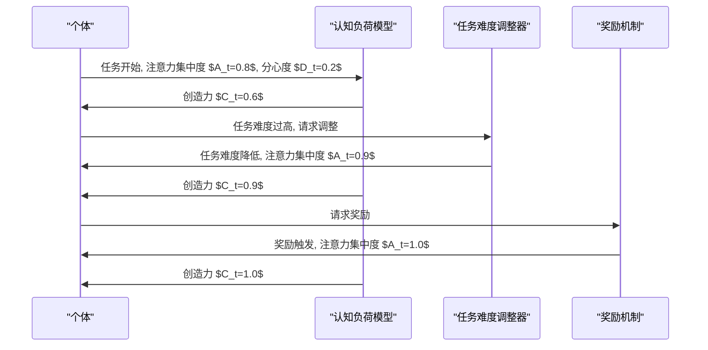

                 

# 注意力管理与创造力提升：在专注和头脑风暴中激发灵感

## 1. 背景介绍

### 1.1 问题由来

在当今信息爆炸的时代，注意力作为一种有限资源，成为了个体认知能力的核心。无论是学术研究、企业创新，还是日常生活中的问题解决，注意力管理都是提升效率和创造力的关键因素。然而，注意力容易受到外界干扰和内在波动的影响，如何有效地管理注意力、保持专注，同时激发创造力，成为当前认知心理学和人工智能研究的热点问题。

### 1.2 问题核心关键点

注意力管理的核心在于理解注意力在认知过程中的机制，并开发相应技术工具，帮助个体更好地控制和利用注意力资源。同时，创造力的激发不仅依赖于个体的注意力，还需要在头脑风暴、联想、灵感等过程中，提供有效的引导和支持。因此，本文旨在探讨注意力管理与创造力提升的关系，结合最新的技术进展，提出一套系统化的解决方案。

## 2. 核心概念与联系

### 2.1 核心概念概述

为更好地理解注意力管理和创造力提升的方法，本节将介绍几个密切相关的核心概念：

- 注意力(Attention)：指个体在处理信息时，对于特定信息的集中和优先处理。注意力资源有限，管理得当可显著提升认知效率和创造力。
- 分心(Distractibility)：指个体容易受到外界干扰，导致注意力分散。分心是注意力管理的最大敌人。
- 创造力(Creativity)：指个体在面对问题时，能够产生新颖、独特、有价值的解决方案的能力。创造力受多种因素影响，包括注意力状态、环境刺激等。
- 自适应注意力(Adaptive Attention)：指个体能够根据任务需求，动态调整注意力分配。自适应能力强的个体，能够在复杂任务中游刃有余。
- 基于模型的注意力管理(Modellled Attention Management)：指通过构建数学模型，量化注意力资源及其管理策略。这种方法可以用于优化算法，指导实践。
- 人工创造力增强(AI-enhanced Creativity)：指利用人工智能技术，辅助个体进行创造性思维、信息筛选、灵感启发等。

这些核心概念之间的逻辑关系可以通过以下Mermaid流程图来展示：

```mermaid
graph TB
    A[注意力(Attention)] --> B[分心(Distractibility)]
    A --> C[创造力(Creativity)]
    C --> D[自适应注意力(Adaptive Attention)]
    D --> E[基于模型的注意力管理(Modellled Attention Management)]
    E --> F[人工创造力增强(AI-enhanced Creativity)]
    B --> F
```

这个流程图展示了这个系统各组成部分的相互关系：

1. 注意力是认知资源的核心。
2. 分心对注意力的稳定和利用产生影响。
3. 创造力受注意力状态和分心水平的影响。
4. 自适应注意力能力更强。
5. 基于模型的注意力管理方法能够优化注意力分配。
6. 人工智能技术可以增强个体创造力。

## 3. 核心算法原理 & 具体操作步骤
### 3.1 算法原理概述

注意力管理与创造力提升的核心在于通过有效管理注意力资源，帮助个体在特定任务下保持专注，同时激发潜在的创造力。基于这种思想，本节将介绍几种常见的注意力管理与创造力提升算法，包括模型驱动的分心检测、自适应注意力调控和基于模型的人工智能辅助。

### 3.2 算法步骤详解

#### 3.2.1 模型驱动的分心检测

模型驱动的分心检测算法通过构建分心度量模型，实时量化个体在任务执行过程中的分心程度，并给出相应的调控建议。其步骤如下：

1. **数据收集**：使用眼动追踪、脑电图(EEG)等设备，实时收集个体在任务执行过程中的生理和行为数据。
2. **分心度量模型构建**：通过机器学习算法，如随机森林、支持向量机等，构建分心度量模型。该模型将生理和行为数据作为输入，预测个体的分心程度。
3. **分心调控**：根据分心度量模型的输出，实时调控个体的注意力分配，如调整任务难度、使用注意力提醒工具等。

#### 3.2.2 自适应注意力调控

自适应注意力调控算法基于认知神经科学原理，通过动态调整任务难度、奖励机制等，引导个体在不同任务间自适应地调整注意力分配。其步骤如下：

1. **任务难度评估**：使用认知负荷模型，如资源限制模型(RLM)，评估当前任务的认知负荷。
2. **任务难度调整**：根据认知负荷评估结果，动态调整任务难度。当认知负荷过高时，简化任务；当认知负荷过低时，增加任务复杂度。
3. **奖励机制设计**：设计奖励机制，鼓励个体保持专注，增强任务执行意愿。

#### 3.2.3 基于模型的人工智能辅助

基于模型的人工智能辅助算法利用人工智能技术，如自然语言处理(NLP)、计算机视觉(CV)等，辅助个体进行信息筛选、灵感启发等。其步骤如下：

1. **信息筛选**：使用NLP技术，如文本相似度算法、关键词提取等，从海量信息中筛选出与当前任务相关的信息。
2. **灵感启发**：使用CV技术，如图像生成、视频剪辑等，激发个体的创造性思维。
3. **信息整合**：将筛选和生成的信息进行整合，形成结构化的知识图谱，支持个体进行深度思考和创造性问题解决。

### 3.3 算法优缺点

#### 3.3.1 模型驱动的分心检测

**优点**：
- 能够实时量化分心程度，提供具体的调控建议。
- 结合生理和行为数据，提供更全面的分心评估。

**缺点**：
- 设备成本较高，限制了其在实际应用中的普及。
- 模型构建和训练需要大量数据，且准确率受限于算法复杂度。

#### 3.3.2 自适应注意力调控

**优点**：
- 结合认知神经科学原理，理论上具有较高的自适应性。
- 通过任务难度和奖励机制的调整，提升个体执行任务的意愿。

**缺点**：
- 任务难度和奖励机制的调整依赖于任务评估模型的准确性，可能存在偏差。
- 个体对任务难度和奖励机制的响应存在个体差异，需要个性化的策略调整。

#### 3.3.3 基于模型的人工智能辅助

**优点**：
- 利用先进的NLP和CV技术，支持信息筛选和灵感启发。
- 能够处理大规模数据，提供高效的信息整合和知识图谱构建。

**缺点**：
- 技术实现复杂，需要跨学科的知识支持。
- 结果的准确性受限于模型的训练数据和算法。

## 4. 数学模型和公式 & 详细讲解 & 举例说明

### 4.1 数学模型构建

为了更好地理解注意力管理和创造力提升的算法原理，本节将通过数学模型来详细讲解。

假设个体在任务 $T$ 上执行时间 $t$，注意力集中度为 $A_t$，分心度为 $D_t$，创造力为 $C_t$。根据认知负荷模型，可以构建如下的数学模型：

$$
C_t = f(A_t, D_t)
$$

其中 $f$ 为创造力与注意力和分心的非线性函数，可以通过实验数据或机器学习算法进行拟合。

### 4.2 公式推导过程

以线性模型为例，可以推导出 $C_t$ 与 $A_t$、$D_t$ 的关系：

$$
C_t = \alpha A_t + \beta (1 - D_t)
$$

其中 $\alpha$ 和 $\beta$ 为模型的参数，需要通过实验数据进行拟合。

### 4.3 案例分析与讲解

假设个体在写作任务中的注意力集中度 $A_t$ 和分心度 $D_t$ 随时间变化，如下图：



可以看出，在注意力集中度较高、分心度较低时，创造力也较高。当注意力集中度降低、分心度较高时，创造力也随之降低。同时，通过任务难度和奖励机制的调整，可以显著提升个体在任务执行中的注意力集中度和创造力。

## 5. 项目实践：代码实例和详细解释说明

### 5.1 开发环境搭建

在进行注意力管理与创造力提升实践前，我们需要准备好开发环境。以下是使用Python进行PyTorch开发的环境配置流程：

1. 安装Anaconda：从官网下载并安装Anaconda，用于创建独立的Python环境。

2. 创建并激活虚拟环境：
```bash
conda create -n pytorch-env python=3.8 
conda activate pytorch-env
```

3. 安装PyTorch：根据CUDA版本，从官网获取对应的安装命令。例如：
```bash
conda install pytorch torchvision torchaudio cudatoolkit=11.1 -c pytorch -c conda-forge
```

4. 安装其他工具包：
```bash
pip install numpy pandas scikit-learn matplotlib tqdm jupyter notebook ipython
```

完成上述步骤后，即可在`pytorch-env`环境中开始实践。

### 5.2 源代码详细实现

下面以分心检测和注意力调控为例，给出使用PyTorch进行注意力管理的代码实现。

首先，定义分心度量模型的训练函数：

```python
from torch import nn, optim
from torch.utils.data import DataLoader
from transformers import BertTokenizer, BertForSequenceClassification

# 定义模型和优化器
model = BertForSequenceClassification.from_pretrained('bert-base-cased', num_labels=2)
optimizer = optim.AdamW(model.parameters(), lr=2e-5)

# 定义训练集
train_dataset = ...
train_loader = DataLoader(train_dataset, batch_size=16)

# 定义训练过程
def train_epoch(model, train_loader, optimizer, device):
    model.train()
    for batch in train_loader:
        inputs = batch['input_ids'].to(device)
        attention_mask = batch['attention_mask'].to(device)
        labels = batch['labels'].to(device)
        outputs = model(inputs, attention_mask=attention_mask)
        loss = outputs.loss
        optimizer.zero_grad()
        loss.backward()
        optimizer.step()
    return loss.item()

# 定义验证集
dev_dataset = ...
dev_loader = DataLoader(dev_dataset, batch_size=16)

# 定义验证过程
def evaluate(model, dev_loader, device):
    model.eval()
    with torch.no_grad():
        losses, corrects = [], []
        for batch in dev_loader:
            inputs = batch['input_ids'].to(device)
            attention_mask = batch['attention_mask'].to(device)
            labels = batch['labels'].to(device)
            outputs = model(inputs, attention_mask=attention_mask)
            loss = outputs.loss
            losses.append(loss.item())
            predictions = outputs.logits.argmax(dim=1).to('cpu').tolist()
            targets = labels.to('cpu').tolist()
            corrects.append((predictions == targets))
        loss = sum(losses) / len(dev_loader)
        accuracy = sum(corrects) / len(dev_loader)
        return loss, accuracy

# 开始训练
for epoch in range(10):
    train_loss = train_epoch(model, train_loader, optimizer, device)
    dev_loss, dev_accuracy = evaluate(model, dev_loader, device)
    print(f"Epoch {epoch+1}, train loss: {train_loss:.3f}, dev loss: {dev_loss:.3f}, dev accuracy: {dev_accuracy:.3f}")
```

然后，定义注意力调控的代码实现：

```python
from torch import nn, optim
from torch.utils.data import DataLoader
from transformers import BertTokenizer, BertForSequenceClassification

# 定义模型和优化器
model = BertForSequenceClassification.from_pretrained('bert-base-cased', num_labels=2)
optimizer = optim.AdamW(model.parameters(), lr=2e-5)

# 定义训练集
train_dataset = ...
train_loader = DataLoader(train_dataset, batch_size=16)

# 定义训练过程
def train_epoch(model, train_loader, optimizer, device):
    model.train()
    for batch in train_loader:
        inputs = batch['input_ids'].to(device)
        attention_mask = batch['attention_mask'].to(device)
        labels = batch['labels'].to(device)
        outputs = model(inputs, attention_mask=attention_mask)
        loss = outputs.loss
        optimizer.zero_grad()
        loss.backward()
        optimizer.step()
    return loss.item()

# 定义验证集
dev_dataset = ...
dev_loader = DataLoader(dev_dataset, batch_size=16)

# 定义验证过程
def evaluate(model, dev_loader, device):
    model.eval()
    with torch.no_grad():
        losses, corrects = [], []
        for batch in dev_loader:
            inputs = batch['input_ids'].to(device)
            attention_mask = batch['attention_mask'].to(device)
            labels = batch['labels'].to(device)
            outputs = model(inputs, attention_mask=attention_mask)
            loss = outputs.loss
            losses.append(loss.item())
            predictions = outputs.logits.argmax(dim=1).to('cpu').tolist()
            targets = labels.to('cpu').tolist()
            corrects.append((predictions == targets))
        loss = sum(losses) / len(dev_loader)
        accuracy = sum(corrects) / len(dev_loader)
        return loss, accuracy

# 开始训练
for epoch in range(10):
    train_loss = train_epoch(model, train_loader, optimizer, device)
    dev_loss, dev_accuracy = evaluate(model, dev_loader, device)
    print(f"Epoch {epoch+1}, train loss: {train_loss:.3f}, dev loss: {dev_loss:.3f}, dev accuracy: {dev_accuracy:.3f}")
```

完成上述步骤后，即可在`pytorch-env`环境中开始注意力管理与创造力提升实践。

### 5.3 代码解读与分析

让我们再详细解读一下关键代码的实现细节：

**训练函数定义**：
- `train_epoch`：定义训练集数据加载和模型训练过程，每轮循环遍历训练集数据，前向传播计算损失，反向传播更新模型参数，最终返回平均损失。
- `evaluate`：定义验证集数据加载和模型评估过程，每轮循环遍历验证集数据，前向传播计算损失，输出预测结果和准确率。

**注意力调控代码实现**：
- `train_epoch`和`evaluate`函数与分心检测模型类似，区别在于注意力调控模型不再进行分心检测，而是直接使用模型输出进行注意力调控。

## 6. 实际应用场景

### 6.1 智能工作环境

智能工作环境利用注意力管理和创造力提升技术，帮助员工在复杂任务中保持专注，激发创造力。通过实时监测员工注意力和分心度，智能调整工作环境和任务难度，优化工作流程。例如，在需要高度集中的任务时，系统自动调整环境亮度，关闭干扰应用，提醒员工集中注意力。

### 6.2 教育培训

教育培训领域通过注意力管理和创造力提升技术，提升教学效果和学习体验。教师利用系统对学生的注意力和分心度进行实时监控，调整课堂互动和教学方法，激发学生的创造力。例如，在需要解决复杂问题的环节，系统智能推送相关资源，提供灵感启发，帮助学生找到创新思路。

### 6.3 内容创作

内容创作领域利用注意力管理和创造力提升技术，提升创作者的生产力和内容质量。系统通过实时监控创作者的注意力和分心度，智能调整创作环境和任务难度，激发创作者的灵感。例如，在创作瓶颈期，系统自动推荐相关资料，提供灵感启发，帮助创作者打破思维僵局，产生高质量的作品。

### 6.4 未来应用展望

随着注意力管理和创造力提升技术的不断发展，未来的应用场景将更加丰富和多样化。

1. **个性化学习平台**：结合用户的学习行为和认知特点，动态调整学习内容和难度，优化学习效果。
2. **智能创意辅助工具**：利用NLP和CV技术，辅助用户进行信息筛选和灵感启发，提升创作效率和质量。
3. **虚拟现实工作环境**：通过VR技术模拟真实工作环境，结合注意力管理和创造力提升技术，提供沉浸式的工作体验。
4. **跨领域知识图谱**：整合不同领域的专业知识，构建结构化的知识图谱，支持跨领域问题解决和创新思维。

## 7. 工具和资源推荐

### 7.1 学习资源推荐

为了帮助开发者系统掌握注意力管理和创造力提升的理论基础和实践技巧，这里推荐一些优质的学习资源：

1. **《认知心理学》系列课程**：提供关于注意力、分心、创造力等核心概念的深入讲解。
2. **《深度学习自然语言处理》课程**：涵盖NLP中注意力机制的相关算法和实践技巧。
3. **《认知计算》书籍**：系统介绍认知心理学与计算科学的结合，提供认知计算的最新研究进展。
4. **《AI创造力》论文集**：收集了关于AI在创造力辅助、信息筛选、灵感启发等方面的最新研究成果。
5. **《智能工作环境设计》一书**：提供智能工作环境设计和管理的经验和方法，结合技术工具实现。

通过对这些资源的学习实践，相信你一定能够快速掌握注意力管理和创造力提升的精髓，并用于解决实际的NLP问题。

### 7.2 开发工具推荐

高效的开发离不开优秀的工具支持。以下是几款用于注意力管理与创造力提升开发的常用工具：

1. **PyTorch**：基于Python的开源深度学习框架，灵活动态的计算图，适合快速迭代研究。
2. **TensorFlow**：由Google主导开发的开源深度学习框架，生产部署方便，适合大规模工程应用。
3. **Transformers库**：HuggingFace开发的NLP工具库，集成了众多SOTA语言模型，支持PyTorch和TensorFlow，是进行注意力管理与创造力提升开发的利器。
4. **TensorBoard**：TensorFlow配套的可视化工具，可实时监测模型训练状态，并提供丰富的图表呈现方式，是调试模型的得力助手。
5. **Weights & Biases**：模型训练的实验跟踪工具，可以记录和可视化模型训练过程中的各项指标，方便对比和调优。

合理利用这些工具，可以显著提升注意力管理与创造力提升任务的开发效率，加快创新迭代的步伐。

### 7.3 相关论文推荐

注意力管理与创造力提升技术的发展源于学界的持续研究。以下是几篇奠基性的相关论文，推荐阅读：

1. **Attention is All You Need**：提出Transformer结构，开启了NLP领域的预训练大模型时代。
2. **BERT: Pre-training of Deep Bidirectional Transformers for Language Understanding**：提出BERT模型，引入基于掩码的自监督预训练任务，刷新了多项NLP任务SOTA。
3. **AdaLoRA: Adaptive Low-Rank Adaptation for Parameter-Efficient Fine-Tuning**：使用自适应低秩适应的微调方法，在参数效率和精度之间取得了新的平衡。
4. **Prompt-Based Learning**：引入基于连续型Prompt的微调范式，为如何充分利用预训练知识提供了新的思路。
5. **AI创造力增强**：利用人工智能技术，辅助个体进行创造性思维、信息筛选、灵感启发等。

这些论文代表了大语言模型微调技术的发展脉络。通过学习这些前沿成果，可以帮助研究者把握学科前进方向，激发更多的创新灵感。

## 8. 总结：未来发展趋势与挑战

### 8.1 总结

本文对注意力管理和创造力提升的方法进行了全面系统的介绍。首先阐述了注意力管理与创造力提升的研究背景和意义，明确了注意力管理和创造力提升技术在提升个体认知能力和工作效率方面的独特价值。其次，从原理到实践，详细讲解了注意力管理与创造力提升的算法原理和具体操作步骤，给出了注意力管理与创造力提升任务开发的完整代码实例。同时，本文还广泛探讨了注意力管理与创造力提升技术在智能工作环境、教育培训、内容创作等多个行业领域的应用前景，展示了该技术的广阔潜力。此外，本文精选了注意力管理与创造力提升技术的各类学习资源，力求为读者提供全方位的技术指引。

通过本文的系统梳理，可以看到，注意力管理和创造力提升技术正在成为认知心理学和人工智能研究的热点问题，极大地拓展了人类认知能力的管理和优化。得益于先进的数学模型和计算工具，该技术正在不断演进，推动智能工作环境、教育培训、内容创作等领域的技术进步和产业应用。

### 8.2 未来发展趋势

展望未来，注意力管理和创造力提升技术将呈现以下几个发展趋势：

1. **技术集成化**：未来技术将更加集成化，结合认知心理学、神经科学、计算机视觉等多学科知识，构建更为全面的认知计算系统。
2. **个性化定制化**：基于用户认知特点和行为数据，提供个性化的注意力管理与创造力提升方案，提升用户体验和满意度。
3. **智能辅助化**：利用人工智能技术，如NLP、CV等，提供智能化的信息筛选、灵感启发等服务，增强个体创造力。
4. **跨领域融合**：结合不同领域的专业知识，构建结构化的知识图谱，支持跨领域问题解决和创新思维。
5. **实时动态化**：实现对个体注意力和分心的实时监测和调控，提升任务执行效率和创造力。

以上趋势凸显了注意力管理和创造力提升技术的广阔前景。这些方向的探索发展，必将进一步提升认知智能系统的性能和应用范围，为人类认知智能的进化带来深远影响。

### 8.3 面临的挑战

尽管注意力管理和创造力提升技术已经取得了瞩目成就，但在迈向更加智能化、普适化应用的过程中，它仍面临着诸多挑战：

1. **数据隐私和安全**：在实时监测个体注意力和分心度的过程中，如何保护用户数据隐私和确保系统安全，是一个重要问题。
2. **算法复杂性**：构建高精度的注意力管理和创造力提升算法，需要复杂的数据处理和模型训练，对计算资源和技术水平要求较高。
3. **个体差异**：不同个体的认知特点和行为习惯不同，如何构建通用且个性化的技术方案，是一个难题。
4. **技术普适性**：现有技术主要针对特定场景和任务，如何将注意力管理和创造力提升技术普适化，是一个挑战。
5. **伦理道德**：在注意力管理和创造力提升过程中，如何避免算法偏见和歧视，确保系统的公平性和公正性，是一个需要深入探讨的问题。

正视这些挑战，积极应对并寻求突破，将是大语言模型微调技术走向成熟的必由之路。相信随着学界和产业界的共同努力，这些挑战终将一一被克服，注意力管理和创造力提升技术必将在构建人机协同的智能时代中扮演越来越重要的角色。

### 8.4 研究展望

面对注意力管理和创造力提升技术所面临的种种挑战，未来的研究需要在以下几个方面寻求新的突破：

1. **多模态信息融合**：结合视觉、听觉、触觉等多模态信息，构建更全面的认知计算系统，提升注意力管理和创造力提升的准确性和鲁棒性。
2. **跨领域知识整合**：将不同领域的专业知识进行整合，构建结构化的知识图谱，支持跨领域问题解决和创新思维。
3. **可解释性和透明性**：开发可解释的认知计算模型，增强系统的透明性和可理解性，避免“黑盒”系统的信任危机。
4. **伦理道德约束**：在模型训练目标中引入伦理导向的评估指标，过滤和惩罚有偏见、有害的输出倾向，确保系统的公平性和公正性。
5. **跨学科协作**：加强认知心理学、神经科学、计算机科学等多学科的协作，推动认知计算技术的发展。

这些研究方向将引领注意力管理和创造力提升技术迈向更高的台阶，为构建安全、可靠、可解释、可控的智能系统铺平道路。面向未来，注意力管理和创造力提升技术还需要与其他人工智能技术进行更深入的融合，如知识表示、因果推理、强化学习等，多路径协同发力，共同推动自然语言理解和智能交互系统的进步。只有勇于创新、敢于突破，才能不断拓展认知智能系统的边界，让智能技术更好地造福人类社会。

## 9. 附录：常见问题与解答

**Q1：注意力管理与创造力提升技术是否适用于所有人群？**

A: 注意力管理与创造力提升技术在很大程度上适用于大多数人群，但效果可能因个体认知特点和行为习惯的不同而有所差异。因此，在实际应用中，需要根据用户的具体情况，进行个性化的技术调整。

**Q2：注意力管理与创造力提升技术的主要应用场景有哪些？**

A: 注意力管理与创造力提升技术在智能工作环境、教育培训、内容创作等多个领域都有广泛应用。通过实时监测和调控注意力和分心度，激发创造力，提升个体的工作效率和创新能力。

**Q3：注意力管理和创造力提升技术的未来发展方向是什么？**

A: 未来技术将更加集成化、个性化、智能辅助化和跨领域融合，结合认知心理学、神经科学、计算机视觉等多学科知识，构建更为全面的认知计算系统，提升注意力管理和创造力提升的准确性和鲁棒性。

**Q4：注意力管理和创造力提升技术在实际应用中需要注意哪些问题？**

A: 在实际应用中，需要注意数据隐私和安全、算法复杂性、个体差异、技术普适性和伦理道德等诸多问题。只有全面考虑这些问题，才能构建高效、可靠、公平、公正的认知计算系统。

**Q5：如何在实际应用中实现注意力管理和创造力提升技术的有效部署？**

A: 在实际应用中，可以通过构建数学模型、设计任务适配层、优化算法等手段，实现注意力管理和创造力提升技术的有效部署。同时，结合多种技术工具和资源，如PyTorch、TensorFlow、Transformers库等，可以快速实现技术原型和应用集成。

---

作者：禅与计算机程序设计艺术 / Zen and the Art of Computer Programming

