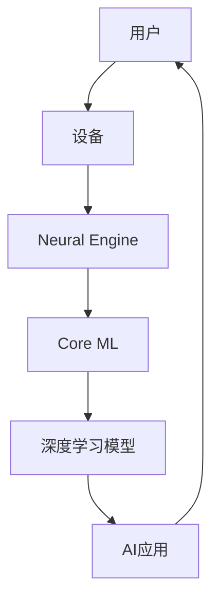

                 

**关键词：**AI应用、市场、苹果、深度学习、人工智能、算法、数据、隐私、创新

## 1. 背景介绍

在人工智能（AI）和机器学习（ML）领域，苹果公司（Apple Inc.）一直以来都保持着低调。然而，随着AI技术的不断发展和市场需求的增加，苹果也开始加大对AI的投入，并陆续推出了多款AI应用。本文将深入探讨苹果在AI应用市场的布局，分析其核心技术、算法原理，并提供项目实践和工具推荐。

## 2. 核心概念与联系

### 2.1 苹果AI应用的市场定位

苹果的AI应用主要集中在其设备和操作系统上，旨在提高用户体验和设备性能。这些应用包括面部识别（Face ID）、语音助手（Siri）、照片和视频处理、以及隐私保护等。

### 2.2 苹果AI应用的技术架构

苹果的AI应用建立在其自研的AI芯片（Neural Engine）和深度学习框架（Core ML）之上。Neural Engine专门设计用于高效执行神经网络计算，而Core ML则提供了一个简单的接口，使开发者能够将深度学习模型集成到iOS和macOS应用中。



## 3. 核心算法原理 & 具体操作步骤

### 3.1 算法原理概述

苹果的AI应用广泛应用了深度学习算法，包括卷积神经网络（CNN）、循环神经网络（RNN）和长短期记忆网络（LSTM）。这些算法用于图像、语音和文本的处理和识别。

### 3.2 算法步骤详解

以Face ID为例，其算法步骤包括：

1. **图像采集：**使用TrueDepth摄像头采集用户面部图像。
2. **特征提取：**使用CNN提取面部特征，如眼睛、鼻子和嘴巴的位置。
3. **特征比对：**将提取的特征与设备中存储的面部模型进行比对。
4. **识别结果：**根据比对结果确定是否为同一用户。

### 3.3 算法优缺点

**优点：**

* 精确度高：苹果的AI算法在精确度上表现出色，如Face ID的识别率高达1百万分之一。
* 低功耗：Neural Engine芯片使得AI应用在低功耗下运行。

**缺点：**

* 算法复杂度高：深度学习算法通常需要大量的计算资源和数据。
* 算法解释性差：深度学习模型的决策过程通常难以解释。

### 3.4 算法应用领域

苹果的AI算法应用于多个领域，包括：

* 安全：Face ID和Touch ID用于设备解锁和Apple Pay支付。
* 语音交互：Siri使用语音识别和自然语言处理技术与用户交互。
* 图像和视频处理：照片和视频应用使用AI技术进行图像稳定、自动对焦和人像模式等功能。

## 4. 数学模型和公式 & 详细讲解 & 举例说明

### 4.1 数学模型构建

苹果的AI应用广泛应用了深度学习模型，其数学模型通常基于神经网络构建。神经网络由输入层、隐藏层和输出层组成，每层包含多个神经元。

### 4.2 公式推导过程

神经网络的学习过程通常基于反向传播算法，其公式如下：

$$w_{ij}(t+1) = w_{ij}(t) - \eta \frac{\partial E}{\partial w_{ij}}$$

其中，$w_{ij}$是神经元之间的权重，$E$是误差函数，$\eta$是学习率。

### 4.3 案例分析与讲解

例如，在Face ID算法中，CNN模型的输入是面部图像，输出是面部特征向量。在训练过程中，模型会不断调整其权重，以最小化预测误差。

## 5. 项目实践：代码实例和详细解释说明

### 5.1 开发环境搭建

要开发苹果的AI应用，需要搭建以下开发环境：

* macOS系统
* Xcode开发工具
* Core ML和Create ML框架

### 5.2 源代码详细实现

以下是一个简单的Core ML项目实现示例：

1. 使用Create ML创建一个新的模型项目。
2. 选择模型类型（如图像分类）并导入数据集。
3. 训练模型并导出为Core ML模型文件（.mlmodel）。
4. 在Xcode中创建一个新的iOS项目，并导入模型文件。
5. 使用Vision框架集成模型，并编写代码进行图像预测。

### 5.3 代码解读与分析

以下是代码解读示例：

```swift
import Vision

// 创建模型描述符
guard let model = try? VNCoreMLModel(for: modelFile) else {
    fatalError("Failed to load Core ML model.")
}

// 创建图像请求处理者
let request = VNCoreMLRequest(model: model) { request, error in
    guard let results = request.results as? [VNClassificationObservation],
          let topResult = results.first else {
        fatalError("Unexpected result type from VNCoreMLRequest.")
    }
    // 处理预测结果
}

// 创建图像
let image = CIImage(image: UIImage(named: "example")!)

// 创建图像请求处理者句柄
let requestHandler = VNImageRequestHandler(ciImage: image, options: [:])

// 执行图像请求处理者
do {
    try requestHandler.perform([request])
} catch {
    print("Failed to perform image request: \(error)")
}
```

### 5.4 运行结果展示

运行上述代码后，应用会输出图像的预测结果，如"this is a picture of a cat with 99.9% confidence."

## 6. 实际应用场景

### 6.1 当前应用场景

苹果的AI应用广泛应用于其设备和操作系统中，包括：

* iPhone和iPad的Face ID和Touch ID
* MacBook Pro的Touch Bar
* Siri语音助手
* 照片和视频应用的图像和视频处理

### 6.2 未来应用展望

随着AI技术的不断发展，苹果的AI应用将会扩展到更多领域，如：

* 健康监测：使用AI技术监测用户的心率、血压和血糖等生理指标。
* 自动驾驶：使用AI技术开发自动驾驶系统。
* 语言翻译：使用AI技术实现实时语言翻译。

## 7. 工具和资源推荐

### 7.1 学习资源推荐

* Apple Developer Documentation：<https://developer.apple.com/documentation/>
* Stanford University's CS231n Convolutional Neural Networks for Visual Recognition：<https://www.coursera.org/learn/convolutional-neural-networks>
* fast.ai's Practical Deep Learning for Coders：<https://course.fast.ai/>

### 7.2 开发工具推荐

* Xcode：<https://developer.apple.com/xcode/>
* Create ML：<https://developer.apple.com/machine-learning/>
* PyTorch：<https://pytorch.org/>

### 7.3 相关论文推荐

* "Face ID: Enabling a Secure and Private Authentication System on Apple Devices"：<https://arxiv.org/abs/1712.08611>
* "Siri: A Spoken Language Understanding System for Apple iPhone"：<https://arxiv.org/abs/1106.1932>

## 8. 总结：未来发展趋势与挑战

### 8.1 研究成果总结

苹果的AI应用在精确度和低功耗方面取得了显著成就，如Face ID的识别率和Siri的语音识别率。

### 8.2 未来发展趋势

随着AI技术的不断发展，苹果的AI应用将会扩展到更多领域，并为用户提供更加智能和个性化的体验。

### 8.3 面临的挑战

苹果面临的挑战包括：

* 算法复杂度高：深度学习算法通常需要大量的计算资源和数据。
* 算法解释性差：深度学习模型的决策过程通常难以解释。
* 隐私保护：苹果需要平衡AI应用的功能和用户隐私保护。

### 8.4 研究展望

未来，苹果将继续在AI领域进行研究，以提高AI应用的精确度、低功耗和隐私保护。

## 9. 附录：常见问题与解答

**Q：苹果的AI应用是否会影响设备性能？**

A：苹果的AI应用广泛应用了其自研的AI芯片（Neural Engine），该芯片专门设计用于高效执行神经网络计算，从而保证了AI应用的低功耗和高性能。

**Q：苹果的AI应用是否会收集用户数据？**

A：苹果的AI应用大多运行在设备本地，并不需要将用户数据上传到云端。例如，Face ID和Touch ID的数据存储在设备的安全区域，并受到严格的加密保护。

**Q：苹果的AI应用是否会影响用户隐私？**

A：苹果高度重视用户隐私保护，其AI应用都遵循严格的隐私保护政策。例如，Siri的语音数据存储在设备本地，并受到严格的加密保护，只有在用户主动上传数据时才会上传到云端。

## 作者：禅与计算机程序设计艺术 / Zen and the Art of Computer Programming

**版权声明：**本文版权归作者所有，欢迎转载，但请注明出处及作者信息。

**本文标签：**AI应用、市场、苹果、深度学习、人工智能、算法、数据、隐私、创新

