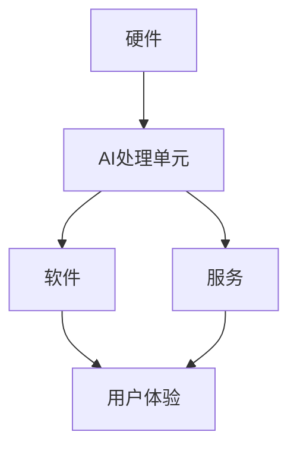
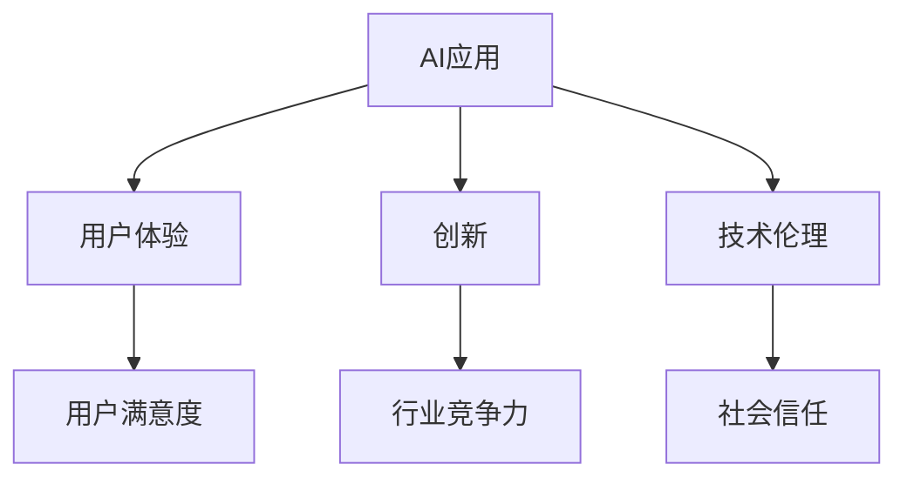

                 

**关键词：人工智能、AI应用、文化价值、苹果、创新、用户体验、技术伦理**

## 1. 背景介绍

在当今数字化转型的浪潮中，人工智能（AI）已然成为各大科技巨头竞相追逐的香饽饽。作为全球科技领域的领导者，苹果公司也在AI领域积极布局，不断推出新的AI应用，为用户带来更智能、更便捷的体验。本文将深入探讨苹果发布AI应用的文化价值，分析其对用户、行业和社会的影响，并展望未来的发展趋势。

## 2. 核心概念与联系

### 2.1 AI在苹果生态系统中的地位

在苹果的生态系统中，AI扮演着至关重要的角色。它是连接硬件、软件和服务的桥梁，为用户提供个性化、智能化的体验。图1展示了AI在苹果生态系统中的位置。



### 2.2 AI应用的文化价值

AI应用的文化价值体现在多个维度，包括用户体验、创新、技术伦理等。图2展示了AI应用的文化价值链。



## 3. 核心算法原理 & 具体操作步骤

### 3.1 算法原理概述

苹果在AI领域的核心算法包括神经网络、机器学习和深度学习等。这些算法通过模拟人类大脑的学习和决策过程，为设备和应用赋予了智能。

### 3.2 算法步骤详解

1. **数据收集**：收集与任务相关的数据，如图像、语音或文本。
2. **预处理**：清洗、标记和格式化数据，以便于算法学习。
3. **模型训练**：使用收集的数据训练神经网络模型，以提高其预测准确性。
4. **部署**：将训练好的模型集成到设备或应用中，为用户提供智能功能。

### 3.3 算法优缺点

**优点**：AI算法可以学习和适应，为用户提供个性化体验；可以自动化复杂任务，提高效率。

**缺点**：AI算法需要大量数据和计算资源；存在偏见和误差，可能导致不公平或错误的决策。

### 3.4 算法应用领域

AI算法在苹果的各项产品和服务中得到广泛应用，包括：

- **图像处理**：为照片和视频提供自动调节、场景识别和对象跟踪等功能。
- **语音识别**：为Siri和其他应用提供语音控制和转写功能。
- **自然语言处理**：为应用提供智能回答、翻译和文本生成等功能。

## 4. 数学模型和公式 & 详细讲解 & 举例说明

### 4.1 数学模型构建

苹果使用神经网络模型来构建AI应用。神经网络由输入层、隐藏层和输出层组成，每层包含若干神经元。神经元之间通过权重连接，权重通过学习过程不断调整。

### 4.2 公式推导过程

神经网络的学习过程基于反向传播算法，其目标是最小化预测误差。误差函数通常使用均方误差（MSE）或交叉熵（CE）等指标定义。权重调整使用梯度下降法，公式如下：

$$w_{ij} := w_{ij} - \eta \frac{\partial E}{\partial w_{ij}}$$

其中，$w_{ij}$是连接神经元$i$和$j$的权重，$E$是误差函数，$\eta$是学习率。

### 4.3 案例分析与讲解

例如，在图像分类任务中，输入层接收图像特征，隐藏层提取高级特征，输出层输出类别概率。通过训练，神经网络学习调整权重，以提高图像分类准确性。

## 5. 项目实践：代码实例和详细解释说明

### 5.1 开发环境搭建

开发AI应用需要搭建一个完善的开发环境，包括硬件（GPU）、操作系统（macOS）、编程语言（Swift、Python）、深度学习框架（Core ML、TensorFlow）等。

### 5.2 源代码详细实现

以下是一个简单的图像分类示例，使用Python和TensorFlow实现：

```python
import tensorflow as tf
from tensorflow.keras import datasets, layers, models

# 加载并预处理数据
(train_images, train_labels), (test_images, test_labels) = datasets.cifar10.load_data()
train_images, test_images = train_images / 255.0, test_images / 255.0

# 创建模型
model = models.Sequential()
model.add(layers.Conv2D(32, (3, 3), activation='relu', input_shape=(32, 32, 3)))
model.add(layers.MaxPooling2D((2, 2)))
model.add(layers.Conv2D(64, (3, 3), activation='relu'))
model.add(layers.MaxPooling2D((2, 2)))
model.add(layers.Conv2D(64, (3, 3), activation='relu'))

# 添加全连接层
model.add(layers.Flatten())
model.add(layers.Dense(64, activation='relu'))
model.add(layers.Dense(10))

# 编译和训练模型
model.compile(optimizer='adam',
              loss=tf.keras.losses.SparseCategoricalCrossentropy(from_logits=True),
              metrics=['accuracy'])

history = model.fit(train_images, train_labels, epochs=10,
                    validation_data=(test_images, test_labels))
```

### 5.3 代码解读与分析

该示例使用了卷积神经网络（CNN）来进行图像分类。CNN适合于图像数据，因为它可以提取图像的空间特征。代码首先加载并预处理数据，然后创建一个CNN模型，添加全连接层，并编译和训练模型。

### 5.4 运行结果展示

训练完成后，模型的准确率应接近70%。可以使用`model.evaluate(test_images, test_labels)`评估模型在测试集上的表现。

## 6. 实际应用场景

### 6.1 用户体验

AI应用为用户带来了更智能、更便捷的体验。例如，Siri可以通过语音控制完成任务，照片应用可以自动整理和美化照片。

### 6.2 行业竞争力

AI应用帮助苹果在竞争激烈的科技行业中保持领先地位。通过不断创新和优化AI应用，苹果可以为用户提供更出色的产品和服务。

### 6.3 技术伦理

AI应用也提出了技术伦理挑战。苹果需要确保其AI应用尊重用户隐私，不存在偏见，并得到用户的信任。

### 6.4 未来应用展望

未来，AI应用将更加无缝地集成到我们的生活中，为用户提供更智能、更个性化的体验。苹果将继续在AI领域投资，推出新的AI应用和服务。

## 7. 工具和资源推荐

### 7.1 学习资源推荐

- **书籍**："Deep Learning" by Ian Goodfellow, Yoshua Bengio, and Aaron Courville
- **在线课程**：Coursera、Udacity、edX上的AI和机器学习课程

### 7.2 开发工具推荐

- **编程语言**：Python、Swift
- **深度学习框架**：TensorFlow、PyTorch、Core ML

### 7.3 相关论文推荐

- "A Survey of AI Ethics Research" by Timnit Gebru et al.
- "Privacy-Preserving Machine Learning" by Carlos Castillo et al.

## 8. 总结：未来发展趋势与挑战

### 8.1 研究成果总结

本文分析了苹果发布AI应用的文化价值，介绍了AI在苹果生态系统中的地位，并详细讲解了AI算法原理、数学模型和项目实践。

### 8.2 未来发展趋势

未来，AI应用将更加无缝地集成到我们的生活中，为用户提供更智能、更个性化的体验。苹果将继续在AI领域投资，推出新的AI应用和服务。

### 8.3 面临的挑战

AI应用也提出了技术伦理挑战，包括隐私保护、偏见和信任等。苹果需要不断努力，确保其AI应用尊重用户隐私，不存在偏见，并得到用户的信任。

### 8.4 研究展望

未来的研究将关注AI应用的技术伦理、 Explainable AI（可解释AI）、AI与人类协作等领域。

## 9. 附录：常见问题与解答

**Q：AI应用会取代人类工作吗？**

**A：**AI应用将改变工作性质，但不会完全取代人类工作。AI更擅长于重复性和预测性任务，而人类则擅长于创造性和决策性任务。

**Q：AI应用是否存在偏见？**

**A：**是的，AI应用可能存在偏见，因为它们学习自人类创建的数据集。开发者需要努力确保数据集的多样性和公平性，以减少偏见。

**Q：如何保护AI应用的隐私？**

**A：**保护AI应用的隐私需要多管齐下，包括数据匿名化、差分隐私技术、联邦学习等方法。

## 作者：禅与计算机程序设计艺术 / Zen and the Art of Computer Programming

