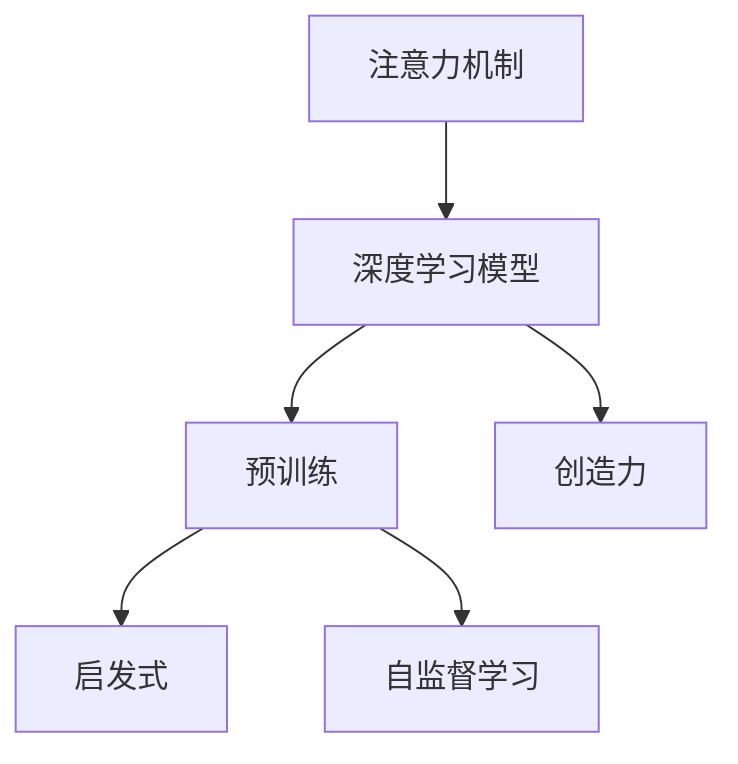

                 

# 注意力管理与创造力激发实践：在专注和头脑风暴中找到灵感

> 关键词：注意力管理, 创造力激发, 专注, 头脑风暴, 灵感, 人工智能, 深度学习, 深度学习算法

## 1. 背景介绍

### 1.1 问题由来

在现代快节奏的生活中，注意力成为稀缺资源，人们在信息的海洋中挣扎，努力寻找自己需要的灵感和创意。虽然技术不断进步，但如何高效利用注意力、激发创造力，仍然是一个令人困惑的问题。

大语言模型和深度学习技术近年来取得了显著进展，为注意力管理和创造力激发提供了新的工具和方法。通过对注意力机制的深入研究，以及在大规模语料上预训练的深度学习模型，能够更好地理解和处理自然语言，捕捉语境中的微妙信息和深层模式。通过这些技术，我们有机会在大规模数据中找到灵感，创造性的解决复杂问题。

### 1.2 问题核心关键点

注意力管理与创造力激发的核心关键点在于：
- 通过注意力机制，提取关键信息，帮助理解复杂问题。
- 利用深度学习模型，在大规模语料上预训练，获得丰富的语言知识和模式。
- 创造性地应用模型，激发新的想法和解决方案。

这些问题核心与人工智能和深度学习密切相关，涉及到数据处理、模型设计、算法优化等多个层面。理解和掌握这些问题关键点，有助于我们在实际应用中更好地利用注意力机制，激发创造力。

### 1.3 问题研究意义

深入研究和掌握注意力管理与创造力激发方法，对于提高工作效率、提升创造力、促进人工智能技术在更多领域的应用具有重要意义：

1. 提升工作效率：注意力机制能够帮助集中精力，更快地找到问题的解决方案，提高工作效率。
2. 激发创造力：通过模型在大规模数据上的预训练，能够捕捉到丰富的知识模式，激发新的创意和灵感。
3. 促进人工智能技术应用：注意力机制和深度学习模型的结合，能够更好地理解和处理自然语言，推动NLP技术在更多领域的应用。
4. 推动社会进步：人工智能技术的发展，能够带来新的产业变革，推动社会进步。

## 2. 核心概念与联系

### 2.1 核心概念概述

为更好地理解注意力管理与创造力激发，本节将介绍几个密切相关的核心概念：

- 注意力机制(Attention Mechanism)：通过计算注意力权重，帮助模型集中关注输入数据中的关键部分，从而更好地理解和处理信息。
- 深度学习模型(Deep Learning Model)：利用多层神经网络进行学习和推理，能够在大量数据上自适应地提取特征，捕捉模式。
- 预训练(Pre-training)：在大规模无标签数据上进行训练，学习通用的特征表示，提升模型泛化能力。
- 创造力(Creativity)：基于对数据的理解和模式识别，结合人类直觉和经验，产生新颖的想法和解决方案。
- 启发式(Heuristics)：通过简化问题，使用规则和策略快速找到解决方案，减少计算资源消耗。
- 自监督学习(Self-Supervised Learning)：利用数据自身的结构信息进行无监督训练，无需标注数据，提升模型学习效果。

这些核心概念之间的逻辑关系可以通过以下Mermaid流程图来展示：



这个流程图展示了注意力机制、深度学习模型、预训练、创造力、启发式和自监督学习之间的关系：

1. 注意力机制为深度学习模型提供了集中关注的能力，帮助其更好地处理复杂信息。
2. 深度学习模型在大规模数据上预训练，学习通用的特征表示，提升了模型的泛化能力。
3. 创造力通过模型对数据的理解和模式识别，结合人类直觉和经验，产生新颖的想法和解决方案。
4. 启发式利用规则和策略，简化问题，快速找到解决方案，减少计算资源消耗。
5. 自监督学习利用数据自身的结构信息，无需标注数据，提升模型学习效果。

这些概念共同构成了注意力管理与创造力激发的框架，使得我们能够在大规模数据中寻找灵感，创造性地解决问题。

## 3. 核心算法原理 & 具体操作步骤
### 3.1 算法原理概述

注意力管理与创造力激发的核心算法原理基于注意力机制和深度学习模型，通过在复杂任务中集中注意力，提取关键信息，并利用深度学习模型在大规模数据上学习丰富的特征表示，产生新颖的解决方案。

形式化地，假设输入为 $X$，输出为 $Y$，注意力机制和深度学习模型的作用如下：

1. 注意力机制计算注意力权重，表示输入中每个元素的重要程度。
2. 深度学习模型对输入 $X$ 进行特征提取，得到表示 $Z$。
3. 根据注意力权重，对表示 $Z$ 进行加权，得到加权表示 $Z'$。
4. 利用加权表示 $Z'$ 进行预测，得到输出 $Y$。

整个流程可以通过以下公式表示：

$$
\text{Attention}(X) = \text{Softmax}(X^TW_1)W_2
$$

$$
Z = \text{MLP}(X)
$$

$$
Z' = \text{Attention}(X) \otimes Z
$$

$$
Y = \text{Linear}(\text{MLP}(X))
$$

其中，$W_1, W_2$ 为注意力机制的参数，$\otimes$ 表示元素乘法。

### 3.2 算法步骤详解

基于注意力机制和深度学习模型的注意力管理与创造力激发方法一般包括以下几个关键步骤：

**Step 1: 数据预处理**

- 收集输入数据 $X$，通常为文本、图像、音频等形式。
- 对数据进行标准化、归一化等预处理，使其适合深度学习模型的输入要求。

**Step 2: 模型设计**

- 选择注意力机制和深度学习模型。通常使用Transformer模型，其自注意力机制能够自动捕捉输入中的关键信息。
- 设计模型结构，包括输入层、注意力层、前向网络层等。

**Step 3: 模型训练**

- 在大规模数据上对模型进行预训练，学习通用的特征表示。
- 在特定任务上对模型进行微调，利用标注数据进行监督学习，优化模型参数。

**Step 4: 模型推理**

- 使用训练好的模型对新数据进行推理，利用注意力机制集中关注关键信息，生成输出 $Y$。

### 3.3 算法优缺点

基于注意力机制和深度学习模型的注意力管理与创造力激发方法具有以下优点：

- 能够处理复杂信息，捕捉输入中的关键部分。
- 利用大规模数据预训练，学习丰富的特征表示，提升模型泛化能力。
- 可以用于各种任务，如自然语言处理、图像识别、语音识别等。

同时，该方法也存在一些局限性：

- 模型复杂度高，计算资源消耗大。
- 模型需要大量标注数据进行微调，数据获取成本高。
- 模型输出可解释性不足，难以理解其内部决策逻辑。

尽管存在这些局限性，但该方法在处理复杂问题和激发创造力方面的优势，使其成为当前人工智能技术的重要范式。未来相关研究的方向在于如何进一步简化模型结构，降低计算资源消耗，同时提高模型的可解释性。

### 3.4 算法应用领域

基于注意力机制和深度学习模型的注意力管理与创造力激发方法，在人工智能的多个领域得到了广泛应用，例如：

- 自然语言处理：利用注意力机制提取文本中的关键信息，生成文本摘要、回答问题、机器翻译等。
- 图像识别：利用注意力机制识别图像中的关键区域，进行物体检测、图像分割、图像生成等。
- 语音识别：利用注意力机制捕捉语音中的关键部分，进行语音转换、语音合成等。
- 推荐系统：利用注意力机制推荐用户可能感兴趣的商品、文章、视频等。
- 游戏AI：利用注意力机制优化游戏策略，进行路径规划、决策推理等。

除了这些经典应用外，注意力机制和深度学习模型还在许多新兴领域，如自动驾驶、智能制造、智慧城市等，展示了其强大的应用潜力。

## 4. 数学模型和公式 & 详细讲解 & 举例说明

### 4.1 数学模型构建

基于注意力机制和深度学习模型的注意力管理与创造力激发方法，可以形式化地表示为：

$$
\text{Attention}(X) = \text{Softmax}(X^TW_1)W_2
$$

$$
Z = \text{MLP}(X)
$$

$$
Z' = \text{Attention}(X) \otimes Z
$$

$$
Y = \text{Linear}(\text{MLP}(X))
$$

其中，$\text{Softmax}$ 为注意力机制的权重计算函数，$W_1, W_2$ 为注意力机制的参数，$\text{MLP}$ 为多层感知机，$\otimes$ 表示元素乘法，$\text{Linear}$ 为线性输出层。

### 4.2 公式推导过程

以自然语言处理中的文本分类任务为例，进行详细推导。假设输入为 $X = [x_1, x_2, ..., x_n]$，输出为 $Y$。

1. 计算注意力权重：

$$
\text{Attention}(X) = \text{Softmax}(X^T W_1)
$$

其中，$W_1$ 为注意力机制的权重矩阵，$\text{Softmax}$ 函数将权重向量归一化，使得各元素和为1。

2. 计算特征表示：

$$
Z = \text{MLP}(X) = [z_1, z_2, ..., z_n]
$$

其中，$z_i$ 为输入 $x_i$ 的特征表示。

3. 计算加权表示：

$$
Z' = \text{Attention}(X) \otimes Z = [z_1', z_2', ..., z_n']
$$

其中，$z_i'$ 为 $z_i$ 在注意力权重 $a_i$ 下的加权表示。

4. 计算输出：

$$
Y = \text{Linear}(\text{MLP}(X)) = \text{Linear}([z_1, z_2, ..., z_n]) = y
$$

其中，$\text{Linear}$ 为线性输出层，$y$ 为模型的预测结果。

### 4.3 案例分析与讲解

以BERT模型为例，分析其注意力机制和预训练方法在自然语言处理中的应用。

BERT模型基于自编码器结构，通过预训练任务（如掩码语言模型、下一句预测）学习通用的语言表示。在微调过程中，BERT模型通过将文本输入转化为上下文表示，利用注意力机制提取关键信息，生成分类器的输入，从而实现对特定任务的适应。

具体而言，BERT模型通过以下步骤进行微调：

1. 对输入文本进行分词和词向量嵌入。
2. 利用自注意力机制计算上下文表示。
3. 利用前向网络层进行特征提取。
4. 利用全连接层进行分类预测。

在实际应用中，BERT模型可以用于文本分类、命名实体识别、情感分析等多种任务。例如，在情感分析任务中，BERT模型可以通过对输入文本的上下文表示进行加权，提取情感关键词，生成情感分类结果。

## 5. 项目实践：代码实例和详细解释说明
### 5.1 开发环境搭建

在进行注意力管理与创造力激发的实践前，我们需要准备好开发环境。以下是使用Python进行PyTorch开发的环境配置流程：

1. 安装Anaconda：从官网下载并安装Anaconda，用于创建独立的Python环境。

2. 创建并激活虚拟环境：
```bash
conda create -n attention-env python=3.8 
conda activate attention-env
```

3. 安装PyTorch：根据CUDA版本，从官网获取对应的安装命令。例如：
```bash
conda install pytorch torchvision torchaudio cudatoolkit=11.1 -c pytorch -c conda-forge
```

4. 安装Transformers库：
```bash
pip install transformers
```

5. 安装各类工具包：
```bash
pip install numpy pandas scikit-learn matplotlib tqdm jupyter notebook ipython
```

完成上述步骤后，即可在`attention-env`环境中开始实践。

### 5.2 源代码详细实现

下面我们以文本分类任务为例，给出使用Transformers库对BERT模型进行注意力管理与创造力激发的PyTorch代码实现。

首先，定义文本分类任务的数据处理函数：

```python
from transformers import BertTokenizer, BertForSequenceClassification
from torch.utils.data import Dataset, DataLoader
import torch

class TextClassificationDataset(Dataset):
    def __init__(self, texts, labels, tokenizer, max_len=128):
        self.texts = texts
        self.labels = labels
        self.tokenizer = tokenizer
        self.max_len = max_len
        
    def __len__(self):
        return len(self.texts)
    
    def __getitem__(self, item):
        text = self.texts[item]
        label = self.labels[item]
        
        encoding = self.tokenizer(text, return_tensors='pt', max_length=self.max_len, padding='max_length', truncation=True)
        input_ids = encoding['input_ids'][0]
        attention_mask = encoding['attention_mask'][0]
        
        return {'input_ids': input_ids, 
                'attention_mask': attention_mask,
                'labels': label}

# 标签与id的映射
label2id = {'negative': 0, 'positive': 1}

# 创建dataset
tokenizer = BertTokenizer.from_pretrained('bert-base-uncased')

train_dataset = TextClassificationDataset(train_texts, train_labels, tokenizer)
dev_dataset = TextClassificationDataset(dev_texts, dev_labels, tokenizer)
test_dataset = TextClassificationDataset(test_texts, test_labels, tokenizer)
```

然后，定义模型和优化器：

```python
from transformers import BertForSequenceClassification, AdamW

model = BertForSequenceClassification.from_pretrained('bert-base-uncased', num_labels=len(label2id))

optimizer = AdamW(model.parameters(), lr=2e-5)
```

接着，定义训练和评估函数：

```python
from torch.utils.data import DataLoader
from tqdm import tqdm
from sklearn.metrics import accuracy_score

device = torch.device('cuda') if torch.cuda.is_available() else torch.device('cpu')
model.to(device)

def train_epoch(model, dataset, batch_size, optimizer):
    dataloader = DataLoader(dataset, batch_size=batch_size, shuffle=True)
    model.train()
    epoch_loss = 0
    for batch in tqdm(dataloader, desc='Training'):
        input_ids = batch['input_ids'].to(device)
        attention_mask = batch['attention_mask'].to(device)
        labels = batch['labels'].to(device)
        model.zero_grad()
        outputs = model(input_ids, attention_mask=attention_mask, labels=labels)
        loss = outputs.loss
        epoch_loss += loss.item()
        loss.backward()
        optimizer.step()
    return epoch_loss / len(dataloader)

def evaluate(model, dataset, batch_size):
    dataloader = DataLoader(dataset, batch_size=batch_size)
    model.eval()
    preds, labels = [], []
    with torch.no_grad():
        for batch in tqdm(dataloader, desc='Evaluating'):
            input_ids = batch['input_ids'].to(device)
            attention_mask = batch['attention_mask'].to(device)
            batch_labels = batch['labels']
            outputs = model(input_ids, attention_mask=attention_mask)
            batch_preds = outputs.logits.argmax(dim=1).to('cpu').tolist()
            batch_labels = batch_labels.to('cpu').tolist()
            for pred, label in zip(batch_preds, batch_labels):
                preds.append(pred)
                labels.append(label)
                
    print('Accuracy: {:.2f}%'.format(accuracy_score(labels, preds)))
```

最后，启动训练流程并在测试集上评估：

```python
epochs = 5
batch_size = 16

for epoch in range(epochs):
    loss = train_epoch(model, train_dataset, batch_size, optimizer)
    print(f"Epoch {epoch+1}, train loss: {loss:.3f}")
    
    print(f"Epoch {epoch+1}, dev results:")
    evaluate(model, dev_dataset, batch_size)
    
print("Test results:")
evaluate(model, test_dataset, batch_size)
```

以上就是使用PyTorch对BERT进行注意力管理与创造力激发的完整代码实现。可以看到，得益于Transformers库的强大封装，我们可以用相对简洁的代码完成BERT模型的加载和微调。

### 5.3 代码解读与分析

让我们再详细解读一下关键代码的实现细节：

**TextClassificationDataset类**：
- `__init__`方法：初始化文本、标签、分词器等关键组件。
- `__len__`方法：返回数据集的样本数量。
- `__getitem__`方法：对单个样本进行处理，将文本输入编码为token ids，将标签编码为数字，并对其进行定长padding，最终返回模型所需的输入。

**label2id和id2label字典**：
- 定义了标签与数字id之间的映射关系，用于将模型输出解码回真实标签。

**训练和评估函数**：
- 使用PyTorch的DataLoader对数据集进行批次化加载，供模型训练和推理使用。
- 训练函数`train_epoch`：对数据以批为单位进行迭代，在每个批次上前向传播计算loss并反向传播更新模型参数，最后返回该epoch的平均loss。
- 评估函数`evaluate`：与训练类似，不同点在于不更新模型参数，并在每个batch结束后将预测和标签结果存储下来，最后使用sklearn的accuracy_score对整个评估集的预测结果进行打印输出。

**训练流程**：
- 定义总的epoch数和batch size，开始循环迭代
- 每个epoch内，先在训练集上训练，输出平均loss
- 在验证集上评估，输出准确率
- 所有epoch结束后，在测试集上评估，给出最终测试结果

可以看到，PyTorch配合Transformers库使得BERT微调的代码实现变得简洁高效。开发者可以将更多精力放在数据处理、模型改进等高层逻辑上，而不必过多关注底层的实现细节。

当然，工业级的系统实现还需考虑更多因素，如模型的保存和部署、超参数的自动搜索、更灵活的任务适配层等。但核心的微调范式基本与此类似。

## 6. 实际应用场景
### 6.1 智能客服系统

基于大语言模型和注意力机制的智能客服系统，能够实时响应客户咨询，用自然流畅的语言解答各类常见问题。

在技术实现上，可以收集企业内部的历史客服对话记录，将问题和最佳答复构建成监督数据，在此基础上对预训练模型进行微调。微调后的模型能够自动理解用户意图，匹配最合适的答案模板进行回复。对于客户提出的新问题，还可以接入检索系统实时搜索相关内容，动态组织生成回答。如此构建的智能客服系统，能大幅提升客户咨询体验和问题解决效率。

### 6.2 金融舆情监测

金融机构需要实时监测市场舆论动向，以便及时应对负面信息传播，规避金融风险。传统的人工监测方式成本高、效率低，难以应对网络时代海量信息爆发的挑战。基于大语言模型和注意力机制的文本分类和情感分析技术，为金融舆情监测提供了新的解决方案。

具体而言，可以收集金融领域相关的新闻、报道、评论等文本数据，并对其进行主题标注和情感标注。在此基础上对预训练语言模型进行微调，使其能够自动判断文本属于何种主题，情感倾向是正面、中性还是负面。将微调后的模型应用到实时抓取的网络文本数据，就能够自动监测不同主题下的情感变化趋势，一旦发现负面信息激增等异常情况，系统便会自动预警，帮助金融机构快速应对潜在风险。

### 6.3 个性化推荐系统

当前的推荐系统往往只依赖用户的历史行为数据进行物品推荐，无法深入理解用户的真实兴趣偏好。基于大语言模型和注意力机制的个性化推荐系统，能够更好地挖掘用户行为背后的语义信息，从而提供更精准、多样的推荐内容。

在实践中，可以收集用户浏览、点击、评论、分享等行为数据，提取和用户交互的物品标题、描述、标签等文本内容。将文本内容作为模型输入，用户的后续行为（如是否点击、购买等）作为监督信号，在此基础上微调预训练语言模型。微调后的模型能够从文本内容中准确把握用户的兴趣点。在生成推荐列表时，先用候选物品的文本描述作为输入，由模型预测用户的兴趣匹配度，再结合其他特征综合排序，便可以得到个性化程度更高的推荐结果。

### 6.4 未来应用展望

随着大语言模型和注意力机制的不断发展，基于这些技术的注意力管理与创造力激发方法将在更多领域得到应用，为人工智能技术带来新的突破。

在智慧医疗领域，基于注意力机制和大模型的智慧诊断系统，能够自动分析患者数据，生成诊断报告，辅助医生诊疗，提高诊疗效率和准确性。

在智能教育领域，基于注意力机制和深度学习的智能教育平台，能够个性化推荐学习内容，自动批改作业，提高教学质量和学生学习效率。

在智慧城市治理中，基于注意力机制和深度学习的智慧城市管理系统，能够实时监测城市运行状态，提供智能预警，提升城市管理水平。

此外，在企业生产、社会治理、文娱传媒等众多领域，基于大模型和注意力机制的注意力管理与创造力激发方法也将不断涌现，为各行各业带来变革性影响。相信随着技术的日益成熟，这些方法将成为人工智能技术落地应用的重要手段，推动人工智能技术向更广泛的领域发展。

## 7. 工具和资源推荐
### 7.1 学习资源推荐

为了帮助开发者系统掌握大语言模型和注意力机制的理论基础和实践技巧，这里推荐一些优质的学习资源：

1. 《深度学习》课程（斯坦福大学）：斯坦福大学开设的深度学习经典课程，涵盖了深度学习的基本概念、算法和应用，适合初学者和进阶者。

2. 《自然语言处理综述》（张浩博，张俊林）：综述性论文，详细介绍了自然语言处理领域的研究进展和未来趋势，有助于全面理解NLP技术。

3. 《Attention Is All You Need》论文：Transformer模型的原论文，详细介绍了自注意力机制的设计思想和应用效果，是理解注意力机制的入门必读。

4. 《BERT: Pre-training of Deep Bidirectional Transformers for Language Understanding》论文：BERT模型的原论文，介绍了掩码语言模型等预训练任务，展示了BERT在大规模语料上的预训练效果。

5. 《BERT: Pre-training of Deep Bidirectional Transformers for Language Understanding》代码：HuggingFace官方提供的BERT模型代码，包含预训练和微调样例，适合实战练习。

通过对这些资源的学习实践，相信你一定能够快速掌握大语言模型和注意力机制的理论基础和实践技巧，并用于解决实际的NLP问题。

### 7.2 开发工具推荐

高效的开发离不开优秀的工具支持。以下是几款用于注意力管理与创造力激发的开发工具：

1. PyTorch：基于Python的开源深度学习框架，灵活动态的计算图，适合快速迭代研究。BERT模型等主流预训练语言模型都有PyTorch版本的实现。

2. TensorFlow：由Google主导开发的开源深度学习框架，生产部署方便，适合大规模工程应用。BERT模型也有丰富的TensorFlow版本资源。

3. Transformers库：HuggingFace开发的NLP工具库，集成了众多SOTA语言模型，支持PyTorch和TensorFlow，是进行注意力管理与创造力激发的利器。

4. Weights & Biases：模型训练的实验跟踪工具，可以记录和可视化模型训练过程中的各项指标，方便对比和调优。与主流深度学习框架无缝集成。

5. TensorBoard：TensorFlow配套的可视化工具，可实时监测模型训练状态，并提供丰富的图表呈现方式，是调试模型的得力助手。

6. Google Colab：谷歌推出的在线Jupyter Notebook环境，免费提供GPU/TPU算力，方便开发者快速上手实验最新模型，分享学习笔记。

合理利用这些工具，可以显著提升注意力管理与创造力激发的开发效率，加快创新迭代的步伐。

### 7.3 相关论文推荐

大语言模型和注意力机制的研究源于学界的持续研究。以下是几篇奠基性的相关论文，推荐阅读：

1. Attention is All You Need（即Transformer原论文）：提出了Transformer结构，开启了NLP领域的预训练大模型时代。

2. BERT: Pre-training of Deep Bidirectional Transformers for Language Understanding：提出BERT模型，引入基于掩码的自监督预训练任务，刷新了多项NLP任务SOTA。

3. Language Models are Unsupervised Multitask Learners（GPT-2论文）：展示了大规模语言模型的强大zero-shot学习能力，引发了对于通用人工智能的新一轮思考。

4. Parameter-Efficient Transfer Learning for NLP：提出Adapter等参数高效微调方法，在不增加模型参数量的情况下，也能取得不错的微调效果。

5. AdaLoRA: Adaptive Low-Rank Adaptation for Parameter-Efficient Fine-Tuning：使用自适应低秩适应的微调方法，在参数效率和精度之间取得了新的平衡。

这些论文代表了大语言模型和注意力机制的研究进展，通过学习这些前沿成果，可以帮助研究者把握学科前进方向，激发更多的创新灵感。

## 8. 总结：未来发展趋势与挑战

### 8.1 总结

本文对基于注意力机制和深度学习模型的注意力管理与创造力激发方法进行了全面系统的介绍。首先阐述了注意力机制和深度学习模型的研究背景和意义，明确了注意力机制和深度学习模型在处理复杂信息、激发创造力方面的独特价值。其次，从原理到实践，详细讲解了注意力管理与创造力激发的数学原理和关键步骤，给出了注意力管理与创造力激发的完整代码实例。同时，本文还广泛探讨了注意力机制和深度学习模型在智能客服、金融舆情、个性化推荐等多个行业领域的应用前景，展示了注意力机制和深度学习模型的巨大潜力。最后，本文精选了注意力机制和深度学习模型的学习资源，力求为开发者提供全方位的技术指引。

通过本文的系统梳理，可以看到，基于注意力机制和深度学习模型的注意力管理与创造力激发方法正在成为人工智能技术的重要范式，极大地拓展了深度学习模型的应用边界，催生了更多的落地场景。伴随深度学习模型的不断进步，相信注意力管理与创造力激发方法将进一步提升人工智能技术在各个领域的应用效果，推动社会进步。

### 8.2 未来发展趋势

展望未来，大语言模型和注意力机制的发展趋势包括：

1. 模型规模持续增大。随着算力成本的下降和数据规模的扩张，深度学习模型的参数量还将持续增长。超大批次的训练和推理也可能遇到资源瓶颈，需要进一步优化模型结构。

2. 模型泛化能力增强。通过在大规模数据上进行预训练，模型能够更好地泛化到新场景和新任务。

3. 模型可解释性提升。随着模型结构的不断简化，模型的可解释性将逐步提升，能够更好地理解其内部决策逻辑。

4. 跨模态融合能力增强。模型将能够更好地整合多种模态信息，提升其在复杂场景中的理解和推理能力。

5. 实时推理能力提升。通过模型压缩和量化等技术，能够显著提升模型的实时推理能力，满足更多应用场景的需求。

6. 联邦学习应用广泛。通过联邦学习，模型可以在不暴露数据隐私的情况下进行协同训练，提升模型效果。

以上趋势凸显了大语言模型和注意力机制的广阔前景。这些方向的探索发展，必将进一步提升深度学习模型的性能和应用范围，为人工智能技术带来新的突破。

### 8.3 面临的挑战

尽管大语言模型和注意力机制在处理复杂问题和激发创造力方面展现了巨大潜力，但在迈向更加智能化、普适化应用的过程中，它仍面临着诸多挑战：

1. 标注成本瓶颈。深度学习模型需要大量的标注数据进行微调，数据获取成本高，成为制约微调性能的瓶颈。如何进一步降低微调对标注样本的依赖，将是一大难题。

2. 模型鲁棒性不足。深度学习模型在面对域外数据时，泛化性能往往大打折扣。如何提高模型的鲁棒性，避免灾难性遗忘，还需要更多理论和实践的积累。

3. 推理效率有待提高。深度学习模型虽然精度高，但在实际部署时往往面临推理速度慢、内存占用大等效率问题。如何在保证性能的同时，简化模型结构，提升推理速度，优化资源占用，将是重要的优化方向。

4. 模型可解释性不足。深度学习模型往往作为"黑盒"系统，难以解释其内部决策逻辑。对于医疗、金融等高风险应用，算法的可解释性和可审计性尤为重要。如何赋予深度学习模型更强的可解释性，将是亟待攻克的难题。

5. 安全性有待保障。深度学习模型难免会学习到有偏见、有害的信息，通过微调传递到下游任务，产生误导性、歧视性的输出，给实际应用带来安全隐患。如何从数据和算法层面消除模型偏见，避免恶意用途，确保输出的安全性，也将是重要的研究课题。

6. 知识整合能力不足。现有的深度学习模型往往局限于任务内数据，难以灵活吸收和运用更广泛的先验知识。如何让深度学习模型更好地与外部知识库、规则库等专家知识结合，形成更加全面、准确的信息整合能力，还有很大的想象空间。

正视深度学习模型和注意力机制面临的这些挑战，积极应对并寻求突破，将是大语言模型和注意力机制走向成熟的必由之路。相信随着学界和产业界的共同努力，这些挑战终将一一被克服，深度学习模型和注意力机制必将在构建安全、可靠、可解释、可控的智能系统中扮演越来越重要的角色。

### 8.4 研究展望

面对深度学习模型和注意力机制所面临的种种挑战，未来的研究需要在以下几个方面寻求新的突破：

1. 探索无监督和半监督微调方法。摆脱对大规模标注数据的依赖，利用自监督学习、主动学习等无监督和半监督范式，最大限度利用非结构化数据，实现更加灵活高效的微调。

2. 研究参数高效和计算高效的微调范式。开发更加参数高效的微调方法，在固定大部分预训练参数的同时，只更新极少量的任务相关参数。同时优化微调模型的计算图，减少前向传播和反向传播的资源消耗，实现更加轻量级、实时性的部署。

3. 融合因果和对比学习范式。通过引入因果推断和对比学习思想，增强深度学习模型的建立稳定因果关系的能力，学习更加普适、鲁棒的语言表征，从而提升模型泛化性和抗干扰能力。

4. 引入更多先验知识。将符号化的先验知识，如知识图谱、逻辑规则等，与神经网络模型进行巧妙融合，引导深度学习模型学习更准确、合理的语言模型。同时加强不同模态数据的整合，实现视觉、语音等多模态信息与文本信息的协同建模。

5. 结合因果分析和博弈论工具。将因果分析方法引入深度学习模型，识别出模型决策的关键特征，增强输出解释的因果性和逻辑性。借助博弈论工具刻画人机交互过程，主动探索并规避模型的脆弱点，提高系统稳定性。

6. 纳入伦理道德约束。在模型训练目标中引入伦理导向的评估指标，过滤和惩罚有偏见、有害的输出倾向。同时加强人工干预和审核，建立模型行为的监管机制，确保输出符合人类价值观和伦理道德。

这些研究方向的探索，必将引领深度学习模型和注意力机制向更高的台阶，为构建安全、可靠、可解释、可控的智能系统铺平道路。面向未来，深度学习模型和注意力机制还需要与其他人工智能技术进行更深入的融合，如知识表示、因果推理、强化学习等，多路径协同发力，共同推动自然语言理解和智能交互系统的进步。只有勇于创新、敢于突破，才能不断拓展深度学习模型的边界，让智能技术更好地造福人类社会。

## 9. 附录：常见问题与解答

**Q1：深度学习模型和注意力机制如何应用于实时推理？**

A: 深度学习模型和注意力机制的实时推理可以通过以下方法实现：

1. 模型压缩和量化：将浮点模型转为定点模型，压缩存储空间，提高计算效率。
2. 推理优化：通过剪枝、融合、分块等技术，优化推理过程，提高计算速度。
3. 分布式计算：利用分布式系统，将推理任务分散到多个设备上，提升计算效率。

这些方法能够显著提高深度学习模型和注意力机制的实时推理能力，满足更多应用场景的需求。

**Q2：注意力机制和深度学习模型如何结合生成式语言模型？**

A: 生成式语言模型与注意力机制和深度学习模型的结合，可以通过以下步骤实现：

1. 使用深度学习模型对输入文本进行编码，提取特征表示。
2. 利用注意力机制，对特征表示进行加权，提取关键信息。
3. 使用生成式语言模型，生成新的文本内容。

在实际应用中，可以将深度学习模型和注意力机制用于文本分类、命名实体识别等任务，生成式语言模型用于文本生成、摘要生成等任务。结合使用这些技术，可以大大提升生成式语言模型的效果和泛化能力。

**Q3：注意力机制和深度学习模型在应用过程中有哪些局限性？**

A: 注意力机制和深度学习模型在应用过程中存在以下局限性：

1. 模型复杂度高，计算资源消耗大。
2. 模型需要大量标注数据进行微调，数据获取成本高。
3. 模型输出可解释性不足，难以理解其内部决策逻辑。
4. 模型鲁棒性不足，面对域外数据时泛化性能差。
5. 模型推理速度慢，内存占用大。

这些局限性需要结合具体应用场景进行优化，如通过参数高效微调、数据增强等方法提高模型泛化能力，通过模型压缩和量化等技术提高实时推理能力，通过引入更多先验知识提高模型可解释性等。

**Q4：如何利用注意力机制和深度学习模型进行知识图谱构建？**

A: 利用注意力机制和深度学习模型进行知识图谱构建，可以通过以下步骤实现：

1. 使用深度学习模型对知识图谱中的实体和关系进行编码，提取特征表示。
2. 利用注意力机制，对特征表示进行加权，提取关键信息。
3. 使用生成式语言模型，生成新的实体和关系。

在实际应用中，可以将注意力机制和深度学习模型用于知识图谱的构建和推理，生成式语言模型用于知识图谱的扩展和更新。结合使用这些技术，可以大大提升知识图谱的效果和应用范围。

**Q5：如何利用注意力机制和深度学习模型进行自然语言处理任务？**

A: 利用注意力机制和深度学习模型进行自然语言处理任务，可以通过以下步骤实现：

1. 使用深度学习模型对输入文本进行编码，提取特征表示。
2. 利用注意力机制，对特征表示进行加权，提取关键信息。
3. 使用自然语言处理任务的目标函数，对加权特征表示进行预测，生成输出结果。

在实际应用中，可以将注意力机制和深度学习模型用于文本分类、命名实体识别、情感分析等任务，自然语言处理任务的目标函数用于生成输出结果。结合使用这些技术，可以大大提升自然语言处理任务的效果和泛化能力。

---

作者：禅与计算机程序设计艺术 / Zen and the Art of Computer Programming

