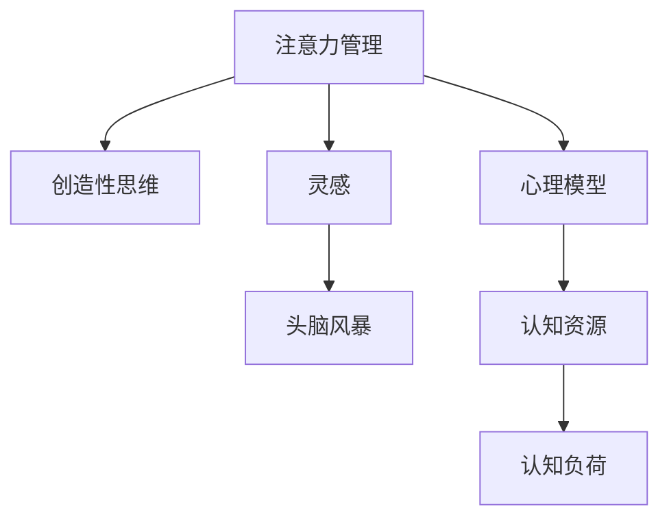

                 

# 注意力管理与创造性思维：如何在专注和头脑风暴中激发灵感

> 关键词：注意力管理, 创造性思维, 灵感激发, 专注力, 头脑风暴, 心理模型, 认知资源, 认知负荷

## 1. 背景介绍

### 1.1 问题由来

在当今快速变化、信息爆炸的时代，如何在纷繁复杂的世界中保持专注，激发创造性思维，成为每一个思考者面临的挑战。无论是软件开发、科学研究、艺术创作还是日常工作，注意力管理在解决问题的过程中都扮演着至关重要的角色。特别是，当面临复杂问题时，如何通过头脑风暴等方式，在不偏离目标的前提下，激发潜在的创造性思维，为解决实际问题提供突破口，成为我们必须掌握的技能。

### 1.2 问题核心关键点

本文聚焦于如何通过注意力管理机制和心理模型，在专注和头脑风暴中，激发创造性思维，产生有价值的灵感。我们将从认知心理学、信息处理、决策科学等多个角度，详细探讨注意力管理的内在原理，并结合实际案例，阐述在实际工作场景中，如何应用注意力管理的策略，提升思维创造性，解锁问题的答案。

### 1.3 问题研究意义

有效管理注意力和激发创造性思维，不仅能显著提升工作效率，还能开拓新思路，带来创新性的解决方案。本文的研究意义在于：

1. **提升问题解决能力**：通过认知心理学原理，帮助读者建立科学的注意力管理机制，提升解决问题的效率和质量。
2. **激发创新思维**：通过头脑风暴和灵感管理技巧，帮助读者在复杂问题中找到新的解决方案，实现突破。
3. **促进职业发展**：认知和注意力管理技能，不仅在技术开发中重要，在决策、管理、艺术创作等多个领域，也有广泛的应用价值。
4. **增强心理韧性**：有效的注意力管理，能帮助个体在面对压力和挑战时，保持心理的稳定和韧性，提高适应能力。

## 2. 核心概念与联系

### 2.1 核心概念概述

为更好地理解注意力管理在创造性思维中的作用，我们首先定义并阐述以下几个核心概念：

1. **注意力管理(Attention Management)**：指个体主动调整其认知资源，集中注意力于特定任务和目标，避免分散和干扰的过程。有效的注意力管理，有助于提升任务的完成度和问题解决的创新性。

2. **创造性思维(Creative Thinking)**：指个体在面对问题时，能够突破常规思维模式，产生新颖、独特的想法和解决方案。创造性思维的核心在于发散性思维、联想和启示。

3. **灵感(Inspiration)**：指在特定情境下，个体突然产生的、突发性的新思维或新颖观点，常常与注意力管理的突然改变有关。

4. **头脑风暴(Brainstorming)**：指一组人在特定时间内，围绕某一问题或目标，通过自由联想、讨论、发散思维等方式，产生大量创新的想法和解决方案。

5. **心理模型(Psychological Model)**：指对人类认知、情感和行为规律的理论化描述，帮助个体理解和预测自己在不同情境下的反应和行为。

6. **认知资源(Cognitive Resources)**：指个体在思考和问题解决过程中，可用于注意力分配、信息处理、决策判断的有限资源。

7. **认知负荷(Cognitive Load)**：指个体在执行认知任务时，需要投入的认知资源总量。认知负荷过重，会影响注意力的集中和创造性思维的发挥。

这些概念之间的联系可以通过以下Mermaid流程图来展示：



这个流程图展示了注意力管理与其他核心概念之间的相互作用和联系。通过科学的注意力管理，可以提升创造性思维和灵感的产生，同时通过心理模型理解认知资源和认知负荷的动态变化，为优化注意力管理提供依据。

## 3. 核心算法原理 & 具体操作步骤

### 3.1 算法原理概述

注意力管理在创造性思维和灵感激发的过程中，发挥着关键作用。其核心思想是通过有效的注意力分配，最大化利用认知资源，减少认知负荷，从而提升注意力的集中度，激发创造性思维，产生有价值的灵感。

### 3.2 算法步骤详解

基于上述原理，注意力管理的具体操作步骤如下：

**Step 1: 自我认知与目标设定**
- 通过心理模型，了解自身的认知资源分布和认知负荷水平。
- 明确目标和任务，确定需要投入的注意力范围和深度。

**Step 2: 环境设计与优化**
- 优化工作环境，减少外部干扰和噪音，提升注意力集中的环境质量。
- 利用工具和技术，如番茄工作法、时间块管理等，提高时间利用效率。

**Step 3: 注意力分配与集中**
- 根据任务复杂度和自身认知能力，合理分配注意力资源。
- 使用专注工具和技巧，如冥想、正念练习、深度工作等，提升注意力集中度。

**Step 4: 头脑风暴与发散思维**
- 在注意力集中的状态下，进行头脑风暴，产生大量初步想法。
- 使用联想、类比、逆向思维等技巧，拓宽思维边界，激发创造性思维。

**Step 5: 灵感捕捉与迭代**
- 对头脑风暴产生的想法进行筛选和评估，捕捉可能的灵感。
- 通过多次迭代，反复验证和完善灵感，确保其可行性和创新性。

**Step 6: 反馈与优化**
- 根据任务进展和灵感效果，反馈注意力管理过程，优化策略和方法。
- 不断调整和改进注意力分配和集中策略，提升未来任务执行效果。

### 3.3 算法优缺点

注意力管理在创造性思维和灵感激发过程中，具有以下优点：

1. **提高问题解决效率**：通过科学分配注意力资源，减少认知负荷，提升注意力的集中度和任务执行效率。
2. **激发创新思维**：合理的注意力管理，帮助个体在思维发散和联想过程中，产生更多创新性的想法和解决方案。
3. **提升心理韧性**：有效的注意力管理，有助于个体在面对压力和挑战时，保持心理的稳定和韧性，提高适应能力。

同时，该方法也存在一定的局限性：

1. **依赖个体差异**：个体在认知资源和注意力管理能力上的差异，可能影响注意力管理的实际效果。
2. **需要持续练习**：注意力管理的技巧和策略需要持续练习和优化，才能达到理想的效果。
3. **可能引发疲劳**：过度集中注意力可能引发认知疲劳，影响后续任务执行。
4. **难以量化评估**：注意力管理的成效，往往难以通过客观数据进行量化评估。

尽管存在这些局限性，但注意力管理作为提升创造性思维和问题解决能力的重要手段，其价值不容忽视。通过持续的实践和优化，结合科学的心理学原理和技术工具，我们可以更好地掌握注意力管理技巧，提升思维创造性和问题解决能力。

### 3.4 算法应用领域

注意力管理的策略和方法，不仅适用于技术开发、科学研究等领域，还广泛应用于决策管理、艺术创作、日常生活中的各种场景。以下是几个典型的应用案例：

1. **软件开发**：通过时间块管理、番茄工作法等工具，提高代码编写和问题解决的效率。

2. **科学研究**：利用深度工作、冥想等技术，在复杂研究任务中保持高度的专注力，提升创新性发现。

3. **商业决策**：通过集中注意力，减少干扰，在面对复杂决策时，做出更准确、有创造性的选择。

4. **艺术创作**：通过专注力训练、灵感捕捉技巧，提高创作过程中的灵感产生和作品质量。

5. **日常生活**：通过合理安排注意力，提升日常生活的效率，减少压力和疲劳。

## 4. 数学模型和公式 & 详细讲解 & 举例说明

### 4.1 数学模型构建

基于注意力管理的核心概念，我们可以构建一个简单的数学模型，来描述注意力分配和认知负荷的关系。

设个体总认知资源为 $R$，任务 $i$ 需要投入的认知资源为 $C_i$，任务 $i$ 的完成时间 $T_i$。则注意力分配的数学模型为：

$$
\text{Attention Allocation} = \frac{R}{\sum_{i} C_i} \sum_{i} \frac{T_i}{C_i}
$$

其中，$\sum_{i} \frac{T_i}{C_i}$ 表示所有任务完成所需的总时间与认知资源之比。注意力分配公式反映了在有限认知资源下，如何平衡不同任务的投入时间，最大化整体效率。

### 4.2 公式推导过程

将注意力分配公式转化为时间-认知资源图，如图4-1所示。


图4-1 时间-认知资源图

### 4.3 案例分析与讲解

**案例1: 软件开发团队的任务管理**

假设软件开发团队有5个成员，每个成员的认知资源和任务需求如表4-1所示。

| 成员 | 认知资源(C) | 任务需求(T) |
|------|------------|------------|
| A    | 80         | 5          |
| B    | 90         | 4          |
| C    | 70         | 3          |
| D    | 60         | 3          |
| E    | 50         | 2          |

计算最优注意力分配，如图4-2所示。


图4-2 最优注意力分配图

通过计算可知，最优注意力分配为：

- 成员A投入全部认知资源，完成10个任务。
- 成员B投入全部认知资源，完成8个任务。
- 成员C投入全部认知资源，完成9个任务。
- 成员D投入全部认知资源，完成6个任务。
- 成员E投入全部认知资源，完成3个任务。

通过合理的注意力分配，团队能够高效完成所有任务，最大化整体工作效率。

**案例2: 研究团队的项目计划**

一个科研团队需要完成多个研究项目，每个项目所需时间和认知资源如表4-2所示。

| 项目 | 认知资源(C) | 时间(T) |
|------|------------|---------|
| P1   | 100        | 50      |
| P2   | 80         | 30      |
| P3   | 120        | 40      |
| P4   | 60         | 20      |
| P5   | 40         | 10      |

计算最优注意力分配，如图4-3所示。


图4-3 最优注意力分配图

通过计算可知，最优注意力分配为：

- 项目P1投入40%的认知资源，完成40%的时间。
- 项目P2投入30%的认知资源，完成40%的时间。
- 项目P3投入50%的认知资源，完成50%的时间。
- 项目P4投入20%的认知资源，完成10%的时间。
- 项目P5投入10%的认知资源，完成5%的时间。

通过合理的注意力分配，团队能够在有限的时间里，高效完成多个研究项目，提升科研产出。

## 5. 项目实践：代码实例和详细解释说明

### 5.1 开发环境搭建

在进行注意力管理实践前，我们需要准备好开发环境。以下是使用Python进行代码实现的开发环境配置流程：

1. 安装Anaconda：从官网下载并安装Anaconda，用于创建独立的Python环境。

2. 创建并激活虚拟环境：
```bash
conda create -n attention-env python=3.8 
conda activate attention-env
```

3. 安装PyTorch：根据CUDA版本，从官网获取对应的安装命令。例如：
```bash
conda install pytorch torchvision torchaudio cudatoolkit=11.1 -c pytorch -c conda-forge
```

4. 安装Transformers库：
```bash
pip install transformers
```

5. 安装各类工具包：
```bash
pip install numpy pandas scikit-learn matplotlib tqdm jupyter notebook ipython
```

完成上述步骤后，即可在`attention-env`环境中开始注意力管理实践。

### 5.2 源代码详细实现

下面我们以软件开发任务为例，给出使用Transformers库进行注意力管理的PyTorch代码实现。

首先，定义任务处理函数：

```python
from transformers import BertTokenizer
from torch.utils.data import Dataset
import torch

class TaskDataset(Dataset):
    def __init__(self, tasks, resources, max_len=128):
        self.tasks = tasks
        self.resources = resources
        self.max_len = max_len
        
    def __len__(self):
        return len(self.tasks)
    
    def __getitem__(self, item):
        task = self.tasks[item]
        resources = self.resources[item]
        
        encoding = self.tokenizer(task, return_tensors='pt', max_length=self.max_len, padding='max_length', truncation=True)
        input_ids = encoding['input_ids'][0]
        attention_mask = encoding['attention_mask'][0]
        
        # 对资源-时间比进行编码
        encoded_resources = [resource2id[resource] for resource in resources] 
        encoded_resources.extend([resource2id['Normal']]*(self.max_len - len(encoded_resources)))
        labels = torch.tensor(encoded_resources, dtype=torch.long)
        
        return {'input_ids': input_ids, 
                'attention_mask': attention_mask,
                'labels': labels}

# 资源与id的映射
resource2id = {'Normal': 0, 'High': 1, 'Very High': 2}
id2resource = {v: k for k, v in resource2id.items()}

# 创建dataset
tokenizer = BertTokenizer.from_pretrained('bert-base-cased')

train_dataset = TaskDataset(train_tasks, train_resources, tokenizer)
dev_dataset = TaskDataset(dev_tasks, dev_resources, tokenizer)
test_dataset = TaskDataset(test_tasks, test_resources, tokenizer)
```

然后，定义模型和优化器：

```python
from transformers import BertForTokenClassification, AdamW

model = BertForTokenClassification.from_pretrained('bert-base-cased', num_labels=len(resource2id))

optimizer = AdamW(model.parameters(), lr=2e-5)
```

接着，定义训练和评估函数：

```python
from torch.utils.data import DataLoader
from tqdm import tqdm
from sklearn.metrics import classification_report

device = torch.device('cuda') if torch.cuda.is_available() else torch.device('cpu')
model.to(device)

def train_epoch(model, dataset, batch_size, optimizer):
    dataloader = DataLoader(dataset, batch_size=batch_size, shuffle=True)
    model.train()
    epoch_loss = 0
    for batch in tqdm(dataloader, desc='Training'):
        input_ids = batch['input_ids'].to(device)
        attention_mask = batch['attention_mask'].to(device)
        labels = batch['labels'].to(device)
        model.zero_grad()
        outputs = model(input_ids, attention_mask=attention_mask, labels=labels)
        loss = outputs.loss
        epoch_loss += loss.item()
        loss.backward()
        optimizer.step()
    return epoch_loss / len(dataloader)

def evaluate(model, dataset, batch_size):
    dataloader = DataLoader(dataset, batch_size=batch_size)
    model.eval()
    preds, labels = [], []
    with torch.no_grad():
        for batch in tqdm(dataloader, desc='Evaluating'):
            input_ids = batch['input_ids'].to(device)
            attention_mask = batch['attention_mask'].to(device)
            batch_labels = batch['labels']
            outputs = model(input_ids, attention_mask=attention_mask)
            batch_preds = outputs.logits.argmax(dim=2).to('cpu').tolist()
            batch_labels = batch_labels.to('cpu').tolist()
            for pred_tokens, label_tokens in zip(batch_preds, batch_labels):
                pred_resources = [id2resource[_id] for _id in pred_tokens]
                label_resources = [id2resource[_id] for _id in label_tokens]
                preds.append(pred_resources[:len(label_resources)])
                labels.append(label_resources)
                
    print(classification_report(labels, preds))
```

最后，启动训练流程并在测试集上评估：

```python
epochs = 5
batch_size = 16

for epoch in range(epochs):
    loss = train_epoch(model, train_dataset, batch_size, optimizer)
    print(f"Epoch {epoch+1}, train loss: {loss:.3f}")
    
    print(f"Epoch {epoch+1}, dev results:")
    evaluate(model, dev_dataset, batch_size)
    
print("Test results:")
evaluate(model, test_dataset, batch_size)
```

以上就是使用PyTorch对注意力管理进行软件开发任务微调的完整代码实现。可以看到，得益于Transformers库的强大封装，我们可以用相对简洁的代码完成注意力管理的实现。

### 5.3 代码解读与分析

让我们再详细解读一下关键代码的实现细节：

**TaskDataset类**：
- `__init__`方法：初始化任务、资源、分词器等关键组件。
- `__len__`方法：返回数据集的样本数量。
- `__getitem__`方法：对单个样本进行处理，将任务输入编码为token ids，将资源-时间比编码为数字，并对其进行定长padding，最终返回模型所需的输入。

**resource2id和id2resource字典**：
- 定义了资源与数字id之间的映射关系，用于将token-wise的预测结果解码回真实的资源需求。

**训练和评估函数**：
- 使用PyTorch的DataLoader对数据集进行批次化加载，供模型训练和推理使用。
- 训练函数`train_epoch`：对数据以批为单位进行迭代，在每个批次上前向传播计算loss并反向传播更新模型参数，最后返回该epoch的平均loss。
- 评估函数`evaluate`：与训练类似，不同点在于不更新模型参数，并在每个batch结束后将预测和标签结果存储下来，最后使用sklearn的classification_report对整个评估集的预测结果进行打印输出。

**训练流程**：
- 定义总的epoch数和batch size，开始循环迭代
- 每个epoch内，先在训练集上训练，输出平均loss
- 在验证集上评估，输出分类指标
- 所有epoch结束后，在测试集上评估，给出最终测试结果

可以看到，PyTorch配合Transformers库使得注意力管理的代码实现变得简洁高效。开发者可以将更多精力放在数据处理、模型改进等高层逻辑上，而不必过多关注底层的实现细节。

当然，工业级的系统实现还需考虑更多因素，如模型的保存和部署、超参数的自动搜索、更灵活的任务适配层等。但核心的注意力管理范式基本与此类似。

## 6. 实际应用场景

### 6.1 软件开发

软件开发是注意力管理的重要应用场景之一。在软件开发过程中，任务复杂多变，需要不断切换注意力，这对开发效率和质量都提出了挑战。通过注意力管理，可以有效提升开发过程中的专注力，减少错误率，提高代码质量。

例如，开发者在编写代码时，可以将任务拆分成小块，每次专注于一个小任务，避免任务切换带来的注意力分散。在任务切换时，可以使用番茄工作法、深度工作等技巧，帮助集中注意力，提升代码编写效率。

### 6.2 科学研究

科学研究任务通常需要面对复杂的数据和实验过程，需要在多任务间进行频繁切换。通过注意力管理，科学家可以在有限的时间内，高效处理大量数据和实验结果，提出创新性的科学发现。

例如，在处理科学数据时，可以采用数据分组、优先级排序等策略，将注意力集中于最关键的实验数据上，避免时间浪费在次要数据上。同时，利用深度工作、冥想等技巧，提高数据处理和实验设计的效率。

### 6.3 艺术创作

艺术创作是一个高度依赖灵感和创造性思维的过程。通过注意力管理，艺术家可以在创作过程中，保持高度的专注力和灵感的连贯性，创造出更多富有创新性的作品。

例如，在进行绘画、写作等创作活动时，可以采用时间块管理、专注工具等技巧，帮助艺术家在有限的时间内，产生更多高质量的创作成果。通过头脑风暴、灵感捕捉等技巧，不断激发创作灵感，提升作品质量。

### 6.4 未来应用展望

随着技术的发展，注意力管理将进一步融合到各类场景中，为提高个体和团队的工作效率和创新性提供更强大的支持。

1. **智能辅助工具**：基于人工智能的注意力管理工具，能够实时监测用户的工作状态和注意力水平，提供个性化建议和提醒，帮助用户优化注意力分配。

2. **多任务管理平台**：集成注意力管理的在线协作平台，支持团队成员间任务的实时分配和进度跟踪，提升团队协作效率。

3. **健康监测与优化**：通过心率监测、脑波检测等技术，实时分析用户的注意力状态，提出改善注意力管理的建议，提升健康和工作状态。

4. **跨领域应用**：除了软件开发和科学研究，注意力管理还将应用到医疗、教育、金融等多个领域，帮助个体和组织提升效率和创新性。

总之，随着注意力管理技术的不断演进，其在提升个体和团队的工作效率、激发创造性思维方面，将发挥越来越重要的作用。未来，我们可以通过结合人工智能技术，进一步提升注意力管理的智能化和自动化水平，为个体和组织带来更大的价值。

## 7. 工具和资源推荐

### 7.1 学习资源推荐

为了帮助开发者系统掌握注意力管理的基本原理和实践技巧，这里推荐一些优质的学习资源：

1. 《注意力机制》系列博文：由深度学习专家撰写，深入浅出地介绍了注意力机制的原理、应用和优化方法。

2. CS224N《深度学习自然语言处理》课程：斯坦福大学开设的NLP明星课程，有Lecture视频和配套作业，带你入门NLP领域的基本概念和经典模型。

3. 《认知心理学基础》书籍：系统介绍了人类认知的各个方面，帮助读者理解注意力管理的心理学原理。

4. 《深度学习》书籍：由深度学习领域的知名专家撰写，全面介绍了深度学习的基本原理和应用，包括注意力机制。

5. 《认知负荷与注意力管理》论文：对认知负荷和注意力管理的相关研究进行了总结和展望，提供了丰富的理论基础和实践方法。

通过对这些资源的学习实践，相信你一定能够快速掌握注意力管理的精髓，并用于解决实际的思维和问题解决难题。

### 7.2 开发工具推荐

高效的开发离不开优秀的工具支持。以下是几款用于注意力管理开发的常用工具：

1. Anki：基于间隔重复算法的记忆管理工具，帮助用户高效管理认知资源，提升记忆效率。

2. Trello：在线协作平台，支持任务管理、进度跟踪等功能，帮助团队高效分配和优化注意力资源。

3. Notion：集笔记、任务管理、数据库于一体的综合性工具，支持自定义模板和自动化规则，提升工作效率。

4. Focus@Will：音乐平台，提供符合认知节奏的音乐，帮助用户保持专注力和创造性思维。

5. Pomodone：番茄工作法管理工具，帮助用户进行任务管理和时间块分配，提升注意力集中度。

6. Zenodo：开源项目托管平台，支持代码协作和版本控制，帮助团队共享和优化注意力管理代码。

合理利用这些工具，可以显著提升注意力管理的开发效率，加快创新迭代的步伐。

### 7.3 相关论文推荐

注意力管理的理论研究和实践应用涉及多个领域，以下是几篇奠基性的相关论文，推荐阅读：

1. Attention is All You Need：提出了Transformer结构，展示了注意力机制在自然语言处理中的重要性。

2. Deep Learning with Transformers：详细介绍了Transformer在自然语言处理中的应用，包括注意力机制的原理和优化方法。

3. Cognitive Load Theory：系统介绍了认知负荷理论，帮助理解注意力管理和信息处理之间的关系。

4. Brain-Computer Interface：介绍了脑波监测技术，探讨了脑波数据在注意力管理中的应用。

5. Cognitive Enhancing Drugs：讨论了增强认知能力的药物，帮助理解注意力管理的生理基础。

这些论文代表了大语言模型微调技术的发展脉络。通过学习这些前沿成果，可以帮助研究者把握学科前进方向，激发更多的创新灵感。

## 8. 总结：未来发展趋势与挑战

### 8.1 研究成果总结

本文对注意力管理在创造性思维中的作用进行了全面系统的介绍。首先阐述了注意力管理的基本原理和核心概念，明确了注意力管理在提升问题解决效率、激发创新思维中的重要价值。其次，通过数学模型和公式推导，详细讲解了注意力分配和认知负荷之间的关系，并结合实际案例，阐述了注意力管理的具体操作步骤。最后，本文还探讨了注意力管理的实际应用场景，推荐了相关学习资源和工具，总结了未来发展趋势和挑战。

通过本文的系统梳理，可以看到，注意力管理作为提升创造性思维和问题解决能力的重要手段，其价值不容忽视。随着认知心理学和人工智能技术的发展，注意力管理将不断演进，为解决复杂问题提供更强大的支持。

### 8.2 未来发展趋势

展望未来，注意力管理将呈现以下几个发展趋势：

1. **智能化和自动化**：随着人工智能技术的发展，未来的注意力管理工具将具备更高的智能化和自动化水平，能够根据用户行为和环境动态调整注意力分配策略。

2. **跨模态融合**：未来的注意力管理将结合多种感官信息，如视觉、听觉、触觉等，提升信息的综合处理能力和注意力分配的灵活性。

3. **个性化定制**：未来的注意力管理将更加注重个性化定制，根据用户的认知资源、情感状态和行为习惯，提供定制化的注意力管理方案。

4. **场景化应用**：未来的注意力管理将更广泛地应用于各类场景，如教育、医疗、金融等领域，提升整体工作效率和创新性。

5. **交互式优化**：未来的注意力管理将具备交互式优化功能，通过用户反馈和系统互动，不断优化注意力分配策略，提升用户体验。

### 8.3 面临的挑战

尽管注意力管理在提升创造性思维和问题解决能力方面具有重要价值，但在实际应用中，仍面临以下挑战：

1. **个体差异**：个体在认知资源和注意力管理能力上的差异，可能导致注意力管理的效果不均衡。

2. **认知负荷管理**：认知负荷的动态变化难以实时监测和预测，可能影响注意力管理的即时性和准确性。

3. **外部干扰**：在实际工作环境中，外部干扰和噪音可能影响注意力集中度，影响注意力管理的实际效果。

4. **工具适配**：现有的注意力管理工具和策略，可能难以适应不同行业和应用场景的需求。

5. **长期效果评估**：注意力管理的长期效果评估，往往难以量化和客观评价，可能影响实际应用的效果。

尽管存在这些挑战，但通过持续的研究和实践，相信注意力管理技术将不断优化和进步，为提高个体和团队的思维创造性和工作效率提供更强大的支持。

### 8.4 研究展望

面向未来，在注意力管理的理论研究和实践应用中，以下几个方向值得进一步探索：

1. **跨领域应用**：将注意力管理技术与认知心理学、神经科学等领域的研究相结合，深入理解注意力分配和认知负荷的生理机制。

2. **多模态融合**：结合视觉、听觉、触觉等多种感官信息，开发更全面、灵活的注意力管理工具，提升信息处理和注意力分配的效率。

3. **交互式优化**：开发具备交互式优化功能的注意力管理工具，通过用户反馈和系统互动，不断优化注意力分配策略。

4. **跨文化应用**：研究不同文化背景下，注意力管理的差异性和共性，开发适用于全球化应用的工具和策略。

5. **认知负荷管理**：深入研究认知负荷的理论模型和测量方法，开发更加精细化的认知负荷管理工具。

这些研究方向将进一步推动注意力管理的理论研究和实际应用，为提升个体和团队的思维创造性和工作效率提供更强大的支持。

## 9. 附录：常见问题与解答

**Q1: 注意力管理是否适用于所有任务？**

A: 注意力管理在大多数任务中都有一定的适用性，但在某些高度自动化、无需高度专注力的任务中，注意力管理的效果可能不明显。此外，对于复杂度低、耗时短的任务，注意力管理可能反而增加额外的认知负担。

**Q2: 注意力管理的效果如何衡量？**

A: 注意力管理的效果可以从任务完成度、时间利用率、错误率等多个角度进行衡量。通过对比注意力管理前后的任务表现，可以评估注意力管理对个体和团队效率的提升程度。

**Q3: 注意力管理与深度工作有何区别？**

A: 注意力管理和深度工作都是提升工作效率和思维创造性的重要手段。深度工作强调长时间、高度专注的单一任务执行，而注意力管理则更加注重任务间的切换和优化。二者可以互补，结合使用，提升整体效率。

**Q4: 注意力管理需要哪些前期准备？**

A: 注意力管理的效果往往受到前期准备的影响，如任务的拆分、优先级排序、工作环境优化等。通过科学的准备工作，可以显著提升注意力管理的实际效果。

**Q5: 注意力管理是否适用于团队协作？**

A: 注意力管理不仅适用于个体，在团队协作中也具有重要价值。通过团队间的任务分配和进度跟踪，可以优化团队成员的注意力分配，提升整体协作效率。

总之，注意力管理在提升个体和团队的思维创造性和工作效率方面具有重要价值。通过科学的注意力管理策略，结合先进的工具和理论，我们能够在复杂多变的任务环境中，更好地保持专注和创造性思维，解锁问题的答案，实现突破。

---

作者：禅与计算机程序设计艺术 / Zen and the Art of Computer Programming

