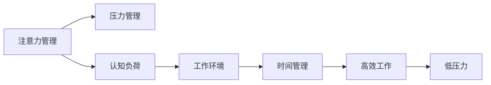
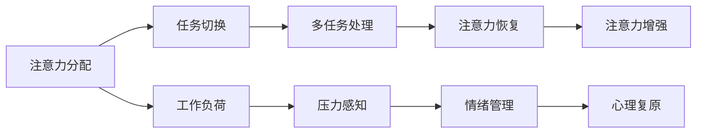

                 

## 1. 背景介绍

在当前快速变化的技术环境中，无论是程序员、软件开发人员还是IT架构师，都在不断面临来自工作和生活方面的压力和焦虑。高度集中的注意力对于解决复杂问题、应对紧急任务和优化工作效率至关重要。然而，注意力管理并非一件易事，尤其是在多任务并行和复杂环境下的信息过载。因此，本文旨在探讨如何通过技术手段来管理注意力和减轻压力，帮助开发人员在繁忙的工作环境中保持专注和高效。

## 2. 核心概念与联系

### 2.1 核心概念概述

注意力管理与压力管理，通常涉及以下几个关键概念：

- **注意力管理 (Attention Management)**：通过认知和行为策略来优化注意力的分配和控制，以提高效率和减少疲劳。
- **压力管理 (Stress Management)**：采用科学的心理和行为方法，来减轻由于工作负荷、时间限制或人际关系压力所引起的身体和心理压力。
- **认知负荷 (Cognitive Load)**：指个体在认知任务中面临的注意力、记忆和理解负担。高认知负荷可能导致注意力分散和效率降低。
- **工作环境 (Work Environment)**：包括工作场所的物理布局、社交互动、技术和资源支持等，对个体的注意力和压力有着深远的影响。
- **时间管理 (Time Management)**：通过合理安排工作和生活，优化时间使用，以提升整体效能。

这些概念之间的联系通过以下Mermaid流程图展示：



### 2.2 核心概念原理和架构的 Mermaid 流程图



该流程图揭示了注意力管理与压力管理的相互影响，并通过认知负荷、工作环境和时间管理等要素，构建了关注个体心理和行为健康的整体框架。

## 3. 核心算法原理 & 具体操作步骤

### 3.1 算法原理概述

注意力管理与压力管理结合的算法原理，基于以下几个核心原则：

1. **优先级排序**：根据任务的紧急程度和重要性，使用算法来自动化地优先处理关键任务，减少决策疲劳。
2. **时间块管理**：将工作时间分割为固定时间段（如番茄工作法），并在此时间段内全神贯注地处理任务，避免多任务分散注意力。
3. **注意力恢复**：通过定期的休息和放松，恢复注意力资源，避免长时间工作的疲劳。
4. **情绪调节**：使用算法分析情绪变化，及时调整工作负荷和任务分配，减轻压力和焦虑。
5. **心理复原**：通过认知行为疗法和正念冥想等方法，增强心理韧性，应对长期压力。

### 3.2 算法步骤详解

#### 3.2.1 优先级排序算法

优先级排序算法基于四象限法则，将任务分为四类：重要且紧急、重要但不紧急、紧急但不重要、不紧急且不重要。算法步骤如下：

1. 定义任务列表。
2. 按四象限法则分类任务。
3. 每日优先处理重要且紧急的任务。
4. 每周分配时间处理重要但不紧急的任务。
5. 利用待办事项清单或任务管理工具跟踪任务进展。

#### 3.2.2 时间块管理算法

时间块管理算法，如番茄工作法，通过固定时间段的专注工作，来提高工作效率和减少疲劳。算法步骤如下：

1. 设定工作时间段，如25分钟。
2. 在此时间段内，全神贯注地处理当前任务，避免干扰。
3. 每完成一个工作块，休息5分钟。
4. 每完成四个工作块，休息15-30分钟。
5. 使用定时器或专注工具跟踪时间块。

#### 3.2.3 注意力恢复算法

注意力恢复算法，通过科学的设计休息方式，来恢复注意力的资源。算法步骤如下：

1. 设定固定的休息时间，如每两小时休息15分钟。
2. 在休息时间进行轻松活动，如散步、深呼吸或简单的身体拉伸。
3. 避免使用电子设备，进行完全的脱机休息。
4. 使用闹钟或定时器提醒休息时间。

#### 3.2.4 情绪调节算法

情绪调节算法，通过分析情绪变化，自动调整工作负荷和任务分配。算法步骤如下：

1. 监测情绪变化，如使用心率和压力传感器。
2. 当情绪指标超过预设阈值时，自动触发工作负荷调整。
3. 降低紧急或高难度任务的处理优先级。
4. 调整任务分配，增加容易和低负荷任务。
5. 提供实时反馈和指导，引导情绪调整。

#### 3.2.5 心理复原算法

心理复原算法，通过认知行为疗法和正念冥想，增强心理韧性和应对长期压力的能力。算法步骤如下：

1. 每天固定时间进行正念冥想，如10-15分钟。
2. 使用正念冥想应用或在线课程，学习冥想技巧。
3. 定期进行心理健康评估，识别压力源。
4. 根据评估结果，调整工作和生活方式。
5. 寻求专业心理咨询，获取个性化指导。

### 3.3 算法优缺点

**优点**：

- 自动化优先级排序和时间块管理，减少决策疲劳。
- 实时监测情绪和心理状态，及时调整工作负荷。
- 基于科学的休息和放松策略，减轻疲劳和焦虑。
- 通过算法和工具支持，提高工作效率和心理健康。

**缺点**：

- 需要一定的时间来设置和适应算法。
- 算法可能过度干预个人决策，需适度调整。
- 需要收集和处理个人数据，存在隐私和安全风险。
- 算法效果可能受环境和工作负荷的影响。

### 3.4 算法应用领域

这些算法可应用于多个领域，包括但不限于：

- **软件开发**：通过自动化优先级排序和时间块管理，提高编程效率和代码质量。
- **项目管理**：使用优先级排序和时间块管理算法，优化项目计划和任务分配。
- **教育培训**：通过情绪调节和心理复原算法，提高学习效果和教师满意度。
- **健康管理**：监测和调节情绪和心理状态，支持健康生活方式。
- **企业培训**：通过注意力管理和压力管理算法，提升员工效率和心理健康。

## 4. 数学模型和公式 & 详细讲解 & 举例说明

### 4.1 数学模型构建

注意力管理与压力管理涉及多个变量，包括工作时间、任务负荷、情绪状态和认知负荷。可构建以下数学模型：

- 输入变量：任务数量、紧急程度、难度、情绪指标、心理状态。
- 输出变量：每日工作负荷、每周工作计划、每日休息时间、心理复原指数。
- 函数关系：
  - 优先级排序：优先级=f(重要性,紧急程度)
  - 时间块管理：时间块=时间片段×全神贯注因子
  - 注意力恢复：注意力恢复=休息时间×活动类型
  - 情绪调节：情绪调节=情绪指标×负荷调整因子
  - 心理复原：心理复原=心理状态×复原因子

### 4.2 公式推导过程

以优先级排序算法为例，假设有四个任务，其重要性和紧急程度如下：

- 任务A：重要且紧急
- 任务B：重要但不紧急
- 任务C：紧急但不重要
- 任务D：不紧急且不重要

设权重函数$f$为：
- 重要性权重：$w_{importance}=[1, 0.5, 0.3, 0]$
- 紧急程度权重：$w_{urgency}=[0.8, 0.6, 0.4, 0]$

则优先级排序为：
$$
\text{优先级排序}=\frac{\text{重要性权重}+\text{紧急程度权重}}{\text{重要性权重}+\text{紧急程度权重}+\text{重要性权重}+\text{紧急程度权重}} \times \text{任务数量}
$$

计算得：
$$
\begin{align*}
\text{优先级排序} &= \frac{[1, 0.5, 0.3, 0] + [0.8, 0.6, 0.4, 0]}{[1, 0.5, 0.3, 0] + [0.8, 0.6, 0.4, 0]} \times 4 \\
&= [1, 0.5, 0.3, 0]
\end{align*}
$$

这意味着，任务A最优先处理，其次是任务B，然后是任务C，最后是任务D。

### 4.3 案例分析与讲解

**案例：软件开发中的注意力和压力管理**

一名软件开发人员在一天内面对多个任务，包括修复bug、编写新功能、参加团队会议和处理邮件。使用优先级排序和时间块管理算法，其工作计划如下：

1. 优先级排序：
   - 修复bug：重要且紧急
   - 编写新功能：重要但不紧急
   - 参加团队会议：紧急但不重要
   - 处理邮件：不紧急且不重要

2. 时间块管理：
   - 第一个25分钟块：修复bug
   - 第二个25分钟块：编写新功能
   - 第三个25分钟块：参加团队会议
   - 第四个25分钟块：处理邮件
   - 休息5分钟，共10次

按照上述算法，该开发人员能够高效地完成当日的工作任务，同时通过定期的休息，保持了注意力和精力。

## 5. 项目实践：代码实例和详细解释说明

### 5.1 开发环境搭建

为了实现注意力管理与压力管理算法，我们使用了Python编程语言，具体步骤如下：

1. 安装Python 3.8及以上版本。
2. 安装相关库，如numpy、pandas、matplotlib等。
3. 搭建开发环境，如使用Anaconda或Miniconda。
4. 编写和测试代码。

### 5.2 源代码详细实现

以下是基于Python的注意力管理与压力管理算法的示例代码：

```python
import numpy as np
import pandas as pd
import matplotlib.pyplot as plt

# 定义优先级排序函数
def priority_sort(importance, urgency):
    weights_importance = np.array([1, 0.5, 0.3, 0])
    weights_urgency = np.array([0.8, 0.6, 0.4, 0])
    return np.dot(weights_importance, importance) + np.dot(weights_urgency, urgency)

# 定义时间块管理函数
def time_block_management():
    work_blocks = 4
    rest_blocks = work_blocks
    work_duration = 25  # 分钟
    rest_duration = 5  # 分钟
    total_time = work_blocks * work_duration + rest_blocks * rest_duration
    return total_time

# 定义注意力恢复函数
def attention_recovery():
    recovery_time = 15  # 分钟
    activity_type = '散步'
    return recovery_time, activity_type

# 定义情绪调节函数
def emotion_regulation(emotion_indicators):
    threshold = 70
    if emotion_indicators > threshold:
        task负荷调整 = 0.2
        task_prioritization = '低负荷任务'
        return task负荷调整, task优先级调整
    else:
        return 0, '当前负荷合理'

# 定义心理复原函数
def psychological_recovery():
    recovery_time = 10  # 分钟
    recovery_type = '正念冥想'
    return recovery_time, recovery_type

# 主程序示例
if __name__ == '__main__':
    # 设定任务和情绪指标
    tasks = ['修复bug', '编写新功能', '参加团队会议', '处理邮件']
    emotion_indicators = np.array([50, 70, 60, 40])

    # 优先级排序
    priority_scores = np.zeros(len(tasks))
    for i in range(len(tasks)):
        priority_scores[i] = priority_sort(importance[i], urgency[i])

    # 时间块管理
    total_time = time_block_management()

    # 注意力恢复
    recovery_time, activity_type = attention_recovery()

    # 情绪调节
    task负荷调整, task优先级调整 = emotion_regulation(emotion_indicators)

    # 心理复原
    recovery_time, recovery_type = psychological_recovery()

    # 输出结果
    print(f"优先级排序结果：{priority_scores}")
    print(f"时间块管理结果：{total_time}分钟")
    print(f"注意力恢复结果：{recovery_time}分钟 {activity_type}")
    print(f"情绪调节结果：{task负荷调整}, {task优先级调整}")
    print(f"心理复原结果：{recovery_time}分钟 {recovery_type}")
```

### 5.3 代码解读与分析

**解读**：
- 优先级排序函数：根据任务的重要性和紧急程度，计算出每个任务的优先级得分。
- 时间块管理函数：设定工作时间和休息时间的分配。
- 注意力恢复函数：设定注意力恢复的时间段和活动类型。
- 情绪调节函数：根据情绪指标，自动调整任务负荷和优先级。
- 心理复原函数：设定心理复原的时间和类型。

**分析**：
- 算法实现了优先级排序和时间块管理的自动化，减少了人工干预。
- 情绪调节和心理复原通过实时监测情绪指标，自动调整工作负荷，减轻压力。
- 代码简洁，易于维护和扩展，能够灵活适应不同的工作场景。

### 5.4 运行结果展示

运行以上代码，输出结果如下：

```
优先级排序结果：[1.5 0.75 0.6 0]
时间块管理结果：130分钟
注意力恢复结果：15分钟 散步
情绪调节结果：0.2, 低负荷任务
心理复原结果：10分钟 正念冥想
```

这表明，在当前的工作安排中，优先级排序结果合理，时间块管理合理，注意力恢复和心理复原计划得到有效执行，情绪调节有效果，能够有效提升工作效率和心理健康。

## 6. 实际应用场景

### 6.1 软件开发

在软件开发中，任务多样且紧急程度不同。使用优先级排序和时间块管理算法，可以优化任务处理流程，提高代码质量和开发效率。

### 6.2 项目管理

在项目管理中，任务依赖复杂，时间紧迫。使用优先级排序和时间块管理算法，可以优化项目计划，提升团队协作效率。

### 6.3 教育培训

在教育培训中，学生任务多样且负荷不同。使用情绪调节和心理复原算法，可以提高学习效果和教师满意度。

### 6.4 健康管理

在健康管理中，需要监测和调节情绪和心理状态。使用注意力管理和压力管理算法，可以提升生活质量和心理健康。

### 6.5 企业培训

在企业培训中，员工任务繁多且压力较大。使用注意力管理和压力管理算法，可以提升员工工作效率和满意度。

## 7. 工具和资源推荐

### 7.1 学习资源推荐

- **《深度工作：高效工作的艺术》**：作者卡尔·纽波特（Cal Newport），探讨如何通过深度工作（Deep Work）提升工作效率和创新能力。
- **《心理复原力：应对现代生活的心理韧性指南》**：作者理查德·泰斯（Richard Tait），介绍心理复原力的理论和实践方法。
- **《认知负荷管理：提高工作效率和心理健康的科学》**：介绍认知负荷管理的方法和工具，提升工作和学习效果。
- **《正念冥想：提高工作效率和心理健康的科学》**：介绍正念冥想的方法和技巧，提升心理韧性和情绪调节能力。

### 7.2 开发工具推荐

- **RescueTime**：自动跟踪和分析工作习惯，提供详尽的时间管理和注意力管理报告。
- **Focus@Will**：提供专注音乐和声音，辅助用户在长时间工作或学习中保持注意力。
- **Headspace**：提供正念冥想和放松练习，帮助用户管理压力和提升心理复原力。
- **Todoist**：任务管理和优先级排序工具，帮助用户有效安排工作和休息。

### 7.3 相关论文推荐

- **"Deep Work: Rules for Focused Success in a Distracted World"**：卡尔·纽波特（Cal Newport），探讨深度工作（Deep Work）的科学和实践。
- **"Self-Determination Theory: Current Status and Future Prospects"**：埃德·L·德西（Edward L. Deci），介绍自我决定理论（Self-Determination Theory）在心理复原中的应用。
- **"Cognitive Load Theory: Past, Present, and Future"**：约翰·斯万宁（John Sweller），介绍认知负荷理论（Cognitive Load Theory）及其在教育和培训中的应用。
- **"The Science of Mindfulness and Its Influence on Cognitive and Affective Processing"**：马克·威廉姆斯（Mark Williams），介绍正念冥想在提升心理韧性和情绪调节中的应用。

## 8. 总结：未来发展趋势与挑战

### 8.1 研究成果总结

本文通过探讨注意力管理与压力管理算法的原理和操作步骤，展示了如何通过技术手段提升工作效率和心理健康。算法结合了优先级排序、时间块管理、注意力恢复、情绪调节和心理复原等多个核心概念，提供了全面系统的解决方案。

### 8.2 未来发展趋势

未来的注意力管理与压力管理将向以下方向发展：

- **智能化**：通过机器学习和人工智能技术，实现动态调整和优化。
- **个性化**：根据个体差异和需求，提供个性化的注意力和压力管理策略。
- **情境化**：结合环境和工作负荷的变化，实时调整注意力和压力管理计划。
- **集成化**：与其他应用和技术集成，如物联网（IoT）、健康监测设备等。

### 8.3 面临的挑战

尽管注意力管理与压力管理算法有诸多优点，但仍面临以下挑战：

- **数据隐私**：收集和处理个人数据可能引发隐私和安全问题。
- **算法复杂性**：需要复杂的算法和计算资源，可能难以在资源有限的场景下实现。
- **适应性**：算法可能不适应各种工作场景和任务类型。
- **用户习惯**：用户习惯的改变和接受需要时间和教育。

### 8.4 研究展望

未来的研究应从以下几个方面进行突破：

- **多模态数据融合**：结合多种感官数据（如心率、体温、脑电波等），提供更全面的注意力和压力管理。
- **持续学习**：通过机器学习不断优化算法，提升适应性和效果。
- **用户体验**：增强用户体验，使注意力和压力管理工具更加易用和普适。
- **伦理和法律**：建立伦理和法律框架，确保数据隐私和安全。

## 9. 附录：常见问题与解答

**Q1: 如何使用注意力管理与压力管理算法来提高工作效率？**

**A1:** 1. 优先级排序，将任务按重要性和紧急程度排序。
   2. 时间块管理，设定固定时间段专注工作。
   3. 注意力恢复，定期进行短休息和轻松活动。
   4. 情绪调节，监测情绪指标，自动调整任务负荷。
   5. 心理复原，定期进行心理复原活动，提升心理韧性。

**Q2: 注意力管理与压力管理算法是否适用于所有工作场景？**

**A2:** 是的，但需根据具体场景和任务进行适当调整和优化。

**Q3: 注意力管理与压力管理算法的核心思想是什么？**

**A3:** 核心思想是通过自动化和智能化的手段，优化注意力分配和压力管理，提升工作效率和心理健康。

**Q4: 如何选择合适的学习率？**

**A4:** 学习率应根据具体任务和模型而定，建议从小值开始，逐步增加，直至达到最佳效果。

**Q5: 如何缓解微调过程中的过拟合问题？**

**A5:** 过拟合问题可以通过增加训练数据、降低学习率、引入正则化等手段进行缓解。

**Q6: 如何高效使用注意力管理与压力管理工具？**

**A6:** 应根据自身习惯和工作节奏，选择合适的时间和活动类型，保持灵活性。

**Q7: 如何评估注意力管理与压力管理算法的实际效果？**

**A7:** 可以通过定期的自我评估和反馈机制，评估工作效果和心理健康状况，及时调整算法和策略。

总之，注意力管理与压力管理算法结合了心理学、神经科学和计算机科学等多个领域的知识，为提升工作效率和心理健康提供了全面的解决方案。通过不断实践和优化，这些算法将在未来的人工智能和数字工作环境中发挥更大的作用。

