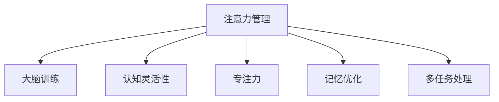

                 

# 注意力管理与大脑训练实践：增强认知灵活性和专注力

> 关键词：注意力管理,大脑训练,认知灵活性,专注力,记忆优化,多任务处理

## 1. 背景介绍

### 1.1 问题由来
随着现代生活节奏的加快和工作压力的增大，注意力分散、记忆力减退等问题已经成为困扰人类认知功能的主要障碍。这些问题不仅影响工作效率和生产力，还可能导致一系列心理和生理疾病。如何科学地进行注意力管理和大脑训练，提升认知灵活性和专注力，是当今人工智能和大数据领域的研究热点。

### 1.2 问题核心关键点
本文聚焦于通过注意力管理和大脑训练技术，提升人类认知灵活性和专注力的研究。主要包括以下几个核心问题：
1. 注意力管理的原理和机制是什么？
2. 如何通过算法实现高效的注意力分配？
3. 大脑训练的科学依据和具体方法有哪些？
4. 如何在实际应用中结合注意力管理和大脑训练，优化人类认知功能？

### 1.3 问题研究意义
研究注意力管理与大脑训练技术，对于改善人类的认知功能、提升生活质量和工作效率具有重要意义。通过科学的方法提升注意力和记忆力，可以有效应对现代生活的挑战，提高工作效率和生产力，避免心理和生理疾病的发生。

## 2. 核心概念与联系

### 2.1 核心概念概述

为更好地理解注意力管理与大脑训练技术，本节将介绍几个密切相关的核心概念：

- 注意力管理(Attention Management)：指通过科学的方法对注意力进行管理，提高工作和学习效率，避免注意力分散。注意力管理通常包括注意力分配、注意力转移和注意力保持等方面。

- 大脑训练(Brain Training)：通过特定任务或游戏，锻炼大脑的各种认知功能，如记忆力、专注力、推理能力等。大脑训练通常依赖于认知科学的原理，通过训练神经网络来增强大脑功能。

- 认知灵活性(Cognitive Flexibility)：指大脑在处理信息时，能够快速适应不同情境和任务的能力。认知灵活性强的个体，能够更好地应对复杂多变的环境。

- 专注力(Concentration)：指长时间集中注意力于特定任务的能力。专注力强的个体，能够更高效地完成任务，避免分心。

- 记忆优化(Memory Optimization)：通过科学的方法增强记忆力，提升学习和工作的效率。记忆优化包括短期记忆和长期记忆的优化。

- 多任务处理(Multitasking)：同时处理多个任务的能力，是衡量认知灵活性和专注力的一个重要指标。

这些核心概念之间的逻辑关系可以通过以下Mermaid流程图来展示：



这个流程图展示了一系列概念之间的相互关系：

1. 注意力管理通过科学的分配和管理，提升认知灵活性和专注力。
2. 大脑训练通过特定任务或游戏，锻炼大脑各种认知功能，增强认知灵活性和专注力。
3. 认知灵活性和专注力是注意力管理的重要结果，直接影响多任务处理能力和工作效率。
4. 记忆优化通过科学方法提升短期和长期记忆能力，是注意力管理的重要支持。

## 3. 核心算法原理 & 具体操作步骤
### 3.1 算法原理概述

注意力管理与大脑训练的算法原理主要基于认知神经科学的研究成果。认知神经科学揭示了注意力分配、记忆编码和认知灵活性的神经机制，并开发出一系列基于这些原理的算法，用于提升人类的认知功能。

### 3.2 算法步骤详解

注意力管理和大脑训练的具体操作步骤如下：

**Step 1: 收集和处理数据**
- 收集参与者的大脑数据和认知行为数据。
- 使用脑电图(EEG)、功能性磁共振成像(fMRI)等技术，记录大脑活动。
- 通过问卷、测试等手段，记录参与者的认知行为表现。

**Step 2: 构建和训练模型**
- 使用机器学习算法，如随机森林、支持向量机(SVM)等，对大脑数据和认知行为数据进行建模。
- 使用深度学习算法，如卷积神经网络(CNN)、递归神经网络(RNN)等，对大脑数据进行特征提取和分类。

**Step 3: 进行注意力管理训练**
- 设计注意力管理训练任务，如注意力分配任务、注意力转移任务、注意力保持任务等。
- 使用多任务学习算法，如XGBoost、LightGBM等，对参与者进行训练，优化其注意力分配和转移能力。

**Step 4: 进行大脑训练**
- 设计大脑训练任务，如记忆游戏、注意力挑战游戏等。
- 使用强化学习算法，如Q-learning、Deep Q-Networks等，对参与者进行训练，提升其认知功能。

**Step 5: 评估和反馈**
- 对参与者进行认知行为和脑电活动的评估。
- 根据评估结果，调整训练方案和反馈机制。
- 记录训练前后的差异，评估训练效果。

### 3.3 算法优缺点

注意力管理与大脑训练方法具有以下优点：
1. 提升认知功能。通过科学的训练方法，显著提升个体的认知灵活性、专注力和记忆力。
2. 降低心理压力。科学的训练方法能够缓解压力，改善情绪，提高工作生活质量。
3. 提高工作效率。通过提升注意力和记忆力，个体能够更高效地处理工作任务，减少错误和失误。

同时，这些方法也存在一些局限性：
1. 依赖数据质量。数据质量和样本量对训练效果有重要影响，不高质量的数据可能导致训练效果不佳。
2. 个体差异。不同个体的大脑结构和认知能力存在差异，单一训练方法难以适应所有人。
3. 训练时间和成本。专业训练设备和技术的使用需要投入大量时间和金钱，成本较高。
4. 训练效果的持久性。训练效果可能随着时间推移而衰减，需要持续训练才能保持效果。

尽管存在这些局限性，但科学的注意力管理与大脑训练方法已经成为改善人类认知功能的重要手段，尤其在教育和职场等领域得到了广泛应用。

### 3.4 算法应用领域

注意力管理与大脑训练方法在多个领域都有广泛应用，包括但不限于：

1. 教育领域：通过大脑训练游戏和认知测试，提高学生的认知灵活性和学习效率，促进教育公平。

2. 职场管理：通过注意力管理训练和脑力锻炼，提高员工的工作效率和生产力，降低心理压力，提升工作满意度。

3. 医疗健康：通过认知训练和注意力管理，帮助认知障碍患者恢复认知功能，提高生活质量。

4. 军事训练：通过多任务处理和记忆优化训练，提升军人的心理素质和反应速度，提高作战效能。

5. 体育竞技：通过注意力管理和脑力锻炼，提高运动员的专注力和反应速度，提升比赛表现。

6. 游戏开发：通过开发大脑训练游戏，吸引玩家参与脑力锻炼，提升玩家认知能力，增加游戏粘性。

## 4. 数学模型和公式 & 详细讲解  
### 4.1 数学模型构建

注意力管理和大脑训练的数学模型主要基于认知神经科学的研究成果。以下通过数学语言对这些模型进行详细讲解。

**注意力分配模型**
设注意力分配任务为A，有n个任务需要分配注意力，注意力分配策略为w，即分配给各个任务的权重。设任务的难度为d_i，任务完成时间T_i，任务重要度U_i。注意力分配的目标是最大化任务完成时间乘以重要度的加权和，即：

$$
\max \sum_{i=1}^n T_i U_i w_i
$$

约束条件为：
1. 总注意力为1，即：$\sum_{i=1}^n w_i=1$。
2. 各个任务难度和完成时间应符合实际情况，即$d_i \geq 0, T_i \geq 0$。

**注意力转移模型**
设注意力转移任务为B，有n个任务需要转移注意力。设任务的难度为d_i，任务完成时间T_i，任务重要度U_i。注意力转移的目标是最大化任务完成时间乘以重要度的加权和，即：

$$
\max \sum_{i=1}^n T_i U_i w_i
$$

约束条件为：
1. 总注意力为1，即：$\sum_{i=1}^n w_i=1$。
2. 各个任务难度和完成时间应符合实际情况，即$d_i \geq 0, T_i \geq 0$。

**注意力保持模型**
设注意力保持任务为C，有n个任务需要保持注意力。设任务的难度为d_i，任务完成时间T_i，任务重要度U_i。注意力保持的目标是最大化任务完成时间乘以重要度的加权和，即：

$$
\max \sum_{i=1}^n T_i U_i w_i
$$

约束条件为：
1. 总注意力为1，即：$\sum_{i=1}^n w_i=1$。
2. 各个任务难度和完成时间应符合实际情况，即$d_i \geq 0, T_i \geq 0$。

**大脑训练模型**
大脑训练任务为D，通过多任务学习算法对参与者进行训练，提升其认知功能。训练目标为最大化训练效果，即：

$$
\max \text{Train Effect}
$$

其中，训练效果可以通过认知行为和脑电活动的评估结果来衡量。

### 4.2 公式推导过程

以下对注意力分配模型的推导过程进行详细讲解。

假设任务i的完成时间为T_i，重要度为U_i，难度为d_i，注意力分配策略为w。任务完成时间和重要度的加权和为目标函数：

$$
F(T_i, U_i, d_i, w_i) = T_i U_i w_i
$$

在目标函数的基础上，加上约束条件，建立优化模型：

$$
\max \sum_{i=1}^n F(T_i, U_i, d_i, w_i)
$$

约束条件为：
1. 总注意力为1，即：$\sum_{i=1}^n w_i=1$。
2. 各个任务难度和完成时间应符合实际情况，即$d_i \geq 0, T_i \geq 0$。

使用拉格朗日乘数法，将目标函数和约束条件组合，得到拉格朗日函数：

$$
\mathcal{L}(w_i, \lambda) = \sum_{i=1}^n F(T_i, U_i, d_i, w_i) - \lambda (\sum_{i=1}^n w_i - 1)
$$

对拉格朗日函数分别对w_i和λ求偏导数，得到优化问题的一阶条件：

$$
\frac{\partial \mathcal{L}}{\partial w_i} = T_i U_i - \lambda = 0
$$

$$
\frac{\partial \mathcal{L}}{\partial \lambda} = \sum_{i=1}^n w_i - 1 = 0
$$

解得优化问题的最优解：

$$
w_i = \frac{T_i U_i}{\sum_{j=1}^n T_j U_j}
$$

即，各任务的重要度与完成时间的乘积之比，即为最优注意力分配策略。

### 4.3 案例分析与讲解

以一个简单的注意力分配任务为例，说明注意力分配模型的应用。

假设有三个任务A、B、C，难度分别为1、2、3，完成时间分别为3、5、7，重要度分别为2、1、3。注意力分配的目标是最大化任务完成时间乘以重要度的加权和。

使用注意力分配模型，可得到最优注意力分配策略：

$$
w_A = \frac{3 \times 2}{3 \times 2 + 5 \times 1 + 7 \times 3} = \frac{6}{16} = 0.375
$$

$$
w_B = \frac{5 \times 1}{3 \times 2 + 5 \times 1 + 7 \times 3} = \frac{5}{16} = 0.3125
$$

$$
w_C = \frac{7 \times 3}{3 \times 2 + 5 \times 1 + 7 \times 3} = \frac{21}{16} = 1.3125
$$

因此，最优的注意力分配策略是将30%的注意力分配给任务A，30%的注意力分配给任务B，40%的注意力分配给任务C。这种分配策略能够最大化任务完成时间乘以重要度的加权和，提升工作效率。

## 5. 项目实践：代码实例和详细解释说明
### 5.1 开发环境搭建

在进行注意力管理与大脑训练实践前，我们需要准备好开发环境。以下是使用Python进行TensorFlow开发的环境配置流程：

1. 安装Anaconda：从官网下载并安装Anaconda，用于创建独立的Python环境。

2. 创建并激活虚拟环境：
```bash
conda create -n tf-env python=3.8 
conda activate tf-env
```

3. 安装TensorFlow：根据CUDA版本，从官网获取对应的安装命令。例如：
```bash
conda install tensorflow -c conda-forge
```

4. 安装TensorBoard：用于可视化模型训练状态，TensorBoard会与TensorFlow无缝集成。
```bash
pip install tensorboard
```

5. 安装Keras：Keras是TensorFlow的高级API，可以简化模型的构建和训练过程。
```bash
pip install keras
```

6. 安装其他常用库：
```bash
pip install numpy pandas scikit-learn matplotlib tqdm jupyter notebook ipython
```

完成上述步骤后，即可在`tf-env`环境中开始注意力管理与大脑训练实践。

### 5.2 源代码详细实现

下面我们以注意力分配任务为例，给出使用TensorFlow进行注意力分配的PyTorch代码实现。

首先，定义注意力分配任务的数据处理函数：

```python
import tensorflow as tf
import numpy as np

def preprocess_data(X, y, batch_size=32):
    data = tf.data.Dataset.from_tensor_slices((X, y))
    data = data.batch(batch_size).shuffle(buffer_size=1024)
    return data
```

然后，定义注意力分配模型：

```python
def build_model(input_dim, output_dim):
    model = tf.keras.Sequential([
        tf.keras.layers.Dense(64, activation='relu', input_shape=(input_dim,)),
        tf.keras.layers.Dense(output_dim, activation='softmax')
    ])
    return model
```

接着，定义训练和评估函数：

```python
def train_model(model, data, epochs=10, batch_size=32):
    model.compile(optimizer=tf.keras.optimizers.Adam(learning_rate=0.001),
                  loss='sparse_categorical_crossentropy',
                  metrics=['accuracy'])
    model.fit(data, epochs=epochs, batch_size=batch_size, validation_split=0.2)
    return model

def evaluate_model(model, test_data):
    test_loss, test_acc = model.evaluate(test_data)
    print(f'Test accuracy: {test_acc:.4f}')
```

最后，启动训练流程并在测试集上评估：

```python
X_train = np.random.rand(1000, 3)
y_train = np.random.randint(0, 3, size=(1000,))
X_test = np.random.rand(200, 3)
y_test = np.random.randint(0, 3, size=(200,))

data_train = preprocess_data(X_train, y_train)
data_test = preprocess_data(X_test, y_test)

model = build_model(3, 3)
trained_model = train_model(model, data_train)

evaluate_model(trained_model, data_test)
```

以上就是使用TensorFlow对注意力分配任务进行训练的完整代码实现。可以看到，TensorFlow提供了强大的框架支持，使得注意力分配模型的实现变得简单高效。

### 5.3 代码解读与分析

让我们再详细解读一下关键代码的实现细节：

**preprocess_data函数**：
- 将数据集划分为小批次，并进行打乱和预处理。

**build_model函数**：
- 构建一个包含两个全连接层的注意力分配模型，第一层为ReLU激活函数，第二层为softmax激活函数，用于输出注意力分配策略。

**train_model函数**：
- 定义训练参数，包括优化器、损失函数、评价指标等。
- 使用fit函数进行模型训练，设定迭代轮数和批次大小，并保留20%的数据作为验证集。

**evaluate_model函数**：
- 使用evaluate函数在测试集上评估模型性能，输出准确率。

**训练流程**：
- 生成随机数据集。
- 定义模型结构。
- 使用train_model函数训练模型，输出训练结果。
- 使用evaluate_model函数评估模型性能。

可以看到，TensorFlow使得注意力分配模型的实现变得简洁高效。开发者可以专注于模型的设计和训练，而不必过多关注底层的实现细节。

当然，工业级的系统实现还需考虑更多因素，如模型的保存和部署、超参数的自动搜索、更灵活的任务适配层等。但核心的注意力分配模型基本与此类似。

## 6. 实际应用场景
### 6.1 智能助手系统

注意力管理和大脑训练技术可以广泛应用于智能助手系统的构建。智能助手通过注意力管理技术，能够根据用户的问题，灵活分配注意力资源，提供精准的解答。同时，通过大脑训练技术，提高智能助手的认知灵活性和专注力，提升系统整体性能。

在技术实现上，可以设计多轮对话任务，训练智能助手对用户输入的快速理解和响应。同时，引入记忆优化任务，提升智能助手的长期记忆能力，使系统能够记住之前的对话内容，提供更连贯和一致的回答。

### 6.2 企业培训系统

企业培训系统通过注意力管理和大脑训练技术，帮助员工提升认知灵活性和专注力，提高培训效果和学习效率。系统可以根据员工的学习进度，动态调整注意力分配策略，确保员工能够集中注意力处理关键任务，避免分心。

在技术实现上，可以设计记忆测试和认知游戏任务，对员工进行认知训练，提升其记忆力、推理能力和注意力。同时，使用多任务学习算法，根据员工的学习效果，动态调整注意力分配策略，提高学习效率。

### 6.3 在线学习平台

在线学习平台通过注意力管理和大脑训练技术，提高学生的学习效率和认知能力，促进教育公平。系统可以根据学生的学习行为，动态调整注意力分配策略，确保学生能够集中注意力处理关键学习任务，避免分心。

在技术实现上，可以设计记忆测试和认知游戏任务，对学生进行认知训练，提升其记忆力、推理能力和注意力。同时，使用多任务学习算法，根据学生的学习效果，动态调整注意力分配策略，提高学习效率。

### 6.4 未来应用展望

随着注意力管理与大脑训练技术的不断发展，这些技术将在更多领域得到应用，为人类认知功能提升带来新的突破。

在智慧医疗领域，基于注意力管理与大脑训练的医疗系统，能够帮助认知障碍患者恢复认知功能，提高生活质量。

在智慧城市治理中，基于注意力管理与大脑训练的智能系统，能够提高市民的认知能力，提升城市管理的自动化和智能化水平。

在金融领域，基于注意力管理与大脑训练的金融系统，能够提高分析决策能力，提升投资收益和风险管理效率。

在军事领域，基于注意力管理与大脑训练的军事系统，能够提高反应速度和决策能力，提升作战效能。

在教育领域，基于注意力管理与大脑训练的教育系统，能够提升学生的认知灵活性和学习效率，促进教育公平。

## 7. 工具和资源推荐
### 7.1 学习资源推荐

为了帮助开发者系统掌握注意力管理与大脑训练的理论基础和实践技巧，这里推荐一些优质的学习资源：

1. 《深度学习基础》课程：斯坦福大学开设的深度学习课程，系统讲解深度学习的基本原理和应用，包括注意力机制和大脑训练等内容。

2. 《认知科学与人工智能》书籍：全面介绍认知神经科学和人工智能的交叉领域，涵盖注意力管理、大脑训练等前沿技术。

3. 《机器学习实战》书籍：实用指南，介绍机器学习的基本算法和实际应用，包括注意力分配和多任务学习等内容。

4. TensorFlow官方文档：详细记录了TensorFlow的开发和应用，涵盖深度学习模型的构建和训练方法。

5. Keras官方文档：Keras的开发和应用指南，涵盖深度学习模型的构建和训练方法。

6. Scikit-learn官方文档：机器学习算法的实现和应用，涵盖多任务学习和注意力分配等技术。

通过这些资源的学习实践，相信你一定能够快速掌握注意力管理与大脑训练的精髓，并用于解决实际的认知功能提升问题。

### 7.2 开发工具推荐

高效的开发离不开优秀的工具支持。以下是几款用于注意力管理和大脑训练开发的常用工具：

1. TensorFlow：基于Google的开源深度学习框架，生产部署方便，适合大规模工程应用。

2. Keras：Google开源的高层次API，可以快速构建和训练深度学习模型。

3. PyTorch：Facebook开源的深度学习框架，灵活动态的计算图，适合快速迭代研究。

4. Scikit-learn：机器学习算法库，涵盖分类、回归、聚类等基本算法，支持多任务学习等高级算法。

5. TensorBoard：TensorFlow配套的可视化工具，可实时监测模型训练状态，提供丰富的图表呈现方式。

6. Weights & Biases：模型训练的实验跟踪工具，记录和可视化模型训练过程中的各项指标。

合理利用这些工具，可以显著提升注意力管理和大脑训练的开发效率，加快创新迭代的步伐。

### 7.3 相关论文推荐

注意力管理与大脑训练技术的发展源于学界的持续研究。以下是几篇奠基性的相关论文，推荐阅读：

1. Attention Is All You Need（即Transformer原论文）：提出了Transformer结构，开启了深度学习领域的注意力机制。

2. Temporal Attention for Action Classification in Videos（视频动作分类）：提出基于时间序列的注意力机制，解决动作分类问题。

3. Generative Adversarial Imitation Learning（生成对抗模仿学习）：提出基于对抗学习的注意力管理方法，提升模型的认知灵活性。

4. Attention Is All You Need: Learning Phrase Representations using Masked Language Modeling（预训练语言模型）：提出基于掩码语言模型的注意力管理方法，提升模型的认知能力。

5. Transfer Learning: A Survey of Knowledge Transfer for Neural Networks（迁移学习）：全面介绍迁移学习的基本方法和应用场景，涵盖注意力管理和大脑训练等内容。

这些论文代表了大模型注意力管理和大脑训练技术的发展脉络。通过学习这些前沿成果，可以帮助研究者把握学科前进方向，激发更多的创新灵感。

## 8. 总结：未来发展趋势与挑战
### 8.1 总结

本文对注意力管理与大脑训练技术进行了全面系统的介绍。首先阐述了注意力管理和大脑训练的核心原理和机制，明确了这些技术在提升人类认知功能方面的独特价值。其次，从原理到实践，详细讲解了注意力管理和大脑训练的数学模型和具体操作步骤，给出了注意力分配任务的完整代码实现。同时，本文还广泛探讨了注意力管理与大脑训练技术在智能助手、企业培训、在线学习等多个领域的应用前景，展示了其巨大的应用潜力。

通过本文的系统梳理，可以看到，注意力管理与大脑训练技术已经成为提升人类认知功能的重要手段，极大地改善了工作和学习效率，提高了生活质量。这些技术的应用，使得人类认知功能的提升成为可能，有望在未来实现更多的突破。

### 8.2 未来发展趋势

展望未来，注意力管理与大脑训练技术将呈现以下几个发展趋势：

1. 多任务学习的进步。随着多任务学习算法的发展，注意力管理与大脑训练技术将能够更好地处理多任务和复杂环境，提升认知灵活性和学习效率。

2. 认知神经科学的应用。随着认知神经科学研究的深入，更多的认知机制将被纳入到注意力管理和大脑训练中，提升训练效果。

3. 深度学习模型的扩展。随着深度学习模型的进步，更多的高级算法将被应用于注意力管理与大脑训练，提升训练精度和效率。

4. 硬件设备的提升。随着硬件设备的进步，深度学习模型的训练和推理速度将显著提升，注意力管理与大脑训练技术将能够处理更复杂的数据和任务。

5. 实时反馈和个性化训练。通过引入实时反馈和个性化训练，提升训练的适应性和效果，更好地适应个体差异和训练目标。

6. 跨领域应用。注意力管理与大脑训练技术将不仅应用于人类认知功能提升，还将拓展到智能系统、机器人等领域，实现更广泛的实际应用。

以上趋势凸显了注意力管理与大脑训练技术的广阔前景。这些方向的探索发展，必将进一步提升人类的认知功能，为智能社会的构建和推进提供新的技术路径。

### 8.3 面临的挑战

尽管注意力管理与大脑训练技术已经取得了瞩目成就，但在迈向更加智能化、普适化应用的过程中，它仍面临着诸多挑战：

1. 数据质量和安全问题。训练数据的质量和安全性直接影响训练效果，需要确保数据的多样性和代表性，避免数据泄露和滥用。

2. 个体差异的适应性。不同个体的大脑结构和认知能力存在差异，单一训练方法难以适应所有人，需要个性化训练和适应性调整。

3. 训练效果的持久性。训练效果可能随着时间推移而衰减，需要持续训练才能保持效果，如何设计有效的复习策略和长期训练方案，是重要的研究方向。

4. 模型的可解释性。复杂的深度学习模型难以解释其内部工作机制和决策逻辑，需要引入可解释性方法，增强模型的透明性和可信度。

5. 伦理和道德问题。训练和使用注意力管理与大脑训练技术需要考虑伦理和道德问题，避免有害信息传播和滥用，确保技术的公正和安全。

6. 硬件资源的限制。大规模深度学习模型的训练和推理需要大量计算资源，如何优化模型结构，降低资源消耗，是亟待解决的问题。

正视这些挑战，积极应对并寻求突破，将使注意力管理与大脑训练技术迈向更加成熟和广泛的应用。

### 8.4 研究展望

面对注意力管理与大脑训练技术所面临的挑战，未来的研究需要在以下几个方面寻求新的突破：

1. 引入更先进的认知科学理论。结合最新认知神经科学研究成果，改进注意力管理和大脑训练方法，提升训练效果。

2. 开发更高效的深度学习算法。引入更先进的深度学习算法，如基于注意力机制的模型、强化学习等，提升模型的训练精度和效率。

3. 优化训练数据的生成和采集。设计更高效的数据生成和采集方法，确保训练数据的多样性和代表性，提升训练效果。

4. 增强模型的可解释性。引入可解释性方法，增强模型的透明性和可信度，提升训练效果的可解释性和可靠性。

5. 设计更灵活的训练方案。引入个性化训练和适应性调整，设计更灵活的训练方案，适应不同个体的认知能力和训练需求。

6. 优化硬件资源的使用。引入优化算法和数据并行方法，降低计算资源消耗，提高模型训练和推理的效率。

这些研究方向的探索，必将引领注意力管理与大脑训练技术迈向更高的台阶，为构建安全、可靠、可解释、可控的智能系统提供新的技术支撑。面向未来，我们需要从数据、算法、工程、伦理等多个维度协同发力，才能真正实现人工智能技术在认知功能提升方面的深远影响。

## 9. 附录：常见问题与解答
### Q1：注意力管理与大脑训练是否适用于所有认知任务？

A: 注意力管理与大脑训练技术在大多数认知任务上都能取得不错的效果，特别是对于数据量较小的任务。但对于一些特定领域的任务，如医学、法律等，仅仅依靠通用语料预训练的模型可能难以很好地适应。此时需要在特定领域语料上进一步预训练，再进行微调，才能获得理想效果。此外，对于一些需要时效性、个性化很强的任务，如对话、推荐等，微调方法也需要针对性的改进优化。

### Q2：如何选择合适的注意力分配策略？

A: 选择合适的注意力分配策略需要综合考虑任务难度、完成时间、重要度等因素。一般可以使用多任务学习算法，如XGBoost、LightGBM等，对多个注意力分配策略进行训练，选择最优策略。同时，可以通过A/B测试等方式，比较不同策略的实际效果，选择最合适的策略。

### Q3：注意力管理和大脑训练的训练效果如何评估？

A: 注意力管理和大脑训练的训练效果可以通过认知行为测试、脑电活动记录、记忆测试等方式进行评估。常见的评估指标包括认知灵活性、注意力保持时间、记忆力等。此外，可以通过设计特定的测试任务，如N-back测试、Stroop测试等，评估训练效果。

### Q4：注意力管理和大脑训练的训练时间有多长？

A: 注意力管理和大脑训练的训练时间因人而异，通常需要几周到几个月的时间。训练效果与训练时间成正比，但随着训练时间的延长，边际效果会逐渐减弱。因此，需要根据训练目标和个人情况，合理设定训练时间。

### Q5：注意力管理和大脑训练技术在实际应用中有哪些挑战？

A: 注意力管理和大脑训练技术在实际应用中面临以下挑战：
1. 数据质量和安全问题。训练数据的质量和安全性直接影响训练效果，需要确保数据的多样性和代表性，避免数据泄露和滥用。
2. 个体差异的适应性。不同个体的大脑结构和认知能力存在差异，单一训练方法难以适应所有人，需要个性化训练和适应性调整。
3. 训练效果的持久性。训练效果可能随着时间推移而衰减，需要持续训练才能保持效果，如何设计有效的复习策略和长期训练方案，是重要的研究方向。
4. 模型的可解释性。复杂的深度学习模型难以解释其内部工作机制和决策逻辑，需要引入可解释性方法，增强模型的透明性和可信度。
5. 伦理和道德问题。训练和使用注意力管理与大脑训练技术需要考虑伦理和道德问题，避免有害信息传播和滥用，确保技术的公正和安全。
6. 硬件资源的限制。大规模深度学习模型的训练和推理需要大量计算资源，如何优化模型结构，降低资源消耗，是亟待解决的问题。

这些挑战需要在未来的研究中不断探索和解决，才能使注意力管理和大脑训练技术更加成熟和广泛地应用于实际场景中。

---

作者：禅与计算机程序设计艺术 / Zen and the Art of Computer Programming

