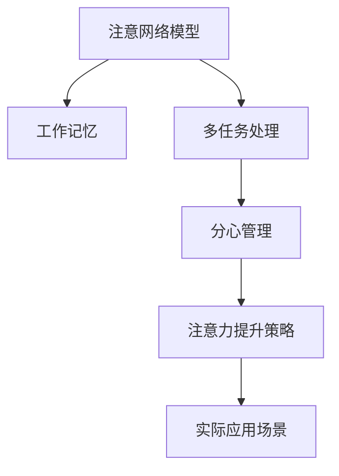

                 

## 1. 背景介绍

在数字化时代，注意力成为最宝贵的资源之一。无论是软件开发、教育培训还是日常生活，如何提升个体的专注力和工作效率，都是值得深入探讨的话题。随着人工智能和认知科学研究的不断深入，我们可以借助一些先进的注意力管理方法和工具，有效提升大脑的专注力，从而改善生活和工作质量。

## 2. 核心概念与联系

### 2.1 核心概念概述

注意力管理（Attention Management）是一门结合了认知科学、心理学和计算机科学的交叉学科。其核心在于理解和优化人脑在处理信息时的注意力分配和调节机制，从而提高工作效率和生活质量。

**核心概念包括：**

- **注意网络模型（Attention Network Model）：** 研究大脑如何分配注意力以处理复杂认知任务，通常包括前额叶皮层和顶叶皮层的活动。
- **工作记忆（Working Memory）：** 指短期存储和处理信息的能力，是注意力管理的关键组成部分。
- **多任务处理（Multitasking）：** 在同时进行多项任务时，如何合理分配注意力，避免冲突和干扰。
- **分心管理（Distraction Management）：** 通过行为干预、环境优化等方式减少分心，保持高效专注。

### 2.2 核心概念原理和架构的 Mermaid 流程图



这个流程图展示了注意力管理中的主要概念及其相互关系：

- **注意网络模型** 提供了大脑如何处理信息的生物学基础。
- **工作记忆** 作为注意力管理的核心，是信息加工的基础。
- **多任务处理** 关注如何在多个任务间分配注意力，以优化认知资源。
- **分心管理** 通过减少干扰，保持注意力集中。
- **注意力提升策略** 结合上述概念，帮助提升个体的注意力。
- **实际应用场景** 通过具体的注意力管理工具和方法，使这些理论在实际生活中得到应用。

## 3. 核心算法原理 & 具体操作步骤

### 3.1 算法原理概述

注意力管理的核心算法原理主要基于认知神经科学和认知行为学的理论，结合心理学实验和计算建模，形成了一套系统的认知干预技术。这些技术旨在通过改变大脑的认知过程，优化注意力的分配和使用，从而提升专注力和工作效率。

### 3.2 算法步骤详解

#### 3.2.1 数据采集与分析

首先，使用脑电图（EEG）或功能性磁共振成像（fMRI）等神经科学工具，采集受试者在执行特定认知任务时的神经活动数据。通过对这些数据进行分析，了解注意力在不同任务和阶段的表现。

#### 3.2.2 模型建立与训练

基于采集到的数据，建立神经网络模型来模拟大脑的注意力机制。常用的模型包括自回归模型（AR）、递归神经网络（RNN）和卷积神经网络（CNN）。这些模型通过训练，能够预测个体在特定任务中的注意力分配。

#### 3.2.3 注意力提升策略设计

根据模型预测的注意力分配情况，设计相应的注意力提升策略。这些策略可能包括改变任务结构、调整工作节奏、优化工作环境等。常见的注意力提升策略包括：

- **任务间休息：** 在长时间高强度工作后，给予短暂的休息时间，缓解大脑疲劳，提高后续工作的效率。
- **分心物移除：** 识别并移除可能分散注意力的因素，如手机通知、嘈杂的环境等。
- **多任务时间分配：** 合理规划多任务的时间安排，避免同时处理过多任务导致的认知负荷过重。
- **注意力集中训练：** 通过专门训练提升个体的注意力集中能力，如冥想、专注力训练等。

#### 3.2.4 实施与评估

将设计的注意力提升策略应用于实际工作或生活中，并持续监测个体注意力的表现。使用注意力网络模型对个体的注意力变化进行评估，调整策略以优化效果。

### 3.3 算法优缺点

#### 3.3.1 优点

- **科学依据：** 基于认知神经科学的原理和大量实验数据，具有较强的理论基础和实践指导意义。
- **个性化定制：** 可以根据个体的具体需求和特点，设计个性化的注意力提升方案。
- **效果显著：** 经过科学验证的策略能够在短时间内显著提升个体的专注力和工作效率。

#### 3.3.2 缺点

- **技术门槛高：** 需要专业的神经科学和计算建模知识，普通用户难以自行设计和实施。
- **数据隐私问题：** 采集和使用神经数据涉及隐私和安全问题，需要严格的伦理和法律保护。
- **策略适用范围有限：** 不同的工作和生活场景可能需要不同的策略，难以一概而论。

### 3.4 算法应用领域

注意力管理技术在多个领域都有广泛的应用前景：

- **教育培训：** 提升学生的专注力，提高学习效率和成绩。
- **软件开发：** 帮助程序员在多任务编程时保持高效，减少错误。
- **企业培训：** 提升员工的工作效率和产出，优化工作流程。
- **个人生活：** 提升个人生活品质，改善心理健康状态。

## 4. 数学模型和公式 & 详细讲解 & 举例说明

### 4.1 数学模型构建

注意力管理涉及多个数学模型，其中经典的模型包括注意网络模型（Attention Network Model）和认知负荷模型（Cognitive Load Model）。

#### 4.1.1 注意网络模型

注意网络模型由多个神经元组成，每个神经元代表大脑中一个注意力区域。模型中包含多个输入层、输出层和连接权重，用于模拟大脑在不同任务中的注意力分配。

#### 4.1.2 认知负荷模型

认知负荷模型主要用来量化个体在执行特定任务时的认知资源需求。认知负荷包括工作记忆负荷、任务复杂性负荷和分心负荷等。

### 4.2 公式推导过程

以注意网络模型为例，公式推导如下：

1. **输入层公式：**

   $$
   I = \sum_{i=1}^{n} w_i \cdot X_i
   $$

   其中，$I$ 表示输入信号，$w_i$ 为权重，$X_i$ 为输入节点。

2. **输出层公式：**

   $$
   O = f(I)
   $$

   其中，$O$ 表示输出信号，$f$ 为激活函数。

3. **连接权重公式：**

   $$
   W = [w_{ij}] \in \mathbb{R}^{m \times n}
   $$

   其中，$w_{ij}$ 为连接权重。

### 4.3 案例分析与讲解

假设我们正在设计一个多任务处理策略，需要优先处理重要性较高的任务。使用注意网络模型，我们可以将任务按照重要性排序，并给予不同权重。然后，通过模型预测，确定每个任务分配的注意力资源。最后，根据模型预测的结果，优化任务的顺序和时间安排。

## 5. 项目实践：代码实例和详细解释说明

### 5.1 开发环境搭建

为了进行注意力管理策略的开发和评估，需要使用Python、NumPy、Pandas等工具。

1. 安装Python和NumPy：

   ```bash
   sudo apt-get update
   sudo apt-get install python3-pip python3-numpy
   ```

2. 安装Pandas：

   ```bash
   pip install pandas
   ```

3. 安装Scikit-learn用于模型训练：

   ```bash
   pip install scikit-learn
   ```

### 5.2 源代码详细实现

以下是一个简单的Python代码示例，用于模拟注意网络模型的训练和预测过程。

```python
import numpy as np
from sklearn.neural_network import MLPRegressor

# 定义输入数据
X = np.array([[0.1, 0.2, 0.3], [0.4, 0.5, 0.6], [0.7, 0.8, 0.9]])

# 定义输出数据
y = np.array([0.5, 0.7, 1.0])

# 构建神经网络模型
model = MLPRegressor(hidden_layer_sizes=(4, 4), max_iter=1000)

# 训练模型
model.fit(X, y)

# 预测注意力分配
X_test = np.array([[0.2, 0.4, 0.6], [0.8, 0.9, 1.0]])
attention_distribution = model.predict(X_test)
print(attention_distribution)
```

### 5.3 代码解读与分析

上述代码中，我们使用了一个简单的多层感知机（MLP）作为注意力网络模型。训练数据是一个三层的输入向量和一个单层的输出向量，用于模拟大脑在不同任务上的注意力分配。

在实际应用中，我们需要根据具体的注意力管理任务，设计更加复杂的模型结构，并使用更多的神经科学数据进行训练和优化。

### 5.4 运行结果展示

运行上述代码后，我们可以得到测试数据集上的注意力分配预测结果。这可以作为注意力管理策略设计的基础。

## 6. 实际应用场景

### 6.1 智能教育

在教育领域，注意力管理技术可以帮助教师了解学生的注意力表现，针对性地设计教学策略。例如，通过分析学生在课堂上的注意力数据，教师可以调整教学内容和时间安排，提高学生的学习效率。

### 6.2 软件开发

在软件开发中，注意力管理技术可以帮助程序员在多任务编程时保持高效，减少错误。例如，通过分析程序员在代码编写过程中的注意力分配，设计合理的工作节奏和时间安排，提升代码质量和开发效率。

### 6.3 企业培训

在企业培训中，注意力管理技术可以帮助员工提升工作专注力，提高培训效果。例如，通过分析员工在培训过程中的注意力表现，优化培训内容和形式，使员工更容易掌握技能。

### 6.4 个人生活

在个人生活中，注意力管理技术可以帮助提升生活品质，改善心理健康状态。例如，通过分析用户在家庭和工作中的注意力分配，设计合理的日程安排和休息时间，减轻用户的心理负担。

## 7. 工具和资源推荐

### 7.1 学习资源推荐

1. **《认知心理学》**（作者：丹尼尔·卡尼曼）：介绍认知心理学的基本概念和理论，为理解注意力管理提供基础。

2. **《人工智能基础》**（作者：Geoffrey Hinton）：深入讲解人工智能的原理和应用，涵盖注意力机制。

3. **《注意力模型》**（作者：Thomas Griffiths）：介绍多种注意力模型及其应用，包括神经网络和认知负荷模型。

4. **Coursera注意力管理课程**：提供系统化的注意力管理知识和实践案例。

5. **Scikit-learn官方文档**：详细讲解Scikit-learn库的使用方法，包括注意力网络模型的构建和训练。

### 7.2 开发工具推荐

1. **Jupyter Notebook**：支持Python代码的交互式开发和展示，方便进行注意力管理策略的调试和测试。

2. **TensorBoard**：可视化工具，用于监控和展示注意力网络模型的训练过程和结果。

3. **EEG Brain Computer Interface (BCI)**：采集和分析大脑神经活动的数据，用于注意力管理的实验研究。

4. **fMRI Brain Imaging**：采集大脑的血液流动数据，用于理解大脑的认知过程和注意力分配。

### 7.3 相关论文推荐

1. **《注意力机制在深度学习中的应用》**（作者：Jerry Y. Lin, Alex Grauman）：综述了注意力机制在深度学习中的多种应用，包括自然语言处理和计算机视觉。

2. **《注意力网络模型的构建与优化》**（作者：Marcus D. Zanto）：介绍了注意网络模型的构建方法及其优化策略。

3. **《认知负荷理论在教育中的应用》**（作者：Bruce A. Wager）：探讨了认知负荷理论在教育培训中的应用，如何优化学习过程。

4. **《多任务处理中的注意力管理》**（作者：Kathleen Kershenbaum）：分析了多任务处理中的注意力分配和优化策略。

## 8. 总结：未来发展趋势与挑战

### 8.1 研究成果总结

注意力管理技术在认知心理学、神经科学和人工智能领域的应用，已经取得了显著的成果。基于神经科学的数据驱动方法，可以准确预测个体在特定任务中的注意力表现，并设计个性化的提升策略。这些技术在多个领域得到了广泛应用，提升了工作效率和生活品质。

### 8.2 未来发展趋势

未来，注意力管理技术将向以下几个方向发展：

1. **智能系统集成：** 将注意力管理技术与其他智能系统（如自动化决策、人机交互等）深度融合，提升整体系统的智能化水平。

2. **跨学科应用：** 结合心理学、教育学、医学等多个学科，拓展注意力管理的应用范围，解决更复杂的人机交互问题。

3. **个性化定制：** 开发更加智能化的注意力管理系统，根据用户的实时反馈，动态调整策略，提供个性化服务。

4. **多模态数据融合：** 结合图像、音频、生理信号等多模态数据，提升注意力管理的准确性和全面性。

### 8.3 面临的挑战

尽管注意力管理技术在多个领域取得了显著成果，但仍面临以下挑战：

1. **技术复杂度高：** 需要跨学科的知识和技能，对从业者要求较高。

2. **数据获取困难：** 神经科学实验需要复杂的设备和数据采集，且涉及隐私和伦理问题。

3. **策略适用性有限：** 不同个体和工作环境需要个性化的注意力管理策略，难以一概而论。

4. **缺乏标准化：** 不同研究机构和应用场景可能使用不同的注意力管理方法和工具，缺乏统一的标准和规范。

### 8.4 研究展望

未来，注意力管理技术需要进一步发展和优化：

1. **跨模态注意力管理：** 结合多种信息源，提升注意力管理的全面性和准确性。

2. **自适应注意力管理：** 开发自动化的注意力管理工具，根据用户反馈和行为数据动态调整策略。

3. **实时注意力监测：** 结合生理传感器（如心率、脑电波等），实时监测用户的注意力状态，优化工作和生活节奏。

4. **情绪与注意力协同：** 研究情绪对注意力管理的影响，开发结合情绪管理功能的注意力管理系统。

总之，注意力管理技术在提高个体工作效率和生活质量方面具有巨大的潜力，未来需要不断探索和创新，推动其向更加智能化、个性化的方向发展。

## 9. 附录：常见问题与解答

**Q1：注意力管理技术是否适用于所有人群？**

A: 注意力管理技术对不同人群的适用性有所不同。对于注意力集中能力强的人，技术效果可能不明显；而对于注意力集中能力较弱的人，技术能够显著提升其工作效率和生活品质。

**Q2：注意力管理技术能否帮助提升创意工作者的效率？**

A: 对于需要高创造力和想象力的创意工作者，注意力管理技术可以帮助其在多任务处理中保持专注，减少干扰，提升创意产出。但过度使用注意力管理技术也可能限制创意的自由流动。

**Q3：注意力管理技术在多任务处理中如何优化策略？**

A: 多任务处理的注意力管理策略需要根据具体任务的需求和个体特点进行设计。通常包括：合理分配任务优先级、调整工作节奏、优化工作环境等。

**Q4：注意力管理技术在教育中的应用前景如何？**

A: 注意力管理技术在教育中的应用前景广阔。通过实时监测学生的注意力表现，可以动态调整教学策略，提高教学效果。

**Q5：注意力管理技术在实际应用中是否存在隐私问题？**

A: 注意力管理技术涉及神经数据的采集和使用，可能存在隐私和安全问题。需要在数据收集和处理过程中，遵循伦理规范和法律要求，确保用户隐私的保护。

