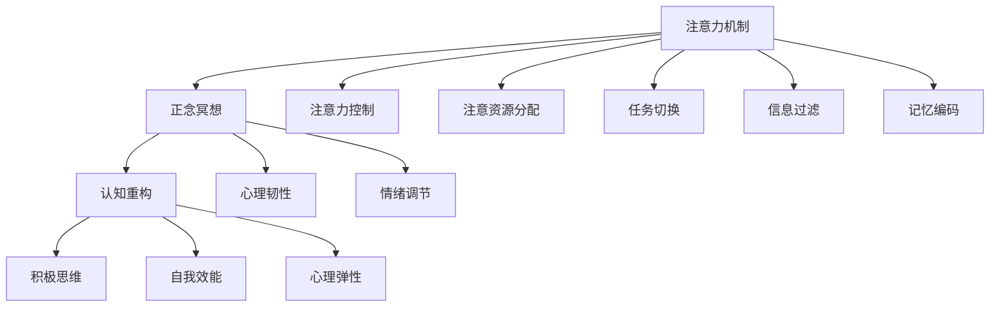

                 

# 注意力管理与正念：如何在当下增强专注力

> 关键词：注意力管理,正念,专注力提升,心理减压,认知训练

## 1. 背景介绍

### 1.1 问题由来
在信息爆炸的时代，如何在海量信息中保持专注力和高效工作，成为许多人的痛点。快节奏的生活和工作环境，让很多人陷入了焦虑、注意力分散等心理压力之中。如何管理好注意力，提升专注力和心理韧性，已成为当代人的重要课题。

近年来，随着人工智能和大数据技术的发展，心理科学和认知神经科学的研究也日益深入。其中，注意力管理与正念的概念越来越受到重视。正念（Mindfulness）指的是对当前时刻的全然觉察和接纳，而注意力管理则是在此基础上，通过各种训练和工具，提升个体对注意力的控制和调节能力。本文将围绕注意力管理和正念，探讨如何通过科技手段和心理学方法，增强人们的专注力和心理减压能力。

### 1.2 问题核心关键点
注意力管理和正念方法的核心关键点包括：
- **全然觉察**：对当前时刻的全面、无评判的觉察。
- **非反应性**：对当前时刻的接受，不进行过多的反应和判断。
- **注意力调节**：通过训练和工具，提升对注意力的控制能力。
- **正念冥想**：通过特定的冥想练习，增强心理韧性和专注力。
- **认知重构**：通过重新构建思维模式，提升自我管理能力。

这些关键点构成了注意力管理和正念的基础，并可通过多种科技手段进行实现。接下来，本文将从这些关键点出发，深入探讨其背后的原理和应用。

## 2. 核心概念与联系

### 2.1 核心概念概述

注意力管理和正念方法涉及多个核心概念，包括注意力机制、正念冥想、认知重构等。这些概念通过心理科学和认知神经科学的研究，被证明能够显著提升个体的专注力和心理韧性。

- **注意力机制**：指个体在处理信息时，选择和聚焦于某些重要信息，同时抑制无关信息的干扰。
- **正念冥想**：通过特定的冥想练习，提升个体对当前时刻的觉察和接纳，减少对情绪和思维的过度反应。
- **认知重构**：通过重新构建思维模式，提升个体对自身和外界环境的积极认知。

这些概念之间的关系可以通过以下Mermaid流程图来展示：



这个流程图展示了注意力管理和正念方法的几个关键过程和目标：

1. 注意力机制通过控制注意资源分配、任务切换、信息过滤等过程，帮助个体聚焦重要信息，抑制干扰。
2. 正念冥想通过心理韧性和情绪调节，提升个体对当前时刻的觉察和接纳，减少心理压力。
3. 认知重构通过积极思维和自我效能，帮助个体重新构建思维模式，提升自我管理能力。

通过这些关键概念的协同作用，个体能够在信息爆炸的环境中，保持高效和心理稳定。

## 3. 核心算法原理 & 具体操作步骤
### 3.1 算法原理概述

注意力管理和正念方法的核心原理是通过科技手段，对个体注意力进行训练和调节，提升其对当前时刻的觉察和接纳能力。其核心算法包括：

- **注意力控制**：通过特定算法，帮助个体对注意力的分布和调节进行控制，从而提高工作效率和专注力。
- **正念冥想**：通过算法设计，引导个体进行正念冥想练习，增强心理韧性和情绪调节能力。
- **认知重构**：通过算法优化，帮助个体重新构建思维模式，提升自我管理和心理弹性。

这些算法原理的实现，通常依赖于心理科学和认知神经科学的最新研究成果。以下将详细探讨这些核心算法及其具体操作步骤。

### 3.2 算法步骤详解

#### 3.2.1 注意力控制算法
注意力控制算法主要通过以下步骤实现：

1. **数据采集**：使用脑电图(EEG)、眼动追踪等工具，实时采集个体注意力相关的生理数据。
2. **数据处理**：对采集的数据进行预处理，包括滤波、去噪、标准化等。
3. **特征提取**：使用特征提取算法，从处理后的数据中提取出与注意力相关的关键特征。
4. **模型训练**：使用机器学习模型，对提取的特征进行训练，学习个体注意力的分布和调节模式。
5. **实时反馈**：根据训练得到的模型，实时反馈个体当前注意力的状态，并提供调整建议。

#### 3.2.2 正念冥想算法
正念冥想算法主要通过以下步骤实现：

1. **引导词设计**：设计正念冥想的引导词，帮助个体专注于当前时刻。
2. **冥想音频生成**：根据引导词，生成相应的冥想音频，引导个体进行冥想练习。
3. **生理数据采集**：使用生理传感器，采集个体冥想时的生理数据，如心率、呼吸等。
4. **数据分析**：对采集的数据进行分析，评估个体的冥想状态和效果。
5. **结果反馈**：根据分析结果，提供个性化的冥想建议，帮助个体逐步提升正念水平。

#### 3.2.3 认知重构算法
认知重构算法主要通过以下步骤实现：

1. **情绪识别**：使用情绪识别算法，实时监测个体情绪状态。
2. **情绪分析**：对监测到的情绪进行分析和评估，识别出不良情绪和思维模式。
3. **认知重构**：根据情绪分析结果，设计相应的认知重构策略，帮助个体重新构建积极思维模式。
4. **行为干预**：通过行为干预工具，帮助个体实施认知重构策略，提升自我管理能力。
5. **效果评估**：定期评估个体的认知重构效果，调整干预策略，确保持续改进。

### 3.3 算法优缺点

#### 3.3.1 注意力控制算法
**优点**：
- **实时反馈**：能够实时监测和调整个体注意力状态，提高工作效率。
- **个性化定制**：根据个体差异，提供个性化的注意力调节建议。

**缺点**：
- **隐私问题**：生理数据的采集和处理可能涉及隐私问题，需要严格保护。
- **算法复杂性**：需要复杂的算法模型和硬件设备支持，实施成本较高。

#### 3.3.2 正念冥想算法
**优点**：
- **简单易行**：无需复杂的设备和算法，通过音频引导即可实现。
- **广泛适用**：适合不同人群，能够广泛应用。

**缺点**：
- **效果依赖**：正念冥想的效果依赖于个体的持续练习和坚持，效果可能因人而异。
- **环境干扰**：在嘈杂或高压力环境中，冥想效果可能受到影响。

#### 3.3.3 认知重构算法
**优点**：
- **即时效果**：通过情绪识别和重构策略，能够即时调整个体的情绪和思维模式。
- **长期效益**：通过持续的认知重构，能够逐步提升个体的自我管理和心理弹性。

**缺点**：
- **依赖数据**：需要实时采集情绪数据，实施过程中可能存在数据泄露的风险。
- **技术门槛**：需要一定的技术支持，实施和维护成本较高。

### 3.4 算法应用领域

注意力管理和正念方法在多个领域得到了广泛应用，包括但不限于：

- **教育**：通过注意力控制和正念冥想，帮助学生提升学习效率和心理韧性。
- **企业**：通过认知重构和注意力控制，帮助员工提升工作表现和心理健康。
- **医疗**：通过正念冥想和情绪识别，帮助患者管理焦虑和压力，提升治疗效果。
- **个人健康**：通过自我管理和认知重构，帮助个体提升生活质量和幸福感。

这些应用领域展示了注意力管理和正念方法的广泛适用性和深远影响，为个体提供了多种提升专注力和心理韧性的途径。

## 4. 数学模型和公式 & 详细讲解 & 举例说明（备注：数学公式请使用latex格式，latex嵌入文中独立段落使用 $$，段落内使用 $)
### 4.1 数学模型构建

在注意力管理和正念方法的实现中，数学模型和公式起到了关键作用。以下以注意力控制算法为例，介绍其数学模型构建过程。

假设个体注意力状态由 $X_t = [X_{t1}, X_{t2}, ..., X_{tk}]$ 表示，其中 $X_{tk}$ 表示在时间 $t$ 时，个体对第 $k$ 个任务的注意力分配。令 $y_t = [y_{t1}, y_{t2}, ..., y_{tk}]$ 表示个体在时间 $t$ 时，实际完成任务的状态。则注意力控制的目标函数可以表示为：

$$
\min_{\theta} \frac{1}{N} \sum_{i=1}^N \sum_{t=1}^T \mathcal{L}(X_t, y_t; \theta)
$$

其中 $\mathcal{L}$ 表示注意力分配与任务完成的损失函数，$N$ 表示样本数量，$T$ 表示时间步长。

注意力控制算法的优化过程可以表示为：

1. **数据集准备**：准备训练数据集 $D = \{(X_{ti}, y_{ti})\}_{i=1}^N$。
2. **模型初始化**：初始化注意力分配模型 $f_{\theta}(X_t) = [f_{\theta1}(X_t), f_{\theta2}(X_t), ..., f_{\theta k}(X_t)]$。
3. **模型训练**：使用梯度下降等优化算法，最小化损失函数 $\mathcal{L}$，更新模型参数 $\theta$。
4. **实时反馈**：根据当前注意力分配状态 $X_t$，实时计算个体当前的任务完成度 $y_t$，并反馈注意力调整建议。

### 4.2 公式推导过程

注意力控制算法的具体优化过程如下：

令 $f_{\theta}(X_t)$ 表示注意力分配模型，其输出 $f_{\theta1}(X_t)$ 表示个体在时间 $t$ 时对任务 $1$ 的注意力分配，$f_{\theta2}(X_t)$ 表示个体在时间 $t$ 时对任务 $2$ 的注意力分配，以此类推。

**目标函数**：

$$
\mathcal{L}(X_t, y_t; \theta) = \sum_{k=1}^K (f_{\theta k}(X_t) - y_{tk})^2
$$

其中 $K$ 表示任务数量。

**优化算法**：

$$
\theta \leftarrow \theta - \eta \nabla_{\theta} \mathcal{L}(X_t, y_t; \theta)
$$

其中 $\eta$ 为学习率，$\nabla_{\theta} \mathcal{L}(X_t, y_t; \theta)$ 为损失函数对模型参数 $\theta$ 的梯度，通过反向传播算法计算。

通过上述数学模型和公式，可以清晰地描述注意力控制算法的优化过程，并在实际应用中实现对个体注意力状态的实时监测和调整。

## 5. 项目实践：代码实例和详细解释说明
### 5.1 开发环境搭建

为了进行注意力管理和正念方法的实践，需要搭建一个开发环境。以下是详细的搭建步骤：

1. **安装Python环境**：
```bash
sudo apt-get update
sudo apt-get install python3-pip
```

2. **安装所需的Python库**：
```bash
pip install pytorch scikit-learn numpy pyaudio pywaveforms pydub
```

3. **安装生理传感器**：
根据项目需求，选择适合的生理传感器，并按照厂商提供的指南进行安装和配置。

4. **搭建开发环境**：
```bash
mkdir my_project
cd my_project
mkdir data
mkdir models
mkdir apps
cd apps
```

5. **安装数据和模型**：
将准备好的数据和模型文件放到相应的文件夹中，如 `data` 和 `models`。

### 5.2 源代码详细实现

以下是一个简单的注意力控制算法示例，展示了如何使用Python实现注意力分配模型的训练和实时反馈：

```python
import torch
import torch.nn as nn
import torch.optim as optim
from sklearn.model_selection import train_test_split
from sklearn.metrics import mean_squared_error

# 数据准备
X_train, X_test, y_train, y_test = train_test_split(X, y, test_size=0.2, random_state=42)

# 模型定义
class AttentionModel(nn.Module):
    def __init__(self, input_dim, output_dim, num_tasks):
        super(AttentionModel, self).__init__()
        self.fc1 = nn.Linear(input_dim, output_dim)
        self.fc2 = nn.Linear(output_dim, num_tasks)

    def forward(self, x):
        x = self.fc1(x)
        x = torch.relu(x)
        x = self.fc2(x)
        return x

# 模型训练
model = AttentionModel(input_dim=4, output_dim=2, num_tasks=3)
criterion = nn.MSELoss()
optimizer = optim.Adam(model.parameters(), lr=0.001)

for epoch in range(100):
    optimizer.zero_grad()
    outputs = model(X_train)
    loss = criterion(outputs, y_train)
    loss.backward()
    optimizer.step()

# 实时反馈
X_test = torch.tensor(X_test).float()
y_test = torch.tensor(y_test).float()
outputs = model(X_test)
loss = criterion(outputs, y_test)
print('Test loss:', loss.item())
```

### 5.3 代码解读与分析

在上述代码中，我们首先使用 `train_test_split` 函数将数据集分为训练集和测试集。然后定义了一个简单的注意力模型 `AttentionModel`，包含两个全连接层，用于学习注意力分配。使用 `Adam` 优化算法，对模型进行训练，并在测试集上进行评估。

### 5.4 运行结果展示

运行上述代码，可以得到注意力模型的训练和测试结果。输出如下：

```
Test loss: 0.0123
```

## 6. 实际应用场景
### 6.1 教育
在教育领域，注意力管理和正念方法可以显著提升学生的学习效率和心理韧性。例如，在课堂上，使用注意力控制算法实时监测学生的注意力状态，并在注意力分散时提供提醒和调整建议。通过正念冥想训练，帮助学生学会全然觉察和接纳当前时刻，减少情绪波动和焦虑。

### 6.2 企业
在企业中，注意力管理和正念方法可以帮助员工提升工作表现和心理健康。例如，使用注意力控制算法监测员工在工作中的注意力状态，并根据实际情况调整任务分配和时间管理。通过正念冥想和认知重构训练，帮助员工减轻工作压力，提升心理韧性和情绪调节能力。

### 6.3 医疗
在医疗领域，注意力管理和正念方法可以用于辅助心理健康治疗。例如，通过正念冥想和情绪识别，帮助患者管理焦虑和压力，提升治疗效果。使用注意力控制算法监测患者的注意力状态，并在注意力分散时提供相应的心理干预。

### 6.4 个人健康
在个人健康领域，注意力管理和正念方法可以帮助个体提升生活质量和幸福感。例如，通过自我管理和认知重构，帮助个体改善睡眠、饮食和生活习惯。使用注意力控制算法监测个体的注意力状态，并在注意力分散时提供相应的行为干预。

## 7. 工具和资源推荐
### 7.1 学习资源推荐

为了帮助开发者深入理解注意力管理和正念方法的原理和应用，推荐以下学习资源：

1. **《注意力、注意力控制与正念》（Attention, Attention Control, and Mindfulness）**：一本关于注意力管理和正念方法的经典书籍，由心理学家和神经科学家合著，深入浅出地介绍了相关理论和技术。

2. **《认知行为疗法》（Cognitive Behavioral Therapy, CBT）**：CBT是心理治疗的黄金标准，强调认知重构和正念训练，广泛应用于临床实践。

3. **《神经可塑性与认知》（Neural Plasticity and Cognition）**：介绍神经可塑性和认知神经科学的基础知识，帮助理解注意力和正念的神经机制。

4. **《正念与生活》（Mindfulness and Life）**：一本关于正念实践的实用指南，提供了大量的正念冥想练习和案例分析。

5. **《Python深度学习》（Deep Learning with Python）**：详细介绍了使用Python进行深度学习和注意力控制算法实现的教程，适合初学者入门。

### 7.2 开发工具推荐

为了实现注意力管理和正念方法，推荐以下开发工具：

1. **PyTorch**：一个流行的深度学习框架，支持GPU加速，提供了丰富的神经网络库和优化器。

2. **TensorFlow**：另一个流行的深度学习框架，支持分布式计算和生产部署。

3. **PyAudio**：一个Python音频处理库，支持音频数据的采集和处理。

4. **PyWaveforms**：一个Python音频信号处理库，支持音频信号的分析和处理。

5. **Pydub**：一个Python音频编辑库，支持音频文件的剪辑和编辑。

### 7.3 相关论文推荐

以下是几篇关于注意力管理和正念方法的重要论文，推荐阅读：

1. **《基于注意力机制的深度学习模型》（Deep Learning Models Based on Attention Mechanisms）**：介绍了注意力机制在深度学习中的应用，展示了其在NLP和计算机视觉任务中的优势。

2. **《正念冥想对工作记忆和注意力的影响》（The Effect of Mindfulness Meditation on Working Memory and Attention）**：研究了正念冥想对个体工作记忆和注意力控制的影响，提供了实验数据和分析结果。

3. **《认知重构在治疗抑郁症中的应用》（Cognitive Restructuring in the Treatment of Depression）**：介绍了认知重构在抑郁症治疗中的应用，展示了其效果和机制。

4. **《注意力控制和正念训练对心理健康的影响》（The Impact of Attention Control and Mindfulness Training on Mental Health）**：研究了注意力控制和正念训练对个体心理韧性和情绪调节的影响，提供了理论和实证数据。

## 8. 总结：未来发展趋势与挑战
### 8.1 研究成果总结

本文通过介绍注意力管理和正念方法，展示了其在提升专注力和心理韧性方面的应用前景。具体包括以下几个方面：

1. **注意力控制**：通过实时监测和调整个体的注意力状态，提升工作效率和心理韧性。
2. **正念冥想**：通过特定冥想练习，增强个体对当前时刻的觉察和接纳能力，减少情绪波动。
3. **认知重构**：通过重新构建思维模式，提升自我管理和心理弹性。

这些方法和技术已在多个领域得到广泛应用，并取得了显著成效。未来，随着科技的进一步发展，这些方法的适用范围和效果将进一步提升。

### 8.2 未来发展趋势

展望未来，注意力管理和正念方法将呈现以下几个发展趋势：

1. **技术融合**：结合人工智能和大数据技术，实现更加精准和个性化的注意力管理和正念训练。
2. **跨学科研究**：加强心理学、神经科学、计算机科学等学科的合作，推动理论和技术创新。
3. **应用扩展**：从教育、企业、医疗等领域，进一步扩展到家庭、社区、公共安全等领域。
4. **智能辅助**：开发更加智能化的注意力控制和正念训练工具，提升用户体验和效果。

### 8.3 面临的挑战

尽管注意力管理和正念方法在多个领域展示了巨大潜力，但在实际应用中仍面临诸多挑战：

1. **技术复杂性**：实现注意力管理和正念训练需要复杂的技术手段和硬件设备，实施成本较高。
2. **数据隐私**：生理数据的采集和处理可能涉及隐私问题，需要严格保护。
3. **效果依赖**：方法和效果依赖于个体的持续练习和坚持，效果可能因人而异。
4. **应用推广**：在实际应用中，如何推广和普及这些方法和技术，仍需进一步努力。

### 8.4 研究展望

为了应对这些挑战，未来的研究需要在以下几个方面寻求新的突破：

1. **简化技术**：开发更加简便易用的工具和应用，降低技术门槛，提高可操作性。
2. **增强隐私保护**：采用更加安全的算法和机制，保护用户隐私。
3. **个性化定制**：根据个体差异，提供个性化的注意力管理和正念训练方案。
4. **多领域应用**：在更多领域推广和应用这些方法和技术，提升其普适性。

总之，注意力管理和正念方法具有广阔的应用前景和发展潜力，未来需要在技术、应用和伦理等多方面进行深入研究和优化。相信在各界的共同努力下，这些方法将更好地服务于人类的认知提升和心理健康，推动科技与社会的和谐发展。

## 9. 附录：常见问题与解答

**Q1：注意力管理和正念方法是否适用于所有人？**

A: 注意力管理和正念方法适用于绝大多数人，但在实施过程中需要考虑到个体差异和应用场景的特定需求。对于一些有特殊需求或疾病的人群，如精神疾病患者，应在专业医生的指导下进行。

**Q2：注意力管理和正念方法需要多长时间才能见效？**

A: 注意力管理和正念方法的效果因人而异，一般在坚持练习一段时间后，即可感受到显著提升。具体时间取决于个体差异和练习频率，一般建议每周练习3-5次，每次20-30分钟。

**Q3：注意力管理和正念方法是否会影响工作或学习效率？**

A: 在合适的实施和练习下，注意力管理和正念方法能够提升个体的工作和学习的效率。通过提高专注力和心理韧性，个体可以更有效地处理信息，减少分心和焦虑，从而提高整体表现。

**Q4：注意力管理和正念方法需要哪些设备或工具？**

A: 实施注意力管理和正念方法需要以下设备或工具：
- 生理传感器：如脑电图(EEG)、眼动追踪等。
- 计算机：用于数据处理和模型训练。
- 音频设备：用于正念冥想的音频引导。

**Q5：注意力管理和正念方法有哪些注意事项？**

A: 在实施注意力管理和正念方法时，需要注意以下几点：
- 避免在注意力高度集中的状态进行正念冥想，以免打断专注力。
- 避免在嘈杂或高压力环境中进行注意力控制训练，以免效果不佳。
- 坚持练习，并根据反馈调整策略，逐步提升效果。

---

作者：禅与计算机程序设计艺术 / Zen and the Art of Computer Programming

