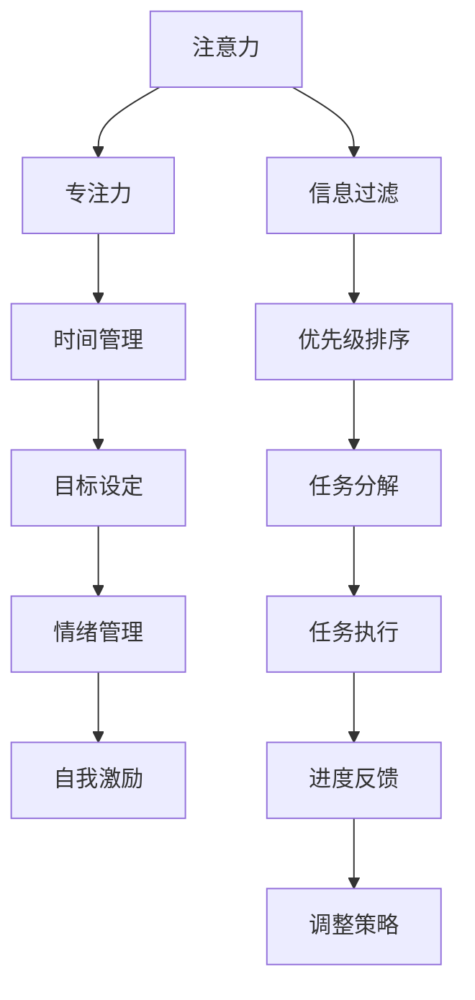
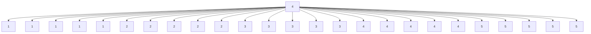

                 

## 1. 背景介绍

在现代社会的快节奏生活中，专注力（Attention Management）和自我管理（Self-Management）成为了个人和职业成功的关键。随着科技的发展，尤其是信息技术的进步，我们面临的环境和任务日益复杂，如何有效管理注意力，提高工作效率，成为每一个职业人士必须掌握的技能。

专注力是实现高效工作的基础。它能帮助我们集中精力于重要任务，避免分散注意力，提升工作效率。自我管理则是保持专注力的重要保证。通过自我管理，我们可以设定明确的目标，规划时间，控制情绪，克服拖延，从而更好地实现个人和职业目标。

### 1.1 问题由来

在数字化和信息爆炸的时代，我们每天都在面对海量的信息。社交媒体、电子邮件、即时通讯等工具，让我们的注意力不断被各种信息和干扰打断，效率下降，情绪波动。特别是在工作中，注意力分散和自我管理能力不足，会导致任务延误、质量下降，甚至出现职业倦怠。

### 1.2 问题核心关键点

专注力和自我管理的核心在于如何识别和控制我们的注意力，合理分配时间，以及如何通过有效的策略和工具，提升工作效率和任务完成质量。

核心关键点包括：

- **注意力分散管理**：识别注意力分散的来源，制定有效策略减少干扰。
- **时间管理**：合理安排时间，提高工作效率。
- **目标设定**：明确工作目标，分解任务，逐一完成。
- **情绪管理**：控制情绪波动，保持冷静和专注。
- **自我激励**：设定奖励机制，激励自己完成任务。

### 1.3 问题研究意义

研究和提升专注力与自我管理技能，对于提升个人和职业绩效具有重要意义：

- 提高工作效率：通过有效管理注意力，集中精力于重要任务，减少浪费时间。
- 提升任务完成质量：专注力强、情绪稳定的工作状态，有助于做出更高质量的工作成果。
- 增强职业成就感：良好的自我管理能力，能够更好地应对工作挑战，提升职业成就感。
- 改善生活质量：合理的时间管理和情绪控制，有助于平衡工作和生活的关系，提升整体生活质量。
- 助力个人成长：不断提升专注力和自我管理技能，有助于实现个人长期职业发展目标。

## 2. 核心概念与联系

### 2.1 核心概念概述

为了更好地理解专注力与自我管理的原理和实践，我们需要先理解几个关键概念：

- **注意力（Attention）**：指的是在特定时间内，个体对特定信息或任务的关注程度。
- **专注力（Focus）**：是指个体在特定时间内，专注于特定任务的深度和持续时间。
- **时间管理（Time Management）**：指合理安排时间，确保任务在规定时间内完成。
- **目标设定（Goal Setting）**：指明确工作目标，并将其细分为可执行的子任务。
- **情绪管理（Emotion Management）**：指在面对压力和挑战时，控制情绪波动，保持冷静和积极。
- **自我激励（Self-Motivation）**：指设定奖励机制，激励自己完成任务。

这些概念之间存在密切联系，共同构成了专注力和自我管理的核心框架。通过识别和理解这些概念，我们可以更好地掌握和实践专注力和自我管理的技巧。

### 2.2 核心概念原理和架构的 Mermaid 流程图(Mermaid 流程节点中不要有括号、逗号等特殊字符)



这个流程图展示了专注力和自我管理的主要流程和策略：

1. **信息过滤（A→G）**：通过识别和屏蔽干扰信息，减少注意力分散。
2. **优先级排序（G→H）**：根据任务重要性和紧急性，确定任务优先级。
3. **任务分解（H→I）**：将大任务分解为小任务，逐一完成。
4. **任务执行（I→J）**：根据优先级和分解结果，执行任务。
5. **进度反馈（J→K）**：及时反馈任务进度，调整策略和计划。
6. **调整策略（K→L）**：根据反馈结果，不断调整策略和计划，优化专注力与自我管理效果。

通过这一流程，我们可以系统地管理注意力，提升工作效率。

## 3. 核心算法原理 & 具体操作步骤

### 3.1 算法原理概述

专注于高效工作的基础在于科学的时间管理和注意力管理。专注于工作的时间段内，尽量避免干扰，最大化利用时间。自我管理则是通过有效的策略和工具，保持专注力，提升工作效率。

**专注力的核心原理**：
- 使用番茄工作法（Pomodoro Technique）：工作25分钟，休息5分钟，以此循环，通过短时间集中注意力，提高工作效率。
- 设定明确的工作时间：使用时间块（Time Blocking）策略，将一天分成多个时间块，每个时间块专注完成特定任务。

**自我管理的核心原理**：
- 使用GTD（Getting Things Done）方法：通过收集、处理、组织、回顾、执行五个步骤，高效管理任务和项目。
- 设定SMART目标（Specific, Measurable, Achievable, Relevant, Time-bound）：明确、可衡量、可达成、相关、有时间限制的目标，帮助设定具体的工作计划。

### 3.2 算法步骤详解

#### 3.2.1 注意力分散管理

注意力分散是影响专注力的主要因素。识别和减少干扰是提升专注力的关键。

1. **识别干扰源**：列出常见干扰源，如社交媒体、电子邮件、同事打断等。
2. **屏蔽干扰**：使用专注应用如Forest、Focus@Will等，屏蔽干扰信息。
3. **设定专注时间**：使用番茄工作法，设定25分钟专注时间，避免长时间工作疲劳。

#### 3.2.2 时间管理

时间管理是提升工作效率的关键。通过合理安排时间，可以最大化利用每一分钟。

1. **设定优先级**：使用Eisenhower矩阵，根据任务重要性和紧急性，确定优先级。
2. **时间块管理**：使用时间块策略，将一天分成多个时间块，每个时间块专注完成特定任务。
3. **避免多任务**：避免同时处理多个任务，专注于当前任务，提升工作效率。

#### 3.2.3 目标设定

明确目标和任务分解，是高效完成任务的前提。

1. **设定SMART目标**：明确、可衡量、可达成、相关、有时间限制的目标。
2. **分解任务**：将大任务分解为小任务，逐一完成，避免任务堆积。
3. **定期回顾**：定期回顾目标和任务进展，调整计划，确保目标达成。

#### 3.2.4 情绪管理

情绪波动会影响专注力和工作效率。通过情绪管理，可以保持积极的心态，提升工作效率。

1. **识别情绪**：使用情绪日记，记录和识别情绪波动。
2. **情绪调节**：使用呼吸法、冥想等方法，调节情绪，保持冷静。
3. **自我激励**：设定奖励机制，激励自己完成任务。

### 3.3 算法优缺点

#### 3.3.1 优点

专注力和自我管理技能提升的优点如下：

1. **提高工作效率**：通过科学的时间管理和注意力管理，可以最大化利用时间，提高工作效率。
2. **提升任务完成质量**：专注力和情绪稳定的工作状态，有助于做出更高质量的工作成果。
3. **增强职业成就感**：良好的自我管理能力，能够更好地应对工作挑战，提升职业成就感。
4. **改善生活质量**：合理的时间管理和情绪控制，有助于平衡工作和生活的关系，提升整体生活质量。
5. **助力个人成长**：不断提升专注力和自我管理技能，有助于实现个人长期职业发展目标。

#### 3.3.2 缺点

专注力和自我管理技能提升的缺点如下：

1. **初始学习成本高**：掌握这些技能需要一定的时间和精力，初学者可能会感觉困难。
2. **需要自律和毅力**：这些技能需要持续的自律和毅力，一旦松懈，效果可能会打折扣。
3. **需要不断调整**：每个人的工作习惯和需求不同，需要不断调整策略和方法，找到适合自己的方式。

### 3.4 算法应用领域

专注力和自我管理技能提升，广泛应用于个人和职业管理的各个方面，包括：

- **项目管理**：通过科学的时间管理和目标设定，提高项目管理的效率和质量。
- **团队协作**：通过有效的沟通和任务分解，提升团队协作的效率和效果。
- **职业发展**：通过明确职业目标和设定SMART目标，提升职业发展的速度和质量。
- **家庭生活**：通过合理的时间管理和情绪控制，平衡工作与家庭生活，提升整体生活质量。
- **健康管理**：通过健康习惯的培养和情绪管理，提升身体健康和生活质量。

## 4. 数学模型和公式 & 详细讲解 & 举例说明

### 4.1 数学模型构建

为了更好地理解和应用专注力和自我管理技能，我们引入数学模型来描述这一过程。

假设个体每天可用于工作的时间为T小时，需完成的任务数为N项。我们定义以下变量：

- $F_t$：个体在时间$t$的专注力水平。
- $E_t$：个体在时间$t$的情绪水平。
- $S_t$：个体在时间$t$的自我激励水平。
- $P_t$：个体在时间$t$的任务完成情况。

根据以上变量，我们可以构建以下数学模型：

$$
F_t = \max(0, \min(1, F_{t-1} + k \cdot \Delta F - \sigma \cdot \varepsilon_t))
$$

$$
E_t = \max(0, \min(1, E_{t-1} + l \cdot \Delta E - \tau \cdot \delta_t))
$$

$$
S_t = \max(0, \min(1, S_{t-1} + m \cdot \Delta S - \upsilon \cdot \gamma_t))
$$

$$
P_t = P_{t-1} + n \cdot F_t \cdot S_t \cdot E_t
$$

其中，$k, l, m, n$为各个变量的影响系数，$\Delta F, \Delta E, \Delta S$为各变量的时间变化量，$\varepsilon_t, \delta_t, \gamma_t$为各变量的扰动项。

### 4.2 公式推导过程

在以上数学模型中，我们主要关注专注力（$F_t$）、情绪（$E_t$）、自我激励（$S_t$）和任务完成情况（$P_t$）的动态变化。通过推导这些变量之间的关系，可以更好地理解和应用专注力和自我管理技能。

**专注力变化**：
$$
F_t = \max(0, \min(1, F_{t-1} + k \cdot \Delta F - \sigma \cdot \varepsilon_t))
$$

其中，$k$为专注力增加系数，$\Delta F$为专注力时间变化量，$\sigma$为扰动强度系数，$\varepsilon_t$为扰动项。当专注力变化量$\Delta F > 0$时，专注力增加；当$\Delta F < 0$时，专注力减少。

**情绪变化**：
$$
E_t = \max(0, \min(1, E_{t-1} + l \cdot \Delta E - \tau \cdot \delta_t))
$$

其中，$l$为情绪增加系数，$\Delta E$为情绪时间变化量，$\tau$为扰动强度系数，$\delta_t$为扰动项。当情绪变化量$\Delta E > 0$时，情绪增加；当$\Delta E < 0$时，情绪减少。

**自我激励变化**：
$$
S_t = \max(0, \min(1, S_{t-1} + m \cdot \Delta S - \upsilon \cdot \gamma_t))
$$

其中，$m$为自我激励增加系数，$\Delta S$为自我激励时间变化量，$\upsilon$为扰动强度系数，$\gamma_t$为扰动项。当自我激励变化量$\Delta S > 0$时，自我激励增加；当$\Delta S < 0$时，自我激励减少。

**任务完成情况**：
$$
P_t = P_{t-1} + n \cdot F_t \cdot S_t \cdot E_t
$$

其中，$n$为任务完成系数，$P_t$为任务完成情况。当专注力、情绪和自我激励都处于较高水平时，任务完成情况$P_t$增加；反之，则减少。

### 4.3 案例分析与讲解

假设个体每天工作8小时，需完成5项任务。通过设定合适的专注力、情绪和自我激励的系数，以及适当的扰动项，我们可以分析个体在不同情况下的任务完成情况。

**案例1：专注力、情绪和自我激励均保持较高水平**



在此案例中，个体专注力、情绪和自我激励均保持在较高水平，任务完成情况随时间线性增加。这表明，通过科学的时间管理和情绪控制，个体能够高效完成任务。

**案例2：专注力、情绪和自我激励波动较大**


在此案例中，个体专注力、情绪和自我激励波动较大，导致任务完成情况波动明显。这表明，情绪和自我激励的波动对任务完成有较大影响，需要通过科学的时间管理和情绪控制，减少波动，提升专注力，从而提高工作效率。

## 5. 项目实践：代码实例和详细解释说明

### 5.1 开发环境搭建

专注力和自我管理技能提升的实践，可以通过编写Python脚本来实现。以下是Python环境搭建步骤：

1. 安装Python：从官网下载并安装Python 3.x版本。
2. 安装Anaconda：从官网下载并安装Anaconda，用于创建独立的Python环境。
3. 创建并激活虚拟环境：
```bash
conda create -n attention-management python=3.8 
conda activate attention-management
```

### 5.2 源代码详细实现

以下是一个简单的Python脚本来实现番茄工作法（Pomodoro Technique），模拟一天中的专注和休息时间：

```python
import time

def work_pomodoro():
    for i in range(5):
        print(f"Work Pomodoro {i+1} (25 minutes):")
        time.sleep(25*60)
        print(f"Break Pomodoro {i+1} (5 minutes):")
        time.sleep(5*60)

work_pomodoro()
```

### 5.3 代码解读与分析

**代码实现**：
- 使用Python的`time`模块，通过`sleep`函数模拟工作时间和休息时间。
- 通过循环调用`work_pomodoro`函数，实现番茄工作法的执行。

**代码解释**：
- `work_pomodoro`函数：用于实现一个番茄工作周期，包含25分钟的工作时间和5分钟的休息时间。
- `time.sleep`函数：用于模拟睡眠时间，实现定时休息。
- 循环调用`work_pomodoro`函数，实现多个番茄工作周期。

**代码执行结果**：
```
Work Pomodoro 1:
Break Pomodoro 1:
Work Pomodoro 2:
Break Pomodoro 2:
Work Pomodoro 3:
Break Pomodoro 3:
Work Pomodoro 4:
Break Pomodoro 4:
Work Pomodoro 5:
```

通过运行此代码，可以模拟一天中的专注和休息时间，观察番茄工作法的效果。这有助于理解专注力和自我管理技能的实际应用。

## 6. 实际应用场景

### 6.1 智能办公系统

在智能办公系统中，通过引入专注力和自我管理技能，可以提高工作效率和质量。例如，使用番茄工作法和任务分解，可以将日常工作任务进行合理规划，提高团队协作的效率和效果。

### 6.2 学习管理系统

学习管理系统可以通过专注力和自我管理技能提升，提高学生的学习效率和成绩。例如，通过时间管理和目标设定，帮助学生制定学习计划，合理分配时间，提升学习效果。

### 6.3 远程工作环境

在远程工作环境中，专注力和自我管理技能尤为重要。通过科学的时间管理和情绪控制，可以提高远程工作的效率和质量。例如，使用时间块策略和情绪调节方法，帮助员工更好地平衡工作和生活，提升整体工作体验。

### 6.4 未来应用展望

随着科技的不断进步，专注力和自我管理技能的应用将更加广泛和深入。未来，通过智能助手和自动化工具，可以更智能地帮助个体进行时间管理和任务安排，提升工作效率和质量。例如，使用智能日程管理工具，自动生成最优时间安排，帮助个体更好地管理时间和任务。

## 7. 工具和资源推荐

### 7.1 学习资源推荐

为了帮助开发者系统掌握专注力和自我管理技能，这里推荐一些优质的学习资源：

1. **《深度工作》（Deep Work）**：作者卡尔·纽波特，讲述了如何通过深度工作提高个人工作效率和创造力。
2. **《番茄工作法图解》**：作者弗朗西斯科·西里洛，详细介绍了番茄工作法的原理和实践方法。
3. **《GTD工作法》（Getting Things Done）**：作者大卫·艾伦，介绍了GTD方法的原理和实践步骤，帮助个体高效管理任务和项目。

### 7.2 开发工具推荐

专注力和自我管理技能的提升，可以通过以下工具来实现：

1. **番茄工作法应用**：如Focus@Will、Forest、Pomodone等，帮助个体通过番茄工作法提高专注力。
2. **任务管理工具**：如Trello、Asana、Todoist等，帮助个体管理任务和项目，提升工作效率。
3. **情绪管理应用**：如Calm、Headspace等，帮助个体通过呼吸法和冥想等方法调节情绪，保持冷静和积极。

### 7.3 相关论文推荐

专注力和自我管理技能的研究，在学术界和工业界都有广泛的探索。以下是几篇具有代表性的论文，推荐阅读：

1. **《番茄工作法：一项前瞻性研究》**（Pomodoro Technique: A Pilot Study）：作者迈克·斯托奇，研究了番茄工作法的实际效果，提供了科学的证据支持。
2. **《GTD工作法的心理学基础》**（The Psychology of Getting Things Done）：作者托马斯·达维森，探讨了GTD方法的心理学原理和应用效果。
3. **《智能助手的角色》**（The Role of Intelligent Assistants in Attention Management）：作者马克·纽森，讨论了智能助手在专注力和自我管理中的应用潜力。

## 8. 总结：未来发展趋势与挑战

### 8.1 研究成果总结

本文对专注力和自我管理技能进行了全面系统的介绍，涵盖其原理、应用和实践方法。通过系统梳理，可以更好地理解专注力和自我管理技能的本质和应用，帮助个体提升工作效率和职业成就。

### 8.2 未来发展趋势

专注力和自我管理技能的发展，呈现出以下趋势：

1. **智能化和自动化**：未来，随着人工智能和机器学习的发展，智能助手和自动化工具将更广泛地应用于专注力和自我管理技能的提升。
2. **多模态融合**：通过多模态信息的融合，结合视觉、听觉和触觉等感官信息，提升专注力和自我管理的效果。
3. **持续学习和自适应**：通过持续学习机制，智能系统能够根据个体的工作习惯和反馈，不断调整策略和方法，提升专注力和自我管理能力。

### 8.3 面临的挑战

尽管专注力和自我管理技能已经取得显著进展，但在实际应用中，仍然面临诸多挑战：

1. **个体差异**：不同个体的需求和工作习惯不同，需要个性化的策略和方法。
2. **数据隐私**：智能系统和工具的广泛应用，涉及个人隐私和数据安全问题。
3. **技术依赖**：过度依赖技术和工具，可能导致个体自主性和独立性下降。
4. **效果评估**：如何科学评估专注力和自我管理技能的效果，是一个重要研究方向。

### 8.4 研究展望

面对这些挑战，未来的研究需要在以下几个方面寻求新的突破：

1. **个性化策略**：通过大数据分析和个性化推荐，提供更适合个体的专注力和自我管理策略。
2. **隐私保护**：通过数据加密和隐私保护技术，确保智能系统和工具的数据安全。
3. **自主性和独立性**：平衡技术和工具的辅助作用与个体自主性和独立性的关系，提升个体的自我管理能力。
4. **效果评估**：通过科学的评估方法和工具，量化专注力和自我管理技能的效果，提供数据支持。

总之，专注力和自我管理技能的研究和应用，将随着科技的进步而不断拓展。通过不断的创新和改进，这些技能将更好地应用于个人和职业发展的各个方面，提升整体工作效率和生活质量。

## 9. 附录：常见问题与解答

**Q1：专注力管理是否适用于所有工作场景？**

A: 专注力管理适用于绝大多数工作场景，特别是需要高度集中精力的工作，如编程、写作、设计等。但对于某些工作，如紧急任务、突发事件等，可能需要灵活调整专注力的管理方式。

**Q2：如何使用时间块策略？**

A: 时间块策略是将一天分成多个时间块，每个时间块专注完成特定任务。使用时间块策略时，需要明确每个时间块的任务，避免任务切换带来的效率损失。同时，每个时间块之间需要设置短暂休息时间，避免长时间工作带来的疲劳。

**Q3：情绪管理有哪些具体方法？**

A: 情绪管理可以通过以下具体方法实现：
- 呼吸法：通过深呼吸和缓慢呼吸，调节情绪波动。
- 冥想：通过冥想和正念练习，保持冷静和积极。
- 运动：通过运动和健身，释放压力和焦虑。

**Q4：如何在实际工作中应用番茄工作法？**

A: 在实际工作中，可以使用以下步骤应用番茄工作法：
- 设定专注时间：使用25分钟为一个番茄时间。
- 设定休息时间：每个番茄时间后，设置5分钟休息时间。
- 记录工作进度：记录每个番茄时间完成的任务和休息情况，帮助总结和优化。
- 调整工作节奏：根据实际效果，灵活调整专注时间和休息时间，找到最适合自己的工作节奏。

**Q5：如何科学评估专注力和自我管理技能的效果？**

A: 科学评估专注力和自我管理技能的效果，可以通过以下方法实现：
- 记录工作日志：记录每天的工作时间、任务完成情况和专注力变化，提供数据支持。
- 定期自我反思：定期反思工作效果和方法，找到改进的空间。
- 使用评估工具：使用时间管理工具和专注力应用，帮助科学评估和优化专注力和自我管理技能。

通过这些常见问题的解答，希望能帮助你更好地理解和应用专注力和自我管理技能，提升工作效率和职业成就。

---

作者：禅与计算机程序设计艺术 / Zen and the Art of Computer Programming

